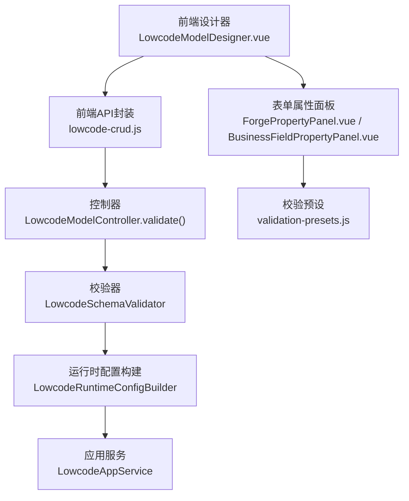
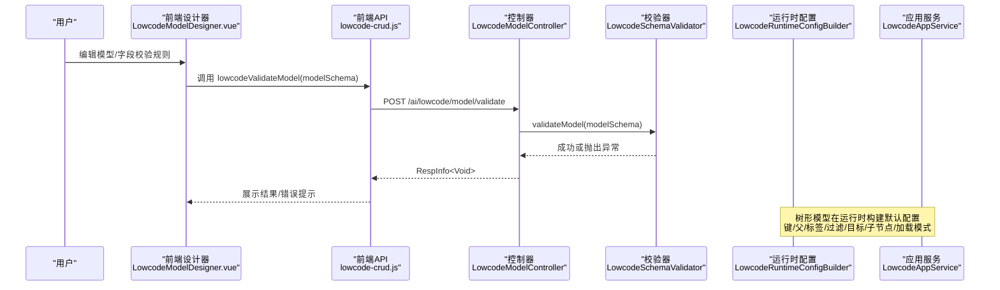
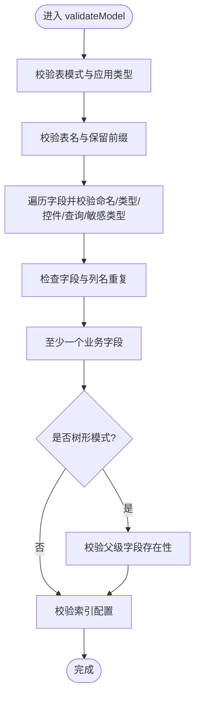
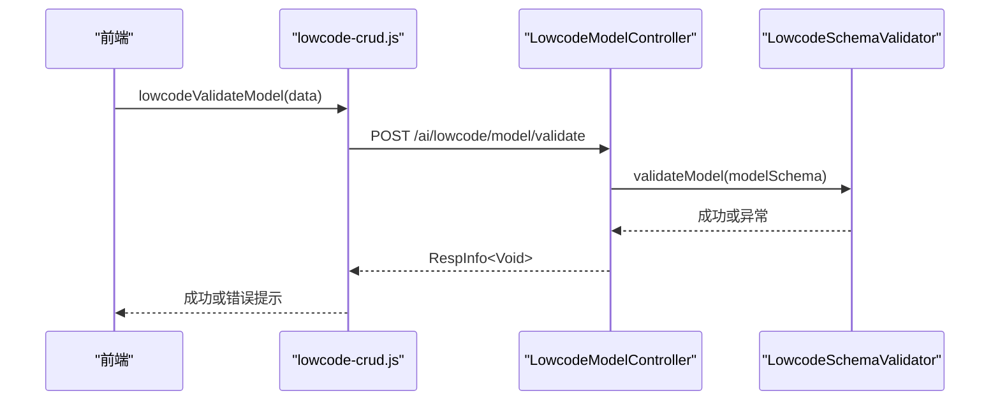
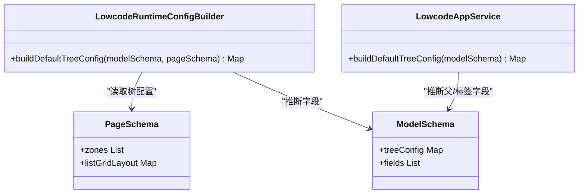
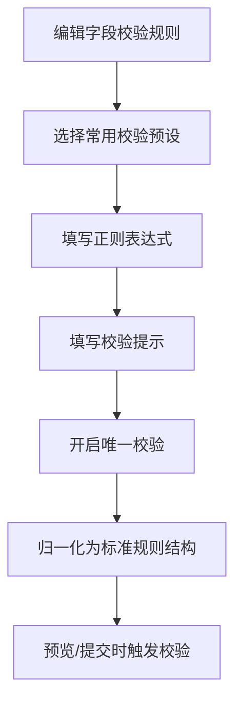
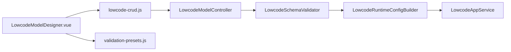

# 校验规则

<cite>
**本文引用的文件**
- [LowcodeModelController.java](file://forge-server/forge-framework/forge-plugin-parent/forge-plugin-generator/src/main/java/com/mdframe/forge/plugin/generator/controller/LowcodeModelController.java)
- [LowcodeSchemaValidator.java](file://forge-server/forge-framework/forge-plugin-parent/forge-plugin-generator/src/main/java/com/mdframe/forge/plugin/generator/service/lowcode/LowcodeSchemaValidator.java)
- [BusinessExtensionValidationService.java](file://forge-server/forge-framework/forge-plugin-parent/forge-plugin-generator/src/main/java/com/mdframe/forge/plugin/generator/service/businessapp/BusinessExtensionValidationService.java)
- [LowcodeRuntimeConfigBuilder.java](file://forge-server/forge-framework/forge-plugin-parent/forge-plugin-generator/src/main/java/com/mdframe/forge/plugin/generator/service/lowcode/LowcodeRuntimeConfigBuilder.java)
- [LowcodeAppService.java](file://forge-server/forge-framework/forge-plugin-parent/forge-plugin-generator/src/main/java/com/mdframe/forge/plugin/generator/service/lowcode/LowcodeAppService.java)
- [page-schema.js](file://forge-admin-ui/src/components/lowcode-builder/page/page-schema.js)
- [LowcodeModelDesigner.vue](file://forge-admin-ui/src/components/lowcode-builder/model/LowcodeModelDesigner.vue)
- [BusinessFieldPropertyPanel.vue](file://forge-admin-ui/src/views/app-center/components/designer/BusinessFieldPropertyPanel.vue)
- [ForgePropertyPanel.vue](file://forge-admin-ui/src/views/app-center/components/designer/forge-form-designer/ForgePropertyPanel.vue)
- [validation-presets.js](file://forge-admin-ui/src/utils/validation-presets.js)
- [formCreateBridge.js](file://forge-admin-ui/src/components/form-create/formCreateBridge.js)
- [lowcode-crud.js](file://forge-admin-ui/src/api/lowcode-crud.js)
</cite>

## 目录
1. [简介](#简介)
2. [项目结构](#项目结构)
3. [核心组件](#核心组件)
4. [架构总览](#架构总览)
5. [详细组件分析](#详细组件分析)
6. [依赖关系分析](#依赖关系分析)
7. [性能考量](#性能考量)
8. [故障排查指南](#故障排查指南)
9. [结论](#结论)
10. [附录](#附录)

## 简介
本技术文档围绕低代码平台的“校验规则系统”展开，覆盖以下关键主题：
- 模型校验规则的配置界面：数据范围策略、树形模型配置与业务规则定义。
- 后端校验API实现：以 lowcodeValidateModel 接口为核心，说明参数校验、业务规则检查与数据一致性验证。
- 执行机制：前端实时校验、服务端校验与错误处理流程。
- 树形模型特殊配置：父子关系定义、加载模式选择与性能优化策略。
- 复杂业务场景下的校验设计模式：跨字段校验、异步校验与自定义校验函数的实现方案。

## 项目结构
校验规则系统横跨前后端：
- 前端（Vue）提供模型设计器与表单属性面板，支持数据范围策略、树形模型配置、字段级校验规则（必填、正则、唯一等）。
- 后端（Spring）提供模型校验入口与运行时配置构建，确保模型结构、索引、树形配置与页面引用的一致性。

**图表来源**
- [LowcodeModelController.java:93-98](file://forge-server/forge-framework/forge-plugin-parent/forge-plugin-generator/src/main/java/com/mdframe/forge/plugin/generator/controller/LowcodeModelController.java#L93-L98)
- [LowcodeSchemaValidator.java:58-102](file://forge-server/forge-framework/forge-plugin-parent/forge-plugin-generator/src/main/java/com/mdframe/forge/plugin/generator/service/lowcode/LowcodeSchemaValidator.java#L58-L102)
- [LowcodeRuntimeConfigBuilder.java:867-885](file://forge-server/forge-framework/forge-plugin-parent/forge-plugin-generator/src/main/java/com/mdframe/forge/plugin/generator/service/lowcode/LowcodeRuntimeConfigBuilder.java#L867-L885)
- [LowcodeAppService.java:194-222](file://forge-server/forge-framework/forge-plugin-parent/forge-plugin-generator/src/main/java/com/mdframe/forge/plugin/generator/service/lowcode/LowcodeAppService.java#L194-L222)
- [LowcodeModelDesigner.vue:199-261](file://forge-admin-ui/src/components/lowcode-builder/model/LowcodeModelDesigner.vue#L199-L261)
- [ForgePropertyPanel.vue:1432-1487](file://forge-admin-ui/src/views/app-center/components/designer/forge-form-designer/ForgePropertyPanel.vue#L1432-L1487)
- [BusinessFieldPropertyPanel.vue:183-203](file://forge-admin-ui/src/views/app-center/components/designer/BusinessFieldPropertyPanel.vue#L183-L203)
- [validation-presets.js:1-60](file://forge-admin-ui/src/utils/validation-presets.js#L1-L60)
- [lowcode-crud.js:222-224](file://forge-admin-ui/src/api/lowcode-crud.js#L222-L224)

**章节来源**
- [LowcodeModelController.java:93-98](file://forge-server/forge-framework/forge-plugin-parent/forge-plugin-generator/src/main/java/com/mdframe/forge/plugin/generator/controller/LowcodeModelController.java#L93-L98)
- [LowcodeSchemaValidator.java:58-102](file://forge-server/forge-framework/forge-plugin-parent/forge-plugin-generator/src/main/java/com/mdframe/forge/plugin/generator/service/lowcode/LowcodeSchemaValidator.java#L58-L102)
- [LowcodeRuntimeConfigBuilder.java:867-885](file://forge-server/forge-framework/forge-plugin-parent/forge-plugin-generator/src/main/java/com/mdframe/forge/plugin/generator/service/lowcode/LowcodeRuntimeConfigBuilder.java#L867-L885)
- [LowcodeAppService.java:194-222](file://forge-server/forge-framework/forge-plugin-parent/forge-plugin-generator/src/main/java/com/mdframe/forge/plugin/generator/service/lowcode/LowcodeAppService.java#L194-L222)
- [LowcodeModelDesigner.vue:199-261](file://forge-admin-ui/src/components/lowcode-builder/model/LowcodeModelDesigner.vue#L199-L261)
- [ForgePropertyPanel.vue:1432-1487](file://forge-admin-ui/src/views/app-center/components/designer/forge-form-designer/ForgePropertyPanel.vue#L1432-L1487)
- [BusinessFieldPropertyPanel.vue:183-203](file://forge-admin-ui/src/views/app-center/components/designer/BusinessFieldPropertyPanel.vue#L183-L203)
- [validation-presets.js:1-60](file://forge-admin-ui/src/utils/validation-presets.js#L1-L60)
- [lowcode-crud.js:222-224](file://forge-admin-ui/src/api/lowcode-crud.js#L222-L224)

## 核心组件
- 模型校验器（LowcodeSchemaValidator）：负责数据模型、字段、索引、树形运行时配置的合法性校验，保证表名、字段名、列名、数据类型、查询方式、敏感类型等符合规范；在树形模式下校验父级字段与显示字段的有效性。
- 控制器（LowcodeModelController）：暴露 /ai/lowcode/model/validate 接口，接收 LowcodeModelSchema 并调用校验器进行服务端校验。
- 运行时配置构建（LowcodeRuntimeConfigBuilder 与 LowcodeAppService）：为树形模型生成默认树配置（键字段、父字段、标签字段、过滤/目标字段、子节点字段、加载模式、标题），并在页面渲染时推断或补全必要字段。
- 扩展内容校验（BusinessExtensionValidationService）：对可视化规则、客户端脚本、作用域样式与服务端绑定进行安全与格式校验，保障扩展内容的安全性与可用性。
- 前端设计器与属性面板：提供数据范围策略、树形模型配置、字段级校验规则（必填、正则、唯一、预设规则）的可视化编辑能力。

**章节来源**
- [LowcodeSchemaValidator.java:58-102](file://forge-server/forge-framework/forge-plugin-parent/forge-plugin-generator/src/main/java/com/mdframe/forge/plugin/generator/service/lowcode/LowcodeSchemaValidator.java#L58-L102)
- [LowcodeModelController.java:93-98](file://forge-server/forge-framework/forge-plugin-parent/forge-plugin-generator/src/main/java/com/mdframe/forge/plugin/generator/controller/LowcodeModelController.java#L93-L98)
- [LowcodeRuntimeConfigBuilder.java:867-885](file://forge-server/forge-framework/forge-plugin-parent/forge-plugin-generator/src/main/java/com/mdframe/forge/plugin/generator/service/lowcode/LowcodeRuntimeConfigBuilder.java#L867-L885)
- [LowcodeAppService.java:194-222](file://forge-server/forge-framework/forge-plugin-parent/forge-plugin-generator/src/main/java/com/mdframe/forge/plugin/generator/service/lowcode/LowcodeAppService.java#L194-L222)
- [BusinessExtensionValidationService.java:79-142](file://forge-server/forge-framework/forge-plugin-parent/forge-plugin-generator/src/main/java/com/mdframe/forge/plugin/generator/service/businessapp/BusinessExtensionValidationService.java#L79-L142)
- [LowcodeModelDesigner.vue:199-261](file://forge-admin-ui/src/components/lowcode-builder/model/LowcodeModelDesigner.vue#L199-L261)
- [ForgePropertyPanel.vue:1432-1487](file://forge-admin-ui/src/views/app-center/components/designer/forge-form-designer/ForgePropertyPanel.vue#L1432-L1487)
- [BusinessFieldPropertyPanel.vue:183-203](file://forge-admin-ui/src/views/app-center/components/designer/BusinessFieldPropertyPanel.vue#L183-L203)

## 架构总览
校验规则系统的端到端流程如下：
- 前端在设计器中编辑模型与字段校验规则，必要时调用 lowcodeValidateModel 进行服务端预校验。
- 控制器将请求转发至校验器，校验器对模型结构、字段、索引、树形配置进行严格校验。
- 若启用树形模型，运行时配置构建器会推导或补全树形相关字段与加载模式，确保渲染一致性与性能。
- 扩展内容（可视化规则、客户端脚本、样式、服务端绑定）通过扩展校验服务进行安全与格式校验。

**图表来源**
- [LowcodeModelController.java:93-98](file://forge-server/forge-framework/forge-plugin-parent/forge-plugin-generator/src/main/java/com/mdframe/forge/plugin/generator/controller/LowcodeModelController.java#L93-L98)
- [LowcodeSchemaValidator.java:58-102](file://forge-server/forge-framework/forge-plugin-parent/forge-plugin-generator/src/main/java/com/mdframe/forge/plugin/generator/service/lowcode/LowcodeSchemaValidator.java#L58-L102)
- [LowcodeRuntimeConfigBuilder.java:867-885](file://forge-server/forge-framework/forge-plugin-parent/forge-plugin-generator/src/main/java/com/mdframe/forge/plugin/generator/service/lowcode/LowcodeRuntimeConfigBuilder.java#L867-L885)
- [LowcodeAppService.java:194-222](file://forge-server/forge-framework/forge-plugin-parent/forge-plugin-generator/src/main/java/com/mdframe/forge/plugin/generator/service/lowcode/LowcodeAppService.java#L194-L222)
- [lowcode-crud.js:222-224](file://forge-admin-ui/src/api/lowcode-crud.js#L222-L224)

## 详细组件分析

### 模型校验器（LowcodeSchemaValidator）
- 职责：校验数据模型与应用类型、表名与字段命名、数据类型与控件类型、查询方式与敏感类型；校验索引名称与字段引用；在树形模式下校验父级字段与显示字段有效性。
- 关键点：
  - 表名与字段名需满足命名规范且避免系统保留前缀与基础审计字段冲突。
  - 索引类型仅允许 NORMAL/UNIQUE，索引名唯一且字段必须存在且非系统字段。
  - 树形运行时校验：当 appType=TREE 或启用 treeConfig 或页面布局包含 tree-panel/table 树配置时，强制要求父级字段有效，并校验显示字段是否存在于模型或页面引用中。

**图表来源**
- [LowcodeSchemaValidator.java:58-102](file://forge-server/forge-framework/forge-plugin-parent/forge-plugin-generator/src/main/java/com/mdframe/forge/plugin/generator/service/lowcode/LowcodeSchemaValidator.java#L58-L102)
- [LowcodeSchemaValidator.java:127-178](file://forge-server/forge-framework/forge-plugin-parent/forge-plugin-generator/src/main/java/com/mdframe/forge/plugin/generator/service/lowcode/LowcodeSchemaValidator.java#L127-L178)
- [LowcodeSchemaValidator.java:205-233](file://forge-server/forge-framework/forge-plugin-parent/forge-plugin-generator/src/main/java/com/mdframe/forge/plugin/generator/service/lowcode/LowcodeSchemaValidator.java#L205-L233)
- [LowcodeSchemaValidator.java:306-334](file://forge-server/forge-framework/forge-plugin-parent/forge-plugin-generator/src/main/java/com/mdframe/forge/plugin/generator/service/lowcode/LowcodeSchemaValidator.java#L306-L334)

**章节来源**
- [LowcodeSchemaValidator.java:58-102](file://forge-server/forge-framework/forge-plugin-parent/forge-plugin-generator/src/main/java/com/mdframe/forge/plugin/generator/service/lowcode/LowcodeSchemaValidator.java#L58-L102)
- [LowcodeSchemaValidator.java:127-178](file://forge-server/forge-framework/forge-plugin-parent/forge-plugin-generator/src/main/java/com/mdframe/forge/plugin/generator/service/lowcode/LowcodeSchemaValidator.java#L127-L178)
- [LowcodeSchemaValidator.java:205-233](file://forge-server/forge-framework/forge-plugin-parent/forge-plugin-generator/src/main/java/com/mdframe/forge/plugin/generator/service/lowcode/LowcodeSchemaValidator.java#L205-L233)
- [LowcodeSchemaValidator.java:306-334](file://forge-server/forge-framework/forge-plugin-parent/forge-plugin-generator/src/main/java/com/mdframe/forge/plugin/generator/service/lowcode/LowcodeSchemaValidator.java#L306-L334)

### 后端校验API（LowcodeModelController.validate）
- 接口路径：POST /ai/lowcode/model/validate
- 入参：LowcodeModelSchema（包含模型基本信息、字段、索引、树形配置等）
- 行为：调用 LowcodeSchemaValidator.validateModel 进行服务端校验，返回统一响应体。
- 错误处理：校验失败抛出业务异常，由全局异常处理器转换为错误响应。

**图表来源**
- [LowcodeModelController.java:93-98](file://forge-server/forge-framework/forge-plugin-parent/forge-plugin-generator/src/main/java/com/mdframe/forge/plugin/generator/controller/LowcodeModelController.java#L93-L98)
- [lowcode-crud.js:222-224](file://forge-admin-ui/src/api/lowcode-crud.js#L222-L224)

**章节来源**
- [LowcodeModelController.java:93-98](file://forge-server/forge-framework/forge-plugin-parent/forge-plugin-generator/src/main/java/com/mdframe/forge/plugin/generator/controller/LowcodeModelController.java#L93-L98)
- [lowcode-crud.js:222-224](file://forge-admin-ui/src/api/lowcode-crud.js#L222-L224)

### 树形模型配置与运行时构建
- 前端配置项：启用树形数据、主键字段、父级字段、显示字段、加载方式（full/其他）。
- 后端默认构建：
  - LowcodeRuntimeConfigBuilder：根据页面与模型推断 labelField、filterField、targetField，设置 childrenField 与 loadMode 默认值。
  - LowcodeAppService：当未显式配置时，自动推断 parentField 与 labelField，并生成默认树配置。
- 性能优化策略：
  - 使用 loadMode 控制加载策略（如 full 表示全量加载），结合 filterField/targetField 减少不必要的数据传输。
  - 合理选择 keyField/parentField/labelField，避免冗余字段参与渲染与查询。

**图表来源**
- [LowcodeRuntimeConfigBuilder.java:867-885](file://forge-server/forge-framework/forge-plugin-parent/forge-plugin-generator/src/main/java/com/mdframe/forge/plugin/generator/service/lowcode/LowcodeRuntimeConfigBuilder.java#L867-L885)
- [LowcodeAppService.java:194-222](file://forge-server/forge-framework/forge-plugin-parent/forge-plugin-generator/src/main/java/com/mdframe/forge/plugin/generator/service/lowcode/LowcodeAppService.java#L194-L222)
- [page-schema.js:779-805](file://forge-admin-ui/src/components/lowcode-builder/page/page-schema.js#L779-L805)

**章节来源**
- [LowcodeRuntimeConfigBuilder.java:867-885](file://forge-server/forge-framework/forge-plugin-parent/forge-plugin-generator/src/main/java/com/mdframe/forge/plugin/generator/service/lowcode/LowcodeRuntimeConfigBuilder.java#L867-L885)
- [LowcodeAppService.java:194-222](file://forge-server/forge-framework/forge-plugin-parent/forge-plugin-generator/src/main/java/com/mdframe/forge/plugin/generator/service/lowcode/LowcodeAppService.java#L194-L222)
- [page-schema.js:779-805](file://forge-admin-ui/src/components/lowcode-builder/page/page-schema.js#L779-L805)
- [LowcodeModelDesigner.vue:238-259](file://forge-admin-ui/src/components/lowcode-builder/model/LowcodeModelDesigner.vue#L238-L259)

### 前端校验规则配置
- 数据范围策略：在模型设计器的“校验规则”页签中配置 dataScope、userField/orgField/regionField 等，用于数据权限与范围控制。
- 字段级校验：
  - 必填开关与必填错误提示。
  - 常用校验预设（手机号、邮箱、身份证、银行卡、固话、统一社会信用代码、整数、非负数、网址等）。
  - 正则表达式与自定义提示。
  - 唯一校验开关（advancedProps.unique）。
- 校验规则归一化：formCreateBridge 将 legacy rules 规范化为统一的 validation 结构，确保必填与触发时机一致。

**图表来源**
- [BusinessFieldPropertyPanel.vue:183-203](file://forge-admin-ui/src/views/app-center/components/designer/BusinessFieldPropertyPanel.vue#L183-L203)
- [ForgePropertyPanel.vue:1432-1487](file://forge-admin-ui/src/views/app-center/components/designer/forge-form-designer/ForgePropertyPanel.vue#L1432-L1487)
- [validation-presets.js:1-60](file://forge-admin-ui/src/utils/validation-presets.js#L1-L60)
- [formCreateBridge.js:228-248](file://forge-admin-ui/src/components/form-create/formCreateBridge.js#L228-L248)

**章节来源**
- [LowcodeModelDesigner.vue:199-261](file://forge-admin-ui/src/components/lowcode-builder/model/LowcodeModelDesigner.vue#L199-L261)
- [BusinessFieldPropertyPanel.vue:183-203](file://forge-admin-ui/src/views/app-center/components/designer/BusinessFieldPropertyPanel.vue#L183-L203)
- [ForgePropertyPanel.vue:1432-1487](file://forge-admin-ui/src/views/app-center/components/designer/forge-form-designer/ForgePropertyPanel.vue#L1432-L1487)
- [validation-presets.js:1-60](file://forge-admin-ui/src/utils/validation-presets.js#L1-L60)
- [formCreateBridge.js:228-248](file://forge-admin-ui/src/components/form-create/formCreateBridge.js#L228-L248)

### 业务规则与扩展校验
- 可视化规则：校验 conditions/actions 的结构、匹配方式（ALL/ANY）、字段与操作符合法性、动作参数完整性。
- 客户端脚本：禁止危险API、模板字符串、动态模块加载、明文密钥，限制长度。
- 作用域样式：禁止全局或外部资源规则，确保选择器限定到应用与页面作用域。
- 服务端绑定：校验处理器注册与钩子允许范围，禁止保存敏感信息。

**章节来源**
- [BusinessExtensionValidationService.java:79-142](file://forge-server/forge-framework/forge-plugin-parent/forge-plugin-generator/src/main/java/com/mdframe/forge/plugin/generator/service/businessapp/BusinessExtensionValidationService.java#L79-L142)
- [BusinessExtensionValidationService.java:144-166](file://forge-server/forge-framework/forge-plugin-parent/forge-plugin-generator/src/main/java/com/mdframe/forge/plugin/generator/service/businessapp/BusinessExtensionValidationService.java#L144-L166)
- [BusinessExtensionValidationService.java:168-194](file://forge-server/forge-framework/forge-plugin-parent/forge-plugin-generator/src/main/java/com/mdframe/forge/plugin/generator/service/businessapp/BusinessExtensionValidationService.java#L168-L194)
- [BusinessExtensionValidationService.java:196-220](file://forge-server/forge-framework/forge-plugin-parent/forge-plugin-generator/src/main/java/com/mdframe/forge/plugin/generator/service/businessapp/BusinessExtensionValidationService.java#L196-L220)

## 依赖关系分析
- 控制器依赖校验器，校验器依赖模型与页面结构信息。
- 运行时配置构建依赖页面与模型，生成树形渲染所需字段与加载策略。
- 前端设计器依赖API封装与校验预设，提供可视化编辑与即时反馈。

**图表来源**
- [LowcodeModelController.java:93-98](file://forge-server/forge-framework/forge-plugin-parent/forge-plugin-generator/src/main/java/com/mdframe/forge/plugin/generator/controller/LowcodeModelController.java#L93-L98)
- [LowcodeSchemaValidator.java:58-102](file://forge-server/forge-framework/forge-plugin-parent/forge-plugin-generator/src/main/java/com/mdframe/forge/plugin/generator/service/lowcode/LowcodeSchemaValidator.java#L58-L102)
- [LowcodeRuntimeConfigBuilder.java:867-885](file://forge-server/forge-framework/forge-plugin-parent/forge-plugin-generator/src/main/java/com/mdframe/forge/plugin/generator/service/lowcode/LowcodeRuntimeConfigBuilder.java#L867-L885)
- [LowcodeAppService.java:194-222](file://forge-server/forge-framework/forge-plugin-parent/forge-plugin-generator/src/main/java/com/mdframe/forge/plugin/generator/service/lowcode/LowcodeAppService.java#L194-L222)
- [LowcodeModelDesigner.vue:199-261](file://forge-admin-ui/src/components/lowcode-builder/model/LowcodeModelDesigner.vue#L199-L261)
- [validation-presets.js:1-60](file://forge-admin-ui/src/utils/validation-presets.js#L1-L60)
- [lowcode-crud.js:222-224](file://forge-admin-ui/src/api/lowcode-crud.js#L222-L224)

**章节来源**
- [LowcodeModelController.java:93-98](file://forge-server/forge-framework/forge-plugin-parent/forge-plugin-generator/src/main/java/com/mdframe/forge/plugin/generator/controller/LowcodeModelController.java#L93-L98)
- [LowcodeSchemaValidator.java:58-102](file://forge-server/forge-framework/forge-plugin-parent/forge-plugin-generator/src/main/java/com/mdframe/forge/plugin/generator/service/lowcode/LowcodeSchemaValidator.java#L58-L102)
- [LowcodeRuntimeConfigBuilder.java:867-885](file://forge-server/forge-framework/forge-plugin-parent/forge-plugin-generator/src/main/java/com/mdframe/forge/plugin/generator/service/lowcode/LowcodeRuntimeConfigBuilder.java#L867-L885)
- [LowcodeAppService.java:194-222](file://forge-server/forge-framework/forge-plugin-parent/forge-plugin-generator/src/main/java/com/mdframe/forge/plugin/generator/service/lowcode/LowcodeAppService.java#L194-L222)
- [LowcodeModelDesigner.vue:199-261](file://forge-admin-ui/src/components/lowcode-builder/model/LowcodeModelDesigner.vue#L199-L261)
- [validation-presets.js:1-60](file://forge-admin-ui/src/utils/validation-presets.js#L1-L60)
- [lowcode-crud.js:222-224](file://forge-admin-ui/src/api/lowcode-crud.js#L222-L224)

## 性能考量
- 树形加载模式：优先选择按需加载（如 lazy/full）并结合 filterField/targetField 精准过滤，减少数据传输与渲染开销。
- 字段选择：keyField/parentField/labelField 应精简且具备良好区分度，避免冗余字段参与查询与渲染。
- 校验前置：在前端进行快速校验（必填、正则、预设），降低无效请求到达后端的概率。
- 扩展内容安全：对客户端脚本与样式进行白名单与长度限制，防止恶意或过大内容影响性能与安全。

[本节为通用指导，不直接分析具体文件]

## 故障排查指南
- 模型校验失败：
  - 检查表名与字段名是否符合命名规范，避免系统保留前缀与基础审计字段冲突。
  - 确认树形模式下父级字段与显示字段已正确配置且存在于模型或页面引用中。
  - 索引名称唯一且字段引用合法，避免系统字段作为自定义索引字段。
- 树形渲染异常：
  - 核对 loadMode 与 filterField/targetField 配置是否与数据源字段一致。
  - 确认 keyField/parentField/labelField 映射正确，childrenField 默认值为 "children"。
- 扩展内容校验失败：
  - 可视化规则 JSON 结构不完整或字段/操作符非法。
  - 客户端脚本包含禁止API或明文密钥，超过大小限制。
  - 作用域样式未限定到应用与页面作用域，或包含不允许的规则。
- 前端校验不生效：
  - 检查表单属性面板中的必填、正则、唯一校验是否已配置。
  - 确认规则已归一化为标准结构，触发时机为 blur/change。

**章节来源**
- [LowcodeSchemaValidator.java:58-102](file://forge-server/forge-framework/forge-plugin-parent/forge-plugin-generator/src/main/java/com/mdframe/forge/plugin/generator/service/lowcode/LowcodeSchemaValidator.java#L58-L102)
- [LowcodeSchemaValidator.java:306-334](file://forge-server/forge-framework/forge-plugin-parent/forge-plugin-generator/src/main/java/com/mdframe/forge/plugin/generator/service/lowcode/LowcodeSchemaValidator.java#L306-L334)
- [BusinessExtensionValidationService.java:79-142](file://forge-server/forge-framework/forge-plugin-parent/forge-plugin-generator/src/main/java/com/mdframe/forge/plugin/generator/service/businessapp/BusinessExtensionValidationService.java#L79-L142)
- [BusinessExtensionValidationService.java:144-166](file://forge-server/forge-framework/forge-plugin-parent/forge-plugin-generator/src/main/java/com/mdframe/forge/plugin/generator/service/businessapp/BusinessExtensionValidationService.java#L144-L166)
- [BusinessExtensionValidationService.java:168-194](file://forge-server/forge-framework/forge-plugin-parent/forge-plugin-generator/src/main/java/com/mdframe/forge/plugin/generator/service/businessapp/BusinessExtensionValidationService.java#L168-L194)
- [ForgePropertyPanel.vue:1432-1487](file://forge-admin-ui/src/views/app-center/components/designer/forge-form-designer/ForgePropertyPanel.vue#L1432-L1487)
- [formCreateBridge.js:228-248](file://forge-admin-ui/src/components/form-create/formCreateBridge.js#L228-L248)

## 结论
校验规则系统通过前后端协同，实现了从模型结构、字段规则到树形渲染与扩展内容的全面校验与安全保障。前端提供直观的可视化配置与即时反馈，后端通过严格的校验器与运行时配置构建确保数据一致性与性能。建议在复杂业务场景中采用跨字段校验、异步校验与自定义校验函数，结合预设规则与归一化处理，提升可维护性与用户体验。

[本节为总结，不直接分析具体文件]

## 附录
- 常见校验预设：手机号、邮箱、身份证、银行卡、固话、统一社会信用代码、整数、非负数、网址等，可在字段属性面板中快速选择并自动生成正则与提示。
- 树形模型最佳实践：明确父子关系字段，选择合适的加载模式，精简显示字段，避免冗余数据参与渲染。
- 扩展内容安全：遵循白名单与长度限制，避免危险API与明文密钥，确保样式与作用域隔离。

[本节为补充说明，不直接分析具体文件]