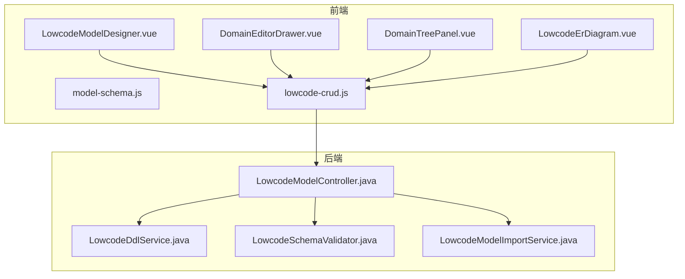
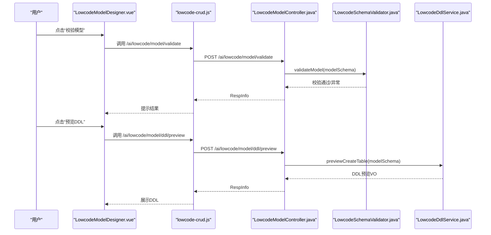
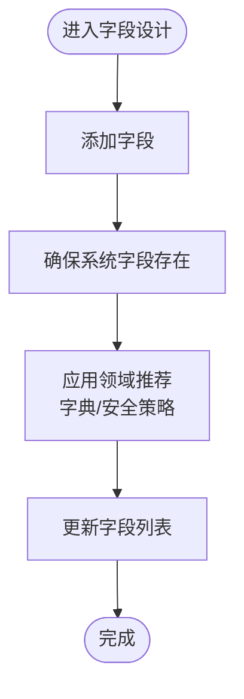
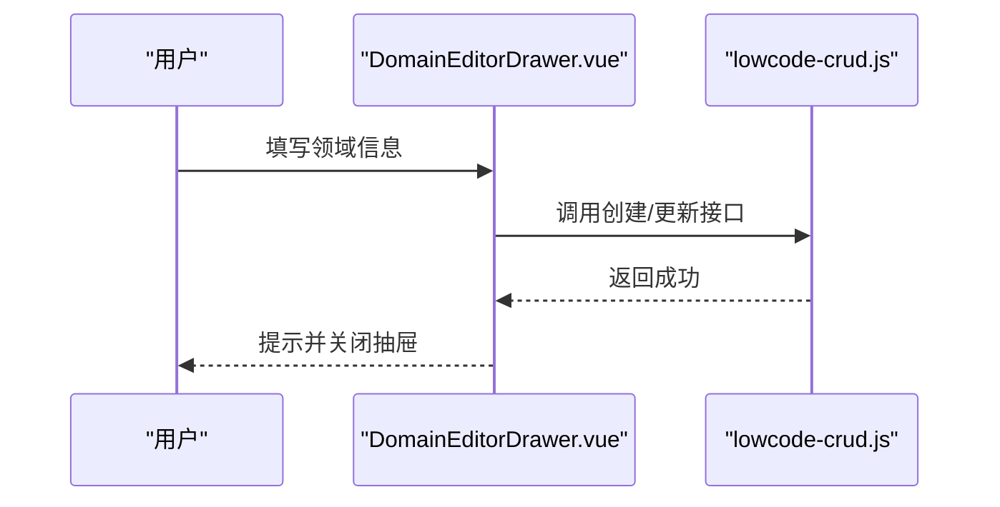
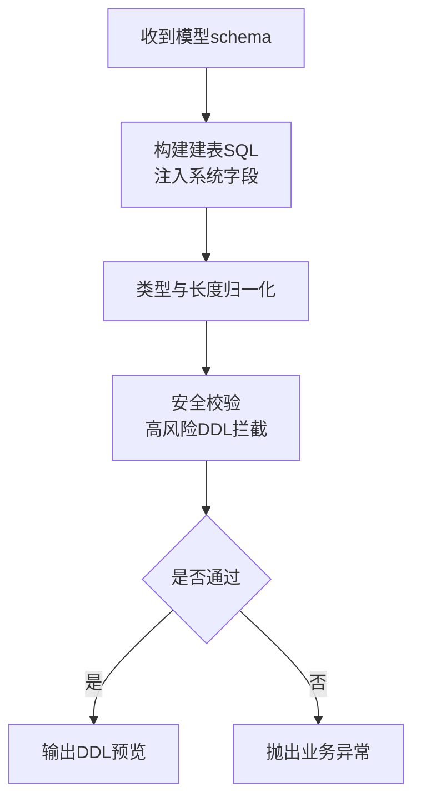
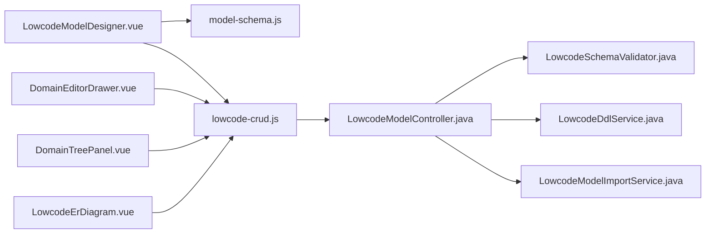

# 模型设计器

<cite>
**本文引用的文件**
- [LowcodeModelDesigner.vue](file://forge-admin-ui/src/components/lowcode-builder/model/LowcodeModelDesigner.vue)
- [model-schema.js](file://forge-admin-ui/src/components/lowcode-builder/model/model-schema.js)
- [DomainEditorDrawer.vue](file://forge-admin-ui/src/components/lowcode-builder/domain/DomainEditorDrawer.vue)
- [DomainTreePanel.vue](file://forge-admin-ui/src/components/lowcode-builder/domain/DomainTreePanel.vue)
- [LowcodeErDiagram.vue](file://forge-admin-ui/src/components/lowcode-builder/model/LowcodeErDiagram.vue)
- [LowcodeModelController.java](file://forge-server/forge-framework/forge-plugin-parent/forge-plugin-generator/src/main/java/com/mdframe/forge/plugin/generator/controller/LowcodeModelController.java)
- [LowcodeDdlService.java](file://forge-server/forge-framework/forge-plugin-parent/forge-plugin-generator/src/main/java/com/mdframe/forge/plugin/generator/service/lowcode/LowcodeDdlService.java)
- [LowcodeSchemaValidator.java](file://forge-server/forge-framework/forge-plugin-parent/forge-plugin-generator/src/main/java/com/mdframe/forge/plugin/generator/service/lowcode/LowcodeSchemaValidator.java)
- [LowcodeModelImportService.java](file://forge-server/forge-framework/forge-plugin-parent/forge-plugin-generator/src/main/java/com/mdframe/forge/plugin/generator/service/lowcode/LowcodeModelImportService.java)
- [lowcode-crud.js](file://forge-admin-ui/src/api/lowcode-crud.js)
</cite>

## 目录
1. [简介](#简介)
2. [项目结构](#项目结构)
3. [核心组件](#核心组件)
4. [架构总览](#架构总览)
5. [详细组件分析](#详细组件分析)
6. [依赖关系分析](#依赖关系分析)
7. [性能考虑](#性能考虑)
8. [故障排查指南](#故障排查指南)
9. [结论](#结论)
10. [附录](#附录)

## 简介
本技术文档围绕低代码模型设计器的核心能力展开，重点解析 ER 图可视化、字段属性配置、表结构管理、领域建模工具与后端 DDL 生成链路。文档覆盖 model-schema 数据模型定义、DomainEditorDrawer 领域编辑器、DomainTreePanel 领域树形结构的实现机制；解释实体关系映射、字段类型系统、约束验证规则与数据库表生成逻辑；并给出模型导入导出、版本控制、团队协作与企业级特性的实践建议与性能优化指南。

## 项目结构
前端以 Vue 组件化方式组织：
- 模型设计器主界面：LowcodeModelDesigner.vue
- 模型数据模型与工具：model-schema.js
- 领域编辑器：DomainEditorDrawer.vue
- 领域树面板：DomainTreePanel.vue
- ER 图可视化：LowcodeErDiagram.vue
- 前端 API：lowcode-crud.js

后端以 Spring 控制器与服务组成：
- 模型接口：LowcodeModelController.java
- DDL 生成服务：LowcodeDdlService.java
- 模型校验服务：LowcodeSchemaValidator.java
- 模型导入服务：LowcodeModelImportService.java

**图表来源**
- [LowcodeModelDesigner.vue:1-800](file://forge-admin-ui/src/components/lowcode-builder/model/LowcodeModelDesigner.vue#L1-L800)
- [model-schema.js:1-592](file://forge-admin-ui/src/components/lowcode-builder/model/model-schema.js#L1-L592)
- [DomainEditorDrawer.vue:1-320](file://forge-admin-ui/src/components/lowcode-builder/domain/DomainEditorDrawer.vue#L1-L320)
- [DomainTreePanel.vue:1-409](file://forge-admin-ui/src/components/lowcode-builder/domain/DomainTreePanel.vue#L1-L409)
- [LowcodeErDiagram.vue:250-315](file://forge-admin-ui/src/components/lowcode-builder/model/LowcodeErDiagram.vue#L250-L315)
- [lowcode-crud.js:226-274](file://forge-admin-ui/src/api/lowcode-crud.js#L226-L274)
- [LowcodeModelController.java:1-117](file://forge-server/forge-framework/forge-plugin-parent/forge-plugin-generator/src/main/java/com/mdframe/forge/plugin/generator/controller/LowcodeModelController.java#L1-L117)
- [LowcodeDdlService.java:288-307](file://forge-server/forge-framework/forge-plugin-parent/forge-plugin-generator/src/main/java/com/mdframe/forge/plugin/generator/service/lowcode/LowcodeDdlService.java#L288-L307)
- [LowcodeSchemaValidator.java:180-203](file://forge-server/forge-framework/forge-plugin-parent/forge-plugin-generator/src/main/java/com/mdframe/forge/plugin/generator/service/lowcode/LowcodeSchemaValidator.java#L180-L203)
- [LowcodeModelImportService.java:76-92](file://forge-server/forge-framework/forge-plugin-parent/forge-plugin-generator/src/main/java/com/mdframe/forge/plugin/generator/service/lowcode/LowcodeModelImportService.java#L76-L92)

**章节来源**
- [LowcodeModelDesigner.vue:1-800](file://forge-admin-ui/src/components/lowcode-builder/model/LowcodeModelDesigner.vue#L1-L800)
- [model-schema.js:1-592](file://forge-admin-ui/src/components/lowcode-builder/model/model-schema.js#L1-L592)
- [DomainEditorDrawer.vue:1-320](file://forge-admin-ui/src/components/lowcode-builder/domain/DomainEditorDrawer.vue#L1-L320)
- [DomainTreePanel.vue:1-409](file://forge-admin-ui/src/components/lowcode-builder/domain/DomainTreePanel.vue#L1-L409)
- [LowcodeErDiagram.vue:250-315](file://forge-admin-ui/src/components/lowcode-builder/model/LowcodeErDiagram.vue#L250-L315)
- [lowcode-crud.js:226-274](file://forge-admin-ui/src/api/lowcode-crud.js#L226-L274)
- [LowcodeModelController.java:1-117](file://forge-server/forge-framework/forge-plugin-parent/forge-plugin-generator/src/main/java/com/mdframe/forge/plugin/generator/controller/LowcodeModelController.java#L1-L117)
- [LowcodeDdlService.java:288-307](file://forge-server/forge-framework/forge-plugin-parent/forge-plugin-generator/src/main/java/com/mdframe/forge/plugin/generator/service/lowcode/LowcodeDdlService.java#L288-L307)
- [LowcodeSchemaValidator.java:180-203](file://forge-server/forge-framework/forge-plugin-parent/forge-plugin-generator/src/main/java/com/mdframe/forge/plugin/generator/service/lowcode/LowcodeSchemaValidator.java#L180-L203)
- [LowcodeModelImportService.java:76-92](file://forge-server/forge-framework/forge-plugin-parent/forge-plugin-generator/src/main/java/com/mdframe/forge/plugin/generator/service/lowcode/LowcodeModelImportService.java#L76-L92)

## 核心组件
- LowcodeModelDesigner：模型设计主界面，提供基础信息、字段设计、关联配置、校验规则、扩展配置的 Tab 式编辑体验，维护本地模型副本并与父组件双向同步。
- model-schema：集中定义数据类型、组件类型、查询类型、敏感类型、系统字段定义、默认策略、字段工厂与规范化函数，是模型数据的“元数据字典”。
- DomainEditorDrawer：领域编辑器抽屉，支持创建/编辑业务领域、设置命名前缀、菜单父级、代码生成默认值与 AI 上下文（术语、约束）。
- DomainTreePanel：领域树形面板，支持搜索、展开/折叠、新增子目录、编辑与删除领域节点。
- LowcodeErDiagram：ER 图可视化组件，基于 SVG 渲染模型卡片与连线，支持自动布局、缩放、导出图片与选中关系联动。
- lowcode-crud.js：封装模型 CRUD、DDL 预览、数据库表导入等前端 API。
- LowcodeModelController：暴露模型分页、详情、状态更新、删除、校验、DDL 预览、表导入等 REST 接口。
- LowcodeDdlService：根据模型 schema 生成建表 SQL，包含系统字段注入、列定义、安全限制与差异检查。
- LowcodeSchemaValidator：校验模型 schema，包括系统字段保护、主键自增、只读约束等。
- LowcodeModelImportService：从数据源表预览并导入为低代码模型，填充领域、模型编码、描述、租户隔离等。

**章节来源**
- [LowcodeModelDesigner.vue:1-800](file://forge-admin-ui/src/components/lowcode-builder/model/LowcodeModelDesigner.vue#L1-L800)
- [model-schema.js:1-592](file://forge-admin-ui/src/components/lowcode-builder/model/model-schema.js#L1-L592)
- [DomainEditorDrawer.vue:1-320](file://forge-admin-ui/src/components/lowcode-builder/domain/DomainEditorDrawer.vue#L1-L320)
- [DomainTreePanel.vue:1-409](file://forge-admin-ui/src/components/lowcode-builder/domain/DomainTreePanel.vue#L1-L409)
- [LowcodeErDiagram.vue:250-315](file://forge-admin-ui/src/components/lowcode-builder/model/LowcodeErDiagram.vue#L250-L315)
- [lowcode-crud.js:226-274](file://forge-admin-ui/src/api/lowcode-crud.js#L226-L274)
- [LowcodeModelController.java:1-117](file://forge-server/forge-framework/forge-plugin-parent/forge-plugin-generator/src/main/java/com/mdframe/forge/plugin/generator/controller/LowcodeModelController.java#L1-L117)
- [LowcodeDdlService.java:288-307](file://forge-server/forge-framework/forge-plugin-parent/forge-plugin-generator/src/main/java/com/mdframe/forge/plugin/generator/service/lowcode/LowcodeDdlService.java#L288-L307)
- [LowcodeSchemaValidator.java:180-203](file://forge-server/forge-framework/forge-plugin-parent/forge-plugin-generator/src/main/java/com/mdframe/forge/plugin/generator/service/lowcode/LowcodeSchemaValidator.java#L180-L203)
- [LowcodeModelImportService.java:76-92](file://forge-server/forge-framework/forge-plugin-parent/forge-plugin-generator/src/main/java/com/mdframe/forge/plugin/generator/service/lowcode/LowcodeModelImportService.java#L76-L92)

## 架构总览
前端通过 LowcodeModelDesigner 组合多个子组件完成模型设计，使用 model-schema 提供的工厂与规范函数维护模型数据结构；通过 lowcode-crud.js 调用后端接口进行保存、校验、DDL 预览与导入。后端由 Controller 统一路由到 Service 层，分别负责校验、DDL 生成与导入。

**图表来源**
- [LowcodeModelDesigner.vue:753-766](file://forge-admin-ui/src/components/lowcode-builder/model/LowcodeModelDesigner.vue#L753-L766)
- [lowcode-crud.js:254-256](file://forge-admin-ui/src/api/lowcode-crud.js#L254-L256)
- [LowcodeModelController.java:93-104](file://forge-server/forge-framework/forge-plugin-parent/forge-plugin-generator/src/main/java/com/mdframe/forge/plugin/generator/controller/LowcodeModelController.java#L93-L104)
- [LowcodeSchemaValidator.java:180-203](file://forge-server/forge-framework/forge-plugin-parent/forge-plugin-generator/src/main/java/com/mdframe/forge/plugin/generator/service/lowcode/LowcodeSchemaValidator.java#L180-L203)
- [LowcodeDdlService.java:288-307](file://forge-server/forge-framework/forge-plugin-parent/forge-plugin-generator/src/main/java/com/mdframe/forge/plugin/generator/service/lowcode/LowcodeDdlService.java#L288-L307)

## 详细组件分析

### 模型设计器 LowcodeModelDesigner
- 功能要点
  - 维护本地模型副本，监听外部 modelValue 变化并深拷贝，避免直接修改引用导致意外副作用。
  - 提供“模型基础信息”“字段设计”“关联配置”“校验规则”“扩展配置”五个 Tab。
  - 字段设计区集成 ModelFieldTable 与 ModelFieldPropertyPanel，支持添加、复制、删除字段，右侧属性面板实时编辑。
  - 关联配置支持 REFERENCE、ONE_TO_MANY、ONE_TO_ONE 三种关系类型，可配置目标模型、源字段、目标字段与回显字段。
  - 校验规则区支持数据范围策略（租户隔离/跟随系统角色）、树形模型配置（启用开关、主键/父级/显示字段、加载模式）。
  - 扩展配置区支持索引配置（普通/唯一），名称标准化与去重处理。
  - 底部校验按钮调用后端校验接口，成功后触发 validated 事件。
- 关键流程
  - 新增字段：插入业务字段区间，确保系统字段不被覆盖，并应用领域推荐（字典、安全策略）。
  - 引入领域模板：按领域 fieldTemplates 批量添加字段，跳过审计字段与重复字段。
  - 树形模型：切换应用类型为 TREE 或启用树形时，自动补齐 parentId/name 等必要字段与 treeConfig。
  - 模型代码与表名：输入 object.code 时自动规范化并同步 tableName。
- 复杂度与性能
  - 列表与选项计算采用 computed，减少重复计算。
  - 深拷贝与 JSON 比较用于变更检测，避免不必要的更新。

**图表来源**
- [LowcodeModelDesigner.vue:485-520](file://forge-admin-ui/src/components/lowcode-builder/model/LowcodeModelDesigner.vue#L485-L520)
- [model-schema.js:369-377](file://forge-admin-ui/src/components/lowcode-builder/model/model-schema.js#L369-L377)
- [model-schema.js:458-487](file://forge-admin-ui/src/components/lowcode-builder/model/model-schema.js#L458-L487)

**章节来源**
- [LowcodeModelDesigner.vue:1-800](file://forge-admin-ui/src/components/lowcode-builder/model/LowcodeModelDesigner.vue#L1-L800)
- [model-schema.js:1-592](file://forge-admin-ui/src/components/lowcode-builder/model/model-schema.js#L1-L592)

### 模型数据模型 model-schema
- 核心职责
  - 定义数据类型、组件类型、查询类型、敏感类型枚举。
  - 定义系统字段集合与默认策略（主键、租户、审计、逻辑删除）。
  - 提供字段工厂 createDefaultField、createSystemField、ensureSystemFields。
  - 提供规范化函数：normalizeObjectCode、normalizeTableName、camelToSnake、normalizeFieldName。
  - 提供导入映射：createFieldFromGenColumn 将数据库列映射为低代码字段。
  - 提供策略归一化：normalizeLowcodePolicies 自动推断 user/org/region/tenant/logicDelete 字段映射。
- 复杂度与性能
  - 大量字符串规范化与正则匹配，建议在批量操作时缓存结果。
  - ensureSystemFields 保证系统字段顺序与完整性，避免业务字段覆盖。

**章节来源**
- [model-schema.js:1-592](file://forge-admin-ui/src/components/lowcode-builder/model/model-schema.js#L1-L592)

### 领域编辑器 DomainEditorDrawer
- 功能要点
  - 表单包含基础信息（父级领域、编码、名称、说明、状态）、默认规则（表名前缀、配置键前缀、菜单父级）、代码生成默认值（groupId、domainPackage、moduleName、frontendBasePath）与 AI 上下文（业务描述、术语、约束）。
  - 保存时将多行文本拆分为数组，合并 domainSchema 后调用后端创建/更新接口。
- 交互流程
  - 打开抽屉时重置表单与 schema，保持父子领域选择互斥。
  - 保存成功后关闭抽屉并通知父组件刷新。

**图表来源**
- [DomainEditorDrawer.vue:223-270](file://forge-admin-ui/src/components/lowcode-builder/domain/DomainEditorDrawer.vue#L223-L270)
- [lowcode-crud.js:226-274](file://forge-admin-ui/src/api/lowcode-crud.js#L226-L274)

**章节来源**
- [DomainEditorDrawer.vue:1-320](file://forge-admin-ui/src/components/lowcode-builder/domain/DomainEditorDrawer.vue#L1-L320)

### 领域树 DomainTreePanel
- 功能要点
  - 扁平化领域树以支持搜索与高亮，维护展开状态 Set。
  - 支持“全部应用”跨领域视图、新增子目录、编辑、删除等操作。
  - 通过 emit 向上抛出 select/create/createChild/edit/delete/search 等事件。
- 性能考量
  - 使用 computed 计算可见节点，避免全量渲染。
  - 展开状态用 Set 存储，O(1) 查找。

**章节来源**
- [DomainTreePanel.vue:1-409](file://forge-admin-ui/src/components/lowcode-builder/domain/DomainTreePanel.vue#L1-L409)

### ER 图可视化 LowcodeErDiagram
- 功能要点
  - 基于 SVG 渲染模型卡片与连线，内置常量定义表格宽高、间距、画布内边距与调色板。
  - 支持自动布局、缩放控制、导出图片（PNG/SVG）、节点点击跳转。
  - 识别系统字段与列名集合，过滤无关元素。
- 交互流程
  - 接收 models 与 primaryModelCode，渲染当前领域下的模型关系。
  - 通过 selectedRelationKey 与父组件联动高亮选中关系。

**章节来源**
- [LowcodeErDiagram.vue:250-315](file://forge-admin-ui/src/components/lowcode-builder/model/LowcodeErDiagram.vue#L250-L315)

### 后端 DDL 生成与校验
- DDL 生成
  - 构建建表 SQL：注入 id、租户、审计、逻辑删除等系统字段，遍历业务字段生成列定义。
  - 类型与长度归一化：decimal 精度校验、标识符安全校验、DDL 安全限制（仅允许追加式变更）。
- 模型校验
  - 系统字段保护：禁止修改系统字段配置，id 必须为主键且自增，系统字段必须只读。
- 模型导入
  - 从数据源表预览并导入为低代码模型，填充领域、模型编码、描述、租户隔离等。

**图表来源**
- [LowcodeDdlService.java:288-307](file://forge-server/forge-framework/forge-plugin-parent/forge-plugin-generator/src/main/java/com/mdframe/forge/plugin/generator/service/lowcode/LowcodeDdlService.java#L288-L307)
- [LowcodeDdlService.java:687-748](file://forge-server/forge-framework/forge-plugin-parent/forge-plugin-generator/src/main/java/com/mdframe/forge/plugin/generator/service/lowcode/LowcodeDdlService.java#L687-L748)
- [LowcodeSchemaValidator.java:180-203](file://forge-server/forge-framework/forge-plugin-parent/forge-plugin-generator/src/main/java/com/mdframe/forge/plugin/generator/service/lowcode/LowcodeSchemaValidator.java#L180-L203)

**章节来源**
- [LowcodeDdlService.java:288-307](file://forge-server/forge-framework/forge-plugin-parent/forge-plugin-generator/src/main/java/com/mdframe/forge/plugin/generator/service/lowcode/LowcodeDdlService.java#L288-L307)
- [LowcodeDdlService.java:687-748](file://forge-server/forge-framework/forge-plugin-parent/forge-plugin-generator/src/main/java/com/mdframe/forge/plugin/generator/service/lowcode/LowcodeDdlService.java#L687-L748)
- [LowcodeSchemaValidator.java:180-203](file://forge-server/forge-framework/forge-plugin-parent/forge-plugin-generator/src/main/java/com/mdframe/forge/plugin/generator/service/lowcode/LowcodeSchemaValidator.java#L180-L203)
- [LowcodeModelImportService.java:76-92](file://forge-server/forge-framework/forge-plugin-parent/forge-plugin-generator/src/main/java/com/mdframe/forge/plugin/generator/service/lowcode/LowcodeModelImportService.java#L76-L92)

## 依赖关系分析
- 前端依赖
  - LowcodeModelDesigner 依赖 model-schema 的工厂与规范函数，以及 ModelFieldTable/ModelFieldPropertyPanel 子组件。
  - DomainEditorDrawer 依赖 lowcode-crud.js 的领域创建/更新接口。
  - DomainTreePanel 通过事件与父组件通信，不直接依赖后端。
  - LowcodeErDiagram 依赖父组件传入的 models 与 selectedRelationKey。
- 后端依赖
  - LowcodeModelController 依赖 LowcodeDataModelService、LowcodeSchemaValidator、LowcodeDdlService、LowcodeModelImportService。
  - DDL 生成依赖运行时数据库方言与类型映射。
  - 校验服务依赖系统字段白名单与约束规则。

**图表来源**
- [LowcodeModelDesigner.vue:1-800](file://forge-admin-ui/src/components/lowcode-builder/model/LowcodeModelDesigner.vue#L1-L800)
- [model-schema.js:1-592](file://forge-admin-ui/src/components/lowcode-builder/model/model-schema.js#L1-L592)
- [DomainEditorDrawer.vue:1-320](file://forge-admin-ui/src/components/lowcode-builder/domain/DomainEditorDrawer.vue#L1-L320)
- [DomainTreePanel.vue:1-409](file://forge-admin-ui/src/components/lowcode-builder/domain/DomainTreePanel.vue#L1-L409)
- [LowcodeErDiagram.vue:250-315](file://forge-admin-ui/src/components/lowcode-builder/model/LowcodeErDiagram.vue#L250-L315)
- [lowcode-crud.js:226-274](file://forge-admin-ui/src/api/lowcode-crud.js#L226-L274)
- [LowcodeModelController.java:1-117](file://forge-server/forge-framework/forge-plugin-parent/forge-plugin-generator/src/main/java/com/mdframe/forge/plugin/generator/controller/LowcodeModelController.java#L1-L117)

**章节来源**
- [LowcodeModelController.java:1-117](file://forge-server/forge-framework/forge-plugin-parent/forge-plugin-generator/src/main/java/com/mdframe/forge/plugin/generator/controller/LowcodeModelController.java#L1-L117)

## 性能考虑
- 前端
  - 使用 computed 缓存字段选项与统计指标，避免每次渲染重新计算。
  - 深拷贝与 JSON 比较用于变更检测，减少不必要的响应式更新。
  - ER 图渲染时固定表格尺寸与间距，降低重排开销；导出图片前缓存 SVG 内容。
- 后端
  - DDL 生成时对类型与长度进行快速归一化，避免多次字符串解析。
  - 校验服务对系统字段进行白名单判断，减少复杂分支。
  - 导入服务在事务中执行，保证一致性；预览阶段只做轻量解析。

[本节为通用指导，无需具体文件来源]

## 故障排查指南
- 模型校验失败
  - 常见原因：系统字段被修改、id 非自增主键、系统字段非只读。
  - 定位：查看后端校验抛出的业务异常消息。
- DDL 预览失败
  - 常见原因：字段长度超出范围、decimal 精度配置不正确、高风险 DDL 被拦截。
  - 定位：检查字段 length/precision 与 DDL 安全限制。
- 导入模型失败
  - 常见原因：数据源表不存在、字段类型无法映射、领域上下文缺失。
  - 定位：检查导入请求参数与预览结果。

**章节来源**
- [LowcodeSchemaValidator.java:180-203](file://forge-server/forge-framework/forge-plugin-parent/forge-plugin-generator/src/main/java/com/mdframe/forge/plugin/generator/service/lowcode/LowcodeSchemaValidator.java#L180-L203)
- [LowcodeDdlService.java:687-748](file://forge-server/forge-framework/forge-plugin-parent/forge-plugin-generator/src/main/java/com/mdframe/forge/plugin/generator/service/lowcode/LowcodeDdlService.java#L687-L748)
- [LowcodeModelImportService.java:76-92](file://forge-server/forge-framework/forge-plugin-parent/forge-plugin-generator/src/main/java/com/mdframe/forge/plugin/generator/service/lowcode/LowcodeModelImportService.java#L76-L92)

## 结论
该模型设计器以前端可视化编辑与后端强校验为核心，形成从领域建模、字段设计、关系配置到 DDL 生成的完整闭环。通过 model-schema 统一数据模型与规范，结合 ER 图可视化提升建模效率；后端校验与 DDL 安全限制保障生产稳定性。建议在团队中推广领域模板与字段模板复用，配合导入导出与版本控制流程，实现企业级协作与持续交付。

[本节为总结性内容，无需具体文件来源]

## 附录
- 最佳实践
  - 优先使用领域模板与字段模板，减少重复劳动。
  - 合理设置索引，避免过度索引影响写入性能。
  - 谨慎调整 DDL，遵循“仅追加式变更”原则，必要时人工审核。
- 版本控制与团队协作
  - 使用领域作为分组单位，按域拆分模型，便于权限与发布管理。
  - 通过 DDL 预览与脚本导出，纳入版本库进行变更追踪。
  - 结合权限与审计日志，记录模型变更与发布操作。
- 企业级特性
  - 租户隔离：默认开启 tenantId 字段，数据范围策略可选“租户隔离”或“跟随系统角色”。
  - 安全策略：敏感字段标记与加密算法配置，结合字典推荐与安全策略自动填充。
  - 代码生成：领域级 codegen 默认值（groupId、domainPackage、moduleName、frontendBasePath）统一生成风格。

[本节为通用指导，无需具体文件来源]