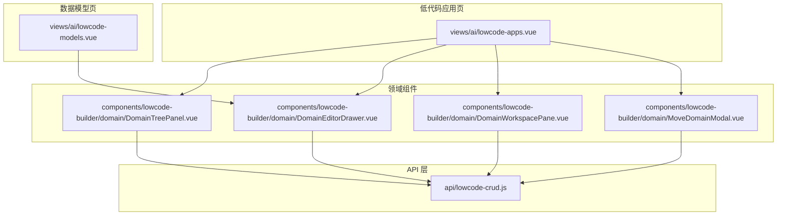
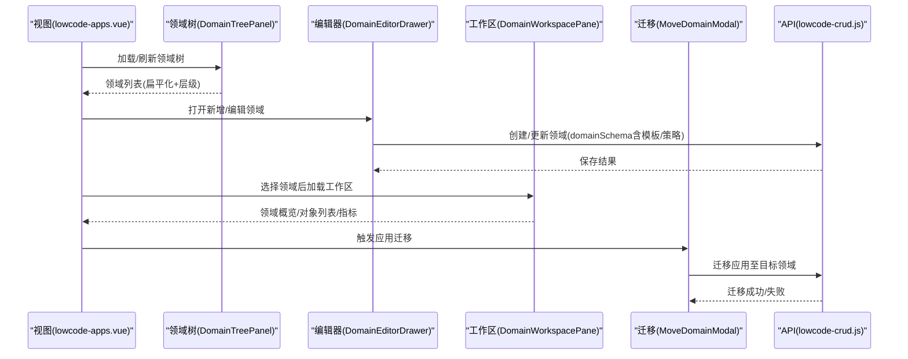
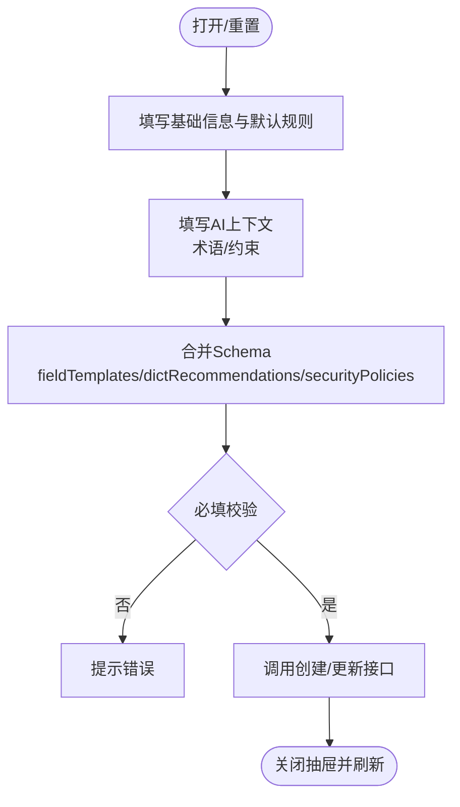
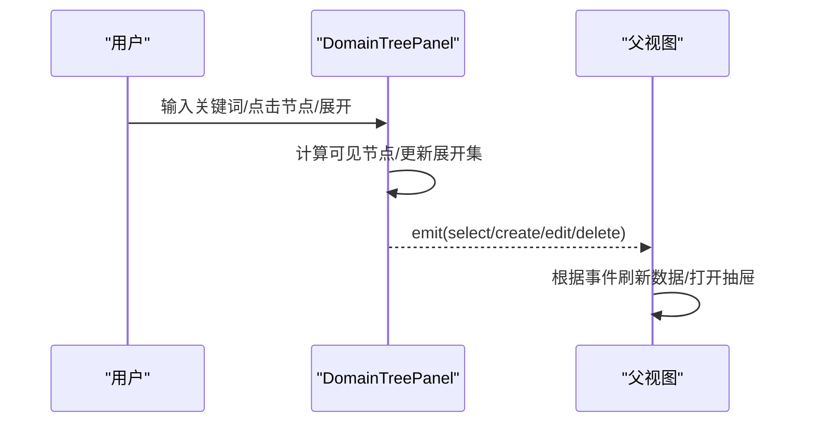
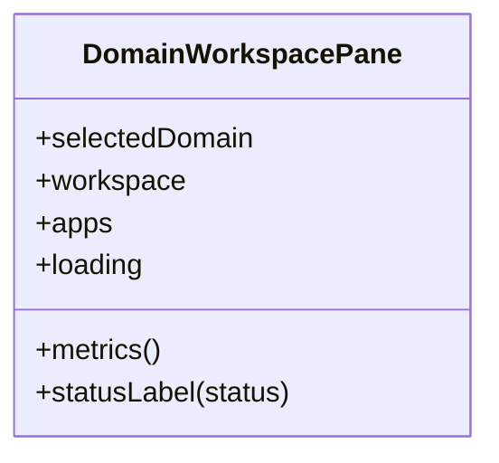
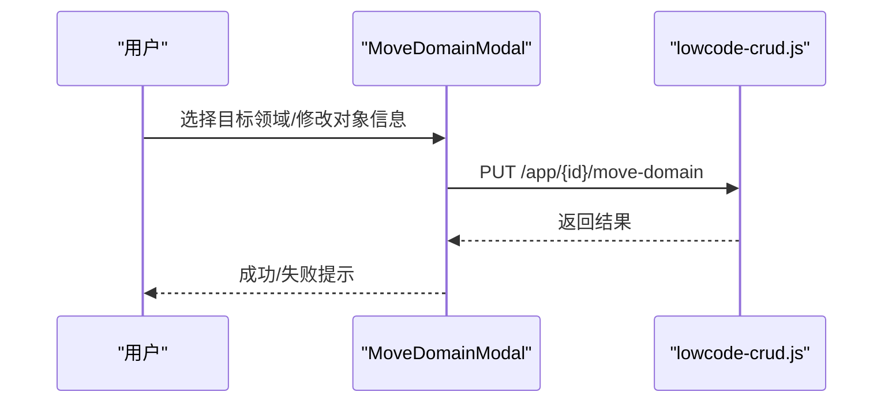
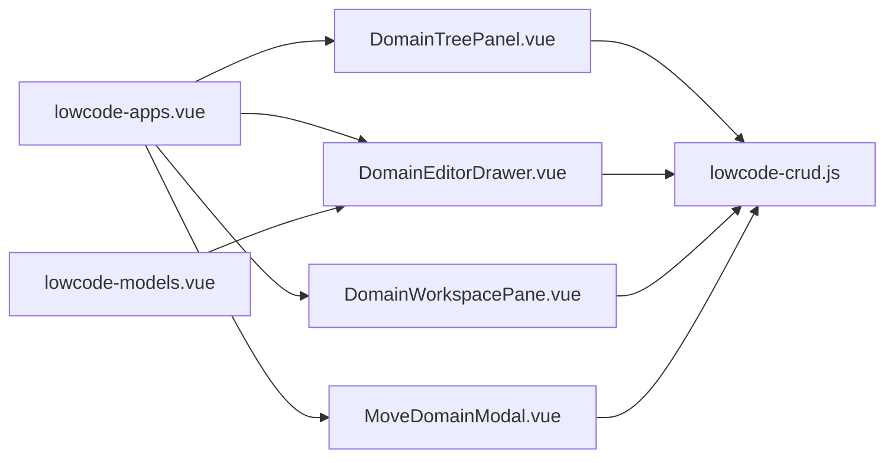

# 领域管理

<cite>
**本文引用的文件**
- [DomainEditorDrawer.vue](file://forge-admin-ui/src/components/lowcode-builder/domain/DomainEditorDrawer.vue)
- [DomainTreePanel.vue](file://forge-admin-ui/src/components/lowcode-builder/domain/DomainTreePanel.vue)
- [DomainWorkspacePane.vue](file://forge-admin-ui/src/components/lowcode-builder/domain/DomainWorkspacePane.vue)
- [MoveDomainModal.vue](file://forge-admin-ui/src/components/lowcode-builder/domain/MoveDomainModal.vue)
- [lowcode-crud.js](file://forge-admin-ui/src/api/lowcode-crud.js)
- [lowcode-apps.vue](file://forge-admin-ui/src/views/ai/lowcode-apps.vue)
- [lowcode-models.vue](file://forge-admin-ui/src/views/ai/lowcode-models.vue)
</cite>

## 目录
1. [简介](#简介)
2. [项目结构](#项目结构)
3. [核心组件](#核心组件)
4. [架构总览](#架构总览)
5. [详细组件分析](#详细组件分析)
6. [依赖关系分析](#依赖关系分析)
7. [性能考虑](#性能考虑)
8. [故障排查指南](#故障排查指南)
9. [结论](#结论)
10. [附录](#附录)

## 简介
本技术文档聚焦于低代码平台的“领域管理”能力，围绕以下目标展开：
- 深入解析 DomainEditorDrawer 领域编辑器抽屉：支持领域基本信息编辑、默认规则与代码生成默认值配置、AI 上下文（业务术语、约束）以及领域 Schema 的持久化。
- 详细说明 DomainTreePanel 领域树形面板：支持层级展示、搜索过滤、展开/收起、操作菜单（新增子目录、编辑、删除）。
- 解释领域与模型的关联：通过领域工作区视图聚合模型与应用，体现共享资源与版本控制（草稿/已发布）。
- 说明领域模板系统：字段模板、字典推荐与安全策略在领域 Schema 中的组织方式，以及如何在建模时复用。
- 提供企业级最佳实践：命名规范、权限隔离、多租户、版本治理与可观测性建议。

## 项目结构
领域管理相关的前端实现主要位于 lowcode-builder 域下的 domain 组件与 ai 视图页面中，API 层集中在统一的 lowcode-crud 接口文件中。

图表来源
- [lowcode-apps.vue:1-170](file://forge-admin-ui/src/views/ai/lowcode-apps.vue#L1-L170)
- [DomainTreePanel.vue:1-160](file://forge-admin-ui/src/components/lowcode-builder/domain/DomainTreePanel.vue#L1-L160)
- [DomainEditorDrawer.vue:1-120](file://forge-admin-ui/src/components/lowcode-builder/domain/DomainEditorDrawer.vue#L1-L120)
- [DomainWorkspacePane.vue:1-120](file://forge-admin-ui/src/components/lowcode-builder/domain/DomainWorkspacePane.vue#L1-L120)
- [MoveDomainModal.vue:1-60](file://forge-admin-ui/src/components/lowcode-builder/domain/MoveDomainModal.vue#L1-L60)
- [lowcode-crud.js:12-46](file://forge-admin-ui/src/api/lowcode-crud.js#L12-L46)

章节来源
- [lowcode-apps.vue:1-170](file://forge-admin-ui/src/views/ai/lowcode-apps.vue#L1-L170)
- [lowcode-models.vue:1-120](file://forge-admin-ui/src/views/ai/lowcode-models.vue#L1-L120)
- [lowcode-crud.js:12-46](file://forge-admin-ui/src/api/lowcode-crud.js#L12-L46)

## 核心组件
- 领域编辑器抽屉（DomainEditorDrawer）
  - 负责领域基础信息（父级、编码、名称、描述、状态）、默认规则（表名前缀、配置键前缀、菜单父级）、代码生成默认值（Group ID、包名、模块名、前端路径）以及 AI 上下文（业务描述、术语、约束）的编辑与保存。
  - 将表单数据映射到领域对象与领域 Schema（包含 fieldTemplates、dictRecommendations、securityPolicies），并调用后端创建或更新领域。
- 领域树面板（DomainTreePanel）
  - 以扁平化方式渲染所有领域节点，支持按关键字搜索、展开/收起子节点、选择当前领域、以及通过下拉菜单执行新增子目录、编辑、删除等操作。
- 领域工作区面板（DomainWorkspacePane）
  - 展示选中领域的概览：领域元信息、默认规则、AI 上下文（术语与约束）、业务对象概览（对象列表与发布状态），并提供新建模型入口。
- 迁移弹窗（MoveDomainModal）
  - 用于将某个应用/对象迁移至其他启用状态的领域，支持调整对象编码与名称。

章节来源
- [DomainEditorDrawer.vue:100-291](file://forge-admin-ui/src/components/lowcode-builder/domain/DomainEditorDrawer.vue#L100-L291)
- [DomainTreePanel.vue:116-227](file://forge-admin-ui/src/components/lowcode-builder/domain/DomainTreePanel.vue#L116-L227)
- [DomainWorkspacePane.vue:133-181](file://forge-admin-ui/src/components/lowcode-builder/domain/DomainWorkspacePane.vue#L133-L181)
- [MoveDomainModal.vue:36-122](file://forge-admin-ui/src/components/lowcode-builder/domain/MoveDomainModal.vue#L36-L122)

## 架构总览
领域管理由“视图层 + 组件层 + API 层”构成：
- 视图层（lowcode-apps.vue、lowcode-models.vue）编排领域树、工作区与编辑器，驱动领域与模型的生命周期。
- 组件层（Domain* 系列）封装具体交互逻辑与 UI 呈现。
- API 层（lowcode-crud.js）统一封装领域、模型、应用的增删改查、分页、预览、发布、版本回滚等能力。

图表来源
- [lowcode-apps.vue:1-170](file://forge-admin-ui/src/views/ai/lowcode-apps.vue#L1-L170)
- [DomainTreePanel.vue:116-227](file://forge-admin-ui/src/components/lowcode-builder/domain/DomainTreePanel.vue#L116-L227)
- [DomainEditorDrawer.vue:223-291](file://forge-admin-ui/src/components/lowcode-builder/domain/DomainEditorDrawer.vue#L223-L291)
- [DomainWorkspacePane.vue:133-181](file://forge-admin-ui/src/components/lowcode-builder/domain/DomainWorkspacePane.vue#L133-L181)
- [MoveDomainModal.vue:89-122](file://forge-admin-ui/src/components/lowcode-builder/domain/MoveDomainModal.vue#L89-L122)
- [lowcode-crud.js:12-78](file://forge-admin-ui/src/api/lowcode-crud.js#L12-L78)

## 详细组件分析

### 领域编辑器抽屉（DomainEditorDrawer）
- 功能要点
  - 基础信息：父级领域选择（支持层级缩进显示）、领域编码/名称/描述、启用状态开关。
  - 默认规则：表名前缀、配置键前缀、菜单父级选择。
  - 代码生成默认值：Group ID、Java 包名、模块名、前端路径。
  - AI 上下文：业务描述、术语（每行一个）、约束（每行一条）。
  - 领域 Schema：包含 fieldTemplates、dictRecommendations、securityPolicies 等扩展配置。
- 数据流
  - 打开抽屉时重置表单与 Schema；保存时将文本型术语/约束转为数组，合并命名与代码生成默认值，构造 payload 调用创建/更新接口。
- 关键实现位置
  - 表单结构与字段绑定、保存流程、Schema 初始化与合并。

图表来源
- [DomainEditorDrawer.vue:156-221](file://forge-admin-ui/src/components/lowcode-builder/domain/DomainEditorDrawer.vue#L156-L221)
- [DomainEditorDrawer.vue:223-291](file://forge-admin-ui/src/components/lowcode-builder/domain/DomainEditorDrawer.vue#L223-L291)

章节来源
- [DomainEditorDrawer.vue:100-291](file://forge-admin-ui/src/components/lowcode-builder/domain/DomainEditorDrawer.vue#L100-L291)

### 领域树面板（DomainTreePanel）
- 功能要点
  - 展示全部应用入口与领域树，支持搜索、展开/收起、禁用态标记。
  - 每个节点提供操作菜单：新增子目录、编辑、删除。
  - 内部维护展开集合，计算可见节点与总数。
- 交互流程
  - 点击节点选择领域；点击“新增子目录”触发父级上下文传递；点击“编辑”打开编辑器；点击“删除”触发删除流程。

图表来源
- [DomainTreePanel.vue:116-227](file://forge-admin-ui/src/components/lowcode-builder/domain/DomainTreePanel.vue#L116-L227)
- [lowcode-apps.vue:1-170](file://forge-admin-ui/src/views/ai/lowcode-apps.vue#L1-L170)

章节来源
- [DomainTreePanel.vue:1-227](file://forge-admin-ui/src/components/lowcode-builder/domain/DomainTreePanel.vue#L1-L227)
- [lowcode-apps.vue:1-170](file://forge-admin-ui/src/views/ai/lowcode-apps.vue#L1-L170)

### 领域工作区面板（DomainWorkspacePane）
- 功能要点
  - 展示选中领域的元信息、默认规则、AI 上下文（术语/约束）、业务对象概览（对象数、发布状态）。
  - 提供“新建模型”入口，受领域启用状态控制。
- 数据来源
  - 从 selectedDomain 与 workspace 中读取领域 Schema、对象列表与统计指标。

图表来源
- [DomainWorkspacePane.vue:133-181](file://forge-admin-ui/src/components/lowcode-builder/domain/DomainWorkspacePane.vue#L133-L181)

章节来源
- [DomainWorkspacePane.vue:1-181](file://forge-admin-ui/src/components/lowcode-builder/domain/DomainWorkspacePane.vue#L1-L181)

### 迁移弹窗（MoveDomainModal）
- 功能要点
  - 选择目标领域（仅启用状态），可选修改对象编码与名称，提交迁移请求。
- 交互流程
  - 打开时回填当前应用信息；提交时调用迁移接口，成功后通知父视图刷新。

图表来源
- [MoveDomainModal.vue:89-122](file://forge-admin-ui/src/components/lowcode-builder/domain/MoveDomainModal.vue#L89-L122)
- [lowcode-crud.js:60-62](file://forge-admin-ui/src/api/lowcode-crud.js#L60-L62)

章节来源
- [MoveDomainModal.vue:36-122](file://forge-admin-ui/src/components/lowcode-builder/domain/MoveDomainModal.vue#L36-L122)
- [lowcode-crud.js:60-62](file://forge-admin-ui/src/api/lowcode-crud.js#L60-L62)

## 依赖关系分析
- 视图与组件耦合
  - lowcode-apps.vue 组合 DomainTreePanel、DomainEditorDrawer、DomainWorkspacePane、MoveDomainModal，并通过事件驱动数据刷新。
  - lowcode-models.vue 同样使用 DomainEditorDrawer 进行领域编辑，并在领域下管理模型。
- 组件与 API 耦合
  - 各组件通过 lowcode-crud.js 提供的领域、模型、应用接口完成数据读写。
- 外部依赖
  - 使用 N 系列 UI 组件（n-drawer、n-form、n-select、n-button、n-tag、n-modal 等）与图标库。

图表来源
- [lowcode-apps.vue:1-170](file://forge-admin-ui/src/views/ai/lowcode-apps.vue#L1-L170)
- [lowcode-models.vue:344-349](file://forge-admin-ui/src/views/ai/lowcode-models.vue#L344-L349)
- [lowcode-crud.js:12-78](file://forge-admin-ui/src/api/lowcode-crud.js#L12-L78)

章节来源
- [lowcode-apps.vue:1-170](file://forge-admin-ui/src/views/ai/lowcode-apps.vue#L1-L170)
- [lowcode-models.vue:344-349](file://forge-admin-ui/src/views/ai/lowcode-models.vue#L344-L349)
- [lowcode-crud.js:12-78](file://forge-admin-ui/src/api/lowcode-crud.js#L12-L78)

## 性能考虑
- 树形展示优化
  - 使用扁平化计算属性减少重复遍历；仅在需要时展开子节点，降低 DOM 压力。
- 列表与分页
  - 应用与模型列表采用分页查询，避免一次性加载大量数据。
- 异步与加载态
  - 全局加载指示器与局部 loading 结合，提升用户体验。
- 缓存与去重
  - 领域树展开状态使用 Set 存储，避免重复展开；对象列表通过唯一 key 渲染。

[本节为通用性能建议，不直接分析具体文件]

## 故障排查指南
- 保存领域失败
  - 检查必填项（领域编码/名称）是否填写；查看控制台错误消息；确认后端接口返回。
  - 参考：[DomainEditorDrawer.vue:223-269](file://forge-admin-ui/src/components/lowcode-builder/domain/DomainEditorDrawer.vue#L223-L269)
- 迁移失败
  - 确认目标领域为启用状态；检查对象编码/名称是否冲突；查看迁移接口返回。
  - 参考：[MoveDomainModal.vue:89-122](file://forge-admin-ui/src/components/lowcode-builder/domain/MoveDomainModal.vue#L89-L122)
- 领域树无数据
  - 检查搜索关键字与筛选条件；确认 tree 接口返回；必要时刷新。
  - 参考：[DomainTreePanel.vue:158-174](file://forge-admin-ui/src/components/lowcode-builder/domain/DomainTreePanel.vue#L158-L174)
- 工作区指标异常
  - 检查 selectedDomain 与 workspace 数据结构；确认对象列表与计数逻辑。
  - 参考：[DomainWorkspacePane.vue:159-171](file://forge-admin-ui/src/components/lowcode-builder/domain/DomainWorkspacePane.vue#L159-L171)

章节来源
- [DomainEditorDrawer.vue:223-269](file://forge-admin-ui/src/components/lowcode-builder/domain/DomainEditorDrawer.vue#L223-L269)
- [MoveDomainModal.vue:89-122](file://forge-admin-ui/src/components/lowcode-builder/domain/MoveDomainModal.vue#L89-L122)
- [DomainTreePanel.vue:158-174](file://forge-admin-ui/src/components/lowcode-builder/domain/DomainTreePanel.vue#L158-L174)
- [DomainWorkspacePane.vue:159-171](file://forge-admin-ui/src/components/lowcode-builder/domain/DomainWorkspacePane.vue#L159-L171)

## 结论
领域管理通过清晰的组件分层与统一的 API 抽象，实现了领域的全生命周期管理与模型的组织编排。领域编辑器支持丰富的默认规则与 AI 上下文，领域树与工作区提供了直观的导航与概览，迁移能力增强了资产的可流动性。结合版本控制（草稿/已发布）与企业级特性（命名规范、多租户、安全策略），平台可满足复杂企业场景下的建模与治理需求。

[本节为总结性内容，不直接分析具体文件]

## 附录

### 领域与模型的关联关系
- 领域作为资产的容器，承载模型与应用；模型属于特定领域，应用则基于模型构建页面。
- 工作区面板展示领域内对象数量与发布状态，便于治理与监控。
- 迁移能力允许跨领域移动应用/对象，同时支持调整对象标识。

章节来源
- [DomainWorkspacePane.vue:78-95](file://forge-admin-ui/src/components/lowcode-builder/domain/DomainWorkspacePane.vue#L78-L95)
- [MoveDomainModal.vue:89-122](file://forge-admin-ui/src/components/lowcode-builder/domain/MoveDomainModal.vue#L89-L122)

### 领域模板系统（字段模板、字典推荐、安全策略）
- 字段模板（fieldTemplates）：定义可复用的字段类型与行为，供模型设计时快速装配。
- 字典推荐（dictRecommendations）：为字段提供选项来源，保障数据一致性与可维护性。
- 安全策略（securityPolicies）：定义字段/对象的访问与脱敏策略，支撑企业级数据安全。
- 这些配置在领域 Schema 中集中管理，随领域一起保存与传播。

章节来源
- [DomainEditorDrawer.vue:172-200](file://forge-admin-ui/src/components/lowcode-builder/domain/DomainEditorDrawer.vue#L172-L200)
- [DomainEditorDrawer.vue:223-255](file://forge-admin-ui/src/components/lowcode-builder/domain/DomainEditorDrawer.vue#L223-L255)

### 企业级特性与最佳实践
- 命名规范：统一表名前缀、配置键前缀、对象编码风格，降低歧义与维护成本。
- 权限与隔离：通过领域划分边界，结合菜单父级与角色权限，实现细粒度访问控制。
- 多租户：模型级别的多租户开关，确保数据隔离。
- 版本治理：草稿与已发布状态分离，支持回滚与审计。
- 可观测性：工作区指标（模型数、对象数、发布数、草稿数）帮助掌握领域健康度。

[本节为通用最佳实践，不直接分析具体文件]