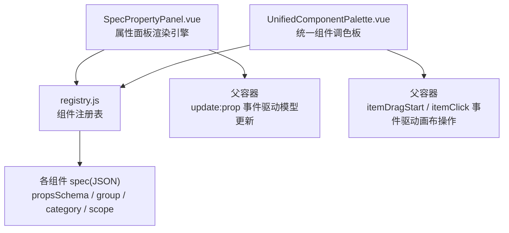
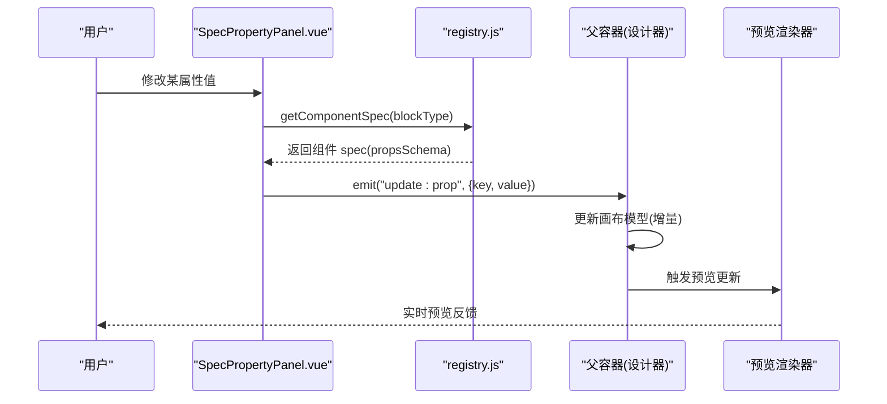
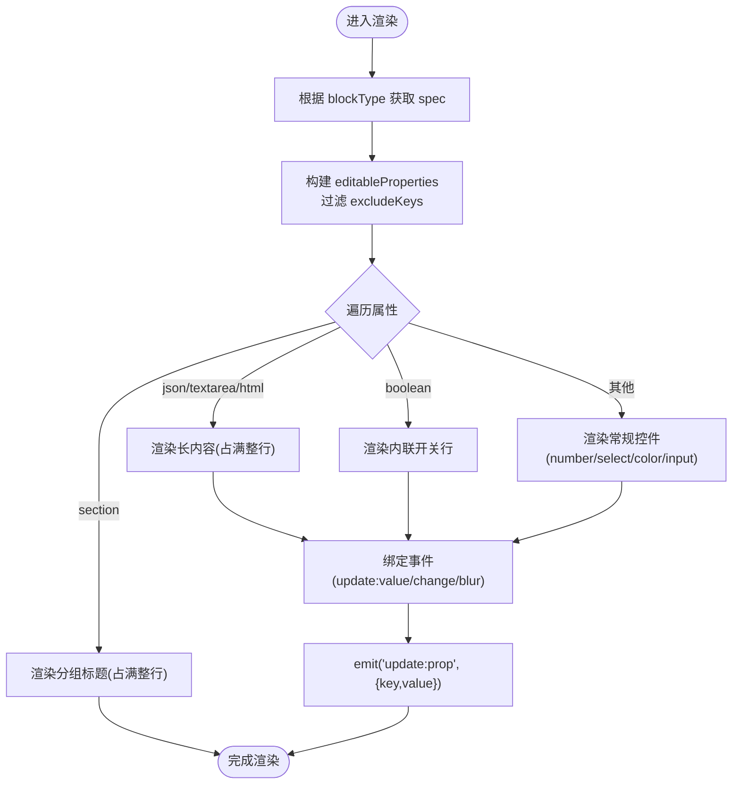
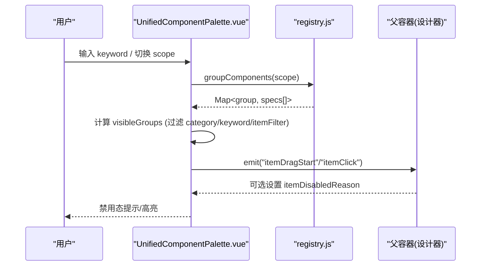
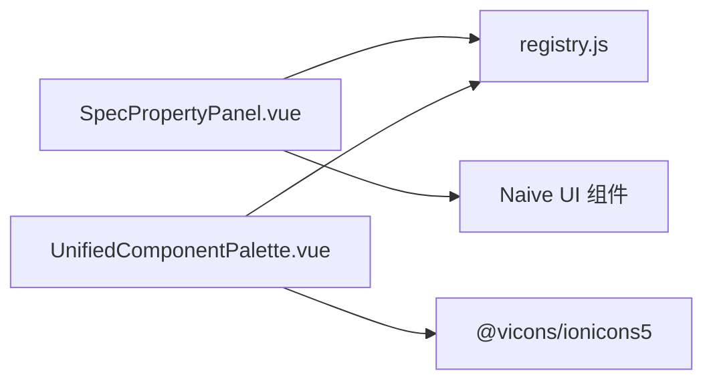

# 属性面板系统

<cite>
**本文引用的文件**
- [SpecPropertyPanel.vue](file://forge-admin-ui/src/components/lowcode-builder/designer-core/panel/SpecPropertyPanel.vue)
- [UnifiedComponentPalette.vue](file://forge-admin-ui/src/components/lowcode-builder/designer-core/panel/UnifiedComponentPalette.vue)
- [registry.js](file://forge-admin-ui/src/components/lowcode-builder/designer-core/spec/registry.js)
- [spec-property-panel.spec.js](file://forge-admin-ui/src/components/lowcode-builder/designer-core/__tests__/spec-property-panel.spec.js)
</cite>

## 目录
1. [简介](#简介)
2. [项目结构](#项目结构)
3. [核心组件](#核心组件)
4. [架构总览](#架构总览)
5. [详细组件分析](#详细组件分析)
6. [依赖关系分析](#依赖关系分析)
7. [性能考量](#性能考量)
8. [故障排查指南](#故障排查指南)
9. [结论](#结论)
10. [附录：自定义属性控件扩展指南](#附录自定义属性控件扩展指南)

## 简介
本技术文档聚焦低代码设计器中的“属性面板系统”，围绕以下目标展开：
- 深入解析 SpecPropertyPanel.vue 属性面板组件的实现架构，包括 schema 驱动的渲染引擎、表单生成逻辑与数据绑定机制。
- 详细说明 UnifiedComponentPalette.vue 统一组件调色板的交互设计与状态管理。
- 解释属性面板与组件规范的映射关系、实时预览更新、验证规则执行策略。
- 分析属性面板的性能优化策略（虚拟滚动、增量更新、缓存机制）。
- 提供自定义属性控件开发指南，并给出具体代码示例路径，展示如何扩展属性面板功能与定制 UI 交互。

## 项目结构
属性面板系统位于 lowcode-builder/designer-core 下，核心由三部分构成：
- 属性面板渲染引擎：SpecPropertyPanel.vue，基于组件规范 propsSchema 自动生成编辑界面。
- 统一组件调色板：UnifiedComponentPalette.vue，提供统一的物料分组、搜索、拖拽与点击事件。
- 组件注册表：registry.js，集中维护组件规格、别名、分组与过滤能力。

图表来源
- [SpecPropertyPanel.vue:1-288](file://forge-admin-ui/src/components/lowcode-builder/designer-core/panel/SpecPropertyPanel.vue#L1-L288)
- [UnifiedComponentPalette.vue:1-406](file://forge-admin-ui/src/components/lowcode-builder/designer-core/panel/UnifiedComponentPalette.vue#L1-L406)
- [registry.js:1-169](file://forge-admin-ui/src/components/lowcode-builder/designer-core/spec/registry.js#L1-L169)

章节来源
- [SpecPropertyPanel.vue:1-288](file://forge-admin-ui/src/components/lowcode-builder/designer-core/panel/SpecPropertyPanel.vue#L1-L288)
- [UnifiedComponentPalette.vue:1-406](file://forge-admin-ui/src/components/lowcode-builder/designer-core/panel/UnifiedComponentPalette.vue#L1-L406)
- [registry.js:1-169](file://forge-admin-ui/src/components/lowcode-builder/designer-core/spec/registry.js#L1-L169)

## 核心组件
- 属性面板引擎（SpecPropertyPanel.vue）
  - 以 schema 驱动：读取组件 spec 的 propsSchema，动态生成两列紧凑网格布局的属性编辑区。
  - 支持多种属性类型：boolean、number、select、color、textarea/html/json、section 分组标题等。
  - 数据绑定：通过 update:prop 事件将变更回传给父容器，实现单向数据流与可预测的状态更新。
  - 排除机制：支持 excludeKeys 跳过已由接入方手写模板覆盖的属性。
  - JSON 编辑：对 json 类型进行安全解析与错误保护，非法输入不写回，保留上次合法值。
- 统一组件调色板（UnifiedComponentPalette.vue）
  - 统一物料源：消费 registry.js 提供的分组与过滤能力，按 scope（F/L/ALL）、category、keyword 筛选显示。
  - 交互设计：支持拖拽开始/结束事件与点击事件；禁用态由接入方通过 itemDisabledReason 控制。
  - 图标映射：内置大量组件图标映射，未匹配时回退默认图标。
  - 统计上报：监听可见项总数变化，向上层 emit totalChange。

章节来源
- [SpecPropertyPanel.vue:1-288](file://forge-admin-ui/src/components/lowcode-builder/designer-core/panel/SpecPropertyPanel.vue#L1-L288)
- [UnifiedComponentPalette.vue:1-406](file://forge-admin-ui/src/components/lowcode-builder/designer-core/panel/UnifiedComponentPalette.vue#L1-L406)

## 架构总览
属性面板系统的整体架构遵循“规范驱动 + 事件总线”的模式：
- 组件规范（spec）集中注册于 registry.js，包含 type、label、desc、group、category、scope、propsSchema 等元信息。
- 属性面板根据当前 blockType 从注册表获取 spec，再依据 propsSchema 渲染对应控件。
- 调色板根据 scope/category/keyword 过滤并分组展示，向父容器暴露拖拽与点击事件。
- 父容器负责维护画布模型与预览，接收属性面板的 update:prop 事件后更新模型并触发预览刷新。

图表来源
- [SpecPropertyPanel.vue:1-288](file://forge-admin-ui/src/components/lowcode-builder/designer-core/panel/SpecPropertyPanel.vue#L1-L288)
- [registry.js:1-169](file://forge-admin-ui/src/components/lowcode-builder/designer-core/spec/registry.js#L1-L169)

## 详细组件分析

### 属性面板渲染引擎（SpecPropertyPanel.vue）
- 渲染流程
  - 计算当前组件 spec：通过 blockType 查询 registry.js 获取 spec。
  - 生成可编辑属性列表：过滤 excludeKeys，保持 spec 声明顺序。
  - 渲染布局：两列紧凑网格，boolean 内联一行，json/textarea/html 占满整行，section 分组标题占满整行。
  - 控件选择：根据 property.type/format 选择 n-switch/n-input-number/n-select/n-color-picker/n-input。
  - 数据绑定：通过 update:prop 事件将变更回传，父容器负责持久化与预览刷新。
- 关键算法与数据结构
  - normalizeOptions：统一 select 选项格式为 [{label,value}]。
  - isFullRowProperty：判断是否占满整行的长内容属性。
  - placeholderOf：优先使用 placeholder，其次 fallback 到 default 字符串提示。
  - updateJsonProp：JSON 文本变更时尝试解析，失败则不回写，避免脏数据污染。
- 错误处理
  - JSON 解析异常捕获，保证面板稳定性。
  - disabled 状态下阻止任何属性更新。
- 测试覆盖
  - 布尔开关内联行、json 占满整行、section 分组标题、excludeKeys 排除、update:prop 事件签名、空态渲染、default 回退等行为均有单测保障。

图表来源
- [SpecPropertyPanel.vue:1-288](file://forge-admin-ui/src/components/lowcode-builder/designer-core/panel/SpecPropertyPanel.vue#L1-L288)

章节来源
- [SpecPropertyPanel.vue:1-288](file://forge-admin-ui/src/components/lowcode-builder/designer-core/panel/SpecPropertyPanel.vue#L1-L288)
- [spec-property-panel.spec.js:1-88](file://forge-admin-ui/src/components/lowcode-builder/designer-core/__tests__/spec-property-panel.spec.js#L1-L88)

### 统一组件调色板（UnifiedComponentPalette.vue）
- 交互设计
  - 分组展示：按 GROUP_ORDER 固定顺序渲染分组，隐藏“包装节点”。
  - 搜索过滤：keyword 在 label/desc/type/aliases 中模糊匹配。
  - 作用域过滤：scope 支持 'F'（表单）、'L'（列表）、'ALL'（两侧同显合集）。
  - 禁用态：通过 itemDisabledReason(spec) 返回文案，禁用按钮并阻止拖拽与点击。
  - 事件暴露：itemDragStart、itemDragEnd、itemClick、totalChange。
- 状态管理
  - visibleGroups：计算属性，组合 scope、category、keyword、itemFilter 的结果。
  - total：可见项总数，用于统计或分页等上层需求。
- 图标映射
  - paletteIconMap 提供常见组件图标映射，未匹配时回退 HomeOutline。

图表来源
- [UnifiedComponentPalette.vue:1-406](file://forge-admin-ui/src/components/lowcode-builder/designer-core/panel/UnifiedComponentPalette.vue#L1-L406)
- [registry.js:1-169](file://forge-admin-ui/src/components/lowcode-builder/designer-core/spec/registry.js#L1-L169)

章节来源
- [UnifiedComponentPalette.vue:1-406](file://forge-admin-ui/src/components/lowcode-builder/designer-core/panel/UnifiedComponentPalette.vue#L1-L406)
- [registry.js:1-169](file://forge-admin-ui/src/components/lowcode-builder/designer-core/spec/registry.js#L1-L169)

### 组件规范与属性面板映射关系
- 映射原则
  - 每个组件在 registry.js 中以 spec 形式注册，包含 propsSchema 描述其可配置属性。
  - 属性面板根据 spec.propsSchema 动态生成 UI，无需硬编码模板。
  - 通过 excludeKeys 可将某些属性交由接入方手写模板覆盖，避免重复编辑入口。
- 实时预览更新
  - 属性面板 emit update:prop，父容器更新画布模型后触发预览渲染器刷新。
  - 由于 Vue 响应式与计算属性，预览更新具备细粒度与高效性。
- 验证规则执行
  - 当前属性面板未内置复杂校验器；可在父容器层面对 update:prop 的值进行校验与拦截。
  - 对于 JSON 类型，面板内部已做基础解析保护，非法值不会写回。

章节来源
- [SpecPropertyPanel.vue:1-288](file://forge-admin-ui/src/components/lowcode-builder/designer-core/panel/SpecPropertyPanel.vue#L1-L288)
- [registry.js:1-169](file://forge-admin-ui/src/components/lowcode-builder/designer-core/spec/registry.js#L1-L169)

## 依赖关系分析
- 组件耦合与内聚
  - SpecPropertyPanel.vue 仅依赖 registry.js 的 getComponentSpec，内聚于 schema 渲染逻辑。
  - UnifiedComponentPalette.vue 依赖 registry.js 的 groupComponents 与 listComponentsByCategory 等能力。
  - 两者均通过事件与父容器解耦，便于在不同设计器（表单/列表/页面）复用。
- 外部依赖
  - 使用 Naive UI 组件（n-switch、n-input、n-select、n-color-picker、n-tooltip、n-icon）。
  - 图标来自 @vicons/ionicons5。
- 潜在循环依赖
  - 当前模块间无循环依赖；registry.js 作为纯数据与工具模块被两个面板共同消费。

图表来源
- [SpecPropertyPanel.vue:1-288](file://forge-admin-ui/src/components/lowcode-builder/designer-core/panel/SpecPropertyPanel.vue#L1-L288)
- [UnifiedComponentPalette.vue:1-406](file://forge-admin-ui/src/components/lowcode-builder/designer-core/panel/UnifiedComponentPalette.vue#L1-L406)
- [registry.js:1-169](file://forge-admin-ui/src/components/lowcode-builder/designer-core/spec/registry.js#L1-L169)

章节来源
- [SpecPropertyPanel.vue:1-288](file://forge-admin-ui/src/components/lowcode-builder/designer-core/panel/SpecPropertyPanel.vue#L1-L288)
- [UnifiedComponentPalette.vue:1-406](file://forge-admin-ui/src/components/lowcode-builder/designer-core/panel/UnifiedComponentPalette.vue#L1-L406)
- [registry.js:1-169](file://forge-admin-ui/src/components/lowcode-builder/designer-core/spec/registry.js#L1-L169)

## 性能考量
- 虚拟滚动
  - 当前调色板与属性面板未实现虚拟滚动；若组件数量显著增长，建议引入虚拟滚动以减少 DOM 压力。
- 增量更新
  - 属性面板通过 update:prop 事件进行细粒度更新，父容器应仅更新受影响节点，避免全量重渲染。
- 缓存机制
  - registry.js 使用 Map 存储 spec 与别名映射，查询复杂度接近 O(1)。
  - 建议在父容器层缓存最近访问的 spec 与 computed 结果，减少重复计算。
- 渲染优化
  - 属性面板采用两列网格与条件渲染，减少不必要的控件实例化。
  - JSON 编辑采用惰性解析，仅在 blur/change 时尝试解析，降低频繁输入时的开销。
- 建议
  - 对大型调色板列表引入虚拟滚动与分页加载。
  - 对属性面板的复杂控件（如公式编辑器）采用懒加载与防抖。
  - 对预览更新使用请求合并与节流，避免高频更新导致的卡顿。

[本节为通用性能指导，不直接分析具体文件]

## 故障排查指南
- 常见问题
  - 属性面板为空：检查 blockType 是否在注册表中存在，或 propsSchema 是否为空。
  - JSON 编辑无效：确认输入为合法 JSON；非法输入会被忽略，保留上次合法值。
  - 禁用态不可交互：检查父容器传入的 disabled 或 itemDisabledReason 返回值。
  - 搜索无结果：确认 keyword 是否在 label/desc/type/aliases 中；检查 category 与 scope 过滤。
- 调试建议
  - 打印 visibleGroups 与 editableProperties，确认过滤逻辑是否符合预期。
  - 在 update:prop 处断点，确认事件参数 {key, value} 是否正确。
  - 使用浏览器开发者工具的组件树查看实际渲染的控件类型与样式类名。

章节来源
- [SpecPropertyPanel.vue:1-288](file://forge-admin-ui/src/components/lowcode-builder/designer-core/panel/SpecPropertyPanel.vue#L1-L288)
- [UnifiedComponentPalette.vue:1-406](file://forge-admin-ui/src/components/lowcode-builder/designer-core/panel/UnifiedComponentPalette.vue#L1-L406)
- [spec-property-panel.spec.js:1-88](file://forge-admin-ui/src/components/lowcode-builder/designer-core/__tests__/spec-property-panel.spec.js#L1-L88)

## 结论
属性面板系统通过 schema 驱动与统一注册表实现了高度可扩展、低耦合的设计。SpecPropertyPanel.vue 以简洁的两列网格布局与丰富的控件类型满足大多数属性编辑场景；UnifiedComponentPalette.vue 提供一致的物料管理与交互体验。结合 registry.js 的分组与过滤能力，系统在表单、列表、页面等多设计器中复用性强。未来可通过虚拟滚动、缓存与更完善的验证体系进一步提升性能与可用性。

[本节为总结性内容，不直接分析具体文件]

## 附录：自定义属性控件扩展指南
- 目标
  - 在不修改 SpecPropertyPanel.vue 的前提下，扩展新的属性控件类型或定制现有控件行为。
- 方案一：通过 customEditor 挂载（推荐）
  - 在组件 spec 的 propsSchema 中为特定属性声明 customEditor 标识。
  - 在父容器或插件系统中注册 customEditor 渲染器，根据属性 key 或类型动态替换默认控件。
  - 优势：保持面板内核稳定，扩展点清晰，易于维护。
- 方案二：在 SpecPropertyPanel.vue 中新增分支
  - 在控件选择逻辑中添加新类型的分支，渲染自定义控件并绑定 update:prop。
  - 注意：需同步更新样式与测试用例，确保与两列网格布局一致。
- 示例路径（参考）
  - 属性面板渲染与事件绑定：[SpecPropertyPanel.vue:1-288](file://forge-admin-ui/src/components/lowcode-builder/designer-core/panel/SpecPropertyPanel.vue#L1-L288)
  - 组件注册与 propsSchema 定义位置（示例）：[registry.js:1-169](file://forge-admin-ui/src/components/lowcode-builder/designer-core/spec/registry.js#L1-L169)
  - 单元测试验证行为（参考）：[spec-property-panel.spec.js:1-88](file://forge-admin-ui/src/components/lowcode-builder/designer-core/__tests__/spec-property-panel.spec.js#L1-L88)
- 最佳实践
  - 保持属性值类型与 schema 声明一致，避免运行时类型错误。
  - 对复杂控件（如公式、联动、CRUD 分区）采用懒加载与防抖，提升性能。
  - 为自定义控件编写测试，覆盖输入校验、事件触发与边界情况。

章节来源
- [SpecPropertyPanel.vue:1-288](file://forge-admin-ui/src/components/lowcode-builder/designer-core/panel/SpecPropertyPanel.vue#L1-L288)
- [registry.js:1-169](file://forge-admin-ui/src/components/lowcode-builder/designer-core/spec/registry.js#L1-L169)
- [spec-property-panel.spec.js:1-88](file://forge-admin-ui/src/components/lowcode-builder/designer-core/__tests__/spec-property-panel.spec.js#L1-L88)