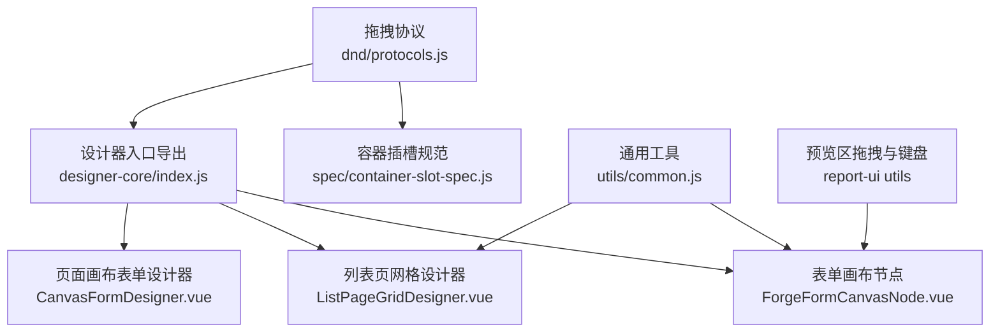
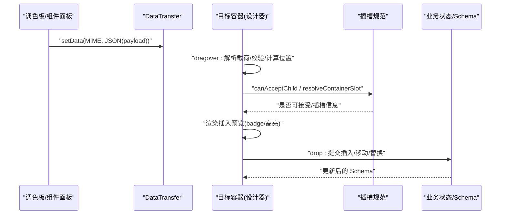
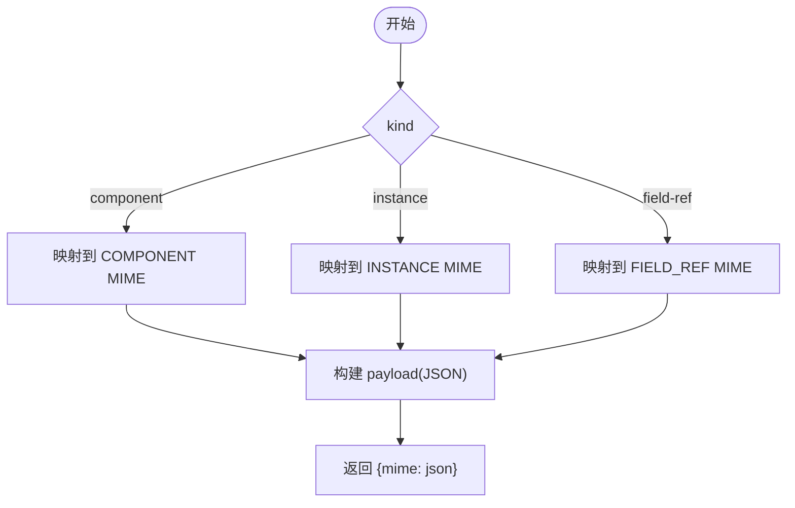
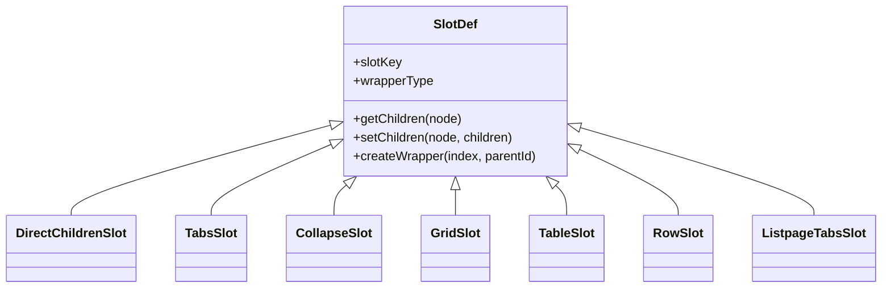
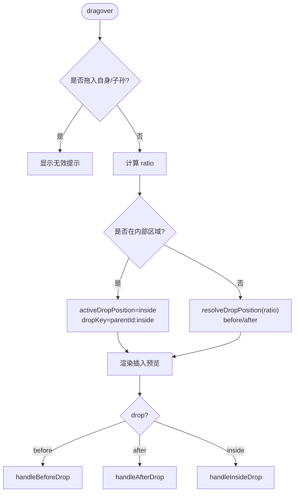
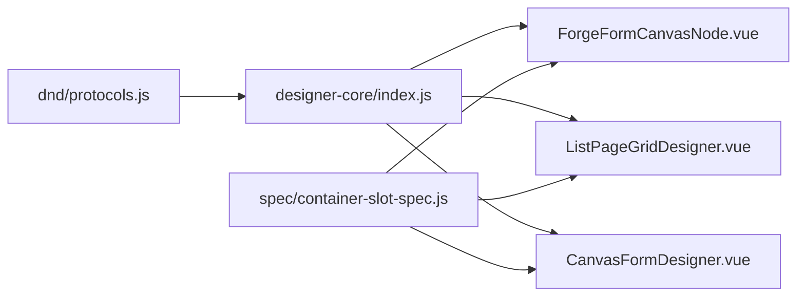

# 拖拽协议实现

<cite>
**本文引用的文件**
- [protocols.js](file://forge-admin-ui/src/components/lowcode-builder/designer-core/dnd/protocols.js)
- [index.js](file://forge-admin-ui/src/components/lowcode-builder/designer-core/index.js)
- [container-slot-spec.js](file://forge-admin-ui/src/components/lowcode-builder/designer-core/spec/container-slot-spec.js)
- [ForgeFormCanvasNode.vue](file://forge-admin-ui/src/views/app-center/components/designer/forge-form-designer/ForgeFormCanvasNode.vue)
- [ListPageGridDesigner.vue](file://forge-admin-ui/src/components/lowcode-builder/page/ListPageGridDesigner.vue)
- [CanvasFormDesigner.vue](file://forge-admin-ui/src/components/lowcode-builder/page/CanvasFormDesigner.vue)
- [common.js（前端工具）](file://forge-admin-ui/src/utils/common.js)
- [drag.ts（预览区拖拽）](file://forge-report-ui/src/views/preview/utils/drag.ts)
- [keyboard.ts（键盘辅助）](file://forge-report-ui/src/views/preview/utils/keyboard.ts)
</cite>

## 目录
1. [简介](#简介)
2. [项目结构](#项目结构)
3. [核心组件](#核心组件)
4. [架构总览](#架构总览)
5. [详细组件分析](#详细组件分析)
6. [依赖关系分析](#依赖关系分析)
7. [性能考虑](#性能考虑)
8. [故障排查指南](#故障排查指南)
9. [结论](#结论)
10. [附录](#附录)

## 简介
本技术文档聚焦低代码设计器的拖拽协议与实现，围绕 dnd/protocols.js 定义的跨设计器统一拖拽规范展开，系统阐述拖拽源、目标、容器的抽象接口设计；深入解析拖拽状态管理、碰撞检测算法与插入位置计算逻辑；说明跨浏览器兼容方案、触摸设备支持与键盘导航辅助能力；总结性能优化策略（防抖/节流、批量更新、内存泄漏防护），并提供扩展自定义拖拽行为的实践指南。

## 项目结构
- 协议层：统一 MIME 类型与载荷序列化/反序列化，确保表单设计器、列表页设计器、页面设计器之间的拖拽数据互通。
- 容器插槽层：定义不同容器类型的子节点存储结构与访问路径，为“插入到内部”提供统一语义。
- 交互层：各设计器视图在 dragover/drop 中解析协议载荷、计算落点、渲染预览并触发业务变更。
- 工具层：通用防抖/节流、键盘辅助等能力支撑流畅体验。

**图表来源**
- [protocols.js:1-80](file://forge-admin-ui/src/components/lowcode-builder/designer-core/dnd/protocols.js#L1-L80)
- [index.js:18-23](file://forge-admin-ui/src/components/lowcode-builder/designer-core/index.js#L18-L23)
- [container-slot-spec.js:274-324](file://forge-admin-ui/src/components/lowcode-builder/designer-core/spec/container-slot-spec.js#L274-L324)
- [ForgeFormCanvasNode.vue:964-1026](file://forge-admin-ui/src/views/app-center/components/designer/forge-form-designer/ForgeFormCanvasNode.vue#L964-L1026)
- [ListPageGridDesigner.vue:7115-7133](file://forge-admin-ui/src/components/lowcode-builder/page/ListPageGridDesigner.vue#L7115-L7133)
- [CanvasFormDesigner.vue:706-726](file://forge-admin-ui/src/components/lowcode-builder/page/CanvasFormDesigner.vue#L706-L726)

**章节来源**
- [protocols.js:1-80](file://forge-admin-ui/src/components/lowcode-builder/designer-core/dnd/protocols.js#L1-L80)
- [index.js:1-126](file://forge-admin-ui/src/components/lowcode-builder/designer-core/index.js#L1-L126)

## 核心组件
- 拖拽协议（MIME + Payload）
  - 定义三类 MIME 类型：组件 spec、已有实例移动、字段引用。
  - createDragPayload：按 kind 构造统一载荷并映射到对应 MIME。
  - parseDragPayload：按优先级尝试读取 MIME，JSON 解析失败回退为 null。
- 容器插槽规范
  - 为不同容器（card/box/space、tabs、collapse、table、row/col、grid、listpage-tabs）定义 children 存取路径与包装节点创建方式。
  - 提供 canAcceptChild、getContainerSlot、resolveContainerConfig、detectTabsMode 等能力。
- 设计器交互
  - 表单设计器：dragover 阶段判定 inside/before/after，计算 ratio 决定插入位置；drop 阶段提交变更。
  - 列表页设计器：根据 block/cell/tab 上下文解析容器与落点。
  - 页面设计器：将拖入的组件转为画布项并设置坐标与层级。

**章节来源**
- [protocols.js:10-80](file://forge-admin-ui/src/components/lowcode-builder/designer-core/dnd/protocols.js#L10-L80)
- [container-slot-spec.js:23-324](file://forge-admin-ui/src/components/lowcode-builder/designer-core/spec/container-slot-spec.js#L23-L324)
- [ForgeFormCanvasNode.vue:964-1026](file://forge-admin-ui/src/views/app-center/components/designer/forge-form-designer/ForgeFormCanvasNode.vue#L964-L1026)
- [ListPageGridDesigner.vue:7115-7133](file://forge-admin-ui/src/components/lowcode-builder/page/ListPageGridDesigner.vue#L7115-L7133)
- [CanvasFormDesigner.vue:706-726](file://forge-admin-ui/src/components/lowcode-builder/page/CanvasFormDesigner.vue#L706-L726)

## 架构总览
拖拽流程从“源组件”开始，通过原生 DataTransfer 携带统一 MIME 载荷；目标容器在 dragover 中解析载荷、进行规则校验与碰撞检测，计算插入位置并渲染预览；drop 时执行实际的数据变更。

**图表来源**
- [protocols.js:29-80](file://forge-admin-ui/src/components/lowcode-builder/designer-core/dnd/protocols.js#L29-L80)
- [container-slot-spec.js:307-360](file://forge-admin-ui/src/components/lowcode-builder/designer-core/spec/container-slot-spec.js#L307-L360)
- [ForgeFormCanvasNode.vue:964-1026](file://forge-admin-ui/src/views/app-center/components/designer/forge-form-designer/ForgeFormCanvasNode.vue#L964-L1026)

## 详细组件分析

### 拖拽协议（MIME 与载荷）
- 设计要点
  - 使用 application/x-forge-designer-* 系列 MIME，避免与浏览器默认拖拽冲突。
  - 载荷包含 kind/type/source/timestamp，以及 instanceId/fieldName 等可选字段。
  - 解析时按 MIME 优先级尝试，异常捕获保证健壮性。
- 关键行为
  - createDragPayload：根据 kind 生成 payload 并映射到对应 MIME。
  - parseDragPayload：遍历 MIME 列表读取并解析，失败返回 null。

**图表来源**
- [protocols.js:29-52](file://forge-admin-ui/src/components/lowcode-builder/designer-core/dnd/protocols.js#L29-L52)

**章节来源**
- [protocols.js:10-80](file://forge-admin-ui/src/components/lowcode-builder/designer-core/dnd/protocols.js#L10-L80)

### 容器插槽规范（children 存取与接受规则）
- 设计要点
  - 针对多种容器结构抽象出统一的 get/set 路径，屏蔽差异。
  - 支持 wrapperType（如 tabPane、collapseItem、tableCell、col）以处理中间包装层。
  - 提供 canAcceptChild 基于 spec.accept 的白名单校验。
- 关键行为
  - getContainerSlot：按 type 或别名解析插槽定义。
  - detectTabsMode：区分表单 tabs 与列表页 tabs 的数据布局。
  - resolveNodeChildSlots：统一获取所有真实子节点槽位。

**图表来源**
- [container-slot-spec.js:23-270](file://forge-admin-ui/src/components/lowcode-builder/designer-core/spec/container-slot-spec.js#L23-L270)

**章节来源**
- [container-slot-spec.js:274-438](file://forge-admin-ui/src/components/lowcode-builder/designer-core/spec/container-slot-spec.js#L274-L438)

### 表单设计器：拖拽状态管理与插入位置计算
- 状态管理
  - activeDropPosition：当前候选位置（before/inside/after）。
  - beforeActive/afterActive：用于区分 before/after drop 分支。
  - activePointerDropTarget：指针模式下的精确落点缓存。
- 碰撞检测与插入计算
  - handleNodeDragOver：计算 ratio = (clientY - top)/height，结合 canPreviewDropIntoCurrentNode 判断 inside 区域；否则 resolveDropPosition 决定 before/after。
  - resolveContainerSlotTarget：对 row/col、table/grid 等特殊容器，定位具体 slot 并返回 parentId/index/dropKey。
  - isDescendantNodeWrap：防止将组件拖入自身或其子孙节点。
- Drop 提交
  - handleNodeDrop：根据 activeDropPosition 分发到 before/after/inside 处理器，最终提交 Schema 变更。

**图表来源**
- [ForgeFormCanvasNode.vue:964-1026](file://forge-admin-ui/src/views/app-center/components/designer/forge-form-designer/ForgeFormCanvasNode.vue#L964-L1026)
- [ForgeFormCanvasNode.vue:1222-1258](file://forge-admin-ui/src/views/app-center/components/designer/forge-form-designer/ForgeFormCanvasNode.vue#L1222-L1258)
- [ForgeFormCanvasNode.vue:1349-1421](file://forge-admin-ui/src/views/app-center/components/designer/forge-form-designer/ForgeFormCanvasNode.vue#L1349-L1421)

**章节来源**
- [ForgeFormCanvasNode.vue:964-1026](file://forge-admin-ui/src/views/app-center/components/designer/forge-form-designer/ForgeFormCanvasNode.vue#L964-L1026)
- [ForgeFormCanvasNode.vue:1222-1258](file://forge-admin-ui/src/views/app-center/components/designer/forge-form-designer/ForgeFormCanvasNode.vue#L1222-L1258)
- [ForgeFormCanvasNode.vue:1349-1421](file://forge-admin-ui/src/views/app-center/components/designer/forge-form-designer/ForgeFormCanvasNode.vue#L1349-L1421)

### 列表页设计器：容器与单元格/标签页落点解析
- 关键点
  - resolveDropContainer：根据事件目标最近匹配 block，并结合 cell/tab 的 data 属性确定 cellKey/tabKey。
  - 与表单设计器类似，先解析容器再计算落点，最后交由上层 drop 处理器提交。

**章节来源**
- [ListPageGridDesigner.vue:7115-7133](file://forge-admin-ui/src/components/lowcode-builder/page/ListPageGridDesigner.vue#L7115-L7133)

### 页面设计器：画布项创建与坐标对齐
- 关键点
  - handleDrop：读取 application/x-lowcode-component 载荷，计算相对画布的 x/y（考虑滚动偏移），创建画布项并追加到 canvasItems。
  - 通过 snapValue 对齐网格，zIndex 递增避免重叠。

**章节来源**
- [CanvasFormDesigner.vue:706-726](file://forge-admin-ui/src/components/lowcode-builder/page/CanvasFormDesigner.vue#L706-L726)

### 跨浏览器兼容性与触摸设备支持
- 兼容性
  - 使用自定义 MIME 避免与系统/浏览器默认拖拽冲突。
  - 通过 try/catch 包裹 JSON.parse，兼容非标准或损坏的 DataTransfer 内容。
- 触摸设备
  - 可在 touchstart/touchmove/touchend 中模拟 DataTransfer 行为，或在移动端启用指针事件（pointerdown/move/up）作为补充。
  - 建议结合 preventDefault 阻止默认滚动/缩放，提升拖拽稳定性。
- 键盘导航辅助
  - 预览区提供键盘辅助：空格键进入平移模式，Ctrl 组合键控制行为，见 preview utils。
  - 在设计器中可结合 Tab/方向键移动焦点，配合 aria-* 属性增强无障碍体验。

**章节来源**
- [drag.ts:1-56](file://forge-report-ui/src/views/preview/utils/drag.ts#L1-L56)
- [keyboard.ts:1-49](file://forge-report-ui/src/views/preview/utils/keyboard.ts#L1-L49)

### 性能优化策略
- 防抖/节流
  - 通用 debounce 工具可用于高频事件（如 dragover 中的预览更新、滚动联动）。
  - 预览区拖拽已使用 throttle 限制mousemove频率，降低重排开销。
- 批量更新
  - 在 drop 前累积多次预览状态，drop 时一次性提交 Schema 变更，减少重渲染。
  - 对于复杂容器（grid/listpage-tabs），优先操作局部 cells/tabs 而非整树重建。
- 内存泄漏防护
  - 在组件卸载时移除全局事件监听（document/window 上的 mousemove/mouseup）。
  - 清理定时器（debounce/throttle 的 timeout），避免悬挂引用。
  - 及时释放 DataTransfer 相关临时对象与 DOM 引用。

**章节来源**
- [common.js（前端工具）:38-84](file://forge-admin-ui/src/utils/common.js#L38-L84)
- [drag.ts:1-56](file://forge-report-ui/src/views/preview/utils/drag.ts#L1-L56)

## 依赖关系分析
- 协议层被 designer-core/index.js 统一导出，供各设计器消费。
- 容器插槽规范为各设计器提供一致的“插入到内部”语义。
- 各设计器在 dragover/drop 中组合协议与插槽规范完成交互。

**图表来源**
- [index.js:18-23](file://forge-admin-ui/src/components/lowcode-builder/designer-core/index.js#L18-L23)
- [container-slot-spec.js:274-324](file://forge-admin-ui/src/components/lowcode-builder/designer-core/spec/container-slot-spec.js#L274-L324)

**章节来源**
- [index.js:1-126](file://forge-admin-ui/src/components/lowcode-builder/designer-core/index.js#L1-L126)
- [container-slot-spec.js:274-438](file://forge-admin-ui/src/components/lowcode-builder/designer-core/spec/container-slot-spec.js#L274-L438)

## 性能考虑
- 事件节流/防抖
  - 在 dragover 中仅做轻量计算与样式切换，避免频繁 DOM 查询与重绘。
  - 对高频回调使用 debounce/throttle，参考通用工具与预览区实现。
- 最小化重排
  - 使用 CSS transform/opacity 做预览动画，减少 layout thrashing。
  - 对大容器采用虚拟滚动或按需渲染子节点。
- 数据结构优化
  - 利用插槽规范的局部 setCellChildren/setTabChildren，避免整树拷贝。
  - 使用 id/key 索引加速查找与比较。
- 资源清理
  - 组件销毁时移除事件监听与定时器，避免内存泄漏。

[本节为通用指导，不直接分析具体文件]

## 故障排查指南
- 无法识别拖拽类型
  - 检查 DataTransfer 中是否写入正确的 MIME；确认 parseDragPayload 能成功解析。
  - 若解析失败，查看控制台异常并修复 payload 格式。
- 插入位置不正确
  - 检查 ratio 计算与 canPreviewDropIntoCurrentNode 条件；确认容器高度与事件坐标。
  - 对 row/col/table/grid 等容器，验证 resolveContainerSlotTarget 返回的 slot 是否正确。
- 拖入自身或子孙节点
  - 确认 isDescendantNodeWrap 与 sourceId 比对逻辑生效。
- 预览闪烁或卡顿
  - 减少 dragover 中的昂贵计算；使用防抖/节流；合并多次状态更新。
- 移动端体验差
  - 补充 pointer 事件或 touch 事件；阻止默认滚动；增大命中区域。

**章节来源**
- [protocols.js:59-80](file://forge-admin-ui/src/components/lowcode-builder/designer-core/dnd/protocols.js#L59-L80)
- [ForgeFormCanvasNode.vue:964-1026](file://forge-admin-ui/src/views/app-center/components/designer/forge-form-designer/ForgeFormCanvasNode.vue#L964-L1026)
- [ForgeFormCanvasNode.vue:1349-1421](file://forge-admin-ui/src/views/app-center/components/designer/forge-form-designer/ForgeFormCanvasNode.vue#L1349-L1421)

## 结论
本项目通过统一的拖拽协议与容器插槽规范，实现了跨设计器的稳定拖拽体验。协议层负责数据契约，插槽层屏蔽容器差异，交互层专注状态与落点计算。借助防抖/节流、局部更新与资源清理，整体性能与可维护性得到保障。未来可进一步扩展触摸与键盘无障碍支持，完善错误诊断与可视化调试能力。

## 附录

### 自定义拖拽行为扩展指南
- 新增拖拽类型
  - 在协议层增加新的 MIME 与 kind，并在 createDragPayload/parseDragPayload 中注册。
  - 在各设计器中适配新 kind 的解析与处理分支。
- 自定义容器插槽
  - 在容器插槽规范中新增 slot 定义，实现 getChildren/setChildren/createWrapper 等方法。
  - 在 canAcceptChild 中配置 accept 白名单，限制可接受的子组件类型。
- 自定义插入逻辑
  - 在 dragover 中扩展 resolveDropPosition 或 resolveContainerSlotTarget，实现特殊布局的插入规则。
  - 在 drop 中调用 tree-ops 或业务方法提交变更，保持不可变更新。
- 示例场景
  - 嵌套表格单元格内拖拽：在 table 容器中定位到具体 cell，计算 index 后插入。
  - 多列栅格拖拽：在 grid 容器中按 cellKey 定位，更新对应 cells.children。
  - 跨面板拖拽：在 palette 侧创建 payload，在画布侧解析并创建画布项。

[本节为概念性指导，不直接分析具体文件]