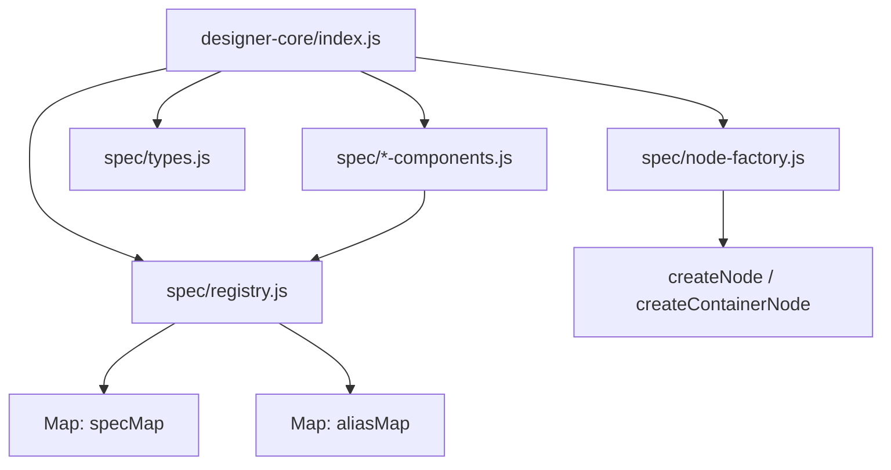
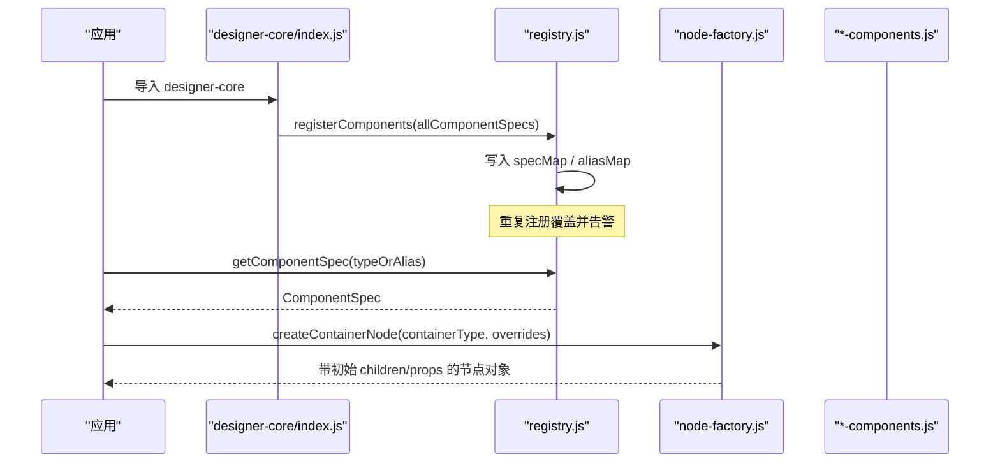
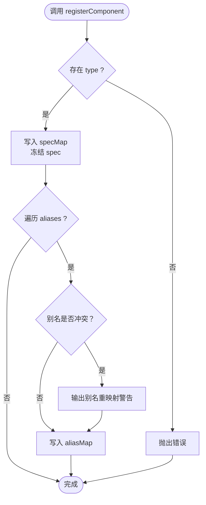
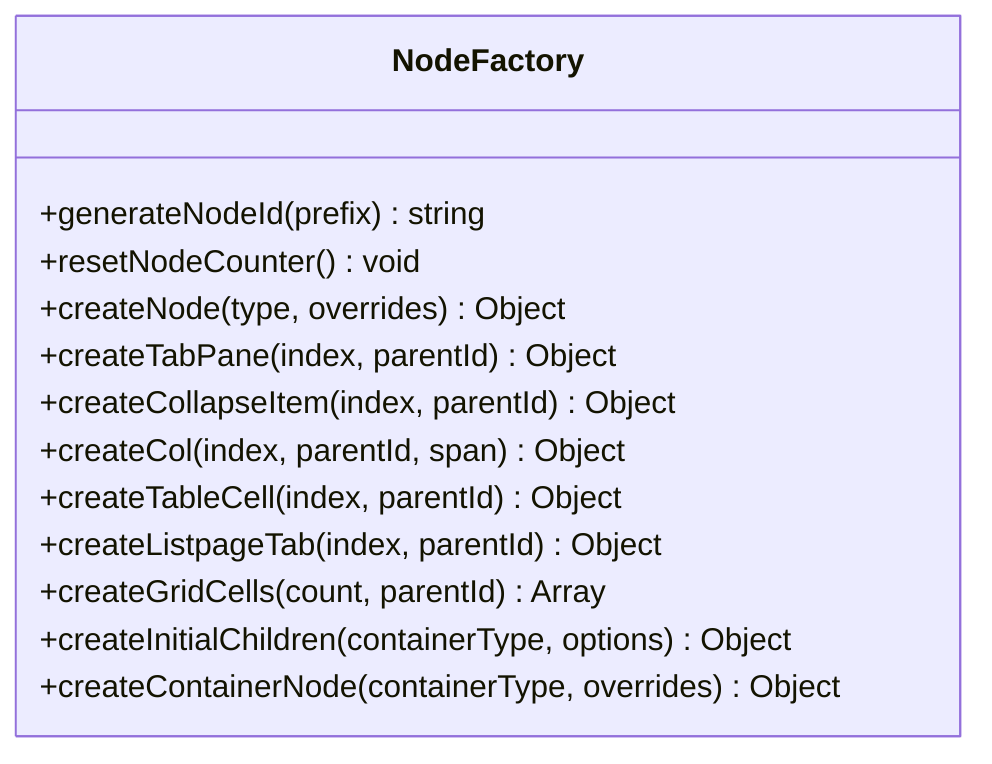
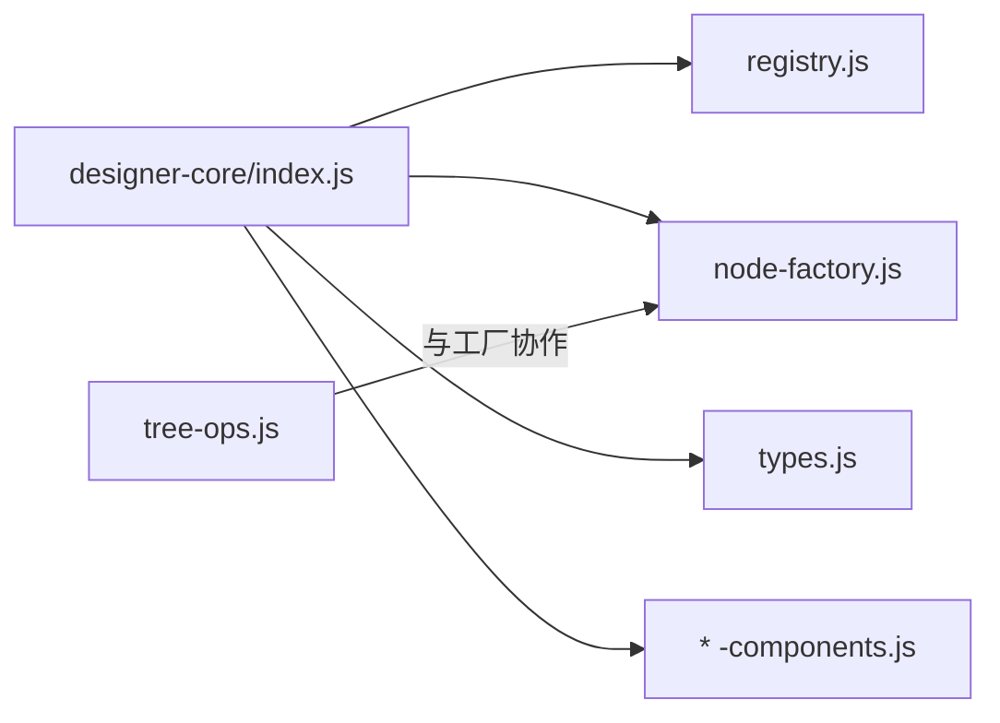

# 组件注册中心

<cite>
**本文引用的文件**
- [registry.js](file://forge-admin-ui/src/components/lowcode-builder/designer-core/spec/registry.js)
- [node-factory.js](file://forge-admin-ui/src/components/lowcode-builder/designer-core/spec/node-factory.js)
- [index.js](file://forge-admin-ui/src/components/lowcode-builder/designer-core/index.js)
- [types.js](file://forge-admin-ui/src/components/lowcode-builder/designer-core/spec/types.js)
- [field-components.js](file://forge-admin-ui/src/components/lowcode-builder/designer-core/spec/field-components.js)
- [tree-ops.js](file://forge-admin-ui/src/components/lowcode-builder/designer-core/spec/tree-ops.js)
- [flow-form-loader.js](file://forge-admin-ui/src/utils/flow-form-loader.js)
- [components.ts](file://forge-report-ui/src/utils/components.ts)
- [watermark.js](file://forge-admin-ui/src/directives/modules/watermark.js)
- [loading.js](file://forge-admin-ui/src/directives/modules/loading.js)
</cite>

## 目录
1. [简介](#简介)
2. [项目结构](#项目结构)
3. [核心组件](#核心组件)
4. [架构总览](#架构总览)
5. [详细组件分析](#详细组件分析)
6. [依赖关系分析](#依赖关系分析)
7. [性能与内存管理](#性能与内存管理)
8. [故障排查指南](#故障排查指南)
9. [结论](#结论)
10. [附录：API 参考与示例](#附录api-参考与示例)

## 简介
本技术文档聚焦低代码设计器的“组件注册中心”，围绕 registry.js 的注册机制、node-factory.js 的节点工厂模式，系统阐述组件生命周期管理、动态加载策略、依赖注入机制、命名空间与别名管理、版本兼容处理，以及热重载、懒加载优化与内存管理等高级特性。文档同时提供具体使用路径与调用流程说明，帮助读者在不直接阅读源码的情况下理解并扩展该子系统。

## 项目结构
设计器核心模块位于 designer-core 下，采用“规范定义 + 注册表 + 工具”的分层组织：
- 规范定义：types.js 定义统一协议；各分类 spec（如 field-components.js）集中声明组件元数据。
- 注册表：registry.js 维护组件规格 Map、别名映射，并提供注册、查询、分组、统计等 API。
- 入口聚合：designer-core/index.js 汇总所有组件 spec 并在首次导入时自动完成批量注册，同时导出注册表 API、节点工厂、树操作等能力。
- 节点工厂：node-factory.js 提供最小节点创建、容器初始子节点生成、ID 生成等工具。

图表来源
- [index.js:55-67](file://forge-admin-ui/src/components/lowcode-builder/designer-core/index.js#L55-L67)
- [registry.js:7-31](file://forge-admin-ui/src/components/lowcode-builder/designer-core/spec/registry.js#L7-L31)
- [node-factory.js:31-49](file://forge-admin-ui/src/components/lowcode-builder/designer-core/spec/node-factory.js#L31-L49)

章节来源
- [index.js:1-126](file://forge-admin-ui/src/components/lowcode-builder/designer-core/index.js#L1-L126)
- [registry.js:1-169](file://forge-admin-ui/src/components/lowcode-builder/designer-core/spec/registry.js#L1-L169)
- [node-factory.js:1-257](file://forge-admin-ui/src/components/lowcode-builder/designer-core/spec/node-factory.js#L1-L257)
- [types.js:1-120](file://forge-admin-ui/src/components/lowcode-builder/designer-core/spec/types.js#L1-L120)

## 核心组件
- 组件注册表（registry.js）
  - 职责：维护组件规格与别名映射，提供注册、查询、过滤、分组、统计、清空等能力。
  - 关键数据结构：specMap（type → ComponentSpec）、aliasMap（alias → type）。
  - 关键行为：重复注册覆盖并告警；别名冲突重映射并告警；冻结 spec 防止外部篡改。
- 节点工厂（node-factory.js）
  - 职责：为不同容器类型生成初始 children 结构，提供通用 createNode/createContainerNode 等工具。
  - 关键行为：唯一 ID 生成、容器默认列数/单元格数/标签数配置、children 与 props 合并保护。
- 类型协议（types.js）
  - 职责：定义 ComponentSpec、PropsSchema、DataSourceKind、LayoutSpec、PrintSpec、FieldDefaults、ContainerSpec 等统一类型。
- 组件规范集合（各 *-components.js）
  - 职责：按分类声明组件元数据（type、aliases、scope、category、group、label、desc、layout、container、accept、propsSchema、dataSources、print、fieldDefaults、meta）。

章节来源
- [registry.js:7-31](file://forge-admin-ui/src/components/lowcode-builder/designer-core/spec/registry.js#L7-L31)
- [node-factory.js:10-49](file://forge-admin-ui/src/components/lowcode-builder/designer-core/spec/node-factory.js#L10-L49)
- [types.js:98-120](file://forge-admin-ui/src/components/lowcode-builder/designer-core/spec/types.js#L98-L120)
- [field-components.js:1-200](file://forge-admin-ui/src/components/lowcode-builder/designer-core/spec/field-components.js#L1-L200)

## 架构总览
组件注册中心以“集中式注册表 + 多源规范 + 工厂化节点”为核心，形成如下工作流：
- 启动阶段：designer-core/index.js 聚合全部组件 spec，调用 registerComponents 完成一次性注册。
- 运行时：通过 getComponentSpec/resolveComponentType/listComponents 等 API 获取组件元信息；通过 node-factory 生成节点树片段。
- 渲染阶段：上层设计器根据 spec 的 propsSchema、dataSources、print、fieldDefaults 等元信息驱动属性面板、数据绑定、打印与字段默认值。

图表来源
- [index.js:55-67](file://forge-admin-ui/src/components/lowcode-builder/designer-core/index.js#L55-L67)
- [registry.js:17-41](file://forge-admin-ui/src/components/lowcode-builder/designer-core/spec/registry.js#L17-L41)
- [node-factory.js:231-257](file://forge-admin-ui/src/components/lowcode-builder/designer-core/spec/node-factory.js#L231-L257)

## 详细组件分析

### 组件注册表（registry.js）
- 注册机制
  - registerComponent(spec)：校验 type，写入 specMap，冻结 spec，同步 aliases 到 aliasMap；重复注册会覆盖并输出警告。
  - registerComponents(specs)：批量注册，内部复用单条注册逻辑。
- 查询与解析
  - getComponentSpec(typeOrAlias)：优先按 type 查找，否则通过 aliasMap 解析后取 spec。
  - resolveComponentType(typeOrAlias)：返回统一 type 名（若为别名则解析，否则原样返回）。
  - hasComponent(typeOrAlias)：判断 type 或 alias 是否已注册。
- 列表与分组
  - listAllComponents()：按注册顺序返回所有 spec。
  - listComponents(scope)：按 scope 过滤（支持 'F' | 'L' | 'F+L'）。
  - listComponentsByCategory(category, scope)：按 category 过滤并可叠加 scope。
  - groupComponents(scope)：按 group 分组返回 Map。
- 统计与清理
  - listAllTypes()：返回所有 type 列表。
  - getAliasMap()：返回别名映射副本。
  - getRegistryStats()：统计总数、按分类/作用域计数、别名数量。
  - clearRegistry()：清空 specMap 与 aliasMap（仅测试场景）。

图表来源
- [registry.js:17-31](file://forge-admin-ui/src/components/lowcode-builder/designer-core/spec/registry.js#L17-L31)

章节来源
- [registry.js:17-169](file://forge-admin-ui/src/components/lowcode-builder/designer-core/spec/registry.js#L17-L169)

### 节点工厂（node-factory.js）
- 唯一 ID 生成
  - generateNodeId(prefix)：基于时间戳与自增计数器生成唯一 ID。
  - resetNodeCounter()：重置计数器（用于测试）。
- 基础节点创建
  - createNode(type, overrides)：生成最小可用节点对象（id、componentKey、type、label、props、layout、children），支持覆盖字段。
- 包装节点创建
  - createTabPane、createCollapseItem、createCol、createTableCell：为特定容器生成包装节点，附带默认 props 与 layout。
- 容器初始子节点工厂
  - createInitialChildren(containerType, options)：根据容器类型生成初始 children 结构与 props 覆盖（如 tabs、collapse、row/grid/table 等）。
  - createContainerNode(containerType, overrides)：组合 createInitialChildren 的结果，生成完整容器节点，确保 children 与 props 不被覆盖。

图表来源
- [node-factory.js:10-49](file://forge-admin-ui/src/components/lowcode-builder/designer-core/spec/node-factory.js#L10-L49)
- [node-factory.js:51-144](file://forge-admin-ui/src/components/lowcode-builder/designer-core/spec/node-factory.js#L51-L144)
- [node-factory.js:146-257](file://forge-admin-ui/src/components/lowcode-builder/designer-core/spec/node-factory.js#L146-L257)

章节来源
- [node-factory.js:1-257](file://forge-admin-ui/src/components/lowcode-builder/designer-core/spec/node-factory.js#L1-L257)

### 组件规范与类型协议（types.js 与各 *-components.js）
- types.js 定义了统一的 ComponentSpec 协议，包括 type、aliases、scope、category、group、label、desc、layout、container、maxDepth、accept、propsSchema、dataSources、print、fieldDefaults、meta 等字段，确保所有组件遵循同一套契约。
- field-components.js 等分类文件集中声明了字段类组件的元数据，包含 propsSchema、dataSources、fieldDefaults 等，便于属性面板与数据绑定引擎消费。

章节来源
- [types.js:98-120](file://forge-admin-ui/src/components/lowcode-builder/designer-core/spec/types.js#L98-L120)
- [field-components.js:1-200](file://forge-admin-ui/src/components/lowcode-builder/designer-core/spec/field-components.js#L1-L200)

## 依赖关系分析
- 入口依赖：designer-core/index.js 聚合所有组件 spec 并执行一次性注册，同时导出注册表 API、节点工厂、树操作等。
- 注册表依赖：registry.js 依赖 types.js 的类型约定，被 index.js 在启动时调用。
- 节点工厂依赖：node-factory.js 独立于注册表，但通常与设计器树操作 tree-ops.js 配合使用，进行节点的插入、删除、移动等操作。
- 运行时集成：其他模块可通过 import designer-core 获得注册表与工厂能力；部分页面/指令通过 Vue 实例挂载/卸载实现局部功能（如水印、loading）。

图表来源
- [index.js:55-126](file://forge-admin-ui/src/components/lowcode-builder/designer-core/index.js#L55-L126)
- [tree-ops.js:355-403](file://forge-admin-ui/src/components/lowcode-builder/designer-core/spec/tree-ops.js#L355-L403)

章节来源
- [index.js:1-126](file://forge-admin-ui/src/components/lowcode-builder/designer-core/index.js#L1-L126)
- [tree-ops.js:355-403](file://forge-admin-ui/src/components/lowcode-builder/designer-core/spec/tree-ops.js#L355-L403)

## 性能与内存管理
- 懒加载与按需引入
  - 组件规范在入口一次性注册，避免重复开销；实际组件渲染由上层按需加载。
  - 视图/表单模块可使用异步加载器缓存 Promise，失败时清理缓存并重试，提升首屏性能与稳定性。
- 组件热重载
  - 通过监听组件列表变化并重新安装组件，可实现预览态的热更新；注意在卸载时清理定时器与监听器，避免内存泄漏。
- 内存管理
  - 指令级 Vue 实例（如水印、loading）在 unmounted 钩子中正确 unmount 并移除 DOM 引用，释放内存。
  - 注册表冻结 spec，避免运行时意外修改导致状态不一致。
- 树操作不可变更新
  - 节点删除等树操作采用不可变方式返回新树，减少副作用与引用污染风险。

章节来源
- [flow-form-loader.js:44-77](file://forge-admin-ui/src/utils/flow-form-loader.js#L44-L77)
- [watermark.js:56-129](file://forge-admin-ui/src/directives/modules/watermark.js#L56-L129)
- [loading.js:51-105](file://forge-admin-ui/src/directives/modules/loading.js#L51-L105)
- [tree-ops.js:355-403](file://forge-admin-ui/src/components/lowcode-builder/designer-core/spec/tree-ops.js#L355-L403)

## 故障排查指南
- 重复注册与别名冲突
  - 现象：控制台出现覆盖/重映射警告。
  - 排查：检查是否存在同名 type 或多个别名指向不同 type；必要时调整别名或合并 spec。
- 组件未找到
  - 现象：getComponentSpec 返回 undefined。
  - 排查：确认 type 或 alias 是否正确；检查是否在入口完成批量注册；核对 scope/category 过滤条件。
- 容器初始子节点异常
  - 现象：拖入容器后无默认子项或布局错乱。
  - 排查：核对 createInitialChildren 的分支逻辑与传入参数（columnCount/cellCount/tabCount）；检查 createContainerNode 的合并策略。
- 内存泄漏
  - 现象：长时间运行后内存增长。
  - 排查：检查指令/插件创建的 Vue 实例是否在 unmounted 中正确销毁；确认异步加载器缓存是否及时清理。

章节来源
- [registry.js:17-31](file://forge-admin-ui/src/components/lowcode-builder/designer-core/spec/registry.js#L17-L31)
- [registry.js:43-75](file://forge-admin-ui/src/components/lowcode-builder/designer-core/spec/registry.js#L43-L75)
- [node-factory.js:146-257](file://forge-admin-ui/src/components/lowcode-builder/designer-core/spec/node-factory.js#L146-L257)
- [flow-form-loader.js:44-77](file://forge-admin-ui/src/utils/flow-form-loader.js#L44-L77)
- [watermark.js:56-129](file://forge-admin-ui/src/directives/modules/watermark.js#L56-L129)
- [loading.js:51-105](file://forge-admin-ui/src/directives/modules/loading.js#L51-L105)

## 结论
本注册中心通过集中式 spec 管理与别名解析，实现了跨设计器的统一组件模型；节点工厂提供了标准化的节点构建能力，结合不可变树操作保障数据一致性。配合懒加载、热重载与严格的内存管理，整体具备高可扩展性与可维护性。建议在新组件接入时严格遵循 types.js 协议，并通过入口聚合完成一次性注册，以获得最佳体验。

## 附录：API 参考与示例

### 注册表 API
- 注册
  - registerComponent(spec)：注册单个组件 spec。
  - registerComponents(specs)：批量注册。
- 查询与解析
  - getComponentSpec(typeOrAlias)：获取组件 spec。
  - resolveComponentType(typeOrAlias)：解析统一 type。
  - hasComponent(typeOrAlias)：检查是否已注册。
- 列表与分组
  - listAllComponents()：列出全部组件。
  - listComponents(scope)：按作用域过滤。
  - listComponentsByCategory(category, scope)：按分类与作用域过滤。
  - groupComponents(scope)：按组分组。
- 统计与清理
  - listAllTypes()：列出所有 type。
  - getAliasMap()：获取别名映射。
  - getRegistryStats()：获取统计信息。
  - clearRegistry()：清空注册表（测试用）。

章节来源
- [registry.js:17-169](file://forge-admin-ui/src/components/lowcode-builder/designer-core/spec/registry.js#L17-L169)

### 节点工厂 API
- 基础
  - generateNodeId(prefix)：生成唯一 ID。
  - resetNodeCounter()：重置计数器。
  - createNode(type, overrides)：创建最小节点。
- 容器
  - createInitialChildren(containerType, options)：生成初始子节点与 props 覆盖。
  - createContainerNode(containerType, overrides)：创建完整容器节点。
- 包装节点
  - createTabPane / createCollapseItem / createCol / createTableCell / createListpageTab / createGridCells。

章节来源
- [node-factory.js:10-257](file://forge-admin-ui/src/components/lowcode-builder/designer-core/spec/node-factory.js#L10-L257)

### 动态注册与卸载示例（路径指引）
- 动态注册组件（全局 Vue 实例）
  - 参考：[components.ts:1-30](file://forge-report-ui/src/utils/components.ts#L1-L30)
  - 说明：通过 window['$vue'].component(key, node) 将组件注册到全局 Vue 实例，支持异步加载与占位组件。
- 动态加载与缓存
  - 参考：[flow-form-loader.js:44-77](file://forge-admin-ui/src/utils/flow-form-loader.js#L44-L77)
  - 说明：对模块加载 Promise 进行缓存，失败时清理缓存并重试，提升稳定性。
- 组件热重载
  - 参考：[useComInstall.hook.ts:31-72](file://forge-report-ui/src/views/preview/hooks/useComInstall.hook.ts#L31-L72)
  - 说明：监听组件列表变化，动态安装组件并设置监视，实现预览态热更新。
- 内存清理（指令级 Vue 实例）
  - 参考：[watermark.js:56-129](file://forge-admin-ui/src/directives/modules/watermark.js#L56-L129)、[loading.js:51-105](file://forge-admin-ui/src/directives/modules/loading.js#L51-L105)
  - 说明：在 unmounted 钩子中卸载 Vue 实例并移除 DOM 引用，避免内存泄漏。

章节来源
- [components.ts:1-30](file://forge-report-ui/src/utils/components.ts#L1-L30)
- [flow-form-loader.js:44-77](file://forge-admin-ui/src/utils/flow-form-loader.js#L44-L77)
- [watermark.js:56-129](file://forge-admin-ui/src/directives/modules/watermark.js#L56-L129)
- [loading.js:51-105](file://forge-admin-ui/src/directives/modules/loading.js#L51-L105)