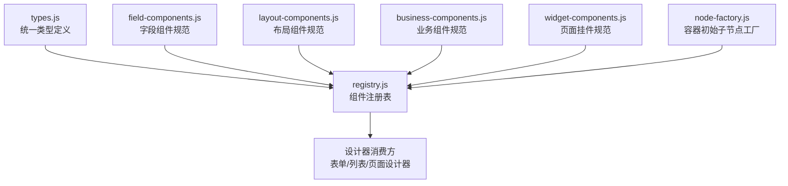
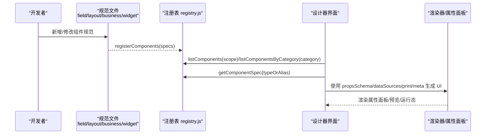
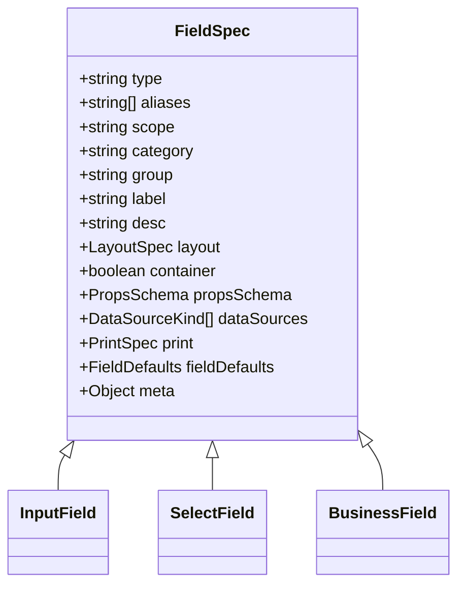
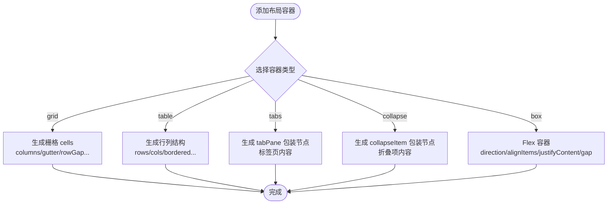
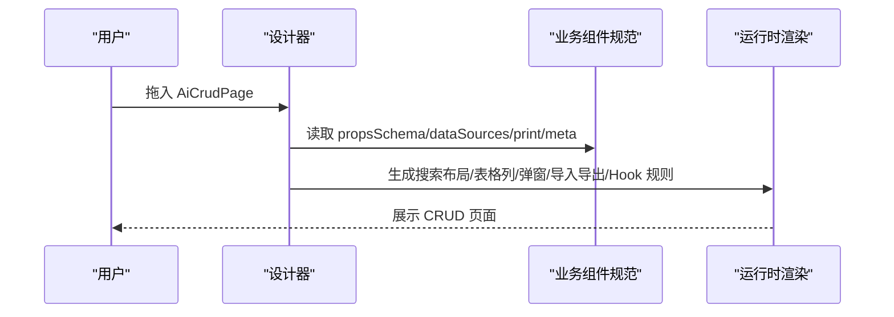
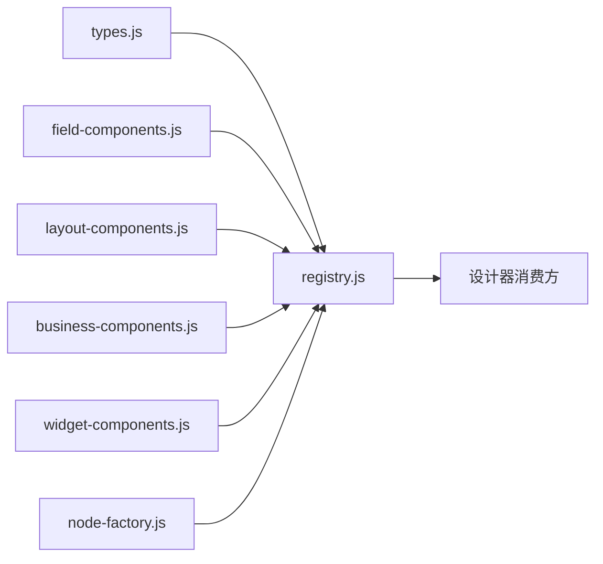

# 组件规范系统

<cite>
**本文引用的文件**
- [types.js](file://forge-admin-ui/src/components/lowcode-builder/designer-core/spec/types.js)
- [business-components.js](file://forge-admin-ui/src/components/lowcode-builder/designer-core/spec/business-components.js)
- [field-components.js](file://forge-admin-ui/src/components/lowcode-builder/designer-core/spec/field-components.js)
- [layout-components.js](file://forge-admin-ui/src/components/lowcode-builder/designer-core/spec/layout-components.js)
- [widget-components.js](file://forge-admin-ui/src/components/lowcode-builder/designer-core/spec/widget-components.js)
- [registry.js](file://forge-admin-ui/src/components/lowcode-builder/designer-core/spec/registry.js)
- [node-factory.js](file://forge-admin-ui/src/components/lowcode-builder/designer-core/spec/node-factory.js)
</cite>

## 目录
1. [简介](#简介)
2. [项目结构](#项目结构)
3. [核心组件](#核心组件)
4. [架构总览](#架构总览)
5. [详细组件分析](#详细组件分析)
6. [依赖关系分析](#依赖关系分析)
7. [性能考量](#性能考量)
8. [故障排查指南](#故障排查指南)
9. [结论](#结论)
10. [附录：自定义组件规范开发指南](#附录自定义组件规范开发指南)

## 简介
本技术文档聚焦低代码设计器“组件规范系统”，围绕 spec 目录下的统一协议与实现，系统性解析类型定义、业务组件规范、字段组件规范、布局组件规范的元数据结构、属性面板 Schema、数据源绑定、打印配置、容器约束、包装节点等核心概念。同时给出不同类型组件的规范差异与扩展方式，并提供自定义组件规范的开发指南与示例路径，帮助开发者快速新增或扩展现有组件能力。

## 项目结构
spec 目录采用“协议 + 分类规范 + 注册表 + 工厂”的分层组织：
- types.js：统一类型定义（ComponentSpec、PropsSchema、DataSourceConfig、LayoutSpec、PrintSpec、FieldDefaults、ContainerSpec）
- field-components.js：字段组件规范（输入、选择、业务三类）
- layout-components.js：布局容器与包装节点规范（栅格、表格、卡片、标签页、折叠、盒子、分隔、留白、间距、标题等）
- business-components.js：业务区块规范（CRUD、表格、表单、子表、查询表单、工具栏、详情、分步表单、签名、子表 Tab 等）
- widget-components.js：页面挂件规范（富文本、水印、Vue 组件、HTML、Markdown、日历、代码、倒计时、描述、公示、列表、日志、数值动画、面包屑、菜单、分页、面板分隔等）
- registry.js：统一组件注册表（注册、别名解析、按 scope/category/group 过滤、统计）
- node-factory.js：容器初始子节点工厂（创建 tabPane/collapseItem/col/tableCell/grid cells 等）

图表来源
- [types.js:1-120](file://forge-admin-ui/src/components/lowcode-builder/designer-core/spec/types.js#L1-L120)
- [registry.js:1-169](file://forge-admin-ui/src/components/lowcode-builder/designer-core/spec/registry.js#L1-L169)
- [field-components.js:1-541](file://forge-admin-ui/src/components/lowcode-builder/designer-core/spec/field-components.js#L1-L541)
- [layout-components.js:1-407](file://forge-admin-ui/src/components/lowcode-builder/designer-core/spec/layout-components.js#L1-L407)
- [business-components.js:1-257](file://forge-admin-ui/src/components/lowcode-builder/designer-core/spec/business-components.js#L1-L257)
- [widget-components.js:1-453](file://forge-admin-ui/src/components/lowcode-builder/designer-core/spec/widget-components.js#L1-L453)
- [node-factory.js:1-257](file://forge-admin-ui/src/components/lowcode-builder/designer-core/spec/node-factory.js#L1-L257)

章节来源
- [types.js:1-120](file://forge-admin-ui/src/components/lowcode-builder/designer-core/spec/types.js#L1-L120)
- [registry.js:1-169](file://forge-admin-ui/src/components/lowcode-builder/designer-core/spec/registry.js#L1-L169)

## 核心组件
- 统一类型定义（types.js）
  - ComponentSpec：统一组件规格的核心协议，包含 type、aliases、scope、category、group、label、desc、layout、container、maxDepth、accept、propsSchema、dataSources、print、fieldDefaults、meta 等字段，用于驱动属性面板、渲染器、校验器、打印器等模块。
  - PropsSchema：属性面板 Schema，支持 string/number/boolean/select/color/json/code/customEditor/section 等编辑器类型，并支持必填、默认值、范围、选项、占位符、禁用、说明等。
  - DataSourceKind/DataSourceConfig：数据源类型枚举与配置（static/dict/managed/remote/context/relation/builtin），支持接口地址、方法、参数、数据路径、字典类型、字段映射、上下文路径等。
  - LayoutSpec/PrintSpec/FieldDefaults/ContainerSpec：布局、打印、字段默认值、容器约束的统一描述。

- 组件注册表（registry.js）
  - registerComponent/registerComponents：注册单个或批量组件规范，自动维护 type→spec 与 alias→type 映射。
  - getComponentSpec/resolveComponentType/hasComponent：按 type 或别名获取规范、解析统一 type、检查是否存在。
  - listComponents/listComponentsByCategory/groupComponents：按 scope/category/group 过滤与分组，供侧边栏展示。
  - getRegistryStats：统计总数、按类别/作用域分布、别名数量。
  - clearRegistry：测试用清空。

- 容器初始子节点工厂（node-factory.js）
  - generateNodeId/resetNodeCounter：唯一 ID 生成与重置。
  - createNode/createTabPane/createCollapseItem/createCol/createTableCell：基础节点与包装节点创建。
  - createListpageTab/createGridCells：列表页 tabs 与 grid cells 结构。
  - createInitialChildren/createContainerNode：根据容器类型生成初始 children 与 props，封装为完整容器节点。

章节来源
- [types.js:1-120](file://forge-admin-ui/src/components/lowcode-builder/designer-core/spec/types.js#L1-L120)
- [registry.js:1-169](file://forge-admin-ui/src/components/lowcode-builder/designer-core/spec/registry.js#L1-L169)
- [node-factory.js:1-257](file://forge-admin-ui/src/components/lowcode-builder/designer-core/spec/node-factory.js#L1-L257)

## 架构总览
组件规范系统通过“规范定义 → 注册表 → 设计器消费”的链路工作：
- 各分类规范文件集中声明组件元数据（类型、分组、属性面板、数据源、打印、容器约束等）。
- 注册表统一管理所有规范，提供查询、过滤、分组、别名解析等能力。
- 设计器（表单/列表/页面）基于注册表构建侧边栏、属性面板、拖拽规则、渲染器映射、打印策略等。

图表来源
- [registry.js:17-107](file://forge-admin-ui/src/components/lowcode-builder/designer-core/spec/registry.js#L17-L107)
- [field-components.js:1-541](file://forge-admin-ui/src/components/lowcode-builder/designer-core/spec/field-components.js#L1-L541)
- [layout-components.js:1-407](file://forge-admin-ui/src/components/lowcode-builder/designer-core/spec/layout-components.js#L1-L407)
- [business-components.js:1-257](file://forge-admin-ui/src/components/lowcode-builder/designer-core/spec/business-components.js#L1-L257)
- [widget-components.js:1-453](file://forge-admin-ui/src/components/lowcode-builder/designer-core/spec/widget-components.js#L1-L453)

## 详细组件分析

### 字段组件规范（field-components.js）
- 覆盖范围：输入类（如 input、textarea、number、money、slider、rate、color、barcodeScanner）、选择类（select、dictSelect、radio/radioButton、checkbox、transfer、cascader、treeSelect、customSelect、date/datetime/daterange/datetimerange/month/year/timerange/switch）、业务类（userSelect、orgTreeSelect、regionTreeSelect、objectReference、recordSelector、fileUpload、imageUpload、text）。
- 关键特性：
  - 每个组件均定义 propsSchema，驱动属性面板编辑。
  - 多数字段组件提供 fieldDefaults，用于数据库/业务字段类型映射、默认 componentType、长度、精度、查询方式等。
  - dataSources 指定可绑定的数据源类型（如 static/dict/remote/relation/builtin/context）。
  - print 控制打印行为（hidden/breakAvoid）。
  - scope 限定可用设计器范围（F/L/F+L）。

图表来源
- [field-components.js:12-528](file://forge-admin-ui/src/components/lowcode-builder/designer-core/spec/field-components.js#L12-L528)
- [types.js:31-86](file://forge-admin-ui/src/components/lowcode-builder/designer-core/spec/types.js#L31-L86)

章节来源
- [field-components.js:1-541](file://forge-admin-ui/src/components/lowcode-builder/designer-core/spec/field-components.js#L1-L541)
- [types.js:31-86](file://forge-admin-ui/src/components/lowcode-builder/designer-core/spec/types.js#L31-L86)

### 布局组件规范（layout-components.js）
- 覆盖范围：栅格（grid）、表格（table）、卡片（card）、标签页（tabs）、折叠（collapse）、盒子（box）、分隔线（divider）、留白（spacer）、间距（space）、分组标题（groupTitle）、表单分隔线（formSectionTitle），以及包装节点（tabPane、collapseItem、col、tableCell）。
- 关键特性：
  - 容器型组件设置 container=true，并可限制 maxDepth 与 accept 子组件类型。
  - 属性键与渲染器消费键严格对齐（例如 grid 的 columns/gutter/rowGap/alignItems/justifyItems/cellMinHeight/cellBackground/showCellBorder；box 的 direction/wrap/alignItems/justifyContent/gap）。
  - 包装节点作为容器内部层，接受任意子组件，简化嵌套结构。
  - 提供默认 span/defaultW/defaultH 以优化拖入体验。

图表来源
- [layout-components.js:7-388](file://forge-admin-ui/src/components/lowcode-builder/designer-core/spec/layout-components.js#L7-L388)
- [node-factory.js:160-229](file://forge-admin-ui/src/components/lowcode-builder/designer-core/spec/node-factory.js#L160-L229)

章节来源
- [layout-components.js:1-407](file://forge-admin-ui/src/components/lowcode-builder/designer-core/spec/layout-components.js#L1-L407)
- [node-factory.js:1-257](file://forge-admin-ui/src/components/lowcode-builder/designer-core/spec/node-factory.js#L1-L257)

### 业务组件规范（business-components.js）
- 覆盖范围：AiCrudPage（一体化 CRUD）、AiTable（独立表格）、AiForm（数据表单）、subTable（关联子表）、search-form（查询表单）、toolbar（操作工具栏）、dataTable（基础列表）、tree-panel（筛选树）、detail-info（详情信息）、step-form（分步表单）、signature-pad（手写签名）、sub-table-tabs（子表 Tab）。
- 关键特性：
  - 多组件具备 unique/multiField/requireFields/onlyFor 等 meta 约束，用于设计期校验与场景适配。
  - 大量使用 customEditor 编辑器（如 CrudSearchLayoutEditor、CrudTableColumnsEditor、CrudDefaultParamsEditor、CrudHookRulesEditor、CrudExpandConfigEditor、SearchFieldsEditor）增强属性面板能力。
  - dataSources 支持 managed/remote/relation/context 等，配合接口配置与 Hook 规则实现数据流。
  - print 配置区分交互组件隐藏与内容组件保留。

图表来源
- [business-components.js:7-251](file://forge-admin-ui/src/components/lowcode-builder/designer-core/spec/business-components.js#L7-L251)

章节来源
- [business-components.js:1-257](file://forge-admin-ui/src/components/lowcode-builder/designer-core/spec/business-components.js#L1-L257)

### 页面挂件规范（widget-components.js）
- 覆盖范围：富文本、穿梭框、水印、Vue 组件、HTML 标签、Markdown、日历、代码、倒计时、描述、公示、列表、日志、数值动画、面包屑、菜单、分页、面板分隔等。
- 关键特性：
  - 多数挂件支持 context 数据源，便于在页面中展示动态信息。
  - 部分挂件具备容器能力（如 split），可嵌套其他组件。
  - 属性面板通过 json/code/customEditor 等类型提供灵活配置。

章节来源
- [widget-components.js:1-453](file://forge-admin-ui/src/components/lowcode-builder/designer-core/spec/widget-components.js#L1-L453)

## 依赖关系分析
- 类型依赖：所有规范文件依赖 types.js 中的类型定义，确保字段语义一致。
- 注册依赖：各分类规范通过 registry.js 暴露注册 API，供设计器初始化时加载。
- 工厂依赖：node-factory.js 为布局容器提供初始子节点结构，与 layout-components.js 的容器类型一一对应。
- 别名机制：registry.js 维护 alias→type 映射，兼容历史组件 key，避免破坏既有设计稿。

图表来源
- [types.js:1-120](file://forge-admin-ui/src/components/lowcode-builder/designer-core/spec/types.js#L1-L120)
- [registry.js:1-169](file://forge-admin-ui/src/components/lowcode-builder/designer-core/spec/registry.js#L1-L169)
- [field-components.js:1-541](file://forge-admin-ui/src/components/lowcode-builder/designer-core/spec/field-components.js#L1-L541)
- [layout-components.js:1-407](file://forge-admin-ui/src/components/lowcode-builder/designer-core/spec/layout-components.js#L1-L407)
- [business-components.js:1-257](file://forge-admin-ui/src/components/lowcode-builder/designer-core/spec/business-components.js#L1-L257)
- [widget-components.js:1-453](file://forge-admin-ui/src/components/lowcode-builder/designer-core/spec/widget-components.js#L1-L453)
- [node-factory.js:1-257](file://forge-admin-ui/src/components/lowcode-builder/designer-core/spec/node-factory.js#L1-L257)

章节来源
- [registry.js:1-169](file://forge-admin-ui/src/components/lowcode-builder/designer-core/spec/registry.js#L1-L169)

## 性能考量
- 注册表查询复杂度：Map 存取 O(1)，listComponents/listComponentsByCategory 为线性过滤，适合组件规模百级以内。
- 别名解析：alias→type 映射一次建立，后续解析 O(1)。
- 容器初始子节点：createInitialChildren 按需生成最小结构，减少不必要的 DOM 与状态开销。
- 属性面板渲染：propsSchema 仅声明必要字段，避免冗余 UI 生成。
- 建议：大规模组件库可按 scope/category 懒加载注册，或在设计器启动时分批注册。

[本节为通用性能讨论，不直接分析具体文件]

## 故障排查指南
- 重复注册警告：当同一 type 被多次注册时，registry.js 会输出警告并覆盖旧值。检查是否重复引入规范文件或错误拼接了 specs。
- 别名冲突：若别名已映射到不同 type，registry.js 会提示重映射。需调整别名以避免歧义。
- 容器 accept 限制：将不接受的子组件拖入容器会被拒绝。检查 layout-components.js 中容器的 accept 列表。
- 数据源不匹配：字段组件的 dataSources 与运行时数据源不一致会导致绑定失败。核对 field-components.js 中组件的 dataSources。
- 打印异常：确认组件 print.hidden 与 breakAvoid 是否符合预期，尤其是交互组件与内容组件的差异。

章节来源
- [registry.js:17-31](file://forge-admin-ui/src/components/lowcode-builder/designer-core/spec/registry.js#L17-L31)
- [layout-components.js:16-45](file://forge-admin-ui/src/components/lowcode-builder/designer-core/spec/layout-components.js#L16-L45)
- [field-components.js:147-161](file://forge-admin-ui/src/components/lowcode-builder/designer-core/spec/field-components.js#L147-L161)

## 结论
组件规范系统通过统一的 ComponentSpec 协议、分类化的规范文件、集中式的注册表与容器工厂，实现了低代码设计器的可扩展性与一致性。字段、布局、业务、挂件四类组件各司其职，既满足常见场景，又为自定义扩展提供了清晰路径。借助别名机制与严格的属性面板 Schema，系统在兼容历史的同时保证了未来演进的可维护性。

[本节为总结性内容，不直接分析具体文件]

## 附录：自定义组件规范开发指南

### 新增字段组件
- 步骤
  1. 在 field-components.js 中新增一个对象，遵循 ComponentSpec 结构，填写 type、aliases、scope、category、group、label、desc、layout、propsSchema、dataSources、print、fieldDefaults、meta。
  2. 将该组件加入 fieldComponentSpecs 数组导出。
  3. 如需在属性面板中使用自定义编辑器，可在 propsSchema 中设置 type 为 customEditor 并指定 editor 名称。
  4. 在应用启动时调用 registerComponents(fieldComponentSpecs) 完成注册。

- 参考路径
  - [field-components.js:12-528](file://forge-admin-ui/src/components/lowcode-builder/designer-core/spec/field-components.js#L12-L528)
  - [registry.js:37-41](file://forge-admin-ui/src/components/lowcode-builder/designer-core/spec/registry.js#L37-L41)

### 新增布局容器
- 步骤
  1. 在 layout-components.js 中新增容器对象，设置 container=true、maxDepth、accept（空表示接受全部），并定义 propsSchema 与 layout。
  2. 如需包装节点（如 tabPane、col），单独定义并加入 layoutComponentSpecs。
  3. 在 node-factory.js 的 createInitialChildren 中添加对应分支，生成初始 children/props。
  4. 注册并验证拖拽与渲染。

- 参考路径
  - [layout-components.js:7-388](file://forge-admin-ui/src/components/lowcode-builder/designer-core/spec/layout-components.js#L7-L388)
  - [node-factory.js:160-229](file://forge-admin-ui/src/components/lowcode-builder/designer-core/spec/node-factory.js#L160-L229)

### 新增业务组件
- 步骤
  1. 在 business-components.js 中新增业务区块对象，定义 propsSchema（可使用 customEditor 增强）、dataSources、print、meta（unique/multiField/requireFields/onlyFor）。
  2. 加入 businessComponentSpecs 导出。
  3. 在设计器中注册，并在运行时实现对应的渲染逻辑与数据绑定。

- 参考路径
  - [business-components.js:7-251](file://forge-admin-ui/src/components/lowcode-builder/designer-core/spec/business-components.js#L7-L251)

### 新增页面挂件
- 步骤
  1. 在 widget-components.js 中新增挂件对象，定义 propsSchema、dataSources、print。
  2. 加入 widgetComponentSpecs 导出。
  3. 注册后在页面设计器中可从挂件面板拖入使用。

- 参考路径
  - [widget-components.js:11-431](file://forge-admin-ui/src/components/lowcode-builder/designer-core/spec/widget-components.js#L11-L431)

### 扩展现有组件能力
- 通过别名兼容：在已有组件的 aliases 中加入新 key，使历史设计稿继续生效。
- 通过 meta 扩展：在 meta 中增加 onlyFor/zones/requireFields 等约束，细化适用场景。
- 通过 propsSchema 扩展：新增属性项（如 select/options/code/json），并在属性面板中提供相应编辑器。
- 通过 dataSources 扩展：允许更多数据源类型（如 remote/managed/context），并在运行时实现数据拉取与绑定。

- 参考路径
  - [registry.js:48-66](file://forge-admin-ui/src/components/lowcode-builder/designer-core/spec/registry.js#L48-L66)
  - [types.js:100-119](file://forge-admin-ui/src/components/lowcode-builder/designer-core/spec/types.js#L100-L119)

### 最佳实践
- 保持 propsSchema 与渲染器消费键一致，避免键名漂移导致渲染异常。
- 合理设置 scope，避免在不适用的设计器中暴露组件。
- 谨慎使用 unique/multiField/requireFields，确保设计期校验有意义。
- 对复杂属性使用 customEditor 提升用户体验。
- 使用 fieldDefaults 保证字段类型与数据库列类型的一致性。

[本节为通用指导，不直接分析具体文件]