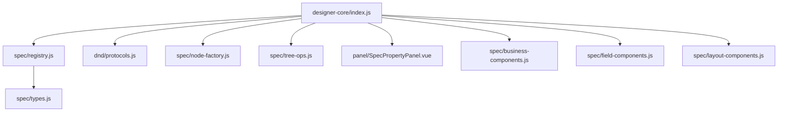
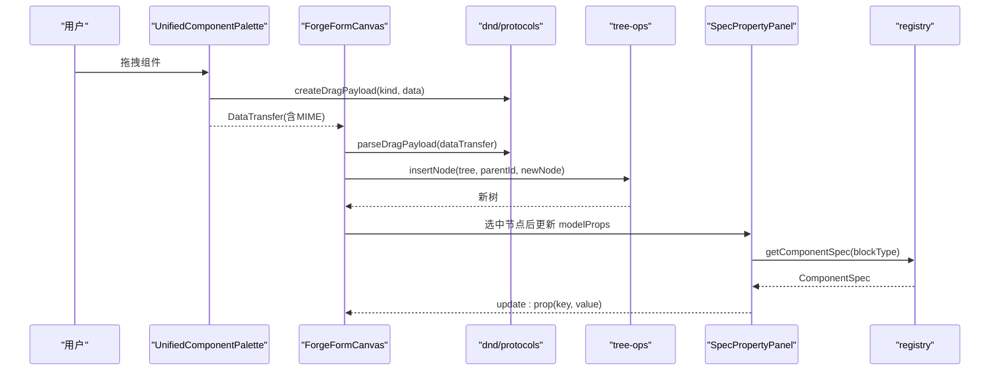
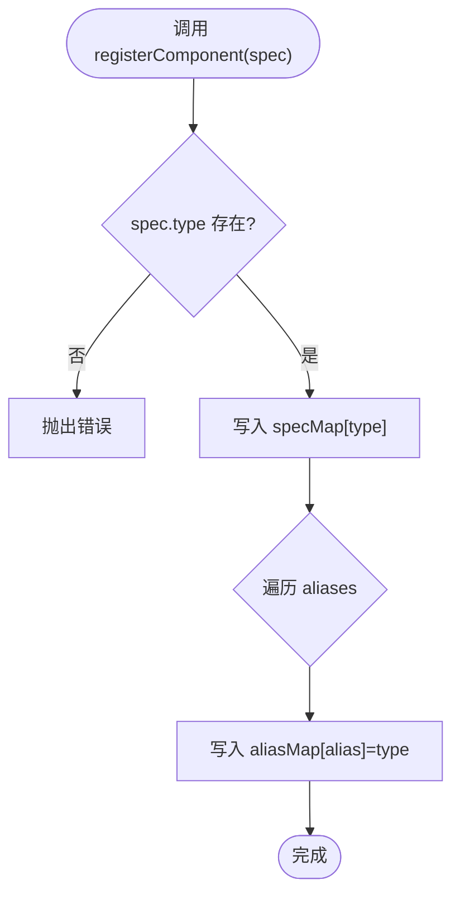
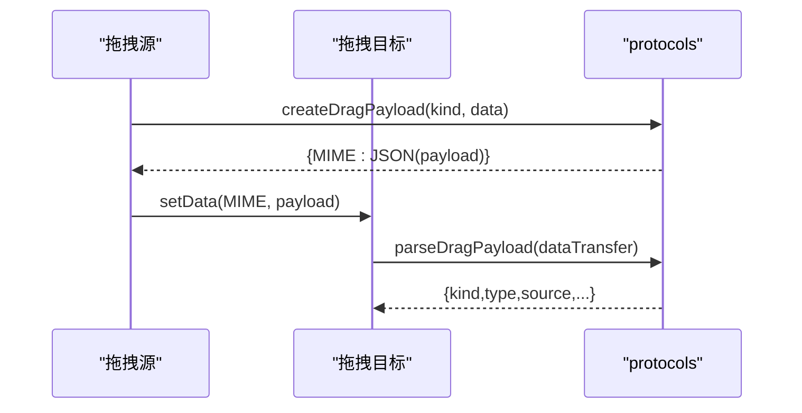
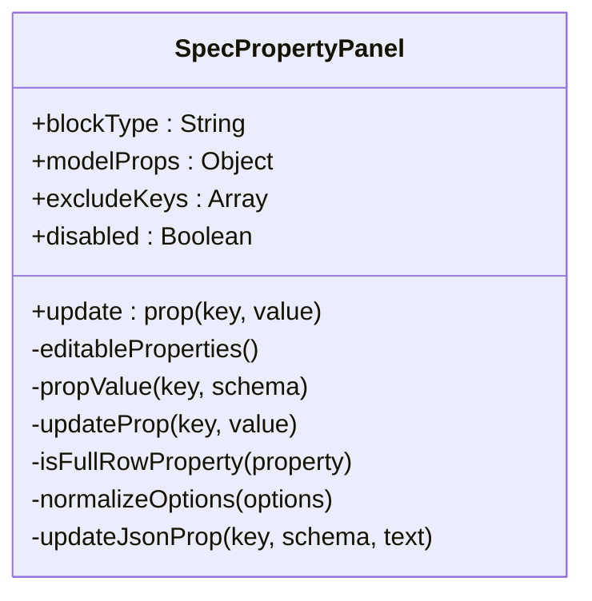
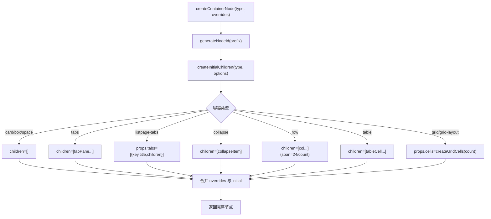
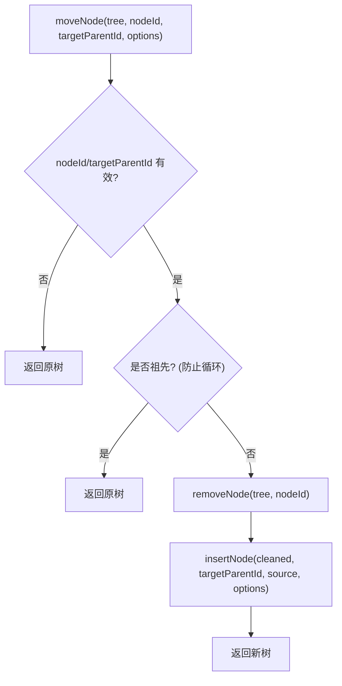
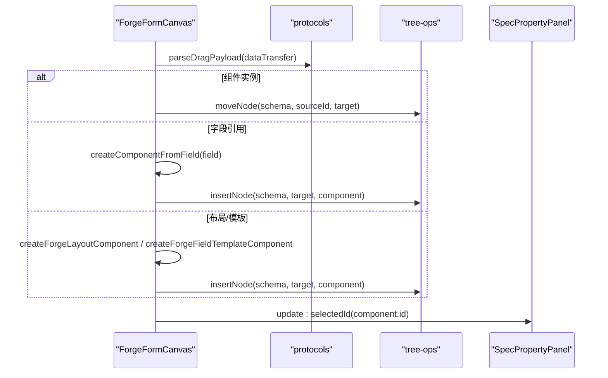
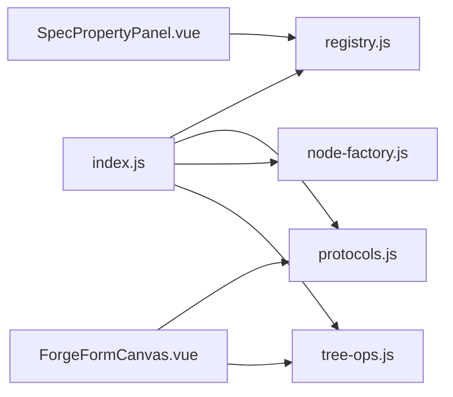

# 设计器内核

<cite>
**本文引用的文件**
- [index.js](file://forge-admin-ui/src/components/lowcode-builder/designer-core/index.js)
- [registry.js](file://forge-admin-ui/src/components/lowcode-builder/designer-core/spec/registry.js)
- [types.js](file://forge-admin-ui/src/components/lowcode-builder/designer-core/spec/types.js)
- [protocols.js](file://forge-admin-ui/src/components/lowcode-builder/designer-core/dnd/protocols.js)
- [SpecPropertyPanel.vue](file://forge-admin-ui/src/components/lowcode-builder/designer-core/panel/SpecPropertyPanel.vue)
- [business-components.js](file://forge-admin-ui/src/components/lowcode-builder/designer-core/spec/business-components.js)
- [field-components.js](file://forge-admin-ui/src/components/lowcode-builder/designer-core/spec/field-components.js)
- [layout-components.js](file://forge-admin-ui/src/components/lowcode-builder/designer-core/spec/layout-components.js)
- [node-factory.js](file://forge-admin-ui/src/components/lowcode-builder/designer-core/spec/node-factory.js)
- [tree-ops.js](file://forge-admin-ui/src/components/lowcode-builder/designer-core/spec/tree-ops.js)
- [ForgeFormCanvas.vue](file://forge-admin-ui/src/views/app-center/components/designer/forge-form-designer/ForgeFormCanvas.vue)
- [designerDragState.js](file://forge-admin-ui/src/views/app-center/components/designer/forge-form-designer/designerDragState.js)
</cite>

## 目录
1. [简介](#简介)
2. [项目结构](#项目结构)
3. [核心组件](#核心组件)
4. [架构总览](#架构总览)
5. [详细组件分析](#详细组件分析)
6. [依赖关系分析](#依赖关系分析)
7. [性能考量](#性能考量)
8. [故障排查指南](#故障排查指南)
9. [结论](#结论)
10. [附录：自定义组件开发与扩展指南](#附录自定义组件开发与扩展指南)

## 简介
本技术文档聚焦低代码设计器内核 designer-core，系统性解析其核心架构与实现机制，包括：
- 组件注册机制与统一规范定义（ComponentSpec）
- 属性面板系统（基于 propsSchema 的声明式渲染）
- 拖拽协议（跨设计器的统一 MIME 与载荷格式）
- 页面结构树管理（不可变更新、多路径嵌套、容器插槽）
- 组件生命周期与状态同步（节点工厂、树操作、画布集成）
并给出自定义组件开发、规范扩展与性能优化策略，以及具体集成示例。

## 项目结构
designer-core 采用“规范 + 注册表 + 工具层”的分层组织：
- 规范定义：spec/* 下按业务域划分（字段、布局、业务、页面、媒体、小部件、区域动作等），集中描述组件元数据、属性 Schema、数据源能力、打印与布局配置等。
- 注册中心：spec/registry.js 提供统一的组件注册、查询、分组与统计 API。
- 协议与工具：dnd/protocols.js 定义跨设计器拖拽协议；spec/node-factory.js 与 spec/tree-ops.js 提供节点创建与不可变树操作；panel/SpecPropertyPanel.vue 消费注册表生成属性面板。
- 统一入口：index.js 聚合导出所有能力，并在首次导入时自动注册全部内置组件 spec。

图表来源
- [index.js:1-126](file://forge-admin-ui/src/components/lowcode-builder/designer-core/index.js#L1-L126)
- [registry.js:1-169](file://forge-admin-ui/src/components/lowcode-builder/designer-core/spec/registry.js#L1-L169)
- [types.js:1-120](file://forge-admin-ui/src/components/lowcode-builder/designer-core/spec/types.js#L1-L120)
- [protocols.js:1-81](file://forge-admin-ui/src/components/lowcode-builder/designer-core/dnd/protocols.js#L1-L81)
- [node-factory.js:1-257](file://forge-admin-ui/src/components/lowcode-builder/designer-core/spec/node-factory.js#L1-L257)
- [tree-ops.js:1-477](file://forge-admin-ui/src/components/lowcode-builder/designer-core/spec/tree-ops.js#L1-L477)
- [SpecPropertyPanel.vue:1-288](file://forge-admin-ui/src/components/lowcode-builder/designer-core/panel/SpecPropertyPanel.vue#L1-L288)
- [business-components.js:1-200](file://forge-admin-ui/src/components/lowcode-builder/designer-core/spec/business-components.js#L1-L200)
- [field-components.js:1-200](file://forge-admin-ui/src/components/lowcode-builder/designer-core/spec/field-components.js#L1-L200)
- [layout-components.js:1-200](file://forge-admin-ui/src/components/lowcode-builder/designer-core/spec/layout-components.js#L1-L200)

章节来源
- [index.js:1-126](file://forge-admin-ui/src/components/lowcode-builder/designer-core/index.js#L1-L126)

## 核心组件
- 组件注册表（registry）
  - 维护 type→spec 映射与 alias→type 映射，提供注册、查询、过滤、分组、统计等 API。
  - 支持重复注册警告与别名覆盖提示，保证运行时一致性。
- 类型与规范（types）
  - 以 JSDoc 形式定义 ComponentSpec、PropsSchema、DataSourceKind、LayoutSpec、PrintSpec、FieldDefaults、ContainerSpec 等核心类型，确保全量组件遵循同一契约。
- 拖拽协议（protocols）
  - 定义 DESIGNER_MIME 常量与 createDragPayload/parseDragPayload，统一表单/列表/页面设计器之间的拖拽数据格式。
- 属性面板（SpecPropertyPanel）
  - 基于 spec.propsSchema 动态生成两列紧凑网格的属性编辑 UI，支持 section、boolean、number、select、color、textarea/json 等编辑器类型，并通过 excludeKeys 排除已手写模板覆盖的属性。
- 节点工厂（node-factory）
  - 提供 generateNodeId/createNode/createContainerNode 等工具，为不同容器生成默认 children/props 初始结构（如 tabs、grid cells、row col、table cell）。
- 树操作（tree-ops）
  - 提供 walkTree/mapTree/mapSiblingsInTree/findNodeById/findNodePath/moveNode/insertNode/removeNode/replaceNode 等不可变更新方法，兼容三种嵌套路径（children、props.tabs[].children、props.cells[].children），并提供深度检查与最大深度计算。

章节来源
- [registry.js:1-169](file://forge-admin-ui/src/components/lowcode-builder/designer-core/spec/registry.js#L1-L169)
- [types.js:1-120](file://forge-admin-ui/src/components/lowcode-builder/designer-core/spec/types.js#L1-L120)
- [protocols.js:1-81](file://forge-admin-ui/src/components/lowcode-builder/designer-core/dnd/protocols.js#L1-L81)
- [SpecPropertyPanel.vue:1-288](file://forge-admin-ui/src/components/lowcode-builder/designer-core/panel/SpecPropertyPanel.vue#L1-L288)
- [node-factory.js:1-257](file://forge-admin-ui/src/components/lowcode-builder/designer-core/spec/node-factory.js#L1-L257)
- [tree-ops.js:1-477](file://forge-admin-ui/src/components/lowcode-builder/designer-core/spec/tree-ops.js#L1-L477)

## 架构总览
设计器内核通过“规范驱动 + 注册中心 + 协议 + 树操作”形成闭环：
- 规范驱动：所有组件以 ComponentSpec 描述自身能力（scope/category/group/propsSchema/dataSources/print/layout/container/maxDepth/accept/fieldDefaults/meta）。
- 注册中心：集中管理 spec，对外暴露查询与分组 API，供画布、调色板、属性面板消费。
- 拖拽协议：跨设计器统一 MIME 与载荷，使“组件实例/已有实例/字段引用”可在不同设计器间无缝流转。
- 树操作：对 schema 树进行不可变更新，支持复杂容器（tabs/grid/cell）的多路径插入/移动/删除/替换，保障状态一致性与可回溯性。
- 属性面板：根据 spec.propsSchema 自动生成编辑界面，减少样板代码，提升扩展效率。

图表来源
- [protocols.js:1-81](file://forge-admin-ui/src/components/lowcode-builder/designer-core/dnd/protocols.js#L1-L81)
- [tree-ops.js:287-351](file://forge-admin-ui/src/components/lowcode-builder/designer-core/spec/tree-ops.js#L287-L351)
- [SpecPropertyPanel.vue:1-288](file://forge-admin-ui/src/components/lowcode-builder/designer-core/panel/SpecPropertyPanel.vue#L1-L288)
- [registry.js:43-66](file://forge-admin-ui/src/components/lowcode-builder/designer-core/spec/registry.js#L43-L66)
- [ForgeFormCanvas.vue:347-386](file://forge-admin-ui/src/views/app-center/components/designer/forge-form-designer/ForgeFormCanvas.vue#L347-L386)

## 详细组件分析

### 组件注册中心（registry）
- 职责
  - 维护 specMap 与 aliasMap，提供 registerComponent/registerComponents/getComponentSpec/listComponents/listComponentsByCategory/groupComponents/getRegistryStats 等 API。
  - 支持重复注册警告与别名覆盖提示，保证运行时稳定性。
- 复杂度
  - 注册 O(1)，查询 O(1)，过滤 O(N)，分组 O(N)。
- 关键点
  - 首次 import index.js 即批量注册全部内置 spec，确保全局可用。
  - 提供 clearRegistry 用于测试隔离。

图表来源
- [registry.js:17-41](file://forge-admin-ui/src/components/lowcode-builder/designer-core/spec/registry.js#L17-L41)

章节来源
- [registry.js:1-169](file://forge-admin-ui/src/components/lowcode-builder/designer-core/spec/registry.js#L1-L169)

### 拖拽协议（protocols）
- 职责
  - 定义 DESIGNER_MIME（component/instance/field-ref）及 createDragPayload/parseDragPayload，统一跨设计器拖拽数据。
- 使用场景
  - 调色板到画布的组件拖入、画布内实例移动、字段引用拖入表单。
- 兼容性
  - 解析时按 MIME 优先级读取，失败返回 null，避免异常中断。

图表来源
- [protocols.js:1-81](file://forge-admin-ui/src/components/lowcode-builder/designer-core/dnd/protocols.js#L1-L81)

章节来源
- [protocols.js:1-81](file://forge-admin-ui/src/components/lowcode-builder/designer-core/dnd/protocols.js#L1-L81)

### 属性面板（SpecPropertyPanel）
- 职责
  - 消费 registry.getComponentSpec(blockType) 获取 propsSchema，动态渲染属性编辑控件。
  - 支持 section 分组标题、boolean 开关、number/select/color/文本输入、textarea/json 长内容。
  - 通过 excludeKeys 排除已由接入方手写模板覆盖的属性，避免重复编辑入口。
- 交互
  - 变更通过 update:prop(key, value) 事件上报，由父组件负责写回模型。
- 布局
  - 两列紧凑网格，长内容占满整行，布尔开关一行式，视觉与两侧手写面板统一。

图表来源
- [SpecPropertyPanel.vue:1-288](file://forge-admin-ui/src/components/lowcode-builder/designer-core/panel/SpecPropertyPanel.vue#L1-L288)

章节来源
- [SpecPropertyPanel.vue:1-288](file://forge-admin-ui/src/components/lowcode-builder/designer-core/panel/SpecPropertyPanel.vue#L1-L288)

### 节点工厂（node-factory）
- 职责
  - 生成唯一 ID、创建基础节点、为不同容器生成初始 children/props（如 tabs、collapse、row/col、table cell、grid cells）。
- 关键点
  - createContainerNode 合并 overrides 与 initial props/children，确保容器具备开箱即用结构。
  - generateNodeId/resetNodeCounter 便于测试与调试。

图表来源
- [node-factory.js:17-257](file://forge-admin-ui/src/components/lowcode-builder/designer-core/spec/node-factory.js#L17-L257)

章节来源
- [node-factory.js:1-257](file://forge-admin-ui/src/components/lowcode-builder/designer-core/spec/node-factory.js#L1-L257)

### 树操作（tree-ops）
- 职责
  - 提供 walkTree/mapTree/mapSiblingsInTree/findNodeById/findNodePath/moveNode/insertNode/removeNode/replaceNode 等不可变更新方法。
  - 兼容三种嵌套路径：children、props.tabs[].children、props.cells[].children。
  - 提供 canInsertAtDepth/getMaxTreeDepth 等深度校验工具。
- 复杂度
  - 遍历 O(N)，插入/移动/删除均产生新对象，时间复杂度近似 O(N)。
- 关键点
  - moveNode 会检测循环引用（不能移动到自身后代）。
  - insertNode 根据容器类型选择正确存储路径（grid→cells，tabs→tabs.children）。

图表来源
- [tree-ops.js:405-430](file://forge-admin-ui/src/components/lowcode-builder/designer-core/spec/tree-ops.js#L405-L430)

章节来源
- [tree-ops.js:1-477](file://forge-admin-ui/src/components/lowcode-builder/designer-core/spec/tree-ops.js#L1-L477)

### 画布集成与拖拽落地（ForgeFormCanvas）
- 职责
  - 处理根区域拖拽进入、解析拖拽载荷（组件/字段/布局/模板）、创建对应组件节点并插入树中。
  - 更新选中节点并触发子组件重渲染。
- 关键流程
  - handleRootTopDragOver 设置 dropKey。
  - applyDropPayload 根据 MIME 类型分支处理：组件实例移动、字段转组件、布局组件、模板组件。

图表来源
- [ForgeFormCanvas.vue:347-386](file://forge-admin-ui/src/views/app-center/components/designer/forge-form-designer/ForgeFormCanvas.vue#L347-L386)
- [protocols.js:1-81](file://forge-admin-ui/src/components/lowcode-builder/designer-core/dnd/protocols.js#L1-L81)
- [tree-ops.js:287-351](file://forge-admin-ui/src/components/lowcode-builder/designer-core/spec/tree-ops.js#L287-L351)

章节来源
- [ForgeFormCanvas.vue:347-386](file://forge-admin-ui/src/views/app-center/components/designer/forge-form-designer/ForgeFormCanvas.vue#L347-L386)

## 依赖关系分析
- 模块耦合
  - index.js 作为聚合入口，依赖各 spec 文件与 registry/protocols/node-factory/tree-ops。
  - panel/SpecPropertyPanel.vue 依赖 registry.getComponentSpec 与 types 定义的 propsSchema。
  - ForgeFormCanvas 依赖 protocols 与 tree-ops，体现“协议 + 树操作”的解耦设计。
- 外部依赖
  - 无重型框架依赖，主要依赖 Vue 响应式与 UI 库（如 n-input/n-select 等）在面板中使用。
- 潜在风险
  - 若新增容器类型需同时更新 node-factory 与 tree-ops 的识别逻辑，否则插入/移动可能失效。
  - 拖拽 MIME 扩展需在 protocols 中登记并在全局解析顺序中考虑优先级。

图表来源
- [index.js:1-126](file://forge-admin-ui/src/components/lowcode-builder/designer-core/index.js#L1-L126)
- [SpecPropertyPanel.vue:1-288](file://forge-admin-ui/src/components/lowcode-builder/designer-core/panel/SpecPropertyPanel.vue#L1-L288)
- [ForgeFormCanvas.vue:347-386](file://forge-admin-ui/src/views/app-center/components/designer/forge-form-designer/ForgeFormCanvas.vue#L347-L386)

章节来源
- [index.js:1-126](file://forge-admin-ui/src/components/lowcode-builder/designer-core/index.js#L1-L126)

## 性能考量
- 注册表查询 O(1)，适合高频访问；列表过滤 O(N) 建议在 UI 层缓存结果或分页展示。
- 树操作均为不可变更新，会产生中间对象；对于大树的频繁操作建议：
  - 批量化更新（合并多次插入/移动为一次 mapTree）。
  - 按需加载与虚拟滚动（针对超大型页面结构）。
- 属性面板渲染：
  - 使用 computed 缓存 editableProperties，避免重复计算。
  - 长内容属性（json/textarea）延迟解析与校验，减少输入抖动。
- 拖拽：
  - 仅在必要时序列化/反序列化载荷，避免多余开销。
  - 使用最小化 payload（仅包含 kind/type/source/instanceId/fieldName/timestamp）。

## 故障排查指南
- 组件未显示在调色板
  - 检查是否在 index.js 中导入并注册了对应 spec。
  - 确认 scope/category/group 是否符合当前设计器范围。
  - 参考：[index.js:7-67](file://forge-admin-ui/src/components/lowcode-builder/designer-core/index.js#L7-L67)、[registry.js:17-41](file://forge-admin-ui/src/components/lowcode-builder/designer-core/spec/registry.js#L17-L41)
- 拖拽无效
  - 检查 createDragPayload 的 MIME 是否与 parseDragPayload 解析顺序匹配。
  - 确认目标容器 accept 限制与 maxDepth 约束。
  - 参考：[protocols.js:1-81](file://forge-admin-ui/src/components/lowcode-builder/designer-core/dnd/protocols.js#L1-L81)、[tree-ops.js:459-463](file://forge-admin-ui/src/components/lowcode-builder/designer-core/spec/tree-ops.js#L459-L463)
- 属性面板不生效
  - 确认 blockType 能解析到 spec，且 propsSchema.properties 存在。
  - 若被 excludeKeys 排除，检查父组件传入的排除键是否正确。
  - 参考：[SpecPropertyPanel.vue:26-50](file://forge-admin-ui/src/components/lowcode-builder/designer-core/panel/SpecPropertyPanel.vue#L26-L50)
- 树操作异常
  - 检查 parentId 是否存在于树中，targetParentId 是否为 nodeId 的祖先（防止循环）。
  - 对于 grid/tabs/listpage-tabs，确认 cellKey/tabKey 是否正确。
  - 参考：[tree-ops.js:306-351](file://forge-admin-ui/src/components/lowcode-builder/designer-core/spec/tree-ops.js#L306-L351)、[tree-ops.js:420-430](file://forge-admin-ui/src/components/lowcode-builder/designer-core/spec/tree-ops.js#L420-L430)

章节来源
- [index.js:7-67](file://forge-admin-ui/src/components/lowcode-builder/designer-core/index.js#L7-L67)
- [registry.js:17-41](file://forge-admin-ui/src/components/lowcode-builder/designer-core/spec/registry.js#L17-L41)
- [protocols.js:1-81](file://forge-admin-ui/src/components/lowcode-builder/designer-core/dnd/protocols.js#L1-L81)
- [tree-ops.js:306-351](file://forge-admin-ui/src/components/lowcode-builder/designer-core/spec/tree-ops.js#L306-L351)
- [tree-ops.js:420-430](file://forge-admin-ui/src/components/lowcode-builder/designer-core/spec/tree-ops.js#L420-L430)
- [SpecPropertyPanel.vue:26-50](file://forge-admin-ui/src/components/lowcode-builder/designer-core/panel/SpecPropertyPanel.vue#L26-L50)

## 结论
designer-core 通过“规范驱动 + 注册中心 + 协议 + 树操作”实现了高内聚、低耦合的设计器内核：
- 组件以统一规格描述，便于跨设计器复用与扩展。
- 注册中心提供稳定 API，支撑调色板、属性面板、画布等多处消费。
- 拖拽协议统一了跨设计器交互，降低集成成本。
- 树操作保证状态一致性与可回溯性，适配复杂容器结构。
结合 SpecPropertyPanel 的声明式属性面板，开发者可通过纯配置快速扩展新组件类型，显著提升生产力。

## 附录：自定义组件开发与扩展指南

### 新增组件类型步骤
- 定义组件 spec
  - 在对应 spec 文件中添加 ComponentSpec，填写 type/aliases/scope/category/group/label/desc/layout/container/maxDepth/accept/propsSchema/dataSources/print/fieldDefaults/meta。
  - 参考：
    - [types.js:98-120](file://forge-admin-ui/src/components/lowcode-builder/designer-core/spec/types.js#L98-L120)
    - [field-components.js:12-27](file://forge-admin-ui/src/components/lowcode-builder/designer-core/spec/field-components.js#L12-L27)
    - [layout-components.js:7-45](file://forge-admin-ui/src/components/lowcode-builder/designer-core/spec/layout-components.js#L7-L45)
    - [business-components.js:7-63](file://forge-admin-ui/src/components/lowcode-builder/designer-core/spec/business-components.js#L7-L63)
- 注册组件
  - 将新 spec 加入 index.js 的全量数组，或在需要时调用 registerComponents 单独注册。
  - 参考：[index.js:55-67](file://forge-admin-ui/src/components/lowcode-builder/designer-core/index.js#L55-L67)、[registry.js:37-41](file://forge-admin-ui/src/components/lowcode-builder/designer-core/spec/registry.js#L37-L41)
- 扩展属性面板
  - 在 propsSchema.properties 中声明属性，支持 section/boolean/number/select/color/json/customEditor 等类型。
  - 如需复杂编辑器，使用 customEditor 并挂载对应编辑器组件。
  - 参考：[SpecPropertyPanel.vue:52-85](file://forge-admin-ui/src/components/lowcode-builder/designer-core/panel/SpecPropertyPanel.vue#L52-L85)
- 扩展容器与初始结构
  - 若为新容器类型，需在 node-factory.createInitialChildren 中添加分支，生成默认 children/props。
  - 参考：[node-factory.js:160-229](file://forge-admin-ui/src/components/lowcode-builder/designer-core/spec/node-factory.js#L160-L229)
- 扩展拖拽协议
  - 如需新的拖拽类型，请在 protocols 中增加 MIME 常量，并在 createDragPayload/parseDragPayload 中处理。
  - 参考：[protocols.js:10-52](file://forge-admin-ui/src/components/lowcode-builder/designer-core/dnd/protocols.js#L10-L52)
- 集成到画布
  - 在画布中处理新的拖拽 MIME 分支，创建组件节点并插入树中。
  - 参考：[ForgeFormCanvas.vue:355-386](file://forge-admin-ui/src/views/app-center/components/designer/forge-form-designer/ForgeFormCanvas.vue#L355-L386)

### 组件生命周期与状态同步
- 生命周期
  - 节点创建：通过 node-factory 生成初始节点结构。
  - 插入/移动/删除：通过 tree-ops 进行不可变更新，保持状态可回溯。
  - 渲染：画布根据树结构渲染，属性面板根据 spec 与 modelProps 双向绑定。
- 状态同步
  - 属性面板通过 update:prop 事件上报变更，画布负责写回模型并触发重渲染。
  - 拖拽过程中，先解析载荷，再执行树操作，最后更新选中节点。

### 性能优化策略
- 注册表与面板
  - 使用 computed 缓存属性列表，避免重复计算。
  - 对 listComponents/listComponentsByCategory 的结果进行缓存或分页。
- 树操作
  - 批量更新时使用 mapTree 一次性转换，减少中间对象。
  - 对超大树启用虚拟化与懒加载。
- 拖拽
  - 最小化 payload，避免冗余字段。
  - 在目标容器处尽早拒绝非法拖拽（accept/maxDepth），减少无效计算。

### 示例：集成新组件类型
- 在 field-components.js 中新增一个输入类组件 spec，声明 propsSchema 与 fieldDefaults。
- 在 index.js 中确保该 spec 被纳入 allComponentSpecs 并自动注册。
- 在 SpecPropertyPanel.vue 中，无需修改模板即可自动渲染新属性的编辑控件。
- 在 ForgeFormCanvas.vue 中，若涉及拖拽，确保 MIME 与解析逻辑覆盖新类型。

章节来源
- [types.js:98-120](file://forge-admin-ui/src/components/lowcode-builder/designer-core/spec/types.js#L98-L120)
- [field-components.js:12-27](file://forge-admin-ui/src/components/lowcode-builder/designer-core/spec/field-components.js#L12-L27)
- [layout-components.js:7-45](file://forge-admin-ui/src/components/lowcode-builder/designer-core/spec/layout-components.js#L7-L45)
- [business-components.js:7-63](file://forge-admin-ui/src/components/lowcode-builder/designer-core/spec/business-components.js#L7-L63)
- [index.js:55-67](file://forge-admin-ui/src/components/lowcode-builder/designer-core/index.js#L55-L67)
- [registry.js:37-41](file://forge-admin-ui/src/components/lowcode-builder/designer-core/spec/registry.js#L37-L41)
- [SpecPropertyPanel.vue:52-85](file://forge-admin-ui/src/components/lowcode-builder/designer-core/panel/SpecPropertyPanel.vue#L52-L85)
- [node-factory.js:160-229](file://forge-admin-ui/src/components/lowcode-builder/designer-core/spec/node-factory.js#L160-L229)
- [protocols.js:10-52](file://forge-admin-ui/src/components/lowcode-builder/designer-core/dnd/protocols.js#L10-L52)
- [ForgeFormCanvas.vue:355-386](file://forge-admin-ui/src/views/app-center/components/designer/forge-form-designer/ForgeFormCanvas.vue#L355-L386)