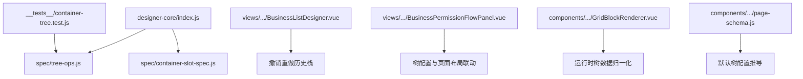
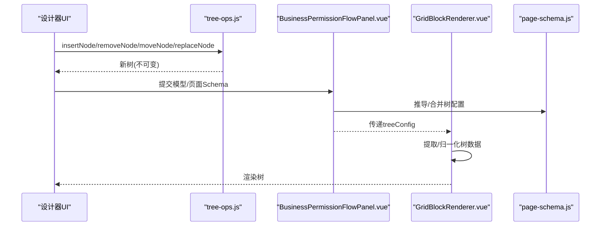
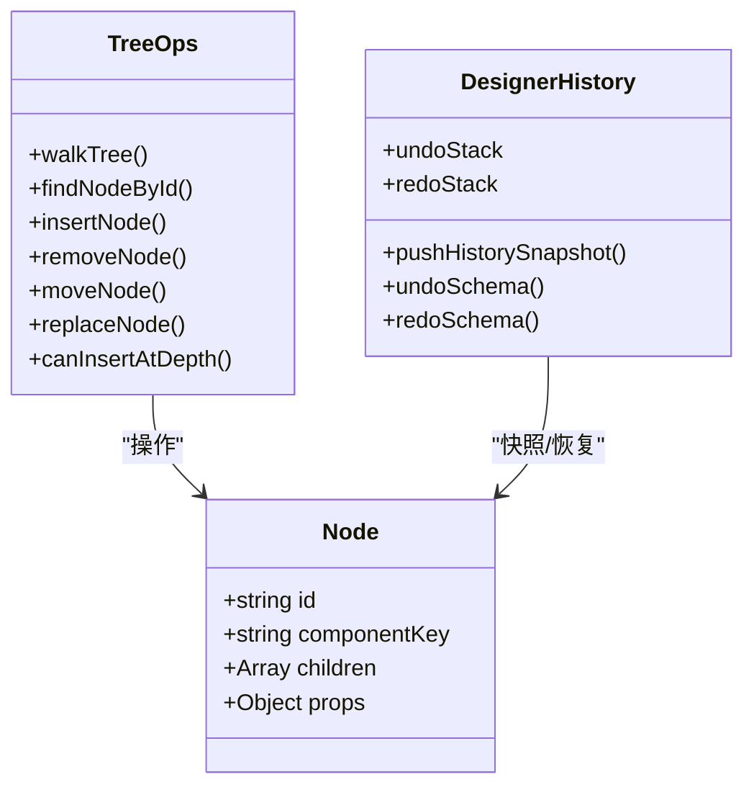
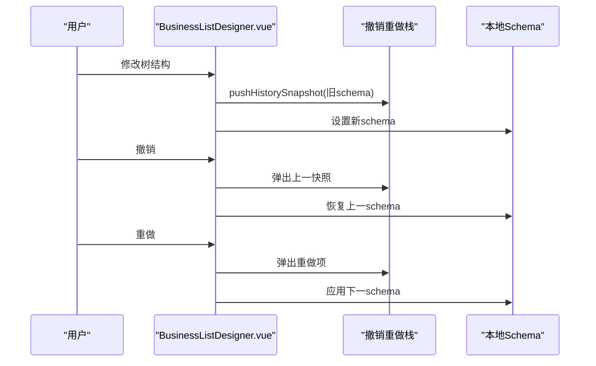
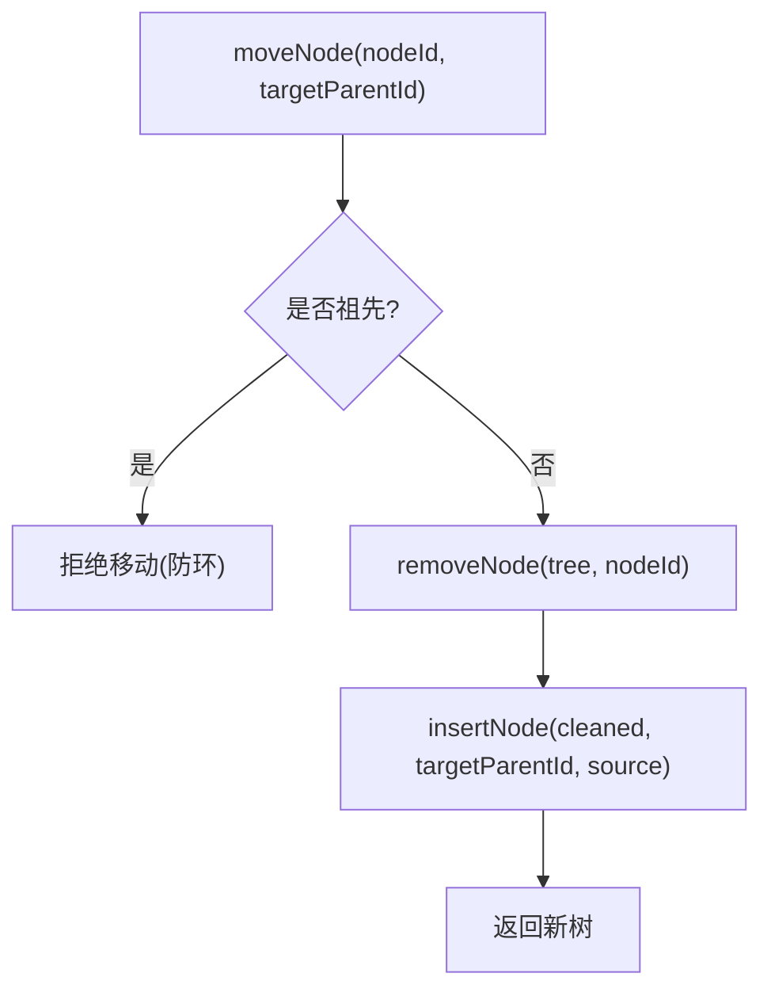
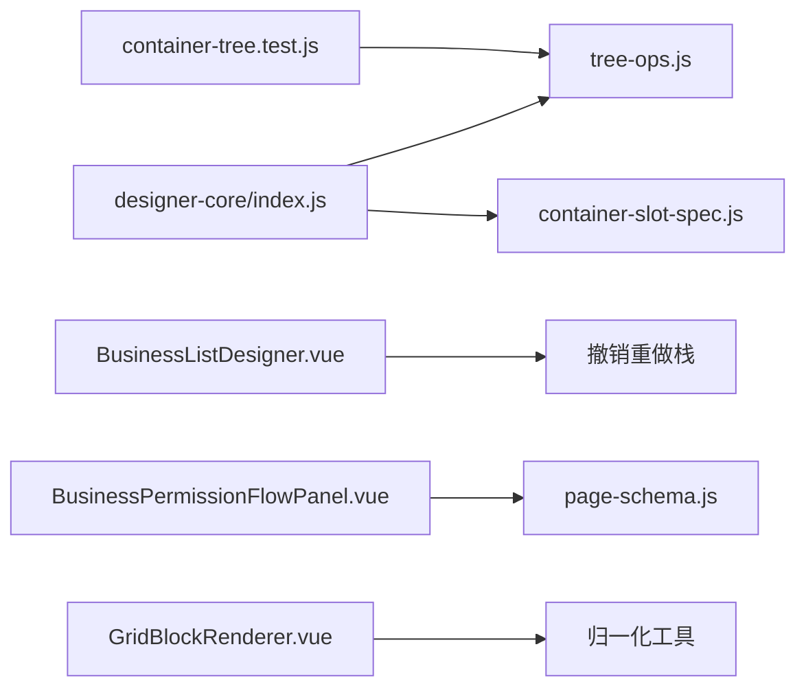

# 页面结构树管理

<cite>
**本文引用的文件**
- [tree-ops.js](file://forge-admin-ui/src/components/lowcode-builder/designer-core/spec/tree-ops.js)
- [index.js](file://forge-admin-ui/src/components/lowcode-builder/designer-core/index.js)
- [container-tree.test.js](file://forge-admin-ui/src/components/lowcode-builder/designer-core/__tests__/container-tree.test.js)
- [BusinessListDesigner.vue](file://forge-admin-ui/src/views/app-center/components/designer/BusinessListDesigner.vue)
- [BusinessPermissionFlowPanel.vue](file://forge-admin-ui/src/views/app-center/components/designer/BusinessPermissionFlowPanel.vue)
- [GridBlockRenderer.vue](file://forge-admin-ui/src/components/lowcode-builder/page/GridBlockRenderer.vue)
- [page-schema.js](file://forge-admin-ui/src/components/lowcode-builder/page/page-schema.js)
</cite>

## 目录
1. [简介](#简介)
2. [项目结构](#项目结构)
3. [核心组件](#核心组件)
4. [架构总览](#架构总览)
5. [详细组件分析](#详细组件分析)
6. [依赖关系分析](#依赖关系分析)
7. [性能与并发](#性能与并发)
8. [故障排查指南](#故障排查指南)
9. [结论](#结论)
10. [附录：扩展指南](#附录扩展指南)

## 简介
本技术文档聚焦低代码设计器中的“页面结构树管理”，围绕 tree-ops.js 提供的树形结构操作 API，系统阐述节点增删改查、层级关系维护、父子节点同步机制；并说明容器树的数据结构设计、状态管理模式、变更追踪算法；解释树结构的序列化与反序列化、版本控制、撤销重做实现；分析树操作的并发安全性、性能优化策略与大数据量渲染优化；最后提供扩展指南，展示如何实现自定义节点类型与复杂交互逻辑。

## 项目结构
- designer-core 统一导出入口聚合了注册表、类型、数据源规范、拖拽协议、容器规范、树操作和桥接层，对外暴露统一的树操作 API。
- tree-ops.js 实现了不可变树操作（遍历、查找、插入、删除、移动、替换、深度检查），兼容三种嵌套存储路径：children、props.tabs[].children、props.cells[].children。
- 测试用例覆盖遍历、查找、插入、删除、替换、深度限制等关键行为，保障 API 稳定性。
- 业务视图通过 BusinessListDesigner 实现撤销重做历史栈；BusinessPermissionFlowPanel 负责树配置与页面布局联动；GridBlockRenderer 负责运行时树数据的归一化与渲染；page-schema.js 负责默认树配置的推导。



**图表来源**
- [index.js:1-126](file://forge-admin-ui/src/components/lowcode-builder/designer-core/index.js#L1-L126)
- [tree-ops.js:1-477](file://forge-admin-ui/src/components/lowcode-builder/designer-core/spec/tree-ops.js#L1-L477)
- [container-tree.test.js:1-333](file://forge-admin-ui/src/components/lowcode-builder/designer-core/__tests__/container-tree.test.js#L1-L333)
- [BusinessListDesigner.vue:2044-2077](file://forge-admin-ui/src/views/app-center/components/designer/BusinessListDesigner.vue#L2044-L2077)
- [BusinessPermissionFlowPanel.vue:176-255](file://forge-admin-ui/src/views/app-center/components/designer/BusinessPermissionFlowPanel.vue#L176-L255)
- [GridBlockRenderer.vue:2618-2656](file://forge-admin-ui/src/components/lowcode-builder/page/GridBlockRenderer.vue#L2618-L2656)
- [page-schema.js:753-777](file://forge-admin-ui/src/components/lowcode-builder/page/page-schema.js#L753-L777)

**章节来源**
- [index.js:1-126](file://forge-admin-ui/src/components/lowcode-builder/designer-core/index.js#L1-L126)
- [tree-ops.js:1-477](file://forge-admin-ui/src/components/lowcode-builder/designer-core/spec/tree-ops.js#L1-L477)
- [container-tree.test.js:1-333](file://forge-admin-ui/src/components/lowcode-builder/designer-core/__tests__/container-tree.test.js#L1-L333)

## 核心组件
- 树操作库（tree-ops.js）
  - 遍历：walkTree、collectAllNodes、collectAllNodeIds
  - 查找：findNodeById、findNodePath、getNodeDepth、findParentNode、isAncestorOf
  - 不可变更新：mapTree、mapSiblingsInTree
  - 插入：insertNode（支持 children、tabs、cells 三种路径）
  - 删除：removeNode（递归清理三路径）
  - 移动：moveNode（先删后插，防循环引用）
  - 替换：replaceNode（对象或函数式替换）
  - 深度检查：canInsertAtDepth、getMaxTreeDepth
- 设计器入口（index.js）
  - 统一导出所有树操作 API，供上层设计器与面板使用
- 测试套件（container-tree.test.js）
  - 验证遍历、查找、插入、删除、替换、深度限制等行为正确性
- 业务视图与运行时
  - BusinessListDesigner：撤销重做历史栈，记录 schema 快照
  - BusinessPermissionFlowPanel：树配置与页面布局联动（layoutType 切换、table zone props.treeConfig 同步）
  - GridBlockRenderer：运行时树数据提取与归一化，计数统计
  - page-schema.js：默认树配置推导（keyField、parentField、labelField、filterField、targetField 等）

**章节来源**
- [tree-ops.js:1-477](file://forge-admin-ui/src/components/lowcode-builder/designer-core/spec/tree-ops.js#L1-L477)
- [index.js:1-126](file://forge-admin-ui/src/components/lowcode-builder/designer-core/index.js#L1-L126)
- [container-tree.test.js:1-333](file://forge-admin-ui/src/components/lowcode-builder/designer-core/__tests__/container-tree.test.js#L1-L333)
- [BusinessListDesigner.vue:2044-2077](file://forge-admin-ui/src/views/app-center/components/designer/BusinessListDesigner.vue#L2044-L2077)
- [BusinessPermissionFlowPanel.vue:176-255](file://forge-admin-ui/src/views/app-center/components/designer/BusinessPermissionFlowPanel.vue#L176-L255)
- [GridBlockRenderer.vue:2618-2656](file://forge-admin-ui/src/components/lowcode-builder/page/GridBlockRenderer.vue#L2618-L2656)
- [page-schema.js:753-777](file://forge-admin-ui/src/components/lowcode-builder/page/page-schema.js#L753-L777)

## 架构总览
树操作位于设计器核心层，被 UI 组件与业务面板调用；运行时树数据在渲染层进行归一化；页面级配置在业务面板中驱动 layoutType 与 table zone 的 props 同步；撤销重做由视图层维护历史栈。



**图表来源**
- [tree-ops.js:287-448](file://forge-admin-ui/src/components/lowcode-builder/designer-core/spec/tree-ops.js#L287-L448)
- [BusinessPermissionFlowPanel.vue:176-255](file://forge-admin-ui/src/views/app-center/components/designer/BusinessPermissionFlowPanel.vue#L176-L255)
- [GridBlockRenderer.vue:2618-2656](file://forge-admin-ui/src/components/lowcode-builder/page/GridBlockRenderer.vue#L2618-L2656)
- [page-schema.js:753-777](file://forge-admin-ui/src/components/lowcode-builder/page/page-schema.js#L753-L777)

## 详细组件分析

### 树操作 API（tree-ops.js）
- 遍历与查找
  - walkTree 同时处理 children、props.tabs[].children、props.cells[].children 三条路径，支持短路返回以优化性能。
  - findNodePath 返回从根到目标节点的完整路径，用于父节点计算、祖先判断与深度计算。
- 不可变更新
  - mapTree/mapSiblingsInTree 对整棵树或兄弟列表进行映射转换，保持不可变性，避免副作用。
- 插入与删除
  - insertNode 根据父节点类型自动选择存储路径（children/tabs/cells），支持 index、tabKey、cellKey 定位。
  - removeNode 递归清理三路径中的指定节点。
- 移动与替换
  - moveNode 先删除再插入，并通过 isAncestorOf 防止将节点移动到其后代下形成环。
  - replaceNode 支持对象或函数式替换，便于批量属性更新。
- 深度检查
  - canInsertAtDepth 基于 getNodeDepth 与 maxDepth 限制，防止过深嵌套。
  - getMaxTreeDepth 用于整体深度统计。

```mermaid
flowchart TD
Start(["开始"]) --> CheckType{"父节点类型?"}
CheckType --> |grid/grid-layout| Cells["写入 props.cells[].children"]
CheckType --> |tabs(listpage)| Tabs["写入 props.tabs[].children"]
CheckType --> |其他容器| Children["写入 node.children"]
Cells --> End(["完成"])
Tabs --> End
Children --> End
```

**图表来源**
- [tree-ops.js:306-351](file://forge-admin-ui/src/components/lowcode-builder/designer-core/spec/tree-ops.js#L306-L351)

**章节来源**
- [tree-ops.js:31-191](file://forge-admin-ui/src/components/lowcode-builder/designer-core/spec/tree-ops.js#L31-L191)
- [tree-ops.js:193-448](file://forge-admin-ui/src/components/lowcode-builder/designer-core/spec/tree-ops.js#L193-L448)
- [tree-ops.js:450-477](file://forge-admin-ui/src/components/lowcode-builder/designer-core/spec/tree-ops.js#L450-L477)

### 容器树数据结构与状态管理
- 数据结构
  - 节点统一包含 id、componentKey/blockType/type、children、props 等字段。
  - 三种嵌套路径：children（表单 tabs/collapse/row/table/card/box/包装节点）、props.tabs[].children（列表页 tabs）、props.cells[].children（grid/grid-layout）。
- 状态管理
  - 设计器侧通过不可变更新生成新树，配合响应式状态触发最小化重渲染。
  - 业务面板在更新 modelSchema 与 pageSchema 时同步 treeConfig 与 layoutType，确保页面布局与模型一致。
- 变更追踪
  - 视图层维护 undoStack/redoStack，每次外部 schema 变更记录快照，撤销/重做时恢复并清空另一栈，保证一致性。



**图表来源**
- [tree-ops.js:1-477](file://forge-admin-ui/src/components/lowcode-builder/designer-core/spec/tree-ops.js#L1-L477)
- [BusinessListDesigner.vue:2044-2077](file://forge-admin-ui/src/views/app-center/components/designer/BusinessListDesigner.vue#L2044-L2077)

**章节来源**
- [BusinessListDesigner.vue:2044-2077](file://forge-admin-ui/src/views/app-center/components/designer/BusinessListDesigner.vue#L2044-L2077)
- [BusinessPermissionFlowPanel.vue:176-255](file://forge-admin-ui/src/views/app-center/components/designer/BusinessPermissionFlowPanel.vue#L176-L255)

### 树结构的序列化与反序列化、版本控制、撤销重做
- 序列化/反序列化
  - 设计器树为 JSON 可序列化的纯对象结构，可直接持久化。
  - 运行时树数据通过 extractRuntimeTreeRows 提取多种响应格式，normalizeRuntimeTreeNodes 归一化为 key/label/children 结构。
- 版本控制
  - 业务面板在启用树模式时设置 layoutType 为 'tree-crud'，并在 table zone 的 props 中注入 treeConfig；关闭时移除该配置，保证版本间兼容性。
- 撤销重做
  - 视图层维护固定长度历史栈，pushHistorySnapshot 记录当前 schema，undo/redo 时交换栈顶元素并恢复，避免重复记录。



**图表来源**
- [BusinessListDesigner.vue:2044-2077](file://forge-admin-ui/src/views/app-center/components/designer/BusinessListDesigner.vue#L2044-L2077)
- [GridBlockRenderer.vue:2618-2656](file://forge-admin-ui/src/components/lowcode-builder/page/GridBlockRenderer.vue#L2618-L2656)
- [BusinessPermissionFlowPanel.vue:176-255](file://forge-admin-ui/src/views/app-center/components/designer/BusinessPermissionFlowPanel.vue#L176-L255)

**章节来源**
- [BusinessListDesigner.vue:2044-2077](file://forge-admin-ui/src/views/app-center/components/designer/BusinessListDesigner.vue#L2044-L2077)
- [GridBlockRenderer.vue:2618-2656](file://forge-admin-ui/src/components/lowcode-builder/page/GridBlockRenderer.vue#L2618-L2656)
- [BusinessPermissionFlowPanel.vue:176-255](file://forge-admin-ui/src/views/app-center/components/designer/BusinessPermissionFlowPanel.vue#L176-L255)

### 父子节点同步机制
- 插入时根据父节点类型自动选择存储路径，确保 tabs 与 cells 子节点与父容器保持一致。
- 移动时先删除源节点，再插入目标父节点，并通过祖先检查防止循环引用。
- 深度检查限制最大嵌套层级，避免过度嵌套导致渲染与交互问题。



**图表来源**
- [tree-ops.js:420-430](file://forge-admin-ui/src/components/lowcode-builder/designer-core/spec/tree-ops.js#L420-L430)
- [tree-ops.js:306-351](file://forge-admin-ui/src/components/lowcode-builder/designer-core/spec/tree-ops.js#L306-L351)

**章节来源**
- [tree-ops.js:306-430](file://forge-admin-ui/src/components/lowcode-builder/designer-core/spec/tree-ops.js#L306-L430)

## 依赖关系分析
- designer-core/index.js 作为统一入口，聚合并导出树操作 API，降低耦合度。
- tree-ops.js 依赖 container-slot-spec（插槽解析）与内部工具函数，不直接依赖 UI 组件。
- 测试套件覆盖核心 API，保障向后兼容。
- 业务视图依赖树操作 API 与历史栈，实现交互与状态管理。
- 运行时渲染依赖归一化工具，确保不同数据源格式的统一。



**图表来源**
- [index.js:1-126](file://forge-admin-ui/src/components/lowcode-builder/designer-core/index.js#L1-L126)
- [tree-ops.js:1-477](file://forge-admin-ui/src/components/lowcode-builder/designer-core/spec/tree-ops.js#L1-L477)
- [container-tree.test.js:1-333](file://forge-admin-ui/src/components/lowcode-builder/designer-core/__tests__/container-tree.test.js#L1-L333)
- [BusinessListDesigner.vue:2044-2077](file://forge-admin-ui/src/views/app-center/components/designer/BusinessListDesigner.vue#L2044-L2077)
- [BusinessPermissionFlowPanel.vue:176-255](file://forge-admin-ui/src/views/app-center/components/designer/BusinessPermissionFlowPanel.vue#L176-L255)
- [GridBlockRenderer.vue:2618-2656](file://forge-admin-ui/src/components/lowcode-builder/page/GridBlockRenderer.vue#L2618-L2656)
- [page-schema.js:753-777](file://forge-admin-ui/src/components/lowcode-builder/page/page-schema.js#L753-L777)

**章节来源**
- [index.js:1-126](file://forge-admin-ui/src/components/lowcode-builder/designer-core/index.js#L1-L126)
- [tree-ops.js:1-477](file://forge-admin-ui/src/components/lowcode-builder/designer-core/spec/tree-ops.js#L1-L477)
- [container-tree.test.js:1-333](file://forge-admin-ui/src/components/lowcode-builder/designer-core/__tests__/container-tree.test.js#L1-L333)

## 性能与并发
- 不可变更新
  - 所有树操作返回新对象，避免共享状态导致的竞态条件，天然具备线程安全语义（单线程前端）。
- 遍历优化
  - walkTree 支持访问器返回 false 中止子树遍历，减少不必要计算。
- 插入/删除
  - insertNode/removeNode 针对三种路径分别处理，避免全量扫描；仅在匹配路径上进行局部复制。
- 大数据量渲染
  - 运行时树数据归一化使用 Map 缓存节点键值，提升查找效率；countTreeNodes 采用递归计数，适合中等规模数据。
- 建议
  - 对超大树采用懒加载（loadMode=lazy）与虚拟滚动；按需展开节点；合并多次小更新为批量更新以减少重渲染。

[本节为通用指导，无需特定文件来源]

## 故障排查指南
- 插入失败
  - 检查父节点类型与目标路径（children/tabs/cells）是否匹配；确认 tabKey/cellKey 是否正确。
  - 参考插入逻辑与测试用例验证行为。
- 移动形成环
  - moveNode 会阻止将节点移动到其后代下；若移动无效，检查祖先关系。
- 深度超限
  - canInsertAtDepth 基于 maxDepth 限制；调整 maxDepth 或检查当前深度。
- 撤销重做异常
  - 确认历史记录是否在外部 schema 变更时记录；撤销/重做时是否清空另一栈；检查 HISTORY_LIMIT 是否合理。
- 运行时树为空
  - 检查 extractRuntimeTreeRows 是否能从响应中提取数组；确认 normalizeRuntimeTreeNodes 的 key/label/children 字段映射。

**章节来源**
- [tree-ops.js:306-430](file://forge-admin-ui/src/components/lowcode-builder/designer-core/spec/tree-ops.js#L306-L430)
- [container-tree.test.js:168-271](file://forge-admin-ui/src/components/lowcode-builder/designer-core/__tests__/container-tree.test.js#L168-L271)
- [BusinessListDesigner.vue:2044-2077](file://forge-admin-ui/src/views/app-center/components/designer/BusinessListDesigner.vue#L2044-L2077)
- [GridBlockRenderer.vue:2618-2656](file://forge-admin-ui/src/components/lowcode-builder/page/GridBlockRenderer.vue#L2618-L2656)

## 结论
tree-ops.js 提供了稳定、可扩展且不可变的树操作 API，兼容多路径嵌套结构，满足低代码设计器的复杂交互需求。结合视图层的撤销重做与业务面板的配置联动，形成了完整的页面结构树管理体系。运行时归一化保证了多数据源的统一渲染。通过合理的性能优化与并发安全设计，系统可在大数据量场景下保持稳定与流畅。

[本节为总结，无需特定文件来源]

## 附录：扩展指南
- 自定义节点类型
  - 在容器插槽规范中声明新容器的接受规则与最大深度，使 insertNode 能正确识别并写入对应路径。
  - 在节点工厂中提供 createInitialChildren 与 createContainerNode 的默认结构，便于快速创建。
- 复杂交互逻辑
  - 使用 mapTree/mapSiblingsInTree 进行批量属性更新；使用 replaceNode 进行函数式替换，简化逻辑。
  - 结合 canInsertAtDepth 与 isAncestorOf 实现约束性拖拽与移动。
- 示例流程（以新增标签页子节点为例）
  - 确定父节点类型为 tabs（列表页模式）。
  - 调用 insertNode(tree, parentId, newNode, { tabKey })。
  - 校验 depth 限制与祖先关系。
  - 更新视图状态并记录历史快照。

**章节来源**
- [tree-ops.js:287-448](file://forge-admin-ui/src/components/lowcode-builder/designer-core/spec/tree-ops.js#L287-L448)
- [container-tree.test.js:273-333](file://forge-admin-ui/src/components/lowcode-builder/designer-core/__tests__/container-tree.test.js#L273-L333)