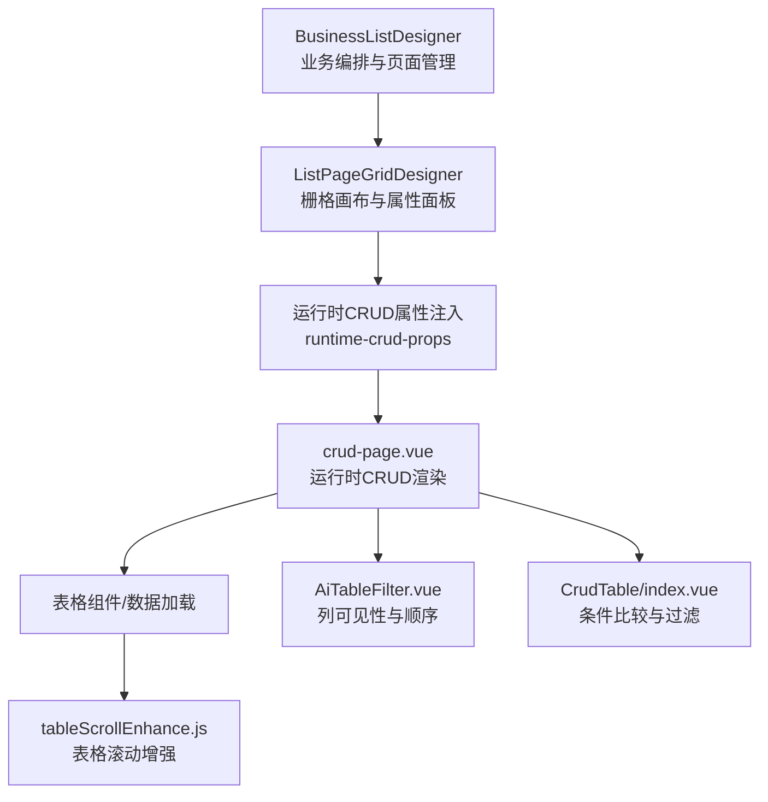
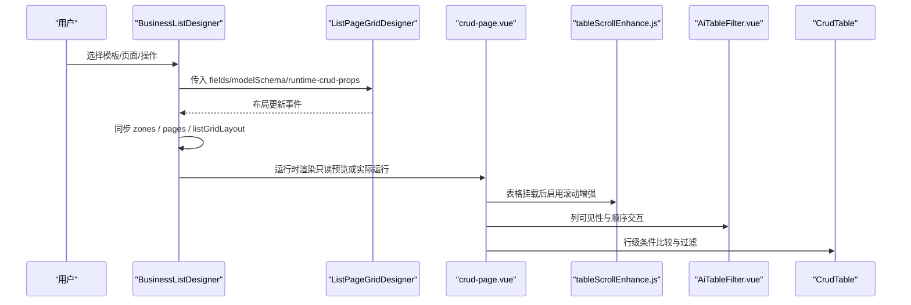
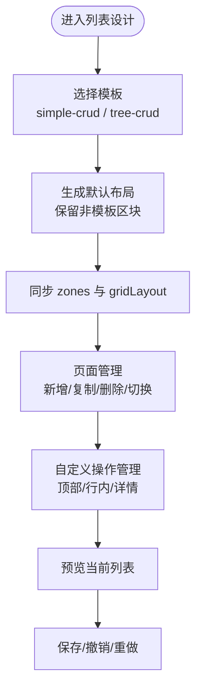
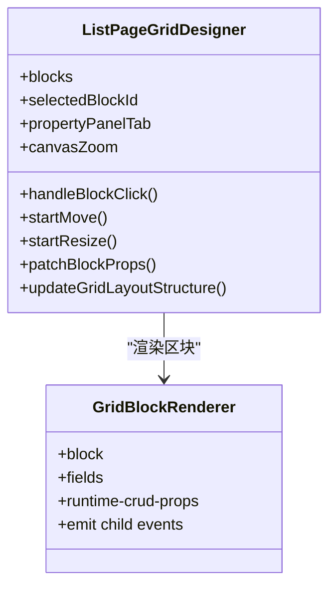
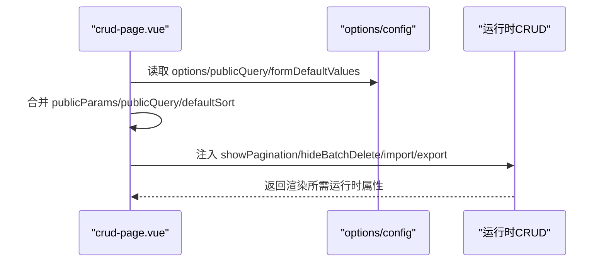
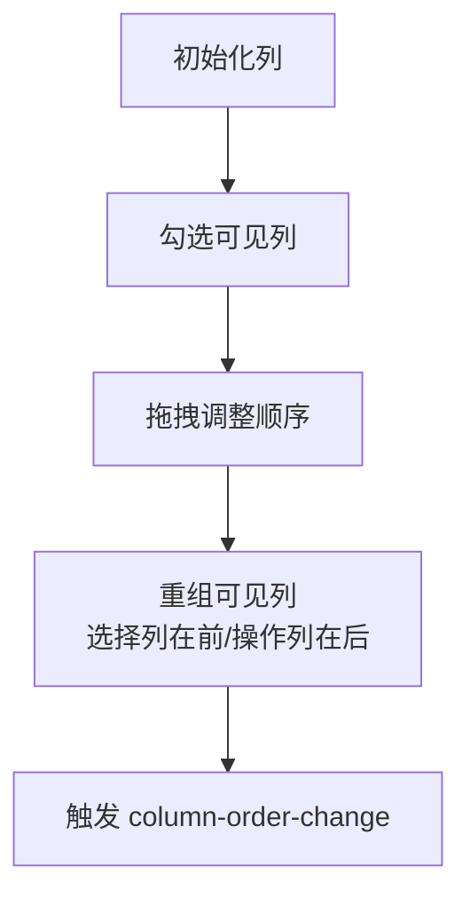
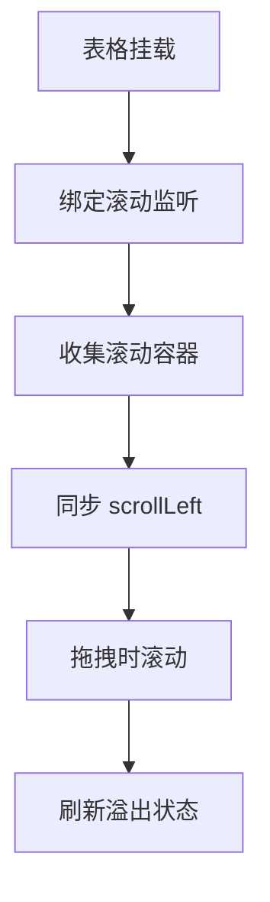
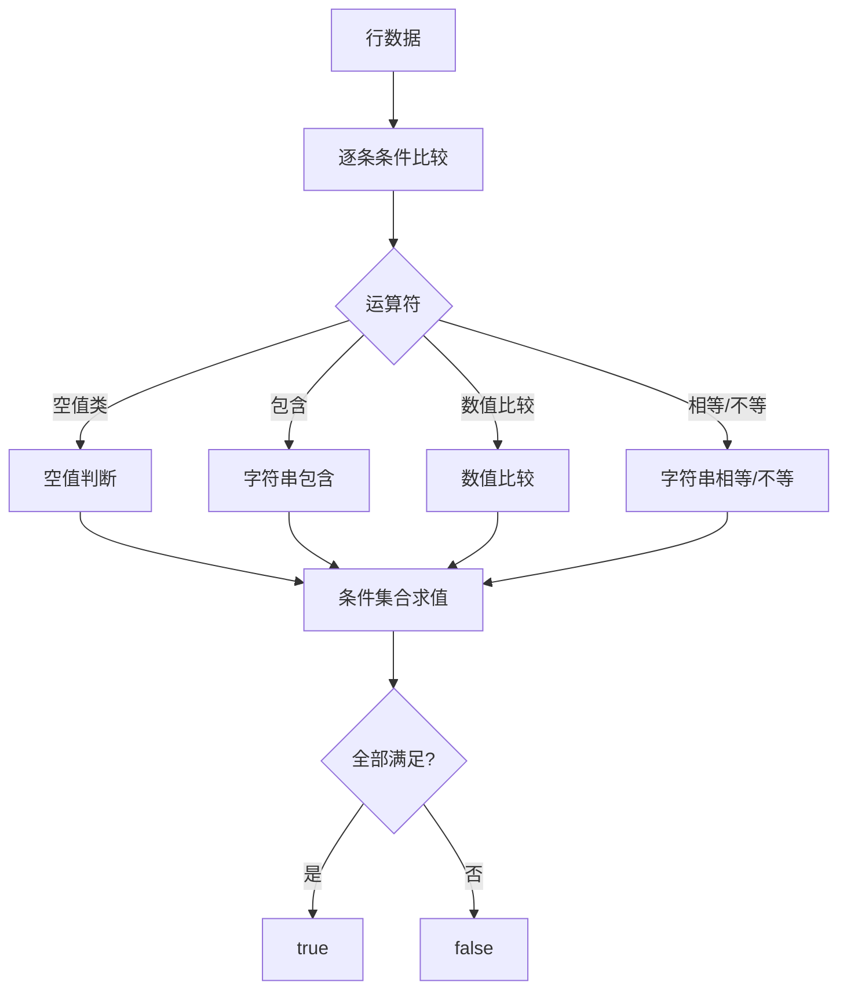
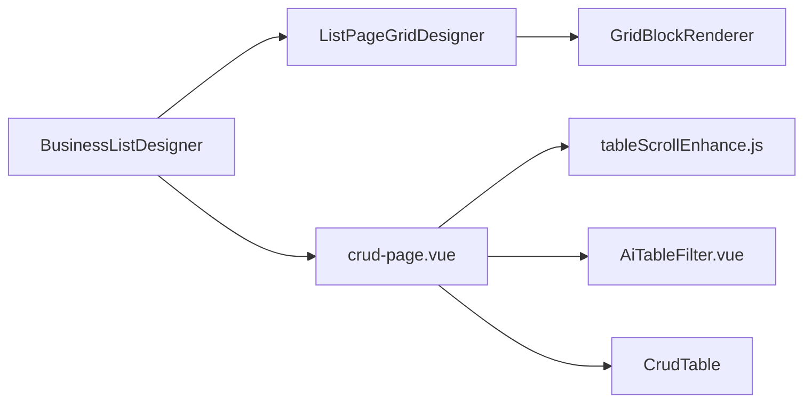

# 列表页面设计器

<cite>
**本文引用的文件**
- [BusinessListDesigner.vue](file://forge-admin-ui/src/views/app-center/components/designer/BusinessListDesigner.vue)
- [ListPageGridDesigner.vue](file://forge-admin-ui/src/components/lowcode-builder/page/ListPageGridDesigner.vue)
- [crud-page.vue](file://forge-admin-ui/src/views/ai/crud-page.vue)
- [tableScrollEnhance.js](file://forge-admin-ui/src/directives/modules/tableScrollEnhance.js)
- [AiTableFilter.vue](file://forge-admin-ui/src/components/ai-form/AiTableFilter.vue)
- [Tables/CrudTable/index.vue](file://forge-report-ui/src/packages/components/Tables/Tables/CrudTable/index.vue)
</cite>

## 目录
1. [简介](#简介)
2. [项目结构](#项目结构)
3. [核心组件](#核心组件)
4. [架构总览](#架构总览)
5. [详细组件分析](#详细组件分析)
6. [依赖关系分析](#依赖关系分析)
7. [性能考虑](#性能考虑)
8. [故障排查指南](#故障排查指南)
9. [结论](#结论)
10. [附录](#附录)

## 简介
本技术文档围绕低代码页面构建器中的“列表页面设计器”展开，重点解析 ListPageGridDesigner 列表设计器的实现原理与交互机制，覆盖表格列配置、筛选器设置、排序规则与操作按钮配置；阐述 CRUD 配置编辑器的数据源绑定、查询条件构建、分页配置与批量操作能力；说明结构化列表设计器的列拖拽排序、宽度调整、显示隐藏与条件渲染等交互；并提供大数据量场景下的表格性能优化与虚拟滚动方案建议，以及复杂业务场景下的最佳实践与扩展开发指南。

## 项目结构
列表页面设计器由“业务层编排”和“画布渲染与属性编辑”两部分组成：
- 业务编排层：BusinessListDesigner 负责多页面切换、模板选择（标准列表/左树右表）、布局同步、自定义操作管理、预览与保存。
- 画布与运行时：ListPageGridDesigner 提供栅格化画布、区块拖拽放置、属性面板、样式与交互配置，并注入运行时 CRUD 属性以驱动底层表格与表单。
- 运行时渲染：crud-page.vue 将配置转换为运行时 CRUD 属性，包括数据源、查询参数、排序、分页、导入导出、批量操作、公共参数等。
- 表格增强：tableScrollEnhance.js 为表格提供横向滚动增强、多容器同步、拖拽时滚动等体验优化。
- 列配置与筛选：AiTableFilter.vue 支持列的可见性控制与顺序拖拽；CrudTable 提供条件比较与行级条件评估。

图表来源
- [BusinessListDesigner.vue:239-255](file://forge-admin-ui/src/views/app-center/components/designer/BusinessListDesigner.vue#L239-L255)
- [ListPageGridDesigner.vue:197-221](file://forge-admin-ui/src/components/lowcode-builder/page/ListPageGridDesigner.vue#L197-L221)
- [crud-page.vue:1010-1108](file://forge-admin-ui/src/views/ai/crud-page.vue#L1010-L1108)
- [tableScrollEnhance.js:116-217](file://forge-admin-ui/src/directives/modules/tableScrollEnhance.js#L116-L217)
- [AiTableFilter.vue:35-69](file://forge-admin-ui/src/components/ai-form/AiTableFilter.vue#L35-L69)
- [Tables/CrudTable/index.vue:230-251](file://forge-report-ui/src/packages/components/Tables/Tables/CrudTable/index.vue#L230-L251)

章节来源
- [BusinessListDesigner.vue:239-255](file://forge-admin-ui/src/views/app-center/components/designer/BusinessListDesigner.vue#L239-L255)
- [ListPageGridDesigner.vue:1-221](file://forge-admin-ui/src/components/lowcode-builder/page/ListPageGridDesigner.vue#L1-L221)

## 核心组件
- BusinessListDesigner：承载多页面（list/create/edit/dialog/drawer/custom）切换、模板选择（simple-crud/tree-crud）、布局与区域（zones）同步、自定义操作（顶部/行内/详情）管理、撤销重做、预览与保存。
- ListPageGridDesigner：栅格画布、区块拖放、属性/样式/交互面板、运行时 CRUD 属性注入、嵌套区块事件透传、视口缩放与设备预览。
- crud-page.vue：将设计期配置转换为运行时 CRUD 属性，处理默认排序、树表加载模式、公共参数/查询、表单默认值、导入导出、批量删除、自定义查询开关、工具栏与行操作等。
- tableScrollEnhance.js：表格横向滚动增强、多容器同步、拖拽滚动、溢出状态更新、全局扫描与自动增强。
- AiTableFilter.vue：列可见性勾选、列顺序拖拽、选择列与操作列位置保持、变化事件上报。
- Tables/CrudTable/index.vue：行级条件比较（空值、包含、等于、范围等），条件集合求值。

章节来源
- [BusinessListDesigner.vue:332-504](file://forge-admin-ui/src/views/app-center/components/designer/BusinessListDesigner.vue#L332-L504)
- [ListPageGridDesigner.vue:1-221](file://forge-admin-ui/src/components/lowcode-builder/page/ListPageGridDesigner.vue#L1-L221)
- [crud-page.vue:1010-1108](file://forge-admin-ui/src/views/ai/crud-page.vue#L1010-L1108)
- [tableScrollEnhance.js:116-217](file://forge-admin-ui/src/directives/modules/tableScrollEnhance.js#L116-L217)
- [AiTableFilter.vue:35-69](file://forge-admin-ui/src/components/ai-form/AiTableFilter.vue#L35-L69)
- [Tables/CrudTable/index.vue:230-251](file://forge-report-ui/src/packages/components/Tables/Tables/CrudTable/index.vue#L230-L251)

## 架构总览
列表设计器采用“设计期-运行期”分离的架构：
- 设计期：BusinessListDesigner 维护 schema/pages/zones/gridLayout，通过 ListPageGridDesigner 进行可视化编辑，生成或同步布局。
- 运行期：crud-page.vue 读取配置并构造 runtime CRUD 属性，驱动表格、表单、查询、分页、导入导出、批量操作等。
- 增强层：tableScrollEnhance.js 对表格滚动进行增强；AiTableFilter.vue 提供列配置交互；CrudTable 提供条件计算。

图表来源
- [BusinessListDesigner.vue:239-255](file://forge-admin-ui/src/views/app-center/components/designer/BusinessListDesigner.vue#L239-L255)
- [ListPageGridDesigner.vue:197-221](file://forge-admin-ui/src/components/lowcode-builder/page/ListPageGridDesigner.vue#L197-L221)
- [crud-page.vue:1010-1108](file://forge-admin-ui/src/views/ai/crud-page.vue#L1010-L1108)
- [tableScrollEnhance.js:116-217](file://forge-admin-ui/src/directives/modules/tableScrollEnhance.js#L116-L217)
- [AiTableFilter.vue:35-69](file://forge-admin-ui/src/components/ai-form/AiTableFilter.vue#L35-L69)
- [Tables/CrudTable/index.vue:230-251](file://forge-report-ui/src/packages/components/Tables/Tables/CrudTable/index.vue#L230-L251)

## 详细组件分析

### 列表设计器（BusinessListDesigner）
- 多页面管理：支持 list/create/edit/dialog/drawer/custom 类型，页签切换、新增/复制/删除页面，受保护页面不可删除。
- 模板切换：simple-crud 与 tree-crud 两种模板，切换时重建默认布局并保留非模板区块。
- 布局同步：将 gridLayout 与 zones 双向同步，保证搜索区、表格区、工具栏等区域与画布一致。
- 自定义操作：顶部按钮、行内操作、详情操作统一管理，支持预览与编辑。
- 撤销/重做：维护历史栈，限制最大步数。
- 预览：弹窗中只读渲染当前列表布局。

图表来源
- [BusinessListDesigner.vue:407-461](file://forge-admin-ui/src/views/app-center/components/designer/BusinessListDesigner.vue#L407-L461)
- [BusinessListDesigner.vue:548-681](file://forge-admin-ui/src/views/app-center/components/designer/BusinessListDesigner.vue#L548-L681)
- [BusinessListDesigner.vue:683-731](file://forge-admin-ui/src/views/app-center/components/designer/BusinessListDesigner.vue#L683-L731)

章节来源
- [BusinessListDesigner.vue:332-504](file://forge-admin-ui/src/views/app-center/components/designer/BusinessListDesigner.vue#L332-L504)
- [BusinessListDesigner.vue:548-681](file://forge-admin-ui/src/views/app-center/components/designer/BusinessListDesigner.vue#L548-L681)
- [BusinessListDesigner.vue:683-731](file://forge-admin-ui/src/views/app-center/components/designer/BusinessListDesigner.vue#L683-L731)

### 栅格画布与属性面板（ListPageGridDesigner）
- 画布：栅格背景、区块拖拽放置、移动占位、禁止嵌套提示、缩放与视口设备切换、专注模式。
- 区块：每个区块可点击选中、拖拽移动、调整大小、更多操作菜单。
- 属性面板：属性/样式/交互三标签页，支持区块标题、栅格结构（列数、间距、行距）、格子样式（对齐、背景）、外观（最小/最大宽高、背景色）等。
- 运行时注入：向子区块注入 runtime-crud-props，使表格、表单、树、搜索等获得运行时上下文。

图表来源
- [ListPageGridDesigner.vue:1-221](file://forge-admin-ui/src/components/lowcode-builder/page/ListPageGridDesigner.vue#L1-L221)
- [ListPageGridDesigner.vue:459-593](file://forge-admin-ui/src/components/lowcode-builder/page/ListPageGridDesigner.vue#L459-L593)
- [ListPageGridDesigner.vue:607-750](file://forge-admin-ui/src/components/lowcode-builder/page/ListPageGridDesigner.vue#L607-L750)

章节来源
- [ListPageGridDesigner.vue:1-221](file://forge-admin-ui/src/components/lowcode-builder/page/ListPageGridDesigner.vue#L1-L221)
- [ListPageGridDesigner.vue:459-593](file://forge-admin-ui/src/components/lowcode-builder/page/ListPageGridDesigner.vue#L459-L593)
- [ListPageGridDesigner.vue:607-750](file://forge-admin-ui/src/components/lowcode-builder/page/ListPageGridDesigner.vue#L607-L750)

### CRUD 配置编辑器（运行时）
- 数据源绑定：通过 options/apiConfig 等配置项注入接口地址、导入导出 URL。
- 查询条件构建：publicQuery/publicParams 合并路由入参与默认排序参数，支持 enableCustomQuery 开启自定义查询。
- 分页配置：showPagination 控制是否显示分页，treeTable 模式下默认关闭。
- 批量操作：hideBatchDelete 控制批量删除显隐，toolbarActions/runtimeActions 控制工具栏与行操作。
- 钩子与治理：crudHookRules/beforeSubmitRules 组合运行时钩子，governance events 注入表单治理事件。

图表来源
- [crud-page.vue:1010-1108](file://forge-admin-ui/src/views/ai/crud-page.vue#L1010-L1108)

章节来源
- [crud-page.vue:1010-1108](file://forge-admin-ui/src/views/ai/crud-page.vue#L1010-L1108)

### 列配置与筛选（AiTableFilter）
- 列可见性：checkbox 控制列显示/隐藏，默认选中非隐藏列。
- 列顺序：拖拽排序，选择列置于最前，操作列置于最后，其他列按新顺序排列。
- 事件上报：column-order-change 通知父组件更新列顺序。

图表来源
- [AiTableFilter.vue:35-69](file://forge-admin-ui/src/components/ai-form/AiTableFilter.vue#L35-L69)
- [AiTableFilter.vue:151-269](file://forge-admin-ui/src/components/ai-form/AiTableFilter.vue#L151-L269)

章节来源
- [AiTableFilter.vue:35-69](file://forge-admin-ui/src/components/ai-form/AiTableFilter.vue#L35-L69)
- [AiTableFilter.vue:151-269](file://forge-admin-ui/src/components/ai-form/AiTableFilter.vue#L151-L269)

### 表格性能优化（tableScrollEnhance）
- 横向滚动增强：收集所有可水平滚动的容器，同步 scrollLeft，避免错位。
- 拖拽滚动：鼠标拖拽过程中根据 deltaX 滚动表格，提升大表格操作体验。
- 溢出状态：检测垂直溢出并添加类名，便于样式控制。
- 全局增强：MutationObserver 监听 DOM 变化，自动扫描并增强表格。

图表来源
- [tableScrollEnhance.js:116-217](file://forge-admin-ui/src/directives/modules/tableScrollEnhance.js#L116-L217)
- [tableScrollEnhance.js:256-355](file://forge-admin-ui/src/directives/modules/tableScrollEnhance.js#L256-L355)
- [tableScrollEnhance.js:357-395](file://forge-admin-ui/src/directives/modules/tableScrollEnhance.js#L357-L395)

章节来源
- [tableScrollEnhance.js:116-217](file://forge-admin-ui/src/directives/modules/tableScrollEnhance.js#L116-L217)
- [tableScrollEnhance.js:256-355](file://forge-admin-ui/src/directives/modules/tableScrollEnhance.js#L256-L355)
- [tableScrollEnhance.js:357-395](file://forge-admin-ui/src/directives/modules/tableScrollEnhance.js#L357-L395)

### 条件比较与行级过滤（CrudTable）
- 支持运算符：empty/notEmpty/contains/eq/ne/gt/gte/lt/lte。
- 数值比较：当左右值均可转为数字时执行数值比较，否则字符串比较。
- 条件集合：every 求值，全部满足才返回 true。

图表来源
- [Tables/CrudTable/index.vue:230-251](file://forge-report-ui/src/packages/components/Tables/Tables/CrudTable/index.vue#L230-L251)

章节来源
- [Tables/CrudTable/index.vue:230-251](file://forge-report-ui/src/packages/components/Tables/Tables/CrudTable/index.vue#L230-L251)

## 依赖关系分析
- BusinessListDesigner 依赖 ListPageGridDesigner 完成可视化布局编辑，并通过 computed 注入运行时 CRUD 属性。
- ListPageGridDesigner 依赖 GridBlockRenderer 渲染各区块，并向其传递运行时上下文。
- crud-page.vue 作为运行时入口，聚合 options、config、routeEntryPublicQuery，生成最终渲染属性。
- tableScrollEnhance.js 通过指令或全局扫描增强表格滚动行为。
- AiTableFilter.vue 与 CrudTable 提供列配置与条件计算能力，被运行时表格使用。

图表来源
- [BusinessListDesigner.vue:239-255](file://forge-admin-ui/src/views/app-center/components/designer/BusinessListDesigner.vue#L239-L255)
- [ListPageGridDesigner.vue:197-221](file://forge-admin-ui/src/components/lowcode-builder/page/ListPageGridDesigner.vue#L197-L221)
- [crud-page.vue:1010-1108](file://forge-admin-ui/src/views/ai/crud-page.vue#L1010-L1108)
- [tableScrollEnhance.js:116-217](file://forge-admin-ui/src/directives/modules/tableScrollEnhance.js#L116-L217)
- [AiTableFilter.vue:35-69](file://forge-admin-ui/src/components/ai-form/AiTableFilter.vue#L35-L69)
- [Tables/CrudTable/index.vue:230-251](file://forge-report-ui/src/packages/components/Tables/Tables/CrudTable/index.vue#L230-L251)

章节来源
- [BusinessListDesigner.vue:239-255](file://forge-admin-ui/src/views/app-center/components/designer/BusinessListDesigner.vue#L239-L255)
- [ListPageGridDesigner.vue:197-221](file://forge-admin-ui/src/components/lowcode-builder/page/ListPageGridDesigner.vue#L197-L221)
- [crud-page.vue:1010-1108](file://forge-admin-ui/src/views/ai/crud-page.vue#L1010-L1108)

## 性能考虑
- 表格滚动增强：通过同步多容器 scrollLeft 与拖拽滚动减少重排与抖动，提升大表格交互流畅度。
- 列配置优化：列顺序与可见性变更仅重组可见列数组，避免全量重绘。
- 条件计算：条件比较在行级进行，注意运算符选择与数据类型转换，避免不必要的字符串比较开销。
- 大数据量建议：
  - 服务端分页与增量加载：优先使用后端分页，前端按需请求。
  - 虚拟滚动：结合表格组件的虚拟滚动能力（如基于可视区域的行渲染）降低 DOM 节点数量。
  - 缓存与去抖：查询参数变化时使用防抖，结果缓存相同查询。
  - 列精简：默认仅展示必要列，其余通过列配置动态加载。
  - 图片与富文本懒加载：延迟加载大图与复杂内容。
  - 事件节流：滚动与输入事件节流，减少频繁计算。

[本节为通用性能指导，不直接分析具体文件]

## 故障排查指南
- 表格横向滚动错位：检查 tableScrollEnhance 是否正确绑定与同步多个滚动容器，确认未禁用属性。
- 列顺序异常：确认 AiTableFilter 的拖拽逻辑与选择列/操作列位置保持是否正确。
- 条件过滤不生效：核对 CrudTable 的运算符与数据类型，确保字段路径与值正确。
- 运行时属性缺失：检查 crud-page.vue 中 publicParams/publicQuery 合并逻辑，确认路由参数与默认值注入。
- 布局与区域不同步：确认 BusinessListDesigner 的 handleGridLayoutUpdate 与 syncGridLayoutWithModel/applyGridLayoutToZones 调用正确。

章节来源
- [tableScrollEnhance.js:116-217](file://forge-admin-ui/src/directives/modules/tableScrollEnhance.js#L116-L217)
- [AiTableFilter.vue:151-269](file://forge-admin-ui/src/components/ai-form/AiTableFilter.vue#L151-L269)
- [Tables/CrudTable/index.vue:230-251](file://forge-report-ui/src/packages/components/Tables/Tables/CrudTable/index.vue#L230-L251)
- [crud-page.vue:1010-1108](file://forge-admin-ui/src/views/ai/crud-page.vue#L1010-L1108)
- [BusinessListDesigner.vue:683-731](file://forge-admin-ui/src/views/app-center/components/designer/BusinessListDesigner.vue#L683-L731)

## 结论
列表页面设计器通过“设计期-运行期”解耦与模块化组件协作，实现了灵活的列表布局编辑、强大的 CRUD 运行时能力与良好的交互体验。借助表格滚动增强、列配置与条件计算，能够满足复杂业务场景下的列表需求。建议在大数据量场景下结合服务端分页与虚拟滚动进一步优化性能，并通过标准化配置与扩展点提升可维护性与可扩展性。

## 附录
- 扩展开发建议：
  - 新增列类型：在 AiTableFilter 中注册新的列类型与渲染逻辑。
  - 扩展条件运算符：在 CrudTable 中增加新的比较逻辑。
  - 自定义运行时钩子：在 crud-page.vue 中扩展 beforeSubmitRules 与 governance events。
  - 表格增强插件：在 tableScrollEnhance.js 中扩展新的滚动行为或事件处理。
  - 模板扩展：在 BusinessListDesigner 中新增模板类型与默认布局生成逻辑。

[本节为通用扩展指导，不直接分析具体文件]