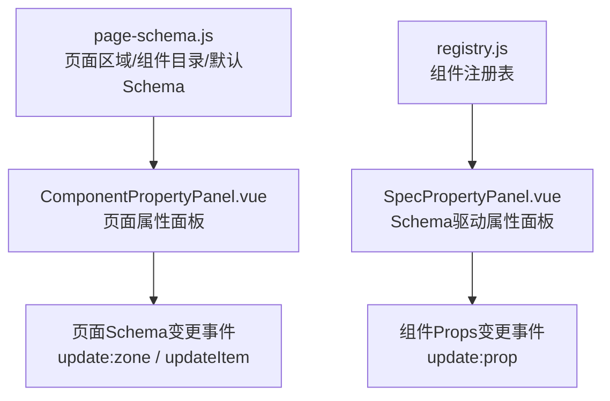
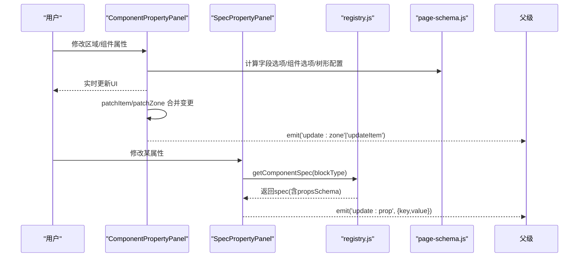
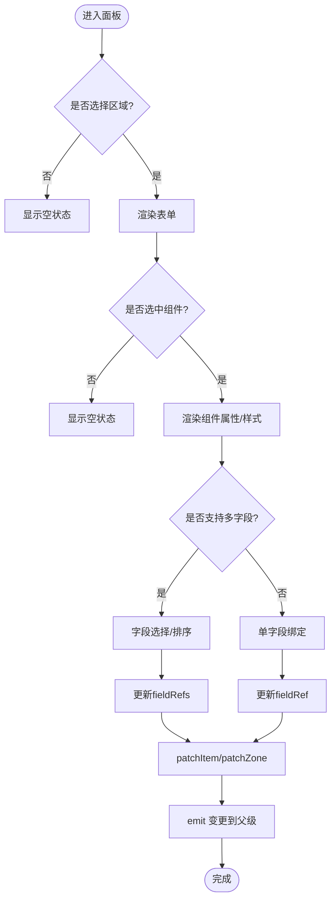
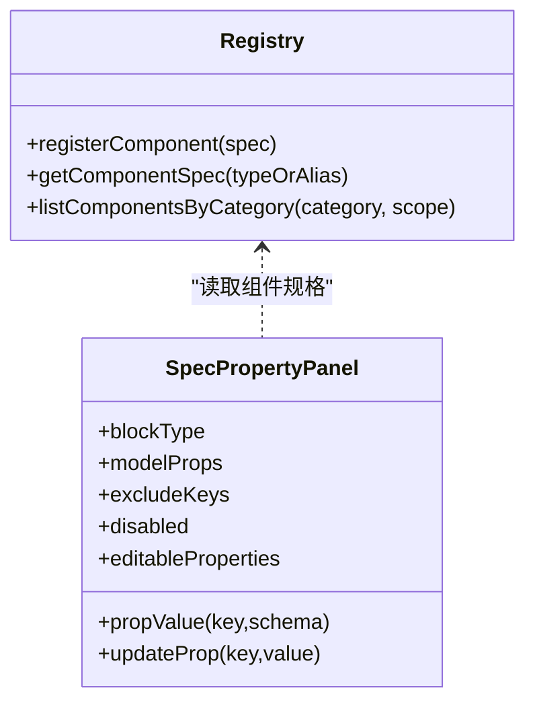
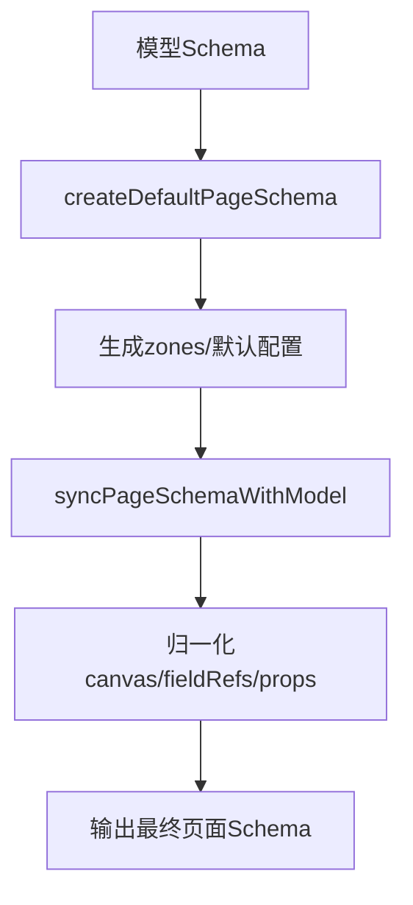
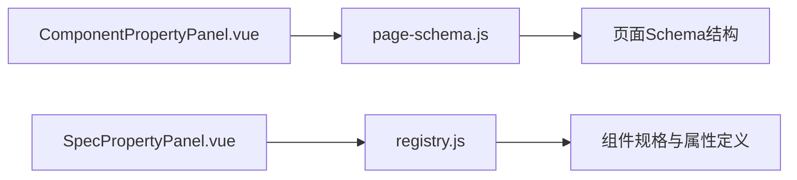

# 属性配置编辑器

<cite>
**本文引用的文件**
- [ComponentPropertyPanel.vue](file://forge-admin-ui/src/components/lowcode-builder/page/ComponentPropertyPanel.vue)
- [SpecPropertyPanel.vue](file://forge-admin-ui/src/components/lowcode-builder/designer-core/panel/SpecPropertyPanel.vue)
- [page-schema.js](file://forge-admin-ui/src/components/lowcode-builder/page/page-schema.js)
- [registry.js](file://forge-admin-ui/src/components/lowcode-builder/designer-core/spec/registry.js)
</cite>

## 目录
1. [简介](#简介)
2. [项目结构](#项目结构)
3. [核心组件](#核心组件)
4. [架构总览](#架构总览)
5. [详细组件分析](#详细组件分析)
6. [依赖关系分析](#依赖关系分析)
7. [性能考量](#性能考量)
8. [故障排查指南](#故障排查指南)
9. [结论](#结论)
10. [附录](#附录)

## 简介
本技术文档围绕低代码页面构建器的“属性配置编辑器”展开，重点解析 ComponentPropertyPanel 属性面板的实现机制与 SpecPropertyPanel 的 Schema 驱动引擎。内容涵盖：
- 动态表单生成、属性类型映射、验证规则配置与实时预览更新
- 属性编辑器的架构设计：属性定义 Schema、编辑器组件注册、数据同步机制与变更追踪
- 复杂属性的编辑模式：数组、对象、条件显示与联动配置
- 属性验证、错误提示、国际化支持与无障碍访问的实现细节
- 自定义属性编辑器与高级配置场景的开发指南

## 项目结构
与属性配置编辑器直接相关的核心文件与职责如下：
- page-schema.js：页面区域（zone）与画布组件目录、默认页 Schema 生成、字段可见性过滤、树形配置默认值等
- registry.js：统一组件注册表，维护组件规格（ComponentSpec），提供查询、分组、别名解析等能力
- SpecPropertyPanel.vue：基于 Schema 的动态属性面板，按 spec.propsSchema 自动生成 UI，支持 section、boolean、number、select、color、textarea/json 等
- ComponentPropertyPanel.vue：页面级属性面板，负责选中组件与区域（zone）的属性编辑、布局样式、列表能力与树形导航配置

图表来源
- [page-schema.js:153-315](file://forge-admin-ui/src/components/lowcode-builder/page/page-schema.js#L153-L315)
- [registry.js:17-66](file://forge-admin-ui/src/components/lowcode-builder/designer-core/spec/registry.js#L17-L66)
- [ComponentPropertyPanel.vue:266-451](file://forge-admin-ui/src/components/lowcode-builder/page/ComponentPropertyPanel.vue#L266-L451)
- [SpecPropertyPanel.vue:14-85](file://forge-admin-ui/src/components/lowcode-builder/designer-core/panel/SpecPropertyPanel.vue#L14-L85)

章节来源
- [page-schema.js:1-800](file://forge-admin-ui/src/components/lowcode-builder/page/page-schema.js#L1-L800)
- [registry.js:1-169](file://forge-admin-ui/src/components/lowcode-builder/designer-core/spec/registry.js#L1-L169)
- [ComponentPropertyPanel.vue:1-563](file://forge-admin-ui/src/components/lowcode-builder/page/ComponentPropertyPanel.vue#L1-L563)
- [SpecPropertyPanel.vue:1-288](file://forge-admin-ui/src/components/lowcode-builder/designer-core/panel/SpecPropertyPanel.vue#L1-L288)

## 核心组件
- 页面属性面板（ComponentPropertyPanel）
  - 负责当前区域（zone）启用开关、选中组件名称/类型/绑定字段、多字段选择与排序、布局坐标与尺寸、样式（标签宽度、对齐、圆角、填充色、边框色）、锁定位置、删除组件
  - 列表能力开关（批量导入、导出、隐藏批量删除、自定义查询）
  - 树形导航配置（标题、父级字段、显示字段、加载方式）
  - 通过 emit 将变更上抛给父级，实现数据同步
- Schema 驱动属性面板（SpecPropertyPanel）
  - 读取组件 spec 的 propsSchema，动态渲染属性控件
  - 支持 section 分组、boolean 开关、number/select/color/短文本、textarea/json 长内容
  - 通过 update:prop 事件上报键值对变更，由接入方合并到 modelProps

章节来源
- [ComponentPropertyPanel.vue:266-451](file://forge-admin-ui/src/components/lowcode-builder/page/ComponentPropertyPanel.vue#L266-L451)
- [SpecPropertyPanel.vue:14-85](file://forge-admin-ui/src/components/lowcode-builder/designer-core/panel/SpecPropertyPanel.vue#L14-L85)

## 架构总览
属性编辑器采用“双引擎”架构：
- 页面级属性面板：以 zone + item 为中心，直接操作页面 Schema 的结构化片段（如 zones[].props、selectedItem.style/props）
- 组件级属性面板：以 spec.propsSchema 为中心，声明式描述属性元数据，自动渲染 UI，解耦具体组件实现

图表来源
- [ComponentPropertyPanel.vue:266-451](file://forge-admin-ui/src/components/lowcode-builder/page/ComponentPropertyPanel.vue#L266-L451)
- [SpecPropertyPanel.vue:14-85](file://forge-admin-ui/src/components/lowcode-builder/designer-core/panel/SpecPropertyPanel.vue#L14-L85)
- [registry.js:17-66](file://forge-admin-ui/src/components/lowcode-builder/designer-core/spec/registry.js#L17-L66)
- [page-schema.js:302-341](file://forge-admin-ui/src/components/lowcode-builder/page/page-schema.js#L302-L341)

## 详细组件分析

### ComponentPropertyPanel 属性面板
- 动态表单生成
  - 根据 selectedComponentKey 决定是否支持多字段（query-set/data-table）
  - 字段选项由 fields 计算得出，支持搜索与清空
  - 多字段支持拖拽排序与移除
- 属性类型映射
  - 文本输入、数字输入、下拉选择、颜色选择器、开关等
  - 布局网格（X/Y/w/h）与样式（labelWidth/textAlign/radius/fill/stroke）
- 验证规则配置
  - 数字输入设置 min/max/step
  - 必填字段通过业务层校验（如 requireFields 在 catalog 中声明）
- 实时预览更新
  - 通过 patchItem/patchZone 合并 style/props 后 emit 到父级，父级可即时应用变更
- 复杂属性编辑模式
  - 数组：fieldRefs 作为数组，支持多选与顺序调整
  - 对象：treeConfig 为嵌套对象，增量更新
  - 条件显示：仅在 layoutType=tree-crud 且 zoneKey=table 时展示树形配置
  - 联动配置：切换 fieldRef 时自动推断 label 与 componentKey

图表来源
- [ComponentPropertyPanel.vue:20-262](file://forge-admin-ui/src/components/lowcode-builder/page/ComponentPropertyPanel.vue#L20-L262)
- [ComponentPropertyPanel.vue:316-406](file://forge-admin-ui/src/components/lowcode-builder/page/ComponentPropertyPanel.vue#L316-L406)
- [ComponentPropertyPanel.vue:424-451](file://forge-admin-ui/src/components/lowcode-builder/page/ComponentPropertyPanel.vue#L424-L451)

章节来源
- [ComponentPropertyPanel.vue:20-262](file://forge-admin-ui/src/components/lowcode-builder/page/ComponentPropertyPanel.vue#L20-L262)
- [ComponentPropertyPanel.vue:302-406](file://forge-admin-ui/src/components/lowcode-builder/page/ComponentPropertyPanel.vue#L302-L406)
- [ComponentPropertyPanel.vue:424-451](file://forge-admin-ui/src/components/lowcode-builder/page/ComponentPropertyPanel.vue#L424-L451)

### SpecPropertyPanel Schema 驱动引擎
- 属性定义 Schema
  - 通过 getComponentSpec(blockType) 获取 spec，读取 spec.propsSchema.properties
  - 支持 section 分组、boolean、number、select、color、textarea/json
- 编辑器组件注册
  - 使用 registry.js 的 registerComponent/registerComponents 进行集中管理
  - 支持别名映射与分类/作用域过滤
- 数据同步机制
  - propValue(key, schema) 读取当前值或默认值
  - updateProp(key, value) 触发 update:prop 事件，由父级合并到 modelProps
- 变更追踪
  - JSON 属性在 blur/change 时尝试解析，非法则保留上次合法值
  - 其他类型通过 v-model 双向绑定，实时回写

图表来源
- [registry.js:17-66](file://forge-admin-ui/src/components/lowcode-builder/designer-core/spec/registry.js#L17-L66)
- [SpecPropertyPanel.vue:14-85](file://forge-admin-ui/src/components/lowcode-builder/designer-core/panel/SpecPropertyPanel.vue#L14-L85)

章节来源
- [SpecPropertyPanel.vue:14-85](file://forge-admin-ui/src/components/lowcode-builder/designer-core/panel/SpecPropertyPanel.vue#L14-L85)
- [SpecPropertyPanel.vue:88-199](file://forge-admin-ui/src/components/lowcode-builder/designer-core/panel/SpecPropertyPanel.vue#L88-L199)
- [registry.js:17-66](file://forge-admin-ui/src/components/lowcode-builder/designer-core/spec/registry.js#L17-L66)

### 页面 Schema 与默认生成
- 默认页面 Schema
  - createDefaultPageSchema 根据模型类型生成 layoutType、zones、默认列与树形配置
- 同步与归一化
  - syncPageSchemaWithModel 将现有 Schema 与模型字段对齐，处理 canvas/formCreateRule/childEditRefs 等
- 字段可见性与过滤
  - isHiddenPageField/isInactivePageField/isReadonlySystemField/isPageFieldVisible
  - 列表默认列过滤审计类系统字段

图表来源
- [page-schema.js:153-315](file://forge-admin-ui/src/components/lowcode-builder/page/page-schema.js#L153-L315)

章节来源
- [page-schema.js:153-315](file://forge-admin-ui/src/components/lowcode-builder/page/page-schema.js#L153-L315)

## 依赖关系分析
- ComponentPropertyPanel 依赖 page-schema 提供的组件目录与工具函数，用于：
  - 过滤可用组件（按 zone 限制）
  - 计算字段选项与默认字段组件映射
  - 初始化树形配置
- SpecPropertyPanel 依赖 registry.js 的组件注册表，用于：
  - 获取组件规格与属性定义
  - 支持别名与分类筛选
- 两者均通过事件向上汇报变更，由父级容器负责持久化与预览刷新

图表来源
- [ComponentPropertyPanel.vue:266-341](file://forge-admin-ui/src/components/lowcode-builder/page/ComponentPropertyPanel.vue#L266-L341)
- [page-schema.js:302-341](file://forge-admin-ui/src/components/lowcode-builder/page/page-schema.js#L302-L341)
- [SpecPropertyPanel.vue:14-27](file://forge-admin-ui/src/components/lowcode-builder/designer-core/panel/SpecPropertyPanel.vue#L14-L27)
- [registry.js:17-66](file://forge-admin-ui/src/components/lowcode-builder/designer-core/spec/registry.js#L17-L66)

章节来源
- [ComponentPropertyPanel.vue:266-341](file://forge-admin-ui/src/components/lowcode-builder/page/ComponentPropertyPanel.vue#L266-L341)
- [page-schema.js:302-341](file://forge-admin-ui/src/components/lowcode-builder/page/page-schema.js#L302-L341)
- [SpecPropertyPanel.vue:14-27](file://forge-admin-ui/src/components/lowcode-builder/designer-core/panel/SpecPropertyPanel.vue#L14-L27)
- [registry.js:17-66](file://forge-admin-ui/src/components/lowcode-builder/designer-core/spec/registry.js#L17-L66)

## 性能考量
- 计算属性优化
  - 字段选项、组件选项、选中字段行、树形配置等使用 computed，避免重复计算
- 局部更新
  - 通过 patchItem/patchZone 仅合并变更字段，减少不必要的全量重渲染
- JSON 编辑容错
  - JSON 属性在非法时不回写，避免频繁无效更新
- 列表能力与树形配置的条件渲染
  - 仅在特定 layoutType/zoneKey 下渲染，降低无关开销

[本节为通用指导，不直接分析具体文件]

## 故障排查指南
- 无可用属性
  - 检查 blockType 是否正确，registry 是否已注册对应 spec
  - 确认 excludeKeys 未误排除所有属性
- JSON 属性无法保存
  - 检查 JSON 格式合法性；非法时将保留上次合法值
- 字段选项为空
  - 确认传入 fields 是否有效，zoneKey 与字段可见性过滤逻辑是否匹配
- 树形配置未生效
  - 确保 layoutType=tree-crud 且 zoneKey=table，并存在 treeConfig 初始值

章节来源
- [SpecPropertyPanel.vue:74-85](file://forge-admin-ui/src/components/lowcode-builder/designer-core/panel/SpecPropertyPanel.vue#L74-L85)
- [ComponentPropertyPanel.vue:339-373](file://forge-admin-ui/src/components/lowcode-builder/page/ComponentPropertyPanel.vue#L339-L373)

## 结论
该属性配置编辑器通过“页面级面板 + Schema 驱动面板”的双引擎架构，实现了高内聚、低耦合的可扩展属性编辑能力。页面级面板聚焦区域与组件的结构化配置，Schema 驱动面板以声明式方式快速生成属性 UI，二者协同完成从配置到预览的闭环。配合注册表与默认 Schema 生成，能够高效支撑复杂业务场景下的属性编辑需求。

## 附录

### 开发指南：自定义属性编辑器与高级配置
- 新增组件属性
  - 在 registry.js 中注册组件 spec，并在 propsSchema 中声明属性类型、默认值、占位符、最小/最大值、步长、选项等
  - 如需复杂编辑器（公式/联动/CRUD 分区），可在 SpecPropertyPanel 中以 customEditor 形式挂载
- 复杂属性编辑模式
  - 数组：使用 select/multi-select 或自定义列表编辑器，维护 fieldRefs 顺序
  - 对象：使用 textarea/json 或分节 section 组织子属性
  - 条件显示：在 spec 中通过 visibleIf 或接入方逻辑控制渲染
  - 联动配置：监听相关属性变化，动态更新 options/visible/default
- 验证与错误提示
  - 使用 number 的 min/max/step 做基础校验
  - JSON 属性在 blur/change 时解析，失败时给出提示并保留上次值
  - 接入方可在父级统一收集错误并展示
- 国际化支持
  - 在 spec 中使用 title/desc 等文案键，由上层 i18n 服务注入本地化
- 无障碍访问
  - 为关键控件添加 aria-label/aria-describedby
  - 确保键盘可达与焦点管理合理

[本节为通用指导，不直接分析具体文件]