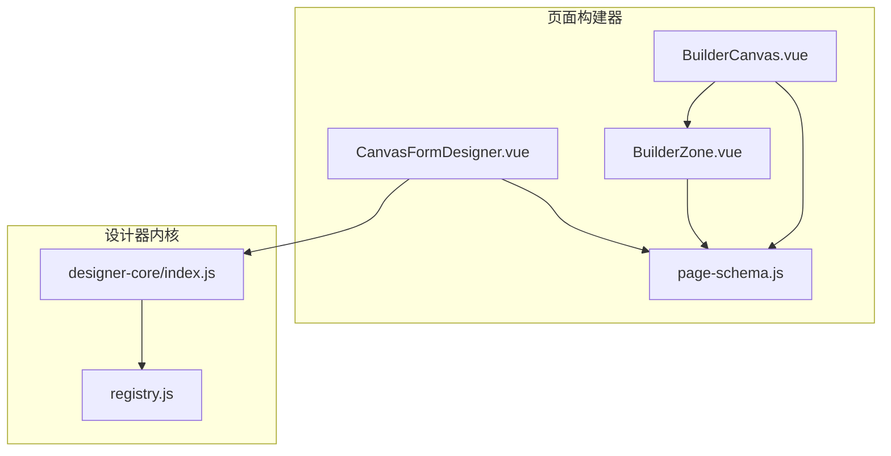
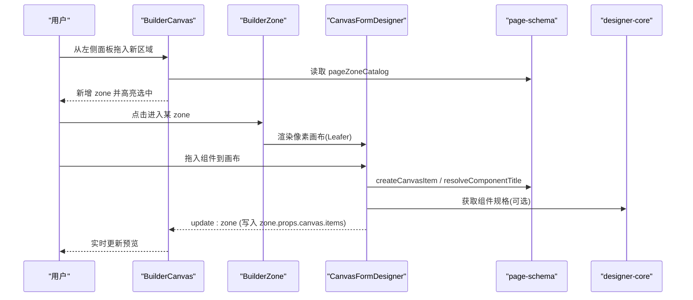
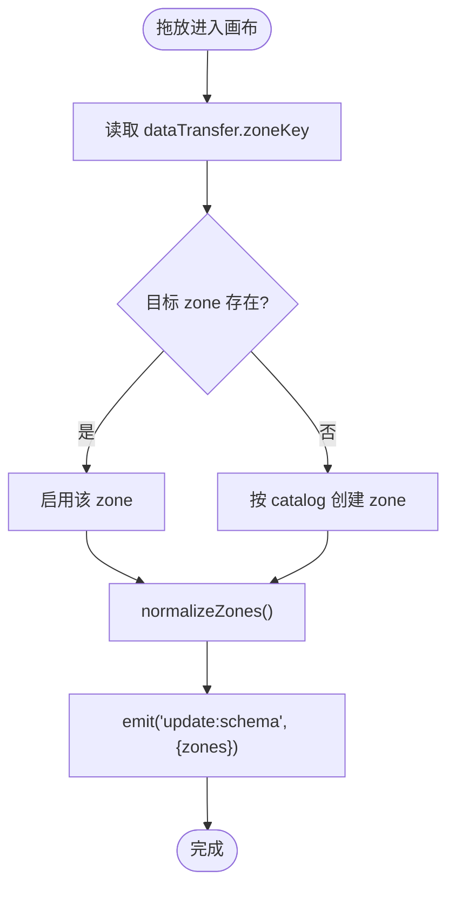
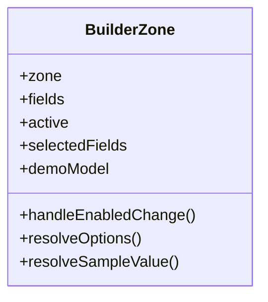
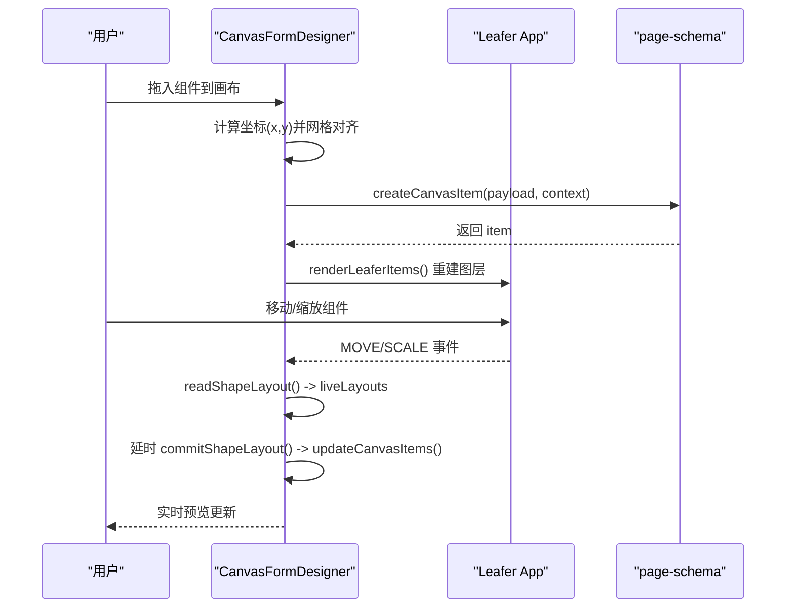
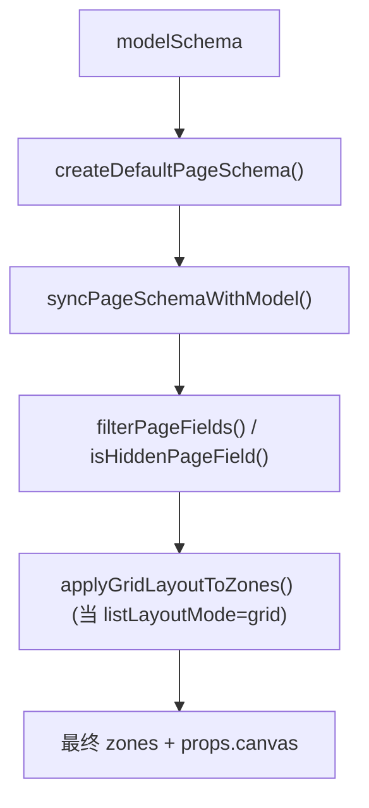
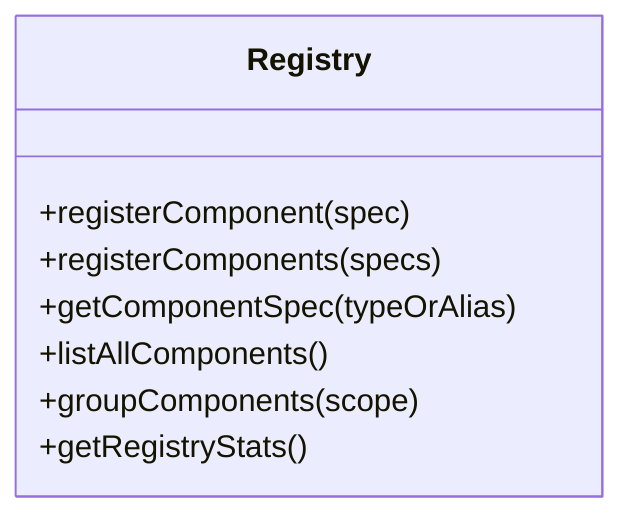
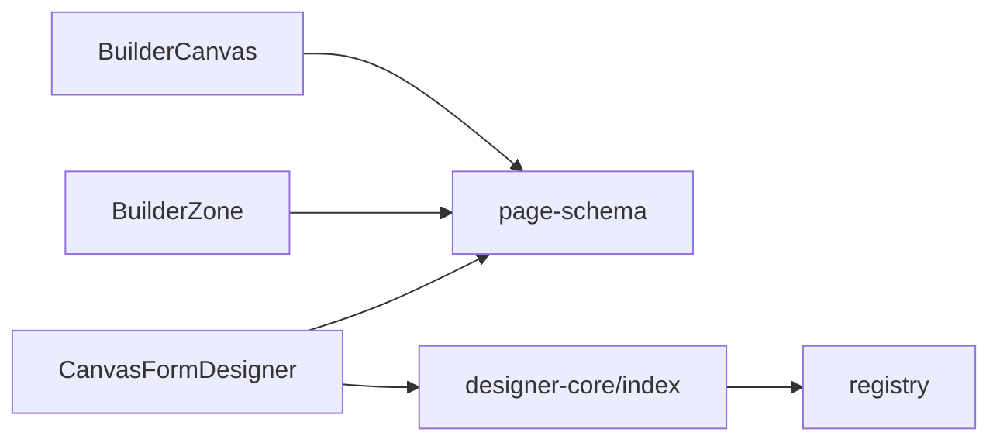

# 画布渲染引擎

<cite>
**本文引用的文件**
- [BuilderCanvas.vue](file://forge-admin-ui/src/components/lowcode-builder/page/BuilderCanvas.vue)
- [BuilderZone.vue](file://forge-admin-ui/src/components/lowcode-builder/page/BuilderZone.vue)
- [CanvasFormDesigner.vue](file://forge-admin-ui/src/components/lowcode-builder/page/CanvasFormDesigner.vue)
- [page-schema.js](file://forge-admin-ui/src/components/lowcode-builder/page/page-schema.js)
- [designer-core/index.js](file://forge-admin-ui/src/components/lowcode-builder/designer-core/index.js)
- [registry.js](file://forge-admin-ui/src/components/lowcode-builder/designer-core/spec/registry.js)
</cite>

## 目录
1. [简介](#简介)
2. [项目结构](#项目结构)
3. [核心组件](#核心组件)
4. [架构总览](#架构总览)
5. [详细组件分析](#详细组件分析)
6. [依赖关系分析](#依赖关系分析)
7. [性能考虑](#性能考虑)
8. [故障排查指南](#故障排查指南)
9. [结论](#结论)
10. [附录](#附录)

## 简介
本技术文档聚焦低代码页面构建器的画布渲染引擎，围绕 BuilderCanvas 画布组件与 CanvasFormDesigner 表单设计器展开，系统解析区块管理、组件拖拽交互、实时预览、响应式布局、画布状态管理、组件生命周期管理与性能优化策略。同时说明画布缩放、网格对齐、撤销重做（扩展建议）的实现细节，并提供画布扩展与自定义组件集成的最佳实践。

## 项目结构
前端低代码构建能力集中在 lowcode-builder 模块中：
- page 层负责页面级画布与区域渲染：BuilderCanvas、BuilderZone、CanvasFormDesigner、page-schema 等。
- designer-core 提供统一组件注册表、拖拽协议、容器插槽规范、树操作等底层能力。
- shared 提供运行时规则、表单布局、数据绑定等共享逻辑。

**图表来源**
- [BuilderCanvas.vue:1-152](file://forge-admin-ui/src/components/lowcode-builder/page/BuilderCanvas.vue#L1-L152)
- [BuilderZone.vue:1-510](file://forge-admin-ui/src/components/lowcode-builder/page/BuilderZone.vue#L1-L510)
- [CanvasFormDesigner.vue:1-1098](file://forge-admin-ui/src/components/lowcode-builder/page/CanvasFormDesigner.vue#L1-L1098)
- [page-schema.js:1-800](file://forge-admin-ui/src/components/lowcode-builder/page/page-schema.js#L1-L800)
- [designer-core/index.js:1-126](file://forge-admin-ui/src/components/lowcode-builder/designer-core/index.js#L1-L126)
- [registry.js:1-169](file://forge-admin-ui/src/components/lowcode-builder/designer-core/spec/registry.js#L1-L169)

**章节来源**
- [BuilderCanvas.vue:1-152](file://forge-admin-ui/src/components/lowcode-builder/page/BuilderCanvas.vue#L1-L152)
- [designer-core/index.js:1-126](file://forge-admin-ui/src/components/lowcode-builder/designer-core/index.js#L1-L126)

## 核心组件
- BuilderCanvas：页面级画布容器，管理 zones 列表、拖放新增区域、区域排序与启用状态。
- BuilderZone：单个区域（search/table/edit/detail）的可视化预览与字段选择，支持查询/编辑/详情模式的即时预览。
- CanvasFormDesigner：基于 Leafer Editor 的像素级画布编辑器，支持组件拖拽、移动、缩放、自动排列、列布局、网格对齐、键盘删除等。
- page-schema：页面区段目录、画布组件目录、默认 schema 生成、字段可见性过滤、模型同步等。
- designer-core：统一组件注册表与工具函数，为各设计器提供一致的组件元数据与能力。

**章节来源**
- [BuilderCanvas.vue:1-152](file://forge-admin-ui/src/components/lowcode-builder/page/BuilderCanvas.vue#L1-L152)
- [BuilderZone.vue:1-510](file://forge-admin-ui/src/components/lowcode-builder/page/BuilderZone.vue#L1-L510)
- [CanvasFormDesigner.vue:1-1098](file://forge-admin-ui/src/components/lowcode-builder/page/CanvasFormDesigner.vue#L1-L1098)
- [page-schema.js:1-800](file://forge-admin-ui/src/components/lowcode-builder/page/page-schema.js#L1-L800)
- [designer-core/index.js:1-126](file://forge-admin-ui/src/components/lowcode-builder/designer-core/index.js#L1-L126)

## 架构总览
画布渲染引擎采用“声明式 Schema + 可视化编辑器”的双轨模式：
- 顶层 BuilderCanvas 维护 zones 数组，每个 zone 对应一种页面区域类型。
- 在 edit/detail 等 zone 中，使用 CanvasFormDesigner 进行像素级布局编排，将组件以 items 形式保存在 zone.props.canvas 中。
- page-schema 提供组件目录、默认 schema、字段过滤与模型同步，确保 UI 与数据模型一致。
- designer-core 提供统一的组件注册表，支撑多类设计器复用同一套组件元数据。

**图表来源**
- [BuilderCanvas.vue:61-91](file://forge-admin-ui/src/components/lowcode-builder/page/BuilderCanvas.vue#L61-L91)
- [BuilderZone.vue:24-118](file://forge-admin-ui/src/components/lowcode-builder/page/BuilderZone.vue#L24-L118)
- [CanvasFormDesigner.vue:172-267](file://forge-admin-ui/src/components/lowcode-builder/page/CanvasFormDesigner.vue#L172-L267)
- [page-schema.js:4-49](file://forge-admin-ui/src/components/lowcode-builder/page/page-schema.js#L4-L49)
- [designer-core/index.js:1-126](file://forge-admin-ui/src/components/lowcode-builder/designer-core/index.js#L1-L126)

## 详细组件分析

### BuilderCanvas 画布容器
- 职责：
  - 管理 zones 列表，支持拖拽排序与新增。
  - 处理来自调色板的 drop，根据 zoneKey 创建或启用对应区域。
  - 规范化 zone 数据结构，保证 componentKey、enabled、fieldRefs、props 的一致性。
- 关键流程：
  - 拖放新增区域：读取 dataTransfer 中的 zoneKey，若不存在则按 catalog 初始化。
  - 更新 zones：去重并合并旧值，保持向后兼容。
- 数据流：
  - 通过 emit('update:schema') 向父级回写 zones，触发上层状态更新。

**图表来源**
- [BuilderCanvas.vue:65-109](file://forge-admin-ui/src/components/lowcode-builder/page/BuilderCanvas.vue#L65-L109)

**章节来源**
- [BuilderCanvas.vue:1-152](file://forge-admin-ui/src/components/lowcode-builder/page/BuilderCanvas.vue#L1-L152)

### BuilderZone 区域预览
- 职责：
  - 根据 zoneKey 渲染不同预览：search（查询表单）、table（表格）、edit（编辑表单）、detail（详情）。
  - 提供字段选择与示例数据预览，支持字典选项加载。
  - 暴露 enabled 开关与字段标签展示。
- 关键点：
  - 动态控件渲染：根据 field.componentType 动态创建 Naive UI 控件用于预览。
  - 示例数据：为不同数据类型生成合理的占位值，便于直观预览。

**图表来源**
- [BuilderZone.vue:1-510](file://forge-admin-ui/src/components/lowcode-builder/page/BuilderZone.vue#L1-L510)

**章节来源**
- [BuilderZone.vue:1-510](file://forge-admin-ui/src/components/lowcode-builder/page/BuilderZone.vue#L1-L510)

### CanvasFormDesigner 像素级画布编辑器
- 职责：
  - 基于 Leafer Editor 实现像素级布局：拖拽放置、移动、缩放、旋转（可配置）、删除。
  - 提供自动排列与列布局（1/2/3 列），支持网格对齐与尺寸输入。
  - 实时预览：绘制按钮、查询集、数据表、详情、表单字段等组件的示意图形。
  - 事件与状态：监听编辑器事件，落盘到 zone.props.canvas.items；支持键盘删除。
- 关键流程：
  - 初始化：懒加载 leafer-editor，创建 App，挂载事件，渲染 items。
  - 拖放：计算相对坐标并进行网格对齐，生成 canvas item，追加到 items。
  - 变换：MOVE/SCALE 时记录 liveLayouts，延时 commit 到 items。
  - 自动排列：区分按钮与字段，按行列规则重新计算 x/y/w/h/zIndex。
  - 列布局：根据当前列数与行高计算每行偏移，统一宽度与间距，调整画布高度。
- 数据绑定与预览：
  - 通过 fieldMap 将 fieldRef 映射到字段定义，渲染示例值与控件草图。
  - 对上传、日期、数字、选择器等类型分别绘制提示文本与图标。

**图表来源**
- [CanvasFormDesigner.vue:172-267](file://forge-admin-ui/src/components/lowcode-builder/page/CanvasFormDesigner.vue#L172-L267)
- [CanvasFormDesigner.vue:646-704](file://forge-admin-ui/src/components/lowcode-builder/page/CanvasFormDesigner.vue#L646-L704)
- [CanvasFormDesigner.vue:706-744](file://forge-admin-ui/src/components/lowcode-builder/page/CanvasFormDesigner.vue#L706-L744)
- [CanvasFormDesigner.vue:755-828](file://forge-admin-ui/src/components/lowcode-builder/page/CanvasFormDesigner.vue#L755-L828)
- [page-schema.js:31-49](file://forge-admin-ui/src/components/lowcode-builder/page/page-schema.js#L31-L49)

**章节来源**
- [CanvasFormDesigner.vue:1-1098](file://forge-admin-ui/src/components/lowcode-builder/page/CanvasFormDesigner.vue#L1-L1098)

### page-schema 页面与组件规范
- 页面区段目录：search、table、edit、detail，定义默认 componentKey 与描述。
- 画布组件目录：字段类组件（输入、选择、日期、上传等）及其默认宽高与可用区域。
- 默认 schema 生成：根据模型类型（simple/tree/master-detail）生成 zones 与默认 props。
- 字段可见性：隐藏系统字段、只读系统字段、按 zone 过滤显示。
- 模型同步：将 modelSchema 与现有 pageSchema 对齐，优先保留画布配置。

**图表来源**
- [page-schema.js:153-315](file://forge-admin-ui/src/components/lowcode-builder/page/page-schema.js#L153-L315)

**章节来源**
- [page-schema.js:1-800](file://forge-admin-ui/src/components/lowcode-builder/page/page-schema.js#L1-L800)

### designer-core 统一组件注册表
- 职责：集中管理所有组件 spec，提供注册、查询、分组、统计等 API。
- 特点：首次 import 即自动注册全部组件 spec；支持别名映射；可按 category/scope 筛选。
- 作用：为表单、列表、页面等多类设计器提供一致的组件元数据与能力。

**图表来源**
- [registry.js:17-169](file://forge-admin-ui/src/components/lowcode-builder/designer-core/spec/registry.js#L17-L169)
- [designer-core/index.js:1-126](file://forge-admin-ui/src/components/lowcode-builder/designer-core/index.js#L1-L126)

**章节来源**
- [designer-core/index.js:1-126](file://forge-admin-ui/src/components/lowcode-builder/designer-core/index.js#L1-L126)
- [registry.js:1-169](file://forge-admin-ui/src/components/lowcode-builder/designer-core/spec/registry.js#L1-L169)

## 依赖关系分析
- BuilderCanvas 依赖 page-schema 的 pageZoneCatalog 与 normalizeZones 逻辑。
- BuilderZone 依赖 page-schema 的 resolveZoneTitle 与字段选项加载。
- CanvasFormDesigner 依赖 page-schema 的 createCanvasItem、resolveComponentTitle、字段可见性与示例值生成；依赖 designer-core 的 toCanvasComponentCatalog 等桥接能力。
- designer-core 聚合多个 spec 模块并通过 registry 统一管理。

**图表来源**
- [BuilderCanvas.vue:1-152](file://forge-admin-ui/src/components/lowcode-builder/page/BuilderCanvas.vue#L1-L152)
- [BuilderZone.vue:1-510](file://forge-admin-ui/src/components/lowcode-builder/page/BuilderZone.vue#L1-L510)
- [CanvasFormDesigner.vue:1-1098](file://forge-admin-ui/src/components/lowcode-builder/page/CanvasFormDesigner.vue#L1-L1098)
- [designer-core/index.js:1-126](file://forge-admin-ui/src/components/lowcode-builder/designer-core/index.js#L1-L126)
- [registry.js:1-169](file://forge-admin-ui/src/components/lowcode-builder/designer-core/spec/registry.js#L1-L169)

**章节来源**
- [BuilderCanvas.vue:1-152](file://forge-admin-ui/src/components/lowcode-builder/page/BuilderCanvas.vue#L1-L152)
- [CanvasFormDesigner.vue:1-1098](file://forge-admin-ui/src/components/lowcode-builder/page/CanvasFormDesigner.vue#L1-L1098)
- [designer-core/index.js:1-126](file://forge-admin-ui/src/components/lowcode-builder/designer-core/index.js#L1-L126)

## 性能考虑
- 懒加载与按需引入：
  - Leafer Editor 在组件挂载时动态 import，减少首屏体积。
- 增量更新与防抖：
  - 拖拽过程中使用 liveLayouts 暂存布局，延时 commit 到 items，避免频繁重绘。
- 渲染优化：
  - 每次 renderLeaferItems 前 clear 图层并清空 shapeMap，防止残留节点。
  - 使用 computed 派生 overlayItems，结合 zIndex 排序，减少重复计算。
- 网格对齐：
  - snapValue 基于 canvas.snap 对齐，降低视觉抖动与碰撞检测成本。
- 字典选项缓存：
  - dictOptionsMap 缓存已加载的字典数据，避免重复请求。

[本节为通用性能指导，不直接分析具体文件]

## 故障排查指南
- 画布无内容或无法拖入：
  - 检查 zone.props.canvas 是否存在且包含 items；确认 createCanvasItem 调用是否成功。
  - 验证 dataTransfer 携带的 MIME 类型与 payload 格式是否正确。
- 拖拽后位置异常：
  - 检查 boardRef.getBoundingClientRect 与滚动偏移计算；确认 snapValue 对齐参数。
- 键盘删除无效：
  - 确认 selectedItemId 存在且非输入框焦点；isTypingTarget 判断是否拦截。
- 自动排列错乱：
  - 检查 sortCanvasItemsByPosition 排序依据（y/x/zIndex）；确认按钮与字段分类逻辑。
- 列布局高度不正确：
  - 核对 rowHeights 与 rowOffsets 计算；确认 textarea/upload 等特殊字段高度分支。

**章节来源**
- [CanvasFormDesigner.vue:646-704](file://forge-admin-ui/src/components/lowcode-builder/page/CanvasFormDesigner.vue#L646-L704)
- [CanvasFormDesigner.vue:706-744](file://forge-admin-ui/src/components/lowcode-builder/page/CanvasFormDesigner.vue#L706-L744)
- [CanvasFormDesigner.vue:755-828](file://forge-admin-ui/src/components/lowcode-builder/page/CanvasFormDesigner.vue#L755-L828)
- [CanvasFormDesigner.vue:830-845](file://forge-admin-ui/src/components/lowcode-builder/page/CanvasFormDesigner.vue#L830-L845)

## 结论
该画布渲染引擎通过 BuilderCanvas 与 CanvasFormDesigner 的组合，实现了从“区块级页面结构”到“像素级组件布局”的完整闭环。借助 page-schema 的规范与 designer-core 的统一注册表，系统在可扩展性、一致性与可维护性方面具备良好基础。未来可在撤销重做、协作编辑、版本对比等方面进一步增强。

[本节为总结性内容，不直接分析具体文件]

## 附录

### 画布缩放、网格对齐、撤销重做实现要点
- 画布缩放：
  - 通过 Leafer Editor 的 SCALE 事件驱动 readShapeLayout，结合 w/h 与 scaleX/scaleY 计算新尺寸。
  - 可通过外部控制 canvas.width/height 实现整体缩放。
- 网格对齐：
  - snapValue 基于 canvas.snap 对齐坐标与尺寸，保证元素对齐与吸附效果。
- 撤销重做（建议方案）：
  - 在 updateCanvasItems 与 updateZones 处记录历史快照（items/zones），维护栈结构与指针，支持 undo/redo。
  - 注意深拷贝与最小化差异，避免内存占用过大。

[本节为概念性说明，不直接分析具体文件]

### 画布扩展与自定义组件集成最佳实践
- 扩展组件目录：
  - 在 page-schema 的 canvasComponentCatalog 中新增组件项，指定 group、title、desc、zones、defaultWidth/Height。
- 注册统一组件 spec：
  - 在 designer-core 的 spec 目录下新增组件 spec，并在 index.js 中导入并参与自动注册。
- 画布渲染适配：
  - 在 CanvasFormDesigner 的 drawCanvasItem 中增加分支，绘制自定义组件的预览图形。
- 数据绑定与字段映射：
  - 使用 fieldRef/fieldRefs 关联字段，确保运行时能正确解析数据源与校验规则。
- 事件与行为：
  - 通过 props 与 events 暴露必要能力，保持与现有组件一致的交互约定。

[本节为概念性说明，不直接分析具体文件]