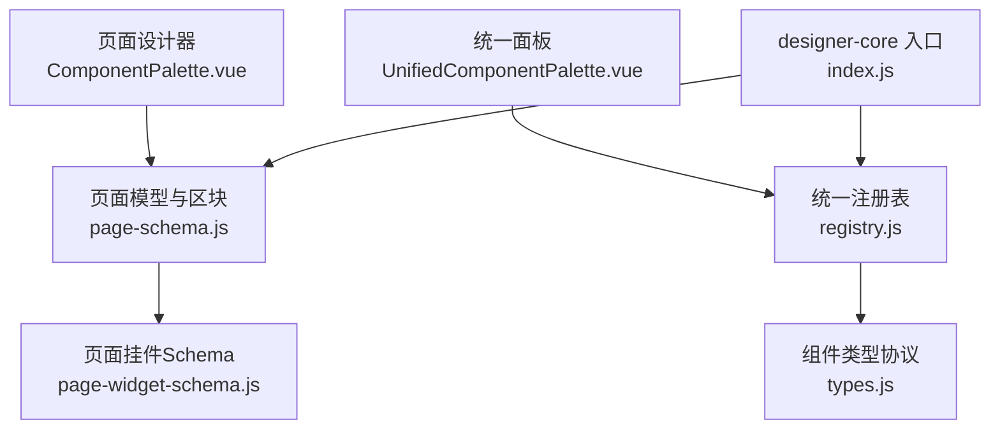
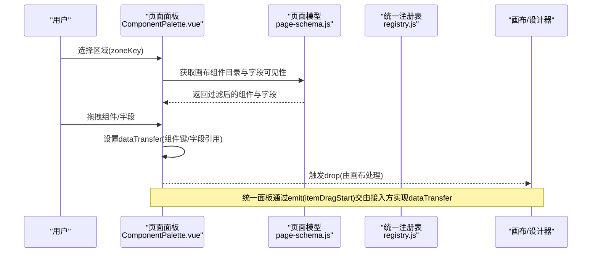
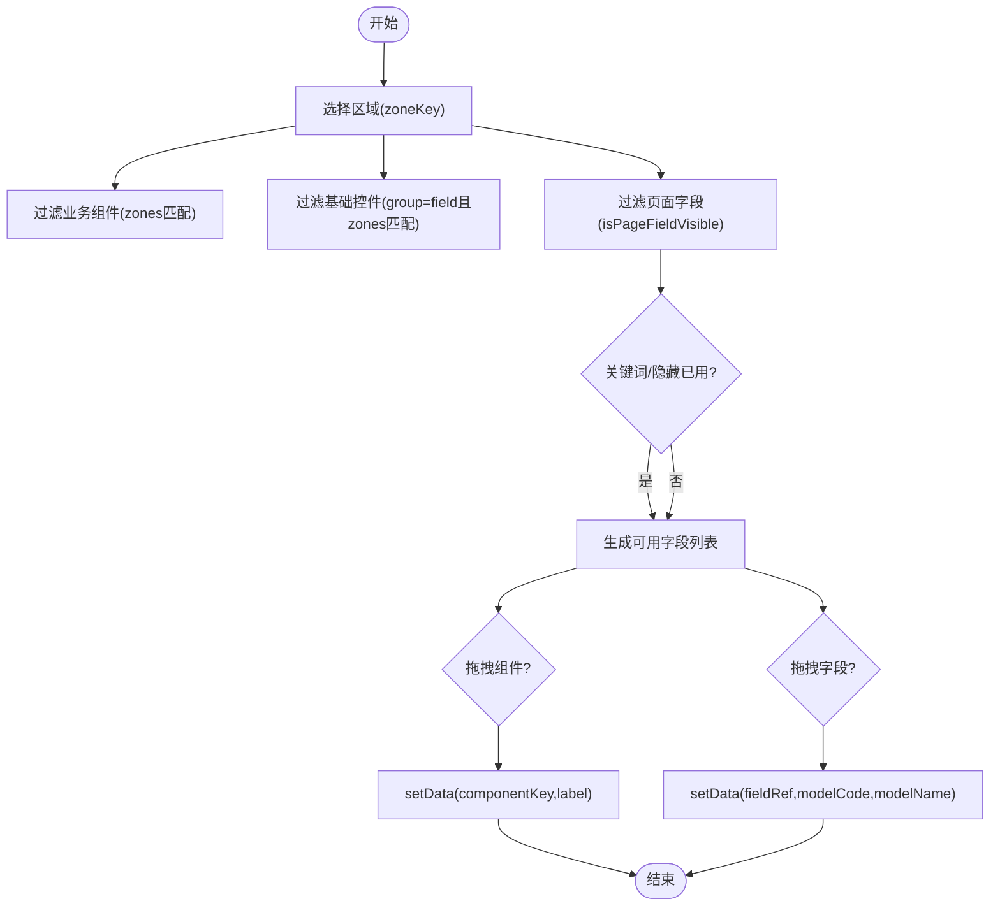
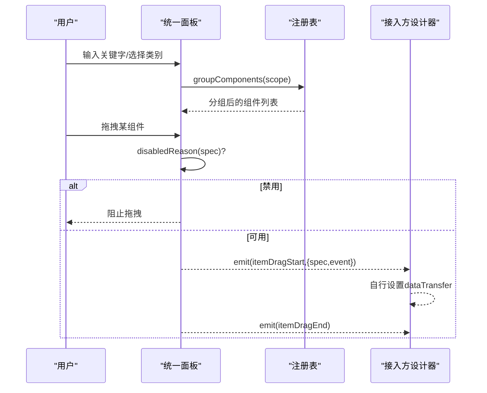
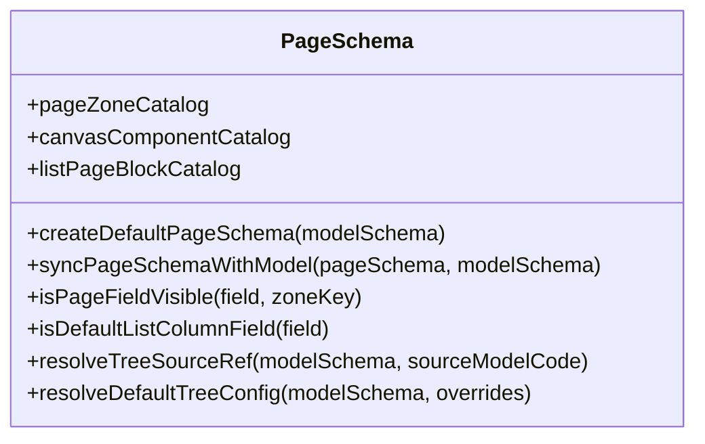
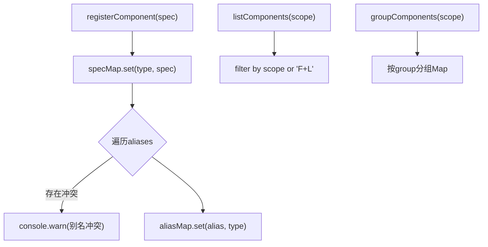
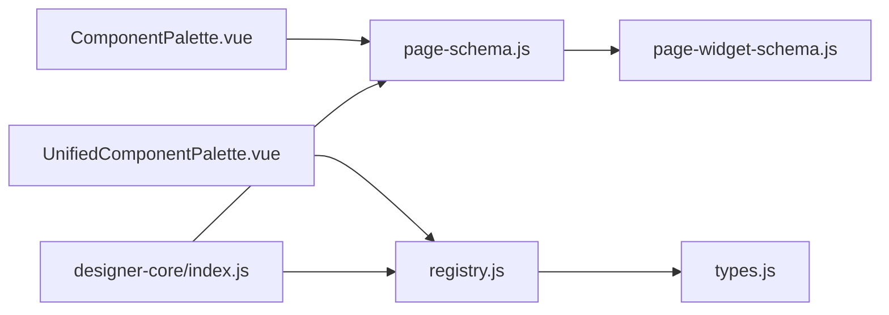

# 组件面板系统

<cite>
**本文引用的文件**
- [ComponentPalette.vue](file://forge-admin-ui/src/components/lowcode-builder/page/ComponentPalette.vue)
- [UnifiedComponentPalette.vue](file://forge-admin-ui/src/components/lowcode-builder/designer-core/panel/UnifiedComponentPalette.vue)
- [page-schema.js](file://forge-admin-ui/src/components/lowcode-builder/page/page-schema.js)
- [registry.js](file://forge-admin-ui/src/components/lowcode-builder/designer-core/spec/registry.js)
- [types.js](file://forge-admin-ui/src/components/lowcode-builder/designer-core/spec/types.js)
- [index.js](file://forge-admin-ui/src/components/lowcode-builder/designer-core/index.js)
- [page-widget-schema.js](file://forge-admin-ui/src/components/lowcode-builder/shared/page-widget-schema.js)
</cite>

## 目录
1. [简介](#简介)
2. [项目结构](#项目结构)
3. [核心组件](#核心组件)
4. [架构总览](#架构总览)
5. [详细组件分析](#详细组件分析)
6. [依赖关系分析](#依赖关系分析)
7. [性能考量](#性能考量)
8. [故障排查指南](#故障排查指南)
9. [结论](#结论)
10. [附录](#附录)

## 简介
本技术文档围绕低代码页面构建器的“组件面板系统”展开，重点解析以下方面：
- 组件面板实现：包括 ComponentPalette 与 UnifiedComponentPalette 的分类管理、拖拽源定义、元数据配置与动态加载机制。
- 页面模型设计：基于 page-schema 的区块结构、组件属性定义、数据绑定语法与事件配置。
- 组件注册与扩展：统一注册表、依赖管理与版本兼容策略。
- 自定义组件开发规范、组件库集成方法与性能优化建议。
- 面板扩展与主题定制的实现指南。

## 项目结构
该子系统位于前端工程 forge-admin-ui 的 lowcode-builder 模块中，主要包含：
- 页面级组件面板：ComponentPalette.vue（面向页面设计器）
- 统一组件面板：UnifiedComponentPalette.vue（表单/列表设计器共用）
- 页面模型与区块定义：page-schema.js
- 统一组件注册表与类型协议：designer-core/spec/*
- 页面挂件运行时 Schema：shared/page-widget-schema.js
- designer-core 聚合导出入口：designer-core/index.js

图表来源
- [ComponentPalette.vue:1-185](file://forge-admin-ui/src/components/lowcode-builder/page/ComponentPalette.vue#L1-L185)
- [UnifiedComponentPalette.vue:1-239](file://forge-admin-ui/src/components/lowcode-builder/designer-core/panel/UnifiedComponentPalette.vue#L1-L239)
- [page-schema.js:1-110](file://forge-admin-ui/src/components/lowcode-builder/page/page-schema.js#L1-L110)
- [registry.js:1-169](file://forge-admin-ui/src/components/lowcode-builder/designer-core/spec/registry.js#L1-L169)
- [types.js:1-120](file://forge-admin-ui/src/components/lowcode-builder/designer-core/spec/types.js#L1-L120)
- [page-widget-schema.js:1-369](file://forge-admin-ui/src/components/lowcode-builder/shared/page-widget-schema.js#L1-L369)
- [index.js:1-126](file://forge-admin-ui/src/components/lowcode-builder/designer-core/index.js#L1-L126)

章节来源
- [ComponentPalette.vue:1-185](file://forge-admin-ui/src/components/lowcode-builder/page/ComponentPalette.vue#L1-L185)
- [UnifiedComponentPalette.vue:1-239](file://forge-admin-ui/src/components/lowcode-builder/designer-core/panel/UnifiedComponentPalette.vue#L1-L239)
- [page-schema.js:1-110](file://forge-admin-ui/src/components/lowcode-builder/page/page-schema.js#L1-L110)
- [registry.js:1-169](file://forge-admin-ui/src/components/lowcode-builder/designer-core/spec/registry.js#L1-L169)
- [types.js:1-120](file://forge-admin-ui/src/components/lowcode-builder/designer-core/spec/types.js#L1-L120)
- [page-widget-schema.js:1-369](file://forge-admin-ui/src/components/lowcode-builder/shared/page-widget-schema.js#L1-L369)
- [index.js:1-126](file://forge-admin-ui/src/components/lowcode-builder/designer-core/index.js#L1-L126)

## 核心组件
- 页面组件面板 ComponentPalette.vue
  - 负责展示业务组件、基础控件与数据字段三类可拖拽项。
  - 通过 zoneKey 切换当前画布区域，过滤并渲染对应组件。
  - 使用浏览器原生 dragstart 将组件或字段信息写入 dataTransfer，供画布接收。
- 统一组件面板 UnifiedComponentPalette.vue
  - 为表单/列表设计器提供统一的物料面板，按分组与 scope 过滤显示。
  - 支持搜索、禁用原因提示、点击与拖拽事件派发，由接入方决定具体 dataTransfer 行为。
- 页面模型与区块 page-schema.js
  - 定义页面分区（search/table/edit/detail）、画布组件目录、默认页面 Schema、字段可见性规则、区块目录等。
  - 提供字段到组件映射、树形配置、栅格布局常量与工具函数。
- 统一组件注册表 registry.js
  - 维护组件规格（ComponentSpec）注册、别名解析、分组与统计能力。
- 类型协议 types.js
  - 定义 DataSourceConfig、PropsSchema、LayoutSpec、PrintSpec、ContainerSpec、ComponentSpec 等核心类型。
- 页面挂件 Schema page-widget-schema.js
  - 提供页面挂件默认属性、数据绑定创建、安全处理与模板插值等运行时能力。
- designer-core 入口 index.js
  - 聚合所有组件 spec 并自动注册，同时导出拖拽协议、容器规范、节点工厂与树操作等能力。

章节来源
- [ComponentPalette.vue:96-185](file://forge-admin-ui/src/components/lowcode-builder/page/ComponentPalette.vue#L96-L185)
- [UnifiedComponentPalette.vue:55-239](file://forge-admin-ui/src/components/lowcode-builder/designer-core/panel/UnifiedComponentPalette.vue#L55-L239)
- [page-schema.js:4-110](file://forge-admin-ui/src/components/lowcode-builder/page/page-schema.js#L4-L110)
- [registry.js:17-169](file://forge-admin-ui/src/components/lowcode-builder/designer-core/spec/registry.js#L17-L169)
- [types.js:9-120](file://forge-admin-ui/src/components/lowcode-builder/designer-core/spec/types.js#L9-L120)
- [page-widget-schema.js:20-369](file://forge-admin-ui/src/components/lowcode-builder/shared/page-widget-schema.js#L20-L369)
- [index.js:7-67](file://forge-admin-ui/src/components/lowcode-builder/designer-core/index.js#L7-L67)

## 架构总览
整体架构以“统一注册表 + 多面板消费”为核心：
- 统一注册表集中管理组件规格，提供分组、过滤、别名解析等能力。
- 页面面板与统一面板分别消费注册表与页面模型，生成可拖拽的物料清单。
- 页面模型驱动区块结构与字段可见性，确保不同区域（查询/列表/编辑/详情）的差异化展示。
- 页面挂件 Schema 提供运行时数据绑定与默认属性，支撑复杂展示型组件。

图表来源
- [ComponentPalette.vue:117-166](file://forge-admin-ui/src/components/lowcode-builder/page/ComponentPalette.vue#L117-L166)
- [page-schema.js:4-110](file://forge-admin-ui/src/components/lowcode-builder/page/page-schema.js#L4-L110)
- [UnifiedComponentPalette.vue:222-236](file://forge-admin-ui/src/components/lowcode-builder/designer-core/panel/UnifiedComponentPalette.vue#L222-L236)

## 详细组件分析

### 组件面板：ComponentPalette.vue
- 分类管理
  - 业务组件：来自 canvasComponentCatalog，按 zones 过滤。
  - 基础控件：group 为 field 的画布字段渲染器。
  - 数据字段：根据 pageFields 与可用字段集合计算，支持关键词搜索与隐藏已用字段。
- 拖拽源定义
  - 组件拖拽：写入 application/x-lowcode-component MIME，携带 componentKey 与 label。
  - 字段拖拽：写入相同 MIME，携带 fieldRef、modelCode、modelName 等信息，并通过 resolveDefaultFieldComponentKey 确定默认组件。
- 元数据与可见性
  - 使用 isPageFieldVisible 控制字段在不同区域的可见性。
  - 通过 resolveModelTag 与 isPrimaryModelField 标注主模型与关联模型。

图表来源
- [ComponentPalette.vue:117-166](file://forge-admin-ui/src/components/lowcode-builder/page/ComponentPalette.vue#L117-L166)
- [page-schema.js:95-110](file://forge-admin-ui/src/components/lowcode-builder/page/page-schema.js#L95-L110)

章节来源
- [ComponentPalette.vue:96-185](file://forge-admin-ui/src/components/lowcode-builder/page/ComponentPalette.vue#L96-L185)
- [page-schema.js:95-110](file://forge-admin-ui/src/components/lowcode-builder/page/page-schema.js#L95-L110)

### 统一组件面板：UnifiedComponentPalette.vue
- 分组与过滤
  - 通过 groupComponents(scope) 获取分组数据，按 categories 过滤，跳过包装节点。
  - 支持 keyword 搜索（label/desc/type/aliases），itemFilter 与 itemDisabledReason 由接入方注入。
- 交互与事件
  - 拖拽：handleDragStart 检查禁用原因后 emit('itemDragStart')，dragend 时 emit('itemDragEnd')。
  - 点击：handleClick 同样受禁用原因限制，emit('itemClick')。
- UI 与状态
  - 显示分组标题与数量，空态提示“没有匹配的组件”。
  - 暴露 total 用于外部统计。

图表来源
- [UnifiedComponentPalette.vue:185-239](file://forge-admin-ui/src/components/lowcode-builder/designer-core/panel/UnifiedComponentPalette.vue#L185-L239)
- [registry.js:114-125](file://forge-admin-ui/src/components/lowcode-builder/designer-core/spec/registry.js#L114-L125)

章节来源
- [UnifiedComponentPalette.vue:55-239](file://forge-admin-ui/src/components/lowcode-builder/designer-core/panel/UnifiedComponentPalette.vue#L55-L239)
- [registry.js:114-125](file://forge-admin-ui/src/components/lowcode-builder/designer-core/spec/registry.js#L114-L125)

### 页面模型与区块：page-schema.js
- 页面分区与画布组件
  - pageZoneCatalog 定义 search/table/edit/detail 四个分区及其默认组件 key。
  - canvasComponentCatalog 合并统一组件目录与页面专用字段组件，限定 zones。
- 字段可见性与默认列
  - isPageFieldVisible 依据字段状态、系统字段与区域特性控制可见性。
  - isDefaultListColumnField 排除审计类系统字段作为列表默认列。
- 默认页面 Schema 与同步
  - createDefaultPageSchema 根据模型类型生成 layoutType、zones、props 与 grid 布局。
  - syncPageSchemaWithModel 将现有 schema 与模型字段对齐，处理 childEditRefs、formCreateRule 与网格布局。
- 区块目录与元数据
  - listPageBlockCatalog 定义列表页区块（查询表单、工具栏、表格、卡片、标签等）及元数据（multiField/requireFields/unique/onlyFor）。
  - resolveTreeSourceRef/resolveDefaultTreeConfig 提供树形配置的默认推导。

图表来源
- [page-schema.js:4-110](file://forge-admin-ui/src/components/lowcode-builder/page/page-schema.js#L4-L110)
- [page-schema.js:153-315](file://forge-admin-ui/src/components/lowcode-builder/page/page-schema.js#L153-L315)
- [page-schema.js:398-740](file://forge-admin-ui/src/components/lowcode-builder/page/page-schema.js#L398-L740)
- [page-schema.js:746-793](file://forge-admin-ui/src/components/lowcode-builder/page/page-schema.js#L746-L793)

章节来源
- [page-schema.js:4-110](file://forge-admin-ui/src/components/lowcode-builder/page/page-schema.js#L4-L110)
- [page-schema.js:153-315](file://forge-admin-ui/src/components/lowcode-builder/page/page-schema.js#L153-L315)
- [page-schema.js:398-740](file://forge-admin-ui/src/components/lowcode-builder/page/page-schema.js#L398-L740)
- [page-schema.js:746-793](file://forge-admin-ui/src/components/lowcode-builder/page/page-schema.js#L746-L793)

### 统一组件注册表：registry.js
- 注册与别名
  - registerComponent/registerComponents 支持单条与批量注册，重复 type 会覆盖并告警。
  - aliasMap 维护别名到真实 type 的映射，getComponentType 可解析别名。
- 查询与分组
  - listComponents/listComponentsByCategory/groupComponents 支持 scope 与 category 过滤。
  - getRegistryStats 提供总数、按分类/作用域计数与别名数量。
- 测试清理
  - clearRegistry 清空注册表，便于单元测试隔离。

图表来源
- [registry.js:17-66](file://forge-admin-ui/src/components/lowcode-builder/designer-core/spec/registry.js#L17-L66)
- [registry.js:81-125](file://forge-admin-ui/src/components/lowcode-builder/designer-core/spec/registry.js#L81-L125)
- [registry.js:147-169](file://forge-admin-ui/src/components/lowcode-builder/designer-core/spec/registry.js#L147-L169)

章节来源
- [registry.js:17-169](file://forge-admin-ui/src/components/lowcode-builder/designer-core/spec/registry.js#L17-L169)

### 类型协议：types.js
- 数据源配置 DataSourceConfig：支持 static/dict/managed/remote/context/relation/builtin 等类型。
- 属性 Schema PropsSchema：properties 与 required 定义属性编辑器与校验。
- 布局 LayoutSpec：defaultSpan/minSpan/maxSpan 控制栅格宽度。
- 打印 PrintSpec：hidden/breakAvoid 控制打印行为。
- 容器 ContainerSpec：container/maxDepth/accept 定义容器能力。
- 组件规格 ComponentSpec：type/aliases/scope/category/group/label/desc/layout/container/propsSchema/dataSources/print/fieldDefaults/meta 等。

章节来源
- [types.js:9-120](file://forge-admin-ui/src/components/lowcode-builder/designer-core/spec/types.js#L9-L120)

### 页面挂件 Schema：page-widget-schema.js
- 默认属性：createPageWidgetDefaultProps 针对 rich-text/transfer/watermark/vue-component/html-tag/markdown/barcode/qrcode/calendar/code/countdown/descriptions/announcement/list/log/number-animation/breadcrumb/menu/pagination/split 等提供默认 props。
- 数据绑定：createWidgetDataBinding 生成标准绑定结构，支持多种字段映射（label/value/title/content/total 等）。
- 组件创建：createPageWidgetComponent 生成 id/componentKey/props/fieldBinding/layout/visibility/children 的标准节点。
- 安全与插值：safeHtml 过滤危险脚本；interpolateTemplate 支持 {{path}} 插值。

章节来源
- [page-widget-schema.js:20-369](file://forge-admin-ui/src/components/lowcode-builder/shared/page-widget-schema.js#L20-L369)

### designer-core 入口：index.js
- 自动注册：首次 import 时导入并注册全部统一组件 spec（含 transfer 双重身份合并）。
- 能力导出：拖拽协议、桥接层、容器插槽规范、节点工厂、树操作、注册表 API 等。

章节来源
- [index.js:7-67](file://forge-admin-ui/src/components/lowcode-builder/designer-core/index.js#L7-L67)
- [index.js:76-126](file://forge-admin-ui/src/components/lowcode-builder/designer-core/index.js#L76-L126)

## 依赖关系分析
- 组件面板依赖
  - ComponentPalette.vue 依赖 page-schema.js 的 catalog 与可见性函数。
  - UnifiedComponentPalette.vue 依赖 registry.js 的分组与过滤能力。
- 页面模型依赖
  - page-schema.js 依赖 designer-core 的桥接层（toCanvasComponentCatalog/toPageWidgetCatalog）与 shared/page-widget-schema.js。
- 注册表与类型
  - registry.js 依赖 types.js 的 ComponentSpec 协议。
  - index.js 聚合各分类 spec 并调用 registerComponents 完成全局注册。

图表来源
- [ComponentPalette.vue:96-118](file://forge-admin-ui/src/components/lowcode-builder/page/ComponentPalette.vue#L96-L118)
- [UnifiedComponentPalette.vue:52-54](file://forge-admin-ui/src/components/lowcode-builder/designer-core/panel/UnifiedComponentPalette.vue#L52-L54)
- [page-schema.js:1-3](file://forge-admin-ui/src/components/lowcode-builder/page/page-schema.js#L1-L3)
- [registry.js:17-31](file://forge-admin-ui/src/components/lowcode-builder/designer-core/spec/registry.js#L17-L31)
- [index.js:7-67](file://forge-admin-ui/src/components/lowcode-builder/designer-core/index.js#L7-L67)

章节来源
- [ComponentPalette.vue:96-118](file://forge-admin-ui/src/components/lowcode-builder/page/ComponentPalette.vue#L96-L118)
- [UnifiedComponentPalette.vue:52-54](file://forge-admin-ui/src/components/lowcode-builder/designer-core/panel/UnifiedComponentPalette.vue#L52-L54)
- [page-schema.js:1-3](file://forge-admin-ui/src/components/lowcode-builder/page/page-schema.js#L1-L3)
- [registry.js:17-31](file://forge-admin-ui/src/components/lowcode-builder/designer-core/spec/registry.js#L17-L31)
- [index.js:7-67](file://forge-admin-ui/src/components/lowcode-builder/designer-core/index.js#L7-L67)

## 性能考量
- 面板渲染优化
  - 使用 computed 缓存过滤结果（businessComponents/baseControls/availableFields），避免重复计算。
  - 统一面板通过 groupComponents 一次性分组，减少多次遍历。
- 拖拽与交互
  - 仅在 dragstart 时写入 dataTransfer，降低频繁事件开销。
  - 禁用项直接阻止拖拽，减少无效交互。
- 页面模型同步
  - syncPageSchemaWithModel 对 zones 进行增量归一化，避免全量重建。
  - 列表默认列过滤减少初始列数，提升渲染性能。
- 数据绑定与渲染
  - 页面挂件默认 props 预置 dataBinding，减少运行时初始化成本。
  - safeHtml 与 interpolateTemplate 在必要时执行，避免不必要的字符串处理。

[本节为通用性能建议，不直接分析具体文件]

## 故障排查指南
- 组件未显示
  - 检查 scope 与 category 过滤是否正确（UnifiedComponentPalette.vue）。
  - 确认组件已在 registry.js 中注册且无别名冲突。
- 字段不可见
  - 查看 isPageFieldVisible 逻辑，确认字段状态与区域限制。
  - 检查 hiddenPageFieldNames/readonlySystemFieldNames 是否命中。
- 拖拽无效
  - 确认 dragstart 设置了正确的 MIME 与数据（ComponentPalette.vue）。
  - 统一面板需确保 itemDisabledReason 返回空串，否则阻止拖拽。
- 页面 Schema 不一致
  - 使用 syncPageSchemaWithModel 重新对齐 zones 与字段。
  - 检查 formCreateRule 与 canvas 字段引用优先级。

章节来源
- [UnifiedComponentPalette.vue:218-236](file://forge-admin-ui/src/components/lowcode-builder/designer-core/panel/UnifiedComponentPalette.vue#L218-L236)
- [ComponentPalette.vue:149-166](file://forge-admin-ui/src/components/lowcode-builder/page/ComponentPalette.vue#L149-L166)
- [page-schema.js:74-110](file://forge-admin-ui/src/components/lowcode-builder/page/page-schema.js#L74-L110)
- [page-schema.js:212-315](file://forge-admin-ui/src/components/lowcode-builder/page/page-schema.js#L212-L315)

## 结论
本组件面板系统通过统一注册表与页面模型的双轮驱动，实现了跨设计器的组件复用与差异化展示。ComponentPalette 与 UnifiedComponentPalette 分别满足页面与表单/列表场景的需求；page-schema 提供了强大的区块与字段管理能力；registry 与 types 确保了组件协议的标准化与可扩展性。结合页面挂件 Schema 的运行时能力，系统具备良好的扩展性与可维护性。

[本节为总结性内容，不直接分析具体文件]

## 附录

### 自定义组件开发规范
- 组件规格
  - 遵循 ComponentSpec 协议，明确 type/aliases/scope/category/group/label/desc 等字段。
  - 如需容器能力，设置 container/maxDepth/accept。
- 数据源与属性
  - 声明 dataSources 与 propsSchema，提供默认值与必填项。
- 注册与别名
  - 使用 registerComponent/registerComponents 注册，必要时提供 aliases 兼容旧标识。
- 页面挂件
  - 为展示型组件提供 createPageWidgetDefaultProps 与 createWidgetDataBinding，确保默认属性与数据绑定。

章节来源
- [types.js:9-120](file://forge-admin-ui/src/components/lowcode-builder/designer-core/spec/types.js#L9-L120)
- [registry.js:17-66](file://forge-admin-ui/src/components/lowcode-builder/designer-core/spec/registry.js#L17-L66)
- [page-widget-schema.js:20-369](file://forge-admin-ui/src/components/lowcode-builder/shared/page-widget-schema.js#L20-L369)

### 组件库集成方法
- 引入 designer-core/index.js 以自动注册全部统一组件。
- 在应用启动时按需调用 registerComponents 追加自定义组件。
- 通过 toCanvasComponentCatalog/toPageWidgetCatalog 桥接至页面模型与面板。

章节来源
- [index.js:7-67](file://forge-admin-ui/src/components/lowcode-builder/designer-core/index.js#L7-L67)
- [page-schema.js:1-3](file://forge-admin-ui/src/components/lowcode-builder/page/page-schema.js#L1-L3)

### 性能优化建议
- 使用 computed 缓存过滤结果，避免重复计算。
- 合理设置 scope/category，减少不必要组件渲染。
- 列表默认列过滤与栅格布局优化，降低初始渲染压力。
- 数据绑定与模板插值按需执行，避免过度字符串处理。

[本节为通用优化建议，不直接分析具体文件]

### 面板扩展与主题定制
- 面板扩展
  - 通过 itemFilter/itemDisabledReason 在 UnifiedComponentPalette.vue 中注入过滤与禁用逻辑。
  - 在 page-schema.js 中扩展 canvasComponentCatalog 与 listPageBlockCatalog，新增区块与字段组件。
- 主题定制
  - 使用 CSS 变量（如 --n-primary-color/--n-border-color）统一样式。
  - 调整分组顺序 GROUP_ORDER 与样式类名，保持视觉一致性。

章节来源
- [UnifiedComponentPalette.vue:55-86](file://forge-admin-ui/src/components/lowcode-builder/designer-core/panel/UnifiedComponentPalette.vue#L55-L86)
- [page-schema.js:31-49](file://forge-admin-ui/src/components/lowcode-builder/page/page-schema.js#L31-L49)
- [page-schema.js:398-740](file://forge-admin-ui/src/components/lowcode-builder/page/page-schema.js#L398-L740)