# 页面构建器

<cite>
**本文引用的文件**
- [LowcodePageBuilder.vue](file://forge-admin-ui/src/components/lowcode-builder/page/LowcodePageBuilder.vue)
- [page-schema.js](file://forge-admin-ui/src/components/lowcode-builder/page/page-schema.js)
- [BuilderCanvas.vue](file://forge-admin-ui/src/components/lowcode-builder/page/BuilderCanvas.vue)
- [ComponentPalette.vue](file://forge-admin-ui/src/components/lowcode-builder/page/ComponentPalette.vue)
- [CanvasFormDesigner.vue](file://forge-admin-ui/src/components/lowcode-builder/page/CanvasFormDesigner.vue)
- [ListPageGridDesigner.vue](file://forge-admin-ui/src/components/lowcode-builder/page/ListPageGridDesigner.vue)
- [CrudHookRulesEditor.vue](file://forge-admin-ui/src/components/lowcode-builder/page/CrudHookRulesEditor.vue)
- [crud-hook-rules.js](file://forge-admin-ui/src/components/lowcode-builder/page/crud-hook-rules.js)
- [BusinessListDesigner.vue](file://forge-admin-ui/src/views/app-center/components/designer/BusinessListDesigner.vue)
- [application-runtime.[applicationCode].vue](file://forge-admin-ui/src/views/app-center/application-runtime.[applicationCode].vue)
- [PageWidgetRenderer.vue](file://forge-admin-ui/src/components/lowcode-builder/shared/PageWidgetRenderer.vue)
</cite>

## 目录
1. [简介](#简介)
2. [项目结构](#项目结构)
3. [核心组件](#核心组件)
4. [架构总览](#架构总览)
5. [详细组件分析](#详细组件分析)
6. [依赖关系分析](#依赖关系分析)
7. [性能考量](#性能考量)
8. [故障排查指南](#故障排查指南)
9. [结论](#结论)
10. [附录](#附录)

## 简介
本技术文档面向低代码页面构建器，围绕 LowcodePageBuilder 主组件展开，系统解析画布渲染引擎、区块管理系统、表单设计器与列表页面设计器的实现机制。重点说明 page-schema 页面模型定义、BuilderCanvas 画布组件的拖拽与区域管理、ComponentPalette 组件面板的交互逻辑；并阐述页面结构设计、数据绑定机制、事件处理系统与响应式布局实现。同时提供 CRUD 配置编辑器、钩子规则编辑器与结构化列表设计器的使用方法、最佳实践与性能优化建议。

## 项目结构
页面构建器位于前端工程 forge-admin-ui 的 lowcode-builder 模块中，采用“页面模型 + 画布 + 属性面板”的分层组织方式：
- 页面模型与规范：page-schema.js 集中定义页面区域、区块目录、字段可见性、默认 schema 生成与同步策略。
- 画布与区域：BuilderCanvas.vue 负责区域（zone）的拖拽排序与新增启用；CanvasFormDesigner.vue 负责编辑区画布的可视化绘制与选中态。
- 组件面板：ComponentPalette.vue 提供业务组件与字段拖拽入口，支持按区域过滤与搜索。
- 列表设计器：ListPageGridDesigner.vue 提供栅格化区块编排能力，并与 page-schema 中的 gridLayout 双向同步。
- 运行时与预览：BusinessListDesigner.vue 与 application-runtime.[applicationCode].vue 将设计期 schema 转换为运行期渲染上下文。
- 数据绑定：PageWidgetRenderer.vue 提供统一的数据绑定解析与取值逻辑。

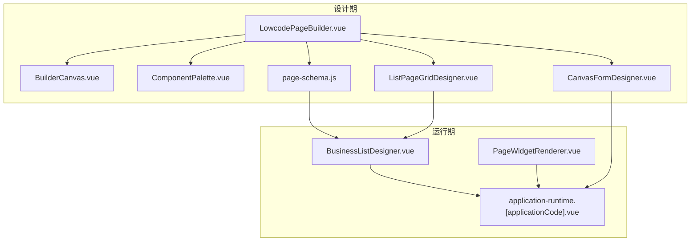

图表来源
- [LowcodePageBuilder.vue:1-247](file://forge-admin-ui/src/components/lowcode-builder/page/LowcodePageBuilder.vue#L1-L247)
- [page-schema.js:1-800](file://forge-admin-ui/src/components/lowcode-builder/page/page-schema.js#L1-L800)
- [BuilderCanvas.vue:1-152](file://forge-admin-ui/src/components/lowcode-builder/page/BuilderCanvas.vue#L1-L152)
- [ComponentPalette.vue:1-390](file://forge-admin-ui/src/components/lowcode-builder/page/ComponentPalette.vue#L1-L390)
- [CanvasFormDesigner.vue:265-304](file://forge-admin-ui/src/components/lowcode-builder/page/CanvasFormDesigner.vue#L265-L304)
- [ListPageGridDesigner.vue:8324-8372](file://forge-admin-ui/src/components/lowcode-builder/page/ListPageGridDesigner.vue#L8324-L8372)
- [BusinessListDesigner.vue:457-710](file://forge-admin-ui/src/views/app-center/components/designer/BusinessListDesigner.vue#L457-L710)
- [application-runtime.[applicationCode].vue:2507-3051](file://forge-admin-ui/src/views/app-center/application-runtime.[applicationCode].vue#L2507-L3051)
- [PageWidgetRenderer.vue:718-745](file://forge-admin-ui/src/components/lowcode-builder/shared/PageWidgetRenderer.vue#L718-L745)

章节来源
- [LowcodePageBuilder.vue:1-247](file://forge-admin-ui/src/components/lowcode-builder/page/LowcodePageBuilder.vue#L1-L247)
- [page-schema.js:1-800](file://forge-admin-ui/src/components/lowcode-builder/page/page-schema.js#L1-L800)

## 核心组件
- LowcodePageBuilder.vue：页面构建器外壳，组合列表页与表单/详情页两种模式，维护本地 schema 与 modelSchema 的双向同步，协调布局类型切换与网格布局更新。
- BuilderCanvas.vue：区域级画布，支持 zone 拖拽排序、从调色板拖入新增区域、区域启用与属性更新。
- ComponentPalette.vue：组件与字段调色板，按当前选区过滤可拖拽项，支持关键字搜索与已用字段隐藏。
- CanvasFormDesigner.vue：基于图形 API 的表单/详情画布渲染，区分按钮、查询集、表格、详情与通用字段的预览绘制。
- ListPageGridDesigner.vue：结构化列表设计器，提供栅格区块的增删改查、重排、重置与清空等能力，并与 page-schema 的 gridLayout 保持一致。
- CrudHookRulesEditor.vue 与 crud-hook-rules.js：CRUD 回调参数处理规则编辑器与归一化/应用逻辑，覆盖加载前、提交前等多阶段。
- BusinessListDesigner.vue / application-runtime.[applicationCode].vue：将设计期 schema 转为运行期上下文，解析区块字段目录、表单资产与运行时数据源。
- PageWidgetRenderer.vue：统一的数据绑定解析，支持静态、上下文与远程数据源，以及嵌套路径取值与字段映射。

章节来源
- [LowcodePageBuilder.vue:60-213](file://forge-admin-ui/src/components/lowcode-builder/page/LowcodePageBuilder.vue#L60-L213)
- [BuilderCanvas.vue:38-109](file://forge-admin-ui/src/components/lowcode-builder/page/BuilderCanvas.vue#L38-L109)
- [ComponentPalette.vue:96-185](file://forge-admin-ui/src/components/lowcode-builder/page/ComponentPalette.vue#L96-L185)
- [CanvasFormDesigner.vue:265-304](file://forge-admin-ui/src/components/lowcode-builder/page/CanvasFormDesigner.vue#L265-L304)
- [ListPageGridDesigner.vue:8324-8372](file://forge-admin-ui/src/components/lowcode-builder/page/ListPageGridDesigner.vue#L8324-L8372)
- [CrudHookRulesEditor.vue:71-145](file://forge-admin-ui/src/components/lowcode-builder/page/CrudHookRulesEditor.vue#L71-L145)
- [crud-hook-rules.js:28-83](file://forge-admin-ui/src/components/lowcode-builder/page/crud-hook-rules.js#L28-L83)
- [BusinessListDesigner.vue:457-710](file://forge-admin-ui/src/views/app-center/components/designer/BusinessListDesigner.vue#L457-L710)
- [application-runtime.[applicationCode].vue:2507-3051](file://forge-admin-ui/src/views/app-center/application-runtime.[applicationCode].vue#L2507-L3051)
- [PageWidgetRenderer.vue:718-745](file://forge-admin-ui/src/components/lowcode-builder/shared/PageWidgetRenderer.vue#L718-L745)

## 架构总览
页面构建器以“schema 驱动”为核心：设计期通过 LowcodePageBuilder 维护 localSchema，借助 page-schema 提供的工具函数在 modelSchema 变化时自动同步；列表模式使用栅格布局（gridLayout），表单/详情模式使用 zone 画布（canvas）。运行期由 BusinessListDesigner 与 application-runtime 将 schema 解析为运行时上下文，PageWidgetRenderer 负责数据绑定与取值。

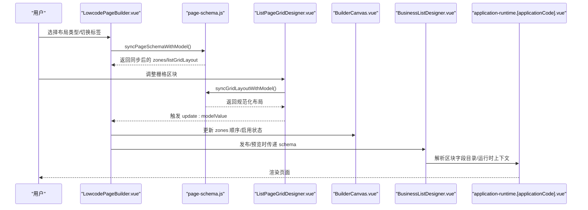

图表来源
- [LowcodePageBuilder.vue:137-213](file://forge-admin-ui/src/components/lowcode-builder/page/LowcodePageBuilder.vue#L137-L213)
- [page-schema.js:212-315](file://forge-admin-ui/src/components/lowcode-builder/page/page-schema.js#L212-L315)
- [ListPageGridDesigner.vue:8324-8372](file://forge-admin-ui/src/components/lowcode-builder/page/ListPageGridDesigner.vue#L8324-L8372)
- [BuilderCanvas.vue:61-91](file://forge-admin-ui/src/components/lowcode-builder/page/BuilderCanvas.vue#L61-L91)
- [BusinessListDesigner.vue:655-710](file://forge-admin-ui/src/views/app-center/components/designer/BusinessListDesigner.vue#L655-L710)
- [application-runtime.[applicationCode].vue:2933-3051](file://forge-admin-ui/src/views/app-center/application-runtime.[applicationCode].vue#L2933-L3051)

## 详细组件分析

### LowcodePageBuilder 主组件
- 职责：组合列表与表单/详情两种构建视图；维护 localSchema 与外部 modelValue/modelSchema 的双向同步；根据 layoutType 切换布局模板并同步 zones 与 gridLayout。
- 关键流程：
  - 监听 props 变化，调用 resolvePageBuilderSchema 进行 schema 同步。
  - 监听 layoutType 变化，调用 syncGridLayoutWithModel 与 applyGridLayoutToZones 更新 zones。
  - 表单区通过 ComponentPalette + CanvasFormDesigner + ComponentPropertyPanel 完成字段拖拽与属性编辑。
  - 列表区通过 ListPageGridDesigner 完成栅格区块编排，并通过 handleGridLayoutUpdate 回写 schema。

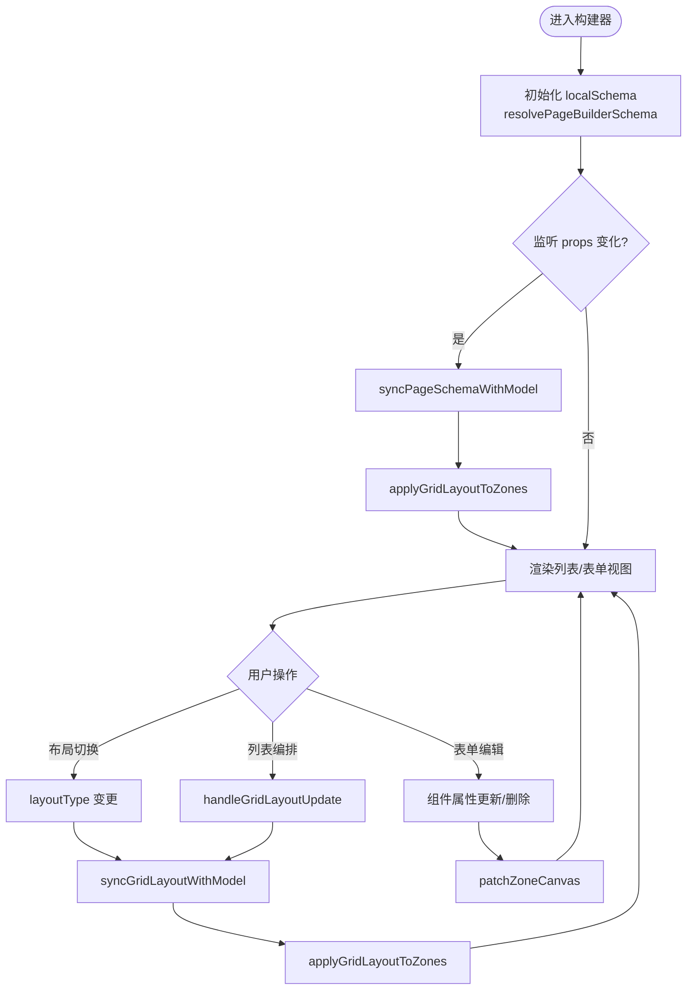

图表来源
- [LowcodePageBuilder.vue:88-163](file://forge-admin-ui/src/components/lowcode-builder/page/LowcodePageBuilder.vue#L88-L163)
- [LowcodePageBuilder.vue:165-213](file://forge-admin-ui/src/components/lowcode-builder/page/LowcodePageBuilder.vue#L165-L213)
- [page-schema.js:212-315](file://forge-admin-ui/src/components/lowcode-builder/page/page-schema.js#L212-L315)

章节来源
- [LowcodePageBuilder.vue:60-213](file://forge-admin-ui/src/components/lowcode-builder/page/LowcodePageBuilder.vue#L60-L213)

### page-schema 页面模型与规范
- 区域目录：search/table/edit/detail 四类区域，分别对应查询、列表、表单/详情与详情兼容区。
- 画布组件目录：包含业务组件与字段组件，限定可用区域与默认尺寸。
- 字段可见性：isHiddenPageField/isInactivePageField/isReadonlySystemField/isPageFieldVisible 控制不同区域的显示策略。
- 默认 Schema：createDefaultPageSchema 根据 appType 生成 simple/tree/master-detail 三种布局，并初始化 zones 与 listGridLayout。
- 同步策略：syncPageSchemaWithModel 将 modelSchema 的变化映射到 zones.fieldRefs、props.canvas 与 listGridLayout，保证设计期与模型一致。
- 列表区块目录：listPageBlockCatalog 定义查询表单、工具栏、表格、树面板、统计卡片等区块元信息。

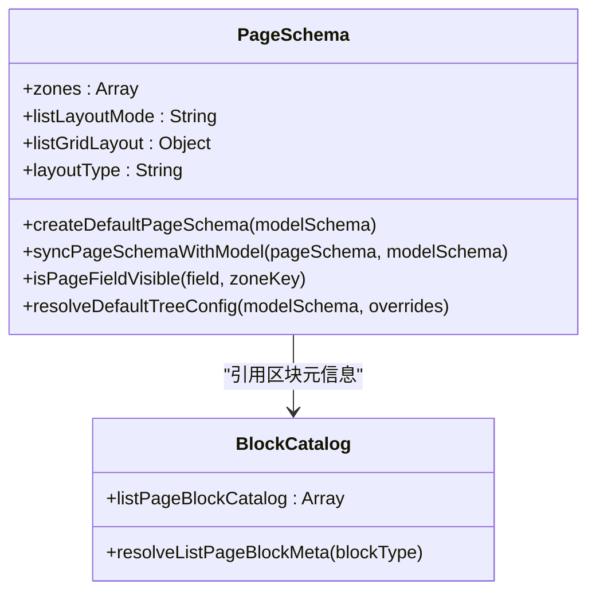

图表来源
- [page-schema.js:4-49](file://forge-admin-ui/src/components/lowcode-builder/page/page-schema.js#L4-L49)
- [page-schema.js:153-210](file://forge-admin-ui/src/components/lowcode-builder/page/page-schema.js#L153-L210)
- [page-schema.js:212-315](file://forge-admin-ui/src/components/lowcode-builder/page/page-schema.js#L212-L315)
- [page-schema.js:398-740](file://forge-admin-ui/src/components/lowcode-builder/page/page-schema.js#L398-L740)

章节来源
- [page-schema.js:4-49](file://forge-admin-ui/src/components/lowcode-builder/page/page-schema.js#L4-L49)
- [page-schema.js:153-210](file://forge-admin-ui/src/components/lowcode-builder/page/page-schema.js#L153-L210)
- [page-schema.js:212-315](file://forge-admin-ui/src/components/lowcode-builder/page/page-schema.js#L212-L315)
- [page-schema.js:398-740](file://forge-admin-ui/src/components/lowcode-builder/page/page-schema.js#L398-L740)

### BuilderCanvas 画布组件
- 功能：展示 zones 列表，支持拖拽排序；从调色板拖入新增 zone 或启用已有 zone；更新单个 zone 的属性。
- 交互：dragover/drop 读取 dataTransfer 中的 zoneKey，normalizeZones 去重并补齐 componentKey/fieldRefs/props。
- 输出：通过 emit('update:schema', ...) 将新的 zones 上抛给父组件。

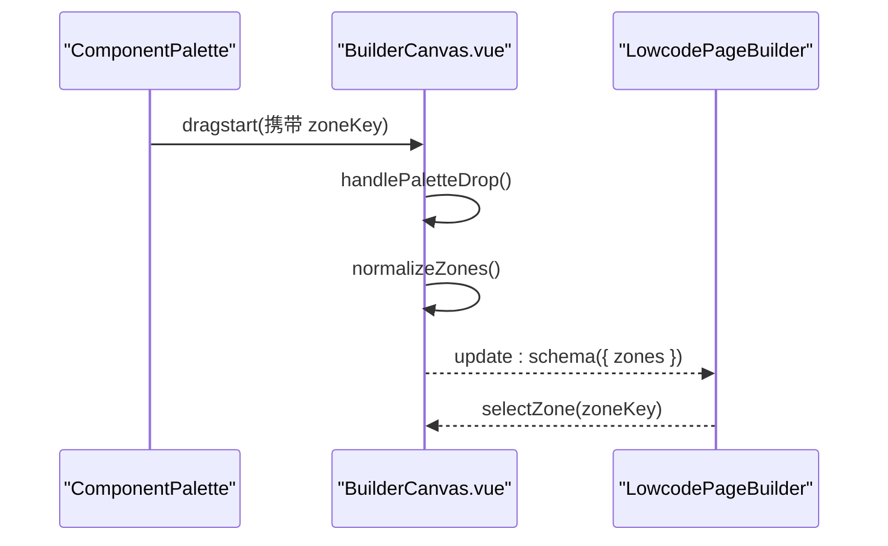

图表来源
- [BuilderCanvas.vue:61-91](file://forge-admin-ui/src/components/lowcode-builder/page/BuilderCanvas.vue#L61-L91)
- [BuilderCanvas.vue:93-109](file://forge-admin-ui/src/components/lowcode-builder/page/BuilderCanvas.vue#L93-L109)

章节来源
- [BuilderCanvas.vue:38-109](file://forge-admin-ui/src/components/lowcode-builder/page/BuilderCanvas.vue#L38-L109)

### ComponentPalette 组件面板
- 功能：按 selectedZoneKey 过滤业务组件与基础控件；展示字段列表，支持关键字搜索与隐藏已用字段；拖拽字段时携带 fieldRef、modelCode、modelName 等信息。
- 交互：dragstart 设置 dataTransfer 的组件 payload；点击区域标签切换目标区域。
- 输出：emit('select', zoneKey) 通知父组件切换区域。

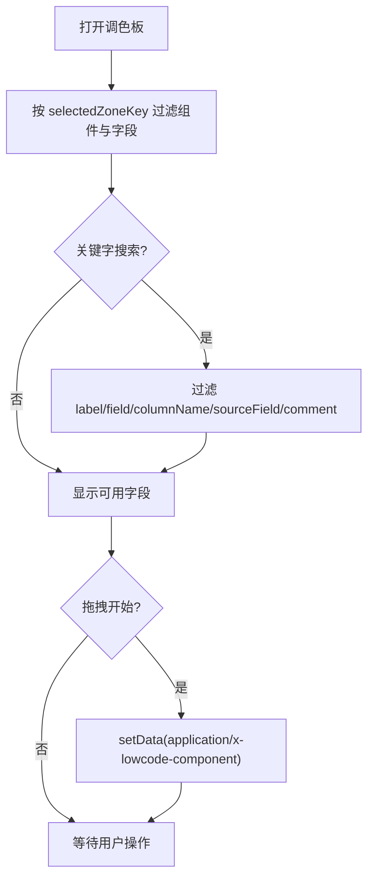

图表来源
- [ComponentPalette.vue:117-185](file://forge-admin-ui/src/components/lowcode-builder/page/ComponentPalette.vue#L117-L185)

章节来源
- [ComponentPalette.vue:96-185](file://forge-admin-ui/src/components/lowcode-builder/page/ComponentPalette.vue#L96-L185)

### CanvasFormDesigner 画布渲染
- 功能：基于图形 API 绘制表单/详情区内的组件预览，区分按钮、查询集、表格、详情与通用字段；选中态高亮边框与背景。
- 流程：drawCanvasItem 根据 item.componentKey 选择对应绘制函数；w/h 来自 item 的样式或默认值。

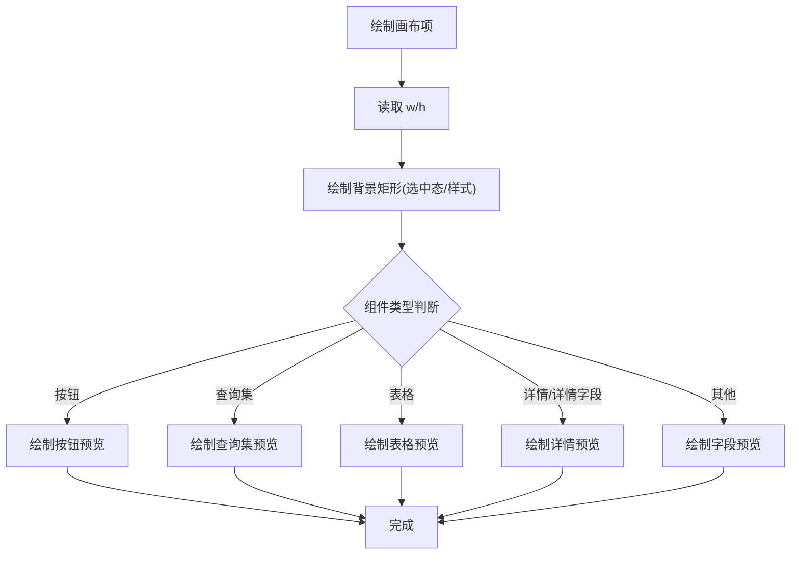

图表来源
- [CanvasFormDesigner.vue:265-304](file://forge-admin-ui/src/components/lowcode-builder/page/CanvasFormDesigner.vue#L265-L304)

章节来源
- [CanvasFormDesigner.vue:265-304](file://forge-admin-ui/src/components/lowcode-builder/page/CanvasFormDesigner.vue#L265-L304)

### 结构化列表设计器（ListPageGridDesigner）
- 功能：栅格化区块编排，支持区块重排、重置布局、清空画布；与 page-schema 的 gridLayout 双向同步。
- 关键点：normalizeDesignerLayout 标准化 designWidth/items；resetLayout/clearCanvas 提供快速恢复能力。

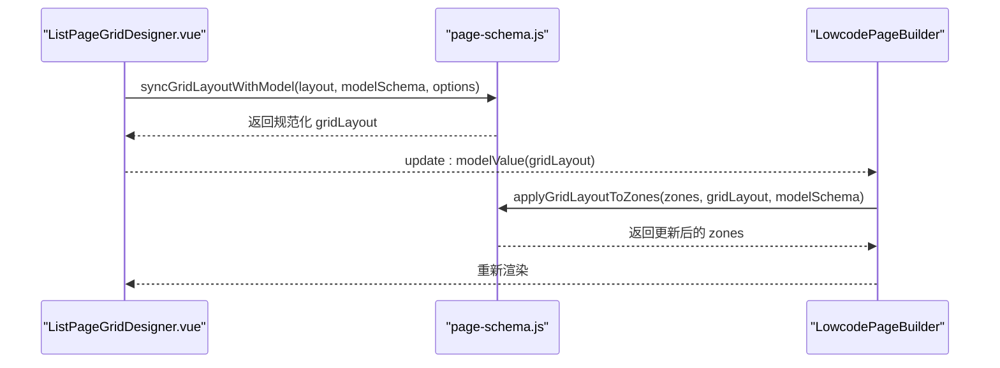

图表来源
- [ListPageGridDesigner.vue:8324-8372](file://forge-admin-ui/src/components/lowcode-builder/page/ListPageGridDesigner.vue#L8324-L8372)
- [page-schema.js:212-315](file://forge-admin-ui/src/components/lowcode-builder/page/page-schema.js#L212-L315)

章节来源
- [ListPageGridDesigner.vue:8324-8372](file://forge-admin-ui/src/components/lowcode-builder/page/ListPageGridDesigner.vue#L8324-L8372)

### CRUD 配置编辑器与钩子规则编辑器
- 编辑器：CrudHookRulesEditor.vue 提供多阶段（加载前、搜索前、打开表单前、打开详情前、提交前、构建提交数据后）的参数处理规则编辑界面。
- 规则归一化：crud-hook-rules.js 的 normalizeCrudHookRules 将旧 beforeSubmitRules 迁移至新结构，保留空行以便编辑体验。
- 规则执行：applyCrudHookRules 支持 set/copyFrom/append/clear 四种动作，仅对已填写目标字段的规则生效。

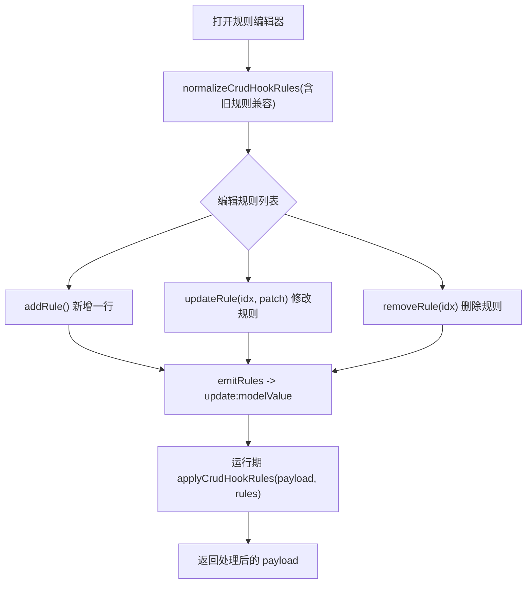

图表来源
- [CrudHookRulesEditor.vue:108-145](file://forge-admin-ui/src/components/lowcode-builder/page/CrudHookRulesEditor.vue#L108-L145)
- [crud-hook-rules.js:28-83](file://forge-admin-ui/src/components/lowcode-builder/page/crud-hook-rules.js#L28-L83)

章节来源
- [CrudHookRulesEditor.vue:71-145](file://forge-admin-ui/src/components/lowcode-builder/page/CrudHookRulesEditor.vue#L71-L145)
- [crud-hook-rules.js:28-83](file://forge-admin-ui/src/components/lowcode-builder/page/crud-hook-rules.js#L28-L83)

### 数据绑定机制与事件处理
- 数据绑定：PageWidgetRenderer.vue 的 resolveBoundData 支持静态、上下文与远程数据源；resolveBoundValue 根据 dataBinding.valueField/totalField 或默认字段取值。
- 事件处理：表单/详情画布通过选中项 id 与属性面板联动；列表设计器通过区块 ID 与属性面板联动；区域画布通过 zoneKey 切换激活区域。

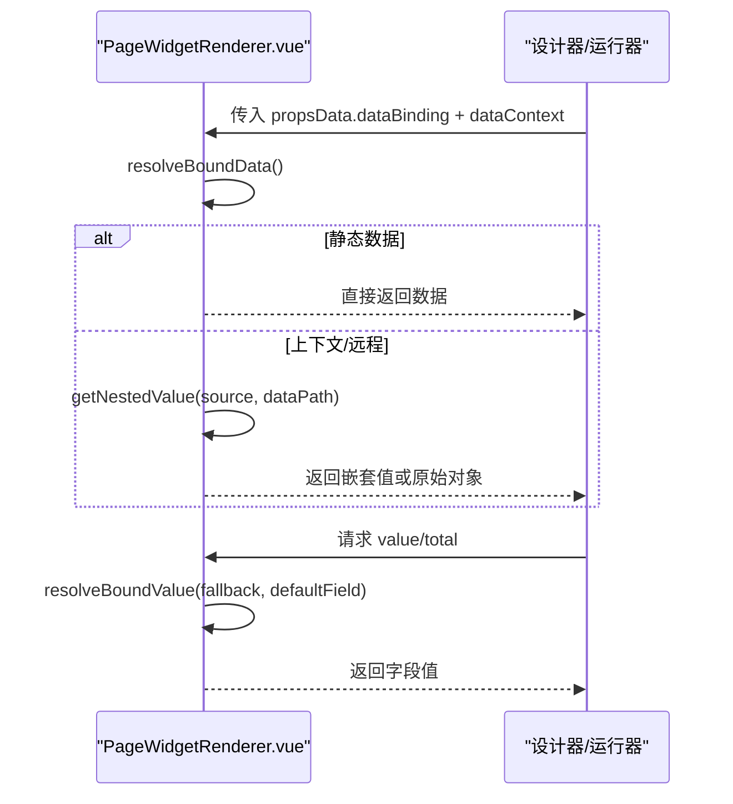

图表来源
- [PageWidgetRenderer.vue:718-745](file://forge-admin-ui/src/components/lowcode-builder/shared/PageWidgetRenderer.vue#L718-L745)

章节来源
- [PageWidgetRenderer.vue:718-745](file://forge-admin-ui/src/components/lowcode-builder/shared/PageWidgetRenderer.vue#L718-L745)

## 依赖关系分析
- LowcodePageBuilder 依赖 page-schema 进行 schema 同步与默认生成；依赖 ListPageGridDesigner 与 CanvasFormDesigner 分别处理列表与表单/详情。
- BuilderCanvas 依赖 page-zone 目录与 draggable 库进行区域管理。
- BusinessListDesigner 与 application-runtime 将设计期 schema 转换为运行期上下文，并解析区块字段目录与表单资产。
- PageWidgetRenderer 作为共享渲染器被多处复用，提供统一的数据绑定能力。

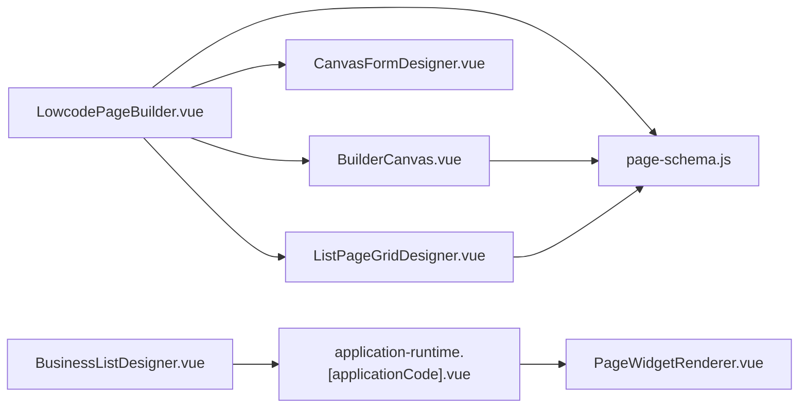

图表来源
- [LowcodePageBuilder.vue:60-213](file://forge-admin-ui/src/components/lowcode-builder/page/LowcodePageBuilder.vue#L60-L213)
- [page-schema.js:212-315](file://forge-admin-ui/src/components/lowcode-builder/page/page-schema.js#L212-L315)
- [BusinessListDesigner.vue:457-710](file://forge-admin-ui/src/views/app-center/components/designer/BusinessListDesigner.vue#L457-L710)
- [application-runtime.[applicationCode].vue:2507-3051](file://forge-admin-ui/src/views/app-center/application-runtime.[applicationCode].vue#L2507-L3051)
- [PageWidgetRenderer.vue:718-745](file://forge-admin-ui/src/components/lowcode-builder/shared/PageWidgetRenderer.vue#L718-L745)

章节来源
- [LowcodePageBuilder.vue:60-213](file://forge-admin-ui/src/components/lowcode-builder/page/LowcodePageBuilder.vue#L60-L213)
- [page-schema.js:212-315](file://forge-admin-ui/src/components/lowcode-builder/page/page-schema.js#L212-L315)
- [BusinessListDesigner.vue:457-710](file://forge-admin-ui/src/views/app-center/components/designer/BusinessListDesigner.vue#L457-L710)
- [application-runtime.[applicationCode].vue:2507-3051](file://forge-admin-ui/src/views/app-center/application-runtime.[applicationCode].vue#L2507-L3051)
- [PageWidgetRenderer.vue:718-745](file://forge-admin-ui/src/components/lowcode-builder/shared/PageWidgetRenderer.vue#L718-L745)

## 性能考量
- 避免频繁深拷贝：LowcodePageBuilder 使用 isSameSchema 比较后再替换 localSchema，减少不必要的重渲染。
- 合理划分区块：列表设计器中使用唯一区块（如 AiCrudPage、data-table）避免重复渲染与冲突。
- 字段可见性过滤：page-schema 中对 search/edit/table/detail 的字段可见性进行预过滤，减少无效节点渲染。
- 数据绑定路径缓存：PageWidgetRenderer 的 resolveBoundData 仅在 enabled 且非静态时计算，避免无谓开销。
- 画布缩放与预览：CanvasFormDesigner 与 ForgeFormCanvas 的缩放/预览模式可减少大画布下的渲染压力。

[本节为通用性能建议，不直接分析具体文件]

## 故障排查指南
- 区域未启用：检查 BuilderCanvas 的 drop 逻辑是否正确写入 zone.enabled；确认 palette 拖拽携带的 zoneKey 正确。
- 字段未出现在调色板：确认 selectedZoneKey 与 page-schema 的 canvasComponentCatalog.zones 匹配；检查 isPageFieldVisible 过滤条件。
- 列表布局异常：核对 ListPageGridDesigner 的 resetLayout/clearCanvas 是否被误触发；确认 syncGridLayoutWithModel 返回值有效。
- 钩子规则不生效：检查 CrudHookRulesEditor 的 normalizeCrudHookRules 是否保留了空行；确认 applyCrudHookRules 的 action 与 field 填写完整。
- 数据绑定为空：查看 PageWidgetRenderer 的 dataBinding.enabled 与 sourceType；确认 dataPath/contextPath 指向正确的嵌套路径。

章节来源
- [BuilderCanvas.vue:61-91](file://forge-admin-ui/src/components/lowcode-builder/page/BuilderCanvas.vue#L61-L91)
- [ComponentPalette.vue:117-185](file://forge-admin-ui/src/components/lowcode-builder/page/ComponentPalette.vue#L117-L185)
- [ListPageGridDesigner.vue:8324-8372](file://forge-admin-ui/src/components/lowcode-builder/page/ListPageGridDesigner.vue#L8324-L8372)
- [CrudHookRulesEditor.vue:108-145](file://forge-admin-ui/src/components/lowcode-builder/page/CrudHookRulesEditor.vue#L108-L145)
- [crud-hook-rules.js:28-83](file://forge-admin-ui/src/components/lowcode-builder/page/crud-hook-rules.js#L28-L83)
- [PageWidgetRenderer.vue:718-745](file://forge-admin-ui/src/components/lowcode-builder/shared/PageWidgetRenderer.vue#L718-L745)

## 结论
该低代码页面构建器以 page-schema 为中心，通过 LowcodePageBuilder 协调列表与表单/详情两种构建模式，结合 BuilderCanvas 的区域管理与 ComponentPalette 的拖拽交互，形成高效的设计期体验。结构化列表设计器与 CRUD 钩子规则编辑器进一步增强了页面编排与数据处理的灵活性。运行期通过 BusinessListDesigner 与 application-runtime 将设计期 schema 转化为可渲染上下文，PageWidgetRenderer 提供统一的数据绑定能力。遵循本文的最佳实践与性能建议，可在复杂业务场景下稳定构建高质量页面。

[本节为总结性内容，不直接分析具体文件]

## 附录
- 最佳实践
  - 优先使用 page-schema 提供的 createDefaultPageSchema 与 syncPageSchemaWithModel 保证 schema 一致性。
  - 列表设计器中尽量使用唯一区块（AiCrudPage、data-table）以减少冲突。
  - 表单/详情区通过 ComponentPalette 按区域拖拽字段，避免跨区误用。
  - 使用 CrudHookRulesEditor 配置常见参数改写，复杂逻辑仍建议使用代码扩展。
  - 数据绑定优先使用 context 或 remote 模式，避免硬编码静态值。
- 性能优化建议
  - 合理使用布局类型（simple-crud/tree-crud/master-detail-crud）减少不必要区块。
  - 控制画布缩放与预览模式，降低大页面渲染压力。
  - 利用字段可见性过滤减少无效节点渲染。
  - 避免频繁深拷贝与全量更新，优先增量 patch。

[本节为通用指导，不直接分析具体文件]