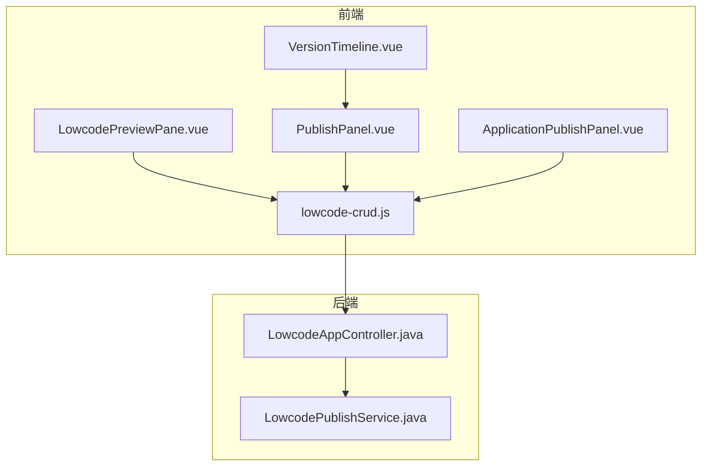
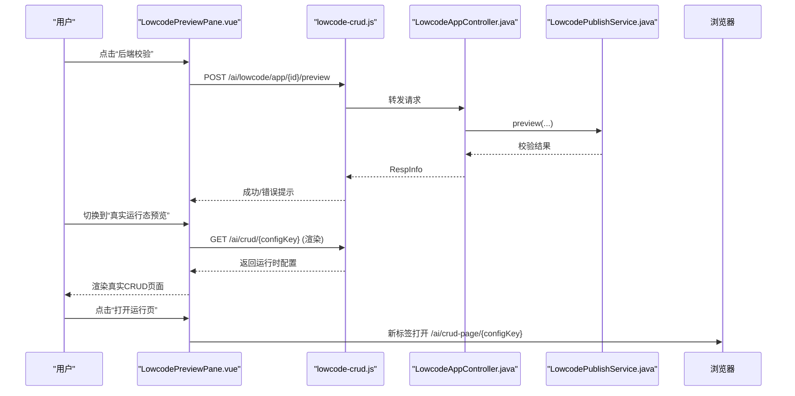
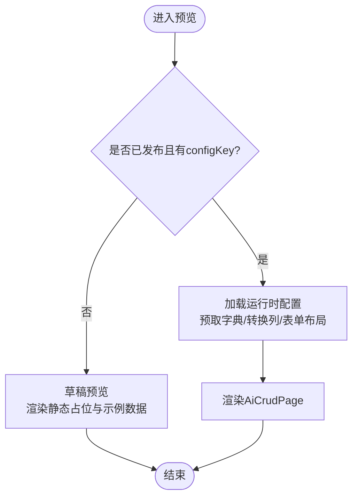
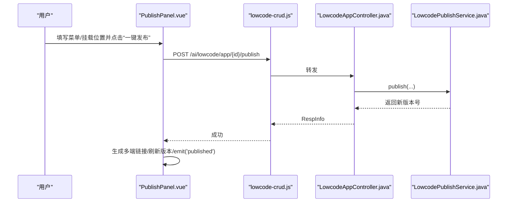
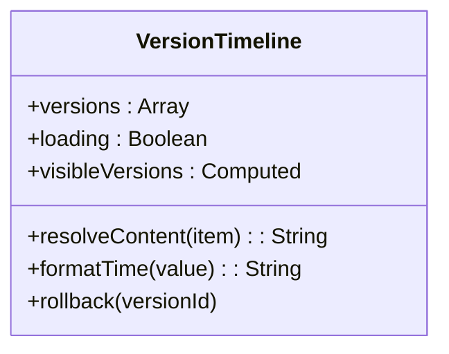
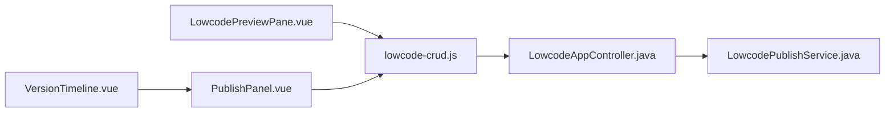

# 预览与发布

<cite>
**本文引用的文件**
- [LowcodePreviewPane.vue](file://forge-admin-ui/src/components/lowcode-builder/preview/LowcodePreviewPane.vue)
- [PublishPanel.vue](file://forge-admin-ui/src/components/lowcode-builder/publish/PublishPanel.vue)
- [VersionTimeline.vue](file://forge-admin-ui/src/components/lowcode-builder/publish/VersionTimeline.vue)
- [lowcode-crud.js](file://forge-admin-ui/src/api/lowcode-crud.js)
- [LowcodeAppController.java](file://forge-server/forge-framework/forge-plugin-parent/forge-plugin-generator/src/main/java/com/mdframe/forge/plugin/generator/controller/LowcodeAppController.java)
- [LowcodePublishService.java](file://forge-server/forge-framework/forge-plugin-parent/forge-plugin-generator/src/main/java/com/mdframe/forge/plugin/generator/service/lowcode/LowcodePublishService.java)
- [ApplicationPublishPanel.vue](file://forge-admin-ui/src/views/app-center/application-workspace/ApplicationPublishPanel.vue)
- [ExtensionVersionDrawer.vue](file://forge-admin-ui/src/views/app-center/application-workspace/ExtensionVersionDrawer.vue)
</cite>

## 目录
1. [简介](#简介)
2. [项目结构](#项目结构)
3. [核心组件](#核心组件)
4. [架构总览](#架构总览)
5. [详细组件分析](#详细组件分析)
6. [依赖关系分析](#依赖关系分析)
7. [性能考虑](#性能考虑)
8. [故障排查指南](#故障排查指南)
9. [结论](#结论)
10. [附录](#附录)

## 简介
本技术文档围绕低代码预览与发布系统，系统性解析以下能力：
- LowcodePreviewPane 预览面板：草稿预览、真实运行态预览、后端校验、运行时配置注入。
- PublishPanel 发布面板：一键发布、挂载位置选择、菜单生成、版本快照、回滚。
- VersionTimeline 版本时间线：可视化展示版本历史、回滚入口、最近版本限制。
- 企业级特性：发布检查与阻断、权限控制、部署自动化（菜单/入口同步）、监控告警（通过通用能力）。
- 最佳实践与排障：发布前检查、灰度策略建议、常见问题定位。

## 项目结构
前端以 Vue 组件组织预览与发布能力，API 层统一封装低代码 CRUD 相关接口；后端提供控制器与服务完成预览、发布、版本管理与回滚。

图表来源
- [LowcodePreviewPane.vue:1-250](file://forge-admin-ui/src/components/lowcode-builder/preview/LowcodePreviewPane.vue#L1-L250)
- [PublishPanel.vue:1-120](file://forge-admin-ui/src/components/lowcode-builder/publish/PublishPanel.vue#L1-L120)
- [VersionTimeline.vue:1-90](file://forge-admin-ui/src/components/lowcode-builder/publish/VersionTimeline.vue#L1-L90)
- [lowcode-crud.js:64-78](file://forge-admin-ui/src/api/lowcode-crud.js#L64-L78)
- [LowcodeAppController.java:81-105](file://forge-server/forge-framework/forge-plugin-parent/forge-plugin-generator/src/main/java/com/mdframe/forge/plugin/generator/controller/LowcodeAppController.java#L81-L105)
- [LowcodePublishService.java:157-238](file://forge-server/forge-framework/forge-plugin-parent/forge-plugin-generator/src/main/java/com/mdframe/forge/plugin/generator/service/lowcode/LowcodePublishService.java#L157-L238)

章节来源
- [LowcodePreviewPane.vue:1-250](file://forge-admin-ui/src/components/lowcode-builder/preview/LowcodePreviewPane.vue#L1-L250)
- [PublishPanel.vue:1-120](file://forge-admin-ui/src/components/lowcode-builder/publish/PublishPanel.vue#L1-L120)
- [lowcode-crud.js:64-78](file://forge-admin-ui/src/api/lowcode-crud.js#L64-L78)
- [LowcodeAppController.java:81-105](file://forge-server/forge-framework/forge-plugin-parent/forge-plugin-generator/src/main/java/com/mdframe/forge/plugin/generator/controller/LowcodeAppController.java#L81-L105)
- [LowcodePublishService.java:157-238](file://forge-server/forge-framework/forge-plugin-parent/forge-plugin-generator/src/main/java/com/mdframe/forge/plugin/generator/service/lowcode/LowcodePublishService.java#L157-L238)

## 核心组件
- 预览面板（LowcodePreviewPane）
  - 支持“草稿预览”和“真实运行态预览”两种模式切换。
  - 草稿模式下渲染搜索区、表格区、表单/详情区的静态占位与示例数据。
  - 真实运行态模式下调用后端渲染接口，注入字典、列渲染、表单布局等运行时配置。
  - 提供“后端校验”按钮，触发草稿配置的合法性检查。
- 发布面板（PublishPanel）
  - 配置挂载位置（管理端/移动端/两端），菜单名称、父级、排序。
  - 一键发布后生成访问链接（管理端列表页、表单填报页；移动端列表页、表单填报页）。
  - 集成版本时间线，支持回滚到指定版本。
- 版本时间线（VersionTimeline）
  - 仅显示最近 N 个版本，标注发布/回滚类型与时间。
  - 提供“回滚到此版本”的二次确认入口。
- 应用工作台发布面板（ApplicationPublishPanel）
  - 发布检查：统计阻断项与提醒项，支持重新检查。
  - 发布执行：幂等键保护、失败恢复、结果持久化与事件广播。
  - 版本与运行记录：并行加载版本与运行历史。

章节来源
- [LowcodePreviewPane.vue:235-548](file://forge-admin-ui/src/components/lowcode-builder/preview/LowcodePreviewPane.vue#L235-L548)
- [PublishPanel.vue:75-238](file://forge-admin-ui/src/components/lowcode-builder/publish/PublishPanel.vue#L75-L238)
- [VersionTimeline.vue:36-66](file://forge-admin-ui/src/components/lowcode-builder/publish/VersionTimeline.vue#L36-L66)
- [ApplicationPublishPanel.vue:197-400](file://forge-admin-ui/src/views/app-center/application-workspace/ApplicationPublishPanel.vue#L197-L400)

## 架构总览
预览与发布的关键交互流程如下：

图表来源
- [LowcodePreviewPane.vue:491-548](file://forge-admin-ui/src/components/lowcode-builder/preview/LowcodePreviewPane.vue#L491-L548)
- [lowcode-crud.js:64-78](file://forge-admin-ui/src/api/lowcode-crud.js#L64-L78)
- [LowcodeAppController.java:81-105](file://forge-server/forge-framework/forge-plugin-parent/forge-plugin-generator/src/main/java/com/mdframe/forge/plugin/generator/controller/LowcodeAppController.java#L81-L105)

## 详细组件分析

### 预览面板（LowcodePreviewPane）
- 预览模式
  - 草稿预览：基于 pageSchema/modelSchema 构建搜索区、表格区、表单/详情区，使用示例数据与禁用控件模拟交互。
  - 真实运行态预览：仅在已发布且存在 configKey 时可用，调用运行时渲染接口并预加载字典，再渲染 AiCrudPage。
- 运行时配置注入
  - 将 columnsSchema、searchSchema、editSchema、childrenConfig、expandConfig、detailPanels、apiConfig、options 等映射为运行时属性。
  - 处理列渲染器（字典标签、图片/文件、组织/用户/地区名）、字段元信息（数据类型、公式只读等）、表单布局与尺寸。
- 调试与诊断
  - 提供“后端校验”快速验证草稿配置合法性。
  - 错误信息在顶部以 Alert 展示，便于快速定位问题。

图表来源
- [LowcodePreviewPane.vue:235-548](file://forge-admin-ui/src/components/lowcode-builder/preview/LowcodePreviewPane.vue#L235-L548)
- [LowcodePreviewPane.vue:550-788](file://forge-admin-ui/src/components/lowcode-builder/preview/LowcodePreviewPane.vue#L550-L788)

章节来源
- [LowcodePreviewPane.vue:235-548](file://forge-admin-ui/src/components/lowcode-builder/preview/LowcodePreviewPane.vue#L235-L548)
- [LowcodePreviewPane.vue:550-788](file://forge-admin-ui/src/components/lowcode-builder/preview/LowcodePreviewPane.vue#L550-L788)

### 发布面板（PublishPanel）
- 发布表单
  - 挂载位置：ADMIN/MOBILE/BOTH，影响生成的访问链接。
  - 菜单配置：名称、父级、排序，用于管理端菜单注册。
- 发布流程
  - 调用 lowcodePublish 接口，传入领域、对象、模型与页面协议、菜单信息等。
  - 成功后生成多端访问链接，刷新版本列表并通知上层。
- 回滚机制
  - 通过 VersionTimeline 触发回滚，调用 lowcodeRollback，成功后清空链接并刷新版本。

图表来源
- [PublishPanel.vue:179-238](file://forge-admin-ui/src/components/lowcode-builder/publish/PublishPanel.vue#L179-L238)
- [lowcode-crud.js:68-78](file://forge-admin-ui/src/api/lowcode-crud.js#L68-L78)
- [LowcodeAppController.java:88-105](file://forge-server/forge-framework/forge-plugin-parent/forge-plugin-generator/src/main/java/com/mdframe/forge/plugin/generator/controller/LowcodeAppController.java#L88-L105)
- [LowcodePublishService.java:157-238](file://forge-server/forge-framework/forge-plugin-parent/forge-plugin-generator/src/main/java/com/mdframe/forge/plugin/generator/service/lowcode/LowcodePublishService.java#L157-L238)

章节来源
- [PublishPanel.vue:75-238](file://forge-admin-ui/src/components/lowcode-builder/publish/PublishPanel.vue#L75-L238)
- [lowcode-crud.js:68-78](file://forge-admin-ui/src/api/lowcode-crud.js#L68-L78)
- [LowcodeAppController.java:88-105](file://forge-server/forge-framework/forge-plugin-parent/forge-plugin-generator/src/main/java/com/mdframe/forge/plugin/generator/controller/LowcodeAppController.java#L88-L105)
- [LowcodePublishService.java:157-238](file://forge-server/forge-framework/forge-plugin-parent/forge-plugin-generator/src/main/java/com/mdframe/forge/plugin/generator/service/lowcode/LowcodePublishService.java#L157-L238)

### 版本时间线（VersionTimeline）
- 展示最近 N 个版本（默认 5），区分“发布上线”与“回滚发布”。
- 每个版本条目包含版本号、备注/动作、发布时间，并提供“回滚到此版本”的二次确认。
- 当版本数超过阈值时，显示总数提示。

图表来源
- [VersionTimeline.vue:1-90](file://forge-admin-ui/src/components/lowcode-builder/publish/VersionTimeline.vue#L1-L90)

章节来源
- [VersionTimeline.vue:36-66](file://forge-admin-ui/src/components/lowcode-builder/publish/VersionTimeline.vue#L36-L66)

### 应用工作台发布面板（ApplicationPublishPanel）
- 发布检查：统计阻断项与提醒项，支持重新检查；自动补齐依赖提示。
- 发布执行：弹窗确认后执行发布，使用幂等键避免重复提交；失败可恢复。
- 结果处理：成功写入本地存储并派发事件；失败给出友好提示。
- 版本与运行记录：并行加载版本与运行历史，支持查看步骤与恢复。

章节来源
- [ApplicationPublishPanel.vue:197-400](file://forge-admin-ui/src/views/app-center/application-workspace/ApplicationPublishPanel.vue#L197-L400)

### 扩展版本对比（ExtensionVersionDrawer）
- 左侧列出各版本，右侧支持选择基线与目标版本进行差异对比。
- 支持“回滚为新草稿”，便于协作场景下的版本演进与回归。

章节来源
- [ExtensionVersionDrawer.vue:1-63](file://forge-admin-ui/src/views/app-center/application-workspace/ExtensionVersionDrawer.vue#L1-L63)

## 依赖关系分析
- 前端组件依赖 API 层进行网络请求，API 层封装了低代码 CRUD 的预览、发布、版本、回滚等接口。
- 后端控制器暴露 REST 接口，服务层实现发布、回滚、版本查询等业务逻辑。
- 发布流程中，菜单注册与业务入口同步在事务提交后异步执行，降低主事务耗时。

图表来源
- [LowcodePreviewPane.vue:235-548](file://forge-admin-ui/src/components/lowcode-builder/preview/LowcodePreviewPane.vue#L235-L548)
- [PublishPanel.vue:75-238](file://forge-admin-ui/src/components/lowcode-builder/publish/PublishPanel.vue#L75-L238)
- [lowcode-crud.js:64-78](file://forge-admin-ui/src/api/lowcode-crud.js#L64-L78)
- [LowcodeAppController.java:81-105](file://forge-server/forge-framework/forge-plugin-parent/forge-plugin-generator/src/main/java/com/mdframe/forge/plugin/generator/controller/LowcodeAppController.java#L81-L105)
- [LowcodePublishService.java:157-238](file://forge-server/forge-framework/forge-plugin-parent/forge-plugin-generator/src/main/java/com/mdframe/forge/plugin/generator/service/lowcode/LowcodePublishService.java#L157-L238)

章节来源
- [lowcode-crud.js:64-78](file://forge-admin-ui/src/api/lowcode-crud.js#L64-L78)
- [LowcodeAppController.java:81-105](file://forge-server/forge-framework/forge-plugin-parent/forge-plugin-generator/src/main/java/com/mdframe/forge/plugin/generator/controller/LowcodeAppController.java#L81-L105)
- [LowcodePublishService.java:157-238](file://forge-server/forge-framework/forge-plugin-parent/forge-plugin-generator/src/main/java/com/mdframe/forge/plugin/generator/service/lowcode/LowcodePublishService.java#L157-L238)

## 性能考虑
- 预览阶段
  - 草稿预览使用静态占位与示例数据，避免频繁请求后端。
  - 真实运行态预览按需加载运行时配置，并预取字典以减少后续渲染开销。
- 发布阶段
  - 菜单注册与入口同步在事务外异步执行，缩短发布响应时间。
  - 应用工作台发布使用幂等键，避免重复提交导致的多份版本。
- 版本展示
  - 版本时间线仅展示最近若干版本，减少 DOM 节点数量。

[本节为通用指导，不直接分析具体文件]

## 故障排查指南
- 预览失败
  - 草稿校验失败：点击“后端校验”，根据错误提示修正 modelSchema/pageSchema。
  - 真实运行态无法加载：确认应用已发布且存在 configKey；检查运行时渲染接口返回。
- 发布失败
  - 存在阻断项：先执行发布检查，修复阻断后再发布。
  - 超时或网络异常：提示“等待超时，后台可能仍在处理”，请刷新发布记录确认结果，避免重复提交。
- 回滚异常
  - 版本不存在或不属于当前应用：检查版本 ID 与应用归属。
  - 回滚后链接失效：回滚成功后会清空链接，需重新生成或刷新。
- 权限与协作
  - 发布权限不足：检查用户权限是否包含相应发布能力。
  - 版本对比：使用扩展版本抽屉进行基线与目标版本差异对比，辅助协作决策。

章节来源
- [LowcodePreviewPane.vue:491-548](file://forge-admin-ui/src/components/lowcode-builder/preview/LowcodePreviewPane.vue#L491-L548)
- [ApplicationPublishPanel.vue:226-310](file://forge-admin-ui/src/views/app-center/application-workspace/ApplicationPublishPanel.vue#L226-L310)
- [LowcodePublishService.java:157-238](file://forge-server/forge-framework/forge-plugin-parent/forge-plugin-generator/src/main/java/com/mdframe/forge/plugin/generator/service/lowcode/LowcodePublishService.java#L157-L238)

## 结论
本系统通过清晰的组件分层与前后端协同，实现了低代码应用的预览、发布、版本管理与回滚闭环。预览面板兼顾草稿与真实运行态，发布面板提供一键发布与多端链接生成，版本时间线保障可追溯与可回滚。结合发布检查、幂等发布、异步入口同步等企业级能力，满足生产环境的稳定性与可运维性要求。

[本节为总结，不直接分析具体文件]

## 附录
- 关键接口路径
  - 预览：POST /ai/lowcode/app/{id}/preview
  - 发布：POST /ai/lowcode/app/{id}/publish
  - 版本列表：GET /ai/lowcode/app/{id}/versions
  - 回滚：POST /ai/lowcode/app/{id}/rollback/{versionId}
- 运行时访问路径
  - 管理端：/ai/crud-page/{configKey}?appId={appId}
  - 移动端：/pages/lowcode-runtime?configKey={configKey}&appId={appId}

章节来源
- [lowcode-crud.js:64-78](file://forge-admin-ui/src/api/lowcode-crud.js#L64-L78)
- [PublishPanel.vue:136-168](file://forge-admin-ui/src/components/lowcode-builder/publish/PublishPanel.vue#L136-L168)