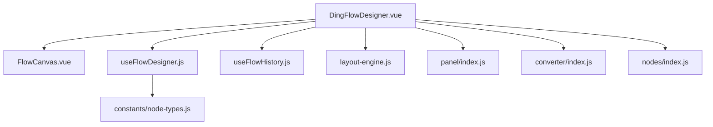
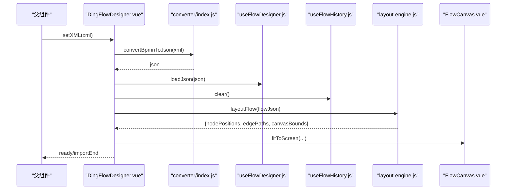
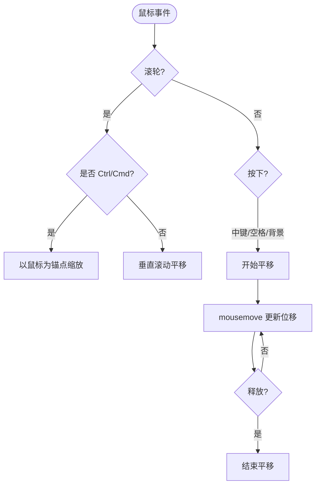
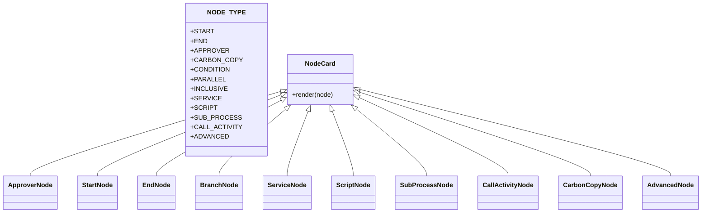
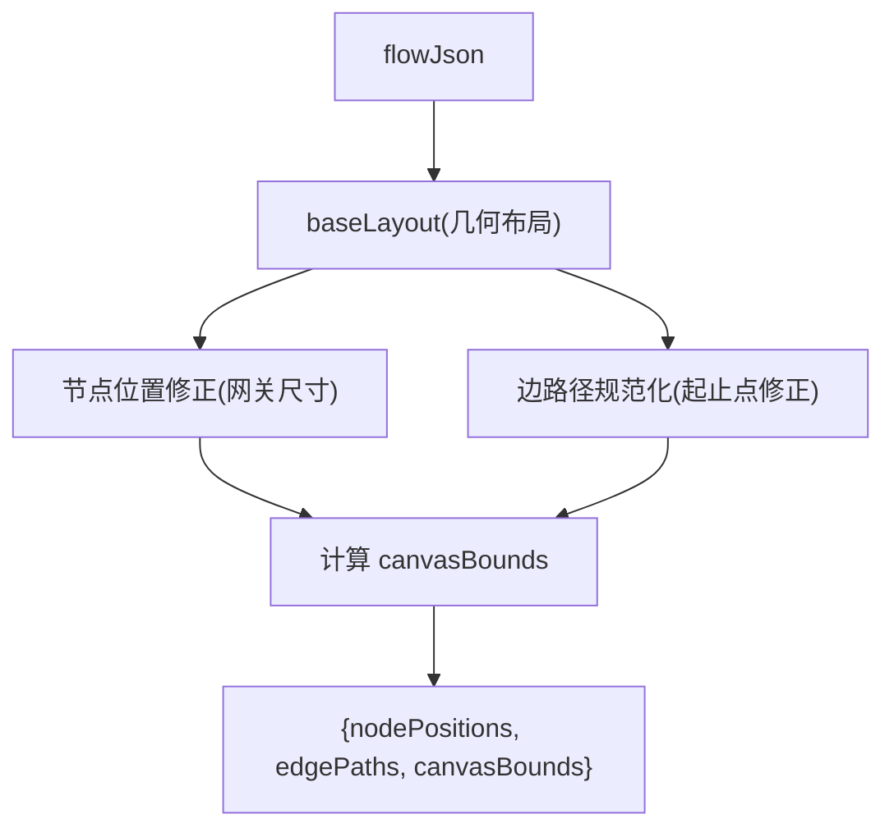
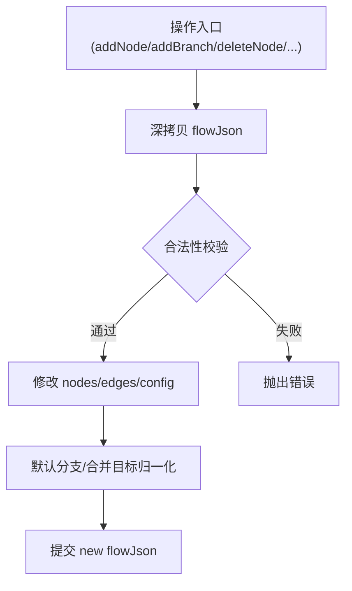
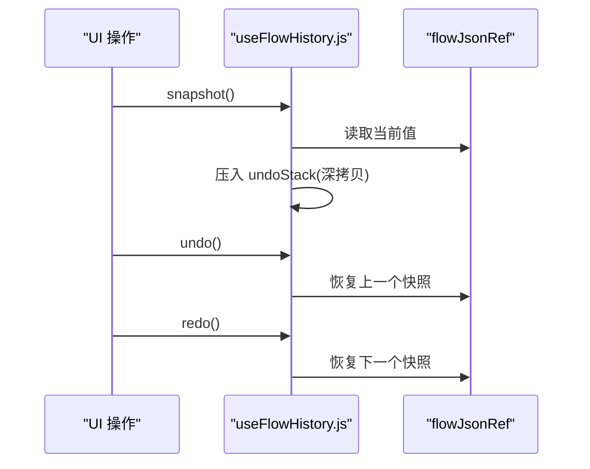
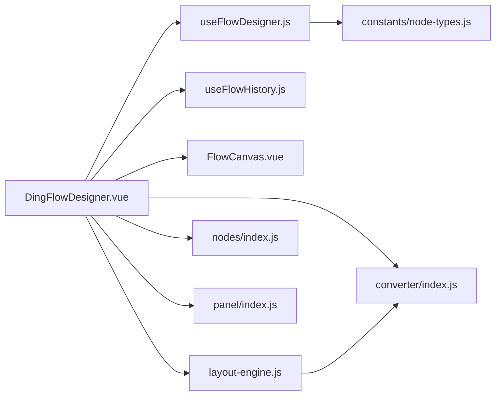

# 工作流设计器

<cite>
**本文引用的文件**
- [DingFlowDesigner.vue](file://forge-admin-ui/src/components/flow-designer/DingFlowDesigner.vue)
- [useFlowDesigner.js](file://forge-admin-ui/src/components/flow-designer/composables/useFlowDesigner.js)
- [useFlowHistory.js](file://forge-admin-ui/src/components/flow-designer/composables/useFlowHistory.js)
- [FlowCanvas.vue](file://forge-admin-ui/src/components/flow-designer/canvas/FlowCanvas.vue)
- [layout-engine.js](file://forge-admin-ui/src/components/flow-designer/canvas/layout-engine.js)
- [node-types.js](file://forge-admin-ui/src/components/flow-designer/constants/node-types.js)
- [converter/index.js](file://forge-admin-ui/src/components/flow-designer/converter/index.js)
- [nodes/index.js](file://forge-admin-ui/src/components/flow-designer/nodes/index.js)
- [panel/index.js](file://forge-admin-ui/src/components/flow-designer/panel/index.js)
</cite>

## 目录
1. [简介](#简介)
2. [项目结构](#项目结构)
3. [核心组件](#核心组件)
4. [架构总览](#架构总览)
5. [详细组件分析](#详细组件分析)
6. [依赖关系分析](#依赖关系分析)
7. [性能考虑](#性能考虑)
8. [故障排查指南](#故障排查指南)
9. [结论](#结论)
10. [附录](#附录)

## 简介
本技术文档围绕 Forge Admin 中的 DingFlowDesigner 工作流设计器，系统性解析其整体架构与核心实现。内容覆盖画布系统、节点系统、面板系统等主要模块的设计模式；详细说明工作流建模、节点类型定义、连接线配置、属性编辑等功能实现；解释 Canvas 渲染引擎、节点拖拽、连线算法、撤销重做等核心技术；并提供节点转换器、视图管理器、工具函数等辅助模块的使用指南，以及扩展开发、自定义节点创建和性能优化策略。

## 项目结构
设计器采用“主容器 + 可组合能力”的模块化组织方式：
- 顶层容器：DingFlowDesigner.vue 负责编排导入导出、状态同步、布局计算、抽屉面板与交互事件。
- 画布层：FlowCanvas.vue 提供缩放/平移/导航能力；layout-engine.js 负责节点位置与边路径计算。
- 数据与逻辑：useFlowDesigner.js 管理 flowJson 及 CRUD；useFlowHistory.js 提供撤销/重做。
- 节点与面板：nodes/index.js 暴露 12 种节点卡片；panel/index.js 暴露配置抽屉与各节点专属配置。
- 转换层：converter/index.js 统一导出 BPMN XML ↔ JSON 转换、分支解析、布局算法等。
- 常量：node-types.js 定义节点类型枚举与 BPMN 映射。

图表来源
- [DingFlowDesigner.vue:1-761](file://forge-admin-ui/src/components/flow-designer/DingFlowDesigner.vue#L1-L761)
- [FlowCanvas.vue:1-262](file://forge-admin-ui/src/components/flow-designer/canvas/FlowCanvas.vue#L1-L262)
- [useFlowDesigner.js:1-387](file://forge-admin-ui/src/components/flow-designer/composables/useFlowDesigner.js#L1-L387)
- [useFlowHistory.js:1-117](file://forge-admin-ui/src/components/flow-designer/composables/useFlowHistory.js#L1-L117)
- [layout-engine.js:1-151](file://forge-admin-ui/src/components/flow-designer/canvas/layout-engine.js#L1-L151)
- [node-types.js:1-160](file://forge-admin-ui/src/components/flow-designer/constants/node-types.js#L1-L160)
- [converter/index.js:1-25](file://forge-admin-ui/src/components/flow-designer/converter/index.js#L1-L25)
- [nodes/index.js:1-18](file://forge-admin-ui/src/components/flow-designer/nodes/index.js#L1-L18)
- [panel/index.js:1-34](file://forge-admin-ui/src/components/flow-designer/panel/index.js#L1-L34)

章节来源
- [DingFlowDesigner.vue:1-761](file://forge-admin-ui/src/components/flow-designer/DingFlowDesigner.vue#L1-L761)
- [FlowCanvas.vue:1-262](file://forge-admin-ui/src/components/flow-designer/canvas/FlowCanvas.vue#L1-L262)
- [useFlowDesigner.js:1-387](file://forge-admin-ui/src/components/flow-designer/composables/useFlowDesigner.js#L1-L387)
- [useFlowHistory.js:1-117](file://forge-admin-ui/src/components/flow-designer/composables/useFlowHistory.js#L1-L117)
- [layout-engine.js:1-151](file://forge-admin-ui/src/components/flow-designer/canvas/layout-engine.js#L1-L151)
- [node-types.js:1-160](file://forge-admin-ui/src/components/flow-designer/constants/node-types.js#L1-L160)
- [converter/index.js:1-25](file://forge-admin-ui/src/components/flow-designer/converter/index.js#L1-L25)
- [nodes/index.js:1-18](file://forge-admin-ui/src/components/flow-designer/nodes/index.js#L1-L18)
- [panel/index.js:1-34](file://forge-admin-ui/src/components/flow-designer/panel/index.js#L1-L34)

## 核心组件
- 设计器主容器（DingFlowDesigner.vue）
  - 职责：XML 导入/导出、流程配置注入、业务表单自动绑定、布局结果计算、上下文菜单、抽屉面板联动、撤销重做集成、自动适配视口。
  - 关键行为：监听 props.xml 变化执行 importXml；watch processConfig 应用流程级配置；watch 表单资产选项进行默认绑定；computed layoutResult 驱动节点与边渲染；scheduleEmit 节流输出最新 XML。
- 画布容器（FlowCanvas.vue）
  - 职责：提供 transform 缩放/平移容器；鼠标滚轮缩放（Ctrl/Cmd）、空格+拖拽平移、中键平移、双击空白重置视图；暴露 resetView/fitToScreen/zoomIn/zoomOut/setScale/screenToCanvas/canvasToScreen。
- 设计器逻辑（useFlowDesigner.js）
  - 职责：维护 flowJson 与选中节点；提供 addNode/addBranch/deleteNode/updateNode/moveNodeUp/Down/copyNode/updateEdge/reconnect/loadJson/exportJson/reset 等能力；内置网关分支合并目标识别与默认分支归一化。
- 历史栈（useFlowHistory.js）
  - 职责：基于 JSON 快照的撤销/重做；支持键盘快捷键绑定；容量限制与清空。
- 布局引擎（layout-engine.js）
  - 职责：复用 converter 的几何布局，输出节点位置 Map、边路径 Map（含 straight/orthogonal 类型）、画布边界；修正起止点为真实节点边界。
- 节点类型（node-types.js）
  - 职责：定义 12 种 nodeType 枚举、BPMN 元素到 nodeType 的映射、nodeType 到 BPMN localName 的反向映射。
- 转换器（converter/index.js）
  - 职责：统一导出 bpmn-to-json/json-to-bpmn/branch-parser/completion-condition/layout-algorithm/user-task-parser/user-task-writer/xml-escape/xml-utils。
- 节点卡片（nodes/index.js）
  - 职责：导出 12 种节点卡片组件，供 NodeRenderer 按 nodeType 渲染。
- 面板（panel/index.js）
  - 职责：导出 NodeConfigDrawer 及各节点专属配置组件，通过 config-renderer-map 调度渲染。

章节来源
- [DingFlowDesigner.vue:1-761](file://forge-admin-ui/src/components/flow-designer/DingFlowDesigner.vue#L1-L761)
- [FlowCanvas.vue:1-262](file://forge-admin-ui/src/components/flow-designer/canvas/FlowCanvas.vue#L1-L262)
- [useFlowDesigner.js:1-387](file://forge-admin-ui/src/components/flow-designer/composables/useFlowDesigner.js#L1-L387)
- [useFlowHistory.js:1-117](file://forge-admin-ui/src/components/flow-designer/composables/useFlowHistory.js#L1-L117)
- [layout-engine.js:1-151](file://forge-admin-ui/src/components/flow-designer/canvas/layout-engine.js#L1-L151)
- [node-types.js:1-160](file://forge-admin-ui/src/components/flow-designer/constants/node-types.js#L1-L160)
- [converter/index.js:1-25](file://forge-admin-ui/src/components/flow-designer/converter/index.js#L1-L25)
- [nodes/index.js:1-18](file://forge-admin-ui/src/components/flow-designer/nodes/index.js#L1-L18)
- [panel/index.js:1-34](file://forge-admin-ui/src/components/flow-designer/panel/index.js#L1-L34)

## 架构总览
设计器以“数据驱动 + 视图分层”的方式构建：
- 数据层：flowJson 作为唯一事实源，由 useFlowDesigner 维护；useFlowHistory 在其上叠加撤销/重做能力。
- 视图层：FlowCanvas 提供变换容器；NodeRenderer 渲染节点；EdgeLayer 渲染连线；NodeConfigDrawer 提供属性编辑。
- 布局层：layout-engine 基于 converter 的布局算法计算节点位置与边路径，并输出 canvasBounds 用于 fitToScreen。
- 转换层：bpmn-to-json/json-to-bpmn 负责 XML 与内部 JSON 的双向转换，保证持久化格式兼容。

图表来源
- [DingFlowDesigner.vue:117-139](file://forge-admin-ui/src/components/flow-designer/DingFlowDesigner.vue#L117-L139)
- [converter/index.js:1-25](file://forge-admin-ui/src/components/flow-designer/converter/index.js#L1-L25)
- [useFlowDesigner.js:349-354](file://forge-admin-ui/src/components/flow-designer/composables/useFlowDesigner.js#L349-L354)
- [useFlowHistory.js:65-68](file://forge-admin-ui/src/components/flow-designer/composables/useFlowHistory.js#L65-L68)
- [layout-engine.js:34-111](file://forge-admin-ui/src/components/flow-designer/canvas/layout-engine.js#L34-L111)
- [FlowCanvas.vue:153-163](file://forge-admin-ui/src/components/flow-designer/canvas/FlowCanvas.vue#L153-L163)

## 详细组件分析

### 画布系统（FlowCanvas.vue）
- 交互模型
  - 缩放：Ctrl/Cmd + 滚轮以鼠标为锚点缩放；工具栏按钮放大/缩小/适应屏幕。
  - 平移：空格+左键拖拽、中键拖拽、普通滚轮垂直滚动（含横向 deltaX）。
  - 双击空白：触发 canvasDblclick，便于上层重置视图。
- 能力暴露
  - resetView/fitToScreen/zoomIn/zoomOut/setScale/screenToCanvas/canvasToScreen，供上层调用以实现自动居中与坐标换算。
- 样式与无障碍
  - 网格背景、工具栏阴影、禁用态、减少动效适配。

图表来源
- [FlowCanvas.vue:61-116](file://forge-admin-ui/src/components/flow-designer/canvas/FlowCanvas.vue#L61-L116)
- [FlowCanvas.vue:120-141](file://forge-admin-ui/src/components/flow-designer/canvas/FlowCanvas.vue#L120-L141)

章节来源
- [FlowCanvas.vue:1-262](file://forge-admin-ui/src/components/flow-designer/canvas/FlowCanvas.vue#L1-L262)

### 节点系统与类型（node-types.js + nodes/index.js）
- 节点类型
  - 12 种：start/end/approver/carbonCopy/condition/parallel/inclusive/service/script/subProcess/callActivity/advanced。
  - 提供 bpmnTypeToNodeType 将 BPMN DOM 元素映射为 nodeType；NODE_TYPE_TO_BPMN_LOCAL_NAME 反向映射用于写出。
- 节点卡片
  - 各节点卡片组件集中导出，配合 NodeRenderer 根据 nodeType 选择渲染。

图表来源
- [node-types.js:19-160](file://forge-admin-ui/src/components/flow-designer/constants/node-types.js#L19-L160)
- [nodes/index.js:1-18](file://forge-admin-ui/src/components/flow-designer/nodes/index.js#L1-L18)

章节来源
- [node-types.js:1-160](file://forge-admin-ui/src/components/flow-designer/constants/node-types.js#L1-L160)
- [nodes/index.js:1-18](file://forge-admin-ui/src/components/flow-designer/nodes/index.js#L1-L18)

### 连接线与布局（layout-engine.js）
- 输入：flowJson（nodes/edges）
- 处理：
  - 复用 converter 的 calculateLayout 获取基础节点位置与 waypoints。
  - 对网关节点使用菱形尺寸重写位置。
  - 规范化边路径起止点到真实节点边界，判断 straight/orthogonal。
  - 聚合所有节点与路径点得到 canvasBounds。
- 输出：nodePositions Map、edgePaths Map、canvasBounds。

图表来源
- [layout-engine.js:34-111](file://forge-admin-ui/src/components/flow-designer/canvas/layout-engine.js#L34-L111)
- [layout-engine.js:113-151](file://forge-admin-ui/src/components/flow-designer/canvas/layout-engine.js#L113-L151)

章节来源
- [layout-engine.js:1-151](file://forge-admin-ui/src/components/flow-designer/canvas/layout-engine.js#L1-L151)

### 工作流建模与变更（useFlowDesigner.js）
- 建模能力
  - 新增节点：在指定节点后插入，保留原出边的条件/分支信息；若原无边则新建边。
  - 新增网关：在指定节点后插入网关，生成两条分支（并行或条件），必要时标记汇合节点。
  - 删除节点：禁止删除 start/end；网关递归删除分支链直到汇合点；普通节点笛卡尔重连入边×出边。
  - 移动/复制：仅线性链节点可上下移动；复制时生成新 ID 与名称后缀。
  - 边更新：updateEdge 直接合并 patch。
- 约束与一致性
  - 默认分支归一化：非并行网关确保有且仅有一条 isDefault 分支，并记录 defaultFlowId。
  - 合并目标识别：沿分支追踪至入度≥2 或显式 mergeNode 的节点。

图表来源
- [useFlowDesigner.js:63-158](file://forge-admin-ui/src/components/flow-designer/composables/useFlowDesigner.js#L63-L158)
- [useFlowDesigner.js:160-241](file://forge-admin-ui/src/components/flow-designer/composables/useFlowDesigner.js#L160-L241)
- [useFlowDesigner.js:243-343](file://forge-admin-ui/src/components/flow-designer/composables/useFlowDesigner.js#L243-L343)

章节来源
- [useFlowDesigner.js:1-387](file://forge-admin-ui/src/components/flow-designer/composables/useFlowDesigner.js#L1-L387)

### 撤销/重做（useFlowHistory.js）
- 机制：每次变更前 snapshot 当前 flowJson 深拷贝入 undoStack；undo 弹出并恢复；redo 反向恢复。
- 容量：maxStack 默认 50，超出丢弃最早项。
- 快捷键：Ctrl/Cmd+Z 撤销；Ctrl/Cmd+Y 或 Ctrl/Cmd+Shift+Z 重做。

图表来源
- [useFlowHistory.js:25-68](file://forge-admin-ui/src/components/flow-designer/composables/useFlowHistory.js#L25-L68)
- [useFlowHistory.js:70-99](file://forge-admin-ui/src/components/flow-designer/composables/useFlowHistory.js#L70-L99)

章节来源
- [useFlowHistory.js:1-117](file://forge-admin-ui/src/components/flow-designer/composables/useFlowHistory.js#L1-L117)

### 属性编辑与面板（panel/index.js）
- 抽屉容器：NodeConfigDrawer 承载节点配置编辑，支持保存与边属性更新。
- 配置组件：BasicConfig、ApproverConfig、ConditionConfig、ServiceConfig、ScriptConfig、SubProcessConfig、CallActivityConfig、AdvancedConfig 等。
- 子表单：ApproverAssigneeForm、MultiInstanceConfig、PermissionConfig、FormPermissionConfig、ListenerConfig。
- 调度：config-renderer-map 根据 nodeType 选择对应配置组件。

章节来源
- [panel/index.js:1-34](file://forge-admin-ui/src/components/flow-designer/panel/index.js#L1-L34)

### 转换器（converter/index.js）
- 双向转换：bpmn-to-json 与 json-to-bpmn 保证 XML 与内部 JSON 的互转。
- 分支解析：branch-parser 识别 branchId、default 分支与汇合节点。
- 会签条件：completion-condition 解析 completionCondition。
- 用户任务：user-task-parser/writer 完整提取与写回 UserTask 属性。
- 布局算法：layout-algorithm 输出 BPMNDiagram 坐标与 waypoints。
- 工具：xml-escape、xml-utils 提供命名空间与扩展元素处理。

章节来源
- [converter/index.js:1-25](file://forge-admin-ui/src/components/flow-designer/converter/index.js#L1-L25)

## 依赖关系分析
- 松耦合：DingFlowDesigner 通过 composables 与 canvas 解耦；converter 独立于视图层。
- 内聚性：每个模块职责清晰，如 layout-engine 专注布局、useFlowDesigner 专注数据变更。
- 外部依赖：BPMN XML 与 Flowable 扩展属性（flowable:type）在 converter 中处理。
- 循环依赖：未发现明显循环；converter 被 layout-engine 引用，但无反向引用。

图表来源
- [DingFlowDesigner.vue:1-761](file://forge-admin-ui/src/components/flow-designer/DingFlowDesigner.vue#L1-L761)
- [useFlowDesigner.js:1-387](file://forge-admin-ui/src/components/flow-designer/composables/useFlowDesigner.js#L1-L387)
- [layout-engine.js:1-151](file://forge-admin-ui/src/components/flow-designer/canvas/layout-engine.js#L1-L151)
- [converter/index.js:1-25](file://forge-admin-ui/src/components/flow-designer/converter/index.js#L1-L25)

章节来源
- [DingFlowDesigner.vue:1-761](file://forge-admin-ui/src/components/flow-designer/DingFlowDesigner.vue#L1-L761)
- [useFlowDesigner.js:1-387](file://forge-admin-ui/src/components/flow-designer/composables/useFlowDesigner.js#L1-L387)
- [layout-engine.js:1-151](file://forge-admin-ui/src/components/flow-designer/canvas/layout-engine.js#L1-L151)
- [converter/index.js:1-25](file://forge-admin-ui/src/components/flow-designer/converter/index.js#L1-L25)

## 性能考虑
- 布局计算缓存：layoutResult 使用 computed 同步求值，避免 ref+watch 异步时序导致的新增节点堆叠问题。
- 节流输出：scheduleEmit 使用定时器节流 XML 输出，降低频繁转换与父组件更新开销。
- 视图变换：FlowCanvas 仅在必要时更新 transform，减少重排；工具栏按钮禁用态避免无效交互。
- 历史栈容量：maxStack 限制快照数量，防止内存增长。
- 节点尺寸：layout-engine 对网关使用较小尺寸，减少不必要的布局占用。

[本节为通用性能建议，不直接分析具体代码文件]

## 故障排查指南
- 导入失败
  - 现象：importXml 捕获异常并 emit(importEnd, false, err)。
  - 排查：检查 XML 是否符合 BPMN 规范；确认 converter 能正确解析；查看控制台错误日志。
- 无法删除节点
  - 现象：deleteNode 抛错提示不允许删除 start/end。
  - 排查：确认目标节点类型；如需删除，先调整流程结构。
- 移动节点受限
  - 现象：moveNodeUp/Down 抛错提示非线性链或已在最顶端/底端。
  - 排查：确保节点入边/出边均为 1；不在边界位置。
- 分支默认分支不一致
  - 现象：addBranch 后默认分支未正确设置。
  - 排查：normalizeGatewayDefault 会自动归一化；检查是否为并行网关（无默认分支）。
- 画布无法自适应
  - 现象：autoFitToScreen 未生效。
  - 排查：确认 canvasRef 存在；layoutResult.canvasBounds 有效；容器尺寸正常。

章节来源
- [DingFlowDesigner.vue:117-139](file://forge-admin-ui/src/components/flow-designer/DingFlowDesigner.vue#L117-L139)
- [useFlowDesigner.js:243-343](file://forge-admin-ui/src/components/flow-designer/composables/useFlowDesigner.js#L243-L343)
- [DingFlowDesigner.vue:654-672](file://forge-admin-ui/src/components/flow-designer/DingFlowDesigner.vue#L654-L672)

## 结论
DingFlowDesigner 通过清晰的模块划分与数据驱动架构，实现了稳定可靠的工作流可视化编辑能力。画布层提供流畅的交互体验；节点与面板层支持丰富的节点类型与属性编辑；转换器保障 BPMN 兼容性；撤销/重做提升用户体验。结合布局引擎与自动适配，设计器可在复杂流程场景下保持良好性能与可用性。

[本节为总结性内容，不直接分析具体代码文件]

## 附录

### 扩展开发指南
- 新增节点类型
  - 在 node-types.js 中补充 NODE_TYPE 与映射；在 nodes/index.js 导出新节点卡片；在 panel/index.js 添加对应配置组件并在 config-renderer-map 注册。
  - 在 converter 中完善 bpmn-to-json/json-to-bpmn 的解析与写出逻辑。
- 自定义连线样式
  - 在 EdgeLayer/EdgePath 中扩展 path 类型与绘制逻辑；layout-engine 中增加新的路径类型判定。
- 扩展画布交互
  - 在 FlowCanvas.vue 中新增事件处理与工具栏按钮；通过 defineExpose 暴露方法供上层调用。

[本节为概念性指导，不直接分析具体代码文件]

### 常用 API 速查
- 设计器实例方法（defineExpose）
  - setXML/getXML/reset/undo/redo/designer/history
- 画布方法（FlowCanvas.vue defineExpose）
  - resetView/fitToScreen/zoomIn/zoomOut/setScale/screenToCanvas/canvasToScreen
- 设计器逻辑（useFlowDesigner.js）
  - addNode/addBranch/deleteNode/updateNode/moveNodeUp/Down/copyNode/updateEdge/reconnect/loadJson/exportJson/reset
- 历史栈（useFlowHistory.js）
  - snapshot/undo/redo/clear/bindKeyboard

章节来源
- [DingFlowDesigner.vue:644-652](file://forge-admin-ui/src/components/flow-designer/DingFlowDesigner.vue#L644-L652)
- [FlowCanvas.vue:153-163](file://forge-admin-ui/src/components/flow-designer/canvas/FlowCanvas.vue#L153-L163)
- [useFlowDesigner.js:364-385](file://forge-admin-ui/src/components/flow-designer/composables/useFlowDesigner.js#L364-L385)
- [useFlowHistory.js:101-111](file://forge-admin-ui/src/components/flow-designer/composables/useFlowHistory.js#L101-L111)