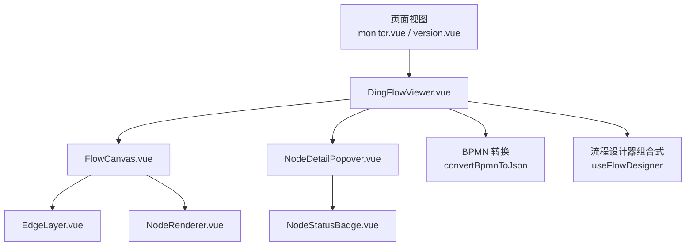
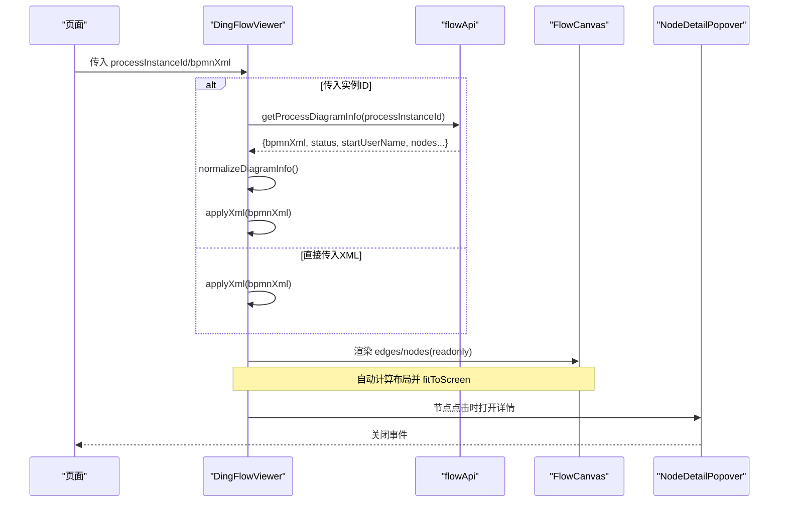
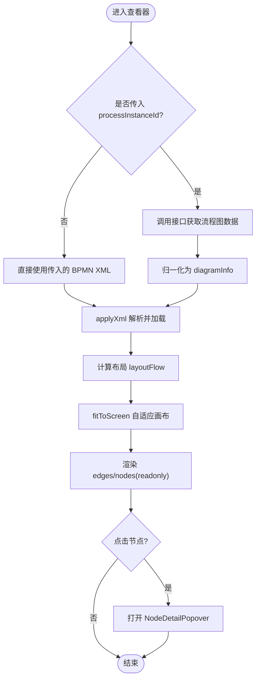
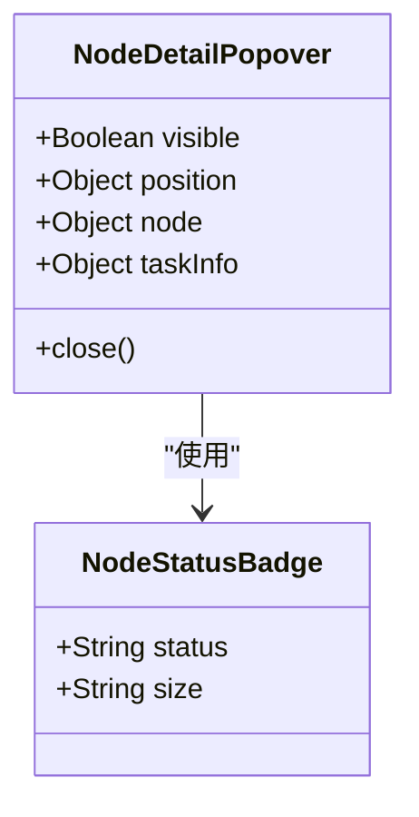
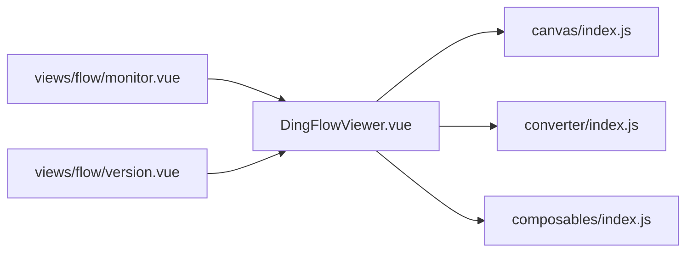

# 查看器系统

<cite>
**本文引用的文件**
- [DingFlowViewer.vue](file://forge-admin-ui/src/components/flow-designer/viewer/DingFlowViewer.vue)
- [NodeDetailPopover.vue](file://forge-admin-ui/src/components/flow-designer/viewer/NodeDetailPopover.vue)
- [NodeStatusBadge.vue](file://forge-admin-ui/src/components/flow-designer/viewer/NodeStatusBadge.vue)
- [viewer/index.js](file://forge-admin-ui/src/components/flow-designer/viewer/index.js)
- [canvas/index.js](file://forge-admin-ui/src/components/flow-designer/canvas/index.js)
- [FlowCanvas.vue](file://forge-admin-ui/src/components/flow-designer/canvas/FlowCanvas.vue)
- [FlowCanvas.spec.js](file://forge-admin-ui/src/components/flow-designer/canvas/__tests__/FlowCanvas.spec.js)
- [monitor.vue](file://forge-admin-ui/src/views/flow/monitor.vue)
- [version.vue](file://forge-admin-ui/src/views/flow/version.vue)
- [lowcode-runtime.js](file://forge-h5-ui/src/utils/lowcode-runtime.js)
- [BusinessPermissionService.java](file://forge-server/forge-framework/forge-plugin-parent/forge-plugin-generator/src/main/java/com/mdframe/forge/plugin/generator/service/businessapp/BusinessPermissionService.java)
- [FlowApplicationPermissionAdapter.java](file://forge-server/forge-flow/forge-flow-server/src/main/java/com/mdframe/forge/flow/bridge/FlowApplicationPermissionAdapter.java)
</cite>

## 目录
1. [简介](#简介)
2. [项目结构](#项目结构)
3. [核心组件](#核心组件)
4. [架构总览](#架构总览)
5. [详细组件分析](#详细组件分析)
6. [依赖关系分析](#依赖关系分析)
7. [性能考虑](#性能考虑)
8. [故障排查指南](#故障排查指南)
9. [结论](#结论)
10. [附录](#附录)

## 简介
本技术文档聚焦于工作流设计器的“只读查看器”子系统，围绕 DingFlowViewer 查看器、节点详情弹窗与状态徽章等核心能力展开。内容涵盖流程图展示模式、节点信息查看、执行状态显示、渲染优化、交互限制、权限控制机制、配置选项、主题定制与集成使用方法，并提供性能优化建议与用户体验改进方案。该查看器以钉钉风格呈现，支持紧凑模式、缩放浏览、点击节点弹出详情、自动适配画布等特性，适用于流程监控、审批记录、版本预览等多种业务场景。

## 项目结构
查看器子系统位于前端工程 forge-admin-ui 的 flow-designer 模块中，采用分层组织：
- 查看器层：DingFlowViewer、NodeDetailPopover、NodeStatusBadge
- 画布层：FlowCanvas、EdgeLayer、NodeRenderer、布局引擎
- 转换器与组合式逻辑：BPMN XML 转 JSON、流程设计器组合式 API
- 页面集成：监控、完成、待办、版本等视图通过 props 接入查看器

图表来源
- [DingFlowViewer.vue:22-32](file://forge-admin-ui/src/components/flow-designer/viewer/DingFlowViewer.vue#L22-L32)
- [canvas/index.js:15-26](file://forge-admin-ui/src/components/flow-designer/canvas/index.js#L15-L26)
- [FlowCanvas.vue:166-196](file://forge-admin-ui/src/components/flow-designer/canvas/FlowCanvas.vue#L166-L196)

章节来源
- [viewer/index.js:1-12](file://forge-admin-ui/src/components/flow-designer/viewer/index.js#L1-L12)
- [canvas/index.js:1-26](file://forge-admin-ui/src/components/flow-designer/canvas/index.js#L1-L26)

## 核心组件
- DingFlowViewer：只读查看器主容器，负责数据加载、状态映射、XML 解析、画布自适应、节点点击与详情气泡联动。
- NodeDetailPopover：节点详情气泡，展示处理人、开始/完成时间、结果与审批意见。
- NodeStatusBadge：独立的状态徽章组件，用于列表或汇总场景中的节点状态展示。
- FlowCanvas：只读画布容器，提供缩放、平移、工具栏、插槽（edges/nodes）与 readonly/allowNavigation 行为控制。

章节来源
- [DingFlowViewer.vue:34-41](file://forge-admin-ui/src/components/flow-designer/viewer/DingFlowViewer.vue#L34-L41)
- [NodeDetailPopover.vue:23-28](file://forge-admin-ui/src/components/flow-designer/viewer/NodeDetailPopover.vue#L23-L28)
- [NodeStatusBadge.vue:14-17](file://forge-admin-ui/src/components/flow-designer/viewer/NodeStatusBadge.vue#L14-L17)
- [FlowCanvas.vue:166-196](file://forge-admin-ui/src/components/flow-designer/canvas/FlowCanvas.vue#L166-L196)

## 架构总览
查看器采用“数据归一化 + 只读渲染 + 轻量交互”的架构：
- 数据归一化：将后端多种字段格式统一为内部 nodeInstanceList 与标准化状态。
- 只读渲染：基于 FlowCanvas 的 readonly 模式，禁用编辑操作，仅允许导航缩放。
- 轻量交互：点击节点弹出详情气泡；顶部状态条展示整体流程状态与发起人。

图表来源
- [DingFlowViewer.vue:123-159](file://forge-admin-ui/src/components/flow-designer/viewer/DingFlowViewer.vue#L123-L159)
- [DingFlowViewer.vue:298-311](file://forge-admin-ui/src/components/flow-designer/viewer/DingFlowViewer.vue#L298-L311)
- [DingFlowViewer.vue:341-381](file://forge-admin-ui/src/components/flow-designer/viewer/DingFlowViewer.vue#L341-L381)
- [FlowCanvas.vue:166-196](file://forge-admin-ui/src/components/flow-designer/canvas/FlowCanvas.vue#L166-L196)

## 详细组件分析

### DingFlowViewer 查看器
职责与特性
- 数据源切换：支持 processInstanceId 自动拉取，或直接传入 bpmnXml/nodeInstanceList/nodes/nodeStatuses。
- 状态归一化：兼容多种后端字段名与状态值，统一为 running/pending/completed/rejected/skipped。
- 画布自适应：监听 flowJson 变化，计算布局后调用 fitToScreen，compact 模式下调整顶部留白。
- 交互限制：readonly=true，allowNavigation=true，仅可缩放与平移，不可编辑。
- 节点详情：点击节点定位到屏幕坐标，弹出 NodeDetailPopover，展示任务实例信息。
- 错误与加载：loading 遮罩与 renderError 提示，emit ready/error 事件供上层处理。

关键实现要点
- 数据加载与归一化：loadFromApi、normalizeDiagramInfo、extractNodeInstances、normalizeNodeInstance、normalizeNodeStatus、normalizeProcessStatus。
- 布局与适配：watch flowJson -> layoutFlow -> scheduleFitView -> fitViewerToScreen。
- 节点点击与详情：handleNodeClick、popoverTaskInfo、getNodeStatus。
- 模板渲染：FlowCanvas 插槽 edges/nodes，NodeRenderer 透传 status/readonly。

图表来源
- [DingFlowViewer.vue:123-159](file://forge-admin-ui/src/components/flow-designer/viewer/DingFlowViewer.vue#L123-L159)
- [DingFlowViewer.vue:298-311](file://forge-admin-ui/src/components/flow-designer/viewer/DingFlowViewer.vue#L298-L311)
- [DingFlowViewer.vue:341-381](file://forge-admin-ui/src/components/flow-designer/viewer/DingFlowViewer.vue#L341-L381)

章节来源
- [DingFlowViewer.vue:34-41](file://forge-admin-ui/src/components/flow-designer/viewer/DingFlowViewer.vue#L34-L41)
- [DingFlowViewer.vue:79-119](file://forge-admin-ui/src/components/flow-designer/viewer/DingFlowViewer.vue#L79-L119)
- [DingFlowViewer.vue:123-159](file://forge-admin-ui/src/components/flow-designer/viewer/DingFlowViewer.vue#L123-L159)
- [DingFlowViewer.vue:150-296](file://forge-admin-ui/src/components/flow-designer/viewer/DingFlowViewer.vue#L150-L296)
- [DingFlowViewer.vue:341-381](file://forge-admin-ui/src/components/flow-designer/viewer/DingFlowViewer.vue#L341-L381)
- [DingFlowViewer.vue:414-484](file://forge-admin-ui/src/components/flow-designer/viewer/DingFlowViewer.vue#L414-L484)

### NodeDetailPopover 节点详情弹窗
职责与特性
- 定位与尺寸：根据传入 position 计算 left/top，动态宽度与最大高度，避免溢出视口。
- 内容展示：标题（节点名）、状态徽章、处理人、开始/完成时间、结果、审批意见。
- 交互：点击外部区域关闭，右上角关闭按钮关闭。
- 样式：卡片式面板，响应式布局，移动端适配。

图表来源
- [NodeDetailPopover.vue:23-28](file://forge-admin-ui/src/components/flow-designer/viewer/NodeDetailPopover.vue#L23-L28)
- [NodeStatusBadge.vue:14-17](file://forge-admin-ui/src/components/flow-designer/viewer/NodeStatusBadge.vue#L14-L17)

章节来源
- [NodeDetailPopover.vue:35-50](file://forge-admin-ui/src/components/flow-designer/viewer/NodeDetailPopover.vue#L35-L50)
- [NodeDetailPopover.vue:52-76](file://forge-admin-ui/src/components/flow-designer/viewer/NodeDetailPopover.vue#L52-L76)
- [NodeDetailPopover.vue:103-115](file://forge-admin-ui/src/components/flow-designer/viewer/NodeDetailPopover.vue#L103-L115)
- [NodeDetailPopover.vue:118-160](file://forge-admin-ui/src/components/flow-designer/viewer/NodeDetailPopover.vue#L118-L160)

### NodeStatusBadge 状态徽章
职责与特性
- 状态映射：completed、running、pending、rejected、skipped 对应不同标签文案与样式类。
- 尺寸控制：tiny/small/medium 三种尺寸，便于在表格、列表或详情页中使用。
- 无状态时不渲染：当 status 为空时不输出任何内容。

章节来源
- [NodeStatusBadge.vue:19-35](file://forge-admin-ui/src/components/flow-designer/viewer/NodeStatusBadge.vue#L19-L35)
- [NodeStatusBadge.vue:38-46](file://forge-admin-ui/src/components/flow-designer/viewer/NodeStatusBadge.vue#L38-L46)

### FlowCanvas 画布容器
职责与特性
- 只读模式：readonly 下工具栏按钮禁用，但 allowNavigation 时可缩放与平移。
- 缩放与视图：暴露 zoomIn/zoomOut/resetView/fitToScreen/screenToCanvas/canvasToScreen。
- 插槽扩展：edges/nodes/toolbar 插槽，便于自定义连线与节点渲染。
- 测试覆盖：单元测试验证基础渲染、插槽、方法暴露与 readonly 行为。

章节来源
- [FlowCanvas.vue:166-196](file://forge-admin-ui/src/components/flow-designer/canvas/FlowCanvas.vue#L166-L196)
- [FlowCanvas.spec.js:27-76](file://forge-admin-ui/src/components/flow-designer/canvas/__tests__/FlowCanvas.spec.js#L27-L76)

## 依赖关系分析
查看器对画布层与转换器存在强依赖，同时与页面视图松耦合：
- 查看器依赖 canvas/index.js 导出的 FlowCanvas、EdgeLayer、NodeRenderer、layoutFlow。
- 查看器依赖 converter 的 convertBpmnToJson 进行 XML 解析。
- 查看器依赖 useFlowDesigner 管理流程模型与选中节点。
- 页面视图通过 props 注入 processInstanceId/bpmnXml/compact，解耦数据源。

图表来源
- [DingFlowViewer.vue:22-32](file://forge-admin-ui/src/components/flow-designer/viewer/DingFlowViewer.vue#L22-L32)
- [canvas/index.js:15-26](file://forge-admin-ui/src/components/flow-designer/canvas/index.js#L15-L26)
- [monitor.vue:260-335](file://forge-admin-ui/src/views/flow/monitor.vue#L260-L335)
- [version.vue:81-81](file://forge-admin-ui/src/views/flow/version.vue#L81-L81)

章节来源
- [canvas/index.js:1-26](file://forge-admin-ui/src/components/flow-designer/canvas/index.js#L1-L26)
- [monitor.vue:260-335](file://forge-admin-ui/src/views/flow/monitor.vue#L260-L335)
- [version.vue:81-81](file://forge-admin-ui/src/views/flow/version.vue#L81-L81)

## 性能考虑
- 布局与自适应：使用 requestAnimationFrame 调度 fitToScreen，减少重排重绘开销；仅在 flowJson 变化时重新计算布局。
- 数据归一化：集中处理多字段兼容，避免重复解析；按时间戳去重保留最新节点实例。
- 只读渲染：readonly 模式禁用编辑交互，降低事件处理复杂度；allowNavigation 仅开启必要导航能力。
- 气泡定位：基于 DOM 元素 getBoundingClientRect 计算位置，避免复杂坐标系转换；必要时可结合 viewport 缩放修正。
- 主题与样式：使用 Tailwind 原子类与 scoped 样式，减少全局污染；紧凑模式减小最小高度与顶部留白。

[本节为通用性能讨论，不直接分析具体文件]

## 故障排查指南
常见问题与定位
- 流程图加载失败：检查接口返回码与 data 结构；查看 renderError 与 console 日志；确认 normalizeDiagramInfo 是否正确解析字段。
- BPMN XML 解析失败：确认 XML 格式正确；查看 convertBpmnToJson 异常堆栈；必要时降级为默认空流程。
- 节点详情未显示：确认 nodeStatusMap 是否包含目标节点；检查 getNodeStatus 与 popoverTaskInfo 返回值；确保 handleNodeClick 能定位到 DOM 元素。
- 画布无法自适应：检查 containerRef 是否存在；确认 layoutResult.canvasBounds 有效；验证 fitToScreen 参数。

章节来源
- [DingFlowViewer.vue:123-159](file://forge-admin-ui/src/components/flow-designer/viewer/DingFlowViewer.vue#L123-L159)
- [DingFlowViewer.vue:298-311](file://forge-admin-ui/src/components/flow-designer/viewer/DingFlowViewer.vue#L298-L311)
- [DingFlowViewer.vue:341-381](file://forge-admin-ui/src/components/flow-designer/viewer/DingFlowViewer.vue#L341-L381)

## 结论
查看器系统以 DingFlowViewer 为核心，结合 FlowCanvas 的只读渲染能力与 NodeDetailPopover 的轻量交互，提供了稳定、可扩展的流程可视化体验。通过数据归一化、布局自适应与紧凑模式，满足监控、历史查看、版本预览等多场景需求。配合权限控制与主题定制，可在企业级应用中安全、一致地展示流程运行状态。

[本节为总结性内容，不直接分析具体文件]

## 附录

### 配置选项与集成用法
- 查看器 Props
  - processInstanceId：流程实例 ID，自动拉取流程图与节点状态。
  - bpmnXml：直接传入 BPMN XML，跳过接口请求。
  - nodeInstanceList/nodes/nodeStatuses：直接传入节点实例或状态，兼容多种后端格式。
  - compact：紧凑模式，隐藏顶部状态条并调整最小高度与初始缩放。
- 页面集成示例
  - 监控页：在模态框或折叠面板中嵌入查看器，传入 processInstanceId 与 compact。
  - 版本页：传入 bpmnXml 直接渲染版本流程图。
- 事件与暴露
  - ready/error：加载成功/失败事件。
  - 暴露方法：applyXml/loadFromApi/fitViewerToScreen，便于外部控制。

章节来源
- [DingFlowViewer.vue:34-41](file://forge-admin-ui/src/components/flow-designer/viewer/DingFlowViewer.vue#L34-L41)
- [DingFlowViewer.vue:401-411](file://forge-admin-ui/src/components/flow-designer/viewer/DingFlowViewer.vue#L401-L411)
- [monitor.vue:260-335](file://forge-admin-ui/src/views/flow/monitor.vue#L260-L335)
- [version.vue:81-81](file://forge-admin-ui/src/views/flow/version.vue#L81-L81)

### 权限控制机制
- 前端只读：查看器本身为只读渲染，不触发写操作；如需控制查看入口，应在页面层依据权限决定是否展示查看器。
- 后端权限：业务流程服务提供 VIEW_FLOW 等动作权限解析；Flow 服务不直接提供应用权限管理能力，权限由 Admin 服务统一管理。
- 运行时权限：H5 运行时支持 flowInteraction 配置，包括 approvalActions、nodePermissions、callbacks 等，可用于控制底部操作与节点可见性。

章节来源
- [BusinessPermissionService.java:84-117](file://forge-server/forge-framework/forge-plugin-parent/forge-plugin-generator/src/main/java/com/mdframe/forge/plugin/generator/service/businessapp/BusinessPermissionService.java#L84-L117)
- [FlowApplicationPermissionAdapter.java:10-45](file://forge-server/forge-flow/forge-flow-server/src/main/java/com/mdframe/forge/flow/bridge/FlowApplicationPermissionAdapter.java#L10-L45)
- [lowcode-runtime.js:217-241](file://forge-h5-ui/src/utils/lowcode-runtime.js#L217-L241)
- [lowcode-runtime.js:352-382](file://forge-h5-ui/src/utils/lowcode-runtime.js#L352-L382)

### 主题定制与样式
- 设计系统：基于 Flat Design，主色调 Indigo 系列，背景与表面色明确，文本颜色层次清晰。
- 查看器样式：使用 Tailwind 原子类与 scoped CSS，紧凑模式调整最小高度与顶部留白；气泡面板响应式布局，移动端适配。
- 暗黑主题：报告 UI 提供 useDarkThemeHook，可按需切换主题；查看器样式可通过主题变量或覆盖样式实现一致性。

章节来源
- [design-system/MASTER.md:14-64](file://design-system/MASTER.md#L14-L64)
- [DingFlowViewer.vue:414-503](file://forge-admin-ui/src/components/flow-designer/viewer/DingFlowViewer.vue#L414-L503)
- [NodeDetailPopover.vue:163-286](file://forge-admin-ui/src/components/flow-designer/viewer/NodeDetailPopover.vue#L163-L286)
- [useTheme.hook.ts:84-125](file://forge-report-ui/src/hooks/useTheme.hook.ts#L84-L125)

### 使用建议与最佳实践
- 优先使用 processInstanceId 自动加载，便于统一状态与节点信息；仅在离线或预览场景传入 bpmnXml。
- 在监控页使用 compact 模式节省空间；在独立模态框中可关闭紧凑模式以获得更完整信息。
- 对大数据量流程图，建议在父组件做防抖与懒加载，避免频繁触发 fitToScreen。
- 结合权限控制，在页面层决定查看器可见性；对敏感流程可增加二次确认或审计日志。

[本节为通用建议，不直接分析具体文件]