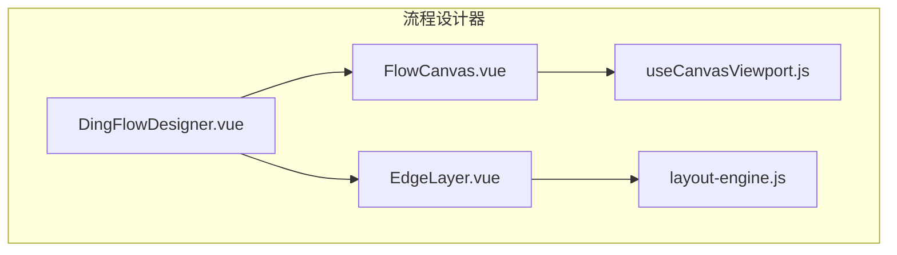
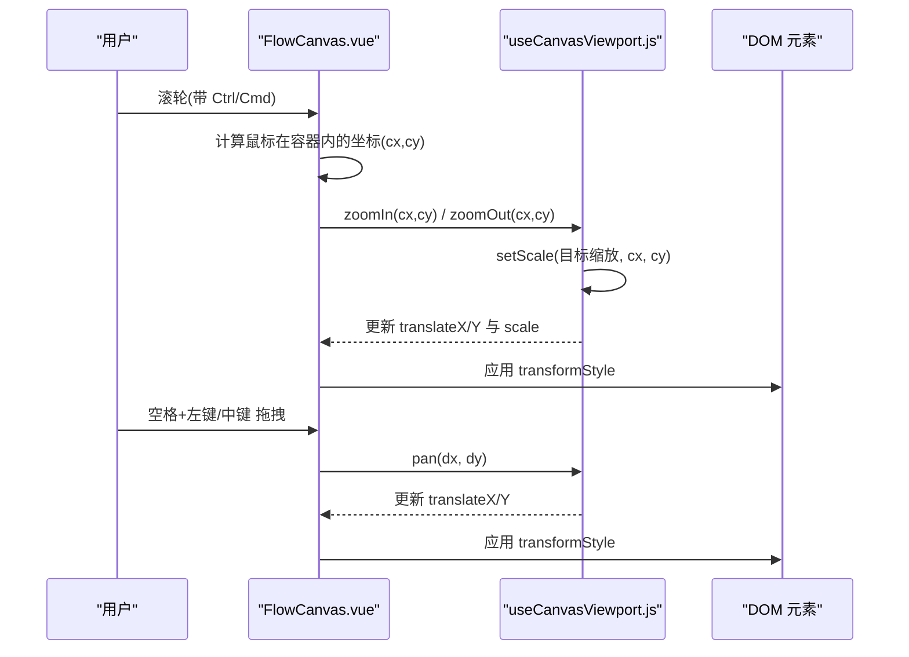
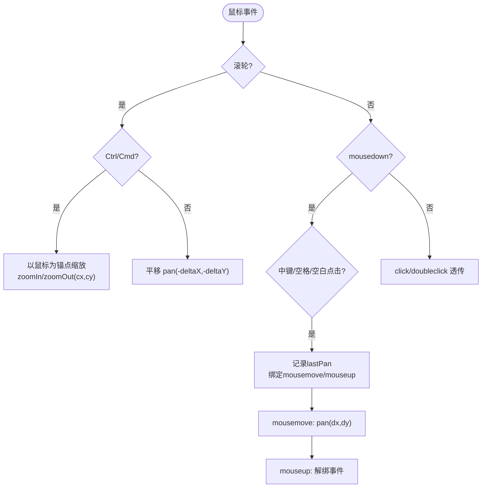
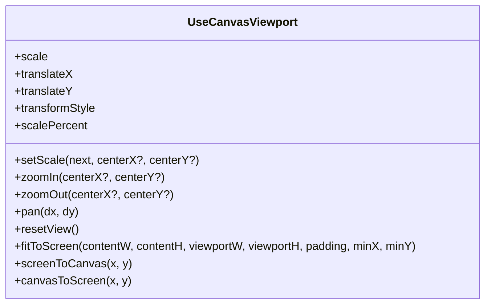
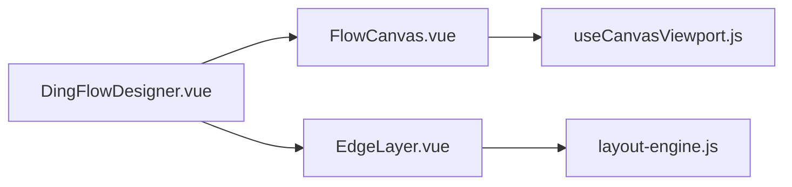

# FlowCanvas主画布组件

<cite>
**本文引用的文件**
- [FlowCanvas.vue](file://forge-admin-ui/src/components/flow-designer/canvas/FlowCanvas.vue)
- [useCanvasViewport.js](file://forge-admin-ui/src/components/flow-designer/composables/useCanvasViewport.js)
- [FlowCanvas.spec.js](file://forge-admin-ui/src/components/flow-designer/canvas/__tests__/FlowCanvas.spec.js)
- [useCanvasViewport.spec.js](file://forge-admin-ui/src/components/flow-designer/composables/__tests__/useCanvasViewport.spec.js)
- [DingFlowDesigner.vue](file://forge-admin-ui/src/components/flow-designer/DingFlowDesigner.vue)
- [EdgeLayer.vue](file://forge-admin-ui/src/components/flow-designer/canvas/EdgeLayer.vue)
- [layout-engine.js](file://forge-admin-ui/src/components/flow-designer/canvas/layout-engine.js)
</cite>

## 目录
1. [简介](#简介)
2. [项目结构](#项目结构)
3. [核心组件](#核心组件)
4. [架构总览](#架构总览)
5. [详细组件分析](#详细组件分析)
6. [依赖关系分析](#依赖关系分析)
7. [性能考量](#性能考量)
8. [故障排查指南](#故障排查指南)
9. [结论](#结论)
10. [附录](#附录)

## 简介
FlowCanvas 是流程设计器中的主画布容器，负责提供可缩放、可平移的画布视口，统一处理鼠标滚轮缩放（Ctrl/Cmd + 滚轮）、空格键拖拽平移、中键拖拽平移等交互，并提供坐标转换与视图适配能力。它通过组合 useCanvasViewport 实现变换系统，并通过 slots 暴露 edges/nodes/toolbar 插槽以承载连线层、节点层和工具栏。

## 项目结构
FlowCanvas 位于 flow-designer 模块的 canvas 目录下，配合 composables 下的 useCanvasViewport 实现画布变换逻辑；上层由 DingFlowDesigner 组合使用，将 EdgeLayer 与 NodeRenderer 等渲染到 FlowCanvas 的 slots 中。

图表来源
- [DingFlowDesigner.vue:680-718](file://forge-admin-ui/src/components/flow-designer/DingFlowDesigner.vue#L680-L718)
- [FlowCanvas.vue:166-196](file://forge-admin-ui/src/components/flow-designer/canvas/FlowCanvas.vue#L166-L196)
- [useCanvasViewport.js:30-126](file://forge-admin-ui/src/components/flow-designer/composables/useCanvasViewport.js#L30-L126)
- [EdgeLayer.vue:18-38](file://forge-admin-ui/src/components/flow-designer/canvas/EdgeLayer.vue#L18-L38)
- [layout-engine.js:79-111](file://forge-admin-ui/src/components/flow-designer/canvas/layout-engine.js#L79-L111)

章节来源
- [FlowCanvas.vue:1-262](file://forge-admin-ui/src/components/flow-designer/canvas/FlowCanvas.vue#L1-L262)
- [useCanvasViewport.js:1-133](file://forge-admin-ui/src/components/flow-designer/composables/useCanvasViewport.js#L1-L133)
- [DingFlowDesigner.vue:680-718](file://forge-admin-ui/src/components/flow-designer/DingFlowDesigner.vue#L680-L718)

## 核心组件
- FlowCanvas：画布容器与交互入口，封装滚轮缩放、拖拽平移、键盘事件、双击重置、工具栏按钮等。
- useCanvasViewport：画布变换状态机，维护 scale、translateX、translateY，提供 setScale、zoomIn、zoomOut、pan、resetView、fitToScreen、screenToCanvas、canvasToScreen 等方法，并生成 transformStyle。
- 上层集成：DingFlowDesigner 将 EdgeLayer 与 NodeRenderer 注入 FlowCanvas 的 slots，并在初始化时调用 fitToScreen 完成自适应。

章节来源
- [FlowCanvas.vue:26-60](file://forge-admin-ui/src/components/flow-designer/canvas/FlowCanvas.vue#L26-L60)
- [useCanvasViewport.js:30-126](file://forge-admin-ui/src/components/flow-designer/composables/useCanvasViewport.js#L30-L126)
- [DingFlowDesigner.vue:680-718](file://forge-admin-ui/src/components/flow-designer/DingFlowDesigner.vue#L680-L718)

## 架构总览
FlowCanvas 作为“容器+交互”层，不关心具体节点与连线的绘制细节，仅通过 slots 渲染 edges/nodes，并使用 transformStyle 驱动整体缩放和平移。useCanvasViewport 提供纯函数式 API 与响应式状态，保证行为可测试、可复用。

图表来源
- [FlowCanvas.vue:63-116](file://forge-admin-ui/src/components/flow-designer/canvas/FlowCanvas.vue#L63-L116)
- [useCanvasViewport.js:56-79](file://forge-admin-ui/src/components/flow-designer/composables/useCanvasViewport.js#L56-L79)

## 详细组件分析

### FlowCanvas 组件
- 职责
  - 提供 transform 缩放/平移容器（canvas-transform）。
  - 处理滚轮缩放（Ctrl/Cmd + 滚轮）与滚动平移（无修饰键）。
  - 支持空格键拖拽平移、中键拖拽平移。
  - 双击空白区域触发 resetView（或透传事件）。
  - 内置浮动工具栏（缩小/放大/适应），支持 readonly/allowNavigation 控制。
  - 暴露方法：resetView、fitToScreen、zoomIn、zoomOut、setScale、screenToCanvas、canvasToScreen、viewport、containerRef。
- 关键实现要点
  - 滚轮事件：根据是否按下 Ctrl/Cmd 决定缩放或平移；缩放时使用鼠标位置为锚点。
  - 拖拽平移：记录 lastPan，mousemove 计算 dx/dy 调用 pan。
  - 键盘事件：监听 Space 键切换 isSpaceDown，影响光标样式与拖拽判定。
  - 插槽：edges、nodes、toolbar；toolbar 不受 transform 影响。
  - 样式：背景网格、工具栏样式、禁用态与过渡动画。

图表来源
- [FlowCanvas.vue:63-116](file://forge-admin-ui/src/components/flow-designer/canvas/FlowCanvas.vue#L63-L116)
- [FlowCanvas.vue:120-141](file://forge-admin-ui/src/components/flow-designer/canvas/FlowCanvas.vue#L120-L141)
- [FlowCanvas.vue:145-163](file://forge-admin-ui/src/components/flow-designer/canvas/FlowCanvas.vue#L145-L163)

章节来源
- [FlowCanvas.vue:26-60](file://forge-admin-ui/src/components/flow-designer/canvas/FlowCanvas.vue#L26-L60)
- [FlowCanvas.vue:63-116](file://forge-admin-ui/src/components/flow-designer/canvas/FlowCanvas.vue#L63-L116)
- [FlowCanvas.vue:120-141](file://forge-admin-ui/src/components/flow-designer/canvas/FlowCanvas.vue#L120-L141)
- [FlowCanvas.vue:145-163](file://forge-admin-ui/src/components/flow-designer/canvas/FlowCanvas.vue#L145-L163)
- [FlowCanvas.vue:166-196](file://forge-admin-ui/src/components/flow-designer/canvas/FlowCanvas.vue#L166-L196)
- [FlowCanvas.vue:198-262](file://forge-admin-ui/src/components/flow-designer/canvas/FlowCanvas.vue#L198-L262)

### 变换系统与视口管理（useCanvasViewport）
- 状态
  - scale：缩放比例，受 minScale/maxScale 限制。
  - translateX/translateY：画布偏移（屏幕坐标系，未缩放）。
  - transformStyle：computed 生成的 CSS transform 字符串。
  - scalePercent：百分比显示值。
- 核心方法
  - setScale(next, centerX?, centerY?)：以指定屏幕坐标为锚点进行缩放，避免画布跳跃。
  - zoomIn()/zoomOut()：按步长调整缩放。
  - pan(dx, dy)：相对平移。
  - resetView()：回到初始状态。
  - fitToScreen(contentW, contentH, viewportW, viewportH, padding=40, minX=0, minY=0)：内容居中并按比例缩放到适应视口。
  - screenToCanvas(x, y)/canvasToScreen(x, y)：屏幕与画布坐标互逆转换。
- 复杂度与性能
  - 所有操作均为 O(1)，无额外数据结构遍历。
  - 浮点累积修正 roundStep(v) 保留两位小数，避免精度漂移。
  - 通过 computed 生成 transformStyle，减少重复计算。

图表来源
- [useCanvasViewport.js:30-126](file://forge-admin-ui/src/components/flow-designer/composables/useCanvasViewport.js#L30-L126)

章节来源
- [useCanvasViewport.js:1-133](file://forge-admin-ui/src/components/flow-designer/composables/useCanvasViewport.js#L1-L133)
- [useCanvasViewport.spec.js:1-107](file://forge-admin-ui/src/components/flow-designer/composables/__tests__/useCanvasViewport.spec.js#L1-L107)

### 坐标转换算法
- 屏幕→画布：x = (sx - translateX) / scale，y = (sy - translateY) / scale
- 画布→屏幕：sx = x * scale + translateX，sy = y * scale + translateY
- 这些公式在 screenToCanvas 与 canvasToScreen 中实现，且互为逆运算。

章节来源
- [useCanvasViewport.js:98-110](file://forge-admin-ui/src/components/flow-designer/composables/useCanvasViewport.js#L98-L110)

### 视口管理与自适应
- fitToScreen 根据内容与视口尺寸计算缩放比例，确保内容在视口中居中显示，且不放大超过 1。
- 上层组件（如 DingFlowViewer）在数据加载后调用 fitToScreen 完成自适应。

章节来源
- [useCanvasViewport.js:87-96](file://forge-admin-ui/src/components/flow-designer/composables/useCanvasViewport.js#L87-L96)
- [DingFlowDesigner.vue:668-672](file://forge-admin-ui/src/components/flow-designer/DingFlowDesigner.vue#L668-L672)

### 鼠标交互实现原理
- Ctrl/Cmd + 滚轮：以鼠标位置为锚点缩放，避免缩放中心跳变。
- 空格键 + 左键拖拽：进入平移模式，光标变为 grab/grabbing。
- 中键拖拽：直接平移。
- 普通滚轮：垂直滚动（含横向 deltaX）进行平移。
- 双击空白：触发 resetView（或透传事件给父级）。

章节来源
- [FlowCanvas.vue:63-116](file://forge-admin-ui/src/components/flow-designer/canvas/FlowCanvas.vue#L63-L116)
- [FlowCanvas.vue:120-141](file://forge-admin-ui/src/components/flow-designer/canvas/FlowCanvas.vue#L120-L141)
- [FlowCanvas.vue:145-163](file://forge-admin-ui/src/components/flow-designer/canvas/FlowCanvas.vue#L145-L163)

### 组件配置选项与暴露方法
- Props
  - minScale：最小缩放比例（默认 0.3）
  - maxScale：最大缩放比例（默认 2.0）
  - initialScale：初始缩放比例（默认 1）
  - readonly：只读模式，禁用导航交互
  - allowNavigation：只读模式下仍允许缩放浏览
- 暴露方法（defineExpose）
  - resetView、fitToScreen、zoomIn、zoomOut、setScale
  - screenToCanvas、canvasToScreen
  - viewport（完整 useCanvasViewport 返回值）
  - containerRef（容器 DOM 引用）

章节来源
- [FlowCanvas.vue:26-32](file://forge-admin-ui/src/components/flow-designer/canvas/FlowCanvas.vue#L26-L32)
- [FlowCanvas.vue:153-163](file://forge-admin-ui/src/components/flow-designer/canvas/FlowCanvas.vue#L153-L163)

### 使用示例与自定义扩展指南
- 基本用法
  - 在模板中使用 FlowCanvas，并通过 slots 插入 edges 与 nodes。
  - 通过 ref 获取实例，调用 zoomIn/zoomOut/resetView/fitToScreen 等方法。
- 工具栏集成
  - 使用内置工具栏或通过 slot="toolbar" 自定义。
  - 工具栏按钮受 navigationEnabled 控制（readonly/allowNavigation）。
- 自定义扩展
  - 通过 slots 扩展 edges/nodes 渲染逻辑。
  - 通过 expose 的方法与状态与外部系统集成（如快捷键、全局缩放同步）。

章节来源
- [DingFlowDesigner.vue:680-718](file://forge-admin-ui/src/components/flow-designer/DingFlowDesigner.vue#L680-L718)
- [FlowCanvas.vue:166-196](file://forge-admin-ui/src/components/flow-designer/canvas/FlowCanvas.vue#L166-L196)

### 画布样式定制
- 背景网格：通过 .flow-canvas 的背景渐变与径向渐变实现点阵效果。
- 工具栏样式：边框、阴影、按钮悬停态、禁用态、过渡动画。
- 无障碍与动效：prefers-reduced-motion 下禁用过渡。

章节来源
- [FlowCanvas.vue:198-262](file://forge-admin-ui/src/components/flow-designer/canvas/FlowCanvas.vue#L198-L262)

### 调试技巧
- 检查 transformStyle：确认 translate 与 scale 是否正确应用。
- 验证坐标转换：使用 screenToCanvas/canvasToScreen 进行互逆校验。
- 单元测试参考：查看 FlowCanvas.spec.js 与 useCanvasViewport.spec.js 的行为断言。

章节来源
- [FlowCanvas.spec.js:27-76](file://forge-admin-ui/src/components/flow-designer/canvas/__tests__/FlowCanvas.spec.js#L27-L76)
- [useCanvasViewport.spec.js:1-107](file://forge-admin-ui/src/components/flow-designer/composables/__tests__/useCanvasViewport.spec.js#L1-L107)

## 依赖关系分析
FlowCanvas 依赖 useCanvasViewport 提供变换能力；上层通过 DingFlowDesigner 组合渲染 EdgeLayer 与 NodeRenderer；EdgeLayer 依赖 layout-engine 输出的路径与边界信息。

图表来源
- [FlowCanvas.vue:23-25](file://forge-admin-ui/src/components/flow-designer/canvas/FlowCanvas.vue#L23-L25)
- [DingFlowDesigner.vue:680-718](file://forge-admin-ui/src/components/flow-designer/DingFlowDesigner.vue#L680-L718)
- [EdgeLayer.vue:18-38](file://forge-admin-ui/src/components/flow-designer/canvas/EdgeLayer.vue#L18-L38)
- [layout-engine.js:79-111](file://forge-admin-ui/src/components/flow-designer/canvas/layout-engine.js#L79-L111)

章节来源
- [FlowCanvas.vue:23-25](file://forge-admin-ui/src/components/flow-designer/canvas/FlowCanvas.vue#L23-L25)
- [DingFlowDesigner.vue:680-718](file://forge-admin-ui/src/components/flow-designer/DingFlowDesigner.vue#L680-L718)
- [EdgeLayer.vue:18-38](file://forge-admin-ui/src/components/flow-designer/canvas/EdgeLayer.vue#L18-L38)
- [layout-engine.js:79-111](file://forge-admin-ui/src/components/flow-designer/canvas/layout-engine.js#L79-L111)

## 性能考量
- 变换系统采用 CSS transform，GPU 加速友好，避免重排重绘。
- 坐标转换与缩放计算为 O(1)，无复杂循环。
- 浮点精度修正避免累积误差导致的抖动。
- 视口自适应仅在必要时调用 fitToScreen，避免频繁重算。
- 建议：大量节点场景下，结合虚拟滚动或按需渲染策略进一步降低 DOM 压力。

[本节为通用性能指导，不直接分析具体文件]

## 故障排查指南
- 缩放无效
  - 检查 readonly 与 allowNavigation 配置；navigationEnabled 为 false 时禁用导航。
  - 确认容器尺寸有效（getBoundingClientRect 返回宽高）。
- 平移异常
  - 检查 mousedown/mousemove/mouseup 事件绑定与解绑是否正确。
  - 确认 lastPan 记录与 dx/dy 计算无误。
- 坐标转换错误
  - 使用 screenToCanvas/canvasToScreen 进行互逆校验。
  - 检查当前 scale 与 translateX/Y 是否符合预期。
- 工具栏按钮不可用
  - 检查 readonly/allowNavigation 对 navigationEnabled 的影响。

章节来源
- [FlowCanvas.vue:63-116](file://forge-admin-ui/src/components/flow-designer/canvas/FlowCanvas.vue#L63-L116)
- [FlowCanvas.vue:120-141](file://forge-admin-ui/src/components/flow-designer/canvas/FlowCanvas.vue#L120-L141)
- [FlowCanvas.vue:166-196](file://forge-admin-ui/src/components/flow-designer/canvas/FlowCanvas.vue#L166-L196)
- [useCanvasViewport.js:56-96](file://forge-admin-ui/src/components/flow-designer/composables/useCanvasViewport.js#L56-L96)

## 结论
FlowCanvas 以简洁的容器与交互职责，结合 useCanvasViewport 的变换系统，提供了稳定、可扩展的画布能力。其鼠标交互覆盖主流操作（Ctrl/Cmd 缩放、空格/中键平移），并通过 slots 与 expose 方法实现良好的集成与扩展性。配合上层布局引擎与渲染层，能够支撑复杂的流程图设计与查看场景。

[本节为总结性内容，不直接分析具体文件]

## 附录
- 相关组件与文件
  - FlowCanvas.vue：画布容器与交互
  - useCanvasViewport.js：变换状态与方法
  - EdgeLayer.vue：SVG 连线层
  - layout-engine.js：布局与边界计算
  - DingFlowDesigner.vue：组合与自适应

章节来源
- [FlowCanvas.vue:1-262](file://forge-admin-ui/src/components/flow-designer/canvas/FlowCanvas.vue#L1-L262)
- [useCanvasViewport.js:1-133](file://forge-admin-ui/src/components/flow-designer/composables/useCanvasViewport.js#L1-L133)
- [EdgeLayer.vue:1-38](file://forge-admin-ui/src/components/flow-designer/canvas/EdgeLayer.vue#L1-L38)
- [layout-engine.js:79-111](file://forge-admin-ui/src/components/flow-designer/canvas/layout-engine.js#L79-L111)
- [DingFlowDesigner.vue:668-718](file://forge-admin-ui/src/components/flow-designer/DingFlowDesigner.vue#L668-L718)