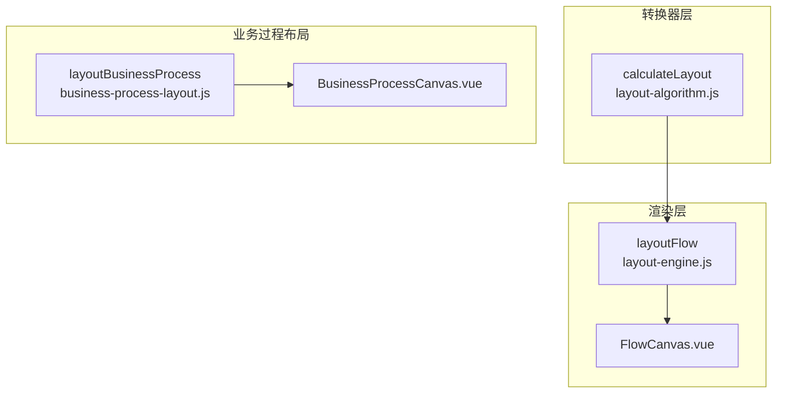
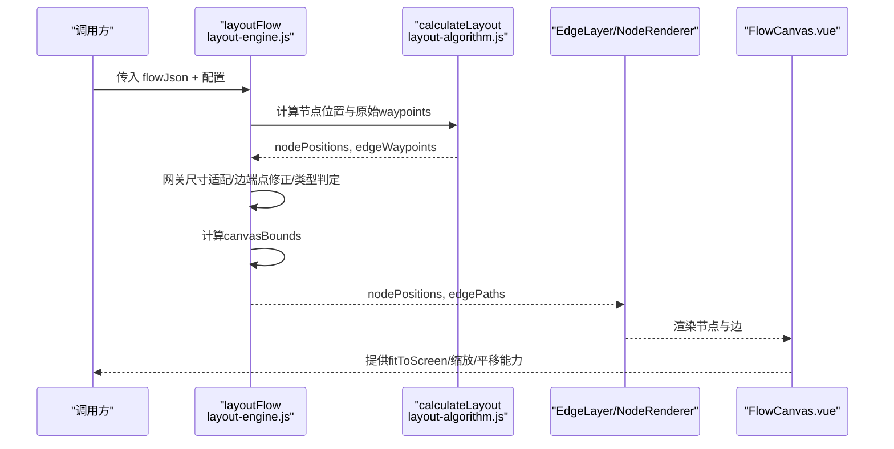
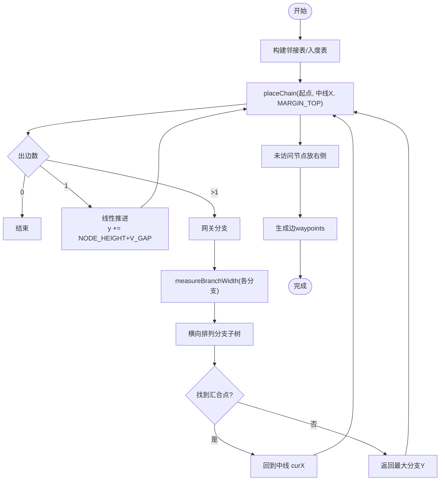
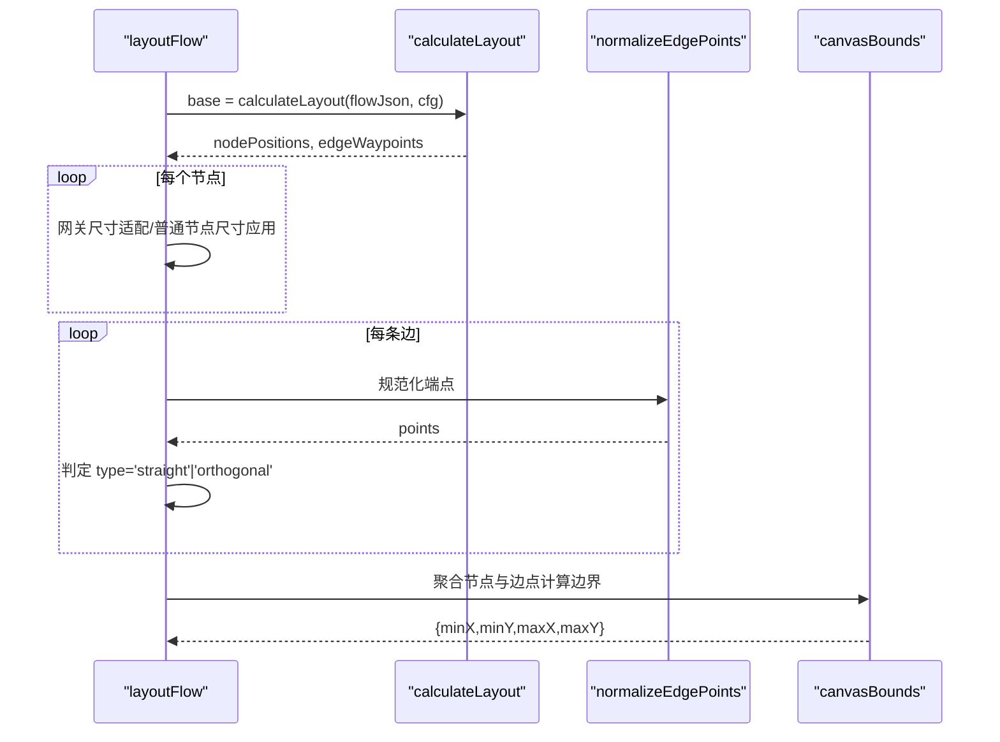
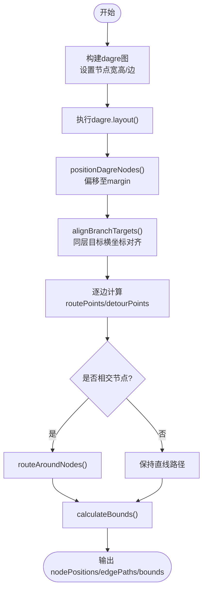
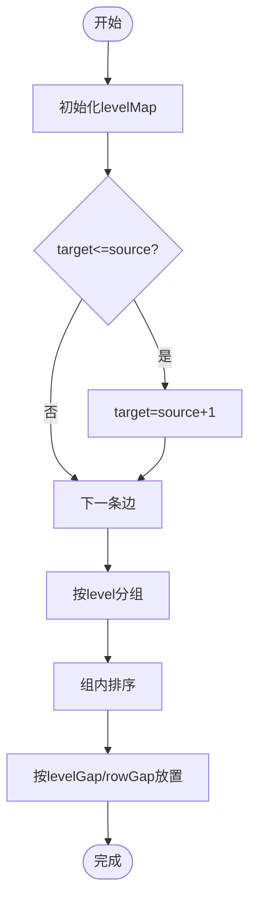
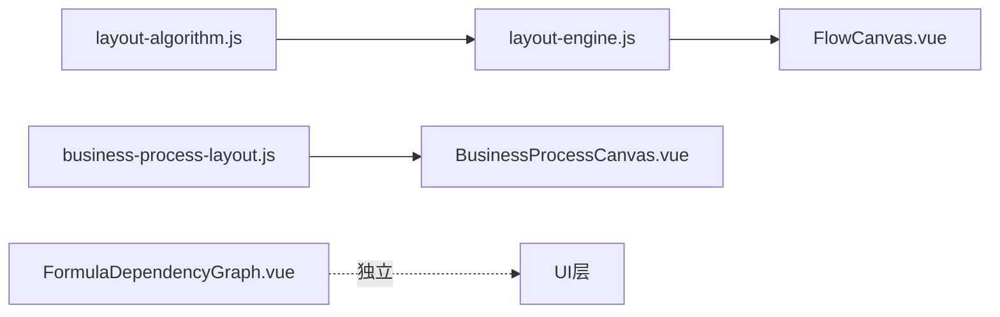

# 布局引擎

<cite>
**本文引用的文件**
- [layout-algorithm.js](file://forge-admin-ui/src/components/flow-designer/converter/layout-algorithm.js)
- [layout-engine.js](file://forge-admin-ui/src/components/flow-designer/canvas/layout-engine.js)
- [business-process-layout.js](file://forge-admin-ui/src/components/business-process-designer/business-process-layout.js)
- [FlowCanvas.vue](file://forge-admin-ui/src/components/flow-designer/canvas/FlowCanvas.vue)
- [BusinessProcessCanvas.vue](file://forge-admin-ui/src/components/business-process-designer/BusinessProcessCanvas.vue)
- [FormulaDependencyGraph.vue](file://forge-admin-ui/src/views/app-center/components/designer/formula/FormulaDependencyGraph.vue)
- [layout-algorithm.spec.js](file://forge-admin-ui/src/components/flow-designer/converter/__tests__/layout-algorithm.spec.js)
- [layout-engine.spec.js](file://forge-admin-ui/src/components/flow-designer/canvas/__tests__/layout-engine.spec.js)
</cite>

## 目录
1. [简介](#简介)
2. [项目结构](#项目结构)
3. [核心组件](#核心组件)
4. [架构总览](#架构总览)
5. [详细组件分析](#详细组件分析)
6. [依赖关系分析](#依赖关系分析)
7. [性能与优化](#性能与优化)
8. [故障排查指南](#故障排查指南)
9. [结论](#结论)
10. [附录](#附录)

## 简介
本技术文档聚焦工作流布局引擎，系统性解析自动布局、手动布局、网格对齐等策略；深入说明节点位置计算、间距调整、冲突检测等关键技术；解释层次布局、径向布局等不同模式的特点与适用场景；并提供性能优化、缓存机制、自定义算法开发、配置选项、调试工具与最佳实践。

## 项目结构
仓库中与布局相关的关键模块分为三层：
- 转换器层（JSON→BPMN）：负责将流程模型转换为 BPMN Diagram 的坐标与连线折点。
- 渲染层（画布）：在 Canvas/SVG 上渲染节点与边，并计算可视范围以支持自适应缩放。
- 业务过程专用布局：基于 DAG 库进行分层与路径避让，适用于复杂业务图。

图表来源
- [layout-algorithm.js:1-45](file://forge-admin-ui/src/components/flow-designer/converter/layout-algorithm.js#L1-L45)
- [layout-engine.js:1-45](file://forge-admin-ui/src/components/flow-designer/canvas/layout-engine.js#L1-L45)
- [business-process-layout.js:1-45](file://forge-admin-ui/src/components/business-process-designer/business-process-layout.js#L1-L45)
- [FlowCanvas.vue:1-60](file://forge-admin-ui/src/components/flow-designer/canvas/FlowCanvas.vue#L1-L60)
- [BusinessProcessCanvas.vue:130-157](file://forge-admin-ui/src/components/business-process-designer/BusinessProcessCanvas.vue#L130-L157)

章节来源
- [layout-algorithm.js:1-45](file://forge-admin-ui/src/components/flow-designer/converter/layout-algorithm.js#L1-L45)
- [layout-engine.js:1-45](file://forge-admin-ui/src/components/flow-designer/canvas/layout-engine.js#L1-L45)
- [business-process-layout.js:1-45](file://forge-admin-ui/src/components/business-process-designer/business-process-layout.js#L1-L45)
- [FlowCanvas.vue:1-60](file://forge-admin-ui/src/components/flow-designer/canvas/FlowCanvas.vue#L1-L60)
- [BusinessProcessCanvas.vue:130-157](file://forge-admin-ui/src/components/business-process-designer/BusinessProcessCanvas.vue#L130-L157)

## 核心组件
- 自动布局算法（转换器层）：从 start 节点出发递归遍历，线性链纵向排列，网关分支横向展开，汇合点回归中线；生成节点位置与连线 waypoints。
- 渲染层布局引擎：复用转换器结果，适配画布尺寸（网关菱形锚点），规范化边端点，判定直线/折线类型，计算画布边界用于 fitToScreen。
- 业务过程布局：使用 DAG 分层，端口排序与多路并行路由，路径避障与自环处理，输出 edgePaths 与 canvasBounds。
- 公式依赖图布局：按层级分组后水平排布，适合依赖关系可视化。

章节来源
- [layout-algorithm.js:30-250](file://forge-admin-ui/src/components/flow-designer/converter/layout-algorithm.js#L30-L250)
- [layout-engine.js:34-110](file://forge-admin-ui/src/components/flow-designer/canvas/layout-engine.js#L34-L110)
- [business-process-layout.js:22-133](file://forge-admin-ui/src/components/business-process-designer/business-process-layout.js#L22-L133)
- [FormulaDependencyGraph.vue:217-261](file://forge-admin-ui/src/views/app-center/components/designer/formula/FormulaDependencyGraph.vue#L217-L261)

## 架构总览
下图展示了从流程 JSON 到画布渲染的完整数据流，以及不同布局器的职责边界。

图表来源
- [layout-engine.js:34-110](file://forge-admin-ui/src/components/flow-designer/canvas/layout-engine.js#L34-L110)
- [layout-algorithm.js:30-250](file://forge-admin-ui/src/components/flow-designer/converter/layout-algorithm.js#L30-L250)
- [FlowCanvas.vue:42-60](file://forge-admin-ui/src/components/flow-designer/canvas/FlowCanvas.vue#L42-L60)

## 详细组件分析

### 自动布局算法（转换器层）
- 输入：flowJson（含 nodes/edges，已标记分支/合并）。
- 输出：nodePositions（Map）、edgeWaypoints（Map）。
- 关键逻辑：
  - 线性链：y 单调递增，x 保持中线。
  - 网关分支：测量各分支宽度，横向并排；默认分支继续主链路。
  - 汇合点：首个被多条分支入边引用且 mergeNode=true 的节点，x 回到中线。
  - 回退重提：识别“驳回重提”簇，侧向展开，避免打断主链路。
  - 退化场景：无 start 时按数组顺序纵向；未访问节点放右侧补齐。
  - 连线 waypoints：同 x 直线；否则三段折线（垂直-水平-垂直）。

图表来源
- [layout-algorithm.js:61-172](file://forge-admin-ui/src/components/flow-designer/converter/layout-algorithm.js#L61-L172)
- [layout-algorithm.js:174-193](file://forge-admin-ui/src/components/flow-designer/converter/layout-algorithm.js#L174-L193)
- [layout-algorithm.js:195-250](file://forge-admin-ui/src/components/flow-designer/converter/layout-algorithm.js#L195-L250)

章节来源
- [layout-algorithm.js:30-250](file://forge-admin-ui/src/components/flow-designer/converter/layout-algorithm.js#L30-L250)
- [layout-algorithm.js:284-339](file://forge-admin-ui/src/components/flow-designer/converter/layout-algorithm.js#L284-L339)
- [layout-algorithm.js:341-405](file://forge-admin-ui/src/components/flow-designer/converter/layout-algorithm.js#L341-L405)

### 渲染层布局引擎（Canvas）
- 职责：复用转换器结果，适配画布渲染需求（网关菱形尺寸、边端点修正、路径类型判定、画布边界计算）。
- 关键逻辑：
  - 网关尺寸：以固定 GATEWAY_SIZE 居中替换原矩形尺寸。
  - 边端点修正：起止点修正到真实节点边界，保留中间折点。
  - 路径类型：起止 x 一致为 straight，否则 orthogonal。
  - 画布边界：聚合所有节点与边点，供 fitToScreen 使用。

图表来源
- [layout-engine.js:34-110](file://forge-admin-ui/src/components/flow-designer/canvas/layout-engine.js#L34-L110)
- [layout-engine.js:113-150](file://forge-admin-ui/src/components/flow-designer/canvas/layout-engine.js#L113-L150)

章节来源
- [layout-engine.js:34-150](file://forge-admin-ui/src/components/flow-designer/canvas/layout-engine.js#L34-L150)

### 业务过程专用布局（DAG）
- 目标：面向业务卡片式节点，保证端口顺序稳定、多路并行不重叠、路径避障与自环。
- 关键逻辑：
  - 使用 dagre 进行分层（rankdir=TB，network-simplex 排名器）。
  - 端口排序：根据 source/target 端口索引排序，确保视觉顺序稳定。
  - 路由选择：优先按源/目标端口数量决定 lane，其次按边对分组。
  - 路径避让：检测与节点相交则绕行左右通道，必要时自环走右侧。
  - 边界计算：包含节点与边点，带 padding。

图表来源
- [business-process-layout.js:22-133](file://forge-admin-ui/src/components/business-process-designer/business-process-layout.js#L22-L133)
- [business-process-layout.js:139-215](file://forge-admin-ui/src/components/business-process-designer/business-process-layout.js#L139-L215)
- [business-process-layout.js:300-474](file://forge-admin-ui/src/components/business-process-designer/business-process-layout.js#L300-L474)

章节来源
- [business-process-layout.js:22-133](file://forge-admin-ui/src/components/business-process-designer/business-process-layout.js#L22-L133)
- [business-process-layout.js:139-215](file://forge-admin-ui/src/components/business-process-designer/business-process-layout.js#L139-L215)
- [business-process-layout.js:300-474](file://forge-admin-ui/src/components/business-process-designer/business-process-layout.js#L300-L474)

### 公式依赖图布局（层级分组）
- 目标：将依赖关系按层级分组，水平方向按层级间隔排列，便于阅读。
- 关键逻辑：
  - 计算每节点的 level（公式深度+1，非公式为0）。
  - 迭代更新 level，确保 target > source。
  - 按 level 分组后，组内按 label/id 排序，依次放置。

图表来源
- [FormulaDependencyGraph.vue:217-261](file://forge-admin-ui/src/views/app-center/components/designer/formula/FormulaDependencyGraph.vue#L217-L261)

章节来源
- [FormulaDependencyGraph.vue:217-261](file://forge-admin-ui/src/views/app-center/components/designer/formula/FormulaDependencyGraph.vue#L217-L261)

### 手动布局与网格对齐
- 手动布局：通过 FlowCanvas 的平移/缩放能力，用户可拖拽视图；节点本身可在编辑器中拖动（由上层交互逻辑驱动）。
- 网格对齐：画布背景采用网格纹理，配合 snap-to-grid 可实现像素级对齐（具体对齐逻辑由上层交互实现，此处不展开）。

章节来源
- [FlowCanvas.vue:61-116](file://forge-admin-ui/src/components/flow-designer/canvas/FlowCanvas.vue#L61-L116)
- [FlowCanvas.vue:166-196](file://forge-admin-ui/src/components/flow-designer/canvas/FlowCanvas.vue#L166-L196)

## 依赖关系分析
- layout-engine.js 依赖 layout-algorithm.js 的几何计算，形成“算法-渲染”解耦。
- business-process-layout.js 独立于 BPMN 布局，面向业务卡片图，依赖 dagre。
- FormulaDependencyGraph.vue 实现轻量级层级布局，不依赖外部库。
- FlowCanvas.vue 提供统一的画布交互能力，消费 layout-engine 的输出。

图表来源
- [layout-engine.js:20-45](file://forge-admin-ui/src/components/flow-designer/canvas/layout-engine.js#L20-L45)
- [business-process-layout.js:1-45](file://forge-admin-ui/src/components/business-process-designer/business-process-layout.js#L1-L45)
- [FlowCanvas.vue:23-60](file://forge-admin-ui/src/components/flow-designer/canvas/FlowCanvas.vue#L23-L60)

章节来源
- [layout-engine.js:20-45](file://forge-admin-ui/src/components/flow-designer/canvas/layout-engine.js#L20-L45)
- [business-process-layout.js:1-45](file://forge-admin-ui/src/components/business-process-designer/business-process-layout.js#L1-L45)
- [FlowCanvas.vue:23-60](file://forge-admin-ui/src/components/flow-designer/canvas/FlowCanvas.vue#L23-L60)

## 性能与优化
- 复杂度与瓶颈：
  - 自动布局：递归遍历 O(N+E)，分支宽度测量与汇合点查找为局部开销。
  - 业务布局：dagre 分层与路径避让在大规模图下可能成为热点。
- 优化建议：
  - 增量布局：仅对变更子图重新计算，缓存未变节点位置。
  - 并行化：分支宽度测量可并行（注意线程安全）。
  - 路径简化：减少冗余折点，降低 SVG 绘制成本。
  - 视口裁剪：仅渲染可见区域节点与边。
  - 防抖/节流：频繁编辑场景下延迟触发布局。
- 缓存机制：
  - 对 calculateLayout 的结果可按 flowJson 指纹缓存。
  - 对 layoutFlow 的 canvasBounds 可结合视口变化做增量更新。

[本节为通用指导，无需特定文件来源]

## 故障排查指南
- 常见问题：
  - 空 flowJson：应返回空结果，检查入口参数校验。
  - 孤立节点未布局：确认 visited 集合与右侧补齐逻辑。
  - 边端点错位：检查 normalizeEdgePoints 的起止点修正。
  - 分支重叠：检查 measureBranchWidth 与 H_GAP 配置。
  - 路径穿模：启用路径避障或调整 routeLaneGap。
- 定位方法：
  - 打印 nodePositions 与 edgePaths，核对 key 与坐标。
  - 使用单元测试断言验证线性/分支/回路场景。
  - 在 FlowCanvas 中观察 canvasBounds 是否覆盖全部元素。

章节来源
- [layout-algorithm.spec.js:75-164](file://forge-admin-ui/src/components/flow-designer/converter/__tests__/layout-algorithm.spec.js#L75-L164)
- [layout-engine.spec.js:43-86](file://forge-admin-ui/src/components/flow-designer/canvas/__tests__/layout-engine.spec.js#L43-L86)

## 结论
本布局引擎通过“算法-渲染”分层设计，实现了灵活可扩展的工作流布局能力：
- 自动布局满足常见 BPMN 场景（线性、分支、汇合、回退重提）。
- 渲染层适配画布展示，提供路径类型与可视范围。
- 业务过程布局解决复杂卡片图的端口与路径问题。
- 公式依赖图布局提供轻量层级可视化。
建议在大规模图中引入增量布局与缓存，并结合视口裁剪提升性能。

[本节为总结性内容，无需特定文件来源]

## 附录

### 配置选项参考
- 转换器层默认配置：
  - NODE_WIDTH、NODE_HEIGHT、V_GAP、H_GAP、MARGIN_TOP、MARGIN_LEFT
- 渲染层默认配置：
  - NODE_WIDTH、NODE_HEIGHT、GATEWAY_SIZE、V_GAP、H_GAP、MARGIN_TOP、MARGIN_LEFT
- 业务过程布局默认配置：
  - nodeWidth、nodeHeight、nodeGap、rankGap、marginX、marginY、routeLaneGap、routeStub、boundsPadding

章节来源
- [layout-algorithm.js:19-26](file://forge-admin-ui/src/components/flow-designer/converter/layout-algorithm.js#L19-L26)
- [layout-engine.js:22-30](file://forge-admin-ui/src/components/flow-designer/canvas/layout-engine.js#L22-L30)
- [business-process-layout.js:3-13](file://forge-admin-ui/src/components/business-process-designer/business-process-layout.js#L3-L13)

### 调试工具与最佳实践
- 调试：
  - 使用单元测试覆盖典型场景（线性、分支、回路、退化）。
  - 在 FlowCanvas 中利用 fitToScreen 快速定位整体布局。
- 最佳实践：
  - 合理设置 H_GAP/V_GAP，避免分支拥挤。
  - 明确 mergeNode 标记，确保汇合点正确回归中线。
  - 对复杂图优先使用业务过程布局以获得更好的可读性。
  - 在高频编辑场景下启用增量布局与缓存。

章节来源
- [layout-algorithm.spec.js:75-164](file://forge-admin-ui/src/components/flow-designer/converter/__tests__/layout-algorithm.spec.js#L75-L164)
- [layout-engine.spec.js:43-86](file://forge-admin-ui/src/components/flow-designer/canvas/__tests__/layout-engine.spec.js#L43-L86)
- [FlowCanvas.vue:153-163](file://forge-admin-ui/src/components/flow-designer/canvas/FlowCanvas.vue#L153-L163)