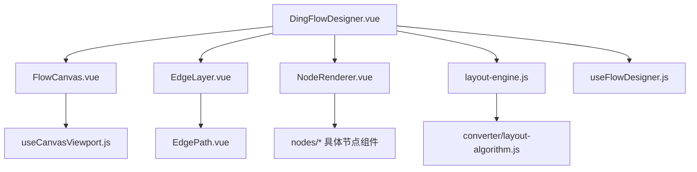
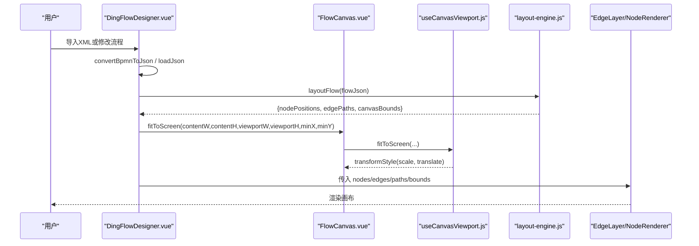
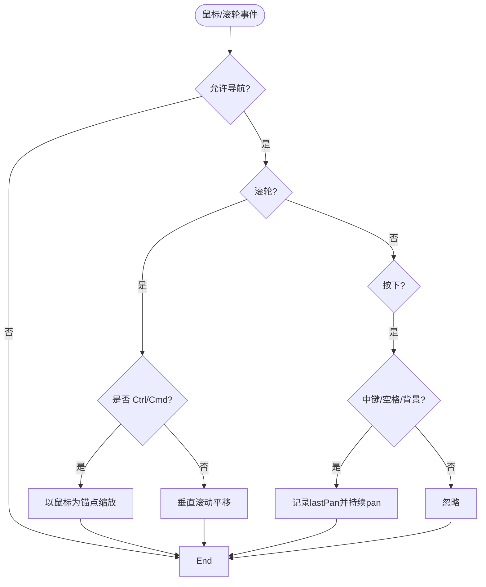
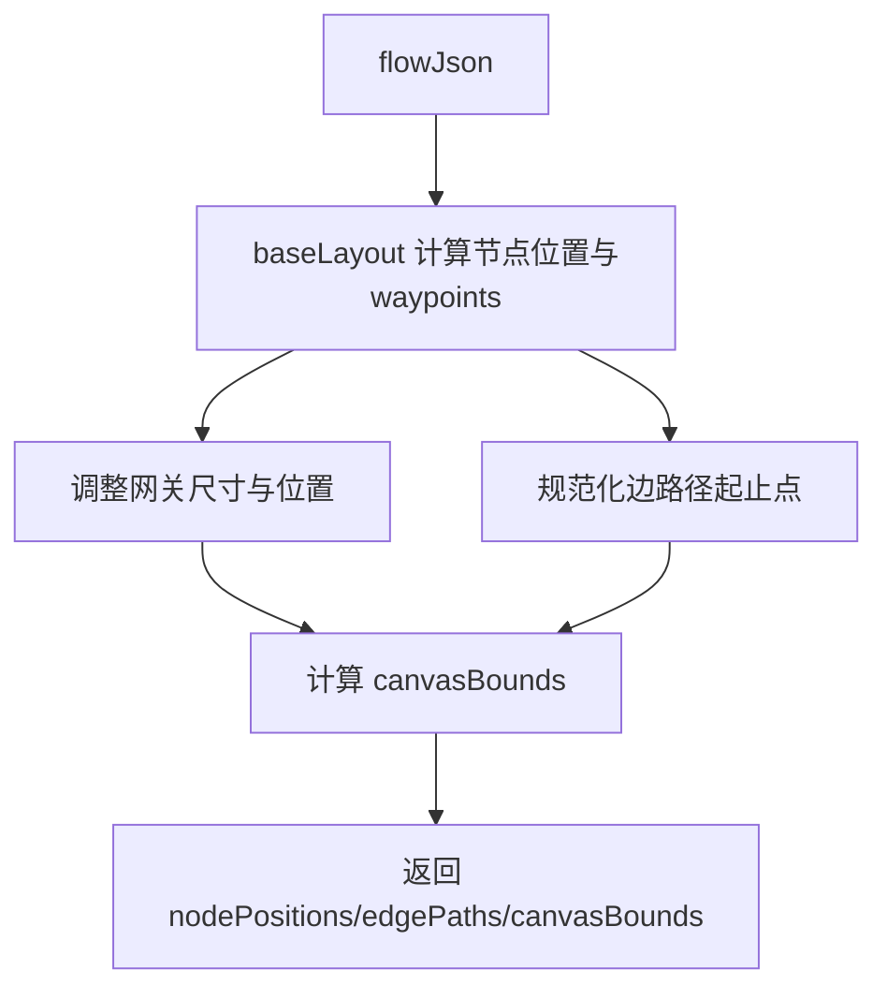
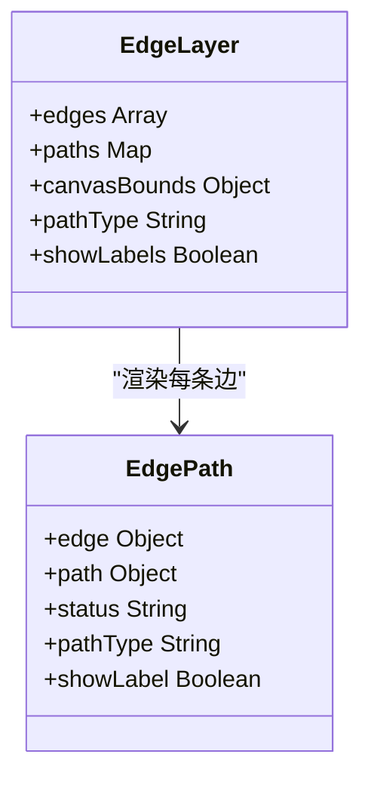
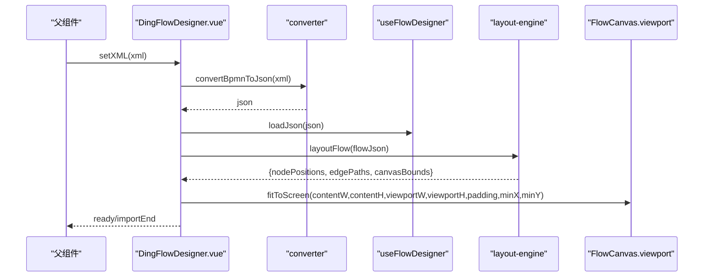
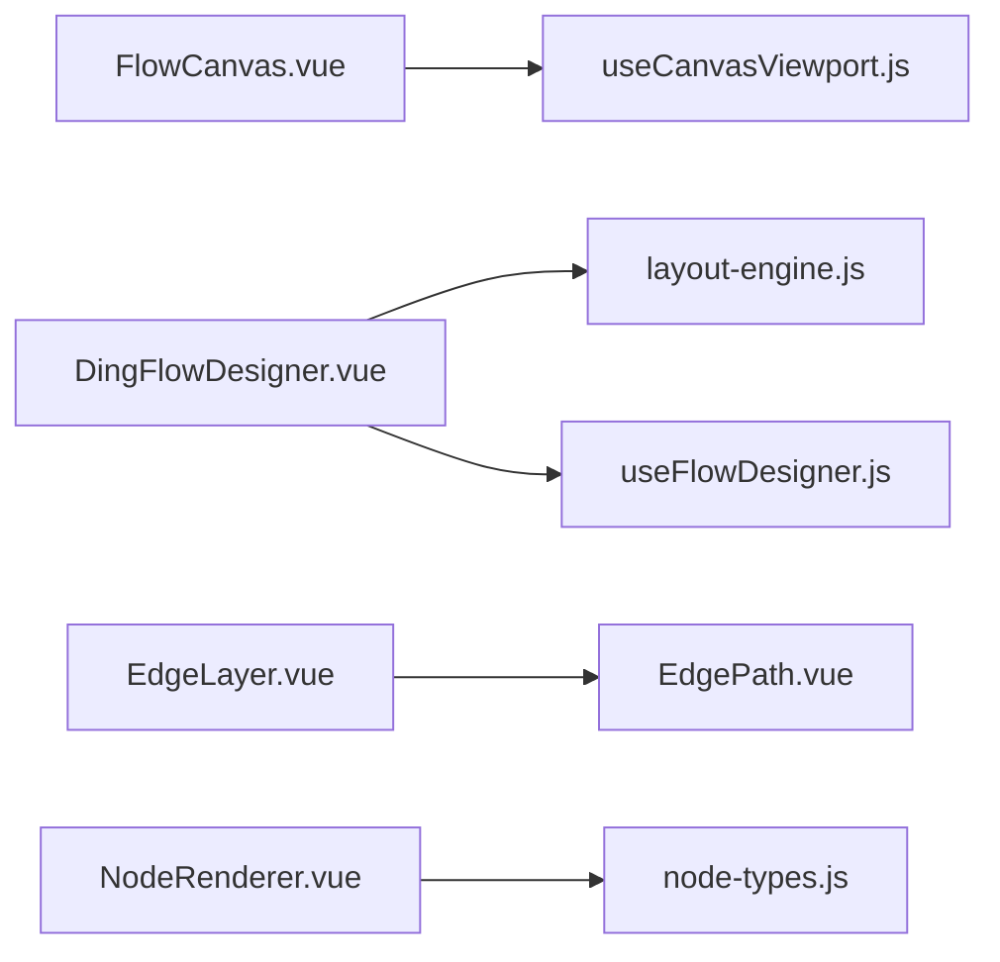

# 画布系统

<cite>
**本文引用的文件**
- [FlowCanvas.vue](file://forge-admin-ui/src/components/flow-designer/canvas/FlowCanvas.vue)
- [useCanvasViewport.js](file://forge-admin-ui/src/components/flow-designer/composables/useCanvasViewport.js)
- [layout-engine.js](file://forge-admin-ui/src/components/flow-designer/canvas/layout-engine.js)
- [NodeRenderer.vue](file://forge-admin-ui/src/components/flow-designer/canvas/NodeRenderer.vue)
- [EdgeLayer.vue](file://forge-admin-ui/src/components/flow-designer/canvas/EdgeLayer.vue)
- [EdgePath.vue](file://forge-admin-ui/src/components/flow-designer/canvas/EdgePath.vue)
- [DingFlowDesigner.vue](file://forge-admin-ui/src/components/flow-designer/DingFlowDesigner.vue)
- [useFlowDesigner.js](file://forge-admin-ui/src/components/flow-designer/composables/useFlowDesigner.js)
- [node-types.js](file://forge-admin-ui/src/components/flow-designer/constants/node-types.js)
</cite>

## 目录
1. [简介](#简介)
2. [项目结构](#项目结构)
3. [核心组件](#核心组件)
4. [架构总览](#架构总览)
5. [详细组件分析](#详细组件分析)
6. [依赖关系分析](#依赖关系分析)
7. [性能考量](#性能考量)
8. [故障排查指南](#故障排查指南)
9. [结论](#结论)
10. [附录](#附录)

## 简介
本技术文档围绕工作流设计器画布系统，深入解析 FlowCanvas 主画布组件及其周边模块的架构与实现。内容涵盖：
- 画布渲染引擎（缩放、平移、坐标转换）
- 节点渲染器（按类型分发渲染）
- 连接线层管理（SVG 连线、箭头、标签）
- 布局引擎算法（节点定位、边路径计算、画布边界）
- 交互功能（缩放、平移、网格对齐、节点选择）
- 事件处理、性能优化策略与扩展开发指南
- 画布配置选项、自定义渲染器与调试工具使用方法

## 项目结构
画布系统位于 flow-designer 模块中，采用“容器 + 渲染层 + 布局引擎 + 编辑态状态”的分层组织方式：
- 容器层：FlowCanvas 提供视口、缩放/平移、事件捕获与工具栏
- 渲染层：NodeRenderer、EdgeLayer、EdgePath 负责节点与连线的可视化
- 布局层：layout-engine 基于 converter 的布局算法输出节点位置与边路径
- 编辑态：useFlowDesigner 管理 flowJson 数据与 CRUD 操作
- 装配层：DingFlowDesigner 组合以上能力，完成导入导出、自动适配、抽屉面板等

图表来源
- [DingFlowDesigner.vue:1-761](file://forge-admin-ui/src/components/flow-designer/DingFlowDesigner.vue#L1-L761)
- [FlowCanvas.vue:1-262](file://forge-admin-ui/src/components/flow-designer/canvas/FlowCanvas.vue#L1-L262)
- [EdgeLayer.vue:1-75](file://forge-admin-ui/src/components/flow-designer/canvas/EdgeLayer.vue#L1-L75)
- [NodeRenderer.vue:1-86](file://forge-admin-ui/src/components/flow-designer/canvas/NodeRenderer.vue#L1-L86)
- [layout-engine.js:1-151](file://forge-admin-ui/src/components/flow-designer/canvas/layout-engine.js#L1-L151)
- [useCanvasViewport.js:1-133](file://forge-admin-ui/src/components/flow-designer/composables/useCanvasViewport.js#L1-L133)
- [useFlowDesigner.js:1-387](file://forge-admin-ui/src/components/flow-designer/composables/useFlowDesigner.js#L1-L387)

章节来源
- [DingFlowDesigner.vue:1-761](file://forge-admin-ui/src/components/flow-designer/DingFlowDesigner.vue#L1-L761)
- [FlowCanvas.vue:1-262](file://forge-admin-ui/src/components/flow-designer/canvas/FlowCanvas.vue#L1-L262)

## 核心组件
- FlowCanvas：画布容器，封装缩放/平移、鼠标滚轮、空格拖拽、双击重置、工具栏；暴露 screenToCanvas / canvasToScreen 等方法
- useCanvasViewport：维护 scale、translateX/Y，提供 setScale、zoomIn/Out、pan、fitToScreen、坐标转换
- layout-engine：复用 converter 布局算法，输出 nodePositions、edgePaths、canvasBounds，并修正起止点与路径类型
- NodeRenderer：根据 nodeType 动态选择对应节点卡片组件，透传选中、状态、只读等属性
- EdgeLayer：SVG 连线层，注册多种箭头 marker，遍历 edges 渲染 EdgePath
- EdgePath：单条边的 SVG path 绘制，支持 rounded/bezier/orthogonal/straight，条件标签显示
- DingFlowDesigner：组装层，负责 XML/JSON 转换、自动适配、节点增删改、分支头与添加按钮布局、抽屉面板联动
- useFlowDesigner：编辑态核心，提供 flowJson 管理与节点/边 CRUD、查询方法

章节来源
- [FlowCanvas.vue:1-262](file://forge-admin-ui/src/components/flow-designer/canvas/FlowCanvas.vue#L1-L262)
- [useCanvasViewport.js:1-133](file://forge-admin-ui/src/components/flow-designer/composables/useCanvasViewport.js#L1-L133)
- [layout-engine.js:1-151](file://forge-admin-ui/src/components/flow-designer/canvas/layout-engine.js#L1-L151)
- [NodeRenderer.vue:1-86](file://forge-admin-ui/src/components/flow-designer/canvas/NodeRenderer.vue#L1-L86)
- [EdgeLayer.vue:1-75](file://forge-admin-ui/src/components/flow-designer/canvas/EdgeLayer.vue#L1-L75)
- [EdgePath.vue:1-97](file://forge-admin-ui/src/components/flow-designer/canvas/EdgePath.vue#L1-L97)
- [DingFlowDesigner.vue:1-761](file://forge-admin-ui/src/components/flow-designer/DingFlowDesigner.vue#L1-L761)
- [useFlowDesigner.js:1-387](file://forge-admin-ui/src/components/flow-designer/composables/useFlowDesigner.js#L1-L387)

## 架构总览
画布系统以“数据驱动 + 视图分层”的方式组织：
- 数据层：useFlowDesigner 维护 flowJson（nodes、edges、config），提供变更 API
- 布局层：layout-engine 将 flowJson 转换为可视化的节点位置与边路径
- 渲染层：FlowCanvas 作为 transform 容器，EdgeLayer 与 NodeRenderer 分别渲染连线与节点
- 交互层：FlowCanvas 捕获鼠标/键盘事件，调用 viewport 进行缩放/平移；DingFlowDesigner 协调业务逻辑

图表来源
- [DingFlowDesigner.vue:117-139](file://forge-admin-ui/src/components/flow-designer/DingFlowDesigner.vue#L117-L139)
- [DingFlowDesigner.vue:654-672](file://forge-admin-ui/src/components/flow-designer/DingFlowDesigner.vue#L654-L672)
- [layout-engine.js:34-111](file://forge-admin-ui/src/components/flow-designer/canvas/layout-engine.js#L34-L111)
- [useCanvasViewport.js:87-96](file://forge-admin-ui/src/components/flow-designer/composables/useCanvasViewport.js#L87-L96)
- [FlowCanvas.vue:166-195](file://forge-admin-ui/src/components/flow-designer/canvas/FlowCanvas.vue#L166-L195)

## 详细组件分析

### FlowCanvas 主画布组件
- 职责：提供 transform 容器、缩放/平移、空格拖拽、滚轮缩放、双击空白重置、工具栏
- 关键实现：
  - 使用 useCanvasViewport 管理 scale、translateX/Y，并通过 transformStyle 应用 CSS transform
  - 滚轮事件：Ctrl/Cmd+滚轮以鼠标为锚点缩放；普通滚轮触发 pan
  - 拖拽平移：中键或空格+左键拖拽，记录 lastPan 并调用 pan(dx, dy)
  - 键盘事件：监听 Space 切换 grab/grabbing 光标
  - 暴露方法：resetView、fitToScreen、zoomIn、zoomOut、setScale、screenToCanvas、canvasToScreen
- 配置项：minScale、maxScale、initialScale、readonly、allowNavigation

图表来源
- [FlowCanvas.vue:61-116](file://forge-admin-ui/src/components/flow-designer/canvas/FlowCanvas.vue#L61-L116)
- [FlowCanvas.vue:118-141](file://forge-admin-ui/src/components/flow-designer/canvas/FlowCanvas.vue#L118-L141)
- [FlowCanvas.vue:166-195](file://forge-admin-ui/src/components/flow-designer/canvas/FlowCanvas.vue#L166-L195)

章节来源
- [FlowCanvas.vue:1-262](file://forge-admin-ui/src/components/flow-designer/canvas/FlowCanvas.vue#L1-L262)

### 画布视口与坐标转换（useCanvasViewport）
- 状态：scale、translateX、translateY，transformStyle 计算属性
- 核心API：
  - setScale(next, centerX?, centerY?)：以屏幕坐标为锚点缩放，避免画布跳跃
  - zoomIn/zoomOut：步进缩放，保留两位小数避免浮点累积误差
  - pan(dx, dy)：相对偏移
  - resetView()：恢复初始缩放与偏移
  - fitToScreen(contentW, contentH, viewportW, viewportH, padding=40, minX=0, minY=0)：内容居中并缩放到适应
  - screenToCanvas(x, y) / canvasToScreen(x, y)：屏幕与画布坐标互转
- 复杂度：所有操作均为 O(1)，适合高频交互

章节来源
- [useCanvasViewport.js:1-133](file://forge-admin-ui/src/components/flow-designer/composables/useCanvasViewport.js#L1-L133)

### 布局引擎（layout-engine）
- 输入：flowJson（nodes、edges）
- 输出：
  - nodePositions：Map<nodeId, {x,y,width,height}>
  - edgePaths：Map<edgeId, {points:[{x,y}], type:'straight'|'orthogonal'}>
  - canvasBounds：{minX,minY,maxX,maxY}
- 关键点：
  - 复用 converter/layout-algorithm 计算基础布局
  - 网关节点尺寸调整为菱形大小，不占用普通任务卡尺寸
  - 边路径起止点修正到真实节点边界，中间折点保留
  - 根据起止 x 是否一致判断 straight 或 orthogonal
  - 聚合所有节点与 waypoint 计算 canvasBounds，用于 fitToScreen

图表来源
- [layout-engine.js:34-111](file://forge-admin-ui/src/components/flow-designer/canvas/layout-engine.js#L34-L111)
- [layout-engine.js:113-150](file://forge-admin-ui/src/components/flow-designer/canvas/layout-engine.js#L113-L150)

章节来源
- [layout-engine.js:1-151](file://forge-admin-ui/src/components/flow-designer/canvas/layout-engine.js#L1-L151)

### 节点渲染器（NodeRenderer）
- 作用：根据 nodeType 动态选择对应节点组件，减少 v-if 分发
- 映射：start/end/approver/carbonCopy/condition/parallel/inclusive/service/script/subProcess/callActivity/advanced
- 属性：node、position、selected、status、readonly、outgoingCount
- 事件：click、delete、contextMenu 透传至父级

章节来源
- [NodeRenderer.vue:1-86](file://forge-admin-ui/src/components/flow-designer/canvas/NodeRenderer.vue#L1-L86)
- [node-types.js:19-48](file://forge-admin-ui/src/components/flow-designer/constants/node-types.js#L19-L48)

### 连接线层（EdgeLayer 与 EdgePath）
- EdgeLayer：
  - 接收 edges、paths、canvasBounds、pathType、showLabels
  - 定义多种箭头 marker（default、completed、running、rejected、branch）
  - 遍历 edges 渲染 EdgePath
- EdgePath：
  - 根据 path.points 与 path.type 生成 SVG path d
  - 根据 status 与 edge 属性决定颜色、虚线样式、箭头 marker
  - 条件标签显示在路径中点，支持默认分支与条件规则计数提示

图表来源
- [EdgeLayer.vue:1-75](file://forge-admin-ui/src/components/flow-designer/canvas/EdgeLayer.vue#L1-L75)
- [EdgePath.vue:1-97](file://forge-admin-ui/src/components/flow-designer/canvas/EdgePath.vue#L1-L97)

章节来源
- [EdgeLayer.vue:1-75](file://forge-admin-ui/src/components/flow-designer/canvas/EdgeLayer.vue#L1-L75)
- [EdgePath.vue:1-97](file://forge-admin-ui/src/components/flow-designer/canvas/EdgePath.vue#L1-L97)

### 装配层（DingFlowDesigner）
- 职责：
  - XML/JSON 双向转换与导入导出
  - 自动适配：importXml 后 nextTick 调用 autoFitToScreen
  - 节点增删改、分支添加、上下文菜单、抽屉面板联动
  - 分支头与添加按钮位置计算，避免碰撞
  - 合并标记（merge markers）展示
- 关键流程：
  - importXml -> convertBpmnToJson -> loadJson -> applyDefaultBusinessFormBindings -> history.clear -> nextTick -> autoFitToScreen
  - scheduleEmit 防抖 emit('change', xml)
  - branchHeaderPosition 与 avoidHeaderCollision 保证分支标签可读性

图表来源
- [DingFlowDesigner.vue:117-139](file://forge-admin-ui/src/components/flow-designer/DingFlowDesigner.vue#L117-L139)
- [DingFlowDesigner.vue:654-672](file://forge-admin-ui/src/components/flow-designer/DingFlowDesigner.vue#L654-L672)
- [DingFlowDesigner.vue:460-501](file://forge-admin-ui/src/components/flow-designer/DingFlowDesigner.vue#L460-L501)

章节来源
- [DingFlowDesigner.vue:1-761](file://forge-admin-ui/src/components/flow-designer/DingFlowDesigner.vue#L1-L761)

### 编辑态核心（useFlowDesigner）
- 职责：
  - 管理 flowJson 与 selectedNodeId
  - 提供 addNode、addBranch、deleteNode、updateNode、moveNodeUp/Down、copyNode、updateEdge、reconnect
  - 查询 getNode、getEdge、getOutgoingEdges、getIncomingEdges、findStartNode、findEndNode
  - 整体加载/导出/重置
- 约束：
  - start/end 不可删除
  - addNode 插入时保留原出边的 condition/branchId/isDefault
  - deleteNode 对网关节点递归删除分支链直到汇合点

章节来源
- [useFlowDesigner.js:1-387](file://forge-admin-ui/src/components/flow-designer/composables/useFlowDesigner.js#L1-L387)

## 依赖关系分析
- FlowCanvas 依赖 useCanvasViewport 提供缩放/平移能力
- DingFlowDesigner 依赖 layout-engine 计算布局，依赖 useFlowDesigner 管理数据
- EdgeLayer/EdgePath 依赖 path-builder 的颜色与路径构建函数（通过 utils/path-builder.js 引入）
- NodeRenderer 依赖 nodes/* 具体节点组件，由 node-types 枚举驱动

图表来源
- [FlowCanvas.vue:23-25](file://forge-admin-ui/src/components/flow-designer/canvas/FlowCanvas.vue#L23-L25)
- [DingFlowDesigner.vue:14-27](file://forge-admin-ui/src/components/flow-designer/DingFlowDesigner.vue#L14-L27)
- [EdgeLayer.vue:14-16](file://forge-admin-ui/src/components/flow-designer/canvas/EdgeLayer.vue#L14-L16)
- [NodeRenderer.vue:18-28](file://forge-admin-ui/src/components/flow-designer/canvas/NodeRenderer.vue#L18-L28)
- [node-types.js:19-48](file://forge-admin-ui/src/components/flow-designer/constants/node-types.js#L19-L48)

章节来源
- [FlowCanvas.vue:1-262](file://forge-admin-ui/src/components/flow-designer/canvas/FlowCanvas.vue#L1-L262)
- [DingFlowDesigner.vue:1-761](file://forge-admin-ui/src/components/flow-designer/DingFlowDesigner.vue#L1-L761)
- [EdgeLayer.vue:1-75](file://forge-admin-ui/src/components/flow-designer/canvas/EdgeLayer.vue#L1-L75)
- [NodeRenderer.vue:1-86](file://forge-admin-ui/src/components/flow-designer/canvas/NodeRenderer.vue#L1-L86)
- [node-types.js:1-160](file://forge-admin-ui/src/components/flow-designer/constants/node-types.js#L1-L160)

## 性能考量
- 视口变换：使用 CSS transform 进行缩放/平移，GPU 加速，避免重排
- 布局计算：layout-engine 复用 converter 布局算法，仅做必要修正；结果缓存于 computed 避免重复计算
- 渲染优化：EdgeLayer 使用 SVG defs 预定义箭头，减少重复绘制；NodeRenderer 按需渲染节点卡片
- 事件节流：scheduleEmit 使用定时器防抖 emit('change')，降低频繁写入开销
- 坐标转换：screenToCanvas/canvasToScreen 为 O(1)，适合高频交互
- 建议：
  - 大量节点场景下可考虑虚拟滚动或分片渲染
  - 复杂路径计算可引入离屏渲染或 WebAssembly 优化
  - 合理设置 minScale/maxScale 与 zoomStep，避免过度缩放导致性能下降

[本节为通用指导，无需特定文件引用]

## 故障排查指南
- 导入失败：检查 convertBpmnToJson 异常，确认 XML 格式与命名空间；查看 importXml 的 try/catch 日志
- 画布未适配：确认 layoutResult.canvasBounds 有效，autoFitToScreen 在 nextTick 后调用
- 节点无法删除：start/end 节点禁止删除；网关节点需确保分支链完整
- 分支头重叠：adjust branchHeaderPosition 与 avoidHeaderCollision 逻辑，必要时增大间距
- 缩放异常：检查 setScale 的 clamp 范围与锚点坐标传入是否正确
- 连线错位：验证 normalizeEdgePoints 的起止点修正与 path.type 判定

章节来源
- [DingFlowDesigner.vue:117-139](file://forge-admin-ui/src/components/flow-designer/DingFlowDesigner.vue#L117-L139)
- [DingFlowDesigner.vue:654-672](file://forge-admin-ui/src/components/flow-designer/DingFlowDesigner.vue#L654-L672)
- [useFlowDesigner.js:243-259](file://forge-admin-ui/src/components/flow-designer/composables/useFlowDesigner.js#L243-L259)
- [layout-engine.js:113-150](file://forge-admin-ui/src/components/flow-designer/canvas/layout-engine.js#L113-L150)

## 结论
本画布系统通过清晰的层次划分与模块化设计，实现了可扩展、高性能的流程设计器画布。FlowCanvas 提供稳定的视口与交互能力，layout-engine 保证布局准确性，EdgeLayer/NodeRenderer 实现高效渲染，DingFlowDesigner 整合业务逻辑与用户体验。配合 useFlowDesigner 的数据管理能力，系统具备良好的可维护性与扩展性。

[本节为总结，无需特定文件引用]

## 附录

### 画布配置选项
- FlowCanvas 配置：
  - minScale：最小缩放比例（默认 0.3）
  - maxScale：最大缩放比例（默认 2.0）
  - initialScale：初始缩放比例（默认 1）
  - readonly：只读模式（默认 false）
  - allowNavigation：允许导航（默认 false）
- useCanvasViewport 配置：
  - zoomStep：缩放步进（默认 0.1）
  - initialX/initialY：初始偏移（默认 0）
- layout-engine 配置：
  - NODE_WIDTH/NODE_HEIGHT：节点宽高（默认 224/82）
  - GATEWAY_SIZE：网关尺寸（默认 44）
  - V_GAP/H_GAP：垂直/水平间距（默认 56/72）
  - MARGIN_TOP/MARGIN_LEFT：顶部/左侧留白（默认 56/240）

章节来源
- [FlowCanvas.vue:26-32](file://forge-admin-ui/src/components/flow-designer/canvas/FlowCanvas.vue#L26-L32)
- [useCanvasViewport.js:21-28](file://forge-admin-ui/src/components/flow-designer/composables/useCanvasViewport.js#L21-L28)
- [layout-engine.js:22-30](file://forge-admin-ui/src/components/flow-designer/canvas/layout-engine.js#L22-L30)

### 自定义渲染器与扩展指南
- 新增节点类型：
  - 在 node-types.js 中扩展 NODE_TYPE 与映射
  - 在 NodeRenderer.vue 的 RENDERER_MAP 中添加新类型到组件映射
  - 实现对应节点组件（如 AdvancedNode）
- 自定义连线样式：
  - 在 EdgePath.vue 中覆盖 pathType 或使用 path-builder 的 buildPathD
  - 在 EdgeLayer.vue 中注册新的 marker
- 自定义布局：
  - 扩展 layout-engine 的配置项，调整节点尺寸与间距
  - 重写 normalizeEdgePoints 以适应特殊节点形状

章节来源
- [node-types.js:19-48](file://forge-admin-ui/src/components/flow-designer/constants/node-types.js#L19-L48)
- [NodeRenderer.vue:41-56](file://forge-admin-ui/src/components/flow-designer/canvas/NodeRenderer.vue#L41-L56)
- [EdgePath.vue:30-35](file://forge-admin-ui/src/components/flow-designer/canvas/EdgePath.vue#L30-L35)
- [EdgeLayer.vue:47-63](file://forge-admin-ui/src/components/flow-designer/canvas/EdgeLayer.vue#L47-L63)
- [layout-engine.js:22-30](file://forge-admin-ui/src/components/flow-designer/canvas/layout-engine.js#L22-L30)

### 调试工具与最佳实践
- 调试入口：
  - 在浏览器控制台查看 importXml 与 convertJsonToBpmn 的异常日志
  - 检查 layoutResult 的 nodePositions、edgePaths、canvasBounds 是否符合预期
  - 使用 FlowCanvas 暴露的方法（resetView、fitToScreen、zoomIn/Out）进行交互式调试
- 最佳实践：
  - 保持 flowJson 的最小化变更，使用 updateNode/updateEdge 精确更新
  - 合理使用 readonly 与 allowNavigation 控制交互权限
  - 在大量节点场景下，优先启用只读模式以提升性能

章节来源
- [DingFlowDesigner.vue:117-139](file://forge-admin-ui/src/components/flow-designer/DingFlowDesigner.vue#L117-L139)
- [FlowCanvas.vue:153-163](file://forge-admin-ui/src/components/flow-designer/canvas/FlowCanvas.vue#L153-L163)