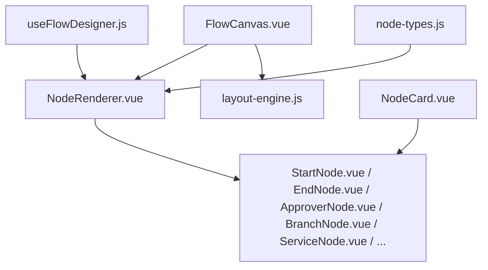
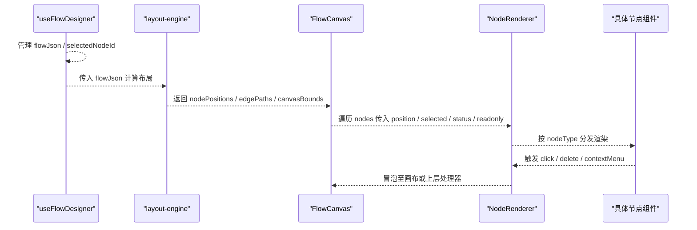
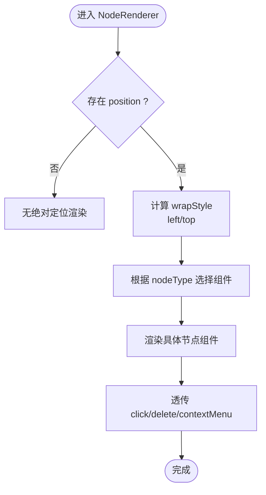
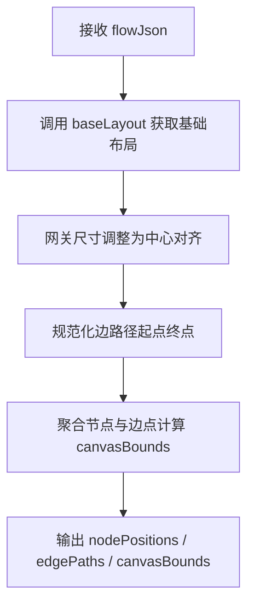
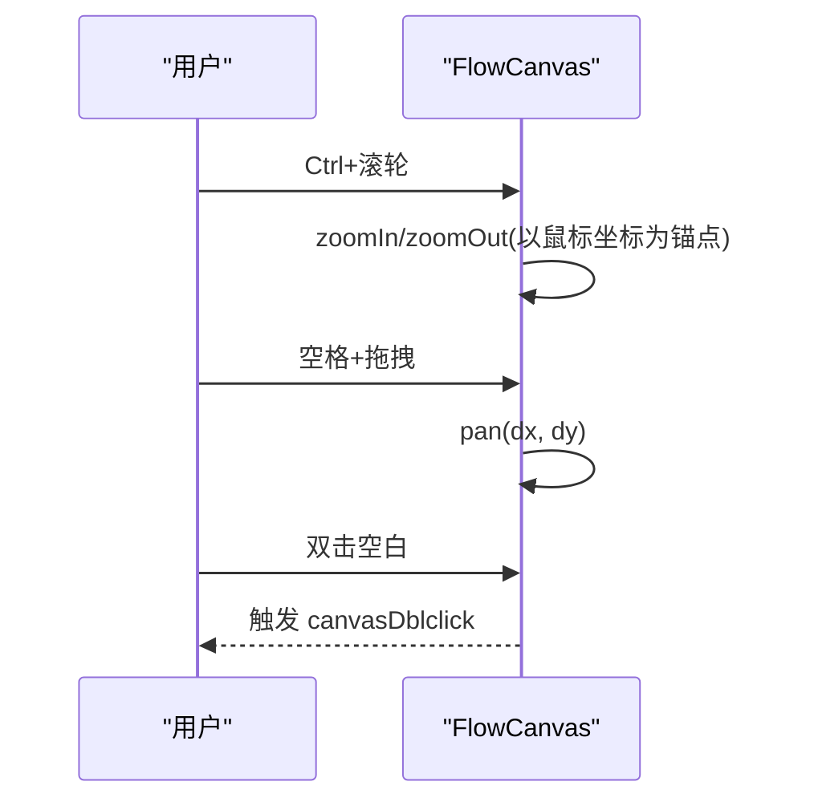
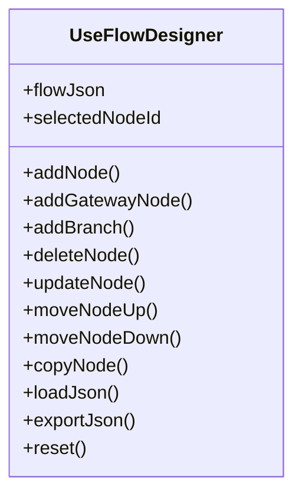
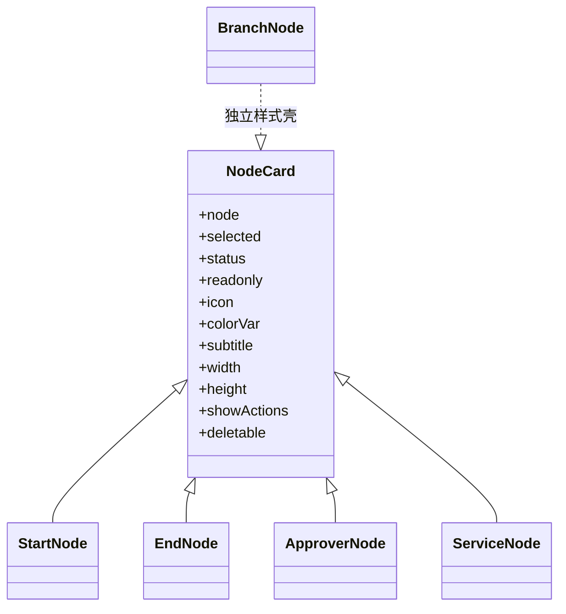
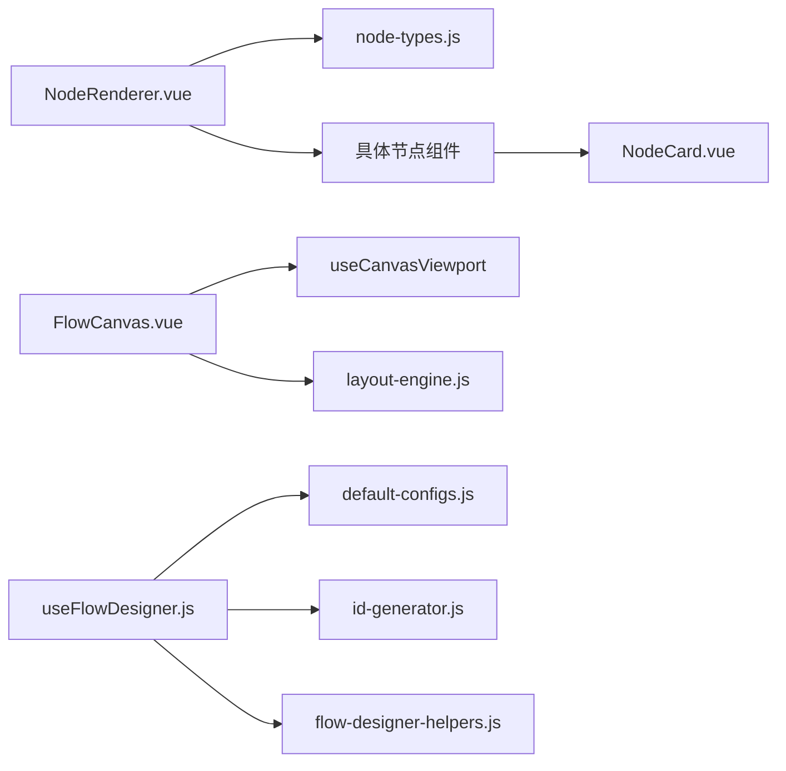

# 节点渲染器

<cite>
**本文引用的文件**
- [NodeRenderer.vue](file://forge-admin-ui/src/components/flow-designer/canvas/NodeRenderer.vue)
- [FlowCanvas.vue](file://forge-admin-ui/src/components/flow-designer/canvas/FlowCanvas.vue)
- [layout-engine.js](file://forge-admin-ui/src/components/flow-designer/canvas/layout-engine.js)
- [useFlowDesigner.js](file://forge-admin-ui/src/components/flow-designer/composables/useFlowDesigner.js)
- [node-types.js](file://forge-admin-ui/src/components/flow-designer/constants/node-types.js)
- [NodeCard.vue](file://forge-admin-ui/src/components/flow-designer/nodes/NodeCard.vue)
- [StartNode.vue](file://forge-admin-ui/src/components/flow-designer/nodes/StartNode.vue)
- [EndNode.vue](file://forge-admin-ui/src/components/flow-designer/nodes/EndNode.vue)
- [BranchNode.vue](file://forge-admin-ui/src/components/flow-designer/nodes/BranchNode.vue)
- [ApproverNode.vue](file://forge-admin-ui/src/components/flow-designer/nodes/ApproverNode.vue)
- [ServiceNode.vue](file://forge-admin-ui/src/components/flow-designer/nodes/ServiceNode.vue)
- [BusinessProcessNodeRenderer.vue](file://forge-admin-ui/src/components/business-process-designer/BusinessProcessNodeRenderer.vue)
</cite>

## 目录
1. [简介](#简介)
2. [项目结构](#项目结构)
3. [核心组件](#核心组件)
4. [架构总览](#架构总览)
5. [详细组件分析](#详细组件分析)
6. [依赖关系分析](#依赖关系分析)
7. [性能考虑](#性能考虑)
8. [故障排查指南](#故障排查指南)
9. [结论](#结论)
10. [附录](#附录)

## 简介
本技术文档聚焦工作流设计器中的“节点渲染器”体系，围绕 NodeRenderer 调度与具体节点卡片渲染展开，系统阐述：
- 节点定位计算（布局引擎）与渲染生命周期
- 状态管理（选中、只读、运行态等）与事件透传
- 不同类型节点的差异化渲染策略（开始、结束、审批、网关、服务、脚本、子流程、调用活动等）
- 交互能力：选择、高亮、右键菜单、拖拽平移、缩放
- 数据绑定、样式定制与性能优化方案
- 自定义节点开发指南与最佳实践

## 项目结构
该渲染体系位于 flow-designer 模块中，采用“调度 + 卡片”的分层组织：
- 调度层：NodeRenderer 根据 nodeType 动态分发到具体节点组件
- 布局层：layout-engine 计算节点位置与边路径，供画布渲染使用
- 画布容器：FlowCanvas 提供缩放、平移、工具栏等交互
- 状态层：useFlowDesigner 管理 flowJson、选中节点、增删改查等
- 节点卡片：各具体节点组件基于统一的 NodeCard 基类实现视觉一致性
- 业务进程渲染：BusinessProcessNodeRenderer 为另一套业务进程节点渲染入口

图表来源
- [FlowCanvas.vue:1-262](file://forge-admin-ui/src/components/flow-designer/canvas/FlowCanvas.vue#L1-L262)
- [NodeRenderer.vue:1-86](file://forge-admin-ui/src/components/flow-designer/canvas/NodeRenderer.vue#L1-L86)
- [layout-engine.js:1-151](file://forge-admin-ui/src/components/flow-designer/canvas/layout-engine.js#L1-L151)
- [useFlowDesigner.js:1-387](file://forge-admin-ui/src/components/flow-designer/composables/useFlowDesigner.js#L1-L387)
- [node-types.js:1-160](file://forge-admin-ui/src/components/flow-designer/constants/node-types.js#L1-L160)
- [NodeCard.vue:1-267](file://forge-admin-ui/src/components/flow-designer/nodes/NodeCard.vue#L1-L267)

章节来源
- [FlowCanvas.vue:1-262](file://forge-admin-ui/src/components/flow-designer/canvas/FlowCanvas.vue#L1-L262)
- [NodeRenderer.vue:1-86](file://forge-admin-ui/src/components/flow-designer/canvas/NodeRenderer.vue#L1-L86)
- [layout-engine.js:1-151](file://forge-admin-ui/src/components/flow-designer/canvas/layout-engine.js#L1-L151)
- [useFlowDesigner.js:1-387](file://forge-admin-ui/src/components/flow-designer/composables/useFlowDesigner.js#L1-L387)
- [node-types.js:1-160](file://forge-admin-ui/src/components/flow-designer/constants/node-types.js#L1-L160)
- [NodeCard.vue:1-267](file://forge-admin-ui/src/components/flow-designer/nodes/NodeCard.vue#L1-L267)

## 核心组件
- NodeRenderer：按 nodeType 动态选择并渲染对应节点卡片；统一处理定位、选中、只读、分支计数、事件透传。
- FlowCanvas：画布容器，负责缩放、平移、滚轮行为、双击重置视图、暴露 viewport API。
- layout-engine：将 flowJson 转换为节点位置 Map 与边路径 Map，区分直线与正交折线，计算画布边界。
- useFlowDesigner：编辑态核心状态机，维护 flowJson、selectedNodeId，提供节点/边的 CRUD、分支管理、导入导出。
- NodeCard：节点卡片基类，统一标题行、摘要区、删除按钮、选中态、只读态、颜色变量与尺寸。
- 具体节点组件：StartNode、EndNode、ApproverNode、BranchNode、ServiceNode 等，复用 NodeCard 并注入语义化副标题与图标。

章节来源
- [NodeRenderer.vue:1-86](file://forge-admin-ui/src/components/flow-designer/canvas/NodeRenderer.vue#L1-L86)
- [FlowCanvas.vue:1-262](file://forge-admin-ui/src/components/flow-designer/canvas/FlowCanvas.vue#L1-L262)
- [layout-engine.js:1-151](file://forge-admin-ui/src/components/flow-designer/canvas/layout-engine.js#L1-L151)
- [useFlowDesigner.js:1-387](file://forge-admin-ui/src/components/flow-designer/composables/useFlowDesigner.js#L1-L387)
- [NodeCard.vue:1-267](file://forge-admin-ui/src/components/flow-designer/nodes/NodeCard.vue#L1-L267)
- [StartNode.vue:1-35](file://forge-admin-ui/src/components/flow-designer/nodes/StartNode.vue#L1-L35)
- [EndNode.vue:1-38](file://forge-admin-ui/src/components/flow-designer/nodes/EndNode.vue#L1-L38)
- [ApproverNode.vue:1-49](file://forge-admin-ui/src/components/flow-designer/nodes/ApproverNode.vue#L1-L49)
- [BranchNode.vue:1-226](file://forge-admin-ui/src/components/flow-designer/nodes/BranchNode.vue#L1-L226)
- [ServiceNode.vue:1-34](file://forge-admin-ui/src/components/flow-designer/nodes/ServiceNode.vue#L1-L34)

## 架构总览
下图展示了从数据到渲染的完整链路：状态管理 → 布局计算 → 画布容器 → 节点调度 → 具体节点卡片。

图表来源
- [useFlowDesigner.js:1-387](file://forge-admin-ui/src/components/flow-designer/composables/useFlowDesigner.js#L1-L387)
- [layout-engine.js:1-151](file://forge-admin-ui/src/components/flow-designer/canvas/layout-engine.js#L1-L151)
- [FlowCanvas.vue:1-262](file://forge-admin-ui/src/components/flow-designer/canvas/FlowCanvas.vue#L1-L262)
- [NodeRenderer.vue:1-86](file://forge-admin-ui/src/components/flow-designer/canvas/NodeRenderer.vue#L1-L86)

## 详细组件分析

### NodeRenderer 调度与渲染生命周期
- 输入 props：node、position、selected、status、readonly、outgoingCount
- 渲染映射：RENDERER_MAP 将 nodeType 映射到具体组件，未知类型回退到 AdvancedNode
- 分支识别：对 condition/parallel/inclusive 传递 outgoingCount
- 定位样式：通过 computed style 设置 absolute 定位与 left/top
- 事件透传：click/delete/contextMenu 直接透传给父级

图表来源
- [NodeRenderer.vue:1-86](file://forge-admin-ui/src/components/flow-designer/canvas/NodeRenderer.vue#L1-L86)

章节来源
- [NodeRenderer.vue:1-86](file://forge-admin-ui/src/components/flow-designer/canvas/NodeRenderer.vue#L1-L86)

### 布局引擎与节点定位
- 复用 converter 的几何布局，输出 nodePositions 与 edgeWaypoints
- 网关节点在画布上以菱形锚点呈现，尺寸固定为 GATEWAY_SIZE
- 边路径规范化：起止端点修正到真实节点边界，同 x 为直线，否则为正交折线
- 计算 canvasBounds 用于 fitToScreen

图表来源
- [layout-engine.js:1-151](file://forge-admin-ui/src/components/flow-designer/canvas/layout-engine.js#L1-L151)

章节来源
- [layout-engine.js:1-151](file://forge-admin-ui/src/components/flow-designer/canvas/layout-engine.js#L1-L151)

### 画布容器与交互
- 缩放：Ctrl/Cmd + 滚轮以鼠标为锚点缩放
- 平移：空格+左键拖拽、中键拖拽、普通滚轮垂直平移
- 双击空白：重置视图
- 暴露 API：resetView/fitToScreen/zoomIn/zoomOut/setScale/screenToCanvas/canvasToScreen

图表来源
- [FlowCanvas.vue:1-262](file://forge-admin-ui/src/components/flow-designer/canvas/FlowCanvas.vue#L1-L262)

章节来源
- [FlowCanvas.vue:1-262](file://forge-admin-ui/src/components/flow-designer/canvas/FlowCanvas.vue#L1-L262)

### 状态管理与节点操作
- selectedNodeId：当前选中节点 ID
- addNode/addGatewayNode：在指定节点后插入，保留条件/默认分支信息
- addBranch：为网关添加分支，自动连接汇合点并标记 mergeNode
- deleteNode：禁止删除 start/end；网关递归删除分支链
- moveNodeUp/moveNodeDown：仅支持线性链内交换
- copyNode：复制节点并生成新 id
- loadJson/exportJson/reset：导入/导出/重置流程

图表来源
- [useFlowDesigner.js:1-387](file://forge-admin-ui/src/components/flow-designer/composables/useFlowDesigner.js#L1-L387)

章节来源
- [useFlowDesigner.js:1-387](file://forge-admin-ui/src/components/flow-designer/composables/useFlowDesigner.js#L1-L387)

### 节点类型与渲染策略
- 开始节点：不可删除，显示发起人说明
- 结束节点：不可删除，根据 endType 显示正常结束或强制终止
- 审批节点：展示审批摘要，会签时显示标签
- 网关节点：condition/parallel/inclusive 共享样式，中心菱形锚点，显示分支数提示
- 服务节点：显示实现类型与值
- 其他节点：由 AdvancedNode 兜底

图表来源
- [NodeCard.vue:1-267](file://forge-admin-ui/src/components/flow-designer/nodes/NodeCard.vue#L1-L267)
- [StartNode.vue:1-35](file://forge-admin-ui/src/components/flow-designer/nodes/StartNode.vue#L1-L35)
- [EndNode.vue:1-38](file://forge-admin-ui/src/components/flow-designer/nodes/EndNode.vue#L1-L38)
- [ApproverNode.vue:1-49](file://forge-admin-ui/src/components/flow-designer/nodes/ApproverNode.vue#L1-L49)
- [BranchNode.vue:1-226](file://forge-admin-ui/src/components/flow-designer/nodes/BranchNode.vue#L1-L226)
- [ServiceNode.vue:1-34](file://forge-admin-ui/src/components/flow-designer/nodes/ServiceNode.vue#L1-L34)

章节来源
- [StartNode.vue:1-35](file://forge-admin-ui/src/components/flow-designer/nodes/StartNode.vue#L1-L35)
- [EndNode.vue:1-38](file://forge-admin-ui/src/components/flow-designer/nodes/EndNode.vue#L1-L38)
- [ApproverNode.vue:1-49](file://forge-admin-ui/src/components/flow-designer/nodes/ApproverNode.vue#L1-L49)
- [BranchNode.vue:1-226](file://forge-admin-ui/src/components/flow-designer/nodes/BranchNode.vue#L1-L226)
- [ServiceNode.vue:1-34](file://forge-admin-ui/src/components/flow-designer/nodes/ServiceNode.vue#L1-L34)
- [NodeCard.vue:1-267](file://forge-admin-ui/src/components/flow-designer/nodes/NodeCard.vue#L1-L267)

### 业务进程节点渲染器
- BusinessProcessNodeRenderer 提供另一套业务进程节点渲染入口，支持不同 tone、端口标签、可删除性控制
- 通过 getBusinessProcessNodeDefinition 获取定义，计算 summary 与可见端口
- 样式包含选中态、悬停态、删除按钮、端口网格布局

章节来源
- [BusinessProcessNodeRenderer.vue:1-301](file://forge-admin-ui/src/components/business-process-designer/BusinessProcessNodeRenderer.vue#L1-L301)

## 依赖关系分析
- NodeRenderer 依赖 node-types 枚举与具体节点组件映射
- layout-engine 依赖 converter 的布局算法，输出渲染所需坐标与路径
- FlowCanvas 依赖 useCanvasViewport 进行视口变换
- useFlowDesigner 依赖 default-configs、id-generator、helpers 进行状态变更
- 所有节点卡片依赖 NodeCard 统一视觉与交互

图表来源
- [NodeRenderer.vue:1-86](file://forge-admin-ui/src/components/flow-designer/canvas/NodeRenderer.vue#L1-L86)
- [node-types.js:1-160](file://forge-admin-ui/src/components/flow-designer/constants/node-types.js#L1-L160)
- [FlowCanvas.vue:1-262](file://forge-admin-ui/src/components/flow-designer/canvas/FlowCanvas.vue#L1-L262)
- [layout-engine.js:1-151](file://forge-admin-ui/src/components/flow-designer/canvas/layout-engine.js#L1-L151)
- [useFlowDesigner.js:1-387](file://forge-admin-ui/src/components/flow-designer/composables/useFlowDesigner.js#L1-L387)
- [NodeCard.vue:1-267](file://forge-admin-ui/src/components/flow-designer/nodes/NodeCard.vue#L1-L267)

章节来源
- [NodeRenderer.vue:1-86](file://forge-admin-ui/src/components/flow-designer/canvas/NodeRenderer.vue#L1-L86)
- [node-types.js:1-160](file://forge-admin-ui/src/components/flow-designer/constants/node-types.js#L1-L160)
- [FlowCanvas.vue:1-262](file://forge-admin-ui/src/components/flow-designer/canvas/FlowCanvas.vue#L1-L262)
- [layout-engine.js:1-151](file://forge-admin-ui/src/components/flow-designer/canvas/layout-engine.js#L1-L151)
- [useFlowDesigner.js:1-387](file://forge-admin-ui/src/components/flow-designer/composables/useFlowDesigner.js#L1-L387)
- [NodeCard.vue:1-267](file://forge-admin-ui/src/components/flow-designer/nodes/NodeCard.vue#L1-L267)

## 性能考虑
- 使用 shallowRef 存储 flowJson，减少深层响应式开销
- 布局计算结果缓存为 Map，避免重复遍历
- 节点卡片尺寸固定，减少重排与重绘
- 网关节点使用小尺寸菱形锚点，降低复杂节点渲染成本
- 画布缩放/平移通过 transform 实现，GPU 加速
- 事件冒泡最小化，仅在必要时透传

[本节为通用性能建议，不直接分析具体文件]

## 故障排查指南
- 节点无法删除：检查是否为 start/end 或 readonly 模式
- 网关分支异常：确认 addBranch 是否正确连接汇合点，mergeNode 标记是否设置
- 连线错位：检查 layout-engine 输出的 edgePaths 起止点是否被正确修正
- 视图异常：使用 FlowCanvas 暴露的 resetView/fitToScreen 恢复视图
- 选中态丢失：确认 selectedNodeId 是否与当前节点一致

章节来源
- [useFlowDesigner.js:243-259](file://forge-admin-ui/src/components/flow-designer/composables/useFlowDesigner.js#L243-L259)
- [useFlowDesigner.js:160-196](file://forge-admin-ui/src/components/flow-designer/composables/useFlowDesigner.js#L160-L196)
- [layout-engine.js:113-150](file://forge-admin-ui/src/components/flow-designer/canvas/layout-engine.js#L113-L150)
- [FlowCanvas.vue:143-163](file://forge-admin-ui/src/components/flow-designer/canvas/FlowCanvas.vue#L143-L163)

## 结论
NodeRenderer 作为调度中枢，结合 layout-engine 的精确布局与 FlowCanvas 的交互能力，实现了高效、可扩展的工作流节点渲染体系。通过统一的 NodeCard 基类与清晰的职责划分，既保证了视觉一致性，又便于扩展新的节点类型。配合 useFlowDesigner 的状态管理，提供了完整的编辑体验与健壮的错误处理机制。

[本节为总结性内容，不直接分析具体文件]

## 附录

### 自定义节点开发指南
- 新增节点类型
  - 在 node-types.js 中添加枚举与映射
  - 在 NodeRenderer 的 RENDERER_MAP 中注册新类型
  - 创建具体节点组件，继承 NodeCard 的视觉与交互约定
- 数据绑定
  - 通过 props.node 读取配置，computed 派生副标题与摘要
  - 通过 emit('click'/'delete'/'contextMenu') 与上层交互
- 样式定制
  - 使用 color-var 控制主题色
  - 通过 width/height 控制卡片尺寸
  - 利用 NodeCard 的 slot 扩展标题区与正文区
- 最佳实践
  - 保持节点尺寸稳定，避免频繁重排
  - 将复杂逻辑下沉到 composables/utils
  - 对网关/分支等复杂结构，优先复用现有布局与连接逻辑

章节来源
- [node-types.js:1-160](file://forge-admin-ui/src/components/flow-designer/constants/node-types.js#L1-L160)
- [NodeRenderer.vue:1-86](file://forge-admin-ui/src/components/flow-designer/canvas/NodeRenderer.vue#L1-L86)
- [NodeCard.vue:1-267](file://forge-admin-ui/src/components/flow-designer/nodes/NodeCard.vue#L1-L267)