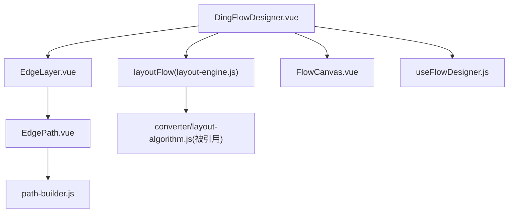
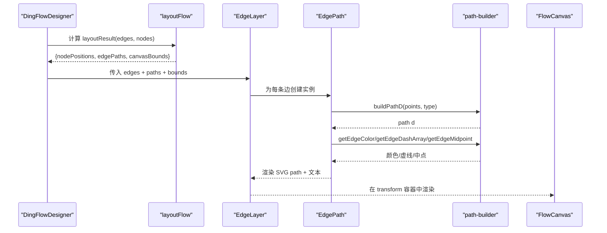
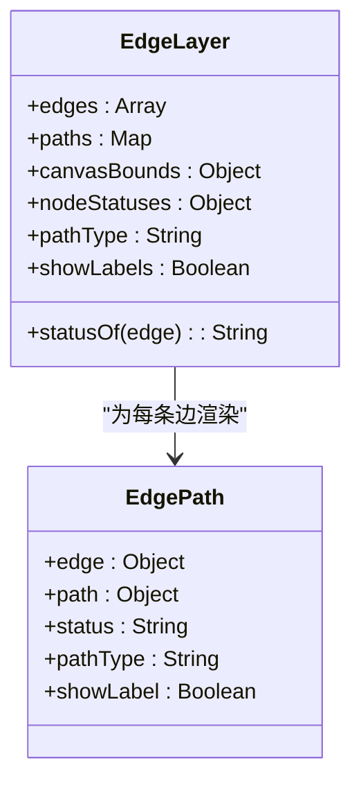
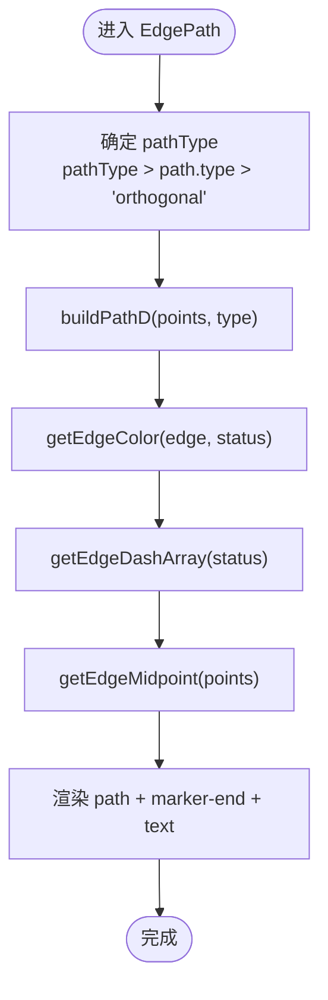
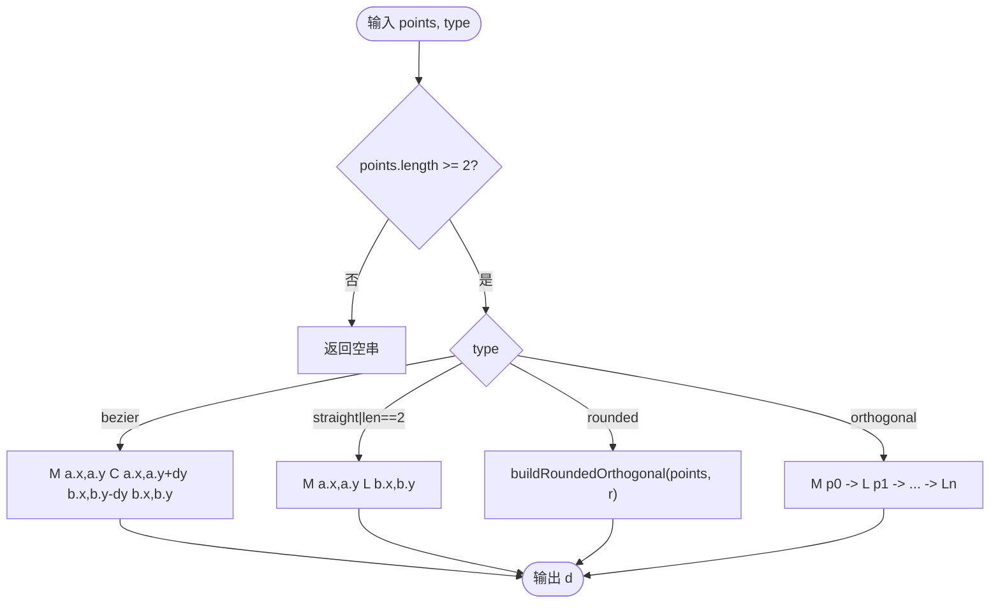
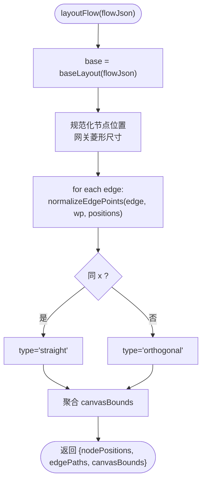
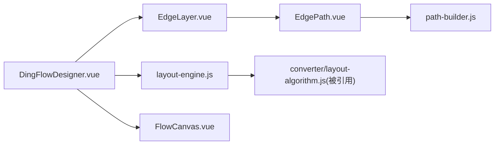

# 连接线层管理

<cite>
**本文引用的文件**
- [EdgeLayer.vue](file://forge-admin-ui/src/components/flow-designer/canvas/EdgeLayer.vue)
- [EdgePath.vue](file://forge-admin-ui/src/components/flow-designer/canvas/EdgePath.vue)
- [path-builder.js](file://forge-admin-ui/src/components/flow-designer/utils/path-builder.js)
- [layout-engine.js](file://forge-admin-ui/src/components/flow-designer/canvas/layout-engine.js)
- [DingFlowDesigner.vue](file://forge-admin-ui/src/components/flow-designer/DingFlowDesigner.vue)
- [FlowCanvas.vue](file://forge-admin-ui/src/components/flow-designer/canvas/FlowCanvas.vue)
- [useFlowDesigner.js](file://forge-admin-ui/src/components/flow-designer/composables/useFlowDesigner.js)
- [path-builder.spec.js](file://forge-admin-ui/src/components/flow-designer/utils/__tests__/path-builder.spec.js)
</cite>

## 目录
1. [简介](#简介)
2. [项目结构](#项目结构)
3. [核心组件](#核心组件)
4. [架构总览](#架构总览)
5. [详细组件分析](#详细组件分析)
6. [依赖关系分析](#依赖关系分析)
7. [性能考量](#性能考量)
8. [故障排查指南](#故障排查指南)
9. [结论](#结论)
10. [附录：自定义连线类型与样式开发指南](#附录自定义连线类型与样式开发指南)

## 简介
本技术文档聚焦于工作流设计器中的“连接线层”实现，围绕 EdgeLayer 组件的 SVG 连线渲染系统展开，系统性解析贝塞尔曲线计算、路径生成、箭头绘制、动态更新机制（节点移动时连线的实时重绘）、连接点吸附算法、样式定制、动画效果、交互功能、数据模型、性能优化策略与调试工具，并提供扩展自定义连线类型和样式的开发指南。

## 项目结构
连接线层由多个协作模块组成：
- 布局引擎：根据流程 JSON 计算节点位置、边折点与路径类型，输出用于渲染的坐标与类型信息。
- 连线层：基于 SVG 渲染连线、箭头与条件标签。
- 路径构建器：提供路径 d 字符串生成、中点计算、颜色与虚线样式等工具函数。
- 画布容器：提供缩放、平移、视口变换能力，支撑连线在缩放/平移下的正确显示。
- 设计器主组件：编排数据流、触发布局与渲染、处理用户交互。

图表来源
- [DingFlowDesigner.vue:56-59](file://forge-admin-ui/src/components/flow-designer/DingFlowDesigner.vue#L56-L59)
- [layout-engine.js:34-111](file://forge-admin-ui/src/components/flow-designer/canvas/layout-engine.js#L34-L111)
- [EdgeLayer.vue:18-37](file://forge-admin-ui/src/components/flow-designer/canvas/EdgeLayer.vue#L18-L37)
- [EdgePath.vue:22-35](file://forge-admin-ui/src/components/flow-designer/canvas/EdgePath.vue#L22-L35)
- [path-builder.js:35-60](file://forge-admin-ui/src/components/flow-designer/utils/path-builder.js#L35-L60)
- [FlowCanvas.vue:42-59](file://forge-admin-ui/src/components/flow-designer/canvas/FlowCanvas.vue#L42-L59)

章节来源
- [DingFlowDesigner.vue:56-59](file://forge-admin-ui/src/components/flow-designer/DingFlowDesigner.vue#L56-L59)
- [layout-engine.js:34-111](file://forge-admin-ui/src/components/flow-designer/canvas/layout-engine.js#L34-L111)
- [EdgeLayer.vue:18-37](file://forge-admin-ui/src/components/flow-designer/canvas/EdgeLayer.vue#L18-L37)
- [EdgePath.vue:22-35](file://forge-admin-ui/src/components/flow-designer/canvas/EdgePath.vue#L22-L35)
- [path-builder.js:35-60](file://forge-admin-ui/src/components/flow-designer/utils/path-builder.js#L35-L60)
- [FlowCanvas.vue:42-59](file://forge-admin-ui/src/components/flow-designer/canvas/FlowCanvas.vue#L42-L59)

## 核心组件
- EdgeLayer：SVG 连线层容器，负责声明箭头 marker、计算 SVG 尺寸、遍历 edges 并传入 EdgePath。
- EdgePath：单条边的渲染单元，计算 path d、颜色、虚线、中点以放置条件文本。
- layout-engine：将流程 JSON 转换为节点位置 Map、边路径 Map（含 points 与 type）以及 canvasBounds。
- path-builder：路径 d 构造、中点计算、颜色与虚线样式工具。
- FlowCanvas：画布容器，提供缩放/平移/视口变换，确保连线与节点在同一坐标系下渲染。
- DingFlowDesigner：编排数据流，使用 computed 同步计算 layoutResult，驱动 EdgeLayer 与 NodeRenderer。

章节来源
- [EdgeLayer.vue:1-37](file://forge-admin-ui/src/components/flow-designer/canvas/EdgeLayer.vue#L1-L37)
- [EdgePath.vue:1-35](file://forge-admin-ui/src/components/flow-designer/canvas/EdgePath.vue#L1-L35)
- [layout-engine.js:1-151](file://forge-admin-ui/src/components/flow-designer/canvas/layout-engine.js#L1-L151)
- [path-builder.js:1-158](file://forge-admin-ui/src/components/flow-designer/utils/path-builder.js#L1-L158)
- [FlowCanvas.vue:1-262](file://forge-admin-ui/src/components/flow-designer/canvas/FlowCanvas.vue#L1-L262)
- [DingFlowDesigner.vue:56-59](file://forge-admin-ui/src/components/flow-designer/DingFlowDesigner.vue#L56-L59)

## 架构总览
连接线层的渲染链路如下：
- 设计器维护 flowJson，通过 computed 调用 layoutFlow 得到 layoutResult（包含 nodePositions、edgePaths、canvasBounds）。
- EdgeLayer 接收 edges 与 paths，计算 SVG 尺寸，并为每条边创建 EdgePath。
- EdgePath 调用 path-builder 生成 path d、颜色、虚线与中点，最终渲染为 SVG path 与可选文本。
- FlowCanvas 提供 transform 样式，使连线与节点在同一视口内响应缩放和平移。

图表来源
- [DingFlowDesigner.vue:56-59](file://forge-admin-ui/src/components/flow-designer/DingFlowDesigner.vue#L56-L59)
- [layout-engine.js:34-111](file://forge-admin-ui/src/components/flow-designer/canvas/layout-engine.js#L34-L111)
- [EdgeLayer.vue:18-37](file://forge-admin-ui/src/components/flow-designer/canvas/EdgeLayer.vue#L18-L37)
- [EdgePath.vue:22-35](file://forge-admin-ui/src/components/flow-designer/canvas/EdgePath.vue#L22-L35)
- [path-builder.js:35-60](file://forge-admin-ui/src/components/flow-designer/utils/path-builder.js#L35-L60)
- [FlowCanvas.vue:42-59](file://forge-admin-ui/src/components/flow-designer/canvas/FlowCanvas.vue#L42-L59)

## 详细组件分析

### EdgeLayer 组件分析
- 职责：定义 SVG 尺寸、注册箭头 marker、遍历 edges 并将每条边传递给 EdgePath。
- 关键逻辑：
  - 根据 canvasBounds 计算 SVG 宽高，保证足够留白。
  - 状态映射：从 nodeStatuses 取 source 节点状态作为边状态（遵循 spec 10.8）。
  - 支持全局 pathType 覆盖，便于统一切换连线风格。
- 性能：使用 Map 存储 paths，按 edge.id 查找，避免重复计算。

图表来源
- [EdgeLayer.vue:18-37](file://forge-admin-ui/src/components/flow-designer/canvas/EdgeLayer.vue#L18-L37)
- [EdgePath.vue:22-35](file://forge-admin-ui/src/components/flow-designer/canvas/EdgePath.vue#L22-L35)

章节来源
- [EdgeLayer.vue:1-37](file://forge-admin-ui/src/components/flow-designer/canvas/EdgeLayer.vue#L1-L37)

### EdgePath 组件分析
- 职责：单条边的渲染，计算 path d、颜色、虚线、中点，并在路径中点显示条件文本。
- 关键逻辑：
  - finalType 优先级：props.pathType > path.type > 'orthogonal'。
  - 通过 path-builder 生成 d、颜色、虚线、中点。
  - 使用 marker-end 添加箭头，颜色与线一致。
- 交互：条件文本可截断并配合 tooltip（由上层 UI 控制）。

图表来源
- [EdgePath.vue:22-35](file://forge-admin-ui/src/components/flow-designer/canvas/EdgePath.vue#L22-L35)
- [path-builder.js:35-60](file://forge-admin-ui/src/components/flow-designer/utils/path-builder.js#L35-L60)
- [path-builder.js:104-133](file://forge-admin-ui/src/components/flow-designer/utils/path-builder.js#L104-L133)
- [path-builder.js:140-155](file://forge-admin-ui/src/components/flow-designer/utils/path-builder.js#L140-L155)

章节来源
- [EdgePath.vue:1-35](file://forge-admin-ui/src/components/flow-designer/canvas/EdgePath.vue#L1-L35)
- [path-builder.js:35-60](file://forge-admin-ui/src/components/flow-designer/utils/path-builder.js#L35-L60)
- [path-builder.js:104-133](file://forge-admin-ui/src/components/flow-designer/utils/path-builder.js#L104-L133)
- [path-builder.js:140-155](file://forge-admin-ui/src/components/flow-designer/utils/path-builder.js#L140-L155)

### 路径构建器（path-builder）分析
- 路径类型：
  - straight：两点直线 M x1,y1 L x2,y2。
  - orthogonal：按 waypoints 直角折线 M + 多段 L。
  - rounded：折线 + 拐角处二次贝塞尔圆角 Q。
  - bezier：首尾两点之间的三次贝塞尔曲线 C，控制点垂直对齐。
- 辅助函数：
  - getEdgeMidpoint：累计线段长度，找到路径中点，用于条件标签定位。
  - getEdgeColor：按状态或 isDefault 分支返回颜色。
  - getEdgeDashArray：pending/rejected/skipped 使用虚线。
- 复杂度：
  - buildPathD：O(n)，n 为点数。
  - getEdgeMidpoint：O(n)，累计长度后线性扫描。
  - 空间：O(1) 额外空间（除结果字符串）。

图表来源
- [path-builder.js:35-60](file://forge-admin-ui/src/components/flow-designer/utils/path-builder.js#L35-L60)
- [path-builder.js:65-82](file://forge-admin-ui/src/components/flow-designer/utils/path-builder.js#L65-L82)

章节来源
- [path-builder.js:1-158](file://forge-admin-ui/src/components/flow-designer/utils/path-builder.js#L1-158)

### 布局引擎（layout-engine）分析
- 职责：复用 converter 的 calculateLayout 计算节点位置与原始 waypoints，再规范化边起止点到真实节点边界，识别路径类型（同 x → straight；否则 orthogonal），聚合 canvasBounds。
- 关键点：
  - 网关节点使用菱形尺寸，不占用普通任务卡尺寸。
  - normalizeEdgePoints：修正起点/终点到源/目标节点的边界中心，保持折点方向一致性。
  - canvasBounds：聚合所有节点与 waypoint，用于 fitToScreen。
- 性能：Map 存取 O(1)，整体复杂度 O(N+E)。

图表来源
- [layout-engine.js:34-111](file://forge-admin-ui/src/components/flow-designer/canvas/layout-engine.js#L34-L111)
- [layout-engine.js:113-150](file://forge-admin-ui/src/components/flow-designer/canvas/layout-engine.js#L113-L150)

章节来源
- [layout-engine.js:1-151](file://forge-admin-ui/src/components/flow-designer/canvas/layout-engine.js#L1-L151)

### 画布容器（FlowCanvas）与视口变换
- 职责：提供 transform 样式、缩放/平移、双击重置视图、屏幕坐标与画布坐标转换。
- 对连线的影响：EdgeLayer 与 NodeRenderer 置于同一 transform 容器中，确保缩放/平移后连线与节点相对位置不变。
- 性能：transform 由 CSS 驱动，GPU 加速，减少重排重绘。

章节来源
- [FlowCanvas.vue:1-262](file://forge-admin-ui/src/components/flow-designer/canvas/FlowCanvas.vue#L1-L262)

### 设计器主组件（DingFlowDesigner）的数据流编排
- 使用 computed 同步计算 layoutResult，避免 ref+watch 异步时序导致新增节点渲染错位。
- 将 edges、paths、bounds 注入 EdgeLayer，nodes 注入 NodeRenderer。
- 自动适配：autoFitToScreen 基于 canvasBounds 调整视口。

章节来源
- [DingFlowDesigner.vue:56-59](file://forge-admin-ui/src/components/flow-designer/DingFlowDesigner.vue#L56-L59)
- [DingFlowDesigner.vue:654-666](file://forge-admin-ui/src/components/flow-designer/DingFlowDesigner.vue#L654-L666)

## 依赖关系分析
- EdgeLayer 依赖 EdgePath 与 path-builder。
- EdgePath 依赖 path-builder。
- layout-engine 依赖 converter/layout-algorithm（被引用）。
- DingFlowDesigner 依赖 layout-engine、EdgeLayer、NodeRenderer、FlowCanvas。
- FlowCanvas 暴露 viewport 方法供父组件调用。

图表来源
- [DingFlowDesigner.vue:56-59](file://forge-admin-ui/src/components/flow-designer/DingFlowDesigner.vue#L56-L59)
- [layout-engine.js:20-21](file://forge-admin-ui/src/components/flow-designer/canvas/layout-engine.js#L20-L21)
- [EdgeLayer.vue:14-16](file://forge-admin-ui/src/components/flow-designer/canvas/EdgeLayer.vue#L14-L16)
- [EdgePath.vue:14-20](file://forge-admin-ui/src/components/flow-designer/canvas/EdgePath.vue#L14-L20)
- [FlowCanvas.vue:23-24](file://forge-admin-ui/src/components/flow-designer/canvas/FlowCanvas.vue#L23-L24)

章节来源
- [DingFlowDesigner.vue:56-59](file://forge-admin-ui/src/components/flow-designer/DingFlowDesigner.vue#L56-L59)
- [layout-engine.js:20-21](file://forge-admin-ui/src/components/flow-designer/canvas/layout-engine.js#L20-L21)
- [EdgeLayer.vue:14-16](file://forge-admin-ui/src/components/flow-designer/canvas/EdgeLayer.vue#L14-L16)
- [EdgePath.vue:14-20](file://forge-admin-ui/src/components/flow-designer/canvas/EdgePath.vue#L14-L20)
- [FlowCanvas.vue:23-24](file://forge-admin-ui/src/components/flow-designer/canvas/FlowCanvas.vue#L23-L24)

## 性能考量
- 路径计算复杂度：buildPathD 与 getEdgeMidpoint 均为 O(n)，适合中等规模流程图。
- 渲染优化：
  - 使用 Map 存储 paths，按 id 查找避免全量遍历。
  - computed 缓存 layoutResult，减少重复计算。
  - SVG marker 复用，避免重复定义。
  - FlowCanvas 使用 transform 进行缩放/平移，利用 GPU 加速。
- 大数据集建议：
  - 分页或虚拟化渲染超大流程图。
  - 合并多次状态变更批量触发布局。
  - 限制同时可见的边数量（如仅渲染选中分支）。

[本节为通用性能指导，无需特定文件来源]

## 故障排查指南
- 连线未显示：
  - 检查 paths 是否为空或 edge.id 未匹配。
  - 确认 layoutFlow 已执行且返回有效 edgePaths。
- 箭头方向错误：
  - 检查 normalizeEdgePoints 是否正确修正起止点到节点边界。
  - 确认 marker-end 指向目标端点。
- 条件文本位置异常：
  - 验证 getEdgeMidpoint 计算是否基于实际路径分段长度。
- 状态颜色不正确：
  - 检查 nodeStatuses 与 edge.isDefault 优先级。
- 缩放/平移后连线错位：
  - 确认 EdgeLayer 与 NodeRenderer 位于 FlowCanvas 的 transform 容器内。

章节来源
- [layout-engine.js:113-150](file://forge-admin-ui/src/components/flow-designer/canvas/layout-engine.js#L113-L150)
- [path-builder.js:104-133](file://forge-admin-ui/src/components/flow-designer/utils/path-builder.js#L104-L133)
- [path-builder.js:140-155](file://forge-admin-ui/src/components/flow-designer/utils/path-builder.js#L140-L155)
- [FlowCanvas.vue:166-180](file://forge-admin-ui/src/components/flow-designer/canvas/FlowCanvas.vue#L166-L180)

## 结论
连接线层通过清晰的职责划分与模块化设计，实现了高效的 SVG 连线渲染与动态更新。布局引擎负责几何计算，路径构建器提供灵活的曲线与样式能力，EdgeLayer/EdgePath 专注渲染细节，FlowCanvas 提供统一的视口变换。该架构具备良好的可扩展性，便于自定义连线类型与样式，并可通过测试与调试工具保障稳定性。

[本节为总结性内容，无需特定文件来源]

## 附录：自定义连线类型与样式开发指南
- 新增连线类型：
  - 在 path-builder 中扩展 buildPathD，支持新 type（如 smooth、polyline 等），并确保 getEdgeMidpoint 能准确计算中点。
  - 在 EdgePath 的 finalType 逻辑中允许新类型透传。
- 自定义样式：
  - 扩展 COLORS 常量，增加新状态颜色。
  - 在 getEdgeDashArray 中为新状态添加虚线模式。
  - 在 EdgeLayer 中注册新的 marker（箭头形状），并通过 EdgePath 的 marker-end 引用。
- 动画效果：
  - 使用 stroke-dasharray 与 CSS animation 实现流动效果（例如 running 状态脉冲）。
  - 结合 FlowCanvas 的缩放/平移，确保动画在视口变换下正常播放。
- 交互功能：
  - 在 EdgePath 中添加 hover/点击事件，触发条件编辑或高亮。
  - 结合 useFlowDesigner 的 updateEdge/reconnect 接口实现拖拽重连。
- 调试工具：
  - 使用 path-builder.spec.js 验证路径生成正确性。
  - 在浏览器开发者工具中检查 SVG 元素与 computed styles。
  - 打印 layoutResult 与 paths Map，核对 edgePaths 与 nodePositions。

章节来源
- [path-builder.js:16-24](file://forge-admin-ui/src/components/flow-designer/utils/path-builder.js#L16-L24)
- [path-builder.js:35-60](file://forge-admin-ui/src/components/flow-designer/utils/path-builder.js#L35-L60)
- [path-builder.js:140-155](file://forge-admin-ui/src/components/flow-designer/utils/path-builder.js#L140-L155)
- [path-builder.spec.js:1-53](file://forge-admin-ui/src/components/flow-designer/utils/__tests__/path-builder.spec.js#L1-L53)
- [useFlowDesigner.js:336-347](file://forge-admin-ui/src/components/flow-designer/composables/useFlowDesigner.js#L336-L347)