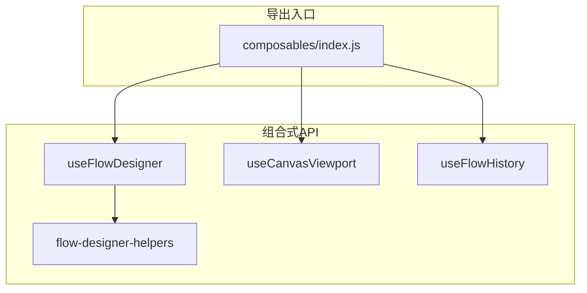
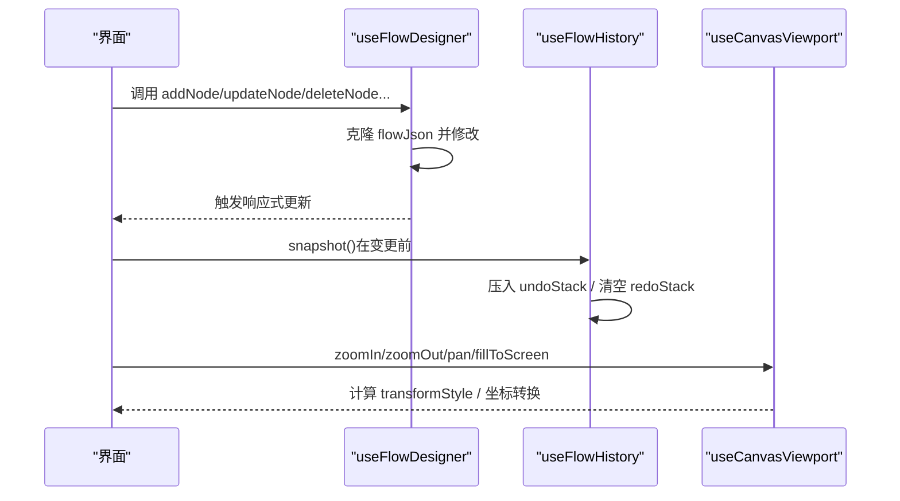
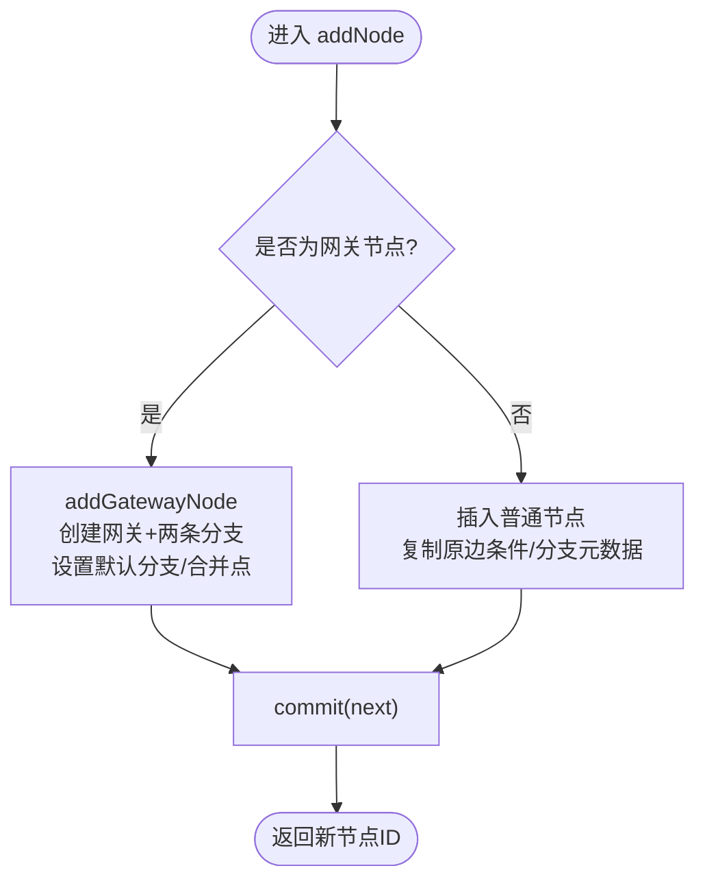
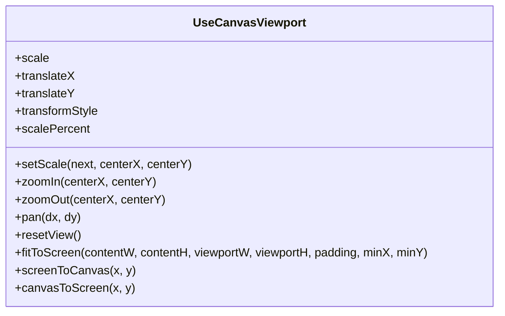
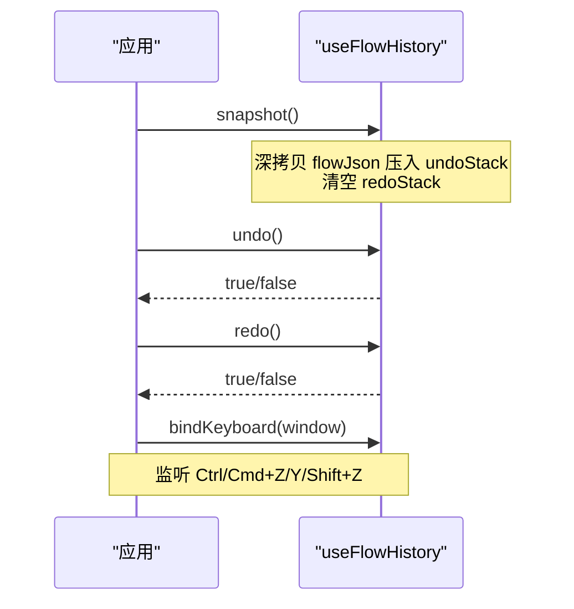
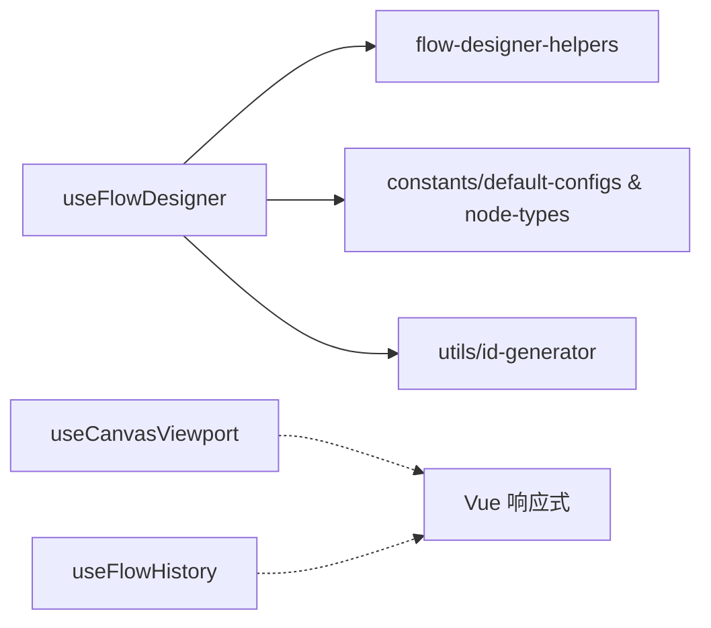

# 组合式函数

<cite>
**本文引用的文件**
- [useFlowDesigner.js](file://forge-admin-ui/src/components/flow-designer/composables/useFlowDesigner.js)
- [useCanvasViewport.js](file://forge-admin-ui/src/components/flow-designer/composables/useCanvasViewport.js)
- [useFlowHistory.js](file://forge-admin-ui/src/components/flow-designer/composables/useFlowHistory.js)
- [flow-designer-helpers.js](file://forge-admin-ui/src/components/flow-designer/composables/flow-designer-helpers.js)
- [index.js](file://forge-admin-ui/src/components/flow-designer/composables/index.js)
- [useFlowDesigner.spec.js](file://forge-admin-ui/src/components/flow-designer/composables/__tests__/useFlowDesigner.spec.js)
- [useCanvasViewport.spec.js](file://forge-admin-ui/src/components/flow-designer/composables/__tests__/useCanvasViewport.spec.js)
- [useFlowHistory.spec.js](file://forge-admin-ui/src/components/flow-designer/composables/__tests__/useFlowHistory.spec.js)
</cite>

## 目录
1. [简介](#简介)
2. [项目结构](#项目结构)
3. [核心组件](#核心组件)
4. [架构总览](#架构总览)
5. [详细组件分析](#详细组件分析)
6. [依赖关系分析](#依赖关系分析)
7. [性能考量](#性能考量)
8. [故障排查指南](#故障排查指南)
9. [结论](#结论)
10. [附录：使用示例与扩展](#附录使用示例与扩展)

## 简介
本技术文档聚焦工作流设计器的前端组合式函数，系统性解析以下三个核心能力：
- useFlowDesigner：流程编辑态主控制器，负责流程模型（节点、边）的增删改查、选择状态、导入导出与重置。
- useCanvasViewport：画布视口控制，提供缩放、平移、坐标转换与适配屏幕等能力。
- useFlowHistory：撤销/重做历史管理，基于 JSON 快照的命令栈，支持键盘快捷键绑定与容量限制。

文档将围绕状态管理、事件处理、数据同步、错误处理、性能优化与测试策略展开，并提供可操作的配置与扩展建议。

## 项目结构
组合式函数位于 flow-designer 模块下的 composables 目录，统一通过 index.js 暴露对外 API。每个组合式函数职责单一、边界清晰，并通过工具函数与常量进行解耦。

图表来源
- [index.js:1-13](file://forge-admin-ui/src/components/flow-designer/composables/index.js#L1-L13)
- [useFlowDesigner.js:1-387](file://forge-admin-ui/src/components/flow-designer/composables/useFlowDesigner.js#L1-L387)
- [useCanvasViewport.js:1-133](file://forge-admin-ui/src/components/flow-designer/composables/useCanvasViewport.js#L1-L133)
- [useFlowHistory.js:1-117](file://forge-admin-ui/src/components/flow-designer/composables/useFlowHistory.js#L1-L117)
- [flow-designer-helpers.js:1-106](file://forge-admin-ui/src/components/flow-designer/composables/flow-designer-helpers.js#L1-L106)

章节来源
- [index.js:1-13](file://forge-admin-ui/src/components/flow-designer/composables/index.js#L1-L13)

## 核心组件
- useFlowDesigner
  - 职责：维护 flowJson 响应式状态；提供节点/边的 CRUD、查询、整体加载/导出/重置；管理选中节点。
  - 关键约束：start/end 不可删除或复制；插入网关后自动创建分支并标记合并点；线性链移动需满足入度/出度为1。
- useCanvasViewport
  - 职责：维护 scale、translateX、translateY；计算 transformStyle；提供缩放、平移、适配屏幕、坐标转换。
  - 关键点：以屏幕坐标为锚点的缩放公式；浮点步长修正避免精度误差。
- useFlowHistory
  - 职责：基于 JSON 深拷贝的撤销/重做栈；支持 maxStack 容量限制；键盘快捷键绑定与清理。
  - 关键点：snapshot 在变更操作前调用；redo 在新 snapshot 时清空；返回布尔值表示是否成功执行。

章节来源
- [useFlowDesigner.js:1-387](file://forge-admin-ui/src/components/flow-designer/composables/useFlowDesigner.js#L1-L387)
- [useCanvasViewport.js:1-133](file://forge-admin-ui/src/components/flow-designer/composables/useCanvasViewport.js#L1-L133)
- [useFlowHistory.js:1-117](file://forge-admin-ui/src/components/flow-designer/composables/useFlowHistory.js#L1-L117)

## 架构总览
下图展示了三个组合式函数的协作关系与数据流向：编辑器变更通过 useFlowDesigner 修改 flowJson；useFlowHistory 对 flowJson 进行快照记录；视图层通过 useCanvasViewport 渲染与交互；三者通过 Vue 响应式系统联动。

图表来源
- [useFlowDesigner.js:49-387](file://forge-admin-ui/src/components/flow-designer/composables/useFlowDesigner.js#L49-L387)
- [useFlowHistory.js:25-117](file://forge-admin-ui/src/components/flow-designer/composables/useFlowHistory.js#L25-L117)
- [useCanvasViewport.js:30-127](file://forge-admin-ui/src/components/flow-designer/composables/useCanvasViewport.js#L30-L127)

## 详细组件分析

### useFlowDesigner 主控制器
- 状态与初始化
  - flowJson：shallowRef 存储流程模型，包含 nodes、edges、processId、processName、config。
  - selectedNodeId：当前选中节点 ID。
  - idGen：唯一 ID 生成器，基于已存在 ID 集合初始化。
- 节点与边操作
  - addNode：在指定节点之后插入普通节点或网关节点；保留原边条件信息；网关自动生成两条分支并设置默认分支。
  - addBranch：仅对网关节点添加新分支，自动连接汇合点并归一化默认分支。
  - deleteNode：禁止删除 start/end；普通节点采用“入边×出边”笛卡儿重连；网关节点递归删除分支链至汇合点。
  - updateNode：顶层字段直接覆盖；config 字段浅合并。
  - moveNodeUp/moveNodeDown：仅在入度=出度=1 的线性链中交换相邻节点位置。
  - copyNode：复制节点并插入到原节点之后，名称追加“副本”。
  - updateEdge/reconnect：更新边属性或重连源/目标。
- 查询与生命周期
  - getNode/getEdge/getOutgoingEdges/getIncomingEdges/findStartNode/findEndNode。
  - loadJson/exportJson/reset：替换内部状态、导出深拷贝、重置为空流程。
- 错误处理
  - 参数校验失败抛出明确错误（如 afterId/nodeId/edgeId 不存在、start/end 不允许删除/复制、线性链移动越界等）。

图表来源
- [useFlowDesigner.js:63-158](file://forge-admin-ui/src/components/flow-designer/composables/useFlowDesigner.js#L63-L158)

章节来源
- [useFlowDesigner.js:25-387](file://forge-admin-ui/src/components/flow-designer/composables/useFlowDesigner.js#L25-L387)
- [flow-designer-helpers.js:33-103](file://forge-admin-ui/src/components/flow-designer/composables/flow-designer-helpers.js#L33-L103)

### useCanvasViewport 画布视口管理
- 状态与计算
  - scale、translateX、translateY：缩放比例与偏移。
  - transformStyle：computed 生成 CSS transform 字符串。
  - scalePercent：百分比显示。
- 核心方法
  - setScale(next, centerX, centerY)：以屏幕坐标为锚点进行缩放，保持鼠标/触摸点视觉稳定。
  - zoomIn/zoomOut：按步长调整缩放，带浮点修正。
  - pan(dx, dy)：相对平移。
  - resetView：恢复初始缩放与偏移。
  - fitToScreen(contentW, contentH, viewportW, viewportH, padding, minX, minY)：内容居中并按比例缩放到适应视口。
  - screenToCanvas/canvasToScreen：屏幕与画布坐标互转。
- 配置项
  - minScale/maxScale/zoomStep/initialScale/initialX/initialY。

图表来源
- [useCanvasViewport.js:30-127](file://forge-admin-ui/src/components/flow-designer/composables/useCanvasViewport.js#L30-L127)

章节来源
- [useCanvasViewport.js:1-133](file://forge-admin-ui/src/components/flow-designer/composables/useCanvasViewport.js#L1-L133)

### useFlowHistory 历史管理
- 状态与能力
  - undoStack/redoStack：撤销/重做栈。
  - canUndo/canRedo：是否可操作。
  - snapshot()：深拷贝当前 flowJson 压入撤销栈，并清空重做栈。
  - undo()/redo()：弹出并恢复上一个/下一个快照，返回布尔值指示是否成功。
  - clear()：清空两个栈。
  - bindKeyboard(target)：绑定 Ctrl/Cmd+Z/Y/Shift+Z 快捷键，返回 unbind 函数用于卸载。
- 容量控制
  - maxStack：超出时丢弃最早项（FIFO），默认 50。
- 使用约定
  - 在每次变更操作前调用 snapshot()；拖拽场景建议在 drop 完成后调用以避免过多快照。

图表来源
- [useFlowHistory.js:25-117](file://forge-admin-ui/src/components/flow-designer/composables/useFlowHistory.js#L25-L117)

章节来源
- [useFlowHistory.js:1-117](file://forge-admin-ui/src/components/flow-designer/composables/useFlowHistory.js#L1-L117)

## 依赖关系分析
- useFlowDesigner 依赖
  - flow-designer-helpers：cloneJson、makeEdge、deletePlain、deleteGateway、GATEWAY_TYPES。
  - 常量：NODE_TYPE、default-configs（构建节点）、id-generator（唯一 ID）。
- useCanvasViewport 无外部业务依赖，仅使用 Vue 响应式。
- useFlowHistory 无业务依赖，仅使用 Vue 响应式与 JSON 深拷贝。

图表来源
- [useFlowDesigner.js:17-23](file://forge-admin-ui/src/components/flow-designer/composables/useFlowDesigner.js#L17-L23)
- [flow-designer-helpers.js:1-106](file://forge-admin-ui/src/components/flow-designer/composables/flow-designer-helpers.js#L1-L106)

章节来源
- [useFlowDesigner.js:17-23](file://forge-admin-ui/src/components/flow-designer/composables/useFlowDesigner.js#L17-L23)
- [flow-designer-helpers.js:1-106](file://forge-admin-ui/src/components/flow-designer/composables/flow-designer-helpers.js#L1-L106)

## 性能考量
- 使用 shallowRef 存储 flowJson，减少深层响应式开销，适合大型图结构。
- 变更操作均先 cloneJson 再提交，保证不可变更新，便于撤销/重做与并发安全。
- 网格/连线较多时，批量操作应合并多次变更后再 snapshot，降低历史栈压力。
- 视口缩放使用 computed 生成 transformStyle，避免重复计算。
- 坐标转换与缩放采用数学公式，时间复杂度 O(1)。
- 历史栈容量限制防止内存增长过快。

[本节为通用性能建议，不直接分析具体文件]

## 故障排查指南
- 常见错误与定位
  - “afterId/nodeId/edgeId 不存在”：检查传入 ID 是否正确，确认节点/边已被创建且未被删除。
  - “start/end 不允许删除/复制”：确保未对起始/结束节点执行受限操作。
  - “已在最顶端/最底端”：moveNodeUp/Down 在链两端无法继续移动，需调整逻辑。
  - “仅支持网关节点添加分支”：确认 gatewayId 指向 condition/parallel/inclusive 类型。
  - “仅支持线性链中节点”：moveNodeUp/Down 要求入度=出度=1，非链状结构不支持。
- 调试建议
  - 在变更前后打印 flowJson.nodes/edges 长度与关键边属性（condition、branchId、isDefault）。
  - 使用浏览器开发者工具断点查看 selectedNodeId 变化。
  - 对视口问题，检查 transformStyle 输出与 fitToScreen 输入尺寸。
  - 对历史问题，检查 undoStack/redoStack 长度与快照时机。

章节来源
- [useFlowDesigner.js:63-347](file://forge-admin-ui/src/components/flow-designer/composables/useFlowDesigner.js#L63-L347)
- [useFlowHistory.js:70-99](file://forge-admin-ui/src/components/flow-designer/composables/useFlowHistory.js#L70-L99)

## 结论
三个组合式函数形成了工作流设计器的核心能力闭环：
- useFlowDesigner 提供稳定的流程模型操作与查询接口。
- useCanvasViewport 提供流畅的画布交互体验。
- useFlowHistory 保障用户操作的可逆性与容错性。
通过清晰的职责划分与响应式数据流，它们共同支撑了复杂流程编辑场景的高可用与高性能实现。

[本节为总结性内容，不直接分析具体文件]

## 附录：使用示例与扩展
- 基本用法
  - 初始化设计器：const designer = useFlowDesigner(initialJson); 获取 flowJson、selectedNodeId 及操作方法。
  - 初始化视口：const viewport = useCanvasViewport({ minScale: 0.3, maxScale: 2.0 }); 使用 transformStyle 绑定到容器。
  - 初始化历史：const history = useFlowHistory(designer.flowJson, { maxStack: 50 }); 在每次变更前调用 history.snapshot()。
- 典型流程
  - 新增节点：designer.addNode(afterId, nodeType, override); 随后 history.snapshot();
  - 删除节点：designer.deleteNode(nodeId); 随后 history.snapshot();
  - 缩放/平移：viewport.zoomIn()/pan()/fitToScreen();
  - 撤销/重做：history.undo()/redo(); 或通过 bindKeyboard 绑定快捷键。
- 扩展方法
  - 自定义节点类型：在 NODE_TYPE 与 default-configs 中扩展，并在 useFlowDesigner 中适配逻辑。
  - 自定义视口行为：封装 setScale/fitToScreen 为更高层 API，结合动画过渡提升体验。
  - 历史策略：根据业务需求调整 maxStack，或在特定场景禁用快照以减少内存占用。
- 测试要点
  - 节点/边 CRUD：验证插入、删除、移动后的拓扑正确性与元数据保留。
  - 视口行为：验证缩放限制、锚点缩放、坐标互逆、适配居中。
  - 历史栈：验证快照时机、撤销/重做顺序、容量限制、键盘绑定与卸载。

章节来源
- [useFlowDesigner.spec.js:1-262](file://forge-admin-ui/src/components/flow-designer/composables/__tests__/useFlowDesigner.spec.js#L1-L262)
- [useCanvasViewport.spec.js:1-108](file://forge-admin-ui/src/components/flow-designer/composables/__tests__/useCanvasViewport.spec.js#L1-L108)
- [useFlowHistory.spec.js:1-168](file://forge-admin-ui/src/components/flow-designer/composables/__tests__/useFlowHistory.spec.js#L1-L168)