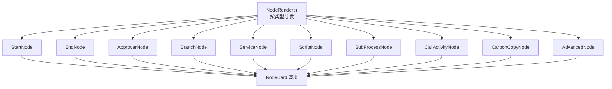
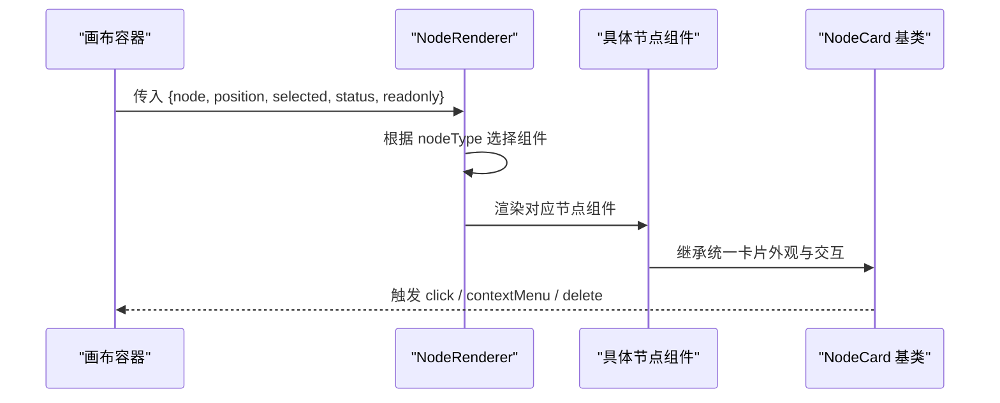
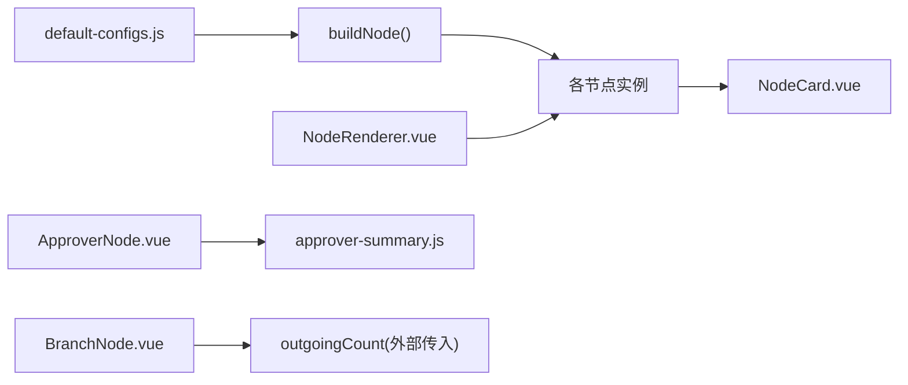

# 内置节点组件

<cite>
**本文引用的文件**
- [NodeCard.vue](file://forge-admin-ui/src/components/flow-designer/nodes/NodeCard.vue)
- [StartNode.vue](file://forge-admin-ui/src/components/flow-designer/nodes/StartNode.vue)
- [EndNode.vue](file://forge-admin-ui/src/components/flow-designer/nodes/EndNode.vue)
- [ApproverNode.vue](file://forge-admin-ui/src/components/flow-designer/nodes/ApproverNode.vue)
- [BranchNode.vue](file://forge-admin-ui/src/components/flow-designer/nodes/BranchNode.vue)
- [ServiceNode.vue](file://forge-admin-ui/src/components/flow-designer/nodes/ServiceNode.vue)
- [ScriptNode.vue](file://forge-admin-ui/src/components/flow-designer/nodes/ScriptNode.vue)
- [SubProcessNode.vue](file://forge-admin-ui/src/components/flow-designer/nodes/SubProcessNode.vue)
- [CallActivityNode.vue](file://forge-admin-ui/src/components/flow-designer/nodes/CallActivityNode.vue)
- [AdvancedNode.vue](file://forge-admin-ui/src/components/flow-designer/nodes/AdvancedNode.vue)
- [CarbonCopyNode.vue](file://forge-admin-ui/src/components/flow-designer/nodes/CarbonCopyNode.vue)
- [NodeRenderer.vue](file://forge-admin-ui/src/components/flow-designer/canvas/NodeRenderer.vue)
- [default-configs.js](file://forge-admin-ui/src/components/flow-designer/constants/default-configs.js)
- [approver-summary.js](file://forge-admin-ui/src/components/flow-designer/utils/approver-summary.js)
</cite>

## 目录
1. [简介](#简介)
2. [项目结构](#项目结构)
3. [核心组件](#核心组件)
4. [架构总览](#架构总览)
5. [详细组件分析](#详细组件分析)
6. [依赖关系分析](#依赖关系分析)
7. [性能考量](#性能考量)
8. [故障排查指南](#故障排查指南)
9. [结论](#结论)
10. [附录](#附录)

## 简介
本技术文档面向工作流设计器中的“内置节点组件”，系统性说明各节点的功能特性、配置选项、使用场景与实现原理，覆盖开始节点、结束节点、审批节点、分支节点（条件/并行/包容）、脚本节点、服务调用节点、子流程节点、抄送节点和高级节点。文档还阐述属性绑定、事件处理、验证规则、样式定制方法，以及节点间通信机制、数据传递与状态同步策略，并提供使用示例、常见问题排查与性能优化建议。

## 项目结构
工作流设计器的节点体系由“渲染调度 + 统一卡片基类 + 具体节点组件”构成：
- 渲染调度：NodeRenderer 根据 nodeType 动态选择对应节点组件，并透传位置、选中态、只读等上下文。
- 统一卡片基类：NodeCard 提供统一的视觉骨架（色条、标题行、摘要区、状态徽章、删除按钮、选中高亮），所有业务节点复用该基类以保持一致体验。
- 具体节点组件：StartNode、EndNode、ApproverNode、BranchNode、ServiceNode、ScriptNode、SubProcessNode、CallActivityNode、CarbonCopyNode、AdvancedNode 分别承载各自语义与展示逻辑。
- 默认配置：default-configs.js 定义每种 nodeType 的默认 config、显示名与 BPMN 元素映射，并提供 buildNode 工厂方法构造新节点骨架。

图表来源
- [NodeRenderer.vue:1-85](file://forge-admin-ui/src/components/flow-designer/canvas/NodeRenderer.vue#L1-L85)
- [NodeCard.vue:1-267](file://forge-admin-ui/src/components/flow-designer/nodes/NodeCard.vue#L1-L267)

章节来源
- [NodeRenderer.vue:1-85](file://forge-admin-ui/src/components/flow-designer/canvas/NodeRenderer.vue#L1-L85)
- [default-configs.js:1-172](file://forge-admin-ui/src/components/flow-designer/constants/default-configs.js#L1-L172)

## 核心组件
- NodeCard（卡片基类）
  - 职责：统一布局与交互（点击、右键菜单、删除）、状态徽章、颜色变量、尺寸控制、只读模式。
  - 关键能力：通过 colorVar 注入主题色；statusBadge 展示运行/完成/待办等状态；插槽支持扩展标题右侧内容。
- NodeRenderer（渲染调度器）
  - 职责：维护 RENDERER_MAP，将 nodeType 映射到具体组件；计算分支节点 outgoingCount；应用绝对定位。
  - 事件透传：click、delete、contextMenu 直接透传给被调度的节点组件。
- default-configs（默认配置与构建）
  - 职责：为每种 nodeType 提供默认 config、默认名称、BPMN 元素类型映射；buildNode 用于创建新节点骨架。

章节来源
- [NodeCard.vue:1-267](file://forge-admin-ui/src/components/flow-designer/nodes/NodeCard.vue#L1-L267)
- [NodeRenderer.vue:1-85](file://forge-admin-ui/src/components/flow-designer/canvas/NodeRenderer.vue#L1-L85)
- [default-configs.js:1-172](file://forge-admin-ui/src/components/flow-designer/constants/default-configs.js#L1-L172)

## 架构总览
下图展示了从画布到节点卡片的渲染链路，以及节点间的事件传播路径。

图表来源
- [NodeRenderer.vue:1-85](file://forge-admin-ui/src/components/flow-designer/canvas/NodeRenderer.vue#L1-L85)
- [NodeCard.vue:1-267](file://forge-admin-ui/src/components/flow-designer/nodes/NodeCard.vue#L1-L267)

## 详细组件分析

### 开始节点（StartNode）
- 功能特性
  - 表示流程起点，不可删除，强调“系统自动记录发起人”。
  - 配色采用 success 色系，图标使用播放符号。
- 配置选项
  - 默认配置包含 initiator 字段，用于标识发起人来源。
- 使用场景
  - 作为流程入口，通常不承载业务逻辑，仅初始化上下文。
- 属性绑定与事件
  - 透传 node、selected、status、readonly；emit click/contextMenu。
- 样式定制
  - 通过 NodeCard 的 colorVar、icon、subtitle 进行统一风格控制。

章节来源
- [StartNode.vue:1-35](file://forge-admin-ui/src/components/flow-designer/nodes/StartNode.vue#L1-L35)
- [default-configs.js:12-15](file://forge-admin-ui/src/components/flow-designer/constants/default-configs.js#L12-L15)

### 结束节点（EndNode）
- 功能特性
  - 表示流程终点，不可删除；根据 endType 显示“正常结束”或“强制终止”。
- 配置选项
  - endType 决定结束行为。
- 使用场景
  - 流程正常结束或异常终止的出口点。
- 属性绑定与事件
  - 透传基础 props；emit click/contextMenu。
- 样式定制
  - gray 色系，配合 NodeCard 统一外观。

章节来源
- [EndNode.vue:1-38](file://forge-admin-ui/src/components/flow-designer/nodes/EndNode.vue#L1-L38)
- [default-configs.js:16-19](file://forge-admin-ui/src/components/flow-designer/constants/default-configs.js#L16-L19)

### 审批节点（ApproverNode）
- 功能特性
  - 审批任务节点，支持多种审批人分配方式与多实例会签。
  - 副标题由 approver-summary 生成，综合展示 assignee 模式与会签信息。
- 配置选项（节选）
  - taskType、assignee、assigneeUserId、assigneeExpr、assigneeUserName、candidateUsers/Groups、spelTemplate、priority、dueDate、formType/formKey/viewKey、multiInstanceType、completionCondition、passRate、taskListeners/executionListeners、allowApprove/Reject/Delegate/Return/Terminate、requireSignature/Comment 等。
- 使用场景
  - 需要人工审批的业务环节，可配置表单、超时提醒、权限与操作集。
- 属性绑定与事件
  - 透传基础 props；emit click/delete/contextMenu。
- 样式定制
  - primary 色系；当 multiInstanceType 非 none 时显示“会签”标签。

章节来源
- [ApproverNode.vue:1-49](file://forge-admin-ui/src/components/flow-designer/nodes/ApproverNode.vue#L1-L49)
- [default-configs.js:20-69](file://forge-admin-ui/src/components/flow-designer/constants/default-configs.js#L20-L69)
- [approver-summary.js](file://forge-admin-ui/src/components/flow-designer/utils/approver-summary.js)

### 分支节点（BranchNode：条件/并行/包容）
- 功能特性
  - 网关节点，作为分支锚点，不是审批办理节点；视觉上呈现轻量菱形锚点。
  - 共享同一组件，通过 META 区分 icon/color/label；subtitle 根据 outgoingCount 提示分支数量与类型。
- 配置选项
  - condition/inclusive 支持 defaultFlowId；parallel 无额外分支配置。
- 使用场景
  - 条件分流、并行执行、包容式分支汇聚。
- 属性绑定与事件
  - 接收 outgoingCount；emit click/delete/contextMenu。
- 样式定制
  - 三种分支类型各有配色与图标；hover/selected 有增强阴影与缩放效果。

章节来源
- [BranchNode.vue:1-226](file://forge-admin-ui/src/components/flow-designer/nodes/BranchNode.vue#L1-L226)
- [default-configs.js:84-94](file://forge-admin-ui/src/components/flow-designer/constants/default-configs.js#L84-L94)

### 脚本节点（ScriptNode）
- 功能特性
  - 在流程中执行脚本，支持脚本格式与异步执行开关。
- 配置选项
  - scriptFormat、script、async。
- 使用场景
  - 轻量数据处理、变量转换、临时计算等。
- 属性绑定与事件
  - 透传基础 props；emit click/delete/contextMenu。
- 样式定制
  - 遵循 NodeCard 统一风格。

章节来源
- [ScriptNode.vue](file://forge-admin-ui/src/components/flow-designer/nodes/ScriptNode.vue)
- [default-configs.js:101-106](file://forge-admin-ui/src/components/flow-designer/constants/default-configs.js#L101-L106)

### 服务调用节点（ServiceNode）
- 功能特性
  - 调用后端服务或表达式，支持 Java 类、表达式、委托表达式等实现方式。
- 配置选项
  - implementationType、implementation、async。
- 使用场景
  - 集成外部系统、执行业务编排、数据同步等。
- 属性绑定与事件
  - 透传基础 props；emit click/delete/contextMenu。
- 样式定制
  - 遵循 NodeCard 统一风格。

章节来源
- [ServiceNode.vue](file://forge-admin-ui/src/components/flow-designer/nodes/ServiceNode.vue)
- [default-configs.js:95-100](file://forge-admin-ui/src/components/flow-designer/constants/default-configs.js#L95-L100)

### 子流程节点（SubProcessNode）
- 功能特性
  - 嵌入另一个流程子图，支持事件触发模式。
- 配置选项
  - triggeredByEvent。
- 使用场景
  - 复杂流程拆分复用、模块化编排。
- 属性绑定与事件
  - 透传基础 props；emit click/delete/contextMenu。
- 样式定制
  - 遵循 NodeCard 统一风格。

章节来源
- [SubProcessNode.vue](file://forge-admin-ui/src/components/flow-designer/nodes/SubProcessNode.vue)
- [default-configs.js:107-110](file://forge-admin-ui/src/components/flow-designer/constants/default-configs.js#L107-L110)

### 调用活动节点（CallActivityNode）
- 功能特性
  - 调用已定义的外部流程或活动，通过 calledElement 指定目标。
- 配置选项
  - calledElement。
- 使用场景
  - 跨流程调用、复用公共流程片段。
- 属性绑定与事件
  - 透传基础 props；emit click/delete/contextMenu。
- 样式定制
  - 遵循 NodeCard 统一风格。

章节来源
- [CallActivityNode.vue](file://forge-admin-ui/src/components/flow-designer/nodes/CallActivityNode.vue)
- [default-configs.js:111-114](file://forge-admin-ui/src/components/flow-designer/constants/default-configs.js#L111-L114)

### 抄送节点（CarbonCopyNode）
- 功能特性
  - 流程中发送通知或抄送消息，支持用户/组与表达式两种接收者模式。
- 配置选项
  - flowableType、ccReceiverType、ccExpression、ccExpressionTarget、implementationType、implementation、候选用户/组、async。
- 使用场景
  - 审计留痕、知会相关干系人。
- 属性绑定与事件
  - 透传基础 props；emit click/delete/contextMenu。
- 样式定制
  - 遵循 NodeCard 统一风格。

章节来源
- [CarbonCopyNode.vue](file://forge-admin-ui/src/components/flow-designer/nodes/CarbonCopyNode.vue)
- [default-configs.js:70-83](file://forge-admin-ui/src/components/flow-designer/constants/default-configs.js#L70-L83)

### 高级节点（AdvancedNode）
- 功能特性
  - 兜底节点，用于未识别类型或自定义扩展节点。
- 配置选项
  - documentation。
- 使用场景
  - 扩展平台能力、兼容未知节点类型。
- 属性绑定与事件
  - 透传基础 props；emit click/delete/contextMenu。
- 样式定制
  - 遵循 NodeCard 统一风格。

章节来源
- [AdvancedNode.vue](file://forge-admin-ui/src/components/flow-designer/nodes/AdvancedNode.vue)
- [default-configs.js:115-117](file://forge-admin-ui/src/components/flow-designer/constants/default-configs.js#L115-L117)

### 节点渲染与调度（NodeRenderer）
- 功能特性
  - 集中管理 nodeType 到组件的映射；对分支节点计算 outgoingCount；应用绝对定位。
- 使用场景
  - 画布渲染任意节点时无需显式 v-if 分发。
- 事件处理
  - 透传 click、delete、contextMenu 给具体节点。
- 性能要点
  - 使用 computed 缓存当前组件引用；避免重复渲染开销。

章节来源
- [NodeRenderer.vue:1-85](file://forge-admin-ui/src/components/flow-designer/canvas/NodeRenderer.vue#L1-L85)

## 依赖关系分析
- 组件耦合
  - 所有业务节点均依赖 NodeCard 提供统一外观与交互；NodeRenderer 依赖各节点组件完成渲染。
- 配置依赖
  - 新增节点需在 default-configs.js 中补充默认配置、显示名与 BPMN 映射，否则无法正确构建与导出。
- 运行时依赖
  - ApproverNode 依赖 approver-summary 生成可读摘要；BranchNode 依赖 outgoingCount 计算分支数。

图表来源
- [default-configs.js:1-172](file://forge-admin-ui/src/components/flow-designer/constants/default-configs.js#L1-L172)
- [NodeRenderer.vue:1-85](file://forge-admin-ui/src/components/flow-designer/canvas/NodeRenderer.vue#L1-L85)
- [ApproverNode.vue:1-49](file://forge-admin-ui/src/components/flow-designer/nodes/ApproverNode.vue#L1-L49)
- [BranchNode.vue:1-226](file://forge-admin-ui/src/components/flow-designer/nodes/BranchNode.vue#L1-L226)
- [NodeCard.vue:1-267](file://forge-admin-ui/src/components/flow-designer/nodes/NodeCard.vue#L1-L267)

章节来源
- [default-configs.js:1-172](file://forge-admin-ui/src/components/flow-designer/constants/default-configs.js#L1-L172)
- [NodeRenderer.vue:1-85](file://forge-admin-ui/src/components/flow-designer/canvas/NodeRenderer.vue#L1-L85)

## 性能考量
- 渲染性能
  - NodeRenderer 使用 computed 缓存当前组件引用，减少不必要的重渲染。
  - 分支节点仅渲染轻量锚点，降低画布复杂度。
- 交互性能
  - NodeCard 将删除按钮仅在 hover/selected 时显示，减少 DOM 更新频率。
- 配置性能
  - DEFAULT_CONFIGS 返回函数形式，确保每次构建新节点时深拷贝默认值，避免共享引用导致的污染与意外重算。
- 建议
  - 大量节点场景下，优先使用 NodeRenderer 统一调度，避免在父级做过多条件分支。
  - 对审批节点等复杂摘要，尽量在 approver-summary 中做轻量计算，避免在模板中进行昂贵运算。

## 故障排查指南
- 新增节点后无法渲染
  - 检查是否在 NodeRenderer.RENDERER_MAP 中注册；确认 nodeType 与默认配置一致。
  - 参考：[NodeRenderer.vue:41-56](file://forge-admin-ui/src/components/flow-designer/canvas/NodeRenderer.vue#L41-L56)、[default-configs.js:11-118](file://forge-admin-ui/src/components/flow-designer/constants/default-configs.js#L11-L118)
- 开始/结束节点仍可删除
  - 确认节点组件设置 deletable=false；NodeCard 内部会阻止 emit('delete')。
  - 参考：[StartNode.vue:22-33](file://forge-admin-ui/src/components/flow-designer/nodes/StartNode.vue#L22-L33)、[EndNode.vue:24-36](file://forge-admin-ui/src/components/flow-designer/nodes/EndNode.vue#L24-L36)、[NodeCard.vue:62-72](file://forge-admin-ui/src/components/flow-designer/nodes/NodeCard.vue#L62-L72)
- 分支节点未显示分支数
  - 确认外层传入 outgoingCount；BranchNode 依赖该值计算 subtitle。
  - 参考：[BranchNode.vue:10-16](file://forge-admin-ui/src/components/flow-designer/nodes/BranchNode.vue#L10-L16)、[NodeRenderer.vue:58-80](file://forge-admin-ui/src/components/flow-designer/canvas/NodeRenderer.vue#L58-L80)
- 审批摘要不正确
  - 检查 approver-summary 使用的 config 字段是否齐全（如 multiInstanceType、assignee 模式）。
  - 参考：[ApproverNode.vue:20-25](file://forge-admin-ui/src/components/flow-designer/nodes/ApproverNode.vue#L20-L25)、[approver-summary.js](file://forge-admin-ui/src/components/flow-designer/utils/approver-summary.js)
- 只读模式下仍出现删除按钮
  - 确认 readonly=true 时 NodeCard 隐藏删除按钮；检查父级是否正确传入 readonly。
  - 参考：[NodeCard.vue:62-72](file://forge-admin-ui/src/components/flow-designer/nodes/NodeCard.vue#L62-L72)、[NodeRenderer.vue:30-39](file://forge-admin-ui/src/components/flow-designer/canvas/NodeRenderer.vue#L30-L39)

章节来源
- [NodeRenderer.vue:30-80](file://forge-admin-ui/src/components/flow-designer/canvas/NodeRenderer.vue#L30-L80)
- [NodeCard.vue:62-72](file://forge-admin-ui/src/components/flow-designer/nodes/NodeCard.vue#L62-L72)
- [BranchNode.vue:10-16](file://forge-admin-ui/src/components/flow-designer/nodes/BranchNode.vue#L10-L16)
- [ApproverNode.vue:20-25](file://forge-admin-ui/src/components/flow-designer/nodes/ApproverNode.vue#L20-L25)

## 结论
内置节点组件通过“渲染调度 + 统一卡片基类 + 具体节点”的分层设计，实现了高内聚、低耦合的可扩展工作流设计器前端能力。各节点围绕 NodeCard 提供一致的交互与视觉体验，并通过 default-configs 统一管理默认配置与 BPMN 映射。结合 approver-summary 与 outgoingCount 等辅助能力，能够清晰表达复杂流程语义。建议在扩展新节点时严格遵循配置契约与调度约定，以保证整体一致性与可维护性。

## 附录
- 节点间通信与数据传递
  - 节点本身是无状态的 UI 组件，实际数据与状态由上层画布/状态管理维护；NodeRenderer 负责将 node、position、selected、status、readonly 等上下文传递给节点。
  - 事件模型：节点通过 emit 向上抛出 click、delete、contextMenu，由上层统一处理（如删除节点、打开配置面板等）。
- 状态同步策略
  - 节点选中态、只读态、运行状态由上层传入；NodeCard 基于这些状态切换样式与交互能力。
  - 分支节点的 outgoingCount 由外层根据连线关系计算并传入，保证视图与拓扑一致。
- 使用示例（路径指引）
  - 添加新节点：参考 buildNode 与 DEFAULT_CONFIGS 的扩展方式。
    - 参考：[default-configs.js:11-118](file://forge-admin-ui/src/components/flow-designer/constants/default-configs.js#L11-L118)
  - 在画布中渲染节点：使用 NodeRenderer 传入 node 与位置信息。
    - 参考：[NodeRenderer.vue:30-80](file://forge-admin-ui/src/components/flow-designer/canvas/NodeRenderer.vue#L30-L80)
  - 自定义节点样式：通过 NodeCard 的 colorVar、icon、subtitle 与插槽进行定制。
    - 参考：[NodeCard.vue:19-31](file://forge-admin-ui/src/components/flow-designer/nodes/NodeCard.vue#L19-L31)