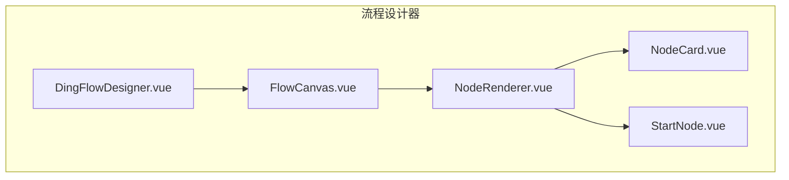
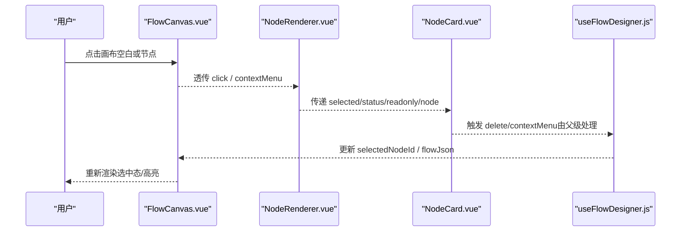
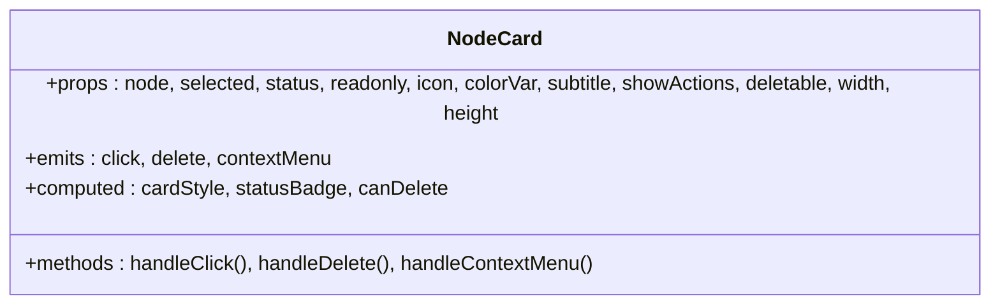
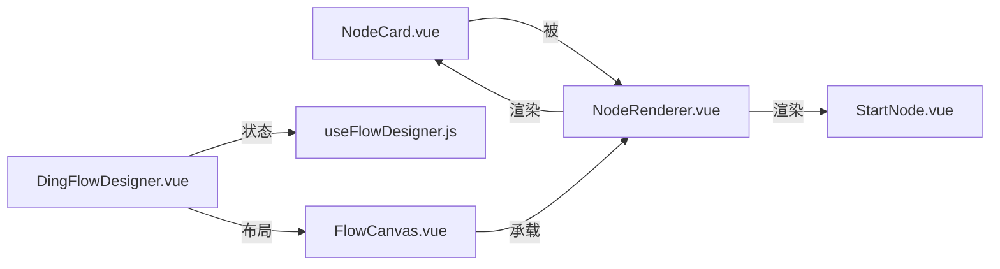

# 节点卡片组件

<cite>
**本文引用的文件**
- [NodeCard.vue](file://forge-admin-ui/src/components/flow-designer/nodes/NodeCard.vue)
- [StartNode.vue](file://forge-admin-ui/src/components/flow-designer/nodes/StartNode.vue)
- [NodeRenderer.vue](file://forge-admin-ui/src/components/flow-designer/canvas/NodeRenderer.vue)
- [FlowCanvas.vue](file://forge-admin-ui/src/components/flow-designer/canvas/FlowCanvas.vue)
- [DingFlowDesigner.vue](file://forge-admin-ui/src/components/flow-designer/DingFlowDesigner.vue)
- [useFlowDesigner.js](file://forge-admin-ui/src/components/flow-designer/composables/useFlowDesigner.js)
- [node-cards.spec.js](file://forge-admin-ui/src/components/flow-designer/nodes/__tests__/node-cards.spec.js)
</cite>

## 目录
1. [简介](#简介)
2. [项目结构](#项目结构)
3. [核心组件](#核心组件)
4. [架构总览](#架构总览)
5. [详细组件分析](#详细组件分析)
6. [依赖关系分析](#依赖关系分析)
7. [性能考虑](#性能考虑)
8. [故障排查指南](#故障排查指南)
9. [结论](#结论)
10. [附录：扩展与自定义样式](#附录：扩展与自定义样式)

## 简介
本技术文档围绕流程设计器中的“节点卡片”基类组件 NodeCard.vue，系统阐述其架构设计、渲染逻辑、交互行为（点击选中、右键菜单、删除）、样式定制、响应式布局与可访问性支持，并结合画布容器 FlowCanvas、调度器 NodeRenderer 以及设计器状态 useFlowDesigner，说明其在整体流程设计器中的生命周期管理与事件流转。同时提供扩展指南与自定义样式实现方法，帮助开发者快速集成与二次开发。

## 项目结构
NodeCard 位于流程设计器的节点目录中，作为所有具体节点卡片的统一基类；通过 NodeRenderer 按 nodeType 分发到具体节点组件；FlowCanvas 提供缩放、平移等画布能力；DingFlowDesigner 编排整体编辑态与状态管理。

图表来源
- [DingFlowDesigner.vue:1-200](file://forge-admin-ui/src/components/flow-designer/DingFlowDesigner.vue#L1-L200)
- [FlowCanvas.vue:1-200](file://forge-admin-ui/src/components/flow-designer/canvas/FlowCanvas.vue#L1-L200)
- [NodeRenderer.vue:1-86](file://forge-admin-ui/src/components/flow-designer/canvas/NodeRenderer.vue#L1-L86)
- [NodeCard.vue:1-267](file://forge-admin-ui/src/components/flow-designer/nodes/NodeCard.vue#L1-L267)
- [StartNode.vue:1-35](file://forge-admin-ui/src/components/flow-designer/nodes/StartNode.vue#L1-L35)

章节来源
- [DingFlowDesigner.vue:1-200](file://forge-admin-ui/src/components/flow-designer/DingFlowDesigner.vue#L1-L200)
- [FlowCanvas.vue:1-200](file://forge-admin-ui/src/components/flow-designer/canvas/FlowCanvas.vue#L1-L200)
- [NodeRenderer.vue:1-86](file://forge-admin-ui/src/components/flow-designer/canvas/NodeRenderer.vue#L1-L86)
- [NodeCard.vue:1-267](file://forge-admin-ui/src/components/flow-designer/nodes/NodeCard.vue#L1-L267)
- [StartNode.vue:1-35](file://forge-admin-ui/src/components/flow-designer/nodes/StartNode.vue#L1-L35)

## 核心组件
- NodeCard.vue：节点卡片基类，负责统一布局、选中态、只读态、删除按钮、状态徽章、配色变量、尺寸控制、事件透传与可访问性属性。
- StartNode.vue：基于 NodeCard 的发起人节点，固定不可删除，展示固定摘要。
- NodeRenderer.vue：根据 nodeType 动态选择并渲染具体节点组件，透传选中、状态、只读与事件。
- FlowCanvas.vue：画布容器，提供缩放、平移、滚轮、空格拖拽、双击重置等能力，承载 nodes 插槽。
- DingFlowDesigner.vue：设计器主入口，组合 useFlowDesigner 状态、布局计算、上下文菜单、抽屉面板等。
- useFlowDesigner.js：设计器核心状态与 CRUD 操作，维护 selectedNodeId 与 flowJson。

章节来源
- [NodeCard.vue:1-267](file://forge-admin-ui/src/components/flow-designer/nodes/NodeCard.vue#L1-L267)
- [StartNode.vue:1-35](file://forge-admin-ui/src/components/flow-designer/nodes/StartNode.vue#L1-L35)
- [NodeRenderer.vue:1-86](file://forge-admin-ui/src/components/flow-designer/canvas/NodeRenderer.vue#L1-L86)
- [FlowCanvas.vue:1-200](file://forge-admin-ui/src/components/flow-designer/canvas/FlowCanvas.vue#L1-L200)
- [DingFlowDesigner.vue:1-200](file://forge-admin-ui/src/components/flow-designer/DingFlowDesigner.vue#L1-L200)
- [useFlowDesigner.js:1-200](file://forge-admin-ui/src/components/flow-designer/composables/useFlowDesigner.js#L1-L200)

## 架构总览
NodeCard 作为基础 UI 单元，被 NodeRenderer 按需实例化，并由 FlowCanvas 在 transform 容器中定位渲染。DingFlowDesigner 通过 useFlowDesigner 管理选中节点与流程数据，将 selected 与 status 等状态下推到各节点卡片。

图表来源
- [FlowCanvas.vue:1-200](file://forge-admin-ui/src/components/flow-designer/canvas/FlowCanvas.vue#L1-L200)
- [NodeRenderer.vue:1-86](file://forge-admin-ui/src/components/flow-designer/canvas/NodeRenderer.vue#L1-L86)
- [NodeCard.vue:1-267](file://forge-admin-ui/src/components/flow-designer/nodes/NodeCard.vue#L1-L267)
- [useFlowDesigner.js:1-200](file://forge-admin-ui/src/components/flow-designer/composables/useFlowDesigner.js#L1-L200)

## 详细组件分析

### NodeCard.vue 组件分析
- 职责与布局
  - 标题行：图标 + 节点名称 + 可选 title-extra 插槽 + 状态徽章。
  - 内容区：subtitle 摘要、默认插槽内容、右侧箭头指示。
  - 删除按钮：受 deletable、showActions、readonly 共同控制。
- Props 与状态
  - node、selected、status、readonly、icon、colorVar、subtitle、showActions、deletable、width、height。
  - computed 生成 CSS 变量 --flow-node-color/--flow-node-soft/--flow-node-content-color，用于主题色与软色背景。
  - statusBadge 映射内置状态标签（已完成、审批中、待办、已驳回、已跳过）。
- 事件
  - click：透传 node。
  - delete：透传 node（需父级确认与执行删除）。
  - contextMenu：透传 { event, node }，供上层显示上下文菜单。
- 可访问性
  - 删除按钮使用 aria-label="删除节点"。
  - data-node-id、data-node-type 便于调试与测试定位。
- 样式与响应式
  - 选中态 is-selected：边框高亮与阴影增强。
  - 只读态 is-readonly：禁用交互、调整图标与排版。
  - hover 态：非只读时提升阴影与边框。
  - prefers-reduced-motion：尊重系统减少动效偏好。
- 复杂度
  - 计算属性 O(1)，模板条件渲染 O(n) 取决于插槽内容。
  - 无复杂算法，性能开销低。

图表来源
- [NodeCard.vue:1-267](file://forge-admin-ui/src/components/flow-designer/nodes/NodeCard.vue#L1-L267)

章节来源
- [NodeCard.vue:1-267](file://forge-admin-ui/src/components/flow-designer/nodes/NodeCard.vue#L1-L267)
- [node-cards.spec.js:1-186](file://forge-admin-ui/src/components/flow-designer/nodes/__tests__/node-cards.spec.js#L1-L186)

### StartNode.vue 组件分析
- 继承 NodeCard，设置 fixed 不可删除、成功色主题、固定摘要文案。
- 透传 click、contextMenu 事件给父级。

章节来源
- [StartNode.vue:1-35](file://forge-admin-ui/src/components/flow-designer/nodes/StartNode.vue#L1-L35)

### NodeRenderer.vue 组件分析
- 根据 node.nodeType 选择对应组件（start/end/approver/carbonCopy/condition/parallel/inclusive/service/script/subProcess/callActivity/advanced），未知类型回退到 AdvancedNode。
- 为分支节点传入 outgoingCount，用于显示分支数量。
- 透传 selected、status、readonly 与 click/delete/contextMenu 事件。

章节来源
- [NodeRenderer.vue:1-86](file://forge-admin-ui/src/components/flow-designer/canvas/NodeRenderer.vue#L1-L86)

### FlowCanvas.vue 组件分析
- 提供缩放（Ctrl/Cmd+滚轮）、平移（空格+拖拽/中键拖拽/左键空白拖拽）、双击空白重置视图。
- 暴露 screenToCanvas/canvasToScreen 等方法，供拖拽插入节点时进行坐标转换。
- 通过 slots edges/nodes 承载连线层与节点层。

章节来源
- [FlowCanvas.vue:1-200](file://forge-admin-ui/src/components/flow-designer/canvas/FlowCanvas.vue#L1-L200)

### DingFlowDesigner.vue 与 useFlowDesigner.js
- DingFlowDesigner 组合 useFlowDesigner 管理 flowJson 与 selectedNodeId，结合 layoutFlow 计算布局，并通过 NodeRenderer 渲染节点。
- useFlowDesigner 提供 addNode/addBranch/deleteNode/updateNode/moveNodeUp/Down/copyNode/reconnect 等操作，保证 start/end 不可删除、网关分支一致性等约束。

章节来源
- [DingFlowDesigner.vue:1-200](file://forge-admin-ui/src/components/flow-designer/DingFlowDesigner.vue#L1-L200)
- [useFlowDesigner.js:1-200](file://forge-admin-ui/src/components/flow-designer/composables/useFlowDesigner.js#L1-L200)

## 依赖关系分析
- NodeCard 依赖 Vue 的 computed 与 props/emits 机制。
- NodeRenderer 依赖各具体节点组件注册表，按 nodeType 动态渲染。
- FlowCanvas 依赖 useCanvasViewport 提供缩放/平移能力。
- DingFlowDesigner 依赖 useFlowDesigner 与 converter、panel 等模块。

图表来源
- [NodeCard.vue:1-267](file://forge-admin-ui/src/components/flow-designer/nodes/NodeCard.vue#L1-L267)
- [NodeRenderer.vue:1-86](file://forge-admin-ui/src/components/flow-designer/canvas/NodeRenderer.vue#L1-L86)
- [FlowCanvas.vue:1-200](file://forge-admin-ui/src/components/flow-designer/canvas/FlowCanvas.vue#L1-L200)
- [DingFlowDesigner.vue:1-200](file://forge-admin-ui/src/components/flow-designer/DingFlowDesigner.vue#L1-L200)
- [useFlowDesigner.js:1-200](file://forge-admin-ui/src/components/flow-designer/composables/useFlowDesigner.js#L1-L200)

章节来源
- [NodeCard.vue:1-267](file://forge-admin-ui/src/components/flow-designer/nodes/NodeCard.vue#L1-L267)
- [NodeRenderer.vue:1-86](file://forge-admin-ui/src/components/flow-designer/canvas/NodeRenderer.vue#L1-L86)
- [FlowCanvas.vue:1-200](file://forge-admin-ui/src/components/flow-designer/canvas/FlowCanvas.vue#L1-L200)
- [DingFlowDesigner.vue:1-200](file://forge-admin-ui/src/components/flow-designer/DingFlowDesigner.vue#L1-L200)
- [useFlowDesigner.js:1-200](file://forge-admin-ui/src/components/flow-designer/composables/useFlowDesigner.js#L1-L200)

## 性能考虑
- 计算属性优化：cardStyle、statusBadge、canDelete 均为轻量 computed，避免重复计算。
- 条件渲染：readonly 模式下隐藏 subtitle 与 title-extra，减少 DOM 节点。
- 动画降级：prefers-reduced-motion 媒体查询关闭过渡与变换，降低低端设备负担。
- 事件冒泡控制：删除按钮使用 stopPropagation，避免误触父级点击。
- 建议
  - 大量节点场景下，确保 NodeRenderer 仅渲染可视区域节点（虚拟滚动）。
  - 对复杂插槽内容使用 v-memo 或子组件懒加载，减少重渲染。
  - 避免在节点内发起昂贵同步计算，必要时使用 Web Worker。

## 故障排查指南
- 问题：选中态未生效
  - 检查父级是否正确传递 selected 与 selectedNodeId 绑定。
  - 参考测试用例验证 is-selected 类名是否添加。
- 问题：删除按钮不显示
  - 检查 deletable、showActions、readonly 三者组合逻辑。
  - 确认节点类型是否为 start/end（通常禁止删除）。
- 问题：右键菜单无效
  - 确认 @context-menu 已在父级监听，且 preventDefault 未被拦截。
- 问题：只读模式异常
  - 检查 is-readonly 样式覆盖与交互禁用逻辑。
- 参考测试
  - 选中态、只读模式、删除按钮可见性、状态徽章、右键事件等断言。

章节来源
- [node-cards.spec.js:1-186](file://forge-admin-ui/src/components/flow-designer/nodes/__tests__/node-cards.spec.js#L1-L186)

## 结论
NodeCard 作为流程设计器节点的基础 UI 组件，提供了统一的视觉风格、交互语义与可扩展插槽，配合 NodeRenderer 的动态分发与 FlowCanvas 的画布能力，实现了稳定高效的节点渲染与交互。通过 useFlowDesigner 的状态管理，选中、删除、右键菜单等行为得以集中治理。遵循本文档的扩展与样式定制指南，可快速适配不同业务场景与品牌风格。

## 附录：扩展与自定义样式
- 扩展新节点类型
  - 新建节点组件并复用 NodeCard，设置 icon、colorVar、subtitle、deletable 等。
  - 在 NodeRenderer 的渲染映射中添加新 nodeType 到组件的映射。
- 自定义主题
  - 通过 colorVar 切换主题色（primary/success/warning/info/error/gray/teal）。
  - 使用 CSS 变量 --flow-node-color/--flow-node-soft/--flow-node-content-color 覆盖颜色。
- 自定义插槽
  - 使用 title-extra 插槽在标题行追加徽章或操作按钮。
  - 使用默认插槽在内容区插入额外信息。
- 可访问性
  - 为新增按钮补充 aria-* 属性，确保屏幕阅读器友好。
  - 保持键盘可达性与焦点顺序合理。
- 响应式与动效
  - 利用现有 flex 布局与 min-width/max-width 控制自适应。
  - 如需自定义过渡，注意与 prefers-reduced-motion 兼容。

章节来源
- [NodeCard.vue:1-267](file://forge-admin-ui/src/components/flow-designer/nodes/NodeCard.vue#L1-L267)
- [NodeRenderer.vue:1-86](file://forge-admin-ui/src/components/flow-designer/canvas/NodeRenderer.vue#L1-L86)
- [StartNode.vue:1-35](file://forge-admin-ui/src/components/flow-designer/nodes/StartNode.vue#L1-L35)