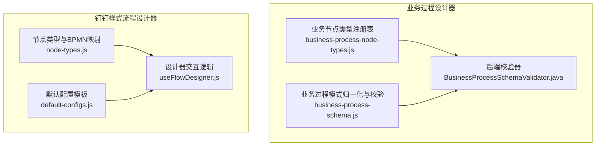
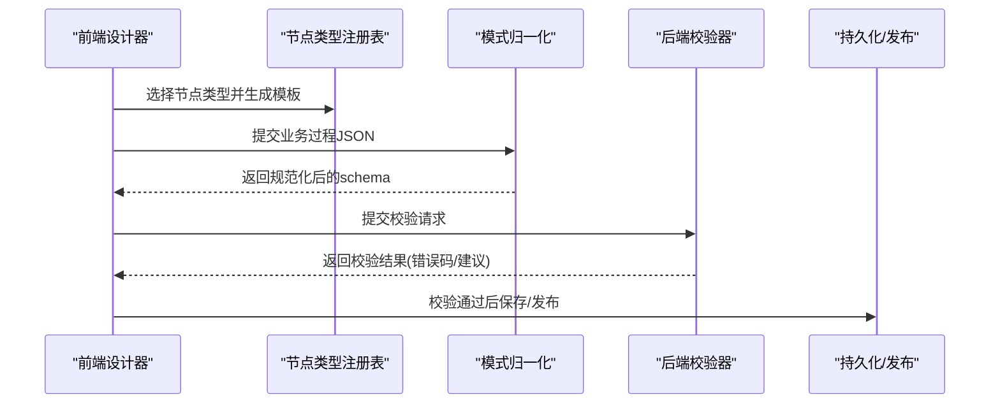
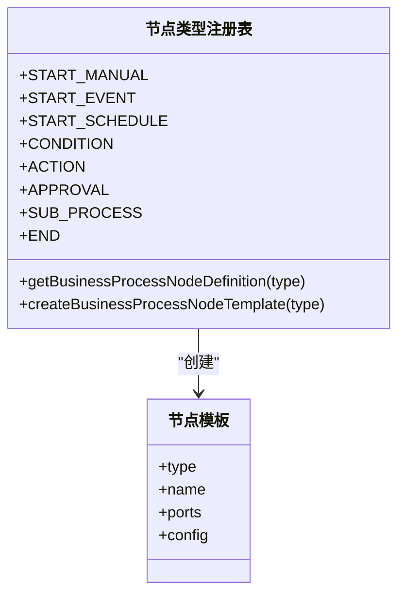
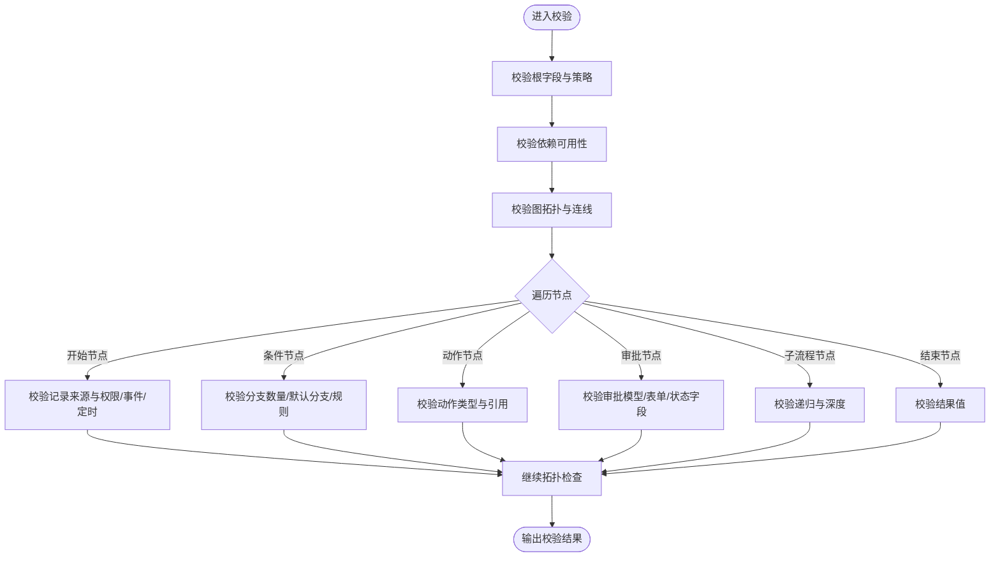
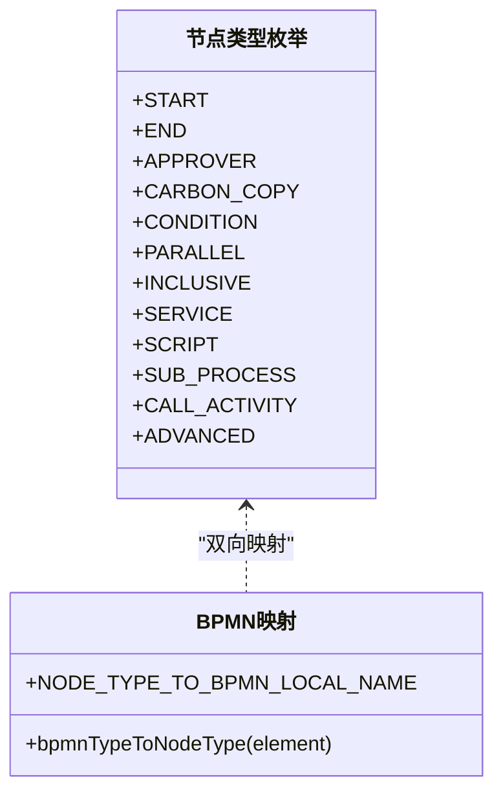
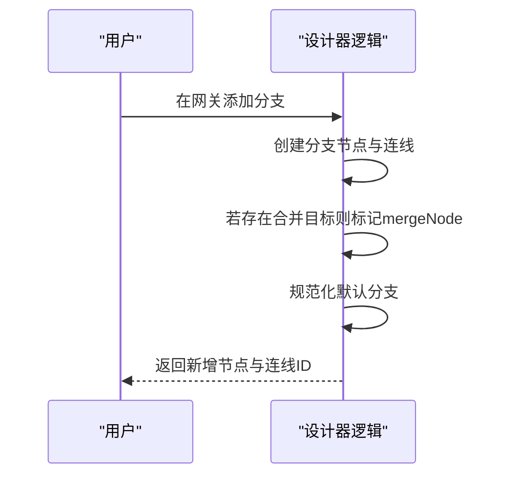
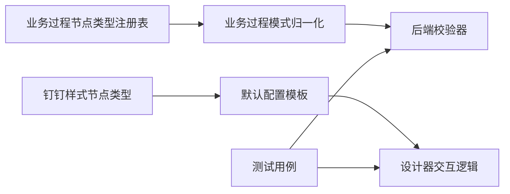

# 节点类型定义

<cite>
**本文引用的文件**
- [BusinessProcessSchemaValidator.java](file://forge-server/forge-framework/forge-plugin-parent/forge-plugin-generator/src/main/java/com/mdframe/forge/plugin/generator/businessprocess/validation/BusinessProcessSchemaValidator.java)
- [business-process-node-types.js](file://forge-admin-ui/src/components/business-process-designer/business-process-node-types.js)
- [business-process-schema.js](file://forge-admin-ui/src/components/business-process-designer/business-process-schema.js)
- [node-types.js](file://forge-admin-ui/src/components/flow-designer/constants/node-types.js)
- [default-configs.js](file://forge-admin-ui/src/components/flow-designer/constants/default-configs.js)
- [useFlowDesigner.js](file://forge-admin-ui/src/components/flow-designer/composables/useFlowDesigner.js)
- [DingFlowDesigner.spec.js](file://forge-admin-ui/src/components/flow-designer/__tests__/DingFlowDesigner.spec.js)
- [layout-algorithm.spec.js](file://forge-admin-ui/src/components/flow-designer/converter/__tests__/layout-algorithm.spec.js)
- [BusinessProcessServiceTest.java](file://forge-server/forge-framework/forge-plugin-parent/forge-plugin-generator/src/test/java/com/mdframe/forge/plugin/generator/service/businessprocess/BusinessProcessServiceTest.java)
- [BusinessProcessSchemaValidatorTest.java](file://forge-server/forge-framework/forge-plugin-parent/forge-plugin-generator/src/test/java/com/mdframe/forge/plugin/generator/businessprocess/validation/BusinessProcessSchemaValidatorTest.java)
</cite>

## 目录
1. [简介](#简介)
2. [项目结构](#项目结构)
3. [核心组件](#核心组件)
4. [架构总览](#架构总览)
5. [详细组件分析](#详细组件分析)
6. [依赖关系分析](#依赖关系分析)
7. [性能考虑](#性能考虑)
8. [故障排查指南](#故障排查指南)
9. [结论](#结论)
10. [附录](#附录)

## 简介
本技术文档聚焦工作流设计器的“节点类型定义”，系统性梳理内置节点类型的分类、属性与配置规范，解释开始、结束、审批、分支、脚本、服务调用等核心节点的实现原理与配置方式；同时说明节点类型注册机制、元数据定义与验证规则，并提供自定义节点类型的开发指南与最佳实践。

## 项目结构
本项目在工作流领域包含两套设计器：
- 业务过程设计器（business-process-designer）：面向受治理的业务流程，使用 businessProcessJson 协议，节点类型由前端注册表集中管理，后端提供严格的校验与发布前检查。
- 钉钉样式流程设计器（flow-designer）：面向 BPMN 风格流程，节点类型映射到 BPMN 元素，支持更丰富的网关与服务任务。

**图表来源**
- [business-process-node-types.js:1-161](file://forge-admin-ui/src/components/business-process-designer/business-process-node-types.js#L1-L161)
- [business-process-schema.js:1-151](file://forge-admin-ui/src/components/business-process-designer/business-process-schema.js#L1-L151)
- [BusinessProcessSchemaValidator.java:1-800](file://forge-server/forge-framework/forge-plugin-parent/forge-plugin-generator/src/main/java/com/mdframe/forge/plugin/generator/businessprocess/validation/BusinessProcessSchemaValidator.java#L1-L800)
- [node-types.js:1-160](file://forge-admin-ui/src/components/flow-designer/constants/node-types.js#L1-L160)
- [default-configs.js:60-118](file://forge-admin-ui/src/components/flow-designer/constants/default-configs.js#L60-L118)
- [useFlowDesigner.js:156-196](file://forge-admin-ui/src/components/flow-designer/composables/useFlowDesigner.js#L156-L196)

**章节来源**
- [business-process-node-types.js:1-161](file://forge-admin-ui/src/components/business-process-designer/business-process-node-types.js#L1-L161)
- [business-process-schema.js:1-151](file://forge-admin-ui/src/components/business-process-designer/business-process-schema.js#L1-L151)
- [BusinessProcessSchemaValidator.java:1-800](file://forge-server/forge-framework/forge-plugin-parent/forge-plugin-generator/src/main/java/com/mdframe/forge/plugin/generator/businessprocess/validation/BusinessProcessSchemaValidator.java#L1-L800)
- [node-types.js:1-160](file://forge-admin-ui/src/components/flow-designer/constants/node-types.js#L1-L160)
- [default-configs.js:60-118](file://forge-admin-ui/src/components/flow-designer/constants/default-configs.js#L60-L118)
- [useFlowDesigner.js:156-196](file://forge-admin-ui/src/components/flow-designer/composables/useFlowDesigner.js#L156-L196)

## 核心组件
- 业务过程节点类型注册表：集中声明支持的节点类型、端口、类别、提示文案与默认配置，用于创建节点模板与运行时识别。
- 业务过程模式归一化与校验：前端对 schema 进行键白名单、排序与规范化；后端执行严格校验，包括根字段、策略、依赖、拓扑与节点配置。
- 钉钉样式流程节点类型与BPMN映射：将内部 nodeType 与 BPMN 元素互转，并维护默认配置模板。
- 设计器交互逻辑：在画布上添加分支、合并节点、设置默认分支等，保证图结构与约束一致。

**章节来源**
- [business-process-node-types.js:1-161](file://forge-admin-ui/src/components/business-process-designer/business-process-node-types.js#L1-L161)
- [business-process-schema.js:1-151](file://forge-admin-ui/src/components/business-process-designer/business-process-schema.js#L1-L151)
- [BusinessProcessSchemaValidator.java:1-800](file://forge-server/forge-framework/forge-plugin-parent/forge-plugin-generator/src/main/java/com/mdframe/forge/plugin/generator/businessprocess/validation/BusinessProcessSchemaValidator.java#L1-L800)
- [node-types.js:1-160](file://forge-admin-ui/src/components/flow-designer/constants/node-types.js#L1-L160)
- [default-configs.js:60-118](file://forge-admin-ui/src/components/flow-designer/constants/default-configs.js#L60-L118)
- [useFlowDesigner.js:156-196](file://forge-admin-ui/src/components/flow-designer/composables/useFlowDesigner.js#L156-L196)

## 架构总览
下图展示从前端设计器到后端校验的端到端流程，以及两类设计器的职责边界。

**图表来源**
- [business-process-node-types.js:107-133](file://forge-admin-ui/src/components/business-process-designer/business-process-node-types.js#L107-L133)
- [business-process-schema.js:11-35,120-140:11-35](file://forge-admin-ui/src/components/business-process-designer/business-process-schema.js#L11-L35)
- [BusinessProcessSchemaValidator.java:87-145](file://forge-server/forge-framework/forge-plugin-parent/forge-plugin-generator/src/main/java/com/mdframe/forge/plugin/generator/businessprocess/validation/BusinessProcessSchemaValidator.java#L87-L145)

## 详细组件分析

### 业务过程节点类型注册表
- 支持的节点类型：手动开始、事件触发、定时触发、条件分支、执行动作、审批流程、调用子流程、结束。
- 每个节点类型包含：
  - 标签与类别：便于面板分组与显示。
  - 端口集合：如 NEXT、APPROVED、REJECTED、CANCELED、FAILED、MATCHED、OTHERWISE。
  - 默认配置：如权限、事件类型、分支结构、版本策略等。
- 提供工厂方法：根据类型创建节点模板，自动填充名称、端口与配置。

**图表来源**
- [business-process-node-types.js:1-161](file://forge-admin-ui/src/components/business-process-designer/business-process-node-types.js#L1-L161)

**章节来源**
- [business-process-node-types.js:1-161](file://forge-admin-ui/src/components/business-process-designer/business-process-node-types.js#L1-L161)

### 业务过程模式归一化与校验
- 前端归一化：限制根键集合、标准化 ID、排序节点与边、同步依赖集合。
- 后端校验：
  - 根字段：schemaVersion、processCode、subject、policies、dependencies、metadata。
  - 策略：审批并发、子流程深度、重试策略。
  - 依赖：对象、表单资产、业务动作、消息模板、能力、子流程等可用性检查。
  - 拓扑：唯一开始节点、至少一个结束节点、连线合法性、可达性与终点路径。
  - 节点配置：按类型分派校验，如事件类型、条件分支数量与默认分支、动作类型与引用、审批模型与表单绑定、子流程递归与深度等。

**图表来源**
- [BusinessProcessSchemaValidator.java:213-800](file://forge-server/forge-framework/forge-plugin-parent/forge-plugin-generator/src/main/java/com/mdframe/forge/plugin/generator/businessprocess/validation/BusinessProcessSchemaValidator.java#L213-L800)

**章节来源**
- [business-process-schema.js:11-35,120-140:11-35](file://forge-admin-ui/src/components/business-process-designer/business-process-schema.js#L11-L35)
- [BusinessProcessSchemaValidator.java:213-800](file://forge-server/forge-framework/forge-plugin-parent/forge-plugin-generator/src/main/java/com/mdframe/forge/plugin/generator/businessprocess/validation/BusinessProcessSchemaValidator.java#L213-L800)

### 钉钉样式流程节点类型与BPMN映射
- 节点类型：start、end、approver、carbonCopy、condition、parallel、inclusive、service、script、subProcess、callActivity、advanced。
- 映射规则：
  - start → bpmn:StartEvent
  - end → bpmn:EndEvent
  - approver → bpmn:UserTask
  - service/carbonCopy → bpmn:ServiceTask（抄送通过 flowable:type='cc' 区分）
  - script → bpmn:ScriptTask
  - condition → bpmn:ExclusiveGateway
  - parallel/inclusive → 对应网关
  - subProcess → bpmn:SubProcess
  - callActivity → bpmn:CallActivity
  - 其他 → advanced
- 默认配置模板：为 approver、carbonCopy、condition、parallel、inclusive、service、script、subProcess、callActivity、advanced 提供默认配置项。

**图表来源**
- [node-types.js:19-160](file://forge-admin-ui/src/components/flow-designer/constants/node-types.js#L19-L160)
- [default-configs.js:60-118](file://forge-admin-ui/src/components/flow-designer/constants/default-configs.js#L60-L118)

**章节来源**
- [node-types.js:1-160](file://forge-admin-ui/src/components/flow-designer/constants/node-types.js#L1-L160)
- [default-configs.js:60-118](file://forge-admin-ui/src/components/flow-designer/constants/default-configs.js#L60-L118)

### 设计器交互与分支构建
- 在网关节点添加分支时，自动创建分支节点与连线，必要时标记合并节点，并规范化默认分支。
- 该逻辑确保图结构满足“条件节点必须有一个默认分支”、“同一出口仅连接一个后继”等约束。

**图表来源**
- [useFlowDesigner.js:156-196](file://forge-admin-ui/src/components/flow-designer/composables/useFlowDesigner.js#L156-L196)

**章节来源**
- [useFlowDesigner.js:156-196](file://forge-admin-ui/src/components/flow-designer/composables/useFlowDesigner.js#L156-L196)

### 核心节点类型详解

#### 开始节点
- 类型：手动开始、事件触发、定时触发。
- 关键配置：
  - 手动开始：权限标识。
  - 事件触发：事件类型（记录创建/更新/删除、状态变更、字段变更、表单提交、动作执行）。
  - 定时触发：到期字段、服务发起人策略（配置用户或记录字段解析），禁止直接覆盖用户ID。
- 与主对象的记录来源策略联动：手动→运行时记录，事件→事件记录，定时→定时扫描记录。

**章节来源**
- [BusinessProcessSchemaValidator.java:471-519](file://forge-server/forge-framework/forge-plugin-parent/forge-plugin-generator/src/main/java/com/mdframe/forge/plugin/generator/businessprocess/validation/BusinessProcessSchemaValidator.java#L471-L519)
- [business-process-node-types.js:31-60](file://forge-admin-ui/src/components/business-process-designer/business-process-node-types.js#L31-L60)

#### 结束节点
- 类型：结束。
- 关键配置：结果值（成功、驳回、取消、失败）。
- 约束：不得声明出口。

**章节来源**
- [BusinessProcessSchemaValidator.java:737-744](file://forge-server/forge-framework/forge-plugin-parent/forge-plugin-generator/src/main/java/com/mdframe/forge/plugin/generator/businessprocess/validation/BusinessProcessSchemaValidator.java#L737-L744)
- [business-process-node-types.js:98-104](file://forge-admin-ui/src/components/business-process-designer/business-process-node-types.js#L98-L104)

#### 审批节点
- 类型：审批流程。
- 关键配置：
  - 审批模型键与版本策略（应用发布时固定版本）。
  - 表单资产（可选），低代码审批需绑定独立流程状态字段。
  - 端口固定为四个：通过、驳回、取消、失败。
- 依赖校验：审批模型必须已发布且可用。

**章节来源**
- [BusinessProcessSchemaValidator.java:660-699](file://forge-server/forge-framework/forge-plugin-parent/forge-plugin-generator/src/main/java/com/mdframe/forge/plugin/generator/businessprocess/validation/BusinessProcessSchemaValidator.java#L660-L699)
- [business-process-node-types.js:84-90](file://forge-admin-ui/src/components/business-process-designer/business-process-node-types.js#L84-L90)
- [BusinessProcessServiceTest.java:402-419](file://forge-server/forge-framework/forge-plugin-parent/forge-plugin-generator/src/test/java/com/mdframe/forge/plugin/generator/service/businessprocess/BusinessProcessServiceTest.java#L402-L419)

#### 分支节点（条件）
- 类型：条件分支。
- 关键配置：
  - 分支列表：至少两个分支，最多20个；每个分支有唯一端口与可选标签。
  - 默认分支：必须且只能有一个，且不能配置判断规则。
  - 结构化条件：operator（AND/OR）、rules（字段、操作符、比较值、区间结束值）。
- 端口：匹配、其他情况。

**章节来源**
- [BusinessProcessSchemaValidator.java:521-604](file://forge-server/forge-framework/forge-plugin-parent/forge-plugin-generator/src/main/java/com/mdframe/forge/plugin/generator/businessprocess/validation/BusinessProcessSchemaValidator.java#L521-L604)
- [business-process-node-types.js:61-76](file://forge-admin-ui/src/components/business-process-designer/business-process-node-types.js#L61-L76)

#### 脚本节点
- 类型：脚本。
- 关键配置：脚本格式、脚本内容、是否异步。
- 适用场景：轻量计算、数据转换、表达式求值。

**章节来源**
- [default-configs.js:101-106](file://forge-admin-ui/src/components/flow-designer/constants/default-configs.js#L101-L106)

#### 服务调用节点
- 类型：服务。
- 关键配置：实现类型、实现类或表达式、是否异步。
- 适用场景：调用外部服务、集成第三方能力、执行后台任务。

**章节来源**
- [default-configs.js:95-100](file://forge-admin-ui/src/components/flow-designer/constants/default-configs.js#L95-L100)

#### 执行动作节点（业务过程）
- 类型：执行动作。
- 关键配置：动作类型（更新记录、创建记录、业务动作、领域动作、发送消息、调用能力）。
- 依赖校验：对象、业务动作、消息模板、能力必须在依赖中声明且可用。

**章节来源**
- [BusinessProcessSchemaValidator.java:606-658](file://forge-server/forge-framework/forge-plugin-parent/forge-plugin-generator/src/main/java/com/mdframe/forge/plugin/generator/businessprocess/validation/BusinessProcessSchemaValidator.java#L606-L658)
- [business-process-node-types.js:77-83](file://forge-admin-ui/src/components/business-process-designer/business-process-node-types.js#L77-L83)

#### 调用子流程节点
- 类型：调用子流程。
- 关键配置：子流程编码。
- 约束：禁止直接或间接递归；依赖链深度不超过策略允许的最大深度。

**章节来源**
- [BusinessProcessSchemaValidator.java:707-735](file://forge-server/forge-framework/forge-plugin-parent/forge-plugin-generator/src/main/java/com/mdframe/forge/plugin/generator/businessprocess/validation/BusinessProcessSchemaValidator.java#L707-L735)
- [business-process-node-types.js:91-97](file://forge-admin-ui/src/components/business-process-designer/business-process-node-types.js#L91-L97)

## 依赖关系分析
- 前端注册表与后端校验器共同约束节点类型与配置，形成“前端可编辑、后端强校验”的双层保障。
- 钉钉样式设计器通过 node-types.js 与 default-configs.js 协同，确保节点卡片与BPMN元素的一致性。
- 测试用例覆盖拓扑校验、节点注册表独立性、BPMN转换与布局算法等关键路径。

**图表来源**
- [business-process-node-types.js:107-133](file://forge-admin-ui/src/components/business-process-designer/business-process-node-types.js#L107-L133)
- [business-process-schema.js:120-140](file://forge-admin-ui/src/components/business-process-designer/business-process-schema.js#L120-L140)
- [BusinessProcessSchemaValidator.java:124-145](file://forge-server/forge-framework/forge-plugin-parent/forge-plugin-generator/src/main/java/com/mdframe/forge/plugin/generator/businessprocess/validation/BusinessProcessSchemaValidator.java#L124-L145)
- [node-types.js:19-160](file://forge-admin-ui/src/components/flow-designer/constants/node-types.js#L19-L160)
- [default-configs.js:60-118](file://forge-admin-ui/src/components/flow-designer/constants/default-configs.js#L60-L118)

**章节来源**
- [BusinessProcessSchemaValidatorTest.java:169-192](file://forge-server/forge-framework/forge-plugin-parent/forge-plugin-generator/src/test/java/com/mdframe/forge/plugin/generator/businessprocess/validation/BusinessProcessSchemaValidatorTest.java#L169-L192)
- [DingFlowDesigner.spec.js:89-113](file://forge-admin-ui/src/components/flow-designer/__tests__/DingFlowDesigner.spec.js#L89-L113)
- [layout-algorithm.spec.js:46-73](file://forge-admin-ui/src/components/flow-designer/converter/__tests__/layout-algorithm.spec.js#L46-L73)

## 性能考虑
- 节点与边数量上限：单流程节点不超过100，边不超过400，避免复杂图导致渲染与校验开销过大。
- 条件分支上限：最多20个分支，控制复杂度与可读性。
- 子流程深度限制：最大深度不超过5，防止深层嵌套影响执行与调试效率。
- 重试策略：有限次数重试，退避时间需为正数，避免雪崩与无限重试。

[本节为通用指导，不直接分析具体文件]

## 故障排查指南
- 常见错误码与建议：
  - START_NODE_COUNT：确保仅有一个开始节点。
  - EDGE_SOURCE_MISSING / EDGE_TARGET_MISSING：修复悬空连线或缺失节点。
  - GRAPH_CYCLE：消除环路，确保有向无环图。
  - NODE_UNREACHABLE / END_PATH_MISSING：确保所有节点可达且每条路径都有结束节点。
  - CONDITION_DEFAULT_INVALID：条件节点必须且只能有一个默认分支。
  - APPROVAL_PORTS_INVALID：审批节点必须声明四个固定结果出口。
  - SUB_PROCESS_RECURSION / SUB_PROCESS_DEPTH_EXCEEDED：避免递归与超深嵌套。
- 定位步骤：
  - 查看校验返回的错误码与路径，定位问题节点或边。
  - 对照节点类型注册表的端口与默认配置，修正配置。
  - 重新运行校验直至通过。

**章节来源**
- [BusinessProcessSchemaValidator.java:356-800](file://forge-server/forge-framework/forge-plugin-parent/forge-plugin-generator/src/main/java/com/mdframe/forge/plugin/generator/businessprocess/validation/BusinessProcessSchemaValidator.java#L356-L800)
- [BusinessProcessSchemaValidatorTest.java:169-192](file://forge-server/forge-framework/forge-plugin-parent/forge-plugin-generator/src/test/java/com/mdframe/forge/plugin/generator/businessprocess/validation/BusinessProcessSchemaValidatorTest.java#L169-L192)

## 结论
本仓库通过前后端协同的节点类型注册与校验机制，实现了工作流设计器的强约束与高扩展性。业务过程设计器聚焦受治理的流程，钉钉样式设计器兼容BPMN生态。遵循本文的配置规范与验证规则，可高效构建稳定、可维护的工作流模型，并通过测试用例快速定位问题。

## 附录

### 自定义节点类型开发指南（业务过程设计器）
- 扩展节点类型注册表：
  - 新增类型常量与定义，包含 label、category、ports、tone、createConfig。
  - 确保 createConfig 返回符合后端校验的默认配置。
- 适配后端校验：
  - 在 BusinessProcessSchemaValidator 的类型分派中添加新类型的配置校验逻辑。
  - 如需新的端口或行为，需在 validateDeclaredPorts 与 allowedPorts 中明确约束。
- 前端交互增强：
  - 在默认配置模板与设计器交互逻辑中为新类型提供支持（如分支添加、合并节点标记）。
- 测试覆盖：
  - 编写单元测试覆盖节点创建、配置校验、拓扑约束与转换逻辑。

**章节来源**
- [business-process-node-types.js:1-161](file://forge-admin-ui/src/components/business-process-designer/business-process-node-types.js#L1-L161)
- [BusinessProcessSchemaValidator.java:433-469](file://forge-server/forge-framework/forge-plugin-parent/forge-plugin-generator/src/main/java/com/mdframe/forge/plugin/generator/businessprocess/validation/BusinessProcessSchemaValidator.java#L433-L469)
- [default-configs.js:60-118](file://forge-admin-ui/src/components/flow-designer/constants/default-configs.js#L60-L118)
- [useFlowDesigner.js:156-196](file://forge-admin-ui/src/components/flow-designer/composables/useFlowDesigner.js#L156-L196)

### 最佳实践建议
- 保持节点命名稳定：使用字母开头的稳定 ID，避免运行时修改。
- 显式声明依赖：对象、表单资产、业务动作、消息模板、能力、子流程需在 dependencies 中声明。
- 合理拆分流程：复杂流程拆分为子流程，控制深度与复杂度。
- 谨慎使用脚本与服务：优先使用受治理的动作与能力，确保安全与可审计。
- 利用默认分支：条件节点务必配置默认分支，提升鲁棒性。

[本节为通用指导，不直接分析具体文件]