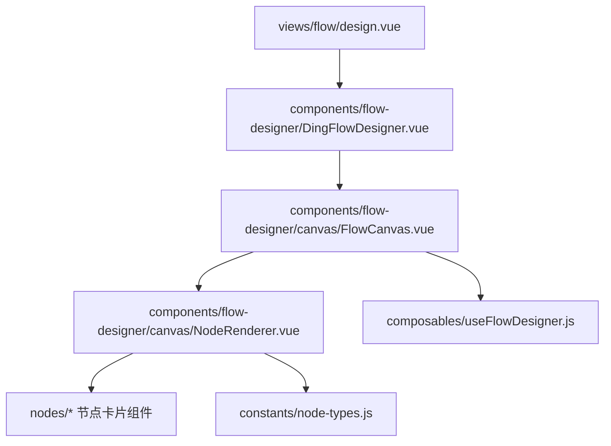
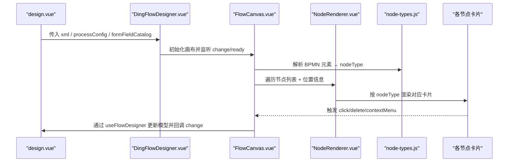
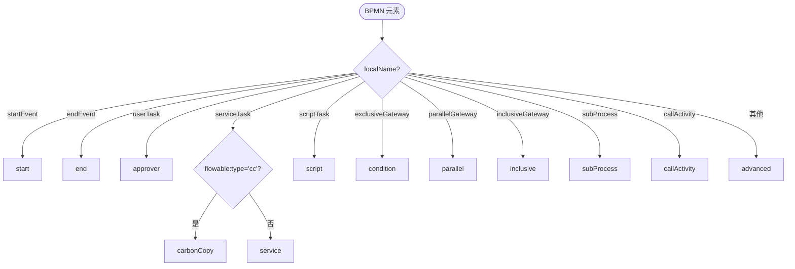
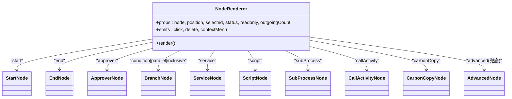
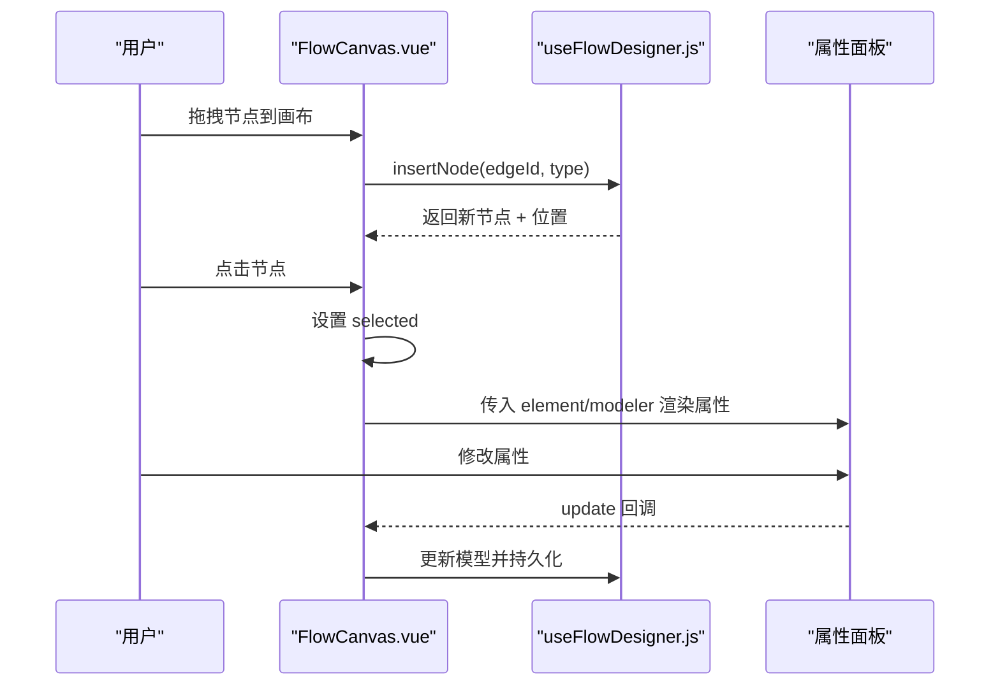
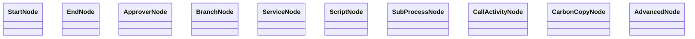
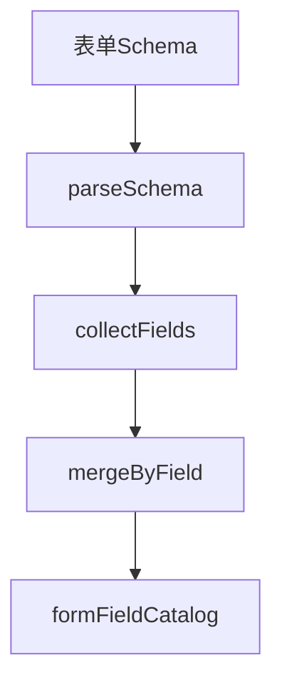
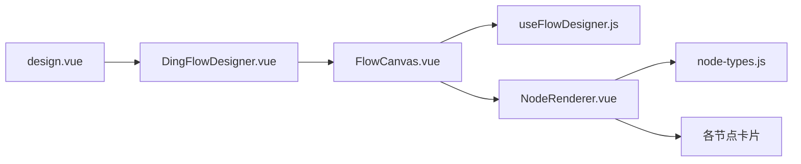

# 节点系统

<cite>
**本文引用的文件**
- [design.vue](file://forge-admin-ui/src/views/flow/design.vue)
- [node-types.js](file://forge-admin-ui/src/components/flow-designer/constants/node-types.js)
- [NodeRenderer.vue](file://forge-admin-ui/src/components/flow-designer/canvas/NodeRenderer.vue)
- [FlowCanvas.vue](file://forge-admin-ui/src/components/flow-designer/canvas/FlowCanvas.vue)
- [useFlowDesigner.js](file://forge-admin-ui/src/components/flow-designer/composables/useFlowDesigner.js)
- [DingFlowDesigner.vue](file://forge-admin-ui/src/components/flow-designer/DingFlowDesigner.vue)
- [ApproverNode.vue](file://forge-admin-ui/src/components/flow-designer/nodes/ApproverNode.vue)
- [BranchNode.vue](file://forge-admin-ui/src/components/flow-designer/nodes/BranchNode.vue)
- [EndNode.vue](file://forge-admin-ui/src/components/flow-designer/nodes/EndNode.vue)
- [StartNode.vue](file://forge-admin-ui/src/components/flow-designer/nodes/StartNode.vue)
- [ServiceNode.vue](file://forge-admin-ui/src/components/flow-designer/nodes/ServiceNode.vue)
- [ScriptNode.vue](file://forge-admin-ui/src/components/flow-designer/nodes/ScriptNode.vue)
- [CarbonCopyNode.vue](file://forge-admin-ui/src/components/flow-designer/nodes/CarbonCopyNode.vue)
- [CallActivityNode.vue](file://forge-admin-ui/src/components/flow-designer/nodes/CallActivityNode.vue)
- [AdvancedNode.vue](file://forge-admin-ui/src/components/flow-designer/nodes/AdvancedNode.vue)
- [SubProcessNode.vue](file://forge-admin-ui/src/components/flow-designer/nodes/SubProcessNode.vue)
- [processDisplay.js](file://forge-admin-ui/src/views/flow/utils/processDisplay.js)
- [form-field-catalog.js](file://forge-admin-ui/src/views/flow/utils/form-field-catalog.js)
</cite>

## 目录
1. [简介](#简介)
2. [项目结构](#项目结构)
3. [核心组件](#核心组件)
4. [架构总览](#架构总览)
5. [详细组件分析](#详细组件分析)
6. [依赖关系分析](#依赖关系分析)
7. [性能考虑](#性能考虑)
8. [故障排查指南](#故障排查指南)
9. [结论](#结论)
10. [附录](#附录)

## 简介
本技术文档围绕工作流设计器“节点系统”展开，聚焦以下目标：
- 节点类型定义与映射机制（BPMN ↔ 钉钉样式 nodeType）
- 节点卡片组件体系与渲染调度
- 节点生命周期管理（创建、选中、编辑、删除、连线）
- 内置节点实现原理与配置方式（开始、结束、审批、分支、服务、脚本、子流程、调用活动、抄送等）
- 拖拽、选中、编辑、删除等交互行为实现机制
- 自定义节点开发指南、属性绑定、事件处理与样式定制
- 扩展点、插件化机制与最佳实践

## 项目结构
工作流设计器前端位于 forge-admin-ui，节点系统主要分布在 flow-designer 子模块中，并由 views/flow/design.vue 作为入口编排。关键组织方式如下：
- 常量层：节点类型枚举与 BPMN 元素映射
- 画布层：FlowCanvas 负责节点布局、连线绘制、拖放插入、选中态管理
- 调度层：NodeRenderer 根据 nodeType 分发到具体节点卡片
- 节点层：各节点卡片组件（Start/End/Approver/Branch/Service/Script/SubProcess/CallActivity/CarbonCopy/Advanced）
- 组合式函数：useFlowDesigner 提供节点增删改查、边计算、撤销重做等能力
- 视图层：design.vue 集成设计器、属性面板、表单资产、通知矩阵、AI 生成等

**图表来源**
- [design.vue:76-104](file://forge-admin-ui/src/views/flow/design.vue#L76-L104)
- [DingFlowDesigner.vue](file://forge-admin-ui/src/components/flow-designer/DingFlowDesigner.vue)
- [FlowCanvas.vue](file://forge-admin-ui/src/components/flow-designer/canvas/FlowCanvas.vue)
- [NodeRenderer.vue:1-39](file://forge-admin-ui/src/components/flow-designer/canvas/NodeRenderer.vue#L1-L39)
- [node-types.js:19-48](file://forge-admin-ui/src/components/flow-designer/constants/node-types.js#L19-L48)

**章节来源**
- [design.vue:76-104](file://forge-admin-ui/src/views/flow/design.vue#L76-L104)

## 核心组件
- 节点类型常量：集中定义 12 种 nodeType 及 BPMN 元素映射规则，保证前后端一致性与可扩展性
- 节点渲染调度：NodeRenderer 通过 nodeType 动态选择对应节点卡片，避免 v-if 分支膨胀
- 画布容器：FlowCanvas 负责节点布局、连线绘制、拖拽插入、选中态、上下文菜单等
- 设计器外壳：DingFlowDesigner 封装 BPMN 模型加载、变更回调、表单资产注入、流程配置透传
- 业务工具：processDisplay 与 form-field-catalog 提供任务展示标题、字段目录构建等通用能力

**章节来源**
- [node-types.js:19-48](file://forge-admin-ui/src/components/flow-designer/constants/node-types.js#L19-L48)
- [NodeRenderer.vue:1-39](file://forge-admin-ui/src/components/flow-designer/canvas/NodeRenderer.vue#L1-L39)
- [design.vue:76-104](file://forge-admin-ui/src/views/flow/design.vue#L76-L104)

## 架构总览
下图展示了从页面入口到节点渲染的完整链路，以及节点类型识别与调度过程。

**图表来源**
- [design.vue:76-104](file://forge-admin-ui/src/views/flow/design.vue#L76-L104)
- [node-types.js:86-121](file://forge-admin-ui/src/components/flow-designer/constants/node-types.js#L86-L121)
- [NodeRenderer.vue:1-39](file://forge-admin-ui/src/components/flow-designer/canvas/NodeRenderer.vue#L1-L39)

## 详细组件分析

### 节点类型定义与映射
- 统一枚举：NODE_TYPE 覆盖 start/end/approver/carbonCopy/condition/parallel/inclusive/service/script/subProcess/callActivity/advanced
- 集合校验：NODE_TYPE_SET 用于快速合法性校验
- 元素识别：bpmnTypeToNodeType 将 BPMN 元素 localName 映射为 nodeType；serviceTask 通过 flowable:type='cc' 区分抄送
- 写出映射：NODE_TYPE_TO_BPMN_LOCAL_NAME 提供 JSON→XML 写回时的本地名映射

**图表来源**
- [node-types.js:86-121](file://forge-admin-ui/src/components/flow-designer/constants/node-types.js#L86-L121)

**章节来源**
- [node-types.js:19-48](file://forge-admin-ui/src/components/flow-designer/constants/node-types.js#L19-L48)
- [node-types.js:86-121](file://forge-admin-ui/src/components/flow-designer/constants/node-types.js#L86-L121)
- [node-types.js:142-160](file://forge-admin-ui/src/components/flow-designer/constants/node-types.js#L142-L160)

### 节点渲染调度器
- NodeRenderer 接收 node 对象、位置、选中态、只读模式、出边数量等 props
- 内部维护 RENDERER_MAP，将 nodeType 映射到具体节点组件
- 未知类型兜底为 AdvancedNode，确保画布稳定渲染
- 所有事件（click/delete/contextMenu）透传给上层 FlowCanvas

**图表来源**
- [NodeRenderer.vue:1-39](file://forge-admin-ui/src/components/flow-designer/canvas/NodeRenderer.vue#L1-L39)

**章节来源**
- [NodeRenderer.vue:1-39](file://forge-admin-ui/src/components/flow-designer/canvas/NodeRenderer.vue#L1-L39)

### 画布与交互：拖拽、选中、编辑、删除
- 拖拽插入：FlowCanvas 监听画布 dragover/drop，结合 useFlowDesigner 在指定边后插入新节点
- 选中态：点击节点设置 selected，右侧属性面板同步显示
- 编辑：通过 NodePropertiesPanel 或节点抽屉修改节点属性，触发 change 回调
- 删除：NodeContextMenu 过滤 start/end 的删除项，服务层保护防止误删
- 上下文菜单：按节点类型与只读模式动态显示复制/上下移/删除等选项

**图表来源**
- [design.vue:76-104](file://forge-admin-ui/src/views/flow/design.vue#L76-L104)
- [useFlowDesigner.js](file://forge-admin-ui/src/components/flow-designer/composables/useFlowDesigner.js)

**章节来源**
- [design.vue:76-104](file://forge-admin-ui/src/views/flow/design.vue#L76-L104)

### 内置节点实现与配置要点
- 开始节点（StartNode）：流程起点，不可删除，支持基础属性编辑
- 结束节点（EndNode）：流程终点，不可删除，支持基础属性编辑
- 审批节点（ApproverNode）：UserTask，支持静态/变量/表达式分配人、会签策略、条件表达式
- 分支节点（BranchNode）：共享 condition/parallel/inclusive 三种网关，通过 META 表区分图标/颜色/标签
- 服务节点（ServiceNode）：ServiceTask 非抄送，可配置执行动作与参数
- 脚本节点（ScriptNode）：ScriptTask，支持脚本语言与输入输出
- 子流程（SubProcessNode）：SubProcess，支持嵌套流程与入参出参映射
- 调用活动（CallActivityNode）：CallActivity，调用外部流程定义
- 抄送节点（CarbonCopyNode）：ServiceTask + flowable:type='cc'，用于通知与记录
- 高级节点（AdvancedNode）：兜底渲染 IntermediateEvent/BoundaryEvent/ManualTask 等

**图表来源**
- [StartNode.vue](file://forge-admin-ui/src/components/flow-designer/nodes/StartNode.vue)
- [EndNode.vue](file://forge-admin-ui/src/components/flow-designer/nodes/EndNode.vue)
- [ApproverNode.vue](file://forge-admin-ui/src/components/flow-designer/nodes/ApproverNode.vue)
- [BranchNode.vue](file://forge-admin-ui/src/components/flow-designer/nodes/BranchNode.vue)
- [ServiceNode.vue](file://forge-admin-ui/src/components/flow-designer/nodes/ServiceNode.vue)
- [ScriptNode.vue](file://forge-admin-ui/src/components/flow-designer/nodes/ScriptNode.vue)
- [SubProcessNode.vue](file://forge-admin-ui/src/components/flow-designer/nodes/SubProcessNode.vue)
- [CallActivityNode.vue](file://forge-admin-ui/src/components/flow-designer/nodes/CallActivityNode.vue)
- [CarbonCopyNode.vue](file://forge-admin-ui/src/components/flow-designer/nodes/CarbonCopyNode.vue)
- [AdvancedNode.vue](file://forge-admin-ui/src/components/flow-designer/nodes/AdvancedNode.vue)

**章节来源**
- [ApproverNode.vue](file://forge-admin-ui/src/components/flow-designer/nodes/ApproverNode.vue)
- [BranchNode.vue](file://forge-admin-ui/src/components/flow-designer/nodes/BranchNode.vue)
- [EndNode.vue](file://forge-admin-ui/src/components/flow-designer/nodes/EndNode.vue)
- [StartNode.vue](file://forge-admin-ui/src/components/flow-designer/nodes/StartNode.vue)
- [ServiceNode.vue](file://forge-admin-ui/src/components/flow-designer/nodes/ServiceNode.vue)
- [ScriptNode.vue](file://forge-admin-ui/src/components/flow-designer/nodes/ScriptNode.vue)
- [SubProcessNode.vue](file://forge-admin-ui/src/components/flow-designer/nodes/SubProcessNode.vue)
- [CallActivityNode.vue](file://forge-admin-ui/src/components/flow-designer/nodes/CallActivityNode.vue)
- [CarbonCopyNode.vue](file://forge-admin-ui/src/components/flow-designer/nodes/CarbonCopyNode.vue)
- [AdvancedNode.vue](file://forge-admin-ui/src/components/flow-designer/nodes/AdvancedNode.vue)

### 属性面板与表单字段目录
- 属性面板：NodePropertiesPanel 接收 element 与 modeler，渲染 BPMN 元素属性，变更时触发 update
- 表单字段目录：buildLocalFormFieldCatalog 解析表单 Schema，收集字段元数据（字段名、标签、数据类型、是否必填、选项来源），供节点属性绑定使用

**图表来源**
- [form-field-catalog.js:1-133](file://forge-admin-ui/src/views/flow/utils/form-field-catalog.js#L1-L133)

**章节来源**
- [form-field-catalog.js:1-133](file://forge-admin-ui/src/views/flow/utils/form-field-catalog.js#L1-L133)

### 任务展示与业务摘要
- getRowDisplayTitle/getTaskDisplayName：优先取业务摘要/名称，去除技术代码后缀，提升可读性
- buildTaskBusinessHeadline/buildTaskDisplayFields：从 displayExtensions 或业务参数中提取展示字段，限制最大数量，跳过系统字段

**章节来源**
- [processDisplay.js:1-236](file://forge-admin-ui/src/views/flow/utils/processDisplay.js#L1-L236)

## 依赖关系分析
- design.vue 作为入口，承载顶部工具栏、画布容器、属性面板、设置区、AI 助手
- DingFlowDesigner 封装 BPMN 模型加载、变更回调、表单资产注入、流程配置透传
- FlowCanvas 依赖 useFlowDesigner 进行节点与边的增删改查、撤销重做、布局计算
- NodeRenderer 依赖 node-types.js 完成类型识别与组件映射
- 各节点卡片组件仅关注自身 UI 与局部逻辑，通过事件与上层通信

**图表来源**
- [design.vue:76-104](file://forge-admin-ui/src/views/flow/design.vue#L76-L104)
- [DingFlowDesigner.vue](file://forge-admin-ui/src/components/flow-designer/DingFlowDesigner.vue)
- [FlowCanvas.vue](file://forge-admin-ui/src/components/flow-designer/canvas/FlowCanvas.vue)
- [useFlowDesigner.js](file://forge-admin-ui/src/components/flow-designer/composables/useFlowDesigner.js)
- [NodeRenderer.vue:1-39](file://forge-admin-ui/src/components/flow-designer/canvas/NodeRenderer.vue#L1-L39)
- [node-types.js:19-48](file://forge-admin-ui/src/components/flow-designer/constants/node-types.js#L19-L48)

**章节来源**
- [design.vue:76-104](file://forge-admin-ui/src/views/flow/design.vue#L76-L104)

## 性能考虑
- 渲染调度：NodeRenderer 以映射表替代多层 v-if，降低模板复杂度与重渲染开销
- 节点复用：相同 nodeType 复用同一组件实例，减少 DOM 节点数量
- 布局计算：FlowCanvas 仅在必要时机触发布局与连线重绘，避免频繁计算
- 字段目录：form-field-catalog 对 Schema 进行一次性解析与合并，缓存结果供多次使用
- 展示优化：processDisplay 限制展示字段数量，避免过长列表影响渲染

[本节为通用指导，不直接分析具体文件]

## 故障排查指南
- 节点无法删除：检查 NodeContextMenu 是否过滤了 start/end 的删除项；确认服务层 deleteNode 的保护逻辑
- 节点类型识别错误：核对 bpmnTypeToNodeType 的 localName 与 flowable:type 读取逻辑
- 表单字段未生效：确认 buildLocalFormFieldCatalog 是否正确解析 Schema，字段 key 是否冲突
- 任务标题异常：检查 processDisplay 中的标题拼接与后缀剥离逻辑
- 拖拽插入失败：确认 FlowCanvas 的 dragover/drop 事件与 useFlowDesigner.insertNode 的参数传递

**章节来源**
- [node-types.js:86-121](file://forge-admin-ui/src/components/flow-designer/constants/node-types.js#L86-L121)
- [form-field-catalog.js:1-133](file://forge-admin-ui/src/views/flow/utils/form-field-catalog.js#L1-L133)
- [processDisplay.js:1-236](file://forge-admin-ui/src/views/flow/utils/processDisplay.js#L1-L236)

## 结论
该节点系统以“类型常量 + 渲染调度 + 画布交互 + 属性面板”的分层架构实现，具备清晰的职责边界与良好的扩展性。通过统一的 nodeType 映射与 NodeRenderer 调度，新增节点只需注册类型与组件即可接入。配合 useFlowDesigner 提供的状态管理与事件机制，可实现完整的节点生命周期与交互体验。建议在实际项目中遵循现有约定，保持类型安全与组件解耦，以获得更好的可维护性与性能表现。

[本节为总结性内容，不直接分析具体文件]

## 附录
- 自定义节点开发步骤
  - 定义 nodeType 并在 NODE_TYPE_SET 中登记
  - 实现节点卡片组件，暴露必要 props 与事件（click/delete/contextMenu）
  - 在 NodeRenderer 的映射表中注册 nodeType → 组件
  - 如需 BPMN 写出，补充 NODE_TYPE_TO_BPMN_LOCAL_NAME 映射
- 节点属性绑定
  - 使用 form-field-catalog 生成的字段目录，在属性面板中绑定字段值
  - 支持字符串、数字、布尔、日期、枚举等数据类型
- 事件处理与样式定制
  - 节点卡片通过 emit 向上抛出事件，由 FlowCanvas 统一处理
  - 样式可通过 CSS 变量或主题配置覆盖，保持与设计系统一致
- 扩展点与插件机制
  - 通过 NodeRenderer 映射表扩展新节点类型
  - 通过 useFlowDesigner 钩子扩展节点行为（如自定义校验、副作用）
  - 通过属性面板插槽扩展节点配置项

[本节为概念性说明，不直接分析具体文件]