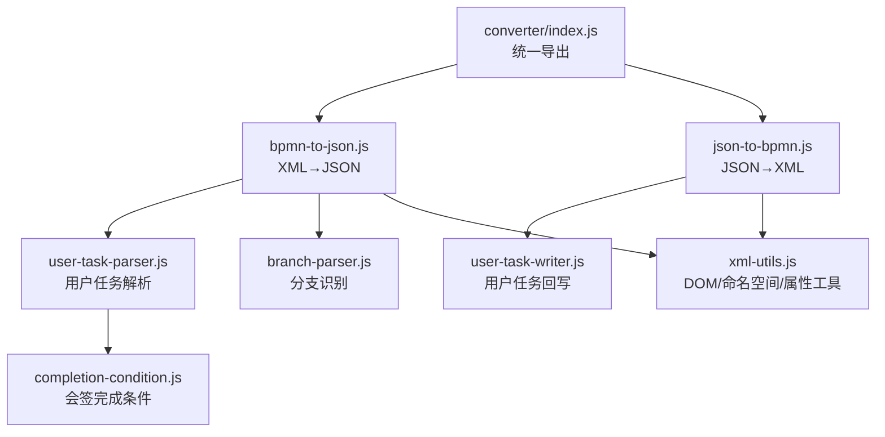
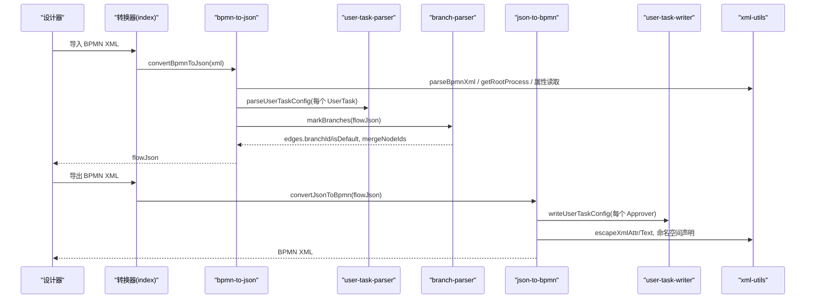
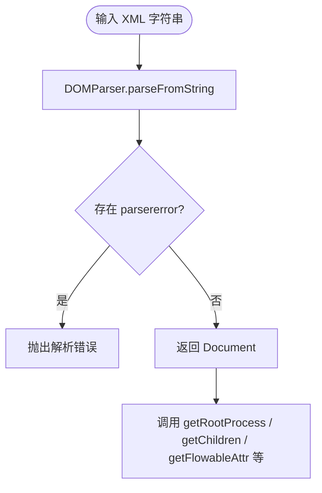
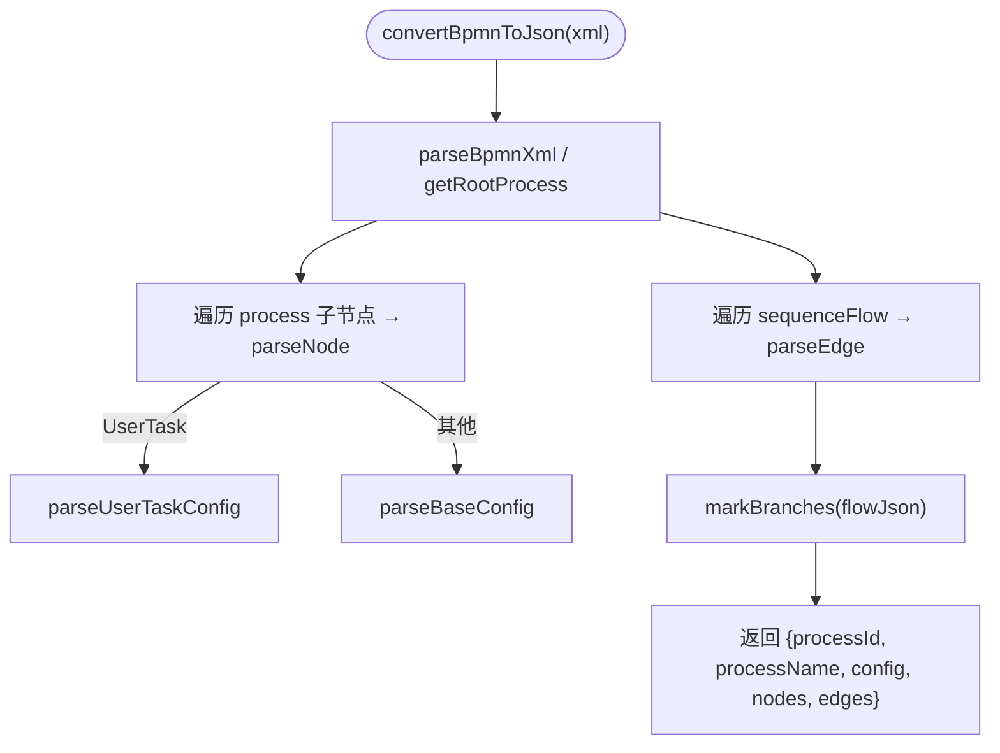
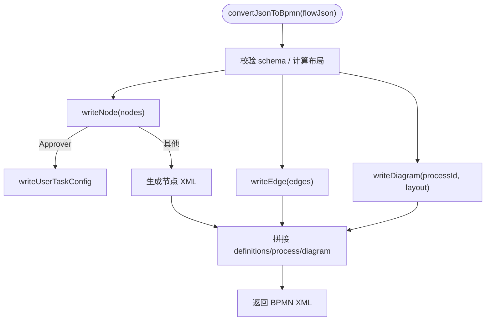
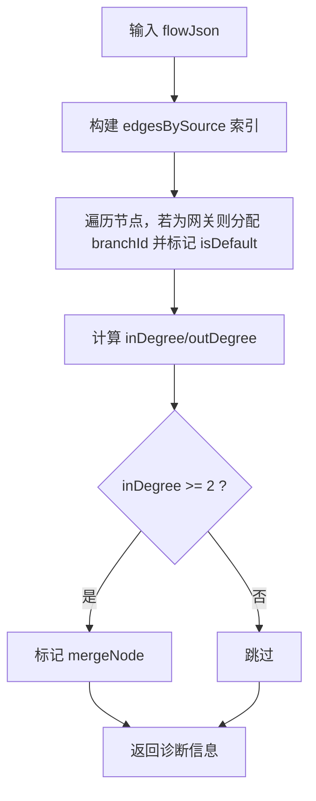
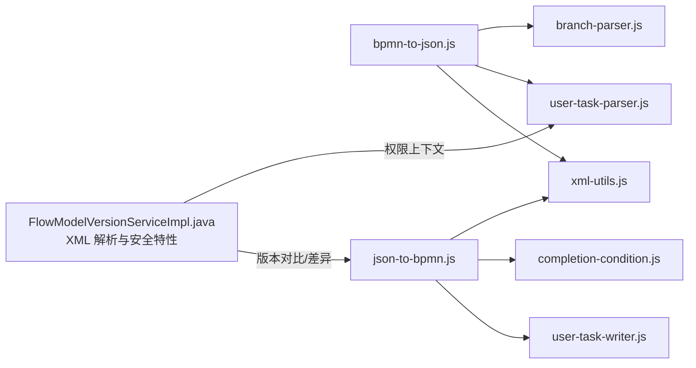

# 转换器系统

<cite>
**本文引用的文件**
- [index.js](file://forge-admin-ui/src/components/flow-designer/converter/index.js)
- [bpmn-to-json.js](file://forge-admin-ui/src/components/flow-designer/converter/bpmn-to-json.js)
- [json-to-bpmn.js](file://forge-admin-ui/src/components/flow-designer/converter/json-to-bpmn.js)
- [user-task-parser.js](file://forge-admin-ui/src/components/flow-designer/converter/user-task-parser.js)
- [user-task-writer.js](file://forge-admin-ui/src/components/flow-designer/converter/user-task-writer.js)
- [branch-parser.js](file://forge-admin-ui/src/components/flow-designer/converter/branch-parser.js)
- [completion-condition.js](file://forge-admin-ui/src/components/flow-designer/converter/completion-condition.js)
- [xml-utils.js](file://forge-admin-ui/src/components/flow-designer/converter/xml-utils.js)
- [FlowModelVersionServiceImpl.java](file://forge-server/forge-framework/forge-plugin-parent/forge-plugin-flow/src/main/java/com/mdframe/forge/starter/flow/service/impl/FlowModelVersionServiceImpl.java)
- [BusinessProcessValidationContextResolver.java](file://forge-server/forge-framework/forge-plugin-parent/forge-plugin-generator/src/main/java/com/mdframe/forge/plugin/generator/businessprocess/validation/BusinessProcessValidationContextResolver.java)
</cite>

## 目录
1. [简介](#简介)
2. [项目结构](#项目结构)
3. [核心组件](#核心组件)
4. [架构总览](#架构总览)
5. [详细组件分析](#详细组件分析)
6. [依赖关系分析](#依赖关系分析)
7. [性能与可扩展性](#性能与可扩展性)
8. [故障排查指南](#故障排查指南)
9. [结论](#结论)
10. [附录](#附录)

## 简介
本技术文档围绕工作流设计器中的“转换器系统”展开，聚焦 BPMN XML 与内部 JSON（flowJson）之间的双向转换机制。内容覆盖 XML 解析、用户任务处理器、分支解析、完成条件处理、权限配置转换、流程定义导入导出、版本兼容性与数据映射等关键能力，并提供扩展开发、错误处理、格式验证、性能优化与调试工具的使用建议。

## 项目结构
转换器子系统位于前端流程设计器的 converter 模块中，采用“按职责拆分、统一导出”的组织方式：
- 入口聚合导出：统一对外暴露转换能力
- 解析层：BPMN XML → flowJson
- 生成层：flowJson → BPMN XML
- 专用处理器：用户任务、分支识别、完成条件表达式
- 通用工具：XML DOM 操作、命名空间与属性读取、转义



图表来源
- [index.js:1-25](file://forge-admin-ui/src/components/flow-designer/converter/index.js#L1-L25)
- [bpmn-to-json.js:1-358](file://forge-admin-ui/src/components/flow-designer/converter/bpmn-to-json.js#L1-L358)
- [json-to-bpmn.js:1-293](file://forge-admin-ui/src/components/flow-designer/converter/json-to-bpmn.js#L1-L293)
- [user-task-parser.js:1-510](file://forge-admin-ui/src/components/flow-designer/converter/user-task-parser.js#L1-L510)
- [user-task-writer.js:1-352](file://forge-admin-ui/src/components/flow-designer/converter/user-task-writer.js#L1-L352)
- [branch-parser.js:1-100](file://forge-admin-ui/src/components/flow-designer/converter/branch-parser.js#L1-L100)
- [completion-condition.js:1-30](file://forge-admin-ui/src/components/flow-designer/converter/completion-condition.js#L1-L30)
- [xml-utils.js:1-266](file://forge-admin-ui/src/components/flow-designer/converter/xml-utils.js#L1-L266)

章节来源
- [index.js:1-25](file://forge-admin-ui/src/components/flow-designer/converter/index.js#L1-L25)

## 核心组件
- XML 解析与序列化：提供安全的 DOMParser/XMLSerializer 封装，统一命名空间处理与属性读取策略，支持 bpmn、bpmndi、dc、di、flowable、xsi 等命名空间。
- BPMN→JSON 转换器：解析 process、节点、连线，提取基础配置；未知元素以 advanced/rawXml 兜底；后续通过分支识别与会签完成条件完善 edges 与 nodes.config。
- JSON→BPMN 转换器：将 flowJson 写出为符合 BPMN 2.0 + Flowable 扩展的 XML，包含 diagram 布局信息、流程级审批策略等。
- 用户任务处理器：完整解析 assignee/candidateUsers/candidateGroups、表单、优先级/截止时间、权限、多实例与会签完成条件、监听器等，并原样回写。
- 分支解析器：为网关出边分配 branchId、标记默认分支、识别汇合节点（入度≥2）。
- 完成条件构造器：与解析器对偶，生成 all/any/ratio 对应的 completionCondition 表达式。

章节来源
- [xml-utils.js:1-266](file://forge-admin-ui/src/components/flow-designer/converter/xml-utils.js#L1-L266)
- [bpmn-to-json.js:1-358](file://forge-admin-ui/src/components/flow-designer/converter/bpmn-to-json.js#L1-L358)
- [json-to-bpmn.js:1-293](file://forge-admin-ui/src/components/flow-designer/converter/json-to-bpmn.js#L1-L293)
- [user-task-parser.js:1-510](file://forge-admin-ui/src/components/flow-designer/converter/user-task-parser.js#L1-L510)
- [user-task-writer.js:1-352](file://forge-admin-ui/src/components/flow-designer/converter/user-task-writer.js#L1-L352)
- [branch-parser.js:1-100](file://forge-admin-ui/src/components/flow-designer/converter/branch-parser.js#L1-L100)
- [completion-condition.js:1-30](file://forge-admin-ui/src/components/flow-designer/converter/completion-condition.js#L1-L30)

## 架构总览
整体数据流分为两条主路径：导入（BPMN→JSON）与导出（JSON→BPMN），并通过分支识别与完成条件处理增强语义一致性。后端在模型版本管理中也实现了安全的 XML 解析与差异比较逻辑，保障导入导出的稳定性与兼容性。



图表来源
- [index.js:1-25](file://forge-admin-ui/src/components/flow-designer/converter/index.js#L1-L25)
- [bpmn-to-json.js:60-98](file://forge-admin-ui/src/components/flow-designer/converter/bpmn-to-json.js#L60-L98)
- [user-task-parser.js:55-101](file://forge-admin-ui/src/components/flow-designer/converter/user-task-parser.js#L55-L101)
- [branch-parser.js:26-73](file://forge-admin-ui/src/components/flow-designer/converter/branch-parser.js#L26-L73)
- [json-to-bpmn.js:29-61](file://forge-admin-ui/src/components/flow-designer/converter/json-to-bpmn.js#L29-L61)
- [user-task-writer.js:63-225](file://forge-admin-ui/src/components/flow-designer/converter/user-task-writer.js#L63-L225)
- [xml-utils.js:36-49](file://forge-admin-ui/src/components/flow-designer/converter/xml-utils.js#L36-L49)

## 详细组件分析

### XML 解析与工具（xml-utils）
- 安全解析：使用 DOMParser 解析 XML，检测 parsererror 并抛出可读错误；提供 serializeXml 将 Document 序列化为字符串。
- 命名空间与查询：定义 BPMN/BPMNDI/DC/DI/FLOWABLE/XSI 常量；提供 findElementsByLocalName、getChildren、getChild、getRootProcess 等稳定 API。
- 属性读取：getAttr/getFlowableAttr/getFlowableBoolAttr 兼容多种输出形态（命名空间感知、字面前缀、裸属性），确保不同环境下的健壮性。
- 扩展元素与文档：getExtensionElements/getExtensionElement 用于定位 extensionElements 下的子项；getDocumentation 提取标准文档文本。



图表来源
- [xml-utils.js:36-49](file://forge-admin-ui/src/components/flow-designer/converter/xml-utils.js#L36-L49)
- [xml-utils.js:88-100](file://forge-admin-ui/src/components/flow-designer/converter/xml-utils.js#L88-L100)
- [xml-utils.js:110-138](file://forge-admin-ui/src/components/flow-designer/converter/xml-utils.js#L110-L138)
- [xml-utils.js:171-219](file://forge-admin-ui/src/components/flow-designer/converter/xml-utils.js#L171-L219)
- [xml-utils.js:228-247](file://forge-admin-ui/src/components/flow-designer/converter/xml-utils.js#L228-L247)
- [xml-utils.js:253-265](file://forge-admin-ui/src/components/flow-designer/converter/xml-utils.js#L253-L265)

章节来源
- [xml-utils.js:1-266](file://forge-admin-ui/src/components/flow-designer/converter/xml-utils.js#L1-L266)

### BPMN→JSON 转换器（bpmn-to-json）
- 入口函数 convertBpmnXml：解析根 process，遍历子节点构建 nodes，遍历 sequenceFlow 构建 edges，并解析流程级配置（允许提交人撤回、自动审批模式）。
- 节点解析：根据 BPMN 类型映射到 nodeType；未知元素以 advanced 节点保留 rawXml；基础节点提取 documentation、async、实现方式、脚本、子流程触发、调用活动等。
- 用户任务：委托 user-task-parser 提取完整配置（审批人、候选者、表单、优先级/截止期、权限、多实例与会签、监听器等）。
- 分支识别：调用 branch-parser.markBranches 为网关出边分配 branchId、标记 isDefault，并标注 mergeNode。



图表来源
- [bpmn-to-json.js:60-98](file://forge-admin-ui/src/components/flow-designer/converter/bpmn-to-json.js#L60-L98)
- [bpmn-to-json.js:131-155](file://forge-admin-ui/src/components/flow-designer/converter/bpmn-to-json.js#L131-L155)
- [bpmn-to-json.js:192-266](file://forge-admin-ui/src/components/flow-designer/converter/bpmn-to-json.js#L192-L266)
- [bpmn-to-json.js:323-348](file://forge-admin-ui/src/components/flow-designer/converter/bpmn-to-json.js#L323-L348)
- [branch-parser.js:26-73](file://forge-admin-ui/src/components/flow-designer/converter/branch-parser.js#L26-L73)

章节来源
- [bpmn-to-json.js:1-358](file://forge-admin-ui/src/components/flow-designer/converter/bpmn-to-json.js#L1-L358)
- [branch-parser.js:1-100](file://forge-admin-ui/src/components/flow-designer/converter/branch-parser.js#L1-L100)

### JSON→BPMN 转换器（json-to-bpmn）
- 入口函数 convertJsonToBpmn：校验输入，计算布局，生成节点 XML、连线 XML 与 diagram，写入流程级审批策略。
- 节点写出：根据 nodeType 映射到 BPMN 本地名；Advanced 节点直接透传 rawXml；Approver 委托 user-task-writer 写出复杂配置；Service/Script/CallActivity 等按配置写出属性与子元素。
- 连线写出：根据 condition 与 isDefault 决定是否写入 conditionExpression。
- Diagram 写出：基于 layout 生成 BPMNShape/BPMNEdge，确保 BPMNPlane.bpmnElement 指向真实 process id。



图表来源
- [json-to-bpmn.js:29-61](file://forge-admin-ui/src/components/flow-designer/converter/json-to-bpmn.js#L29-L61)
- [json-to-bpmn.js:80-178](file://forge-admin-ui/src/components/flow-designer/converter/json-to-bpmn.js#L80-L178)
- [json-to-bpmn.js:236-248](file://forge-admin-ui/src/components/flow-designer/converter/json-to-bpmn.js#L236-L248)
- [json-to-bpmn.js:250-280](file://forge-admin-ui/src/components/flow-designer/converter/json-to-bpmn.js#L250-L280)

章节来源
- [json-to-bpmn.js:1-293](file://forge-admin-ui/src/components/flow-designer/converter/json-to-bpmn.js#L1-L293)

### 用户任务处理器（user-task-parser / user-task-writer）
- 解析侧（parser）：从 UserTask 中提取 assignee/candidateUsers/candidateGroups、表单、优先级/截止期、权限、多实例与会签完成条件、监听器、责任描述与审批要点等，并对 legacy 字段做兼容处理。
- 写出侧（writer）：将上述配置写回 BPMN XML，包括 flowable:* 属性、multiInstanceLoopCharacteristics、completionCondition、extensionElements 中的 taskListener/executionListener 等。
- 完成条件：与 completion-condition 对偶，all/any/ratio 三种模式可往返一致。

```mermaid
classDiagram
class UserTaskParser {
+parseUserTaskConfig(taskElement) Config
-applyAssignee(el, config)
-applyForm(el, config)
-applyPriorityAndDueDate(el, config)
-applyPermissions(el, config)
-applyApprovalDuty(el, config)
-applyMultiInstance(el, config)
-applyListeners(el, config)
+parseCompletionExpression(expr)
}
class UserTaskWriter {
+writeUserTaskConfig(config) {attrs, children}
-buildDueDateDuration(cfg)
-normalizeApprovalPoints(source)
-buildListener(tag, l)
}
UserTaskParser <..> UserTaskWriter : "语义对偶"
```

图表来源
- [user-task-parser.js:55-101](file://forge-admin-ui/src/components/flow-designer/converter/user-task-parser.js#L55-L101)
- [user-task-parser.js:157-221](file://forge-admin-ui/src/components/flow-designer/converter/user-task-parser.js#L157-L221)
- [user-task-parser.js:242-314](file://forge-admin-ui/src/components/flow-designer/converter/user-task-parser.js#L242-L314)
- [user-task-parser.js:350-400](file://forge-admin-ui/src/components/flow-designer/converter/user-task-parser.js#L350-L400)
- [user-task-parser.js:406-471](file://forge-admin-ui/src/components/flow-designer/converter/user-task-parser.js#L406-L471)
- [user-task-writer.js:63-225](file://forge-admin-ui/src/components/flow-designer/converter/user-task-writer.js#L63-L225)
- [user-task-writer.js:319-351](file://forge-admin-ui/src/components/flow-designer/converter/user-task-writer.js#L319-L351)

章节来源
- [user-task-parser.js:1-510](file://forge-admin-ui/src/components/flow-designer/converter/user-task-parser.js#L1-L510)
- [user-task-writer.js:1-352](file://forge-admin-ui/src/components/flow-designer/converter/user-task-writer.js#L1-L352)

### 分支解析（branch-parser）
- 功能：为网关出边分配 branchId、标记默认分支（default 属性）、统计入度/出度并识别汇合节点（mergeNode）。
- 影响：为后续布局算法与可视化提供拓扑信息，同时保证 edges 的语义完整性。



图表来源
- [branch-parser.js:26-73](file://forge-admin-ui/src/components/flow-designer/converter/branch-parser.js#L26-L73)
- [branch-parser.js:75-99](file://forge-admin-ui/src/components/flow-designer/converter/branch-parser.js#L75-L99)

章节来源
- [branch-parser.js:1-100](file://forge-admin-ui/src/components/flow-designer/converter/branch-parser.js#L1-L100)

### 完成条件处理（completion-condition）
- 功能：根据 condition 与 passRate 生成 completionCondition 表达式，与解析器形成对偶，保证往返一致性。
- 规则：all 对应全部完成；any 对应至少一个完成；ratio 按比例阈值生成表达式，越界时回退 to all。

章节来源
- [completion-condition.js:1-30](file://forge-admin-ui/src/components/flow-designer/converter/completion-condition.js#L1-L30)
- [user-task-parser.js:452-471](file://forge-admin-ui/src/components/flow-designer/converter/user-task-parser.js#L452-L471)

## 依赖关系分析
- 模块内依赖：bpmn-to-json 依赖 xml-utils、user-task-parser、branch-parser；json-to-bpmn 依赖 user-task-writer、completion-condition、xml-utils。
- 前后端协同：前端转换器负责设计态的 XML↔JSON 转换；后端在模型版本管理中提供安全的 XML 解析与差异比较能力，保障导入导出与版本管理的稳定性。



图表来源
- [bpmn-to-json.js:26-39](file://forge-admin-ui/src/components/flow-designer/converter/bpmn-to-json.js#L26-L39)
- [json-to-bpmn.js:9-12](file://forge-admin-ui/src/components/flow-designer/converter/json-to-bpmn.js#L9-L12)
- [FlowModelVersionServiceImpl.java:425-458](file://forge-server/forge-framework/forge-plugin-parent/forge-plugin-flow/src/main/java/com/mdframe/forge/starter/flow/service/impl/FlowModelVersionServiceImpl.java#L425-L458)
- [BusinessProcessValidationContextResolver.java:366-402](file://forge-server/forge-framework/forge-plugin-parent/forge-plugin-generator/src/main/java/com/mdframe/forge/plugin/generator/businessprocess/validation/BusinessProcessValidationContextResolver.java#L366-L402)

章节来源
- [FlowModelVersionServiceImpl.java:425-458](file://forge-server/forge-framework/forge-plugin-parent/forge-plugin-flow/src/main/java/com/mdframe/forge/starter/flow/service/impl/FlowModelVersionServiceImpl.java#L425-L458)
- [BusinessProcessValidationContextResolver.java:366-402](file://forge-server/forge-framework/forge-plugin-parent/forge-plugin-generator/src/main/java/com/mdframe/forge/plugin/generator/businessprocess/validation/BusinessProcessValidationContextResolver.java#L366-L402)

## 性能与可扩展性
- 解析性能：xml-utils 优先使用 getElementsByTagNameNS 进行 O(n) 查找，避免深度遍历；仅在不可用时回退到栈式遍历。
- 内存与对象复用：分支识别使用 Map 缓存节点与边关系，减少重复计算；节点与边的构建过程线性扫描。
- 可扩展点：
  - 新增节点类型：在 bpmn-to-json 的 parseBaseConfig 与 json-to-bpmn 的 writeNode 中对称扩展。
  - 自定义数据类型：在 user-task-parser 与 user-task-writer 中扩展字段解析/写出逻辑，保持对偶。
  - 高级节点：advanced/rawXml 机制允许任意 BPMN 片段无损往返。
- 安全与健壮性：XML 解析禁用外部实体与 DOCTYPE，防止 XXE；属性读取兼容多种命名空间形态，降低环境差异风险。

[本节为通用指导，不直接分析具体文件]

## 故障排查指南
- XML 解析失败：检查 XML 是否合法、是否包含非法字符或命名空间问题；查看解析错误消息定位 parsererror。
- 分支未识别：确认网关节点类型是否正确、edges 的 source/target 是否匹配、default 属性是否存在。
- 会签完成条件异常：核对 completionCondition 表达式是否符合 all/any/ratio 约定；检查 passRate 是否在合理范围。
- 用户任务属性丢失：检查 flowable:* 属性前缀与命名空间；确认 extensionElements 下 listener 列表是否被正确解析/写出。
- 版本兼容：后端 XML 解析启用安全特性（禁止 DOCTYPE、外部实体），避免恶意注入；前端转换器对 legacy 字段做了兼容处理。

章节来源
- [xml-utils.js:36-49](file://forge-admin-ui/src/components/flow-designer/converter/xml-utils.js#L36-L49)
- [FlowModelVersionServiceImpl.java:425-458](file://forge-server/forge-framework/forge-plugin-parent/forge-plugin-flow/src/main/java/com/mdframe/forge/starter/flow/service/impl/FlowModelVersionServiceImpl.java#L425-L458)

## 结论
本转换器系统通过清晰的模块化设计与对偶的解析/写出逻辑，实现了 BPMN 与 flowJson 的高保真双向转换。借助分支识别、完成条件处理、用户任务全量属性解析与回写，以及安全的 XML 解析策略，系统在可用性、兼容性与安全性方面具备良好表现。未来可通过扩展节点类型、自定义数据类型与更丰富的布局算法进一步提升灵活性。

[本节为总结性内容，不直接分析具体文件]

## 附录
- 导入导出最佳实践：
  - 导入：先校验 XML 合法性，再转换为 flowJson；必要时运行分支识别与会签条件规范化。
  - 导出：确保 flowJson 的 nodes/edges 完整，layout 信息可用；对 unknown 节点使用 advanced/rawXml 保留。
- 调试建议：
  - 打印中间结果：flowJson 的结构与 edges.branchId/isDefault 是否正确。
  - 对比 XML 往返：将生成的 BPMN XML 重新导入，验证语义等价。
  - 关注命名空间与属性：flowable:* 属性需与前缀一致；documentation 与 extensionElements 内容应完整。
- 性能调优：
  - 大流程场景下，优先使用 xml-utils 的高效查询方法；避免不必要的深拷贝。
  - 批量转换时，复用解析器与序列化器实例（如适用）。

[本节为通用指导，不直接分析具体文件]