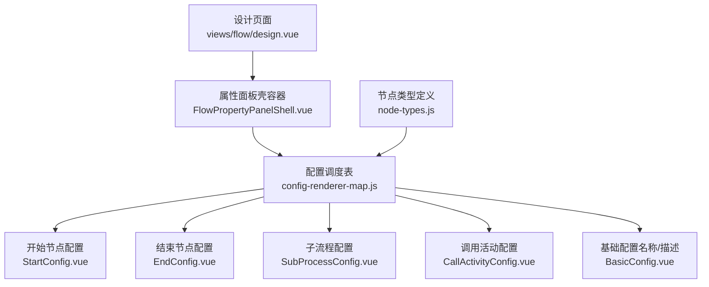
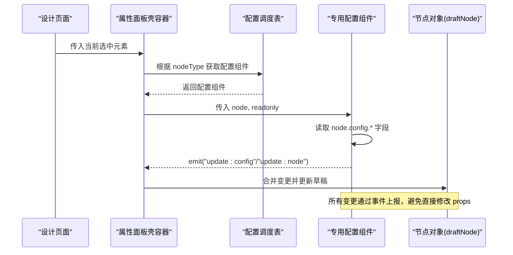
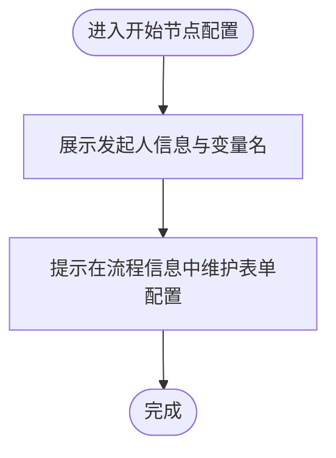
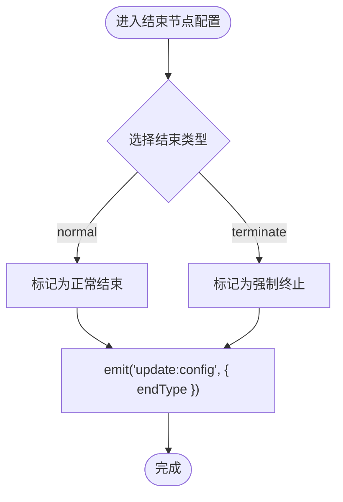
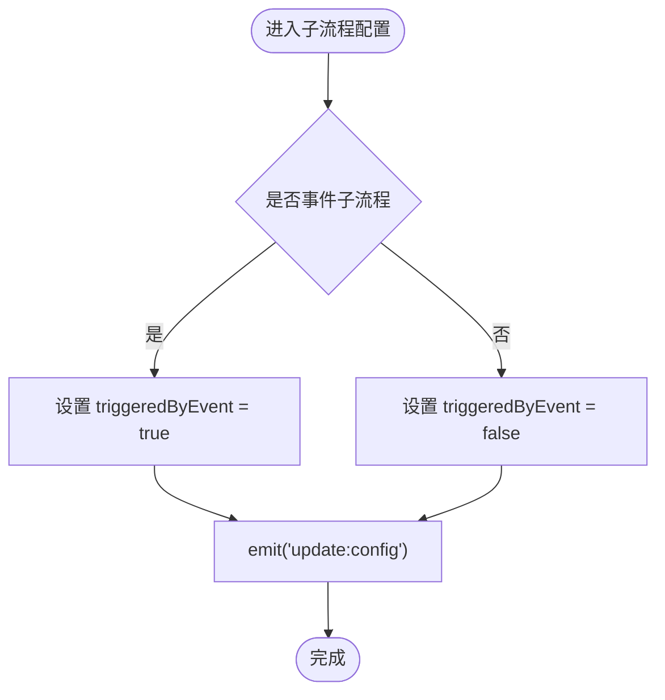
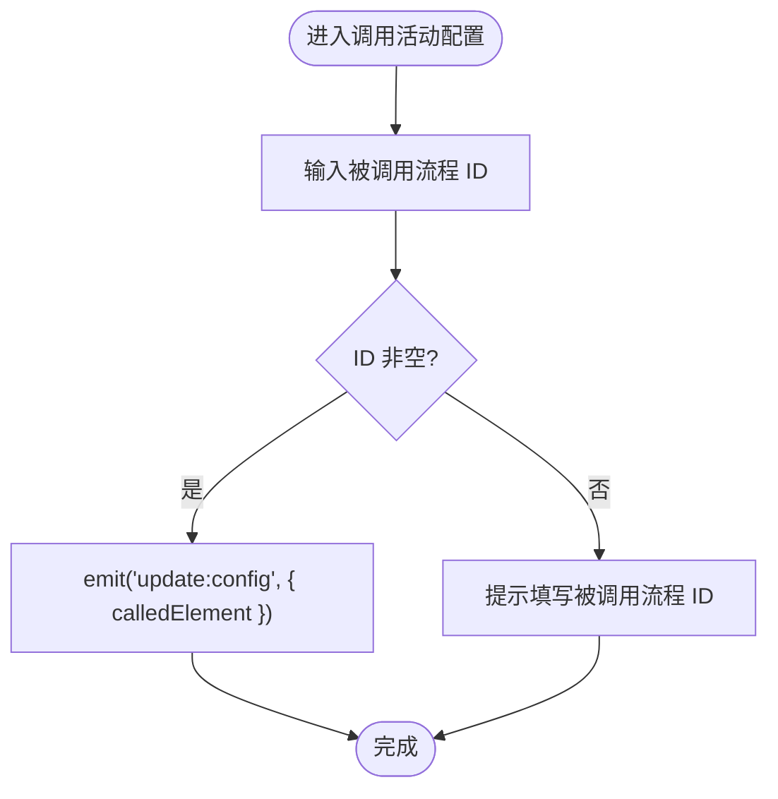
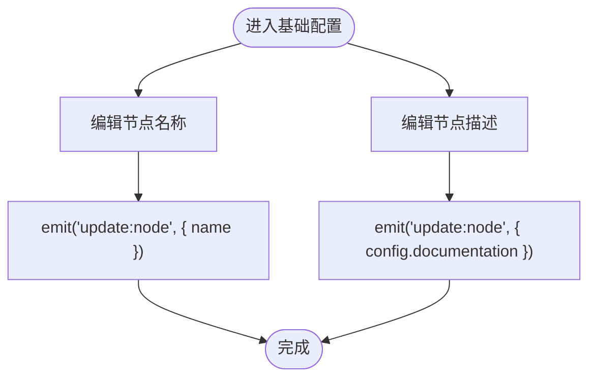
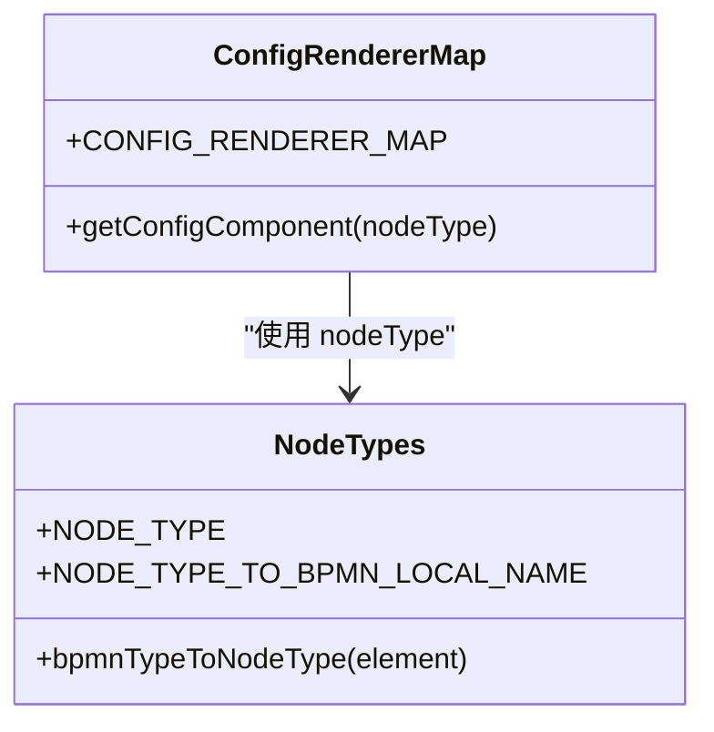
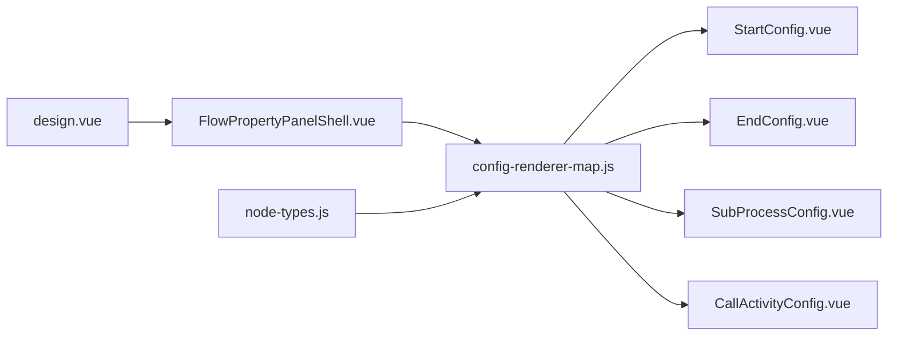

# 专用配置面板

<cite>
**本文引用的文件**
- [BasicConfig.vue](file://forge-admin-ui/src/components/flow-designer/panel/BasicConfig.vue)
- [StartConfig.vue](file://forge-admin-ui/src/components/flow-designer/panel/StartConfig.vue)
- [EndConfig.vue](file://forge-admin-ui/src/components/flow-designer/panel/EndConfig.vue)
- [SubProcessConfig.vue](file://forge-admin-ui/src/components/flow-designer/panel/SubProcessConfig.vue)
- [CallActivityConfig.vue](file://forge-admin-ui/src/components/flow-designer/panel/CallActivityConfig.vue)
- [config-renderer-map.js](file://forge-admin-ui/src/components/flow-designer/panel/config-renderer-map.js)
- [node-types.js](file://forge-admin-ui/src/components/flow-designer/constants/node-types.js)
- [FlowPropertyPanelShell.vue](file://forge-admin-ui/src/components/flow/FlowPropertyPanelShell.vue)
- [design.vue](file://forge-admin-ui/src/views/flow/design.vue)
</cite>

## 目录
1. [简介](#简介)
2. [项目结构](#项目结构)
3. [核心组件](#核心组件)
4. [架构总览](#架构总览)
5. [详细组件分析](#详细组件分析)
6. [依赖关系分析](#依赖关系分析)
7. [性能考虑](#性能考虑)
8. [故障排查指南](#故障排查指南)
9. [结论](#结论)
10. [附录](#附录)

## 简介
本技术文档聚焦“专用配置面板”，围绕特殊节点类型的专属配置实现进行系统化解析，覆盖开始节点、结束节点、子流程、调用活动等节点的特殊配置需求。文档从界面设计、数据模型、业务规则入手，说明专用配置与通用配置的集成机制、数据传递与状态同步方式，并给出扩展点、自定义节点类型开发与配置模板复用方案，最后提供最佳实践与常见问题解决方案。

## 项目结构
专用配置面板位于流程设计器右侧属性面板中，采用“壳容器 + 动态渲染”的模式：
- 壳容器负责统一标题、描述、关闭按钮与滚动区域，承载具体配置内容。
- 配置渲染通过调度表按节点类型选择对应配置组件。
- 节点类型到 BPMN 元素的映射集中管理，保证前后端一致。

图表来源
- [design.vue:146-162](file://forge-admin-ui/src/views/flow/design.vue#L146-L162)
- [FlowPropertyPanelShell.vue:1-38](file://forge-admin-ui/src/components/flow/FlowPropertyPanelShell.vue#L1-L38)
- [config-renderer-map.js:1-38](file://forge-admin-ui/src/components/flow-designer/panel/config-renderer-map.js#L1-L38)
- [node-types.js:1-160](file://forge-admin-ui/src/components/flow-designer/constants/node-types.js#L1-L160)

章节来源
- [design.vue:146-162](file://forge-admin-ui/src/views/flow/design.vue#L146-L162)
- [FlowPropertyPanelShell.vue:1-38](file://forge-admin-ui/src/components/flow/FlowPropertyPanelShell.vue#L1-L38)
- [config-renderer-map.js:1-38](file://forge-admin-ui/src/components/flow-designer/panel/config-renderer-map.js#L1-L38)
- [node-types.js:1-160](file://forge-admin-ui/src/components/flow-designer/constants/node-types.js#L1-L160)

## 核心组件
- 属性面板壳容器：提供统一的头部信息、关闭事件与可滚动内容区，支持空态提示。
- 基础配置：编辑节点名称与描述，并通过双向绑定将变更回传到父级草稿节点。
- 专用配置组件：按节点类型渲染不同表单字段，统一通过 update:config 或 update:node 事件上报变更。
- 配置调度表：根据 nodeType 返回对应配置组件，网关三类共用条件配置组件以展示分支列表。
- 节点类型定义：维护钉钉样式 nodeType 与 BPMN 元素类型的映射，以及读取 flowable:type 的兼容逻辑。

章节来源
- [FlowPropertyPanelShell.vue:1-38](file://forge-admin-ui/src/components/flow/FlowPropertyPanelShell.vue#L1-L38)
- [BasicConfig.vue:1-51](file://forge-admin-ui/src/components/flow-designer/panel/BasicConfig.vue#L1-L51)
- [config-renderer-map.js:1-38](file://forge-admin-ui/src/components/flow-designer/panel/config-renderer-map.js#L1-L38)
- [node-types.js:1-160](file://forge-admin-ui/src/components/flow-designer/constants/node-types.js#L1-L160)

## 架构总览
专用配置面板的数据流遵循“只读输入 + 事件上报”的单向数据流原则：
- 父组件传入当前节点对象（包含 id、name、config 等）。
- 各配置组件通过 computed 读取 props.node.config 中的特定字段。
- 用户修改后，组件 emit 更新事件，由上层合并并回写至 draftNode。
- 调度表依据 nodeType 决定渲染哪个专用配置组件。

图表来源
- [design.vue:146-162](file://forge-admin-ui/src/views/flow/design.vue#L146-L162)
- [config-renderer-map.js:1-38](file://forge-admin-ui/src/components/flow-designer/panel/config-renderer-map.js#L1-L38)
- [BasicConfig.vue:1-51](file://forge-admin-ui/src/components/flow-designer/panel/BasicConfig.vue#L1-L51)

## 详细组件分析

### 开始节点（Start）
- 界面设计：展示发起人信息与变量名，强调系统自动记录，引导用户在流程信息中维护表单配置。
- 数据模型：无需要编辑的 config 字段；仅用于信息展示。
- 业务规则：发起人由系统在流程启动时注入为固定变量 initiator；表单配置不在该节点维护。
- 与通用配置集成：与 BasicConfig 并列显示，不影响通用 name/documentation 字段。

图表来源
- [StartConfig.vue:1-33](file://forge-admin-ui/src/components/flow-designer/panel/StartConfig.vue#L1-L33)

章节来源
- [StartConfig.vue:1-33](file://forge-admin-ui/src/components/flow-designer/panel/StartConfig.vue#L1-L33)

### 结束节点（End）
- 界面设计：提供结束类型单选（正常结束 / 强制终止），附带说明文案。
- 数据模型：endType 字段，默认 normal。
- 业务规则：normal 表示路径完成；terminate 表示立即结束整个流程实例，不等待并行分支。
- 与通用配置集成：与其他节点共享 BasicConfig 的名称与描述。

图表来源
- [EndConfig.vue:1-41](file://forge-admin-ui/src/components/flow-designer/panel/EndConfig.vue#L1-L41)

章节来源
- [EndConfig.vue:1-41](file://forge-admin-ui/src/components/flow-designer/panel/EndConfig.vue#L1-L41)

### 子流程（SubProcess）
- 界面设计：提供“事件子流程”开关，提示内部结构暂不支持画布内编辑。
- 数据模型：triggeredByEvent 布尔值。
- 业务规则：开启后作为事件驱动的子流程；内部结构需通过高级模式或 BPMN XML 编辑器维护。
- 与通用配置集成：与 BasicConfig 并列，不影响其他通用字段。

图表来源
- [SubProcessConfig.vue:1-31](file://forge-admin-ui/src/components/flow-designer/panel/SubProcessConfig.vue#L1-L31)

章节来源
- [SubProcessConfig.vue:1-31](file://forge-admin-ui/src/components/flow-designer/panel/SubProcessConfig.vue#L1-L31)

### 调用活动（CallActivity）
- 界面设计：输入被调用流程 ID，提示调用活动会启动独立流程实例并在结束后继续主流程。
- 数据模型：calledElement 字符串，指向被调用流程的 process id。
- 业务规则：调用活动与子流程不同，它启动的是另一个流程实例，而非嵌套执行。
- 与通用配置集成：与 BasicConfig 并列，不影响其他通用字段。

图表来源
- [CallActivityConfig.vue:1-29](file://forge-admin-ui/src/components/flow-designer/panel/CallActivityConfig.vue#L1-L29)

章节来源
- [CallActivityConfig.vue:1-29](file://forge-admin-ui/src/components/flow-designer/panel/CallActivityConfig.vue#L1-L29)

### 基础配置（Basic）
- 界面设计：节点名称必填，节点描述可选；支持只读模式。
- 数据模型：name 与 config.documentation。
- 业务规则：名称用于识别节点，描述用于说明用途；变更通过 update:node 事件上报。
- 与专用配置集成：作为通用配置在所有节点下可用，与专用配置并列。

图表来源
- [BasicConfig.vue:1-51](file://forge-admin-ui/src/components/flow-designer/panel/BasicConfig.vue#L1-L51)

章节来源
- [BasicConfig.vue:1-51](file://forge-admin-ui/src/components/flow-designer/panel/BasicConfig.vue#L1-L51)

### 配置调度与节点类型映射
- 配置调度表：根据 nodeType 返回对应配置组件；网关三类共用 ConditionConfig 以展示分支列表。
- 节点类型定义：维护钉钉 nodeType 与 BPMN 元素类型的映射，支持读取 flowable:type 以区分抄送与服务任务。

图表来源
- [config-renderer-map.js:1-38](file://forge-admin-ui/src/components/flow-designer/panel/config-renderer-map.js#L1-L38)
- [node-types.js:1-160](file://forge-admin-ui/src/components/flow-designer/constants/node-types.js#L1-L160)

章节来源
- [config-renderer-map.js:1-38](file://forge-admin-ui/src/components/flow-designer/panel/config-renderer-map.js#L1-L38)
- [node-types.js:1-160](file://forge-admin-ui/src/components/flow-designer/constants/node-types.js#L1-L160)

## 依赖关系分析
- 视图层依赖：设计页面将当前选中元素传递给属性面板壳容器，壳容器再加载对应配置组件。
- 组件间耦合：配置组件仅依赖 props.node 与 emit 事件，低耦合、高内聚。
- 类型映射：节点类型定义集中管理，避免分散判断导致不一致。
- 外部依赖：BPMN 元素解析与 flowable 命名空间处理由节点类型模块封装。

图表来源
- [design.vue:146-162](file://forge-admin-ui/src/views/flow/design.vue#L146-L162)
- [FlowPropertyPanelShell.vue:1-38](file://forge-admin-ui/src/components/flow/FlowPropertyPanelShell.vue#L1-L38)
- [config-renderer-map.js:1-38](file://forge-admin-ui/src/components/flow-designer/panel/config-renderer-map.js#L1-L38)
- [node-types.js:1-160](file://forge-admin-ui/src/components/flow-designer/constants/node-types.js#L1-L160)

章节来源
- [design.vue:146-162](file://forge-admin-ui/src/views/flow/design.vue#L146-L162)
- [FlowPropertyPanelShell.vue:1-38](file://forge-admin-ui/src/components/flow/FlowPropertyPanelShell.vue#L1-L38)
- [config-renderer-map.js:1-38](file://forge-admin-ui/src/components/flow-designer/panel/config-renderer-map.js#L1-L38)
- [node-types.js:1-160](file://forge-admin-ui/src/components/flow-designer/constants/node-types.js#L1-L160)

## 性能考虑
- 最小化重渲染：配置组件通过 computed 读取 props，仅在 emit 时触发父级更新，减少不必要的重渲染。
- 只读模式：readonly 控制禁用交互，避免无效计算与事件。
- 调度表查找：使用对象映射 O(1) 查找配置组件，避免循环或复杂判断。
- 大表单优化：对复杂配置建议分页或懒加载，避免一次性渲染过多控件。

## 故障排查指南
- 配置未生效
  - 检查是否正确 emit update:config 或 update:node，确保父组件监听并合并变更。
  - 确认 nodeType 与配置组件映射正确，避免调度失败。
- 字段为空或丢失
  - 检查 props.node.config 初始结构是否完整，必要时提供默认值。
  - 对于只读字段（如开始节点的发起人变量名），确认不应尝试写入。
- 网关分支不显示
  - 确认 condition/parallel/inclusive 均使用 ConditionConfig 渲染分支列表。
- 抄送与服务任务混淆
  - 检查 flowable:type 读取逻辑，确保抄送节点正确识别为 carbonCopy。

章节来源
- [config-renderer-map.js:1-38](file://forge-admin-ui/src/components/flow-designer/panel/config-renderer-map.js#L1-L38)
- [node-types.js:1-160](file://forge-admin-ui/src/components/flow-designer/constants/node-types.js#L1-L160)
- [StartConfig.vue:1-33](file://forge-admin-ui/src/components/flow-designer/panel/StartConfig.vue#L1-L33)
- [EndConfig.vue:1-41](file://forge-admin-ui/src/components/flow-designer/panel/EndConfig.vue#L1-L41)
- [SubProcessConfig.vue:1-31](file://forge-admin-ui/src/components/flow-designer/panel/SubProcessConfig.vue#L1-L31)
- [CallActivityConfig.vue:1-29](file://forge-admin-ui/src/components/flow-designer/panel/CallActivityConfig.vue#L1-L29)

## 结论
专用配置面板通过“壳容器 + 调度表 + 专用组件”的架构，实现了清晰的数据流与良好的可扩展性。开始、结束、子流程、调用活动等节点各自具备明确的配置界面、数据模型与业务规则，并与通用配置无缝集成。借助集中化的节点类型映射与事件驱动的更新机制，新增节点类型与配置项的成本较低，便于后续扩展与维护。

## 附录
- 扩展点与自定义开发
  - 新增节点类型：在 node-types.js 中添加映射与识别逻辑，在 config-renderer-map.js 中注册配置组件。
  - 自定义配置组件：遵循 props.node 与 emit(update:config/update:node) 约定，保持只读与双向绑定一致性。
  - 配置模板复用：将常用字段组合为可复用子组件，在多个专用配置中引用，减少重复代码。
- 最佳实践
  - 始终通过事件上报变更，避免直接修改 props。
  - 为复杂配置提供清晰的提示与校验反馈。
  - 对只读场景启用 readonly，提升体验与性能。
  - 保持 nodeType 与 BPMN 元素映射的一致性，避免解析歧义。