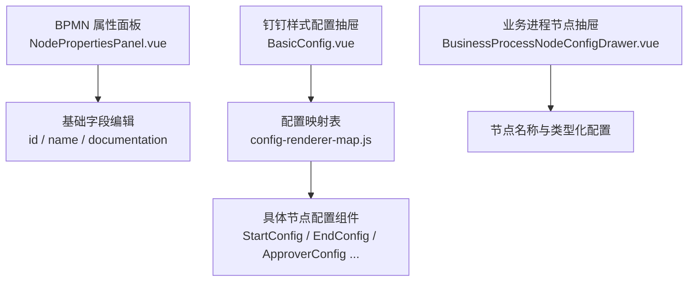
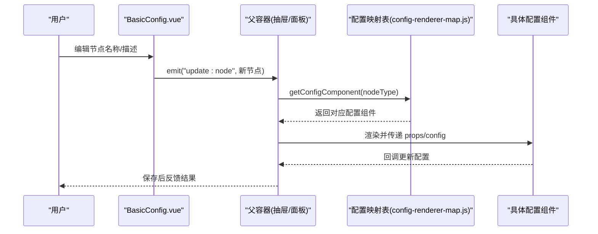
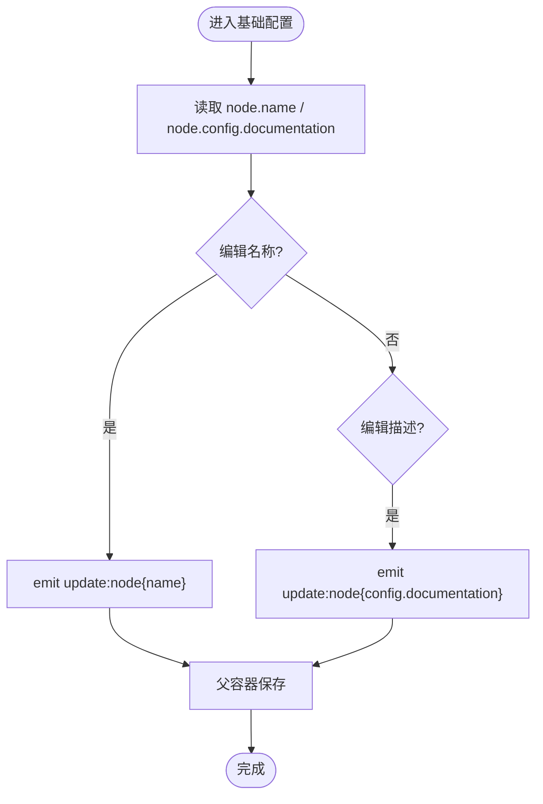
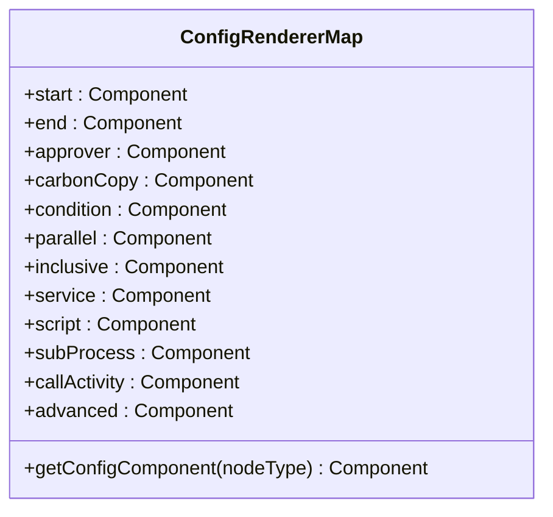
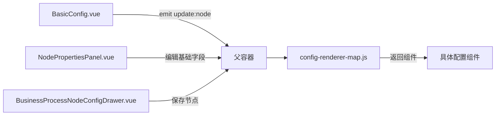

# 基础配置面板

<cite>
**本文引用的文件**
- [config-renderer-map.js](file://forge-admin-ui/src/components/flow-designer/panel/config-renderer-map.js)
- [BasicConfig.vue](file://forge-admin-ui/src/components/flow-designer/panel/BasicConfig.vue)
- [NodePropertiesPanel.vue](file://forge-admin-ui/src/components/bpmn/NodePropertiesPanel.vue)
- [BusinessProcessNodeConfigDrawer.vue](file://forge-admin-ui/src/components/business-process-designer/BusinessProcessNodeConfigDrawer.vue)
- [validation-presets.js](file://forge-admin-ui/src/utils/validation-presets.js)
- [AppSettingsGlobalization.vue](file://forge-admin-ui/src/views/app-center/components/settings/AppSettingsGlobalization.vue)
- [i18n/index.ts](file://forge-report-ui/src/i18n/index.ts)
</cite>

## 目录
1. [简介](#简介)
2. [项目结构](#项目结构)
3. [核心组件](#核心组件)
4. [架构总览](#架构总览)
5. [详细组件分析](#详细组件分析)
6. [依赖关系分析](#依赖关系分析)
7. [性能考虑](#性能考虑)
8. [故障排查指南](#故障排查指南)
9. [结论](#结论)
10. [附录](#附录)

## 简介
本技术文档聚焦“基础配置面板”，围绕节点基础属性（名称、描述等元数据）的编辑与保存机制，深入解析表单渲染器的配置映射机制（通过 config-renderer-map.js 实现动态表单组件绑定与数据同步），并覆盖验证规则、默认值处理、国际化支持等特性。同时提供自定义基础配置项的开发指南与最佳实践，帮助开发者扩展或替换基础配置行为。

## 项目结构
基础配置面板涉及两类主要入口：
- BPMN 流程设计器中的基础属性面板（NodePropertiesPanel.vue），用于编辑节点 id/name/documentation 等基础字段。
- 钉钉样式流程设计器中的基础配置抽屉（BasicConfig.vue + NodeConfigDrawer 调度），通过配置映射表将不同 nodeType 渲染为对应配置组件。

图表来源
- [NodePropertiesPanel.vue:109-127](file://forge-admin-ui/src/components/bpmn/NodePropertiesPanel.vue#L109-L127)
- [BasicConfig.vue:1-51](file://forge-admin-ui/src/components/flow-designer/panel/BasicConfig.vue#L1-L51)
- [config-renderer-map.js:1-38](file://forge-admin-ui/src/components/flow-designer/panel/config-renderer-map.js#L1-L38)
- [BusinessProcessNodeConfigDrawer.vue:104-181](file://forge-admin-ui/src/components/business-process-designer/BusinessProcessNodeConfigDrawer.vue#L104-L181)

章节来源
- [NodePropertiesPanel.vue:109-127](file://forge-admin-ui/src/components/bpmn/NodePropertiesPanel.vue#L109-L127)
- [BasicConfig.vue:1-51](file://forge-admin-ui/src/components/flow-designer/panel/BasicConfig.vue#L1-L51)
- [config-renderer-map.js:1-38](file://forge-admin-ui/src/components/flow-designer/panel/config-renderer-map.js#L1-L38)
- [BusinessProcessNodeConfigDrawer.vue:104-181](file://forge-admin-ui/src/components/business-process-designer/BusinessProcessNodeConfigDrawer.vue#L104-L181)

## 核心组件
- BasicConfig.vue：负责节点基础属性（名称、描述）的双向绑定与只读控制，通过 computed 读写 node.name 与 node.config.documentation，并以事件形式向上层提交更新。
- NodePropertiesPanel.vue：BPMN 属性面板的基础属性 Tab，直接编辑 properties.id/name/documentation，并在输入时标记脏状态以触发保存。
- BusinessProcessNodeConfigDrawer.vue：业务进程节点配置抽屉，维护 draftNode，统一收集名称与类型化配置变更，并通过 emit('save') 持久化。
- config-renderer-map.js：集中管理 nodeType 到配置组件的映射，并提供 getConfigComponent(nodeType) 查询接口；映射对象被冻结以防止运行时篡改。

章节来源
- [BasicConfig.vue:1-51](file://forge-admin-ui/src/components/flow-designer/panel/BasicConfig.vue#L1-L51)
- [NodePropertiesPanel.vue:109-127](file://forge-admin-ui/src/components/bpmn/NodePropertiesPanel.vue#L109-L127)
- [BusinessProcessNodeConfigDrawer.vue:40-101](file://forge-admin-ui/src/components/business-process-designer/BusinessProcessNodeConfigDrawer.vue#L40-L101)
- [config-renderer-map.js:20-37](file://forge-admin-ui/src/components/flow-designer/panel/config-renderer-map.js#L20-L37)

## 架构总览
基础配置的渲染与数据流遵循“配置驱动 + 双向绑定”的模式：
- 上层容器（如 NodeConfigDrawer 或 NodePropertiesPanel）持有当前节点的草稿数据。
- BasicConfig 通过 v-model 与 computed 对节点基础字段进行读写，并向父级发出 update:node 事件。
- 对于复杂节点类型，通过 config-renderer-map.js 根据 nodeType 动态选择具体配置组件，实现“同构表单、异构配置”。
- 所有变更最终汇聚到容器的保存逻辑中，完成持久化。

图表来源
- [BasicConfig.vue:17-32](file://forge-admin-ui/src/components/flow-designer/panel/BasicConfig.vue#L17-L32)
- [config-renderer-map.js:20-37](file://forge-admin-ui/src/components/flow-designer/panel/config-renderer-map.js#L20-L37)
- [BusinessProcessNodeConfigDrawer.vue:58-96](file://forge-admin-ui/src/components/business-process-designer/BusinessProcessNodeConfigDrawer.vue#L58-L96)

## 详细组件分析

### BasicConfig.vue：基础属性编辑与数据同步
- 功能要点
  - 接收 node 与 readonly 两个 prop。
  - 使用 computed 封装 name 与 documentation 的读写，分别写入 node.name 与 node.config.documentation。
  - 通过 emit('update:node') 将更新后的节点对象回传给父容器。
  - 模板中使用 n-form-item/n-input 展示“节点名称”和“节点描述”，支持只读禁用与自动高度。
- 数据模型
  - node.name：字符串，必填提示。
  - node.config.documentation：字符串，可选说明。
- 交互与校验
  - 名称字段带有 required 提示，但实际校验由上层表单或保存逻辑决定。
  - 描述字段为多行文本，支持最小/最大行数自适应。

图表来源
- [BasicConfig.vue:17-32](file://forge-admin-ui/src/components/flow-designer/panel/BasicConfig.vue#L17-L32)
- [BasicConfig.vue:35-50](file://forge-admin-ui/src/components/flow-designer/panel/BasicConfig.vue#L35-L50)

章节来源
- [BasicConfig.vue:1-51](file://forge-admin-ui/src/components/flow-designer/panel/BasicConfig.vue#L1-L51)

### NodePropertiesPanel.vue：BPMN 基础属性 Tab
- 功能要点
  - 在“基础属性”Tab 中提供 id/name/documentation 的直接编辑。
  - 每个字段绑定 properties 对象，并在输入时调用 markDirty 标记脏状态，便于后续保存判断。
- 与 BasicConfig 的关系
  - 两者都编辑相同语义的字段，但位于不同的设计器界面；BasicConfig 更偏向钉钉样式抽屉，NodePropertiesPanel 更偏向传统属性面板。

章节来源
- [NodePropertiesPanel.vue:109-127](file://forge-admin-ui/src/components/bpmn/NodePropertiesPanel.vue#L109-L127)

### BusinessProcessNodeConfigDrawer.vue：业务进程节点抽屉
- 功能要点
  - 维护 draftNode，打开时克隆传入 node，关闭时通过 emit('save') 提交完整节点。
  - 针对开始节点、执行节点、条件分支、结束节点等类型，渲染对应的子配置组件。
  - 名称字段直接绑定 draftNode.name，变更时触发 persistDraft。
- 保存策略
  - 每次配置变更都会调用 persistDraft，将 clone(draftNode) 连同 recordIdSource 一并提交给父级。

章节来源
- [BusinessProcessNodeConfigDrawer.vue:40-101](file://forge-admin-ui/src/components/business-process-designer/BusinessProcessNodeConfigDrawer.vue#L40-L101)
- [BusinessProcessNodeConfigDrawer.vue:104-181](file://forge-admin-ui/src/components/business-process-designer/BusinessProcessNodeConfigDrawer.vue#L104-L181)

### config-renderer-map.js：表单渲染器映射机制
- 功能要点
  - 定义 CONFIG_RENDERER_MAP，将 nodeType 映射到具体配置组件。
  - 网关类型 condition/parallel/inclusive 共用 ConditionConfig，简化实现。
  - 导出 getConfigComponent(nodeType) 用于按类型获取组件。
  - 使用 Object.freeze 冻结映射表，防止运行时修改导致不可预期行为。
- 扩展方式
  - 新增 nodeType 时，只需在映射表中添加键值对，并在 panel 目录下提供对应组件即可。

图表来源
- [config-renderer-map.js:20-37](file://forge-admin-ui/src/components/flow-designer/panel/config-renderer-map.js#L20-L37)

章节来源
- [config-renderer-map.js:1-38](file://forge-admin-ui/src/components/flow-designer/panel/config-renderer-map.js#L1-L38)

## 依赖关系分析
- BasicConfig.vue 依赖 Vue 的 computed 与事件机制，不直接依赖 UI 库的具体实现细节（仅使用 n-form-item/n-input）。
- NodePropertiesPanel.vue 依赖 Naive UI 的表单组件，并通过 markDirty 管理脏状态。
- BusinessProcessNodeConfigDrawer.vue 依赖业务节点类型定义与各类子配置组件，承担数据聚合与持久化职责。
- config-renderer-map.js 作为纯映射模块，被上层容器按需引入，解耦了 nodeType 与组件实现的耦合。

图表来源
- [BasicConfig.vue:17-32](file://forge-admin-ui/src/components/flow-designer/panel/BasicConfig.vue#L17-L32)
- [config-renderer-map.js:20-37](file://forge-admin-ui/src/components/flow-designer/panel/config-renderer-map.js#L20-L37)
- [BusinessProcessNodeConfigDrawer.vue:58-96](file://forge-admin-ui/src/components/business-process-designer/BusinessProcessNodeConfigDrawer.vue#L58-L96)
- [NodePropertiesPanel.vue:109-127](file://forge-admin-ui/src/components/bpmn/NodePropertiesPanel.vue#L109-L127)

章节来源
- [BasicConfig.vue:1-51](file://forge-admin-ui/src/components/flow-designer/panel/BasicConfig.vue#L1-L51)
- [config-renderer-map.js:1-38](file://forge-admin-ui/src/components/flow-designer/panel/config-renderer-map.js#L1-L38)
- [BusinessProcessNodeConfigDrawer.vue:40-101](file://forge-admin-ui/src/components/business-process-designer/BusinessProcessNodeConfigDrawer.vue#L40-L101)
- [NodePropertiesPanel.vue:109-127](file://forge-admin-ui/src/components/bpmn/NodePropertiesPanel.vue#L109-L127)

## 性能考虑
- 映射表冻结：CONFIG_RENDERER_MAP 使用 Object.freeze，避免运行时误改导致的额外重渲染或异常。
- 局部更新：BasicConfig 通过 computed 精确读写 node.name 与 node.config.documentation，减少不必要的数据拷贝。
- 懒加载与按需渲染：通过 nodeType 动态选择配置组件，避免一次性渲染全部节点配置。
- 表单输入节流：建议在高频输入场景下结合防抖或失焦保存，降低频繁 emit 带来的开销（当前实现为即时更新，可根据业务调整）。

[本节为通用性能建议，不直接分析具体文件]

## 故障排查指南
- 名称未生效
  - 检查 BasicConfig 是否正确 emit update:node，且父容器是否监听并合并更新。
  - 确认 NodePropertiesPanel 的 properties.name 绑定与 markDirty 调用是否正常。
- 描述未保存
  - 确认 node.config 是否存在，BasicConfig 在设置 documentation 时会创建新的 config 对象。
  - 检查父容器保存逻辑是否包含 config.documentation 字段。
- 节点类型不匹配
  - 若使用钉钉样式抽屉，确保 config-renderer-map.js 中存在对应 nodeType 的映射。
  - 未知 nodeType 会返回 null，需在上层做兼容处理。
- 国际化显示问题
  - 若需要多语言文案，参考全局国际化配置，确保 i18n 实例已初始化并注入。
  - 检查 AppSettingsGlobalization 中的默认语言与时区设置是否影响界面文案。

章节来源
- [BasicConfig.vue:17-32](file://forge-admin-ui/src/components/flow-designer/panel/BasicConfig.vue#L17-L32)
- [NodePropertiesPanel.vue:109-127](file://forge-admin-ui/src/components/bpmn/NodePropertiesPanel.vue#L109-L127)
- [config-renderer-map.js:20-37](file://forge-admin-ui/src/components/flow-designer/panel/config-renderer-map.js#L20-L37)
- [AppSettingsGlobalization.vue:1-60](file://forge-admin-ui/src/views/app-center/components/settings/AppSettingsGlobalization.vue#L1-L60)
- [i18n/index.ts:1-36](file://forge-report-ui/src/i18n/index.ts#L1-L36)

## 结论
基础配置面板通过 BasicConfig 与 NodePropertiesPanel 提供统一的节点元数据编辑能力，配合 config-renderer-map.js 的动态映射机制，实现了可扩展、可维护的配置体系。结合验证规则工具与国际化配置，可满足多语言与强校验的业务需求。开发者可通过扩展映射表与新增配置组件，快速定制基础配置行为。

[本节为总结性内容，不直接分析具体文件]

## 附录

### 验证规则与默认值处理
- 验证规则
  - 可使用 validation-presets.js 提供的预设与归一化工具，构建字段验证规则（如必填、正则、消息等）。
  - 在表单层面组合 rules，并在提交前进行校验。
- 默认值处理
  - 对于必填字段，可在初始化时赋予合理默认值；当取消必填时，必要时清空默认值以避免脏数据。

章节来源
- [validation-presets.js:58-114](file://forge-admin-ui/src/utils/validation-presets.js#L58-L114)

### 国际化支持
- 全局国际化
  - 通过 i18n/index.ts 初始化 vue-i18n，并配置默认语言与回退语言。
  - 在设置页（AppSettingsGlobalization.vue）中可切换默认语言与时区、日期格式。
- 在基础配置中的应用
  - 将硬编码文案替换为 $t 或 t 函数调用，确保多语言环境下的正确显示。

章节来源
- [i18n/index.ts:1-36](file://forge-report-ui/src/i18n/index.ts#L1-L36)
- [AppSettingsGlobalization.vue:1-60](file://forge-admin-ui/src/views/app-center/components/settings/AppSettingsGlobalization.vue#L1-L60)

### 自定义基础配置项开发指南与最佳实践
- 新增节点类型
  - 在 config-renderer-map.js 中添加 nodeType 到组件的映射。
  - 在 panel 目录下创建对应配置组件，复用 BasicConfig 的基础字段模式。
- 数据同步
  - 使用 computed 与 emit('update:node') 保持与父容器的双向绑定。
  - 避免直接修改 props，始终通过事件上报变更。
- 验证与默认值
  - 使用 validation-presets.js 构建规则，保证数据一致性。
  - 在初始化时设置合理的默认值，并在取消必填时清理默认值。
- 国际化
  - 所有用户可见文案应通过 i18n 管理，避免硬编码。
  - 在设置页中提供语言与时区配置，提升用户体验。
- 性能与安全
  - 保持映射表冻结，避免运行时篡改。
  - 对高频输入进行节流或失焦保存，减少不必要的更新。

[本节为通用开发指南，不直接分析具体文件]