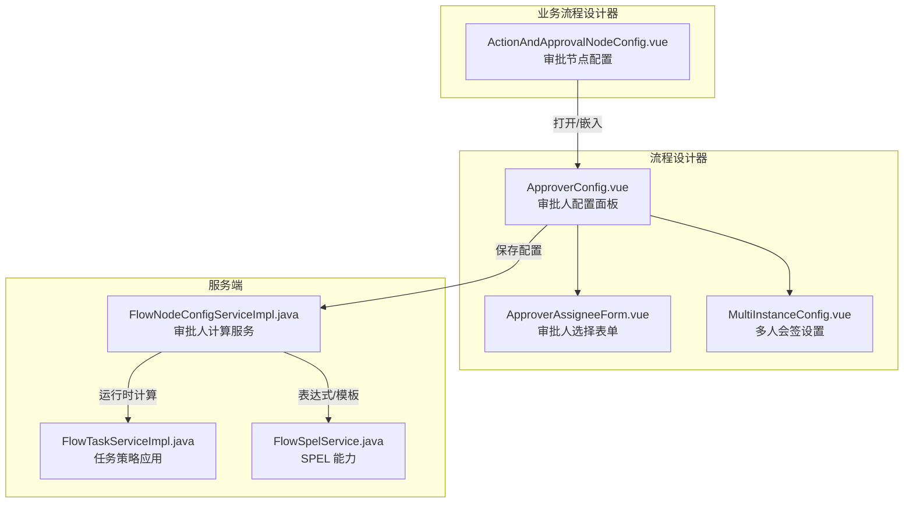
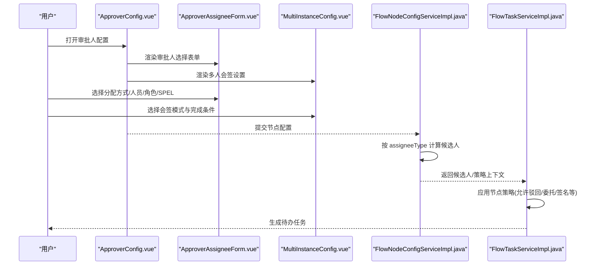
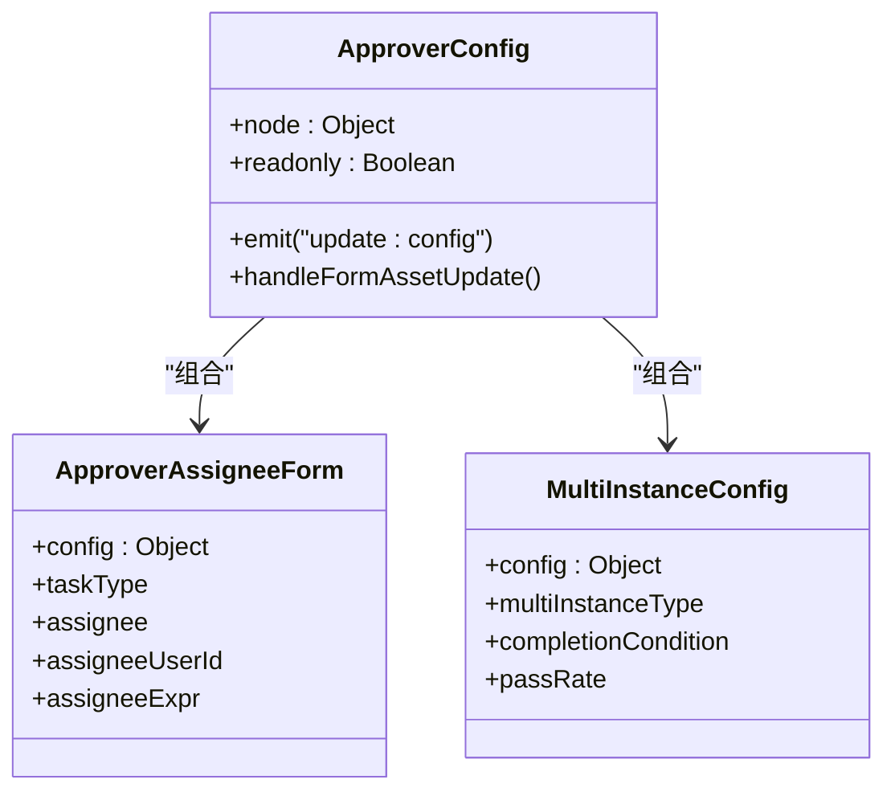
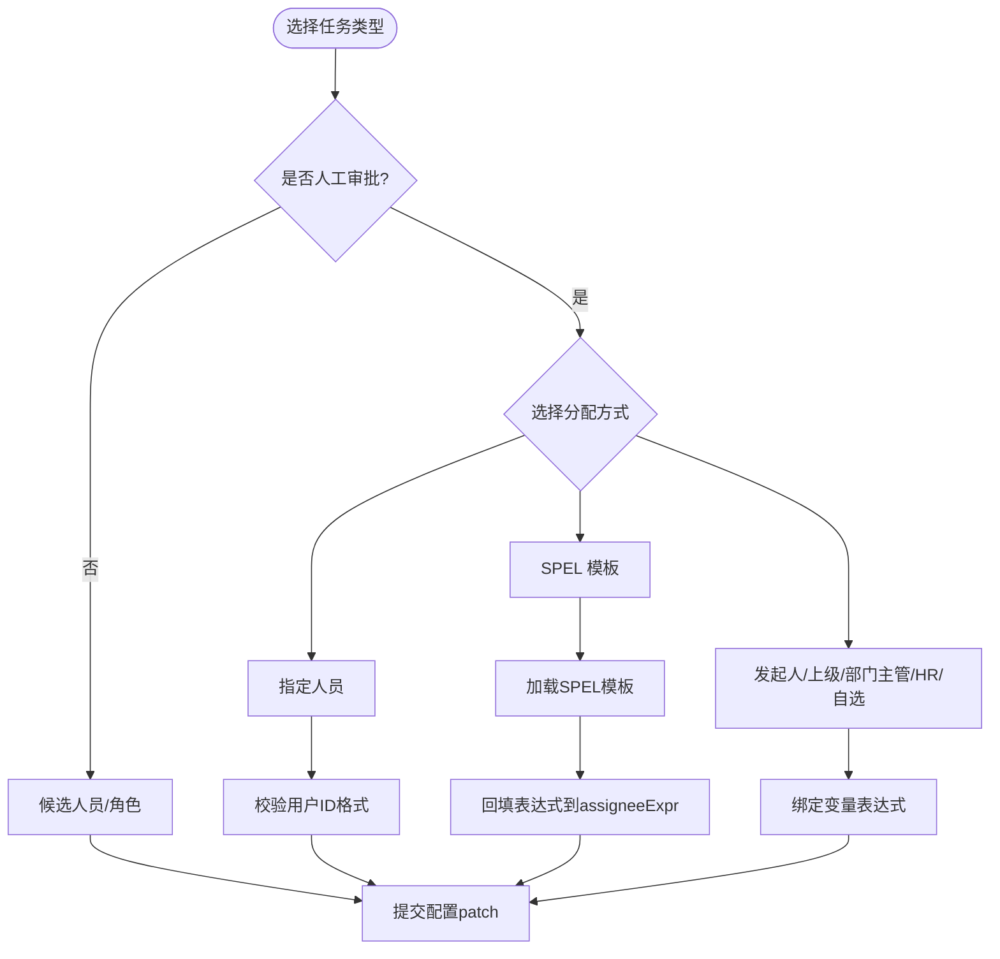
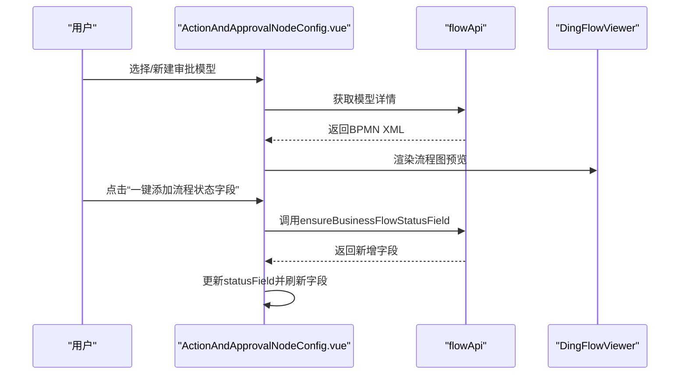
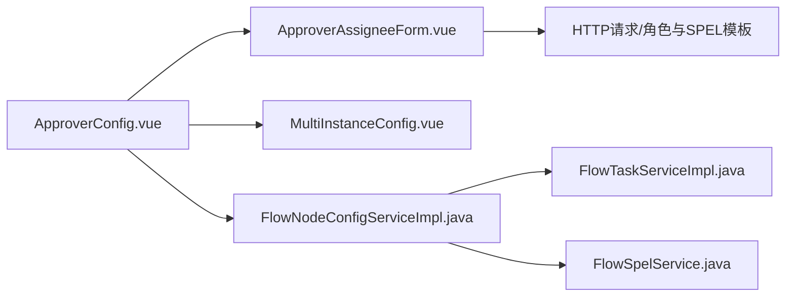

# 审批人配置面板

<cite>
**本文引用的文件**
- [ActionAndApprovalNodeConfig.vue](file://forge-admin-ui/src/components/business-process-designer/ActionAndApprovalNodeConfig.vue)
- [ApproverConfig.vue](file://forge-admin-ui/src/components/flow-designer/panel/ApproverConfig.vue)
- [ApproverAssigneeForm.vue](file://forge-admin-ui/src/components/flow-designer/panel/ApproverAssigneeForm.vue)
- [MultiInstanceConfig.vue](file://forge-admin-ui/src/components/flow-designer/panel/MultiInstanceConfig.vue)
- [FlowNodeConfigServiceImpl.java](file://forge-server/forge-framework/forge-plugin-parent/forge-plugin-flow/src/main/java/com/mdframe/forge/starter/flow/service/impl/FlowNodeConfigServiceImpl.java)
- [FlowTaskServiceImpl.java](file://forge-server/forge-framework/forge-plugin-parent/forge-plugin-flow/src/main/java/com/mdframe/forge/starter/flow/service/impl/FlowTaskServiceImpl.java)
- [FlowSpelService.java](file://forge-server/forge-framework/forge-plugin-parent/forge-plugin-flow/src/main/java/com/mdframe/forge/starter/flow/service/FlowSpelService.java)
- [spel_template.sql](file://forge-server/forge-framework/forge-plugin-parent/forge-plugin-flow/src/main/resources/sql/spel_template.sql)
- [spec.md](file://code-copilot/changes/flow-yudao-gap-hardening/spec.md)
</cite>

## 目录
1. [简介](#简介)
2. [项目结构](#项目结构)
3. [核心组件](#核心组件)
4. [架构总览](#架构总览)
5. [详细组件分析](#详细组件分析)
6. [依赖关系分析](#依赖关系分析)
7. [性能与体验优化](#性能与体验优化)
8. [故障排查指南](#故障排查指南)
9. [结论](#结论)
10. [附录：自定义审批人分配策略开发指南](#附录自定义审批人分配策略开发指南)

## 简介
本技术文档聚焦“审批人配置面板”，系统性解析审批人分配策略在前端的配置界面、交互逻辑、数据绑定与权限控制，以及后端在运行时的候选人计算与执行策略。内容覆盖指定人员、角色、部门、上级等多种分配方式；多人审批模式（会签/顺序）的配置选项；验证规则、动态加载与用户体验优化；并提供扩展自定义审批人分配策略的开发指南。

## 项目结构
审批人配置由“业务流程设计器”与“流程设计器”两部分协同完成：
- 业务流程设计器中的“动作与审批节点配置”负责将业务对象与审批模型关联、任务表单绑定、标题模板与状态字段管理，并打开真实流程设计器进行审批人等细节配置。
- 流程设计器的“审批人配置面板”提供完整的审批办理、多人会签、表单权限、操作权限与扩展配置。

图表来源
- [ActionAndApprovalNodeConfig.vue:556-705](file://forge-admin-ui/src/components/business-process-designer/ActionAndApprovalNodeConfig.vue#L556-L705)
- [ApproverConfig.vue:281-376](file://forge-admin-ui/src/components/flow-designer/panel/ApproverConfig.vue#L281-L376)
- [ApproverAssigneeForm.vue:333-435](file://forge-admin-ui/src/components/flow-designer/panel/ApproverAssigneeForm.vue#L333-L435)
- [MultiInstanceConfig.vue:48-94](file://forge-admin-ui/src/components/flow-designer/panel/MultiInstanceConfig.vue#L48-L94)
- [FlowNodeConfigServiceImpl.java:300-349](file://forge-server/forge-framework/forge-plugin-parent/forge-plugin-flow/src/main/java/com/mdframe/forge/starter/flow/service/impl/FlowNodeConfigServiceImpl.java#L300-L349)
- [FlowTaskServiceImpl.java:1693-1708](file://forge-server/forge-framework/forge-plugin-parent/forge-plugin-flow/src/main/java/com/mdframe/forge/starter/flow/service/impl/FlowTaskServiceImpl.java#L1693-L1708)
- [FlowSpelService.java:355-379](file://forge-server/forge-framework/forge-plugin-parent/forge-plugin-flow/src/main/java/com/mdframe/forge/starter/flow/service/FlowSpelService.java#L355-L379)

章节来源
- [ActionAndApprovalNodeConfig.vue:556-705](file://forge-admin-ui/src/components/business-process-designer/ActionAndApprovalNodeConfig.vue#L556-L705)
- [ApproverConfig.vue:281-376](file://forge-admin-ui/src/components/flow-designer/panel/ApproverConfig.vue#L281-L376)

## 核心组件
- 审批节点配置（业务流程设计器）
  - 负责绑定审批模型、任务表单、标题模板、流程状态字段，并支持新建并进入流程设计器。
- 审批人配置面板（流程设计器）
  - 统一入口，包含“审批办理”“表单权限”“审批权限”“扩展配置”四个标签页。
- 审批人选择表单
  - 支持人工审批、候选人员、候选角色三种任务类型；在人工审批下支持发起人自选、发起人、上级领导、部门主管、HR、指定人员、SPEL 模板等分配方式。
- 多人会签设置
  - 支持不会签、并行会签、顺序会签；完成条件支持全部通过、任一通过、通过比例。

章节来源
- [ApproverConfig.vue:281-376](file://forge-admin-ui/src/components/flow-designer/panel/ApproverConfig.vue#L281-L376)
- [ApproverAssigneeForm.vue:1-504](file://forge-admin-ui/src/components/flow-designer/panel/ApproverAssigneeForm.vue#L1-L504)
- [MultiInstanceConfig.vue:1-95](file://forge-admin-ui/src/components/flow-designer/panel/MultiInstanceConfig.vue#L1-L95)

## 架构总览
前端通过 ApproverConfig 聚合多个子配置项，用户在选择审批人时，ApproverAssigneeForm 维护 taskType、assignee、assigneeUserId、assigneeExpr 等字段；多人会签通过 MultiInstanceConfig 维护 multiInstanceType、completionCondition、passRate。保存后，后端 FlowNodeConfigServiceImpl 根据 assigneeType 与参数计算候选人列表，并在任务执行阶段由 FlowTaskServiceImpl 应用节点策略（如允许驳回、委托、终止、签名、备注等）。

图表来源
- [ApproverConfig.vue:281-376](file://forge-admin-ui/src/components/flow-designer/panel/ApproverConfig.vue#L281-L376)
- [ApproverAssigneeForm.vue:333-435](file://forge-admin-ui/src/components/flow-designer/panel/ApproverAssigneeForm.vue#L333-L435)
- [MultiInstanceConfig.vue:48-94](file://forge-admin-ui/src/components/flow-designer/panel/MultiInstanceConfig.vue#L48-L94)
- [FlowNodeConfigServiceImpl.java:300-349](file://forge-server/forge-framework/forge-plugin-parent/forge-plugin-flow/src/main/java/com/mdframe/forge/starter/flow/service/impl/FlowNodeConfigServiceImpl.java#L300-L349)
- [FlowTaskServiceImpl.java:1693-1708](file://forge-server/forge-framework/forge-plugin-parent/forge-plugin-flow/src/main/java/com/mdframe/forge/starter/flow/service/impl/FlowTaskServiceImpl.java#L1693-L1708)

## 详细组件分析

### 审批人配置面板（ApproverConfig）
- 职责
  - 以标签页组织“审批办理”“表单权限”“审批权限”“扩展配置”。
  - 在“审批办理”中集成 ApproverAssigneeForm 与 MultiInstanceConfig，以及 ApprovalDutyConfig。
  - 在“表单权限”中处理节点表单资产与字段权限，支持外置表单字段目录动态加载。
- 数据流
  - 通过 computed 读取 node.config，并以 emit('update:config') 向上层提交增量变更。
  - 表单资产切换时，自动构建 formFieldPermissions，并兼容外部表单的字段目录。
- 关键点
  - 表单模式归一化：BUSINESS_OBJECT_FORM / BUSINESS_CODE_FORM / EXTERNAL。
  - 外置表单字段目录失败时给出明确提示，避免误用未登记字段。

图表来源
- [ApproverConfig.vue:281-376](file://forge-admin-ui/src/components/flow-designer/panel/ApproverConfig.vue#L281-L376)
- [ApproverAssigneeForm.vue:1-504](file://forge-admin-ui/src/components/flow-designer/panel/ApproverAssigneeForm.vue#L1-L504)
- [MultiInstanceConfig.vue:1-95](file://forge-admin-ui/src/components/flow-designer/panel/MultiInstanceConfig.vue#L1-L95)

章节来源
- [ApproverConfig.vue:281-376](file://forge-admin-ui/src/components/flow-designer/panel/ApproverConfig.vue#L281-L376)

### 审批人选择表单（ApproverAssigneeForm）
- 任务类型
  - 人工审批：可配置具体审批人或候选集合；支持发起人自选、发起人、上级领导、部门主管、HR、指定人员、SPEL 模板。
  - 候选人员：多选用户，同时维护用户 ID 与显示名称数组。
  - 候选角色：多选角色，支持远程搜索与本地缓存。
- 交互与数据绑定
  - 使用 computed 双向绑定 config 中的字段，确保只发增量 patch。
  - 切换为“指定人员”时，若存在历史表达式 user_xxx，自动迁移到 assigneeUserId。
  - 切换为“SPEL 模板”时，按需加载模板列表，并将模板 expression 回填至 assigneeExpr。
- 动态加载
  - 角色列表：懒加载，首次聚焦或切换到候选角色时请求后端分页接口。
  - SPEL 模板：首次聚焦或切换到 SPEL 时请求模板列表。
- 校验与容错
  - 对 userId 做格式校验，仅保留纯数字 ID。
  - 空值与去重处理，保证 candidateUsers/candidateGroups 等数组稳定。

图表来源
- [ApproverAssigneeForm.vue:113-163](file://forge-admin-ui/src/components/flow-designer/panel/ApproverAssigneeForm.vue#L113-L163)
- [ApproverAssigneeForm.vue:209-257](file://forge-admin-ui/src/components/flow-designer/panel/ApproverAssigneeForm.vue#L209-L257)
- [ApproverAssigneeForm.vue:314-322](file://forge-admin-ui/src/components/flow-designer/panel/ApproverAssigneeForm.vue#L314-L322)

章节来源
- [ApproverAssigneeForm.vue:1-504](file://forge-admin-ui/src/components/flow-designer/panel/ApproverAssigneeForm.vue#L1-L504)

### 多人会签设置（MultiInstanceConfig）
- 配置项
  - 审批方式：不会签、并行会签、顺序会签。
  - 完成条件：全部通过、任一通过、通过比例。
  - 通过比例：当选择“通过比例”时，输入 1-100 的百分比。
- 行为
  - 非会签模式不显示完成条件与比例输入。
  - 所有变更通过 useField 封装的 computed 直接 emit 增量更新。

章节来源
- [MultiInstanceConfig.vue:1-95](file://forge-admin-ui/src/components/flow-designer/panel/MultiInstanceConfig.vue#L1-L95)

### 业务流程审批节点配置（ActionAndApprovalNodeConfig）
- 职责
  - 将业务对象与审批模型绑定，管理任务表单、标题模板、流程状态字段。
  - 支持新建审批模型并直接进入流程设计器进行审批人等细节配置。
- 关键流程
  - 选择/新建审批模型后，拉取模型详情用于预览 BPMN XML。
  - 一键添加流程状态字段，成功后刷新字段列表并回写 statusField。
  - 默认绑定当前对象的表单作为任务表单，保障审批待办可直接打开表单。

图表来源
- [ActionAndApprovalNodeConfig.vue:95-110](file://forge-admin-ui/src/components/business-process-designer/ActionAndApprovalNodeConfig.vue#L95-L110)
- [ActionAndApprovalNodeConfig.vue:305-327](file://forge-admin-ui/src/components/business-process-designer/ActionAndApprovalNodeConfig.vue#L305-L327)
- [ActionAndApprovalNodeConfig.vue:556-705](file://forge-admin-ui/src/components/business-process-designer/ActionAndApprovalNodeConfig.vue#L556-L705)

章节来源
- [ActionAndApprovalNodeConfig.vue:1-800](file://forge-admin-ui/src/components/business-process-designer/ActionAndApprovalNodeConfig.vue#L1-L800)

## 依赖关系分析
- 前端组件耦合
  - ApproverConfig 组合 ApproverAssigneeForm 与 MultiInstanceConfig，并通过统一的 update:config 事件向上传递变更，降低耦合度。
  - ApproverAssigneeForm 依赖 UserSelectPicker 与 HTTP 请求工具，角色与 SPEL 模板采用懒加载，减少首屏压力。
- 前后端契约
  - 前端保存的 taskType、assignee、assigneeUserId、assigneeExpr、multiInstanceType、completionCondition、passRate 等字段在后端被识别并用于候选人计算与任务策略应用。
  - 后端 FlowNodeConfigServiceImpl 根据 assigneeType 分支计算候选人；FlowTaskServiceImpl 将节点配置映射为运行时策略（允许驳回、委托、签名、备注等）。

图表来源
- [ApproverConfig.vue:281-376](file://forge-admin-ui/src/components/flow-designer/panel/ApproverConfig.vue#L281-L376)
- [ApproverAssigneeForm.vue:209-257](file://forge-admin-ui/src/components/flow-designer/panel/ApproverAssigneeForm.vue#L209-L257)
- [FlowNodeConfigServiceImpl.java:300-349](file://forge-server/forge-framework/forge-plugin-parent/forge-plugin-flow/src/main/java/com/mdframe/forge/starter/flow/service/impl/FlowNodeConfigServiceImpl.java#L300-L349)
- [FlowTaskServiceImpl.java:1693-1708](file://forge-server/forge-framework/forge-plugin-parent/forge-plugin-flow/src/main/java/com/mdframe/forge/starter/flow/service/impl/FlowTaskServiceImpl.java#L1693-L1708)
- [FlowSpelService.java:355-379](file://forge-server/forge-framework/forge-plugin-parent/forge-plugin-flow/src/main/java/com/mdframe/forge/starter/flow/service/FlowSpelService.java#L355-L379)

章节来源
- [ApproverConfig.vue:281-376](file://forge-admin-ui/src/components/flow-designer/panel/ApproverConfig.vue#L281-L376)
- [FlowNodeConfigServiceImpl.java:300-349](file://forge-server/forge-framework/forge-plugin-parent/forge-plugin-flow/src/main/java/com/mdframe/forge/starter/flow/service/impl/FlowNodeConfigServiceImpl.java#L300-L349)

## 性能与体验优化
- 懒加载与缓存
  - 角色列表与 SPEL 模板仅在需要时加载，避免不必要的网络请求。
  - 已加载数据使用本地状态缓存，重复访问不再请求。
- 表单联动与默认值
  - 审批节点配置中自动建议并绑定流程状态字段与任务表单，减少配置成本。
  - 标题模板默认基于业务对象字段生成，开箱即用。
- 错误提示与可恢复性
  - 外置表单字段目录加载失败时给出明确提示，避免误配。
  - 一键添加流程状态字段失败时提示错误原因，保护已有配置不被覆盖。
- 并发与稳定性
  - 创建审批模型时增加防抖与 loading 状态，防止重复提交。
  - 预览流程图时异步加载并处理异常，保证页面可用性。

[本节为通用指导，不直接分析具体文件]

## 故障排查指南
- 无法计算审批人
  - 检查前端是否正确设置 taskType 与对应参数（assigneeUserId、candidateUsers、candidateGroups、assigneeExpr）。
  - 查看后端日志中“审批人计算”相关输出，确认 assigneeType 分支是否命中。
- 表达式计算失败
  - 确认 assigneeExpr 是否为空或语法正确。
  - 检查 FlowSpelService 提供的函数与变量是否可用。
- 节点策略未生效
  - 确认 FlowTaskServiceImpl.applyNodeConfigPolicy 是否将 allowReject、allowDelegate、requireSignature、requireComment 等字段写入策略。
- 表单权限异常
  - 外置表单未登记字段目录时会报错，需在表单组件中配置 flowFieldCatalog。
  - 切换表单资产后，确认 formFieldPermissions 是否被正确重建。

章节来源
- [FlowNodeConfigServiceImpl.java:300-349](file://forge-server/forge-framework/forge-plugin-parent/forge-plugin-flow/src/main/java/com/mdframe/forge/starter/flow/service/impl/FlowNodeConfigServiceImpl.java#L300-L349)
- [FlowTaskServiceImpl.java:1693-1708](file://forge-server/forge-framework/forge-plugin-parent/forge-plugin-flow/src/main/java/com/mdframe/forge/starter/flow/service/impl/FlowTaskServiceImpl.java#L1693-L1708)
- [ApproverConfig.vue:112-129](file://forge-admin-ui/src/components/flow-designer/panel/ApproverConfig.vue#L112-L129)

## 结论
审批人配置面板通过清晰的前端分层与稳健的后端计算服务，实现了灵活的审批人分配策略与多人会签模式。前端注重交互体验与数据一致性，后端提供可扩展的策略计算与任务策略应用。结合模板化 SPEL 与严格的发布前校验，系统在保证灵活性的同时提升了安全性与可维护性。

[本节为总结，不直接分析具体文件]

## 附录：自定义审批人分配策略开发指南
- 目标
  - 在不侵入现有代码的前提下，扩展新的审批人分配策略类型（例如从表单字段、外部系统或复杂业务规则计算审批人）。
- 前端扩展
  - 在 ApproverAssigneeForm 中新增一种分配方式，并维护对应的配置字段（如 formFieldCode、externalSystemId 等）。
  - 如需动态加载选项，复用现有的懒加载模式（角色/SPEL 模板），保持一致的交互体验。
- 后端扩展
  - 在 FlowNodeConfigServiceImpl 的 switch(assigneeType) 中新增分支，实现 getUserIdsByXxx 等方法，必要时集成组织架构或外部系统。
  - 若涉及表达式，可在 FlowSpelService 中注册新函数，或在 spel_template.sql 中预置受控模板。
- 发布前校验
  - 遵循 spec 中要求：部署前必须校验候选人策略可识别且参数完整；未知策略或 SPI 冲突必须在发布阶段失败，不允许静默退化为空候选人。
- 示例参考
  - 内置策略包括 custom、role、dept、post、initiator、leader、deptManager、expr 等。
  - SPEL 模板支持条件选择与合并多个审批人列表，便于复杂场景。

章节来源
- [spec.md:100-126](file://code-copilot/changes/flow-yudao-gap-hardening/spec.md#L100-L126)
- [FlowNodeConfigServiceImpl.java:300-349](file://forge-server/forge-framework/forge-plugin-parent/forge-plugin-flow/src/main/java/com/mdframe/forge/starter/flow/service/impl/FlowNodeConfigServiceImpl.java#L300-L349)
- [FlowSpelService.java:355-379](file://forge-server/forge-framework/forge-plugin-parent/forge-plugin-flow/src/main/java/com/mdframe/forge/starter/flow/service/FlowSpelService.java#L355-L379)
- [spel_template.sql:41-44](file://forge-server/forge-framework/forge-plugin-parent/forge-plugin-flow/src/main/resources/sql/spel_template.sql#L41-L44)