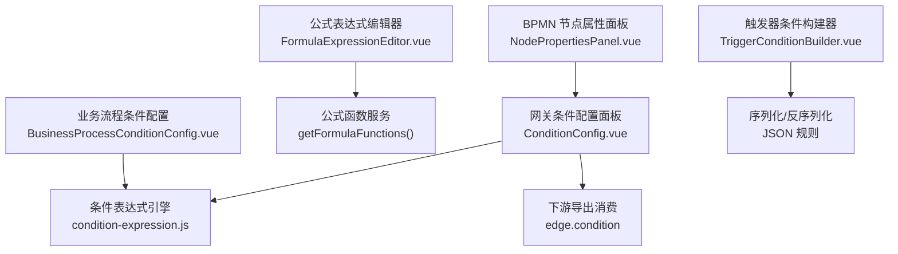
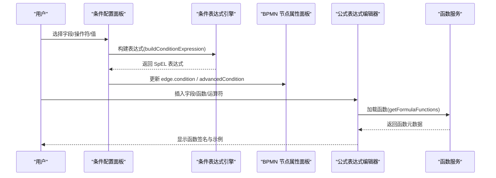
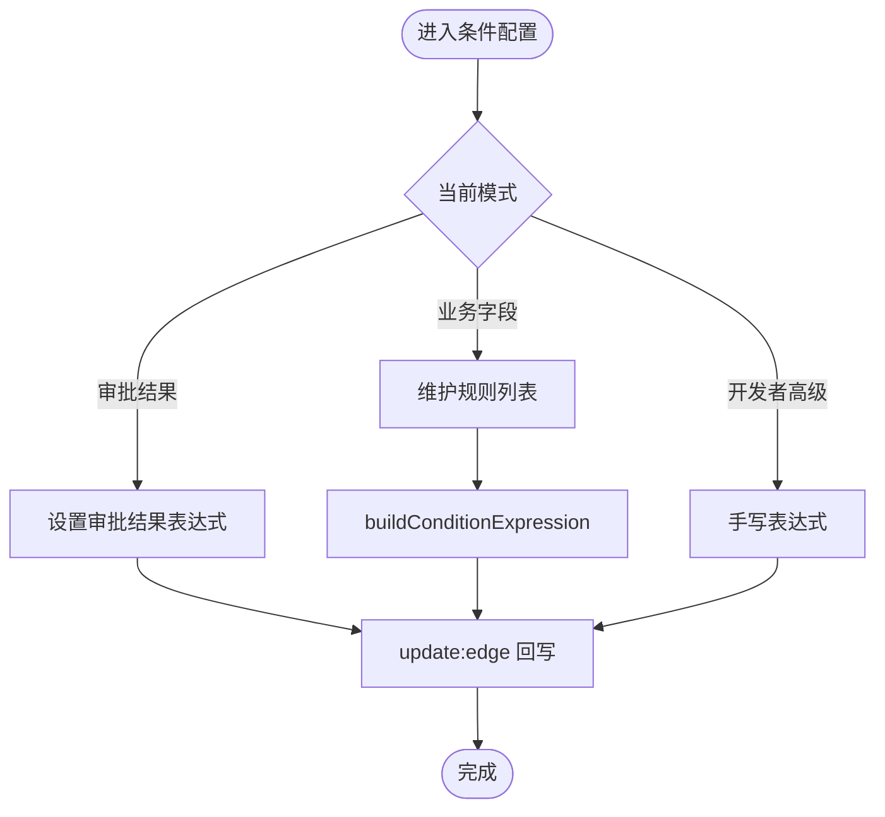
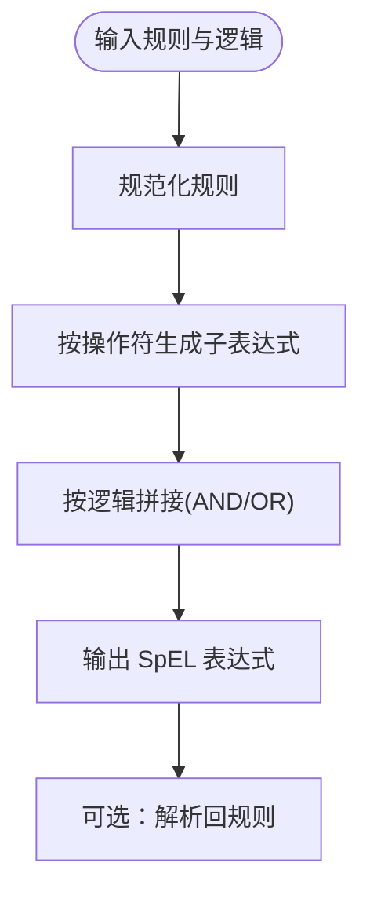
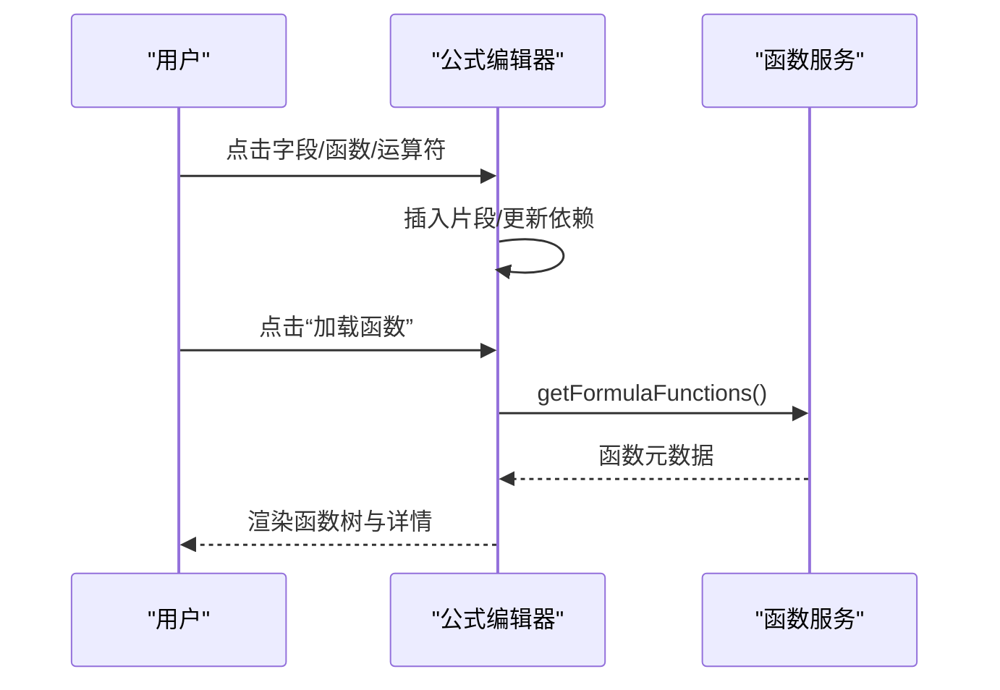
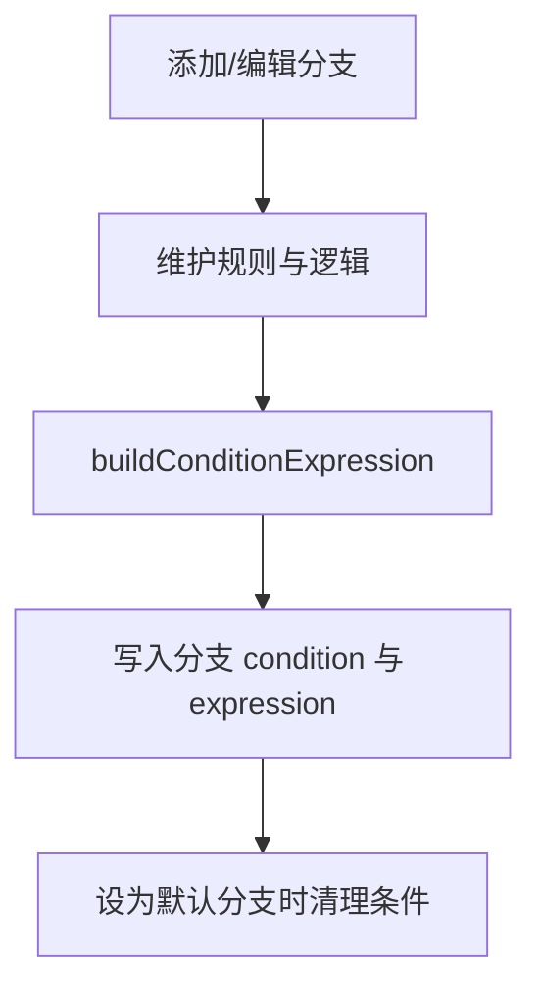
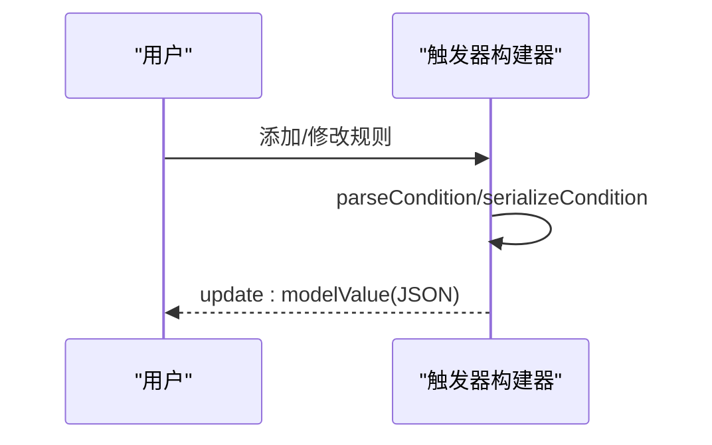
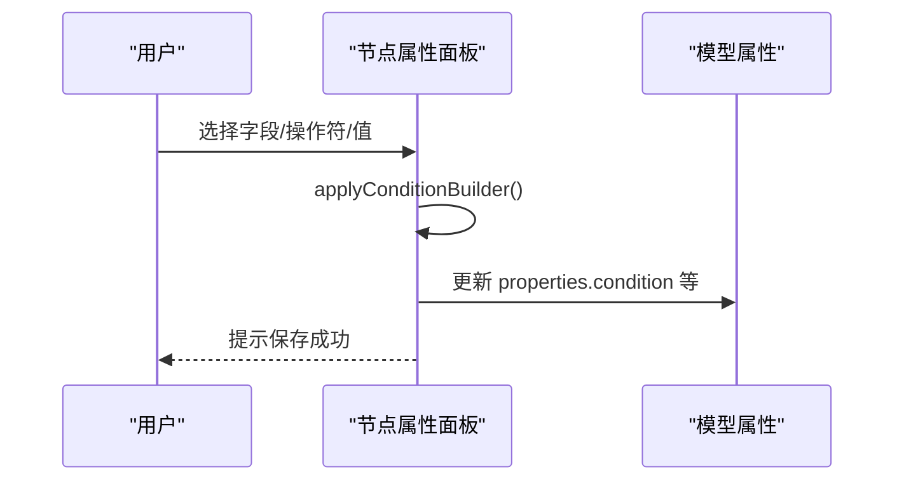
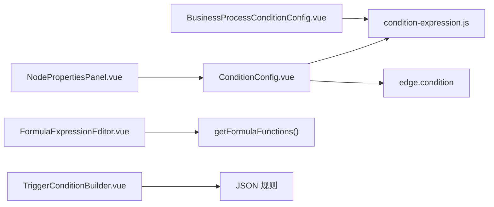

# 条件配置面板

<cite>
**本文引用的文件**
- [ConditionConfig.vue](file://forge-admin-ui/src/components/flow-designer/panel/ConditionConfig.vue)
- [condition-expression.js](file://forge-admin-ui/src/components/flow-designer/panel/condition-expression.js)
- [FormulaExpressionEditor.vue](file://forge-admin-ui/src/views/app-center/components/designer/formula/FormulaExpressionEditor.vue)
- [BusinessProcessConditionConfig.vue](file://forge-admin-ui/src/components/business-process-designer/BusinessProcessConditionConfig.vue)
- [TriggerConditionBuilder.vue](file://forge-admin-ui/src/views/app-center/components/TriggerConditionBuilder.vue)
- [NodePropertiesPanel.vue](file://forge-admin-ui/src/components/bpmn/NodePropertiesPanel.vue)
</cite>

## 目录
1. [简介](#简介)
2. [项目结构](#项目结构)
3. [核心组件](#核心组件)
4. [架构总览](#架构总览)
5. [详细组件分析](#详细组件分析)
6. [依赖关系分析](#依赖关系分析)
7. [性能考虑](#性能考虑)
8. [故障排查指南](#故障排查指南)
9. [结论](#结论)
10. [附录](#附录)

## 简介
本技术文档聚焦“条件配置面板”，系统性解析流程分支条件的可视化配置实现，覆盖表达式编辑器、条件构建器与实时预览。重点说明：
- 条件表达式的语法支持（SpEL 风格）、变量引用与函数调用机制
- 复杂条件组合、条件优先级与冲突检测处理逻辑
- 条件验证、错误提示与调试工具使用
- 自定义条件函数的扩展方案与性能优化建议

## 项目结构
条件配置能力由多个前端组件与共享逻辑模块协作完成：
- 网关条件配置面板：提供“审批结果/业务字段/开发者高级”三种编辑模式，并生成标准 SpEL 表达式
- 公式表达式编辑器：提供字段浏览、函数浏览、运算符快捷插入、依赖追踪与格式化
- 业务流程条件配置：面向业务对象的条件分支管理，统一生成表达式
- 触发器条件构建器：轻量级规则构建，用于事件触发场景
- BPMN 节点属性面板：将可视化选择转换为 SpEL 表达式并写入模型属性

图表来源
- [NodePropertiesPanel.vue:2267-2284](file://forge-admin-ui/src/components/bpmn/NodePropertiesPanel.vue#L2267-L2284)
- [ConditionConfig.vue:1-335](file://forge-admin-ui/src/components/flow-designer/panel/ConditionConfig.vue#L1-L335)
- [condition-expression.js:56-84](file://forge-admin-ui/src/components/flow-designer/panel/condition-expression.js#L56-L84)
- [FormulaExpressionEditor.vue:506-523](file://forge-admin-ui/src/views/app-center/components/designer/formula/FormulaExpressionEditor.vue#L506-L523)
- [BusinessProcessConditionConfig.vue:114-125](file://forge-admin-ui/src/components/business-process-designer/BusinessProcessConditionConfig.vue#L114-L125)
- [TriggerConditionBuilder.vue:105-144](file://forge-admin-ui/src/views/app-center/components/TriggerConditionBuilder.vue#L105-L144)

章节来源
- [ConditionConfig.vue:1-335](file://forge-admin-ui/src/components/flow-designer/panel/ConditionConfig.vue#L1-L335)
- [condition-expression.js:1-320](file://forge-admin-ui/src/components/flow-designer/panel/condition-expression.js#L1-L320)
- [FormulaExpressionEditor.vue:1-800](file://forge-admin-ui/src/views/app-center/components/designer/formula/FormulaExpressionEditor.vue#L1-L800)
- [BusinessProcessConditionConfig.vue:1-205](file://forge-admin-ui/src/components/business-process-designer/BusinessProcessConditionConfig.vue#L1-L205)
- [TriggerConditionBuilder.vue:1-219](file://forge-admin-ui/src/views/app-center/components/TriggerConditionBuilder.vue#L1-L219)
- [NodePropertiesPanel.vue:2267-2284](file://forge-admin-ui/src/components/bpmn/NodePropertiesPanel.vue#L2267-L2284)

## 核心组件
- 网关条件配置面板（ConditionConfig.vue）
  - 三种编辑模式：审批结果、业务字段、开发者高级
  - 实时生成 SpEL 表达式，并在 UI 底部展示
  - 支持默认分支标记与切换
- 条件表达式引擎（condition-expression.js）
  - 规范化数据类型、操作符别名
  - 构建与解析 SpEL 表达式（支持 AND/OR、区间、包含/不包含、空值判断）
  - 安全转义字符串值，避免注入风险
- 公式表达式编辑器（FormulaExpressionEditor.vue）
  - 字段分组浏览、函数分组浏览、运算符快捷插入
  - 依赖字段自动收集与移除
  - 表达式格式化与清空
- 业务流程条件配置（BusinessProcessConditionConfig.vue）
  - 多分支卡片式编辑，支持设置默认分支
  - 统一生成表达式并回写分支数据
- 触发器条件构建器（TriggerConditionBuilder.vue）
  - 轻量规则列表，支持 AND/OR 逻辑
  - 序列化为 JSON 规则或保留额外字段
- BPMN 节点属性面板（NodePropertiesPanel.vue）
  - 将可视化选择转换为 SpEL 表达式并更新模型属性

章节来源
- [ConditionConfig.vue:1-335](file://forge-admin-ui/src/components/flow-designer/panel/ConditionConfig.vue#L1-L335)
- [condition-expression.js:1-320](file://forge-admin-ui/src/components/flow-designer/panel/condition-expression.js#L1-L320)
- [FormulaExpressionEditor.vue:1-800](file://forge-admin-ui/src/views/app-center/components/designer/formula/FormulaExpressionEditor.vue#L1-L800)
- [BusinessProcessConditionConfig.vue:1-205](file://forge-admin-ui/src/components/business-process-designer/BusinessProcessConditionConfig.vue#L1-L205)
- [TriggerConditionBuilder.vue:1-219](file://forge-admin-ui/src/views/app-center/components/TriggerConditionBuilder.vue#L1-L219)
- [NodePropertiesPanel.vue:2267-2284](file://forge-admin-ui/src/components/bpmn/NodePropertiesPanel.vue#L2267-L2284)

## 架构总览
条件配置面板的交互与数据流如下：
- 用户在可视化界面中选择字段、操作符与值，或手写表达式
- 条件引擎将规则序列化为 SpEL 表达式，供 BPMN 导出消费
- 公式编辑器提供函数与字段辅助，增强表达式构建体验
- 触发器条件以 JSON 规则形式持久化，便于后续评估

图表来源
- [ConditionConfig.vue:142-176](file://forge-admin-ui/src/components/flow-designer/panel/ConditionConfig.vue#L142-L176)
- [condition-expression.js:56-84](file://forge-admin-ui/src/components/flow-designer/panel/condition-expression.js#L56-L84)
- [NodePropertiesPanel.vue:2267-2284](file://forge-admin-ui/src/components/bpmn/NodePropertiesPanel.vue#L2267-L2284)
- [FormulaExpressionEditor.vue:506-523](file://forge-admin-ui/src/views/app-center/components/designer/formula/FormulaExpressionEditor.vue#L506-L523)

## 详细组件分析

### 网关条件配置面板（ConditionConfig.vue）
- 功能要点
  - 三种模式切换：审批结果、业务字段、开发者高级
  - 规则行增删改，支持区间与空值操作符
  - 实时表达式预览，底部显示生成的 SpEL
  - 默认分支标记与切换
- 关键流程
  - updateMode：根据模式同步 condition、advancedCondition、rulesCondition
  - emitRulesPatch：规范化规则后构建表达式并回写
  - buildExpression：委托条件引擎生成最终表达式

图表来源
- [ConditionConfig.vue:151-176](file://forge-admin-ui/src/components/flow-designer/panel/ConditionConfig.vue#L151-L176)
- [ConditionConfig.vue:301-319](file://forge-admin-ui/src/components/flow-designer/panel/ConditionConfig.vue#L301-L319)

章节来源
- [ConditionConfig.vue:1-335](file://forge-admin-ui/src/components/flow-designer/panel/ConditionConfig.vue#L1-L335)

### 条件表达式引擎（condition-expression.js）
- 能力概览
  - 数据类型归一化：number、boolean、datetime、enum、string
  - 操作符别名归一化：neq→ne、gte→ge、notContains 等
  - 表达式构建：支持 AND/OR、between、contains/notContains、empty/notEmpty
  - 表达式解析：从 SpEL 反向解析为规则，便于二次编辑
  - 值格式化：数字、布尔、字符串转义，防止注入
- 复杂度与性能
  - 构建/解析均为线性扫描，适合中等规模规则集
  - splitTopLevel 通过括号深度与引号状态保证分割正确性

图表来源
- [condition-expression.js:56-84](file://forge-admin-ui/src/components/flow-designer/panel/condition-expression.js#L56-L84)
- [condition-expression.js:86-133](file://forge-admin-ui/src/components/flow-designer/panel/condition-expression.js#L86-L133)
- [condition-expression.js:161-194](file://forge-admin-ui/src/components/flow-designer/panel/condition-expression.js#L161-L194)

章节来源
- [condition-expression.js:1-320](file://forge-admin-ui/src/components/flow-designer/panel/condition-expression.js#L1-L320)

### 公式表达式编辑器（FormulaExpressionEditor.vue）
- 功能要点
  - 字段分组浏览与搜索，点击插入字段并自动记录依赖
  - 函数分组浏览与搜索，点击插入函数片段并定位光标
  - 运算符与常量快捷插入，表达式格式化与清空
  - 依赖字段条带展示，支持移除依赖
- 函数加载
  - 通过 getFormulaFunctions 获取函数元数据，动态渲染签名与示例

图表来源
- [FormulaExpressionEditor.vue:384-411](file://forge-admin-ui/src/views/app-center/components/designer/formula/FormulaExpressionEditor.vue#L384-L411)
- [FormulaExpressionEditor.vue:506-523](file://forge-admin-ui/src/views/app-center/components/designer/formula/FormulaExpressionEditor.vue#L506-L523)

章节来源
- [FormulaExpressionEditor.vue:1-800](file://forge-admin-ui/src/views/app-center/components/designer/formula/FormulaExpressionEditor.vue#L1-L800)

### 业务流程条件配置（BusinessProcessConditionConfig.vue）
- 功能要点
  - 多分支卡片编辑，支持命名、设为默认、删除分支
  - 每条分支可配置“满足方式”（全部/任一）与多条规则
  - 统一生成表达式并回写至分支数据
- 默认分支策略
  - 设置某分支为默认时，清除其条件并标注“其他情况”
  - 删除默认分支时，将最后一条分支设为默认

图表来源
- [BusinessProcessConditionConfig.vue:114-125](file://forge-admin-ui/src/components/business-process-designer/BusinessProcessConditionConfig.vue#L114-L125)
- [BusinessProcessConditionConfig.vue:147-173](file://forge-admin-ui/src/components/business-process-designer/BusinessProcessConditionConfig.vue#L147-L173)

章节来源
- [BusinessProcessConditionConfig.vue:1-205](file://forge-admin-ui/src/components/business-process-designer/BusinessProcessConditionConfig.vue#L1-L205)

### 触发器条件构建器（TriggerConditionBuilder.vue）
- 功能要点
  - 轻量规则列表，支持 AND/OR
  - 序列化为 JSON 规则，兼容历史单条规则格式
  - 支持“发生变化/变更为”等特殊操作符
- 数据流转
  - 监听 modelValue 变化，解析并合并 extras
  - 每次修改触发 update:modelValue 回写

图表来源
- [TriggerConditionBuilder.vue:105-144](file://forge-admin-ui/src/views/app-center/components/TriggerConditionBuilder.vue#L105-L144)
- [TriggerConditionBuilder.vue:83-103](file://forge-admin-ui/src/views/app-center/components/TriggerConditionBuilder.vue#L83-L103)

章节来源
- [TriggerConditionBuilder.vue:1-219](file://forge-admin-ui/src/views/app-center/components/TriggerConditionBuilder.vue#L1-L219)

### BPMN 节点属性面板（NodePropertiesPanel.vue）
- 功能要点
  - 将可视化选择（字段+操作符+值）转换为 SpEL 表达式
  - 更新 hasCondition、conditionType、conditionPreset 与 condition
  - 支持 contains 特殊处理（调用 .contains(...)）
- 与条件面板协同
  - 条件面板生成表达式；节点属性面板负责将选择结果写入模型属性

图表来源
- [NodePropertiesPanel.vue:2267-2284](file://forge-admin-ui/src/components/bpmn/NodePropertiesPanel.vue#L2267-L2284)

章节来源
- [NodePropertiesPanel.vue:2267-2284](file://forge-admin-ui/src/components/bpmn/NodePropertiesPanel.vue#L2267-L2284)

## 依赖关系分析
- 组件耦合
  - ConditionConfig.vue 强依赖 condition-expression.js 进行表达式构建与解析
  - BusinessProcessConditionConfig.vue 同样依赖该引擎，保持跨场景一致性
  - FormulaExpressionEditor.vue 通过 API 获取函数元数据，不直接耦合业务逻辑
  - TriggerConditionBuilder.vue 独立于引擎，采用 JSON 规则存储
  - NodePropertiesPanel.vue 作为入口之一，将选择结果转为表达式并写入模型
- 外部依赖
  - 公式函数服务：getFormulaFunctions()
  - BPMN 导出消费：edge.condition（仅消费标准表达式字符串）

图表来源
- [ConditionConfig.vue:1-335](file://forge-admin-ui/src/components/flow-designer/panel/ConditionConfig.vue#L1-L335)
- [condition-expression.js:1-320](file://forge-admin-ui/src/components/flow-designer/panel/condition-expression.js#L1-L320)
- [FormulaExpressionEditor.vue:506-523](file://forge-admin-ui/src/views/app-center/components/designer/formula/FormulaExpressionEditor.vue#L506-L523)
- [TriggerConditionBuilder.vue:105-144](file://forge-admin-ui/src/views/app-center/components/TriggerConditionBuilder.vue#L105-L144)
- [NodePropertiesPanel.vue:2267-2284](file://forge-admin-ui/src/components/bpmn/NodePropertiesPanel.vue#L2267-L2284)

章节来源
- [ConditionConfig.vue:1-335](file://forge-admin-ui/src/components/flow-designer/panel/ConditionConfig.vue#L1-L335)
- [condition-expression.js:1-320](file://forge-admin-ui/src/components/flow-designer/panel/condition-expression.js#L1-L320)
- [FormulaExpressionEditor.vue:1-800](file://forge-admin-ui/src/views/app-center/components/designer/formula/FormulaExpressionEditor.vue#L1-L800)
- [TriggerConditionBuilder.vue:1-219](file://forge-admin-ui/src/views/app-center/components/TriggerConditionBuilder.vue#L1-L219)
- [NodePropertiesPanel.vue:2267-2284](file://forge-admin-ui/src/components/bpmn/NodePropertiesPanel.vue#L2267-L2284)

## 性能考虑
- 表达式构建与解析
  - 规则数量适中时，线性遍历开销可控；建议限制单分支规则数（如 20 条以内）
  - 使用 Map 缓存字段元信息，避免重复计算
- 函数加载
  - 函数列表按需加载，首次加载后可缓存，减少网络请求
- 表单字段去重
  - 在构建字段选项时使用 Set 去重，降低渲染压力
- 默认分支与条件冲突
  - 默认分支不参与条件判断，避免冗余计算
  - 对“全部/任一”逻辑进行显式标识，便于运行时短路求值

[本节为通用性能建议，无需特定文件来源]

## 故障排查指南
- 常见问题与定位
  - 未选择字段即应用条件：会提示“请选择条件字段”
    - 参考路径：[NodePropertiesPanel.vue:2267-2271](file://forge-admin-ui/src/components/bpmn/NodePropertiesPanel.vue#L2267-L2271)
  - 无可用字段时无法启用“业务字段”模式：需先设计或选择动态表单
    - 参考路径：[ConditionConfig.vue:560-562](file://forge-admin-ui/src/components/flow-designer/panel/ConditionConfig.vue#L560-L562)
  - 表达式解析失败：当解析出的规则数与拆分部分不一致时，视为无效
    - 参考路径：[condition-expression.js:74-84](file://forge-admin-ui/src/components/flow-designer/panel/condition-expression.js#L74-L84)
  - 函数加载失败：显示错误信息，允许重试
    - 参考路径：[FormulaExpressionEditor.vue:506-523](file://forge-admin-ui/src/views/app-center/components/designer/formula/FormulaExpressionEditor.vue#L506-L523)
- 调试建议
  - 在条件面板底部查看生成的表达式，确认是否符合预期
  - 使用“开发者高级”模式临时手写表达式进行对比验证
  - 检查字段元数据是否正确（类型、标签），确保值格式化符合预期

章节来源
- [NodePropertiesPanel.vue:2267-2284](file://forge-admin-ui/src/components/bpmn/NodePropertiesPanel.vue#L2267-L2284)
- [ConditionConfig.vue:560-562](file://forge-admin-ui/src/components/flow-designer/panel/ConditionConfig.vue#L560-L562)
- [condition-expression.js:74-84](file://forge-admin-ui/src/components/flow-designer/panel/condition-expression.js#L74-L84)
- [FormulaExpressionEditor.vue:506-523](file://forge-admin-ui/src/views/app-center/components/designer/formula/FormulaExpressionEditor.vue#L506-L523)

## 结论
条件配置面板通过“可视化规则 + 表达式引擎”的组合，既降低了业务人员配置门槛，又保留了开发者的灵活度。核心优势包括：
- 多模式编辑：审批结果、业务字段、开发者高级
- 统一表达式：基于 SpEL，便于 BPMN 导出与运行时评估
- 丰富辅助：字段与函数浏览、依赖追踪、格式化
- 可扩展：通过函数服务与规则引擎扩展自定义能力

[本节为总结性内容，无需特定文件来源]

## 附录

### 条件表达式语法与支持
- 变量引用：字段名直接作为变量（如 amount、status）
- 运算符：==、!=、>、>=、<、<=、&&、||、()
- 函数调用：通过公式编辑器插入函数片段，函数元数据来自后端服务
- 值类型：数字、布尔、字符串（自动转义）、日期时间（按字段类型）
- 特殊操作符：between、contains、notContains、empty、notEmpty

章节来源
- [condition-expression.js:86-133](file://forge-admin-ui/src/components/flow-designer/panel/condition-expression.js#L86-L133)
- [FormulaExpressionEditor.vue:384-411](file://forge-admin-ui/src/views/app-center/components/designer/formula/FormulaExpressionEditor.vue#L384-L411)

### 复杂条件组合与优先级
- 逻辑优先级：括号 > 比较/包含/空值 > && > ||
- 组合方式：通过“满足全部/满足任一”控制顶层逻辑
- 冲突检测：当解析结果与拆分部分不一致时，视为无效表达式

章节来源
- [condition-expression.js:161-194](file://forge-admin-ui/src/components/flow-designer/panel/condition-expression.js#L161-L194)
- [condition-expression.js:74-84](file://forge-admin-ui/src/components/flow-designer/panel/condition-expression.js#L74-L84)

### 自定义条件函数扩展方案
- 步骤
  - 在后端注册函数元数据（名称、分类、参数、返回类型、示例）
  - 前端通过 getFormulaFunctions 拉取并渲染函数树
  - 用户点击函数插入片段，编辑器自动定位到参数位置
- 注意事项
  - 函数应幂等且无副作用
  - 参数校验在前端进行，运行时再次校验
  - 避免重型函数在表达式中频繁调用

章节来源
- [FormulaExpressionEditor.vue:506-523](file://forge-admin-ui/src/views/app-center/components/designer/formula/FormulaExpressionEditor.vue#L506-L523)

### 性能优化建议
- 规则数量控制：单分支建议不超过 20 条
- 字段元数据缓存：使用 Map 存储，避免重复计算
- 函数列表缓存：首次加载后本地缓存，减少网络请求
- 默认分支优化：默认分支不参与条件计算，减少运行时开销

[本节为通用优化建议，无需特定文件来源]