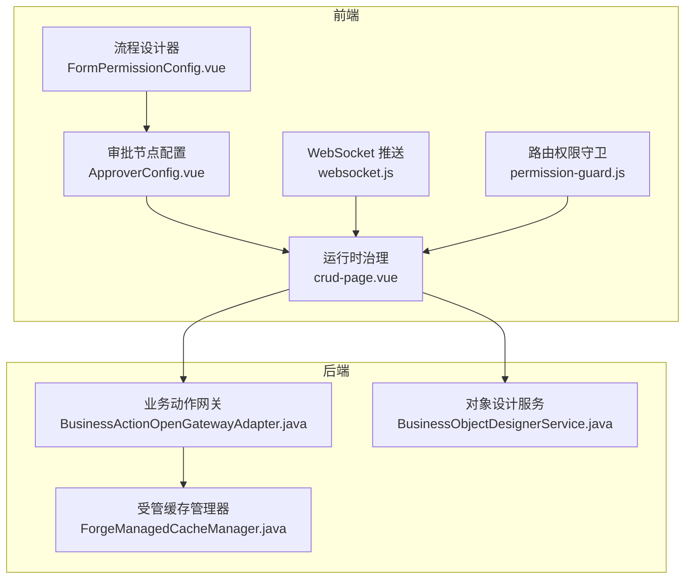
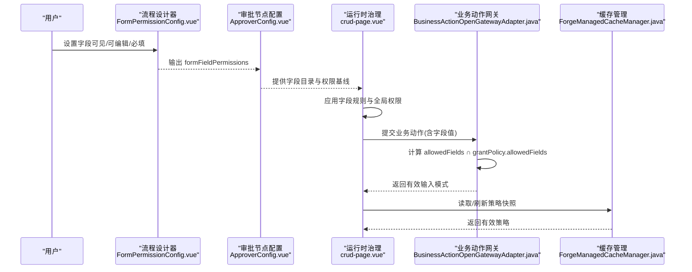
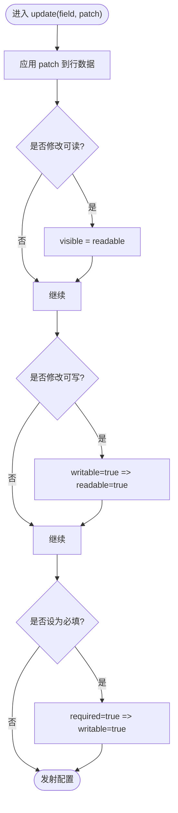
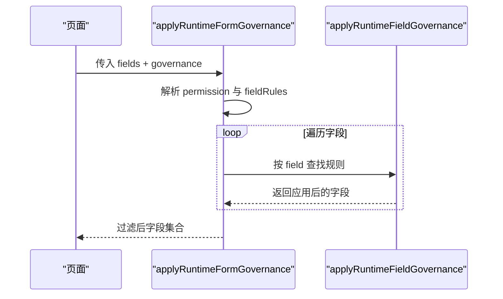
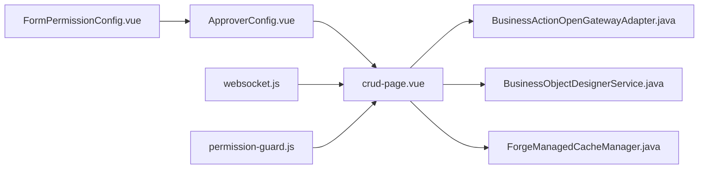

# 表单权限配置面板

<cite>
**本文引用的文件**
- [FormPermissionConfig.vue](file://forge-admin-ui/src/components/flow-designer/panel/FormPermissionConfig.vue)
- [ApproverConfig.vue](file://forge-admin-ui/src/components/flow-designer/panel/ApproverConfig.vue)
- [crud-page.vue](file://forge-admin-ui/src/views/ai/crud-page.vue)
- [websocket.js](file://forge-admin-ui/src/utils/websocket.js)
- [permission-guard.js](file://forge-admin-ui/src/router/guards/permission-guard.js)
- [BusinessActionOpenGatewayAdapter.java](file://forge-server/forge-framework/forge-plugin-parent/forge-plugin-capability-parent/forge-plugin-capability-actions/src/main/java/com/mdframe/forge/plugin/capability/secureaction/gateway/BusinessActionOpenGatewayAdapter.java)
- [BusinessObjectDesignerService.java](file://forge-server/forge-framework/forge-plugin-parent/forge-plugin-generator/src/main/java/com/mdframe/forge/plugin/generator/service/businessapp/BusinessObjectDesignerService.java)
- [ForgeManagedCacheManager.java](file://forge-server/forge-framework/forge-starter-parent/forge-starter-cache/src/main/java/com/mdframe/forge/starter/cache/managed/ForgeManagedCacheManager.java)
- [application-permission-utils.js](file://forge-admin-ui/src/views/app-center/application-permission-utils.js)
- [FormPermissionConfig.spec.js](file://forge-admin-ui/src/components/flow-designer/panel/__tests__/FormPermissionConfig.spec.js)
</cite>

## 目录
1. [简介](#简介)
2. [项目结构](#项目结构)
3. [核心组件](#核心组件)
4. [架构总览](#架构总览)
5. [详细组件分析](#详细组件分析)
6. [依赖关系分析](#依赖关系分析)
7. [性能与缓存策略](#性能与缓存策略)
8. [故障排查指南](#故障排查指南)
9. [结论](#结论)
10. [附录：自定义权限规则开发指南](#附录自定义权限规则开发指南)

## 简介
本技术文档围绕“表单字段级权限配置面板”展开，聚焦以下目标：
- 字段级可见性、可编辑性、必填性的权限建模与计算
- 不同用户角色对字段的访问控制策略与继承机制
- 权限规则的动态计算、缓存策略与实时更新
- 权限配置的验证规则、冲突检测与用户体验优化
- 自定义权限规则的开发指南与最佳实践

该能力在流程设计器中以“表单字段权限”面板呈现，运行时由前端治理逻辑与后端网关共同保障。

## 项目结构
与表单权限相关的前端实现集中在流程设计器的面板组件中，运行时治理逻辑位于页面视图层；后端通过能力网关与生成服务参与字段级权限的校验与约束。

图表来源
- [FormPermissionConfig.vue:1-165](file://forge-admin-ui/src/components/flow-designer/panel/FormPermissionConfig.vue#L1-L165)
- [ApproverConfig.vue:191-237](file://forge-admin-ui/src/components/flow-designer/panel/ApproverConfig.vue#L191-L237)
- [crud-page.vue:702-752](file://forge-admin-ui/src/views/ai/crud-page.vue#L702-L752)
- [websocket.js:1-163](file://forge-admin-ui/src/utils/websocket.js#L1-L163)
- [permission-guard.js:1-38](file://forge-admin-ui/src/router/guards/permission-guard.js#L1-L38)
- [BusinessActionOpenGatewayAdapter.java:45-73](file://forge-server/forge-framework/forge-plugin-parent/forge-plugin-capability-parent/forge-plugin-capability-actions/src/main/java/com/mdframe/forge/plugin/capability/secureaction/gateway/BusinessActionOpenGatewayAdapter.java#L45-L73)
- [BusinessObjectDesignerService.java:2052-2078](file://forge-server/forge-framework/forge-plugin-parent/forge-plugin-generator/src/main/java/com/mdframe/forge/plugin/generator/service/businessapp/BusinessObjectDesignerService.java#L2052-L2078)
- [ForgeManagedCacheManager.java:291-322](file://forge-server/forge-framework/forge-starter-parent/forge-starter-cache/src/main/java/com/mdframe/forge/starter/cache/managed/ForgeManagedCacheManager.java#L291-L322)

章节来源
- [FormPermissionConfig.vue:1-165](file://forge-admin-ui/src/components/flow-designer/panel/FormPermissionConfig.vue#L1-L165)
- [ApproverConfig.vue:191-237](file://forge-admin-ui/src/components/flow-designer/panel/ApproverConfig.vue#L191-L237)
- [crud-page.vue:702-752](file://forge-admin-ui/src/views/ai/crud-page.vue#L702-L752)
- [websocket.js:1-163](file://forge-admin-ui/src/utils/websocket.js#L1-L163)
- [permission-guard.js:1-38](file://forge-admin-ui/src/router/guards/permission-guard.js#L1-L38)
- [BusinessActionOpenGatewayAdapter.java:45-73](file://forge-server/forge-framework/forge-plugin-parent/forge-plugin-capability-parent/forge-plugin-capability-actions/src/main/java/com/mdframe/forge/plugin/capability/secureaction/gateway/BusinessActionOpenGatewayAdapter.java#L45-L73)
- [BusinessObjectDesignerService.java:2052-2078](file://forge-server/forge-framework/forge-plugin-parent/forge-plugin-generator/src/main/java/com/mdframe/forge/plugin/generator/service/businessapp/BusinessObjectDesignerService.java#L2052-L2078)
- [ForgeManagedCacheManager.java:291-322](file://forge-server/forge-framework/forge-starter-parent/forge-starter-cache/src/main/java/com/mdframe/forge/starter/cache/managed/ForgeManagedCacheManager.java#L291-L322)

## 核心组件
- 表单字段权限配置面板：基于当前流程字段目录渲染每字段的可见、可编辑、必填开关，并维护字段权限数组。
- 审批节点配置：将字段目录与已保存权限合并，补齐默认权限，保证字段清单一致性。
- 运行时治理：根据治理配置（字段规则、全局可见性）动态计算最终字段属性，支持隐藏、只读、必填等。
- 后端网关：在调用业务动作时，依据发布快照与授权策略交集计算有效字段集，并构造输入模式。
- 对象设计服务：迁移并规范化字段验证规则，确保必填提示与触发时机一致。
- 缓存管理：周期性刷新策略快照，失败回退到本地快照，保障高可用。

章节来源
- [FormPermissionConfig.vue:1-165](file://forge-admin-ui/src/components/flow-designer/panel/FormPermissionConfig.vue#L1-L165)
- [ApproverConfig.vue:191-237](file://forge-admin-ui/src/components/flow-designer/panel/ApproverConfig.vue#L191-L237)
- [crud-page.vue:702-752](file://forge-admin-ui/src/views/ai/crud-page.vue#L702-L752)
- [BusinessActionOpenGatewayAdapter.java:45-73](file://forge-server/forge-framework/forge-plugin-parent/forge-plugin-capability-parent/forge-plugin-capability-actions/src/main/java/com/mdframe/forge/plugin/capability/secureaction/gateway/BusinessActionOpenGatewayAdapter.java#L45-L73)
- [BusinessObjectDesignerService.java:2052-2078](file://forge-server/forge-framework/forge-plugin-parent/forge-plugin-generator/src/main/java/com/mdframe/forge/plugin/generator/service/businessapp/BusinessObjectDesignerService.java#L2052-L2078)
- [ForgeManagedCacheManager.java:291-322](file://forge-server/forge-framework/forge-starter-parent/forge-starter-cache/src/main/java/com/mdframe/forge/starter/cache/managed/ForgeManagedCacheManager.java#L291-L322)

## 架构总览
表单权限从“设计期配置”到“运行期生效”的关键路径如下：
- 设计期：在流程设计器中为每个节点配置字段权限（可见/可编辑/必填），持久化到配置项。
- 运行期：前端加载表单与治理配置，按字段规则与全局权限计算最终展示与交互状态。
- 服务端：业务动作网关在调用前校验有效字段集，结合发布版本与授权策略，返回最小可用输入模式。
- 实时性：通过 WebSocket 推送认证与系统消息，配合路由守卫完成会话与权限上下文更新。

图表来源
- [FormPermissionConfig.vue:104-164](file://forge-admin-ui/src/components/flow-designer/panel/FormPermissionConfig.vue#L104-L164)
- [ApproverConfig.vue:191-237](file://forge-admin-ui/src/components/flow-designer/panel/ApproverConfig.vue#L191-L237)
- [crud-page.vue:714-752](file://forge-admin-ui/src/views/ai/crud-page.vue#L714-L752)
- [BusinessActionOpenGatewayAdapter.java:45-73](file://forge-server/forge-framework/forge-plugin-parent/forge-plugin-capability-parent/forge-plugin-capability-actions/src/main/java/com/mdframe/forge/plugin/capability/secureaction/gateway/BusinessActionOpenGatewayAdapter.java#L45-L73)
- [ForgeManagedCacheManager.java:291-322](file://forge-server/forge-framework/forge-starter-parent/forge-starter-cache/src/main/java/com/mdframe/forge/starter/cache/managed/ForgeManagedCacheManager.java#L291-L322)

## 详细组件分析

### 表单字段权限配置面板（FormPermissionConfig.vue）
- 数据源：从“流程字段目录”构建字段行，并与已保存的权限合并，缺失字段标记为历史字段。
- 权限模型：统一归一化为 readable/writable/required，同时兼容旧版 visible/editable。
- 联动规则：
  - 关闭可见：自动关闭可编辑与必填
  - 开启可编辑：自动开启可见
  - 设为必填：自动开启可见与可编辑
- 输出：每次变更均发射完整 formFieldPermissions 列表，供父级保存。

图表来源
- [FormPermissionConfig.vue:104-164](file://forge-admin-ui/src/components/flow-designer/panel/FormPermissionConfig.vue#L104-L164)

章节来源
- [FormPermissionConfig.vue:1-165](file://forge-admin-ui/src/components/flow-designer/panel/FormPermissionConfig.vue#L1-L165)
- [FormPermissionConfig.spec.js:52-150](file://forge-admin-ui/src/components/flow-designer/panel/__tests__/FormPermissionConfig.spec.js#L52-L150)

### 审批节点配置（ApproverConfig.vue）
- 职责：将“当前权限”与“字段目录”对齐，补齐未配置字段的默认权限，保证表格行数稳定。
- 行为：保留已有 label，若目录提供则覆盖；未配置字段默认可见、可写，必填性来源于目录。

章节来源
- [ApproverConfig.vue:191-237](file://forge-admin-ui/src/components/flow-designer/panel/ApproverConfig.vue#L191-L237)

### 运行时表单治理（crud-page.vue）
- 全局可见性：当 permission.visible=false 时直接返回空字段集，达到整表隐藏效果。
- 字段规则映射：以 field 为键建立规则 Map，逐字段应用 hidden/readonly/required/defaultValue 等。
- 只读处理：当 permission.editable=false 或 rule.readonly=true 时，强制 readonly/disabled 并透传到 props。

图表来源
- [crud-page.vue:714-752](file://forge-admin-ui/src/views/ai/crud-page.vue#L714-L752)

章节来源
- [crud-page.vue:702-752](file://forge-admin-ui/src/views/ai/crud-page.vue#L702-L752)

### 后端业务动作网关（BusinessActionOpenGatewayAdapter.java）
- 作用：在调用业务动作前，将“发布快照允许字段”与“授权策略允许字段”取交集，得到 effectiveFields。
- 约束：若交集为空则抛出冲突；requiredFields 需落在 effectiveFields 内；据此生成有效输入模式。

章节来源
- [BusinessActionOpenGatewayAdapter.java:45-73](file://forge-server/forge-framework/forge-plugin-parent/forge-plugin-capability-parent/forge-plugin-capability-actions/src/main/java/com/mdframe/forge/plugin/capability/secureaction/gateway/BusinessActionOpenGatewayAdapter.java#L45-L73)

### 对象设计服务（BusinessObjectDesignerService.java）
- 作用：迁移并规范化字段验证规则，确保 required 标志、提示信息与触发时机一致。
- 影响：前端渲染时可获得一致的必填校验体验。

章节来源
- [BusinessObjectDesignerService.java:2052-2078](file://forge-server/forge-framework/forge-plugin-parent/forge-plugin-generator/src/main/java/com/mdframe/forge/plugin/generator/service/businessapp/BusinessObjectDesignerService.java#L2052-L2078)

### 缓存管理（ForgeManagedCacheManager.java）
- 作用：周期性刷新策略快照，失败时记录并回退到本地快照，保障策略读取的高可用。
- 影响：运行时治理与网关可基于最新策略进行决策。

章节来源
- [ForgeManagedCacheManager.java:291-322](file://forge-server/forge-framework/forge-starter-parent/forge-starter-cache/src/main/java/com/mdframe/forge/starter/cache/managed/ForgeManagedCacheManager.java#L291-L322)

### 角色与权限工具（application-permission-utils.js）
- 作用：标准化角色授权数据结构、去重排序、构建提交负载、比较差异与汇总统计。
- 用途：支撑更高层的权限管理与可视化。

章节来源
- [application-permission-utils.js:1-59](file://forge-admin-ui/src/views/app-center/application-permission-utils.js#L1-L59)

## 依赖关系分析
- 组件耦合：
  - FormPermissionConfig 依赖 ApproverConfig 提供的字段目录与权限基线
  - crud-page 依赖治理配置（permission、fieldRules）与字段元信息
  - 后端网关依赖发布快照与授权策略
- 外部依赖：
  - WebSocket 用于认证与系统消息推送，间接影响权限上下文
  - 路由守卫在鉴权阶段初始化 WebSocket 与租户配置

图表来源
- [FormPermissionConfig.vue:1-165](file://forge-admin-ui/src/components/flow-designer/panel/FormPermissionConfig.vue#L1-L165)
- [ApproverConfig.vue:191-237](file://forge-admin-ui/src/components/flow-designer/panel/ApproverConfig.vue#L191-L237)
- [crud-page.vue:702-752](file://forge-admin-ui/src/views/ai/crud-page.vue#L702-L752)
- [BusinessActionOpenGatewayAdapter.java:45-73](file://forge-server/forge-framework/forge-plugin-parent/forge-plugin-capability-parent/forge-plugin-capability-actions/src/main/java/com/mdframe/forge/plugin/capability/secureaction/gateway/BusinessActionOpenGatewayAdapter.java#L45-L73)
- [BusinessObjectDesignerService.java:2052-2078](file://forge-server/forge-framework/forge-plugin-parent/forge-plugin-generator/src/main/java/com/mdframe/forge/plugin/generator/service/businessapp/BusinessObjectDesignerService.java#L2052-L2078)
- [ForgeManagedCacheManager.java:291-322](file://forge-server/forge-framework/forge-starter-parent/forge-starter-cache/src/main/java/com/mdframe/forge/starter/cache/managed/ForgeManagedCacheManager.java#L291-L322)
- [websocket.js:1-163](file://forge-admin-ui/src/utils/websocket.js#L1-L163)
- [permission-guard.js:1-38](file://forge-admin-ui/src/router/guards/permission-guard.js#L1-L38)

## 性能与缓存策略
- 前端计算复杂度：
  - 字段权限归一化与合并为 O(n)，n 为字段数
  - 运行时治理为 O(n)，逐字段应用规则
- 后端策略缓存：
  - 周期性刷新策略快照，失败回退本地快照，避免频繁远程读取
  - 策略失效时仅清理对应条目，减少全局抖动
- 建议：
  - 大表单场景下，优先使用字段目录驱动，减少手工维护
  - 将高频变化的字段规则下沉到运行时治理，降低设计期负担

[本节为通用指导，不直接分析具体文件]

## 故障排查指南
- 现象：字段不可见或不可编辑
  - 检查 FormPermissionConfig 中 readable/writable 是否被设置为 false
  - 检查运行时治理中 permission.visible 是否为 false，或 rule.hidden/readonly 是否启用
- 现象：必填校验不生效
  - 确认后端对象设计服务是否正确迁移 required 与 message
  - 检查前端字段规则是否包含 required 且触发时机合理
- 现象：提交时报字段无效
  - 查看后端网关是否因 allowedFields 交集为空而拒绝
  - 核对发布版本与授权策略中的字段白名单
- 现象：权限变更后未实时生效
  - 检查 WebSocket 连接是否正常，认证消息是否触发上下文刷新
  - 确认路由守卫是否正确初始化 WebSocket 与租户配置

章节来源
- [FormPermissionConfig.vue:104-164](file://forge-admin-ui/src/components/flow-designer/panel/FormPermissionConfig.vue#L104-L164)
- [crud-page.vue:714-752](file://forge-admin-ui/src/views/ai/crud-page.vue#L714-L752)
- [BusinessObjectDesignerService.java:2052-2078](file://forge-server/forge-framework/forge-plugin-parent/forge-plugin-generator/src/main/java/com/mdframe/forge/plugin/generator/service/businessapp/BusinessObjectDesignerService.java#L2052-L2078)
- [BusinessActionOpenGatewayAdapter.java:45-73](file://forge-server/forge-framework/forge-plugin-parent/forge-plugin-capability-parent/forge-plugin-capability-actions/src/main/java/com/mdframe/forge/plugin/capability/secureaction/gateway/BusinessActionOpenGatewayAdapter.java#L45-L73)
- [websocket.js:1-163](file://forge-admin-ui/src/utils/websocket.js#L1-L163)
- [permission-guard.js:1-38](file://forge-admin-ui/src/router/guards/permission-guard.js#L1-L38)

## 结论
表单字段级权限通过“设计期配置 + 运行期治理 + 后端网关校验”的三层协同实现：
- 设计期提供直观可控的字段权限矩阵
- 运行期以规则驱动快速计算字段可见性与交互态
- 后端网关确保字段级安全边界与最小可用输入模式
配合缓存与实时推送，整体具备高可用与良好用户体验。

[本节为总结性内容，不直接分析具体文件]

## 附录：自定义权限规则开发指南
- 新增字段规则
  - 在前端治理函数中扩展 applyRuntimeFieldGovernance，增加新的 rule 类型（如 mask、format）
  - 在表单渲染层将规则映射到组件 props 或校验器
- 新增后端校验
  - 在 BusinessObjectDesignerService 中补充规则迁移与提示文案
  - 在业务动作网关中如需限制字段写入，调整 allowedFields/requiredFields 的交集逻辑
- 权限继承与冲突
  - 继承：子节点可继承父节点权限，仅在差异处覆盖
  - 冲突：当多个来源定义同一字段规则时，采用“最严格优先”策略（例如 hidden > visible，readonly > editable）
- 最佳实践
  - 尽量使用字段目录驱动，避免手工维护字段名
  - 将复杂条件判断放在运行时治理，保持配置简洁
  - 对敏感字段启用后端网关的最小字段集保护
  - 通过单元测试覆盖关键分支（如可见性关闭联动、旧字段兼容）

章节来源
- [crud-page.vue:714-752](file://forge-admin-ui/src/views/ai/crud-page.vue#L714-L752)
- [BusinessObjectDesignerService.java:2052-2078](file://forge-server/forge-framework/forge-plugin-parent/forge-plugin-generator/src/main/java/com/mdframe/forge/plugin/generator/service/businessapp/BusinessObjectDesignerService.java#L2052-L2078)
- [BusinessActionOpenGatewayAdapter.java:45-73](file://forge-server/forge-framework/forge-plugin-parent/forge-plugin-capability-parent/forge-plugin-capability-actions/src/main/java/com/mdframe/forge/plugin/capability/secureaction/gateway/BusinessActionOpenGatewayAdapter.java#L45-L73)
- [FormPermissionConfig.spec.js:52-150](file://forge-admin-ui/src/components/flow-designer/panel/__tests__/FormPermissionConfig.spec.js#L52-L150)