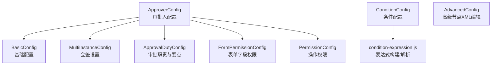
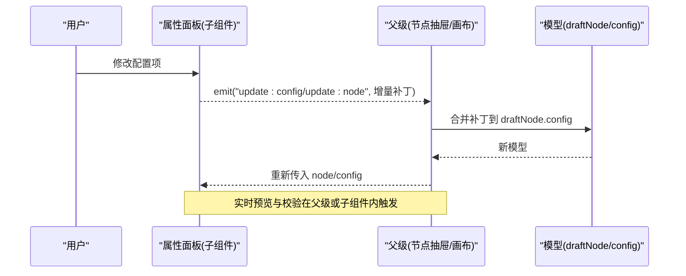
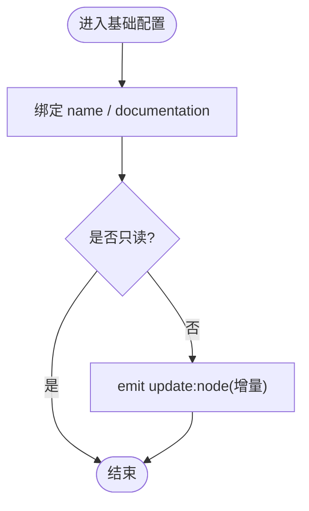
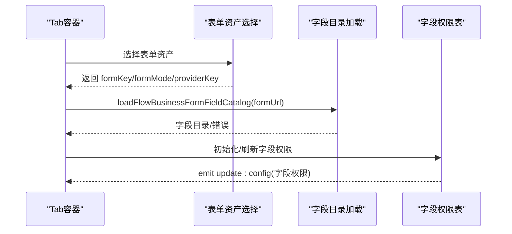
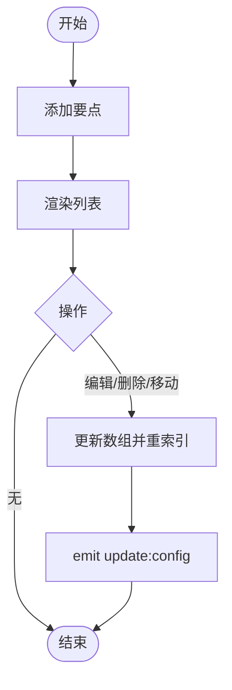
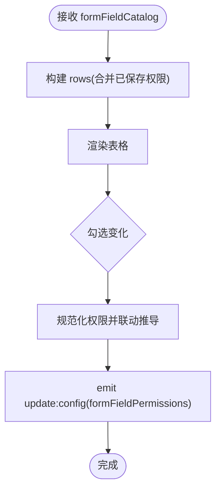
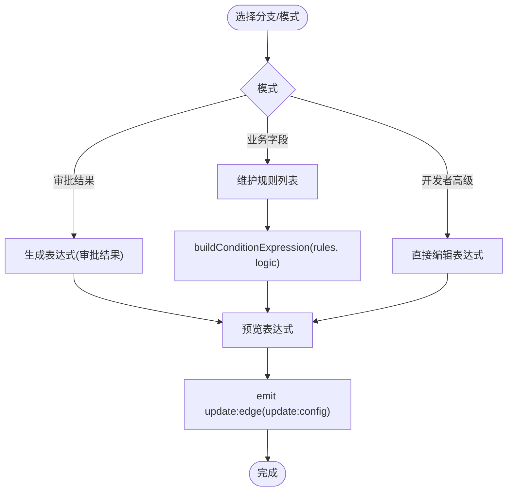
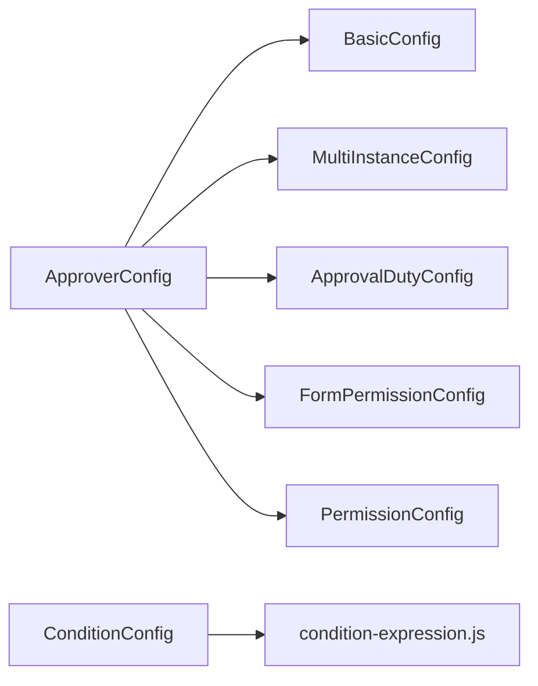

# 面板系统

<cite>
**本文引用的文件**
- [BasicConfig.vue](file://forge-admin-ui/src/components/flow-designer/panel/BasicConfig.vue)
- [ApproverConfig.vue](file://forge-admin-ui/src/components/flow-designer/panel/ApproverConfig.vue)
- [ApprovalDutyConfig.vue](file://forge-admin-ui/src/components/flow-designer/panel/ApprovalDutyConfig.vue)
- [ConditionConfig.vue](file://forge-admin-ui/src/components/flow-designer/panel/ConditionConfig.vue)
- [MultiInstanceConfig.vue](file://forge-admin-ui/src/components/flow-designer/panel/MultiInstanceConfig.vue)
- [FormPermissionConfig.vue](file://forge-admin-ui/src/components/flow-designer/panel/FormPermissionConfig.vue)
- [PermissionConfig.vue](file://forge-admin-ui/src/components/flow-designer/panel/PermissionConfig.vue)
- [AdvancedConfig.vue](file://forge-admin-ui/src/components/flow-designer/panel/AdvancedConfig.vue)
</cite>

## 目录
1. [简介](#简介)
2. [项目结构](#项目结构)
3. [核心组件](#核心组件)
4. [架构总览](#架构总览)
5. [详细组件分析](#详细组件分析)
6. [依赖关系分析](#依赖关系分析)
7. [性能考量](#性能考量)
8. [故障排查指南](#故障排查指南)
9. [结论](#结论)
10. [附录](#附录)

## 简介
本技术文档聚焦工作流设计器“属性面板”子系统，围绕配置渲染机制、动态表单生成与数据绑定展开，深入解析基础配置面板、审批人配置、条件配置等关键面板的实现原理。同时覆盖配置项的动态加载、验证规则、实时预览等特性，并提供自定义配置面板开发指南、表单组件集成和数据同步机制说明，以及面板扩展、主题定制与用户体验优化方案。

## 项目结构
面板系统位于流程设计器的右侧属性面板区域，采用“按节点类型拆分面板 + 组合式 Tab 聚合”的组织方式：
- 基础配置：节点名称、描述等通用属性
- 审批人配置：审批办理、会签设置、表单资产与字段权限、审批权限、扩展配置（逾期提醒、监听器等）
- 条件配置：网关分支条件（审批结果、业务字段规则、开发者高级表达式）
- 其他：高级节点 rawXml 编辑、多实例会签、表单字段权限、操作权限开关等

图表来源
- [ApproverConfig.vue:1-403](file://forge-admin-ui/src/components/flow-designer/panel/ApproverConfig.vue#L1-L403)
- [BasicConfig.vue:1-51](file://forge-admin-ui/src/components/flow-designer/panel/BasicConfig.vue#L1-L51)
- [MultiInstanceConfig.vue:1-95](file://forge-admin-ui/src/components/flow-designer/panel/MultiInstanceConfig.vue#L1-L95)
- [ApprovalDutyConfig.vue:1-220](file://forge-admin-ui/src/components/flow-designer/panel/ApprovalDutyConfig.vue#L1-L220)
- [FormPermissionConfig.vue:1-361](file://forge-admin-ui/src/components/flow-designer/panel/FormPermissionConfig.vue#L1-L361)
- [PermissionConfig.vue:1-62](file://forge-admin-ui/src/components/flow-designer/panel/PermissionConfig.vue#L1-L62)
- [ConditionConfig.vue:1-989](file://forge-admin-ui/src/components/flow-designer/panel/ConditionConfig.vue#L1-L989)
- [AdvancedConfig.vue:1-56](file://forge-admin-ui/src/components/flow-designer/panel/AdvancedConfig.vue#L1-L56)

章节来源
- [ApproverConfig.vue:1-403](file://forge-admin-ui/src/components/flow-designer/panel/ApproverConfig.vue#L1-L403)
- [ConditionConfig.vue:1-989](file://forge-admin-ui/src/components/flow-designer/panel/ConditionConfig.vue#L1-L989)

## 核心组件
- BasicConfig：提供节点名称与描述的只读/可写双向绑定，通过 update:node 事件将变更上抛给父级抽屉或画布状态。
- ApproverConfig：聚合多个子面板的 Tab 容器，负责表单资产选择、字段目录加载、字段权限初始化与同步。
- ApprovalDutyConfig：维护审批职责描述与审批要点列表，支持增删改排序与必审标记。
- MultiInstanceConfig：配置会签模式与完成条件（全部/任一/比例），并暴露 passRate。
- FormPermissionConfig：基于当前流程字段目录生成表格，维护可见/可编辑/必填等权限，自动推导联动约束。
- PermissionConfig：暴露一组操作权限布尔开关（允许通过/驳回/委派/终止/强制签名/意见等）。
- ConditionConfig：为网关分支提供三种条件编辑模式（审批结果、业务字段规则、开发者高级），并实时生成/预览 SpEL 表达式。
- AdvancedConfig：对不支持的 BPMN 元素提供原始 XML 的只读/编辑视图，默认锁定以防误改。

章节来源
- [BasicConfig.vue:1-51](file://forge-admin-ui/src/components/flow-designer/panel/BasicConfig.vue#L1-L51)
- [ApproverConfig.vue:1-403](file://forge-admin-ui/src/components/flow-designer/panel/ApproverConfig.vue#L1-L403)
- [ApprovalDutyConfig.vue:1-220](file://forge-admin-ui/src/components/flow-designer/panel/ApprovalDutyConfig.vue#L1-L220)
- [MultiInstanceConfig.vue:1-95](file://forge-admin-ui/src/components/flow-designer/panel/MultiInstanceConfig.vue#L1-L95)
- [FormPermissionConfig.vue:1-361](file://forge-admin-ui/src/components/flow-designer/panel/FormPermissionConfig.vue#L1-L361)
- [PermissionConfig.vue:1-62](file://forge-admin-ui/src/components/flow-designer/panel/PermissionConfig.vue#L1-L62)
- [ConditionConfig.vue:1-989](file://forge-admin-ui/src/components/flow-designer/panel/ConditionConfig.vue#L1-L989)
- [AdvancedConfig.vue:1-56](file://forge-admin-ui/src/components/flow-designer/panel/AdvancedConfig.vue#L1-L56)

## 架构总览
面板系统以“事件驱动 + 单向数据流”为核心：子面板通过 emit('update:*') 向上抛出增量补丁，父级合并后更新 draftNode/config，再回写到画布模型。条件配置通过共享工具函数统一构建/解析表达式，确保导出 BPMN 时的一致性。

图表来源
- [ApproverConfig.vue:100-167](file://forge-admin-ui/src/components/flow-designer/panel/ApproverConfig.vue#L100-L167)
- [BasicConfig.vue:17-32](file://forge-admin-ui/src/components/flow-designer/panel/BasicConfig.vue#L17-L32)
- [ConditionConfig.vue:142-176](file://forge-admin-ui/src/components/flow-designer/panel/ConditionConfig.vue#L142-L176)

## 详细组件分析

### 基础配置面板（BasicConfig）
- 功能：编辑节点名称与描述，支持 readonly 模式。
- 数据绑定：使用 computed 实现 v-model 双向绑定，并通过 update:node 事件将变更上抛。
- 复杂度：O(1)，仅对象浅拷贝与事件派发。
- 错误处理：受 readonly 控制，禁止写入时不触发更新。
- 性能：无外部依赖，渲染开销极低。

图表来源
- [BasicConfig.vue:17-32](file://forge-admin-ui/src/components/flow-designer/panel/BasicConfig.vue#L17-L32)

章节来源
- [BasicConfig.vue:1-51](file://forge-admin-ui/src/components/flow-designer/panel/BasicConfig.vue#L1-L51)

### 审批人配置面板（ApproverConfig）
- 功能：聚合审批办理、会签设置、表单资产与字段权限、审批权限、扩展配置等 Tab。
- 动态表单：根据 formMode/formUrl 动态加载外置表单字段目录，并自动生成字段权限；当未登记目录时给出提示。
- 数据同步：通过 patch() 发出 update:config，集中管理 formType/formMode/formKey/providerKey/viewKey/formRef/formFieldPermissions 等字段。
- 容错：对外置表单字段目录加载失败进行 try/catch 并展示错误信息。
- 复杂度：字段目录归一化 O(n)，权限映射 Map 查找 O(1)。

图表来源
- [ApproverConfig.vue:100-167](file://forge-admin-ui/src/components/flow-designer/panel/ApproverConfig.vue#L100-L167)
- [ApproverConfig.vue:191-237](file://forge-admin-ui/src/components/flow-designer/panel/ApproverConfig.vue#L191-L237)

章节来源
- [ApproverConfig.vue:1-403](file://forge-admin-ui/src/components/flow-designer/panel/ApproverConfig.vue#L1-L403)

### 审批职责与要点（ApprovalDutyConfig）
- 功能：维护 responsibilityDescription 与 approvalPoints 列表，支持增删改、排序与必审标记。
- 数据一致性：每次变更都 reindex 保证 sort 连续；新增条目带唯一 id。
- 复杂度：列表操作 O(n)，排序与重索引 O(n)。

图表来源
- [ApprovalDutyConfig.vue:22-74](file://forge-admin-ui/src/components/flow-designer/panel/ApprovalDutyConfig.vue#L22-L74)

章节来源
- [ApprovalDutyConfig.vue:1-220](file://forge-admin-ui/src/components/flow-designer/panel/ApprovalDutyConfig.vue#L1-L220)

### 会签设置（MultiInstanceConfig）
- 功能：配置 multiInstanceType（none/parallel/sequential）、completionCondition（all/any/ratio）及 passRate。
- 交互：当 completionCondition 为 ratio 时显示百分比输入框。
- 复杂度：O(1)。

章节来源
- [MultiInstanceConfig.vue:1-95](file://forge-admin-ui/src/components/flow-designer/panel/MultiInstanceConfig.vue#L1-L95)

### 表单字段权限（FormPermissionConfig）
- 功能：基于当前流程字段目录生成表格，维护 readable/writable/required 等权限，并自动推导联动（如 writable=true 则 readable=true）。
- 数据源：formFieldCatalog 作为权威字段清单；历史字段保留 stale 标记。
- 复杂度：初始化 O(n)，更新单行 O(1)。

图表来源
- [FormPermissionConfig.vue:18-67](file://forge-admin-ui/src/components/flow-designer/panel/FormPermissionConfig.vue#L18-L67)
- [FormPermissionConfig.vue:104-164](file://forge-admin-ui/src/components/flow-designer/panel/FormPermissionConfig.vue#L104-L164)

章节来源
- [FormPermissionConfig.vue:1-361](file://forge-admin-ui/src/components/flow-designer/panel/FormPermissionConfig.vue#L1-L361)

### 操作权限（PermissionConfig）
- 功能：暴露一组布尔开关（允许通过/驳回/委派/终止/强制签名/意见等），默认值对齐后端解析逻辑。
- 复杂度：O(1)。

章节来源
- [PermissionConfig.vue:1-62](file://forge-admin-ui/src/components/flow-designer/panel/PermissionConfig.vue#L1-L62)

### 条件配置（ConditionConfig）
- 功能：为网关分支提供三种编辑模式：
  - 审批结果：选择预设动作（同意/驳回/退回/终止），自动生成表达式
  - 业务字段：可视化规则（字段+运算符+值），支持区间与空值判断
  - 开发者高级：手写表达式
- 表达式：通过 condition-expression.js 统一构建/解析，确保与 BPMN 导出一致。
- 交互：支持默认分支设置、模式切换、规则增删改、逻辑（全部/任一）切换，实时预览表达式。
- 复杂度：规则构建 O(m)，表达式解析 O(k)。

图表来源
- [ConditionConfig.vue:142-176](file://forge-admin-ui/src/components/flow-designer/panel/ConditionConfig.vue#L142-L176)
- [ConditionConfig.vue:301-319](file://forge-admin-ui/src/components/flow-designer/panel/ConditionConfig.vue#L301-L319)

章节来源
- [ConditionConfig.vue:1-989](file://forge-admin-ui/src/components/flow-designer/panel/ConditionConfig.vue#L1-L989)

### 高级节点 XML 编辑（AdvancedConfig）
- 功能：对暂不被样式编辑器支持的节点类型，提供原始 BPMN XML 的只读/编辑视图，默认锁定。
- 风险：需确保 XML 合法，否则可能导致部署失败。

章节来源
- [AdvancedConfig.vue:1-56](file://forge-admin-ui/src/components/flow-designer/panel/AdvancedConfig.vue#L1-L56)

## 依赖关系分析
- ApproverConfig 依赖：
  - BusinessFlowFormAssetSelect：表单资产选择
  - loadFlowBusinessFormFieldCatalog：外置表单字段目录加载
  - 各子面板：BasicConfig、MultiInstanceConfig、ApprovalDutyConfig、FormPermissionConfig、PermissionConfig、ListenerConfig、OverdueReminderConfig
- ConditionConfig 依赖：
  - condition-expression.js：表达式构建/解析工具
- 所有面板均依赖 Vue 响应式与 Naive UI 组件库。

图表来源
- [ApproverConfig.vue:21-32](file://forge-admin-ui/src/components/flow-designer/panel/ApproverConfig.vue#L21-L32)
- [ConditionConfig.vue:12-21](file://forge-admin-ui/src/components/flow-designer/panel/ConditionConfig.vue#L12-L21)

章节来源
- [ApproverConfig.vue:1-403](file://forge-admin-ui/src/components/flow-designer/panel/ApproverConfig.vue#L1-L403)
- [ConditionConfig.vue:1-989](file://forge-admin-ui/src/components/flow-designer/panel/ConditionConfig.vue#L1-L989)

## 性能考量
- 计算缓存：大量使用 computed 避免重复计算（如字段目录、权限行、表达式）。
- 增量更新：子面板通过 emit('update:*') 发送最小化补丁，减少父级重渲染范围。
- 列表操作：审批要点与字段权限采用 Map/数组索引优化，避免全量重建。
- 异步加载：外置表单字段目录按需加载，失败时降级为空并提示。
- 建议：
  - 对大表单字段目录分页或懒加载
  - 条件规则较多时可引入防抖/节流
  - 复杂表达式解析可考虑缓存命中键

[本节为通用指导，无需特定文件引用]

## 故障排查指南
- 外置表单字段目录加载失败
  - 现象：提示“尚未登记字段目录”或“加载失败”
  - 排查：检查 formUrl 是否正确、组件是否暴露 flowFieldCatalog、网络请求是否成功
  - 参考位置：[ApproverConfig.vue:112-129](file://forge-admin-ui/src/components/flow-designer/panel/ApproverConfig.vue#L112-L129)
- 字段权限异常
  - 现象：勾选联动不符合预期
  - 排查：确认 normalizePermission 与 readBoolean 的推导逻辑，检查 sourceRequired 与 stale 标记
  - 参考位置：[FormPermissionConfig.vue:73-102](file://forge-admin-ui/src/components/flow-designer/panel/FormPermissionConfig.vue#L73-L102)
- 条件表达式不一致
  - 现象：可视化规则与手写表达式不一致
  - 排查：确认 buildConditionExpression 与 parseConditionExpression 的使用场景，检查 rulesCondition 与 advancedCondition 的同步
  - 参考位置：[ConditionConfig.vue:301-319](file://forge-admin-ui/src/components/flow-designer/panel/ConditionConfig.vue#L301-L319)
- 高级节点 XML 误改
  - 现象：部署失败或节点不可识别
  - 排查：确认 AdvancedConfig 的 editing 开关与 readonly 限制，恢复备份 XML
  - 参考位置：[AdvancedConfig.vue:16-31](file://forge-admin-ui/src/components/flow-designer/panel/AdvancedConfig.vue#L16-L31)

章节来源
- [ApproverConfig.vue:112-129](file://forge-admin-ui/src/components/flow-designer/panel/ApproverConfig.vue#L112-L129)
- [FormPermissionConfig.vue:73-102](file://forge-admin-ui/src/components/flow-designer/panel/FormPermissionConfig.vue#L73-L102)
- [ConditionConfig.vue:301-319](file://forge-admin-ui/src/components/flow-designer/panel/ConditionConfig.vue#L301-L319)
- [AdvancedConfig.vue:16-31](file://forge-admin-ui/src/components/flow-designer/panel/AdvancedConfig.vue#L16-L31)

## 结论
面板系统通过清晰的组件边界与事件驱动的数据流，实现了高内聚、低耦合的配置能力。审批人配置与条件配置分别覆盖了“谁来做/怎么做”和“何时走哪条路”的核心问题，配合表单字段权限与操作权限，形成完整的运行时行为定义。借助统一的表达式工具与字段目录机制，既降低了业务人员门槛，又保留了开发者的高级能力。

[本节为总结性内容，无需特定文件引用]

## 附录

### 自定义配置面板开发指南
- 步骤
  - 新建面板组件，接收 config/node 与 readonly props
  - 通过 computed 建立双向绑定，使用 emit('update:config' | 'update:node') 上报增量补丁
  - 在父级（如 NodePropertiesPanel/NodeConfigDrawer）中订阅并合并到 draftNode.config
  - 如需表单字段权限，接入 formFieldCatalog 并复用 FormPermissionConfig 的归一化逻辑
- 最佳实践
  - 保持补丁最小化，避免整对象替换
  - 对异步数据（如字段目录）做好错误提示与降级
  - 遵循 readonly 语义，禁用危险操作

章节来源
- [ApproverConfig.vue:108-167](file://forge-admin-ui/src/components/flow-designer/panel/ApproverConfig.vue#L108-L167)
- [BasicConfig.vue:17-32](file://forge-admin-ui/src/components/flow-designer/panel/BasicConfig.vue#L17-L32)

### 表单组件集成与数据同步机制
- 表单资产选择：通过 BusinessFlowFormAssetSelect 选择 formKey/formMode/providerKey，并回填 viewKey/formRef
- 字段目录加载：根据 formUrl 调用 loadFlowBusinessFormFieldCatalog，成功后初始化字段权限
- 权限同步：FormPermissionConfig 将 readable/writable/required 规范化后回写至 config.formFieldPermissions
- 参考路径
  - [ApproverConfig.vue:135-167](file://forge-admin-ui/src/components/flow-designer/panel/ApproverConfig.vue#L135-L167)
  - [ApproverConfig.vue:191-237](file://forge-admin-ui/src/components/flow-designer/panel/ApproverConfig.vue#L191-L237)
  - [FormPermissionConfig.vue:104-164](file://forge-admin-ui/src/components/flow-designer/panel/FormPermissionConfig.vue#L104-L164)

章节来源
- [ApproverConfig.vue:135-167](file://forge-admin-ui/src/components/flow-designer/panel/ApproverConfig.vue#L135-L167)
- [ApproverConfig.vue:191-237](file://forge-admin-ui/src/components/flow-designer/panel/ApproverConfig.vue#L191-L237)
- [FormPermissionConfig.vue:104-164](file://forge-admin-ui/src/components/flow-designer/panel/FormPermissionConfig.vue#L104-L164)

### 面板扩展、主题定制与用户体验优化
- 面板扩展
  - 在 ApproverConfig 的 Tab 中新增 tab-pane，挂载自定义子面板
  - 通过 update:config 注入新的配置项，并在后端解析器中兼容
- 主题定制
  - 使用 UnoCSS/Naive UI 主题变量统一风格
  - 通过 scoped 样式隔离，避免污染全局
- 用户体验
  - 提供空态提示与引导文案（如“暂无分支，请先添加下游节点”）
  - 对复杂操作提供确认与撤销（如删除规则、编辑 XML）
  - 对长列表提供虚拟滚动或分页

[本节为通用指导，无需特定文件引用]