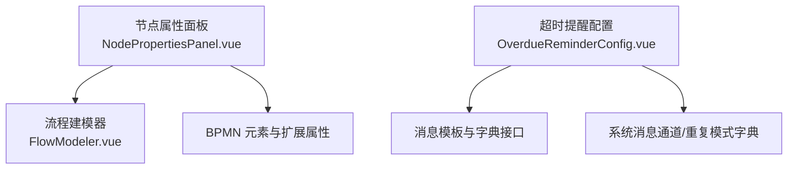
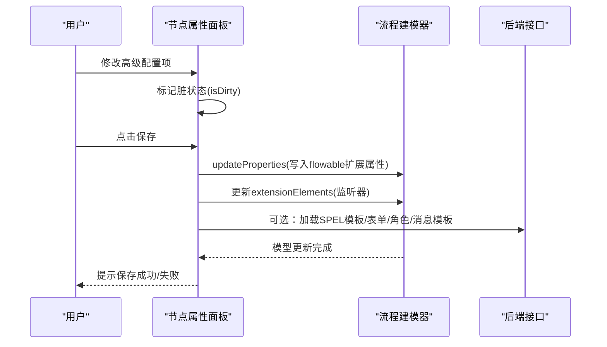
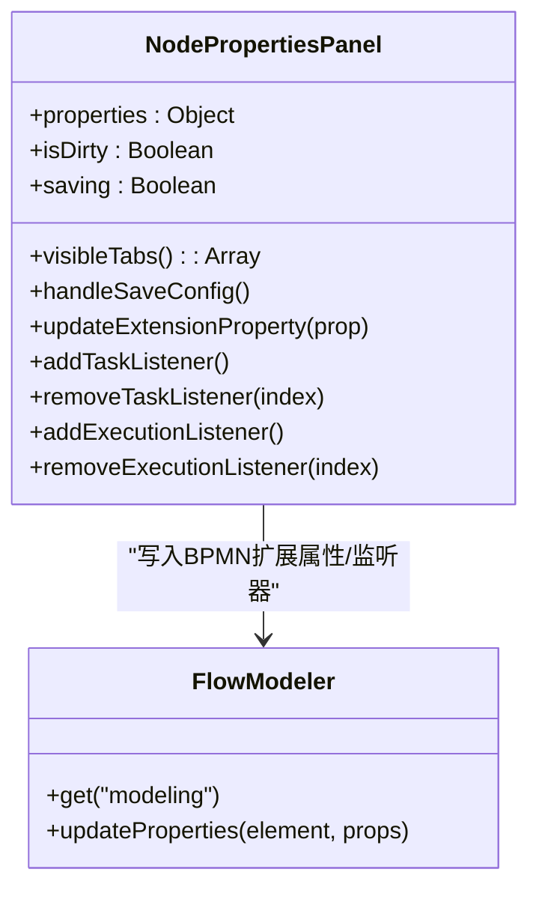
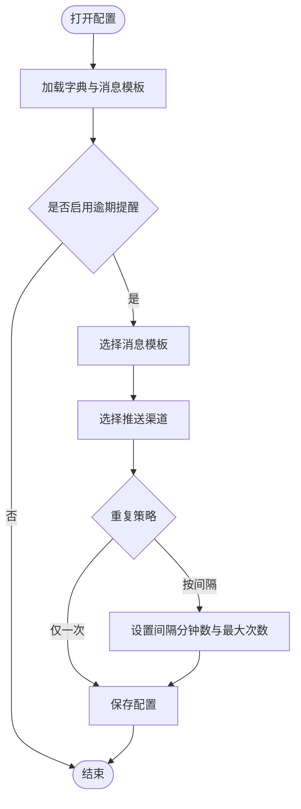
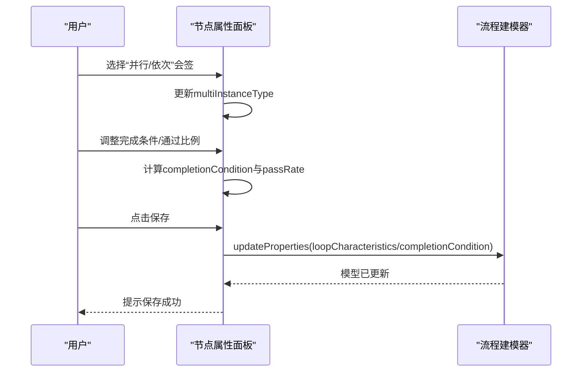
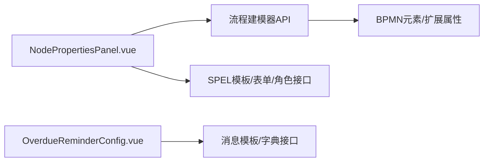

# 高级配置面板

<cite>
**本文引用的文件**
- [NodePropertiesPanel.vue](file://forge-admin-ui/src/components/bpmn/NodePropertiesPanel.vue)
- [OverdueReminderConfig.vue](file://forge-admin-ui/src/components/flow-designer/panel/OverdueReminderConfig.vue)
- [FlowModeler.vue](file://forge-admin-ui/src/components/bpmn/FlowModeler.vue)
</cite>

## 目录
1. [简介](#简介)
2. [项目结构](#项目结构)
3. [核心组件](#核心组件)
4. [架构总览](#架构总览)
5. [详细组件分析](#详细组件分析)
6. [依赖关系分析](#依赖关系分析)
7. [性能与可用性考虑](#性能与可用性考虑)
8. [故障排查指南](#故障排查指南)
9. [结论](#结论)
10. [附录：扩展与定制](#附录：扩展与定制)

## 简介
本技术文档聚焦“高级配置面板组”，围绕流程设计器中的节点高级配置能力，系统解析多实例配置、超时提醒、监听器等特性的实现方式。重点说明各配置项的业务逻辑、参数校验、状态管理、联动与冲突处理策略，并给出扩展机制、自定义配置项开发与主题定制方案，以及调试与排障方法。

## 项目结构
高级配置面板由以下关键部分构成：
- 节点属性面板：提供基础属性、审批设置、办理控制、会签配置、监听器、服务任务、网关、流转条件、结束配置等 Tab 页，承载各类高级配置项的编辑与保存。
- 超时提醒配置：独立的可复用配置块，用于配置处理时限与逾期提醒策略（模板、渠道、重复策略、间隔与次数）。
- 流程建模器集成：通过模型器 API 读写 BPMN 元素及扩展属性，将 UI 配置持久化到流程定义中。

图表来源
- [NodePropertiesPanel.vue:1000-1144](file://forge-admin-ui/src/components/bpmn/NodePropertiesPanel.vue#L1000-L1144)
- [OverdueReminderConfig.vue:13-49](file://forge-admin-ui/src/components/flow-designer/panel/OverdueReminderConfig.vue#L13-L49)
- [FlowModeler.vue:161-163](file://forge-admin-ui/src/components/bpmn/FlowModeler.vue#L161-L163)

章节来源
- [NodePropertiesPanel.vue:1000-1144](file://forge-admin-ui/src/components/bpmn/NodePropertiesPanel.vue#L1000-L1144)
- [OverdueReminderConfig.vue:13-49](file://forge-admin-ui/src/components/flow-designer/panel/OverdueReminderConfig.vue#L13-L49)
- [FlowModeler.vue:161-163](file://forge-admin-ui/src/components/bpmn/FlowModeler.vue#L161-L163)

## 核心组件
- 节点属性面板（NodePropertiesPanel.vue）
  - 负责用户任务的审批人分配、表单类型与内嵌表单、优先级与截止日期、会签配置、任务监听器、执行监听器、服务任务（含抄送）、网关、序列流条件、结束事件等高级配置。
  - 维护 properties 响应式对象，统一标记脏状态并在保存时批量更新底层 BPMN 元素。
- 超时提醒配置（OverdueReminderConfig.vue）
  - 提供处理时限（天/小时）与逾期提醒开关、消息模板选择、推送渠道、重复策略（仅一次/按间隔）、间隔分钟数与最大次数等配置。
  - 通过 computed 与 emit 双向绑定父级 config，支持只读模式。

章节来源
- [NodePropertiesPanel.vue:1088-1144](file://forge-admin-ui/src/components/bpmn/NodePropertiesPanel.vue#L1088-L1144)
- [OverdueReminderConfig.vue:19-49](file://forge-admin-ui/src/components/flow-designer/panel/OverdueReminderConfig.vue#L19-L49)

## 架构总览
高级配置面板以“UI 配置态 + BPMN 模型”的双向同步为核心：
- UI 层：Vue 响应式 properties 与局部状态（如 isDirty、saving），Tab 切换与联动控制。
- 模型层：通过 modeling.updateProperties 写入 flowable 命名空间扩展属性；监听器通过 extensionElements 追加 TaskListener/ExecutionListener。
- 数据源：SPEL 模板、表单定义、角色列表、消息模板、字典等通过 HTTP 接口加载。

图表来源
- [NodePropertiesPanel.vue:1467-1520](file://forge-admin-ui/src/components/bpmn/NodePropertiesPanel.vue#L1467-L1520)
- [NodePropertiesPanel.vue:2233-2244](file://forge-admin-ui/src/components/bpmn/NodePropertiesPanel.vue#L2233-L2244)
- [NodePropertiesPanel.vue:2617-2670](file://forge-admin-ui/src/components/bpmn/NodePropertiesPanel.vue#L2617-L2670)

## 详细组件分析

### 节点属性面板（NodePropertiesPanel.vue）
- 配置分组与可见性
  - 根据当前选中元素类型动态显示 Tab：开始、用户任务、服务任务、网关、序列流、结束、执行监听器等。
  - 用户任务包含审批设置、办理控制、会签配置、监听器四个子 Tab。
- 多实例配置（会签）
  - 支持单人、并行会签、依次审批三种模式。
  - 完成条件支持全部通过、任一通过、按比例通过；比例通过提供预设快选与滑块+数值输入联动。
  - 保存时将 loopCharacteristics（顺序/并行）、completionCondition、loopCardinality 等写入模型。
- 超时提醒（截止日期）
  - 用户任务支持“截止日期（天）”，保存时转换为 ISO 8601 时长格式（如 PxD）。
  - 与“超时提醒”模块互补：前者为节点级别截止时间，后者为全局或流程级别的逾期提醒策略。
- 监听器
  - 任务监听器：事件包括 create/assignment/complete/delete，类名全限定。
  - 执行监听器：事件包括 start/end/take，适用于多种节点类型。
  - 保存时合并现有 extensionElements，新增或覆盖对应监听器条目。
- 服务任务与抄送
  - 可配置为抄送节点，支持指定人员/角色/表达式三种来源；表达式可返回人员或角色。
  - 实现方式支持 Java 类、表达式、委托表达式；异步执行开关。
- 流转条件
  - 提供快捷预设（同意/驳回/退回/终止）与自定义字段判断构建器。
  - 高级模式支持表达式或脚本（JavaScript/Groovy/JUEL），默认流可勾选。
- 表单配置
  - 动态表单：引用已有表单或在线设计生成节点专属表单；支持预览与清空。
  - 外部表单：填写 URL；无表单：清空相关属性。
- 状态管理与保存
  - 使用 isDirty 标记未保存变更；handleSaveConfig 集中调用各 update* 方法，最后触发父组件更新。
  - 通过 modeling.updateProperties 写入 flowable:* 扩展属性；监听器通过 moddle.create 创建 extensionElements 并更新。

图表来源
- [NodePropertiesPanel.vue:1088-1144](file://forge-admin-ui/src/components/bpmn/NodePropertiesPanel.vue#L1088-L1144)
- [NodePropertiesPanel.vue:1467-1520](file://forge-admin-ui/src/components/bpmn/NodePropertiesPanel.vue#L1467-L1520)
- [NodePropertiesPanel.vue:2233-2244](file://forge-admin-ui/src/components/bpmn/NodePropertiesPanel.vue#L2233-L2244)
- [NodePropertiesPanel.vue:2617-2670](file://forge-admin-ui/src/components/bpmn/NodePropertiesPanel.vue#L2617-L2670)

章节来源
- [NodePropertiesPanel.vue:1000-1144](file://forge-admin-ui/src/components/bpmn/NodePropertiesPanel.vue#L1000-L1144)
- [NodePropertiesPanel.vue:1467-1520](file://forge-admin-ui/src/components/bpmn/NodePropertiesPanel.vue#L1467-L1520)
- [NodePropertiesPanel.vue:2090-2119](file://forge-admin-ui/src/components/bpmn/NodePropertiesPanel.vue#L2090-L2119)
- [NodePropertiesPanel.vue:2121-2142](file://forge-admin-ui/src/components/bpmn/NodePropertiesPanel.vue#L2121-L2142)
- [NodePropertiesPanel.vue:2233-2244](file://forge-admin-ui/src/components/bpmn/NodePropertiesPanel.vue#L2233-L2244)
- [NodePropertiesPanel.vue:2617-2670](file://forge-admin-ui/src/components/bpmn/NodePropertiesPanel.vue#L2617-L2670)

### 超时提醒配置（OverdueReminderConfig.vue）
- 功能要点
  - 处理时限：天数与小时双输入，限制范围与只读模式。
  - 逾期提醒：开关控制；消息模板远程加载；推送渠道多选；重复策略（仅一次/按间隔）。
  - 间隔重复：当选择“按间隔”时显示“提醒间隔（分钟）”和“最大次数”。
- 数据绑定
  - 通过 useField/useArrayField/useNumberField 封装对父级 config 的双向绑定，统一归一化数字与数组。
  - 模板选项与字典数据在挂载时懒加载，支持搜索与过滤。
- 与节点截止日期的关系
  - 该组件侧重“逾期提醒策略”，不直接写入 BPMN 节点的 dueDate；如需节点级截止时间，请在用户任务“截止日期”中配置。

图表来源
- [OverdueReminderConfig.vue:13-49](file://forge-admin-ui/src/components/flow-designer/panel/OverdueReminderConfig.vue#L13-L49)
- [OverdueReminderConfig.vue:82-110](file://forge-admin-ui/src/components/flow-designer/panel/OverdueReminderConfig.vue#L82-L110)
- [OverdueReminderConfig.vue:163-268](file://forge-admin-ui/src/components/flow-designer/panel/OverdueReminderConfig.vue#L163-L268)

章节来源
- [OverdueReminderConfig.vue:19-49](file://forge-admin-ui/src/components/flow-designer/panel/OverdueReminderConfig.vue#L19-L49)
- [OverdueReminderConfig.vue:82-110](file://forge-admin-ui/src/components/flow-designer/panel/OverdueReminderConfig.vue#L82-L110)
- [OverdueReminderConfig.vue:163-268](file://forge-admin-ui/src/components/flow-designer/panel/OverdueReminderConfig.vue#L163-L268)

### 会签配置交互流程（示例）

图表来源
- [NodePropertiesPanel.vue:532-606](file://forge-admin-ui/src/components/bpmn/NodePropertiesPanel.vue#L532-L606)
- [NodePropertiesPanel.vue:2090-2119](file://forge-admin-ui/src/components/bpmn/NodePropertiesPanel.vue#L2090-L2119)
- [NodePropertiesPanel.vue:1467-1520](file://forge-admin-ui/src/components/bpmn/NodePropertiesPanel.vue#L1467-L1520)

章节来源
- [NodePropertiesPanel.vue:532-606](file://forge-admin-ui/src/components/bpmn/NodePropertiesPanel.vue#L532-L606)
- [NodePropertiesPanel.vue:2090-2119](file://forge-admin-ui/src/components/bpmn/NodePropertiesPanel.vue#L2090-L2119)
- [NodePropertiesPanel.vue:1467-1520](file://forge-admin-ui/src/components/bpmn/NodePropertiesPanel.vue#L1467-L1520)

## 依赖关系分析
- 组件耦合
  - 节点属性面板依赖流程建模器进行模型读写；依赖外部接口获取 SPEL 模板、表单定义、角色列表、消息模板与字典。
  - 超时提醒配置依赖字典与消息模板接口，并通过 computed/emit 与父级配置对象解耦。
- 外部依赖
  - BPMN/Flowable 扩展属性映射（moddleExtensions）使 flowable:* 属性可直接读写。
  - 消息系统与字典中心提供运行时选项与模板。
- 潜在循环依赖
  - 组件间通过 props/emit 单向通信，未见循环导入；模型器作为基础设施被上层组件消费。

图表来源
- [NodePropertiesPanel.vue:1429-1465](file://forge-admin-ui/src/components/bpmn/NodePropertiesPanel.vue#L1429-L1465)
- [OverdueReminderConfig.vue:82-110](file://forge-admin-ui/src/components/flow-designer/panel/OverdueReminderConfig.vue#L82-L110)
- [NodePropertiesPanel.vue:2233-2244](file://forge-admin-ui/src/components/bpmn/NodePropertiesPanel.vue#L2233-L2244)

章节来源
- [NodePropertiesPanel.vue:1429-1465](file://forge-admin-ui/src/components/bpmn/NodePropertiesPanel.vue#L1429-L1465)
- [OverdueReminderConfig.vue:82-110](file://forge-admin-ui/src/components/flow-designer/panel/OverdueReminderConfig.vue#L82-L110)
- [NodePropertiesPanel.vue:2233-2244](file://forge-admin-ui/src/components/bpmn/NodePropertiesPanel.vue#L2233-L2244)

## 性能与可用性考虑
- 渲染性能
  - 大列表（如角色、表单定义、消息模板）采用分页/远程搜索与懒加载，避免一次性渲染过多 DOM。
  - 复杂表单（节点表单设计器）仅在弹窗中按需加载与渲染。
- 交互体验
  - 脏状态提示与保存按钮常驻底部，减少误操作风险。
  - 会签比例提供预设快选与滑块联动，降低配置成本。
- 可扩展性
  - 监听器与扩展属性通过 extensionElements 统一管理，便于后续新增事件类型或扩展字段。
  - 超时提醒配置模块化，可在不同场景复用。

[本节为通用指导，无需具体文件来源]

## 故障排查指南
- 常见问题定位
  - 保存后未生效：确认 handleSaveConfig 是否调用了对应 update* 方法；检查 modeling.updateProperties 是否传入正确属性键（flowable:*）。
  - 监听器未生效：检查 extensionElements 是否正确合并；确认事件类型与类名匹配。
  - 会签比例异常：核对 completionCondition 与 passRate 的计算与回写逻辑。
  - 超时提醒不触发：确认“逾期提醒”开关开启、模板可用、渠道有效；检查重复策略与间隔配置。
- 调试建议
  - 在浏览器控制台查看网络请求（SPEL 模板、表单、角色、消息模板、字典）。
  - 使用流程建模器的模型导出功能，检查 XML 中 flowable:* 属性与 extensionElements 内容。
  - 对于表达式/脚本，先在表达式测试环境验证语法与变量可用性。

章节来源
- [NodePropertiesPanel.vue:1467-1520](file://forge-admin-ui/src/components/bpmn/NodePropertiesPanel.vue#L1467-L1520)
- [NodePropertiesPanel.vue:2617-2670](file://forge-admin-ui/src/components/bpmn/NodePropertiesPanel.vue#L2617-L2670)
- [OverdueReminderConfig.vue:82-110](file://forge-admin-ui/src/components/flow-designer/panel/OverdueReminderConfig.vue#L82-L110)

## 结论
高级配置面板通过清晰的 Tab 组织与响应式状态管理，将复杂的 BPMN 扩展配置转化为直观的用户界面。多实例、超时提醒、监听器等高级特性均具备完善的参数校验、联动与冲突处理机制。配合模块化设计与统一的模型写入策略，既保证了可维护性，也为后续扩展提供了良好基础。

[本节为总结性内容，无需具体文件来源]

## 附录：扩展与定制
- 扩展机制
  - 新增高级配置项：在 properties 中添加字段，并在相应 Tab 中增加表单控件；在 handleSaveConfig 中调用对应的 update* 方法写入模型。
  - 新增监听器事件：扩展 taskEventOptions/executionEventOptions，并在保存逻辑中写入 extensionElements。
  - 新增扩展属性：通过 modeling.updateProperties 写入新的 flowable:* 属性键。
- 自定义配置项开发
  - 参考 OverdueReminderConfig.vue 的 useField/useArrayField/useNumberField 封装，快速实现与父级 config 的双向绑定。
  - 复用字典与消息模板加载逻辑，确保选项一致性与可维护性。
- 主题定制
  - 应用级主题通过布局设置中的主题选项控制；组件样式遵循 Naive UI 主题覆盖机制。
  - 若需深色模式适配，可在组件中使用 CSS 变量或主题断言进行差异化样式处理。

[本节为通用指导，无需具体文件来源]