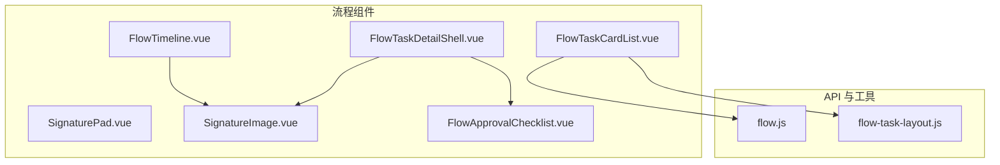
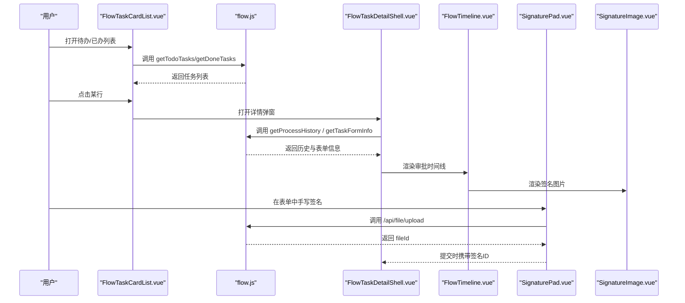
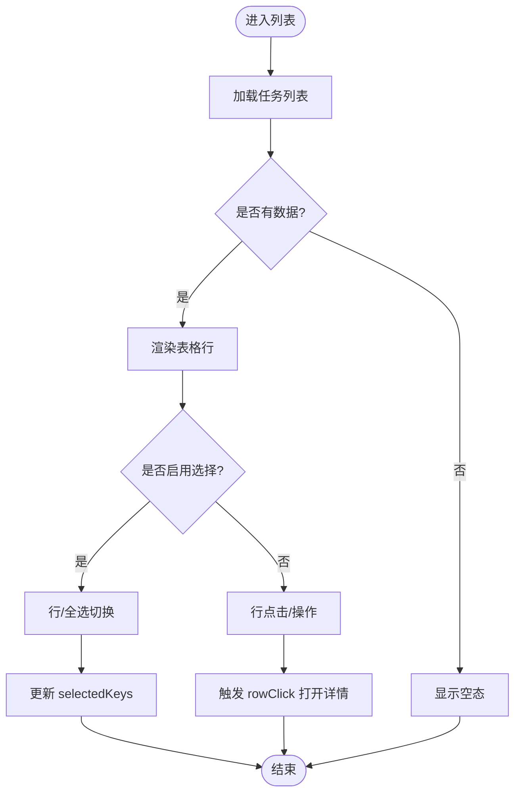
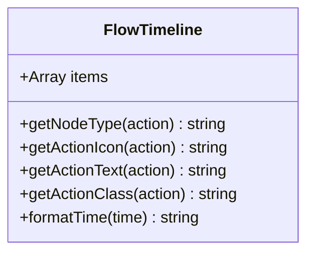
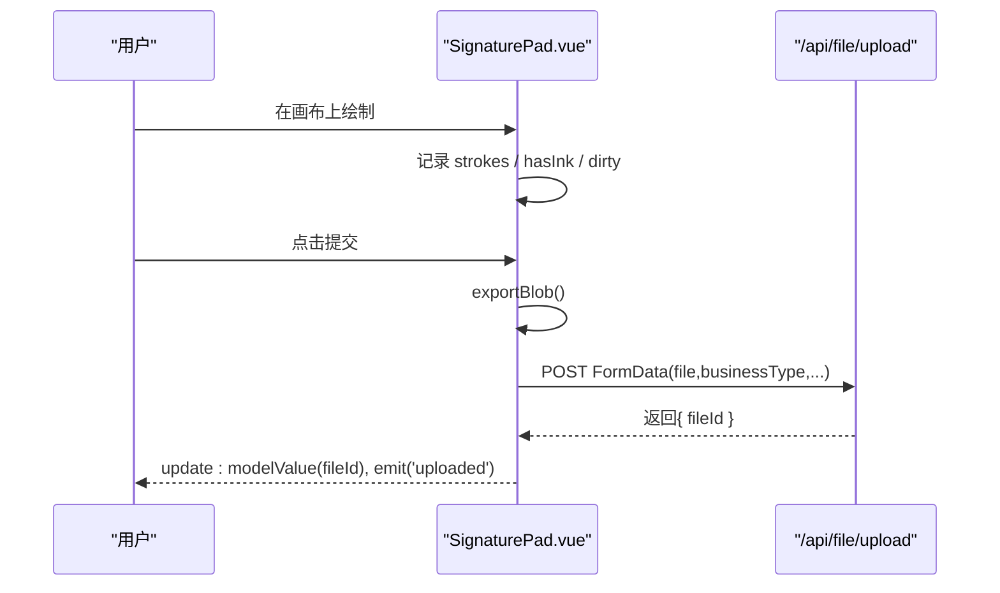
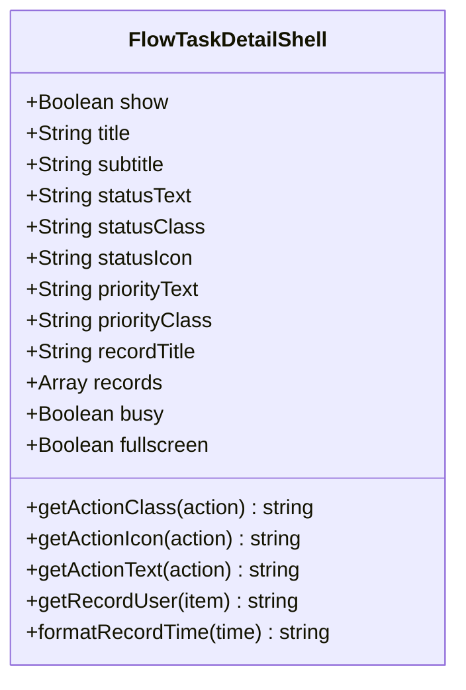
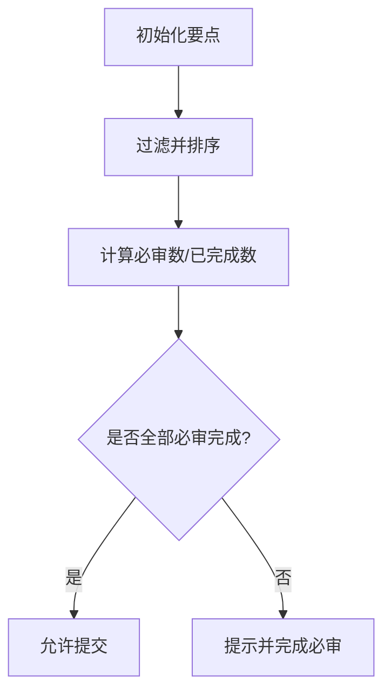
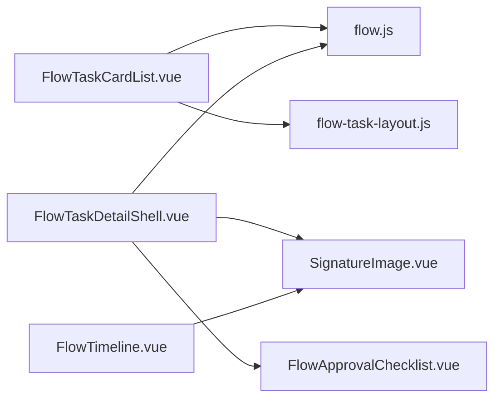
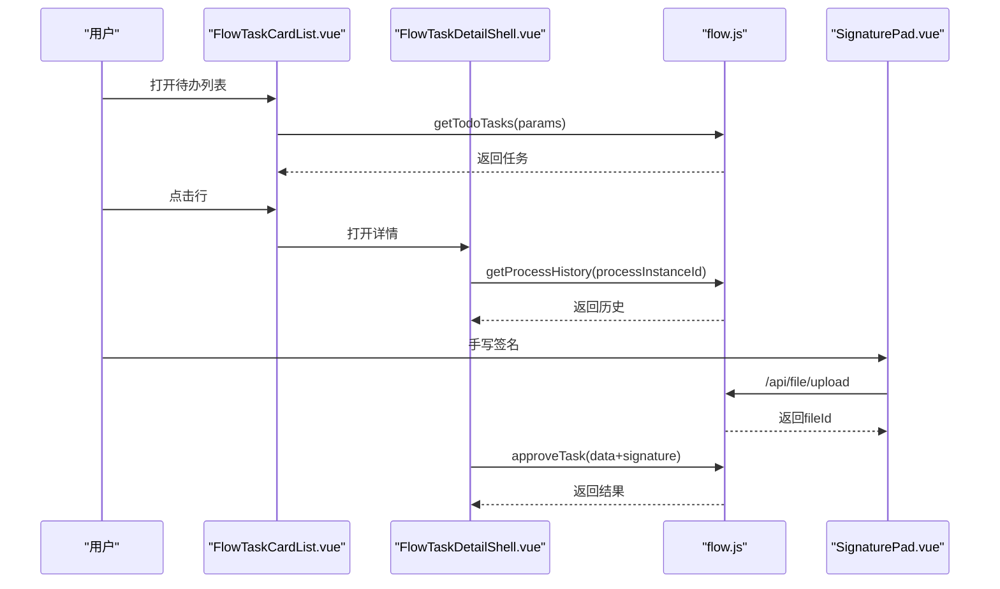

# 流程相关组件

<cite>
**本文引用的文件**
- [FlowTaskCardList.vue](file://forge-admin-ui/src/components/flow/FlowTaskCardList.vue)
- [FlowTimeline.vue](file://forge-admin-ui/src/components/flow/FlowTimeline.vue)
- [SignaturePad.vue](file://forge-admin-ui/src/components/flow/SignaturePad.vue)
- [SignatureImage.vue](file://forge-admin-ui/src/components/flow/SignatureImage.vue)
- [FlowTaskDetailShell.vue](file://forge-admin-ui/src/components/flow/FlowTaskDetailShell.vue)
- [FlowApprovalChecklist.vue](file://forge-admin-ui/src/components/flow/FlowApprovalChecklist.vue)
- [flow.js](file://forge-admin-ui/src/api/flow.js)
- [flow-task-layout.js](file://forge-admin-ui/src/utils/flow-task-layout.js)
</cite>

## 目录
1. [简介](#简介)
2. [项目结构](#项目结构)
3. [核心组件](#核心组件)
4. [架构总览](#架构总览)
5. [详细组件分析](#详细组件分析)
6. [依赖关系分析](#依赖关系分析)
7. [性能考虑](#性能考虑)
8. [故障排查指南](#故障排查指南)
9. [结论](#结论)
10. [附录](#附录)

## 简介
本技术文档聚焦于 Forge Admin 中的流程相关 UI 组件，系统性解析任务列表、流程时间线、电子签名等关键组件的设计模式与实现细节。重点覆盖：
- FlowTaskCardList 任务卡片列表：支持批量选择、分页、搜索、未读高亮、插槽扩展等能力。
- FlowTimeline 流程时间线：展示审批历史、操作类型、处理人、时间与评论/签名。
- SignaturePad 电子签名：Canvas 手写签名、导出图片、上传至后端并持久化。
- SignatureImage 签名图片渲染：智能识别图片值类型，兼容多种来源。
- FlowTaskDetailShell 审批详情壳层：统一的任务详情布局、状态标识、右侧审批记录流。
- FlowApprovalChecklist 审批要点：结构化勾选必审/非必审项，提供校验提示。

同时给出 API 对接说明（任务查询、审批动作、历史记录等）、样式定制建议、集成方案与扩展开发最佳实践。

## 项目结构
流程相关组件集中于 forge-admin-ui/src/components/flow 目录，配合统一的 flow API 模块与工具函数，形成“视图组件 + 业务 API + 工具”的清晰分层。

图表来源
- [FlowTaskCardList.vue:1-720](file://forge-admin-ui/src/components/flow/FlowTaskCardList.vue#L1-L720)
- [FlowTimeline.vue:1-268](file://forge-admin-ui/src/components/flow/FlowTimeline.vue#L1-L268)
- [SignaturePad.vue:1-348](file://forge-admin-ui/src/components/flow/SignaturePad.vue#L1-L348)
- [SignatureImage.vue:1-66](file://forge-admin-ui/src/components/flow/SignatureImage.vue#L1-L66)
- [FlowTaskDetailShell.vue:1-806](file://forge-admin-ui/src/components/flow/FlowTaskDetailShell.vue#L1-L806)
- [FlowApprovalChecklist.vue:1-258](file://forge-admin-ui/src/components/flow/FlowApprovalChecklist.vue#L1-L258)
- [flow.js:1-600](file://forge-admin-ui/src/api/flow.js#L1-L600)
- [flow-task-layout.js:1-6](file://forge-admin-ui/src/utils/flow-task-layout.js#L1-L6)

章节来源
- [FlowTaskCardList.vue:1-720](file://forge-admin-ui/src/components/flow/FlowTaskCardList.vue#L1-L720)
- [FlowTimeline.vue:1-268](file://forge-admin-ui/src/components/flow/FlowTimeline.vue#L1-L268)
- [SignaturePad.vue:1-348](file://forge-admin-ui/src/components/flow/SignaturePad.vue#L1-L348)
- [SignatureImage.vue:1-66](file://forge-admin-ui/src/components/flow/SignatureImage.vue#L1-L66)
- [FlowTaskDetailShell.vue:1-806](file://forge-admin-ui/src/components/flow/FlowTaskDetailShell.vue#L1-L806)
- [FlowApprovalChecklist.vue:1-258](file://forge-admin-ui/src/components/flow/FlowApprovalChecklist.vue#L1-L258)
- [flow.js:1-600](file://forge-admin-ui/src/api/flow.js#L1-L600)
- [flow-task-layout.js:1-6](file://forge-admin-ui/src/utils/flow-task-layout.js#L1-L6)

## 核心组件
- FlowTaskCardList：任务列表容器，负责数据展示、选择态、分页、搜索、空态、插槽扩展（标题、摘要、状态、节点、用户、操作）。
- FlowTimeline：以时间轴形式呈现审批历史，包含操作类型图标、处理人头像、时间、评论与签名。
- SignaturePad：基于 Canvas 的手写签名组件，支持拖拽绘制、清空、导出 Blob、上传到后端并回写 fileId。
- SignatureImage：智能渲染签名图片，支持 data URL、blob URL、文件服务路径、HTTP(S) 与固定长度 ID。
- FlowTaskDetailShell：审批详情弹窗壳层，左侧主内容区，右侧审批记录流，内置状态/优先级标识与记录样式。
- FlowApprovalChecklist：审批要点面板，支持必审/非必审项勾选与完成度提示。

章节来源
- [FlowTaskCardList.vue:1-720](file://forge-admin-ui/src/components/flow/FlowTaskCardList.vue#L1-L720)
- [FlowTimeline.vue:1-268](file://forge-admin-ui/src/components/flow/FlowTimeline.vue#L1-L268)
- [SignaturePad.vue:1-348](file://forge-admin-ui/src/components/flow/SignaturePad.vue#L1-L348)
- [SignatureImage.vue:1-66](file://forge-admin-ui/src/components/flow/SignatureImage.vue#L1-L66)
- [FlowTaskDetailShell.vue:1-806](file://forge-admin-ui/src/components/flow/FlowTaskDetailShell.vue#L1-L806)
- [FlowApprovalChecklist.vue:1-258](file://forge-admin-ui/src/components/flow/FlowApprovalChecklist.vue#L1-L258)

## 架构总览
流程组件通过统一的 flow API 获取任务、表单、历史与图形信息；UI 组件以声明式方式组织数据与交互，并通过事件/插槽与上层页面解耦。

图表来源
- [FlowTaskCardList.vue:1-720](file://forge-admin-ui/src/components/flow/FlowTaskCardList.vue#L1-L720)
- [FlowTaskDetailShell.vue:1-806](file://forge-admin-ui/src/components/flow/FlowTaskDetailShell.vue#L1-L806)
- [FlowTimeline.vue:1-268](file://forge-admin-ui/src/components/flow/FlowTimeline.vue#L1-L268)
- [SignaturePad.vue:1-348](file://forge-admin-ui/src/components/flow/SignaturePad.vue#L1-L348)
- [SignatureImage.vue:1-66](file://forge-admin-ui/src/components/flow/SignatureImage.vue#L1-L66)
- [flow.js:1-600](file://forge-admin-ui/src/api/flow.js#L1-L600)

## 详细组件分析

### FlowTaskCardList 任务卡片列表
- 功能特性
  - 列表工具栏：标题、计数/已选数量、搜索框、刷新按钮、批量操作插槽。
  - 表格头：实体列、状态列、当前节点列、申请人列、操作列，均支持自定义标题。
  - 行渲染：支持标题插槽、摘要插槽、状态插槽、节点插槽、用户插槽、操作插槽。
  - 选择能力：单选/全选当前页、部分选中态、清空选择。
  - 分页：支持 page/pageSize/itemCount 双向绑定与页码切换。
  - 未读高亮：通过 unreadKey 字段控制。
  - 加载态：n-spin 包裹列表区域。
- 数据模型与复杂度
  - items: Array，O(1) 访问；selectedKeys: Array，使用 Set 计算是否选中 O(1)。
  - 选择逻辑：toggleRow/toggleCurrentPage 均为 O(n) 遍历当前页键集合。
- 事件与插槽
  - 事件：update:selectedKeys、update:searchValue、update:page、update:pageSize、search、refresh、rowClick。
  - 插槽：title、summary、status、node、user、actions、filters、batch-actions。
- 样式定制
  - 主题变量：使用 CSS 变量（如 --border-light、--bg-primary、--primary-color）适配主题。
  - 响应式：小屏下工具栏堆叠、表格列宽自适应。
- 集成示例（概念性）
  - 父组件维护 selectedKeys/searchValue/pagination/items/loading，监听事件更新状态并调用 API。
  - 通过插槽自定义每行列显示内容与操作按钮。

图表来源
- [FlowTaskCardList.vue:1-720](file://forge-admin-ui/src/components/flow/FlowTaskCardList.vue#L1-L720)

章节来源
- [FlowTaskCardList.vue:1-720](file://forge-admin-ui/src/components/flow/FlowTaskCardList.vue#L1-L720)

### FlowTimeline 流程时间线
- 功能特性
  - 按顺序渲染审批历史，每条记录包含：处理人头像与姓名、任务名、操作标签、时间、评论、签名。
  - 操作类型映射：approve/reject/delegate/return/terminate/claim/start/withdraw/pending，分别对应不同图标、文案与颜色。
  - 时间格式化：支持 ISO 字符串与原始字符串。
- 数据结构
  - items: Array<{ action, assigneeName, taskName, completeTime/createTime, comment, signature }>。
- 样式与可访问性
  - 节点圆点带渐变背景色，区分成功/错误/警告/默认/信息。
  - 使用语义化结构与 aria-label（由子组件承担）。
- 集成示例（概念性）
  - 从 flow.js 的 getProcessHistory 获取历史数据后直接传入 items。

图表来源
- [FlowTimeline.vue:1-268](file://forge-admin-ui/src/components/flow/FlowTimeline.vue#L1-L268)

章节来源
- [FlowTimeline.vue:1-268](file://forge-admin-ui/src/components/flow/FlowTimeline.vue#L1-L268)

### SignaturePad 电子签名
- 功能特性
  - Canvas 绘制：pointer 事件捕获，支持多段笔画、橡皮擦（清空）、高 DPI 适配。
  - 导出与上传：exportBlob() 生成 PNG；upload() 将 blob 与业务元数据上传至 /api/file/upload，成功后回写 fileId。
  - 状态管理：isBlank、dirty、drawing、strokes、hasInk。
  - 暴露方法：clear、exportBlob、hasSignature、upload。
- 数据流
  - 绘制阶段：记录 strokes 数组，实时重绘。
  - 上传阶段：构造 FormData，附加 businessType/businessId/storageType/isPrivate，请求后端保存。
- 错误处理
  - 无签名时 exportBlob 拒绝 Promise。
  - 画布未初始化或生成失败抛出错误。
- 集成示例（概念性）
  - 在表单中使用 v-model 绑定 modelValue（fileId），提交前调用 upload() 确保有最新签名。

图表来源
- [SignaturePad.vue:1-348](file://forge-admin-ui/src/components/flow/SignaturePad.vue#L1-L348)

章节来源
- [SignaturePad.vue:1-348](file://forge-admin-ui/src/components/flow/SignaturePad.vue#L1-L348)

### SignatureImage 签名图片渲染
- 功能特性
  - 智能判断 value 是否为图片：data:image/、blob:、/api/file/、http(s)、32位十六进制ID。
  - 尺寸控制：compact 模式缩小尺寸。
  - 懒加载与错误回退：lazy 与 error 回调。
- 集成示例（概念性）
  - 在时间线或审批记录中直接传入签名 fileId 或 URL。

章节来源
- [SignatureImage.vue:1-66](file://forge-admin-ui/src/components/flow/SignatureImage.vue#L1-L66)

### FlowTaskDetailShell 审批详情壳层
- 功能特性
  - 顶部状态标识与优先级标签，标题/副标题区域。
  - 主体区域：插槽承载表单/详情内容。
  - 右侧记录流：展示审批历史条目，含操作类型、处理人、时间、评论、审批要点、签名。
  - 记录样式：根据 action 映射 success/error/warning/info/default。
- 数据模型
  - records: Array<{ action, taskName, assigneeName/operatorName/userName/startUserName, completeTime/createTime, comment, approvalPointResults[], signature }>。
- 集成示例（概念性）
  - 通过 flow.js 的 getProcessHistory 获取 records，再传入 Shell 渲染。

图表来源
- [FlowTaskDetailShell.vue:1-806](file://forge-admin-ui/src/components/flow/FlowTaskDetailShell.vue#L1-L806)

章节来源
- [FlowTaskDetailShell.vue:1-806](file://forge-admin-ui/src/components/flow/FlowTaskDetailShell.vue#L1-L806)

### FlowApprovalChecklist 审批要点
- 功能特性
  - 责任描述区与审批要点区分离。
  - 规范化 points：过滤无效项并按 sort 排序。
  - 必审校验：统计 requiredCount 与 checkedRequiredCount，未完成时提示。
  - 只读模式：readonly 禁用交互。
- 数据模型
  - approvalPoints: Array<{ id, content, required, sort }>。
  - modelValue: Object，key 为 point.id，值为布尔。
- 集成示例（概念性）
  - 表单提交前检查 requiredComplete，不满足则阻止提交。

图表来源
- [FlowApprovalChecklist.vue:1-258](file://forge-admin-ui/src/components/flow/FlowApprovalChecklist.vue#L1-L258)

章节来源
- [FlowApprovalChecklist.vue:1-258](file://forge-admin-ui/src/components/flow/FlowApprovalChecklist.vue#L1-L258)

## 依赖关系分析
- 组件间依赖
  - FlowTaskDetailShell 依赖 SignatureImage 与 FlowApprovalChecklist。
  - FlowTimeline 依赖 SignatureImage。
  - FlowTaskCardList 与 FlowTaskDetailShell 通过路由/事件协作。
- API 依赖
  - 所有流程组件通过 flow.js 提供的接口与后端交互。
- 工具依赖
  - flow-task-layout.js 用于识别流程任务列表页面路径，便于全局行为控制。

图表来源
- [FlowTaskCardList.vue:1-720](file://forge-admin-ui/src/components/flow/FlowTaskCardList.vue#L1-L720)
- [FlowTaskDetailShell.vue:1-806](file://forge-admin-ui/src/components/flow/FlowTaskDetailShell.vue#L1-L806)
- [FlowTimeline.vue:1-268](file://forge-admin-ui/src/components/flow/FlowTimeline.vue#L1-L268)
- [SignatureImage.vue:1-66](file://forge-admin-ui/src/components/flow/SignatureImage.vue#L1-L66)
- [FlowApprovalChecklist.vue:1-258](file://forge-admin-ui/src/components/flow/FlowApprovalChecklist.vue#L1-L258)
- [flow.js:1-600](file://forge-admin-ui/src/api/flow.js#L1-L600)
- [flow-task-layout.js:1-6](file://forge-admin-ui/src/utils/flow-task-layout.js#L1-L6)

章节来源
- [flow.js:1-600](file://forge-admin-ui/src/api/flow.js#L1-L600)
- [flow-task-layout.js:1-6](file://forge-admin-ui/src/utils/flow-task-layout.js#L1-L6)

## 性能考虑
- 列表渲染
  - FlowTaskCardList 使用 Grid 布局与虚拟滚动友好结构，避免过度嵌套；分页减少单次渲染量。
  - 选择态使用 Set 提升查找效率。
- 签名绘制
  - SignaturePad 使用 ResizeObserver 监听容器变化，按需重绘；DPR 适配保证清晰度。
  - 仅在 dirty 时上传，避免重复请求。
- 图片渲染
  - SignatureImage 支持懒加载，减少首屏压力；错误回退避免白屏。
- 网络请求
  - flow.js 统一封装 request，建议结合防抖/节流优化搜索与刷新频率。

[本节为通用指导，无需具体文件引用]

## 故障排查指南
- 签名无法上传
  - 现象：exportBlob 报错或后端返回无 fileId。
  - 排查：确认 hasInk.value 为真；检查 /api/file/upload 接口权限与参数；查看浏览器控制台错误。
  - 参考：SignaturePad 的 exportBlob/upload 逻辑。
- 时间线签名不显示
  - 现象：SignatureImage 显示文本而非图片。
  - 排查：value 是否符合图片格式判定规则（data:image/、blob:、/api/file/、http(s)、32位ID）。
  - 参考：SignatureImage 的 isSignatureImageValue。
- 列表未读高亮异常
  - 现象：unread 样式未生效。
  - 排查：确认 unreadKey 配置正确且数据字段值匹配（如 0 表示未读）。
  - 参考：FlowTaskCardList 的 isUnread 逻辑。
- 审批要点校验不生效
  - 现象：允许提交但未勾选必审项。
  - 排查：确认 readonly 未误设为 true；检查 modelValue 结构；调用 requiredComplete 进行前置校验。
  - 参考：FlowApprovalChecklist 的计算属性与暴露方法。

章节来源
- [SignaturePad.vue:222-276](file://forge-admin-ui/src/components/flow/SignaturePad.vue#L222-L276)
- [SignatureImage.vue:42-53](file://forge-admin-ui/src/components/flow/SignatureImage.vue#L42-L53)
- [FlowTaskCardList.vue:197-199](file://forge-admin-ui/src/components/flow/FlowTaskCardList.vue#L197-L199)
- [FlowApprovalChecklist.vue:74-97](file://forge-admin-ui/src/components/flow/FlowApprovalChecklist.vue#L74-L97)

## 结论
本套流程组件以清晰的职责划分与良好的可扩展性，覆盖了任务列表、审批详情、时间线与电子签名的核心场景。通过统一的 API 与工具函数，实现了前后端解耦与一致的交互体验。建议在集成时遵循以下原则：
- 使用插槽与事件扩展列表与详情，保持组件内聚。
- 对耗时操作（搜索、刷新、上传）加入防抖与加载态。
- 严格校验审批要点与签名完整性后再提交。
- 利用主题变量与响应式样式适配多端。

[本节为总结性内容，无需具体文件引用]

## 附录

### 组件 API 速查
- FlowTaskCardList
  - Props：title、items、loading、pagination、selectedKeys、rowKey、searchValue、searchPlaceholder、emptyText、selectable、showSearch、unreadKey、entityTitle、statusTitle、nodeTitle、userTitle、actionTitle。
  - Events：update:selectedKeys、update:searchValue、update:page、update:pageSize、search、refresh、rowClick。
  - Slots：title、summary、status、node、user、actions、filters、batch-actions。
- FlowTimeline
  - Props：items。
  - Methods：getNodeType、getActionIcon、getActionText、getActionClass、formatTime。
- SignaturePad
  - Props：modelValue、businessType、businessId、storageType、height、disabled、strokeWidth。
  - Events：update:modelValue、uploaded、clear。
  - Expose：clear、exportBlob、hasSignature、upload。
- SignatureImage
  - Props：value、compact、lazy。
- FlowTaskDetailShell
  - Props：show、title、subtitle、statusText、statusClass、statusIcon、priorityText、priorityClass、recordTitle、records、busy、fullscreen。
  - 插槽：toolbar、aside-extra、record-action。
- FlowApprovalChecklist
  - Props：responsibilityDescription、approvalPoints、legacyApprovalPoint、modelValue、readonly。
  - Events：update:modelValue。
  - Expose：requiredComplete、requiredCount。

章节来源
- [FlowTaskCardList.vue:152-180](file://forge-admin-ui/src/components/flow/FlowTaskCardList.vue#L152-L180)
- [FlowTimeline.vue:45-106](file://forge-admin-ui/src/components/flow/FlowTimeline.vue#L45-L106)
- [SignaturePad.vue:42-52](file://forge-admin-ui/src/components/flow/SignaturePad.vue#L42-L52)
- [SignatureImage.vue:18-22](file://forge-admin-ui/src/components/flow/SignatureImage.vue#L18-L22)
- [FlowTaskDetailShell.vue:114-127](file://forge-admin-ui/src/components/flow/FlowTaskDetailShell.vue#L114-L127)
- [FlowApprovalChecklist.vue:64-72](file://forge-admin-ui/src/components/flow/FlowApprovalChecklist.vue#L64-L72)

### 常用业务流程（序列图）
- 任务审批与签名

图表来源
- [FlowTaskCardList.vue:1-720](file://forge-admin-ui/src/components/flow/FlowTaskCardList.vue#L1-L720)
- [FlowTaskDetailShell.vue:1-806](file://forge-admin-ui/src/components/flow/FlowTaskDetailShell.vue#L1-L806)
- [SignaturePad.vue:1-348](file://forge-admin-ui/src/components/flow/SignaturePad.vue#L1-L348)
- [flow.js:1-600](file://forge-admin-ui/src/api/flow.js#L1-L600)

### 样式定制要点
- 使用 CSS 变量统一主题色与边框色，便于全局换肤。
- 列表与详情采用响应式布局，在小屏下自动调整列宽与工具栏排列。
- 时间线节点与操作标签通过类名映射颜色，可按需扩展新动作类型。

[本节为通用指导，无需具体文件引用]

### 集成方案与最佳实践
- 列表页集成
  - 维护分页与搜索状态，监听 search/refresh 事件调用 API。
  - 使用插槽自定义行内容与操作按钮，保持组件复用。
- 详情页集成
  - 通过 flow.js 获取历史与表单信息，填充 Shell 的 records 与主内容区。
  - 在提交前校验 FlowApprovalChecklist.requiredComplete 与 SignaturePad.hasSignature。
- 签名集成
  - 表单中嵌入 SignaturePad，提交前调用 upload() 确保 fileId 有效。
  - 在时间线或记录中用 SignatureImage 渲染签名。
- 性能与安全
  - 对频繁操作加防抖；上传设置超时与重试策略。
  - 对敏感字段进行脱敏与权限校验。

[本节为通用指导，无需具体文件引用]