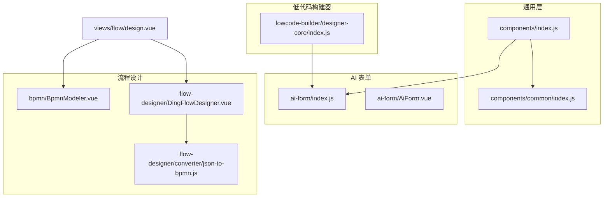
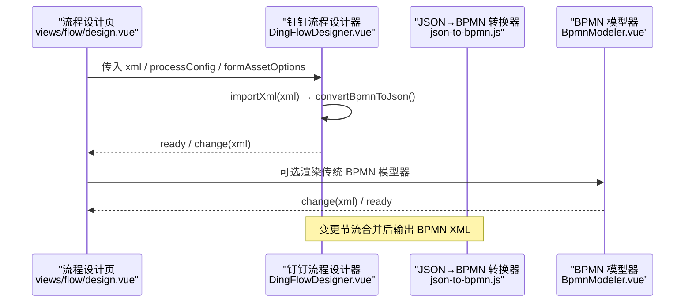
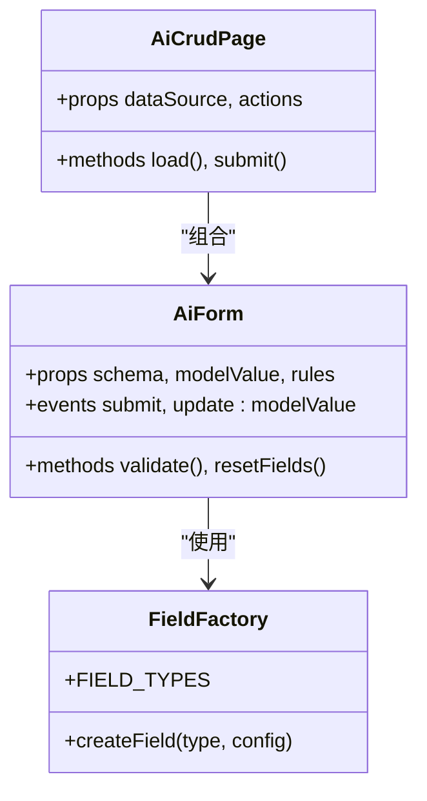
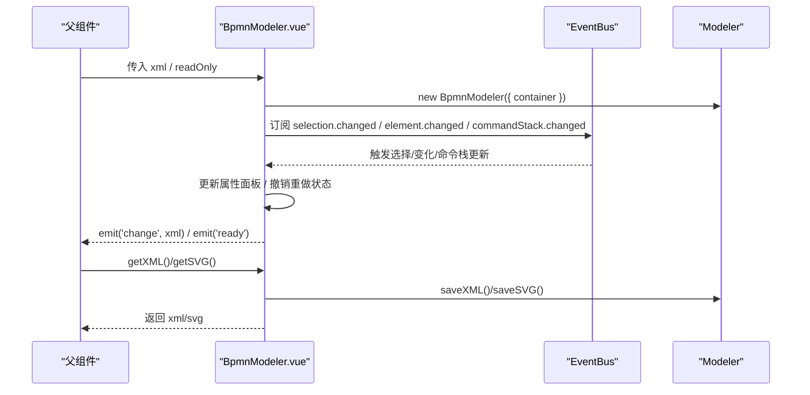
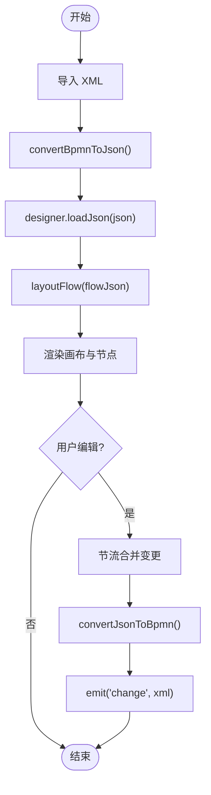
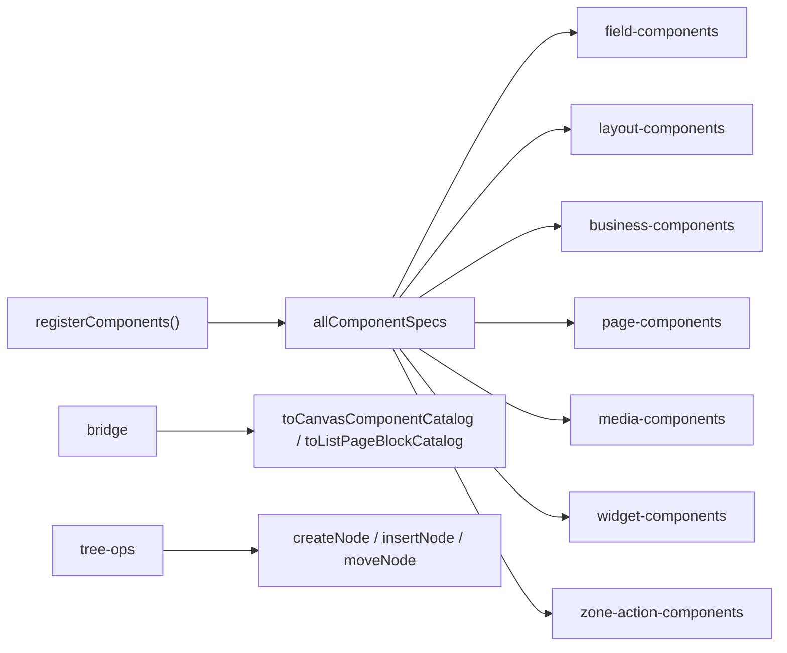
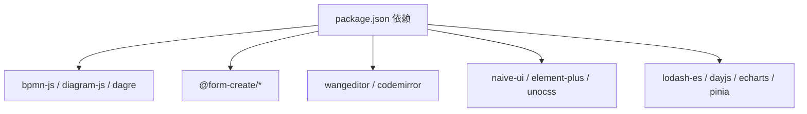

# 组件体系

<cite>
**本文引用的文件**
- [forge-admin-ui/src/components/index.js](file://forge-admin-ui/src/components/index.js)
- [forge-admin-ui/src/components/common/index.js](file://forge-admin-ui/src/components/common/index.js)
- [forge-admin-ui/package.json](file://forge-admin-ui/package.json)
- [forge-admin-ui/src/components/ai-form/index.js](file://forge-admin-ui/src/components/ai-form/index.js)
- [forge-admin-ui/src/components/ai-form/AiForm.vue](file://forge-admin-ui/src/components/ai-form/AiForm.vue)
- [forge-admin-ui/src/components/bpmn/BpmnModeler.vue](file://forge-admin-ui/src/components/bpmn/BpmnModeler.vue)
- [forge-admin-ui/src/components/flow-designer/DingFlowDesigner.vue](file://forge-admin-ui/src/components/flow-designer/DingFlowDesigner.vue)
- [forge-admin-ui/src/components/flow-designer/converter/json-to-bpmn.js](file://forge-admin-ui/src/components/flow-designer/converter/json-to-bpmn.js)
- [forge-admin-ui/src/components/lowcode-builder/designer-core/index.js](file://forge-admin-ui/src/components/lowcode-builder/designer-core/index.js)
- [forge-admin-ui/src/views/flow/design.vue](file://forge-admin-ui/src/views/flow/design.vue)
</cite>

## 目录
1. [简介](#简介)
2. [项目结构](#项目结构)
3. [核心组件](#核心组件)
4. [架构总览](#架构总览)
5. [详细组件分析](#详细组件分析)
6. [依赖关系分析](#依赖关系分析)
7. [性能考虑](#性能考虑)
8. [故障排查指南](#故障排查指南)
9. [结论](#结论)
10. [附录](#附录)

## 简介
本技术文档聚焦 Forge Admin 前端组件体系，围绕 AI 表单、BPMN 流程与低代码构建器三大核心能力，系统阐述组件分类规范、通用封装、业务实现、通信机制、事件处理、插槽与样式定制方案，并给出测试策略、性能优化技巧、可访问性支持与自定义开发指南。目标是帮助开发者快速理解并高效扩展该组件体系。

## 项目结构
Forge Admin 的前端工程位于 forge-admin-ui，组件按领域与职责分层组织：
- 通用组件：基础 UI、布局、主题、用户选择等，统一在 common 子目录导出。
- 业务组件：AI 表单族、BPMN 模型器、钉钉风格流程设计器、低代码构建器等。
- 运行时与工具：数据源、字段类型、Schema 辅助、转换器等。
- 视图集成：页面级容器负责编排与装配具体组件。

图表来源
- [forge-admin-ui/src/components/index.js:1-8](file://forge-admin-ui/src/components/index.js#L1-L8)
- [forge-admin-ui/src/components/common/index.js:1-13](file://forge-admin-ui/src/components/common/index.js#L1-L13)
- [forge-admin-ui/src/components/ai-form/index.js:1-44](file://forge-admin-ui/src/components/ai-form/index.js#L1-L44)
- [forge-admin-ui/src/components/bpmn/BpmnModeler.vue:1-620](file://forge-admin-ui/src/components/bpmn/BpmnModeler.vue#L1-L620)
- [forge-admin-ui/src/components/flow-designer/DingFlowDesigner.vue:1-761](file://forge-admin-ui/src/components/flow-designer/DingFlowDesigner.vue#L1-L761)
- [forge-admin-ui/src/components/flow-designer/converter/json-to-bpmn.js:250-292](file://forge-admin-ui/src/components/flow-designer/converter/json-to-bpmn.js#L250-L292)
- [forge-admin-ui/src/components/lowcode-builder/designer-core/index.js:1-126](file://forge-admin-ui/src/components/lowcode-builder/designer-core/index.js#L1-L126)
- [forge-admin-ui/src/views/flow/design.vue:73-104](file://forge-admin-ui/src/views/flow/design.vue#L73-L104)

章节来源
- [forge-admin-ui/src/components/index.js:1-8](file://forge-admin-ui/src/components/index.js#L1-L8)
- [forge-admin-ui/src/components/common/index.js:1-13](file://forge-admin-ui/src/components/common/index.js#L1-L13)
- [forge-admin-ui/package.json:1-107](file://forge-admin-ui/package.json#L1-L107)

## 核心组件
- AI 表单组件族：以 JSON Schema 驱动动态渲染，提供表单、表格、搜索、导入、行展开、记录选择等能力，并通过工厂与字段类型注册机制扩展新控件。
- BPMN 流程组件：基于 bpmn-js 的可视化建模器，支持撤销重做、缩放、属性面板、导出 XML/SVG。
- 钉钉风格流程设计器：以 JSON 节点树编辑流程，自动连线与卡片式交互，保存时转换为标准 BPMN XML，兼容后端 Flowable。
- 低代码构建器：统一的组件注册表与拖拽协议，聚合字段、布局、媒体、页面、小部件、区域动作等 105+ 组件规格，并提供容器插槽、数据源规范与树操作 API。

章节来源
- [forge-admin-ui/src/components/ai-form/index.js:1-44](file://forge-admin-ui/src/components/ai-form/index.js#L1-L44)
- [forge-admin-ui/src/components/bpmn/BpmnModeler.vue:1-620](file://forge-admin-ui/src/components/bpmn/BpmnModeler.vue#L1-L620)
- [forge-admin-ui/src/components/flow-designer/DingFlowDesigner.vue:1-761](file://forge-admin-ui/src/components/flow-designer/DingFlowDesigner.vue#L1-L761)
- [forge-admin-ui/src/components/lowcode-builder/designer-core/index.js:1-126](file://forge-admin-ui/src/components/lowcode-builder/designer-core/index.js#L1-L126)

## 架构总览
整体采用“视图编排 + 领域组件 + 转换器”的分层模式：
- 视图层：页面容器根据路由或业务上下文选择具体设计器（传统 BPMN 或钉钉风格）。
- 领域组件层：AI 表单、BPMN 模型器、钉钉流程设计器、低代码构建器各自封装完整能力。
- 转换与桥接层：JSON↔BPMN 转换、组件规格注册与桥接、拖拽协议与容器插槽解析。

图表来源
- [forge-admin-ui/src/views/flow/design.vue:73-104](file://forge-admin-ui/src/views/flow/design.vue#L73-L104)
- [forge-admin-ui/src/components/flow-designer/DingFlowDesigner.vue:117-139](file://forge-admin-ui/src/components/flow-designer/DingFlowDesigner.vue#L117-L139)
- [forge-admin-ui/src/components/flow-designer/DingFlowDesigner.vue:280-297](file://forge-admin-ui/src/components/flow-designer/DingFlowDesigner.vue#L280-L297)
- [forge-admin-ui/src/components/flow-designer/converter/json-to-bpmn.js:250-292](file://forge-admin-ui/src/components/flow-designer/converter/json-to-bpmn.js#L250-L292)
- [forge-admin-ui/src/components/bpmn/BpmnModeler.vue:146-281](file://forge-admin-ui/src/components/bpmn/BpmnModeler.vue#L146-L281)

## 详细组件分析

### AI 表单组件族
- 设计要点
  - 以 JSON Schema 驱动渲染，支持分组、区块标题、标签位置、尺寸、校验规则等配置。
  - 通过 createField/FIELD_TYPES/FieldFactory 扩展字段类型，集中管理字段行为与默认值。
  - 提供 AiCrudPage、AiSearch、AiTable、AiCustomQuery、AiRecordSelectorModal 等配套能力，形成 CRUD 闭环。
- 通信与事件
  - 使用 v-model 双向绑定表单值，提交通过 @submit 回调；错误与校验结果由内部规则引擎处理。
  - 表格与筛选组件通过事件与父级状态同步，支持分页、排序、过滤。
- 插槽与样式
  - 表单主体支持导航与分区滚动，可通过 CSS 类名进行主题化覆盖。
  - 分组与区块标题组件用于增强可读性与导航体验。
- 可访问性
  - 表单导航包含 aria-label，按钮具备语义化标签，便于屏幕阅读器识别。

图表来源
- [forge-admin-ui/src/components/ai-form/index.js:1-44](file://forge-admin-ui/src/components/ai-form/index.js#L1-L44)
- [forge-admin-ui/src/components/ai-form/AiForm.vue:1-38](file://forge-admin-ui/src/components/ai-form/AiForm.vue#L1-L38)

章节来源
- [forge-admin-ui/src/components/ai-form/index.js:1-44](file://forge-admin-ui/src/components/ai-form/index.js#L1-L44)
- [forge-admin-ui/src/components/ai-form/AiForm.vue:1-38](file://forge-admin-ui/src/components/ai-form/AiForm.vue#L1-L38)

### BPMN 流程组件（传统模型器）
- 设计要点
  - 基于 bpmn-js 初始化 Modeler，监听 selection.changed、element.changed、commandStack.changed 等事件。
  - 右侧属性面板根据选中元素类型动态展示可编辑属性（如用户任务审批人、服务任务实现、序列流条件）。
  - 支持撤销/重做、缩放、导出 BPMN XML 与 SVG。
- 通信与事件
  - 通过 change 事件向外推送最新 XML；ready 事件暴露 modeler 引用供外部调用。
  - 对外暴露 getXML/getSVG/importXML 方法，便于父组件控制。
- 错误处理
  - 导入 XML 前校验是否包含图形信息，缺失则回退到默认模板，避免渲染失败。
  - 捕获导入与导出异常并记录日志。

图表来源
- [forge-admin-ui/src/components/bpmn/BpmnModeler.vue:146-281](file://forge-admin-ui/src/components/bpmn/BpmnModeler.vue#L146-L281)
- [forge-admin-ui/src/components/bpmn/BpmnModeler.vue:315-436](file://forge-admin-ui/src/components/bpmn/BpmnModeler.vue#L315-L436)
- [forge-admin-ui/src/components/bpmn/BpmnModeler.vue:468-536](file://forge-admin-ui/src/components/bpmn/BpmnModeler.vue#L468-L536)

章节来源
- [forge-admin-ui/src/components/bpmn/BpmnModeler.vue:1-620](file://forge-admin-ui/src/components/bpmn/BpmnModeler.vue#L1-L620)

### 钉钉风格流程设计器
- 设计要点
  - 以 JSON 节点树为核心，维护 nodes/edges/layout，使用 layoutFlow 计算布局与路径。
  - 导入时将 BPMN XML 转为 JSON，编辑后节流合并变更并转回 BPMN XML 输出，保持与后端 Flowable 的兼容性。
  - 支持节点增删改、分支添加、合并点标记、右键菜单、抽屉式节点配置。
- 通信与事件
  - 对外暴露 setXML/getXML/reset/undo/redo 方法；事件包括 change(xml)、ready、importStart/importEnd。
  - 防回环：比较 lastEmittedXml 避免父组件 v-model 回写导致的重复导入。
- 业务表单绑定
  - 支持自动绑定业务表单资产，按 formKey/formMode/providerKey 匹配并初始化字段权限。
- 流程图示

图表来源
- [forge-admin-ui/src/components/flow-designer/DingFlowDesigner.vue:117-139](file://forge-admin-ui/src/components/flow-designer/DingFlowDesigner.vue#L117-L139)
- [forge-admin-ui/src/components/flow-designer/DingFlowDesigner.vue:280-297](file://forge-admin-ui/src/components/flow-designer/DingFlowDesigner.vue#L280-L297)
- [forge-admin-ui/src/components/flow-designer/converter/json-to-bpmn.js:250-292](file://forge-admin-ui/src/components/flow-designer/converter/json-to-bpmn.js#L250-L292)

章节来源
- [forge-admin-ui/src/components/flow-designer/DingFlowDesigner.vue:1-761](file://forge-admin-ui/src/components/flow-designer/DingFlowDesigner.vue#L1-L761)
- [forge-admin-ui/src/components/flow-designer/converter/json-to-bpmn.js:250-292](file://forge-admin-ui/src/components/flow-designer/converter/json-to-bpmn.js#L250-L292)
- [forge-admin-ui/src/views/flow/design.vue:73-104](file://forge-admin-ui/src/views/flow/design.vue#L73-L104)

### 低代码构建器
- 设计要点
  - 统一入口 designer-core/index.js 聚合所有组件规格（字段、布局、媒体、页面、小部件、区域动作），首次导入即自动注册。
  - 提供拖拽协议、容器插槽规范、数据源规范、节点工厂与树操作 API，支撑可视化搭建与运行时渲染。
- 组件分类与注册
  - 通过 registerComponents 批量注册，支持别名映射、类型解析、分组查询与统计。
  - 桥接层将不同维度的组件规格映射为画布、字段、列表页等可用类型。
- 图示

图表来源
- [forge-admin-ui/src/components/lowcode-builder/designer-core/index.js:1-126](file://forge-admin-ui/src/components/lowcode-builder/designer-core/index.js#L1-L126)

章节来源
- [forge-admin-ui/src/components/lowcode-builder/designer-core/index.js:1-126](file://forge-admin-ui/src/components/lowcode-builder/designer-core/index.js#L1-L126)

## 依赖关系分析
- 运行时依赖
  - 流程建模：bpmn-js、diagram-js、dagre 等用于 BPMN 解析与布局。
  - 编辑器：@form-create/*、wangeditor、codemirror 等用于表单与设计器。
  - UI 框架：naive-ui、element-plus、unocss 等提供基础组件与原子化样式。
  - 工具库：lodash-es、dayjs、echarts、pinia 等。
- 模块耦合
  - 视图层仅依赖设计器对外接口（props/events/methods），降低与具体实现的耦合。
  - 转换器独立于设计器，保证 JSON↔BPMN 的可测试性与复用性。
  - 低代码构建器的统一注册表屏蔽了具体组件差异，提升扩展性。

图表来源
- [forge-admin-ui/package.json:19-73](file://forge-admin-ui/package.json#L19-L73)

章节来源
- [forge-admin-ui/package.json:1-107](file://forge-admin-ui/package.json#L1-L107)

## 性能考虑
- 事件节流与批量更新
  - 钉钉流程设计器对 JSON→BPMN 的转换采用定时器节流，减少频繁导出带来的开销。
- 布局计算优化
  - 使用 computed 同步求值布局结果，避免 ref+watch 异步时序导致的新增节点堆叠问题。
- 资源加载与销毁
  - BPMN 模型器在卸载时销毁实例，释放内存；导入前校验 XML 完整性，避免无效渲染。
- 建议
  - 大表单场景下按需加载字段类型与渲染器。
  - 列表与表格启用虚拟滚动与分页。
  - 图片与图标懒加载，减少首屏体积。

[本节为通用指导，不直接分析具体文件]

## 故障排查指南
- 导入 BPMN 失败
  - 检查 XML 是否包含 BPMNDiagram 图形信息，缺失将回退到默认模板。
  - 查看控制台错误日志，确认 XML 格式与命名空间是否正确。
- 流程设计器无响应
  - 确认父组件未发生 v-model 回环（lastEmittedXml 比对）。
  - 检查 importStart/importEnd 事件是否正常触发。
- 表单校验不生效
  - 确认 schema 中 rules 配置正确，v-model 绑定值类型一致。
  - 检查字段类型是否在 FieldFactory 中正确注册。
- 低代码构建器组件不显示
  - 确认组件规格已注册（首次导入 designer-core 会自动注册）。
  - 检查容器插槽规范与拖拽协议是否匹配。

章节来源
- [forge-admin-ui/src/components/bpmn/BpmnModeler.vue:223-306](file://forge-admin-ui/src/components/bpmn/BpmnModeler.vue#L223-L306)
- [forge-admin-ui/src/components/flow-designer/DingFlowDesigner.vue:60-71](file://forge-admin-ui/src/components/flow-designer/DingFlowDesigner.vue#L60-L71)
- [forge-admin-ui/src/components/flow-designer/DingFlowDesigner.vue:280-297](file://forge-admin-ui/src/components/flow-designer/DingFlowDesigner.vue#L280-L297)

## 结论
Forge Admin 组件体系以清晰的层次划分与稳定的对外接口，实现了 AI 表单、BPMN 流程与低代码构建器的深度融合。通过统一的组件注册、转换器与事件机制，既保证了可扩展性，又维持了与后端 Flowable 的兼容性。建议在业务集成中优先使用钉钉风格流程设计器以获得更友好的交互体验，并结合低代码构建器快速搭建复杂页面。

[本节为总结性内容，不直接分析具体文件]

## 附录
- 自定义组件开发指南
  - 字段组件：在 ai-form/config.js 中通过 FieldFactory 注册类型，定义默认值、校验与渲染逻辑。
  - 流程节点：在 flow-designer/nodes 中新增节点类型，并在 converter 中补充 JSON↔BPMN 映射。
  - 低代码组件：在 designer-core/spec 中新增组件规格，确保容器插槽与拖拽协议兼容。
- 组件发布规范
  - 统一通过 components/index.js 与 common/index.js 导出，保持入口清晰。
  - 遵循 package.json 中的脚本与依赖版本，确保构建与预览一致性。
- 集成最佳实践
  - 视图层仅依赖设计器对外接口，避免直接耦合内部实现。
  - 使用转换器进行数据交换，保证前后端契约稳定。
  - 在大型应用中拆分模块并按需加载，提升首屏性能。

[本节为通用指导，不直接分析具体文件]