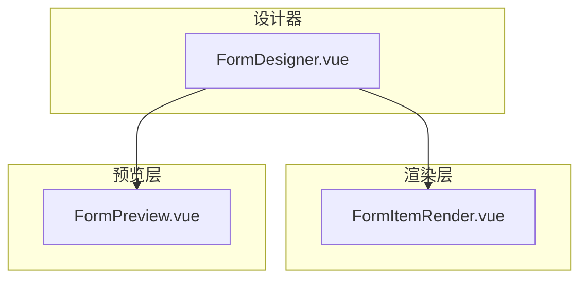
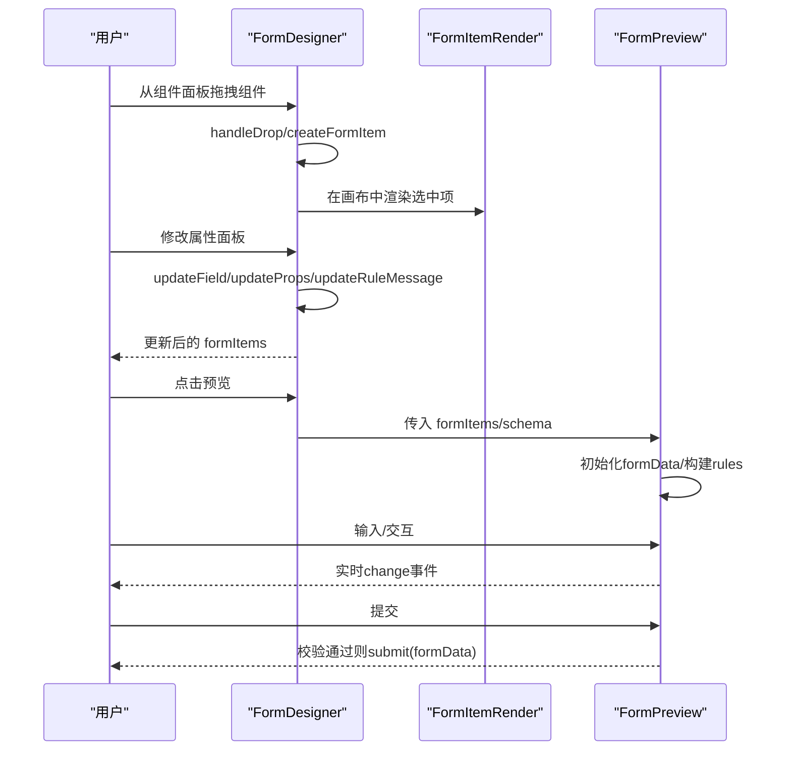
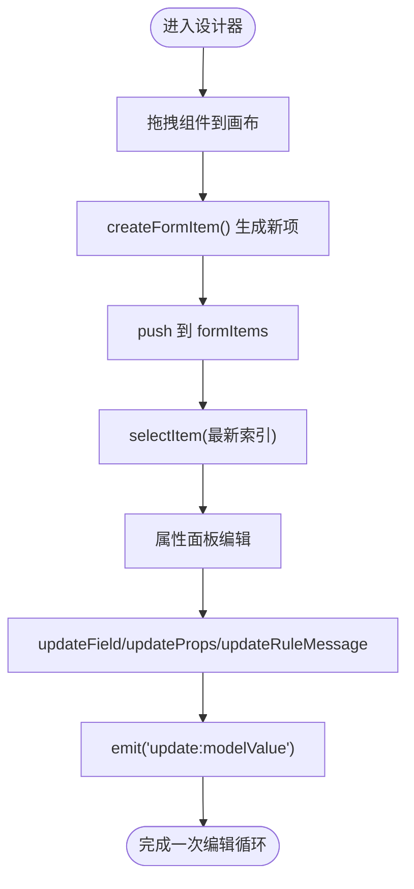
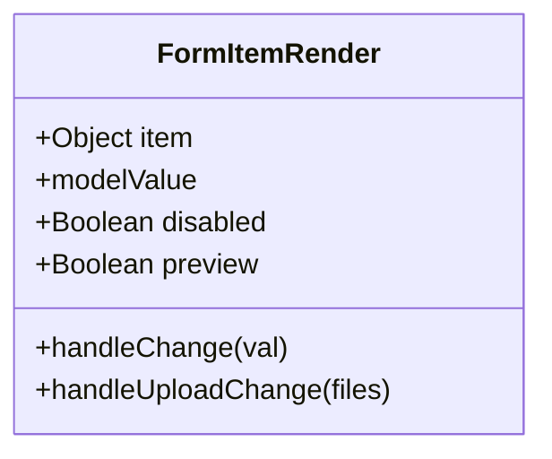
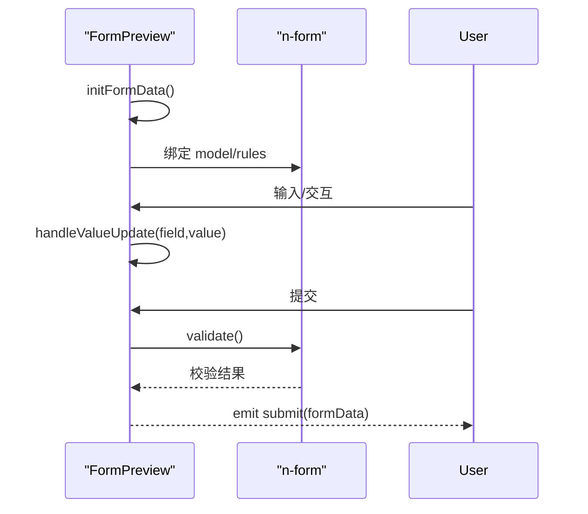
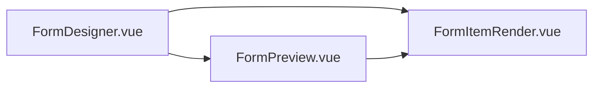

# 表单设计器

<cite>
**本文引用的文件**
- [FormDesigner.vue](file://forge-admin-ui/src/components/form-designer/FormDesigner.vue)
- [FormItemRender.vue](file://forge-admin-ui/src/components/form-designer/FormItemRender.vue)
- [FormPreview.vue](file://forge-admin-ui/src/components/form-designer/FormPreview.vue)
</cite>

## 目录
1. [简介](#简介)
2. [项目结构](#项目结构)
3. [核心组件](#核心组件)
4. [架构总览](#架构总览)
5. [详细组件分析](#详细组件分析)
6. [依赖关系分析](#依赖关系分析)
7. [性能考量](#性能考量)
8. [故障排查指南](#故障排查指南)
9. [结论](#结论)
10. [附录](#附录)

## 简介
本技术文档围绕 Forge Admin 的可视化表单设计器，系统性解析其架构与实现机制。重点覆盖 FormDesigner、FormItemRender、FormPreview 三大核心组件的设计模式与交互流程；深入说明表单建模、字段拖拽、属性配置、校验规则、渲染引擎、组件注册、事件处理、数据绑定等关键技术；并给出预览、导出导入、版本管理等实用能力的使用建议与扩展策略。

## 项目结构
表单设计器位于前端工程 forge-admin-ui 的 components/form-designer 目录下，包含三个核心 Vue 单文件组件：
- FormDesigner.vue：可视化设计器主容器，负责组件面板、画布编辑区、属性面板、预览弹窗、导出保存等编排逻辑。
- FormItemRender.vue：通用表单项渲染器，根据 schema 中的 type 动态渲染具体 UI 控件。
- FormPreview.vue：表单预览与运行时验证、提交的数据收集与展示。

图表来源
- [FormDesigner.vue:1-754](file://forge-admin-ui/src/components/form-designer/FormDesigner.vue#L1-L754)
- [FormItemRender.vue:1-362](file://forge-admin-ui/src/components/form-designer/FormItemRender.vue#L1-L362)
- [FormPreview.vue:1-171](file://forge-admin-ui/src/components/form-designer/FormPreview.vue#L1-L171)

章节来源
- [FormDesigner.vue:1-754](file://forge-admin-ui/src/components/form-designer/FormDesigner.vue#L1-L754)
- [FormItemRender.vue:1-362](file://forge-admin-ui/src/components/form-designer/FormItemRender.vue#L1-L362)
- [FormPreview.vue:1-171](file://forge-admin-ui/src/components/form-designer/FormPreview.vue#L1-L171)

## 核心组件
- FormDesigner（设计器）
  - 职责：左侧组件面板（基础/高级/布局）、中间画布（拖拽排序、增删改）、右侧属性面板（字段名、标签、占位、默认值、必填/禁用、类型专属属性、校验消息）、工具栏（清空、预览、导出JSON、保存）。
  - 关键能力：vuedraggable 驱动列表拖拽；本地状态维护 formItems、selectedIndex、currentItem；通过 emit('update:modelValue', ...) 双向同步父级；暴露 getFormSchema/setFormSchema 方法供外部控制。
- FormItemRender（渲染器）
  - 职责：根据 item.type 选择对应 UI 组件进行渲染；统一处理 value 的双向绑定与 change 事件；支持 disabled、preview 模式；内置 upload 的文件列表与 URL 提取。
  - 关键能力：internalValue 内部缓存；watch modelValue 同步；handleChange 触发 update:modelValue 与 change 事件。
- FormPreview（预览）
  - 职责：基于 n-form + rules 进行运行时校验；初始化 formData（支持 defaultValue 与类型默认值）；提供重置、提交、获取/设置数据、validate 等方法；实时展示 JSON 数据。
  - 关键能力：computed 生成 formRules；watch actualFormItems 变化重建数据；emit submit/change 给上层。

章节来源
- [FormDesigner.vue:313-574](file://forge-admin-ui/src/components/form-designer/FormDesigner.vue#L313-L574)
- [FormItemRender.vue:296-344](file://forge-admin-ui/src/components/form-designer/FormItemRender.vue#L296-L344)
- [FormPreview.vue:33-156](file://forge-admin-ui/src/components/form-designer/FormPreview.vue#L33-L156)

## 架构总览
设计器采用“配置即视图”的声明式架构：
- 配置模型：formItems 数组，每项包含 type、field、label、defaultValue、required、disabled、props、rules 等元信息。
- 渲染引擎：FormItemRender 依据 type 分发到具体 UI 组件，形成“schema -> 组件实例”的映射。
- 交互流：FormDesigner 管理状态与用户操作，将变更写回 formItems；FormPreview 以只读或可交互方式运行同一套 schema，完成校验与数据收集。

图表来源
- [FormDesigner.vue:456-558](file://forge-admin-ui/src/components/form-designer/FormDesigner.vue#L456-L558)
- [FormItemRender.vue:296-344](file://forge-admin-ui/src/components/form-designer/FormItemRender.vue#L296-L344)
- [FormPreview.vue:50-156](file://forge-admin-ui/src/components/form-designer/FormPreview.vue#L50-L156)

## 详细组件分析

### FormDesigner 组件分析
- 设计模式
  - 组合模式：将“组件面板/画布/属性面板/工具栏”组合为完整设计器。
  - 受控组件：通过 v-model 与父组件双向同步 formItems。
  - 命令式 API：暴露 getFormSchema/setFormSchema 供外部程序化控制。
- 关键流程
  - 拖拽新增：handleDragStart 携带组件元信息，handleDrop 创建新项并追加至 formItems。
  - 属性编辑：updateField/updateProps/updateOption/updateRuleMessage 同步到当前选中项并触发变更。
  - 导出/保存：handleExport 生成 JSON 下载；handleSave 向上抛出保存事件。
- 数据结构
  - formItems：[{type, field, label, defaultValue, required, disabled, props:{...}, rules:[{required,message}]}]
  - selectedIndex/currentItem：用于属性面板联动编辑。
- 复杂度与优化点
  - 列表渲染：使用 vuedraggable 的 key 与动画，避免不必要的重排。
  - 深拷贝：currentItem 使用 JSON.parse(JSON.stringify(...)) 避免直接污染源数据。
  - 可扩展性：组件清单集中定义，便于后续接入更多类型。

图表来源
- [FormDesigner.vue:456-558](file://forge-admin-ui/src/components/form-designer/FormDesigner.vue#L456-L558)

章节来源
- [FormDesigner.vue:1-754](file://forge-admin-ui/src/components/form-designer/FormDesigner.vue#L1-L754)

### FormItemRender 组件分析
- 设计模式
  - 策略分发：按 item.type 分支渲染不同 UI 组件，形成“类型 -> 渲染策略”。
  - 受控输入：通过 modelValue 与 internalValue 双缓冲，确保预览/编辑模式下的行为一致。
- 关键流程
  - 值同步：watch modelValue -> internalValue；handleChange 触发 update:modelValue 与 change。
  - 上传处理：handleUploadChange 提取 URL 列表并作为值上报。
- 数据结构
  - item：包含 type、label、required、disabled、props、rules。
  - internalValue：当前显示值，初始来源于 modelValue 或 item.defaultValue。
- 复杂度与优化点
  - 条件渲染：大量 v-if/v-else-if，适合未来抽象为“注册表+映射表”以提升可维护性。
  - 事件冒泡：统一通过 handleChange 派发，减少重复代码。

图表来源
- [FormItemRender.vue:296-344](file://forge-admin-ui/src/components/form-designer/FormItemRender.vue#L296-L344)

章节来源
- [FormItemRender.vue:1-362](file://forge-admin-ui/src/components/form-designer/FormItemRender.vue#L1-L362)

### FormPreview 组件分析
- 设计模式
  - 运行时表单：基于 n-form 的 rules 进行校验，封装 reset/submit/validate 等常用操作。
  - 计算属性：formRules 由 actualFormItems 动态推导，保证规则与结构同步。
- 关键流程
  - 初始化：initFormData 根据 defaultValue 与类型默认值填充 formData。
  - 交互：handleValueUpdate 更新 formData 并触发 change 事件。
  - 提交：handleSubmit 调用 validate，通过后 emit submit。
- 数据结构
  - formData：键为 field，值为当前输入值。
  - formRules：键为 field，值为校验规则数组。
- 复杂度与优化点
  - 监听 actualFormItems 变化重建数据，注意 deep watch 的性能开销，可在大数据量时考虑增量更新。

图表来源
- [FormPreview.vue:50-156](file://forge-admin-ui/src/components/form-designer/FormPreview.vue#L50-L156)

章节来源
- [FormPreview.vue:1-171](file://forge-admin-ui/src/components/form-designer/FormPreview.vue#L1-L171)

## 依赖关系分析
- 组件间耦合
  - FormDesigner 依赖 FormItemRender 进行画布内渲染，依赖 FormPreview 进行预览弹窗。
  - FormPreview 依赖 FormItemRender 复用渲染逻辑，保证设计与预览一致性。
- 外部依赖
  - vuedraggable：用于画布列表拖拽排序。
  - Naive UI：n-form、n-input、n-select 等基础组件。
- 潜在循环依赖
  - 当前无循环引用，单向依赖清晰。

图表来源
- [FormDesigner.vue:1-754](file://forge-admin-ui/src/components/form-designer/FormDesigner.vue#L1-L754)
- [FormItemRender.vue:1-362](file://forge-admin-ui/src/components/form-designer/FormItemRender.vue#L1-L362)
- [FormPreview.vue:1-171](file://forge-admin-ui/src/components/form-designer/FormPreview.vue#L1-L171)

章节来源
- [FormDesigner.vue:1-754](file://forge-admin-ui/src/components/form-designer/FormDesigner.vue#L1-L754)
- [FormItemRender.vue:1-362](file://forge-admin-ui/src/components/form-designer/FormItemRender.vue#L1-L362)
- [FormPreview.vue:1-171](file://forge-admin-ui/src/components/form-designer/FormPreview.vue#L1-L171)

## 性能考量
- 渲染性能
  - 列表项较多时，建议使用虚拟滚动或分页加载；当前实现为全量渲染，适合中小规模表单。
  - 条件渲染分支较多，可考虑将类型映射抽取为注册表，降低模板体积与维护成本。
- 状态同步
  - currentItem 使用深拷贝避免污染源数据，但频繁深拷贝在大对象场景有开销，可改为局部浅拷贝或增量更新。
- 事件频率
  - 高频输入（如滑块、数字输入）可通过防抖节流减少 update:modelValue 次数，降低父组件重渲染压力。
- 校验性能
  - 表单规则由 computed 生成，若字段数量大，可考虑按需生成或延迟构建规则。

[本节为通用性能建议，不直接分析具体文件]

## 故障排查指南
- 拖拽后未生效
  - 检查 dataTransfer 是否携带 component 数据；确认 handleDrop 是否正确解析并 push 到 formItems。
  - 参考路径：[FormDesigner.vue:456-473](file://forge-admin-ui/src/components/form-designer/FormDesigner.vue#L456-L473)
- 属性修改未同步
  - 确认 updateField/updateProps 是否同时更新 currentItem 与 formItems，并触发 emitChange。
  - 参考路径：[FormDesigner.vue:399-448](file://forge-admin-ui/src/components/form-designer/FormDesigner.vue#L399-L448)
- 预览校验不触发
  - 检查 formRules 是否基于 actualFormItems 正确生成；确认 n-form 的 ref 与 validate 调用。
  - 参考路径：[FormPreview.vue:60-73](file://forge-admin-ui/src/components/form-designer/FormPreview.vue#L60-L73)、[FormPreview.vue:119-128](file://forge-admin-ui/src/components/form-designer/FormPreview.vue#L119-L128)
- 上传字段值异常
  - 检查 handleUploadChange 是否正确提取 URL 列表并调用 handleChange。
  - 参考路径：[FormItemRender.vue:338-343](file://forge-admin-ui/src/components/form-designer/FormItemRender.vue#L338-L343)

章节来源
- [FormDesigner.vue:456-473](file://forge-admin-ui/src/components/form-designer/FormDesigner.vue#L456-L473)
- [FormDesigner.vue:399-448](file://forge-admin-ui/src/components/form-designer/FormDesigner.vue#L399-L448)
- [FormPreview.vue:60-73](file://forge-admin-ui/src/components/form-designer/FormPreview.vue#L60-L73)
- [FormPreview.vue:119-128](file://forge-admin-ui/src/components/form-designer/FormPreview.vue#L119-L128)
- [FormItemRender.vue:338-343](file://forge-admin-ui/src/components/form-designer/FormItemRender.vue#L338-L343)

## 结论
该表单设计器以“配置即视图”为核心思想，通过 FormDesigner 编排交互、FormItemRender 统一渲染、FormPreview 实现运行时校验与数据收集，形成了清晰、可扩展的可视化表单解决方案。当前实现已覆盖常见字段类型、拖拽编辑、属性配置、校验与预览导出等能力。后续可通过组件注册表、虚拟滚动、规则按需生成等手段进一步提升可维护性与性能。

[本节为总结性内容，不直接分析具体文件]

## 附录

### 表单建模规范
- 字段项结构
  - type：组件类型标识（input/select/datePicker 等）
  - field：唯一字段名
  - label：显示标签
  - defaultValue：默认值
  - required/disabled：必填/禁用
  - props：组件特有属性集合
  - rules：校验规则数组（至少包含 message）
- 示例字段项结构（示意）
  - {type:'input', field:'name', label:'姓名', defaultValue:'', required:true, disabled:false, props:{placeholder:'请输入', clearable:true}, rules:[{required:true,message:'请输入姓名'}]}

章节来源
- [FormDesigner.vue:332-361](file://forge-admin-ui/src/components/form-designer/FormDesigner.vue#L332-L361)
- [FormDesigner.vue:475-488](file://forge-admin-ui/src/components/form-designer/FormDesigner.vue#L475-L488)

### 字段拖拽与排序
- 拖拽新增：从左侧面板拖入画布，自动创建新字段并选中。
- 排序调整：通过 vuedraggable 的 handle 进行行内排序。
- 复制/删除：支持快速复制与删除字段。

章节来源
- [FormDesigner.vue:110-140](file://forge-admin-ui/src/components/form-designer/FormDesigner.vue#L110-L140)
- [FormDesigner.vue:456-514](file://forge-admin-ui/src/components/form-designer/FormDesigner.vue#L456-L514)

### 属性配置与校验规则
- 基础属性：字段名、标签、占位、默认值、必填/禁用。
- 类型专属属性：如 select 的 options、datePicker 的 type/format、upload 的 maxCount/maxSize/accept 等。
- 校验规则：支持必填提示语配置，运行时由 FormPreview 生成 rules。

章节来源
- [FormDesigner.vue:150-303](file://forge-admin-ui/src/components/form-designer/FormDesigner.vue#L150-L303)
- [FormPreview.vue:60-73](file://forge-admin-ui/src/components/form-designer/FormPreview.vue#L60-L73)

### 渲染引擎与组件注册
- 渲染引擎：FormItemRender 根据 type 分发到具体 UI 组件，实现“schema -> 组件”的动态渲染。
- 组件注册建议：可将 type 与组件映射抽离为注册表，便于扩展与维护。

章节来源
- [FormItemRender.vue:1-293](file://forge-admin-ui/src/components/form-designer/FormItemRender.vue#L1-L293)

### 事件处理与数据绑定
- 事件：统一通过 handleChange 派发 update:modelValue 与 change，简化子组件事件处理。
- 数据绑定：FormPreview 使用 n-form 的 model/rule 进行双向绑定与校验；FormDesigner 通过 v-model 与父组件同步。

章节来源
- [FormItemRender.vue:320-344](file://forge-admin-ui/src/components/form-designer/FormItemRender.vue#L320-L344)
- [FormPreview.vue:50-106](file://forge-admin-ui/src/components/form-designer/FormPreview.vue#L50-L106)

### 预览、导出导入与版本管理
- 预览：FormPreview 提供重置、提交、校验与数据展示。
- 导出：FormDesigner 支持导出 JSON 文件。
- 导入：可在父组件中读取 JSON 并通过 setFormSchema 设置到设计器。
- 版本管理：建议在业务层对 formItems 进行版本化存储（如版本号、变更记录），以便回溯与对比。

章节来源
- [FormDesigner.vue:533-568](file://forge-admin-ui/src/components/form-designer/FormDesigner.vue#L533-L568)
- [FormPreview.vue:113-156](file://forge-admin-ui/src/components/form-designer/FormPreview.vue#L113-L156)

### 扩展开发指南
- 新增字段类型
  - 在 FormDesigner 的组件清单中添加新类型与默认 props。
  - 在 FormItemRender 中增加对应的渲染分支。
  - 在属性面板中为新类型添加专属属性编辑器。
- 自定义校验规则
  - 在 rules 中扩展自定义校验函数，或在 FormPreview 中合并全局规则。
- 主题与样式
  - 通过 CSS 变量或主题配置统一风格；避免在组件内硬编码颜色。

章节来源
- [FormDesigner.vue:332-361](file://forge-admin-ui/src/components/form-designer/FormDesigner.vue#L332-L361)
- [FormItemRender.vue:1-293](file://forge-admin-ui/src/components/form-designer/FormItemRender.vue#L1-L293)
- [FormDesigner.vue:150-303](file://forge-admin-ui/src/components/form-designer/FormDesigner.vue#L150-L303)