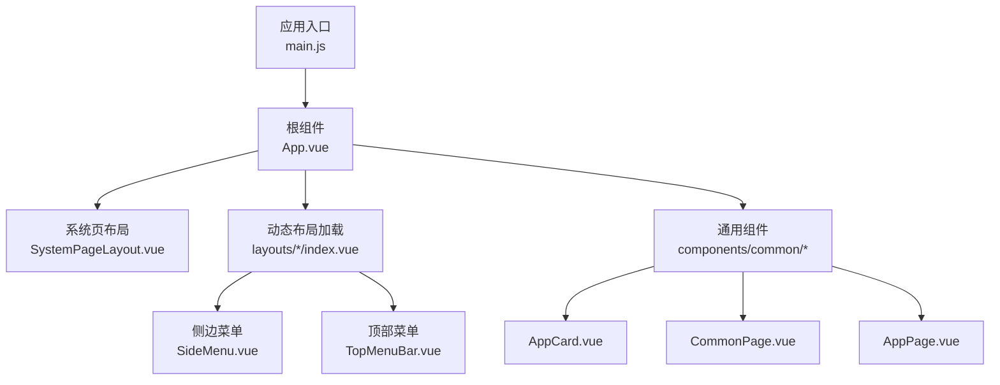
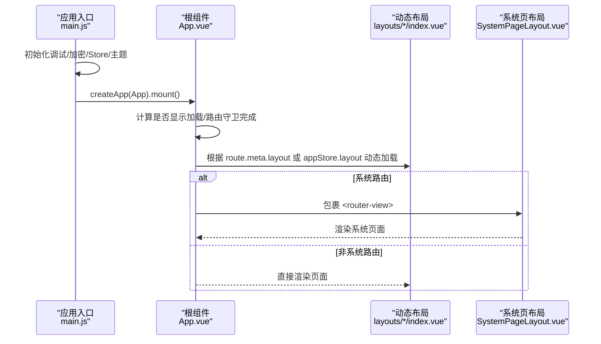
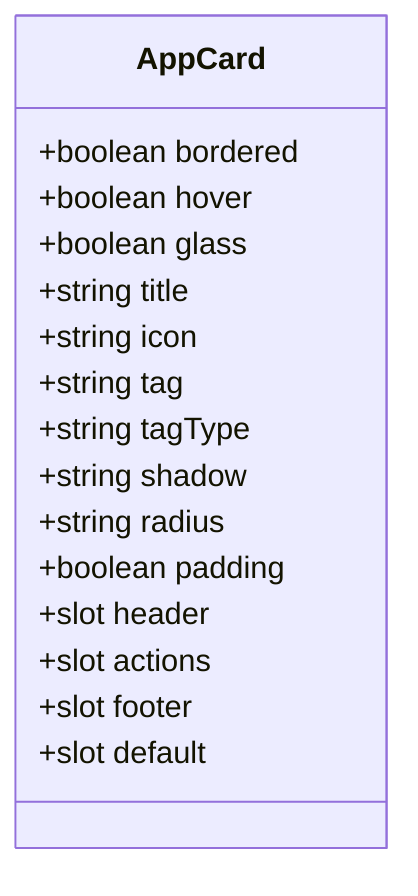
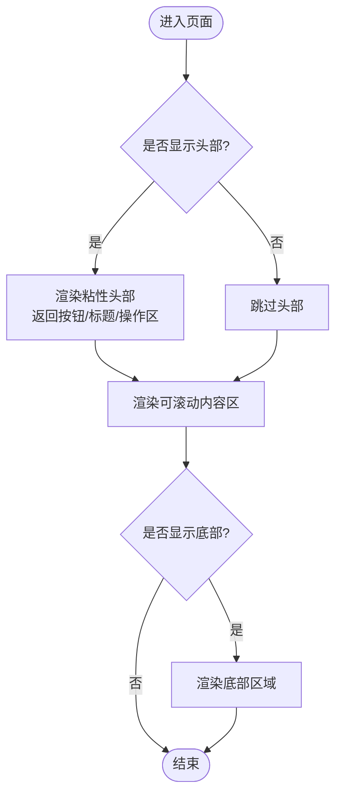
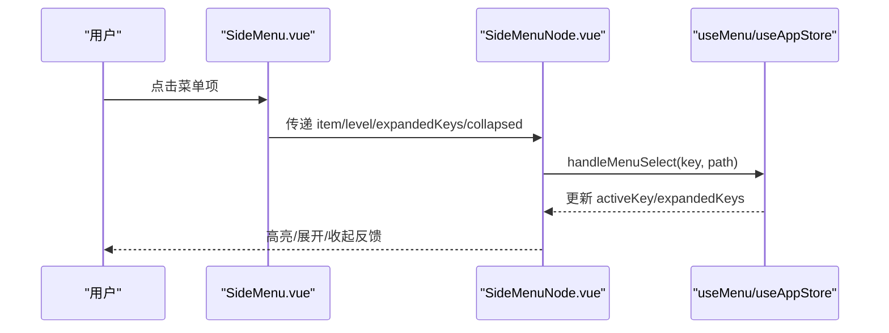
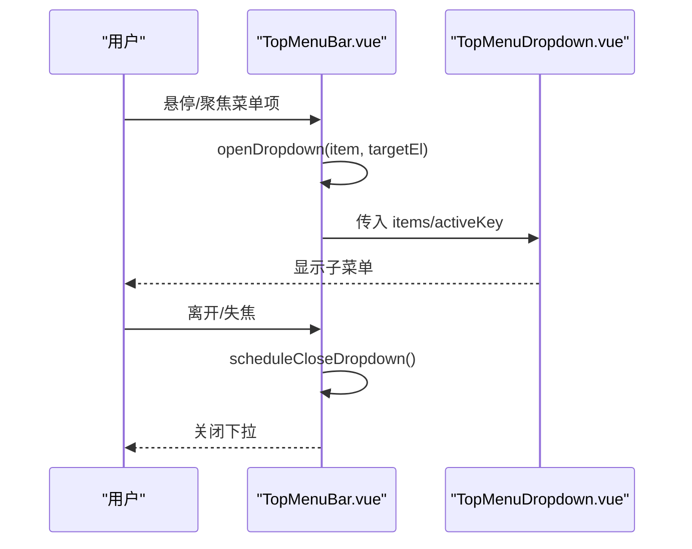
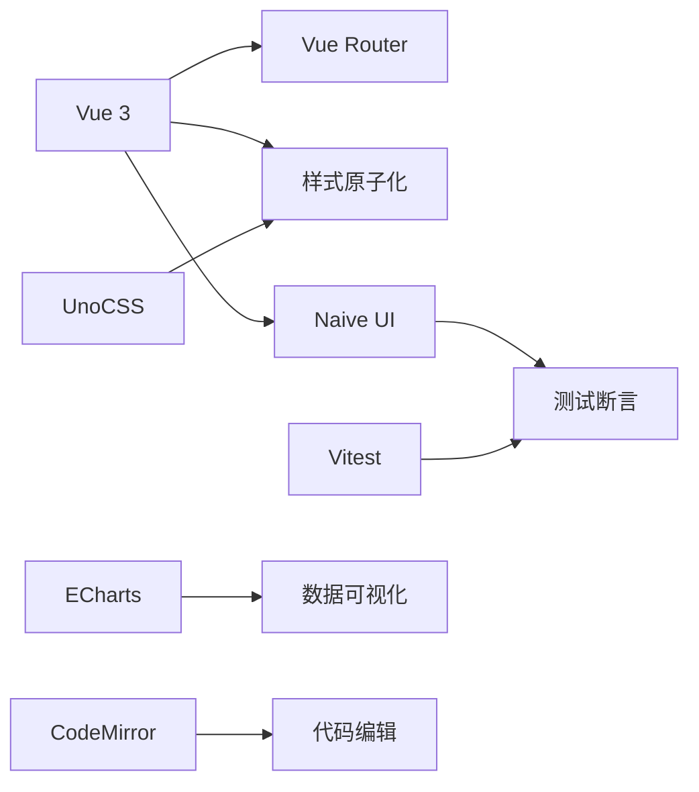

# 通用组件库

<cite>
**本文引用的文件**
- [main.js](file://forge-admin-ui/src/main.js)
- [App.vue](file://forge-admin-ui/src/App.vue)
- [package.json](file://forge-admin-ui/package.json)
- [AppCard.vue](file://forge-admin-ui/src/components/common/AppCard.vue)
- [CommonPage.vue](file://forge-admin-ui/src/components/common/CommonPage.vue)
- [AppPage.vue](file://forge-admin-ui/src/components/common/AppPage.vue)
- [SystemPageLayout.vue](file://forge-admin-ui/src/components/common/SystemPageLayout.vue)
- [SideMenu.vue](file://forge-admin-ui/src/layouts/components/SideMenu.vue)
- [TopMenuBar.vue](file://forge-admin-ui/src/layouts/components/TopMenuBar.vue)
</cite>

## 目录
1. [简介](#简介)
2. [项目结构](#项目结构)
3. [核心组件](#核心组件)
4. [架构总览](#架构总览)
5. [详细组件分析](#详细组件分析)
6. [依赖关系分析](#依赖关系分析)
7. [性能考虑](#性能考虑)
8. [故障排查指南](#故障排查指南)
9. [结论](#结论)
10. [附录](#附录)

## 简介
本技术文档聚焦 Forge Admin 前端通用组件库，围绕基础 UI 组件的设计模式与实现细节展开，重点解析页面布局组件、用户交互组件与数据展示组件。文档深入说明 AppCard、CommonPage、SystemPageLayout 等核心布局组件的架构设计、使用方式与扩展点；同时覆盖主题定制、响应式设计、可访问性支持等关键特性，并提供 API 文档、使用示例、样式定制指南、最佳实践、测试策略、性能优化技巧与集成方案，帮助开发者快速掌握并高效复用该组件库。

## 项目结构
Forge Admin 的前端工程采用模块化组织：
- 应用入口负责初始化主题、路由、状态管理与全局能力（如 Naive UI 离散 API、调试控制台、加密配置）。
- 根组件 App.vue 提供全局配置容器、动态布局加载、系统页布局包裹、水印与全局加载遮罩。
- 通用组件位于 components/common，提供卡片、页面骨架、表格单元格、全局加载等基础能力。
- 布局体系位于 layouts，包含侧边菜单、顶部菜单、多套布局模板及公共子组件。

图表来源
- [main.js:20-50](file://forge-admin-ui/src/main.js#L20-L50)
- [App.vue:1-40](file://forge-admin-ui/src/App.vue#L1-L40)
- [SideMenu.vue:1-20](file://forge-admin-ui/src/layouts/components/SideMenu.vue#L1-L20)
- [TopMenuBar.vue:1-20](file://forge-admin-ui/src/layouts/components/TopMenuBar.vue#L1-L20)

章节来源
- [main.js:20-50](file://forge-admin-ui/src/main.js#L20-L50)
- [App.vue:1-40](file://forge-admin-ui/src/App.vue#L1-L40)

## 核心组件
- AppCard：增强型卡片容器，支持标题、图标、标签、操作区、底部区域、边框、悬停、玻璃态、阴影与圆角等属性，适用于内容区块封装。
- CommonPage：标准页面布局组件，提供粘性头部、返回按钮、标题装饰条、操作区插槽、可滚动内容区与可选底部区域。
- AppPage：轻量级页面容器，支持全屏模式、底部回顶与可选底部区域。
- SystemPageLayout：系统页面布局容器，为系统路由下的页面提供统一背景与高度约束。

章节来源
- [AppCard.vue:1-86](file://forge-admin-ui/src/components/common/AppCard.vue#L1-L86)
- [CommonPage.vue:1-97](file://forge-admin-ui/src/components/common/CommonPage.vue#L1-L97)
- [AppPage.vue:1-25](file://forge-admin-ui/src/components/common/AppPage.vue#L1-L25)
- [SystemPageLayout.vue:1-25](file://forge-admin-ui/src/components/common/SystemPageLayout.vue#L1-L25)

## 架构总览
应用启动流程与渲染路径：
- main.js 初始化调试控制台、加密配置、Store、Naive UI 离散 API、指令、主题配置、企微免登、路由后挂载应用。
- App.vue 作为根组件，提供 Naive UI 配置容器、对话框与消息提供者、动态布局加载、系统页布局包裹、KeepAlive 缓存、水印与全局加载遮罩。
- 布局通过 import.meta.glob 动态按需加载，避免首屏冗余。
- 系统路由以 SystemPageLayout 包裹，非系统路由直接渲染。

图表来源
- [main.js:20-50](file://forge-admin-ui/src/main.js#L20-L50)
- [App.vue:18-33](file://forge-admin-ui/src/App.vue#L18-L33)
- [SystemPageLayout.vue:1-25](file://forge-admin-ui/src/components/common/SystemPageLayout.vue#L1-L25)

章节来源
- [main.js:20-50](file://forge-admin-ui/src/main.js#L20-L50)
- [App.vue:18-33](file://forge-admin-ui/src/App.vue#L18-L33)

## 详细组件分析

### AppCard 组件
- 设计模式：容器型复合组件，采用具名插槽（header、actions、footer）与默认插槽组合，支持丰富的外观属性控制。
- 关键特性：
  - 外观：边框、悬停效果、玻璃态、阴影级别、圆角级别、内边距开关。
  - 交互：鼠标位置追踪用于光效（可选），事件冒泡友好。
  - 主题：大量使用 CSS 变量与 dark 类适配暗色模式。
- 复杂度：O(1) 渲染，无复杂算法；样式层通过 CSS 变量与伪元素提升性能。
- 错误处理：属性校验通过 validator 限制取值范围，避免非法状态。
- 性能：scoped 样式与条件渲染减少重排；hover/glass 使用 GPU 加速属性（transform、opacity）。

图表来源
- [AppCard.vue:42-86](file://forge-admin-ui/src/components/common/AppCard.vue#L42-L86)

章节来源
- [AppCard.vue:1-245](file://forge-admin-ui/src/components/common/AppCard.vue#L1-L245)

### CommonPage 组件
- 设计模式：页面骨架组件，将头部、内容区、底部解耦，通过 props 控制显隐与行为。
- 关键特性：
  - 粘性头部：sticky top 定位，确保操作区始终可见。
  - 返回按钮：基于路由实例 back 方法，便于快速返回。
  - 标题装饰条：视觉引导，提升层级感。
  - 插槽扩展：header、title-prefix、title-suffix、action、footer 灵活组合。
- 复杂度：O(1) 渲染；滚动区域通过 cus-scroll 类管理。
- 可访问性：语义化标签 main/h2，按钮具备可点击性与焦点样式。
- 性能：条件渲染减少 DOM；插槽内容按需注入。

图表来源
- [CommonPage.vue:1-55](file://forge-admin-ui/src/components/common/CommonPage.vue#L1-L55)

章节来源
- [CommonPage.vue:1-97](file://forge-admin-ui/src/components/common/CommonPage.vue#L1-L97)

### AppPage 组件
- 设计模式：轻量页面容器，提供全屏模式与回顶按钮，适合简单页面或嵌入场景。
- 关键特性：full 模式占满剩余空间；showFooter 控制底部；内置 n-back-top。
- 复杂度：O(1)；样式简洁，易于组合。
- 适用场景：无需复杂头部的独立页面或弹窗内嵌页面。

章节来源
- [AppPage.vue:1-25](file://forge-admin-ui/src/components/common/AppPage.vue#L1-L25)

### SystemPageLayout 组件
- 设计模式：系统级页面容器，提供统一的背景与高度约束，保证系统页面在布局中稳定渲染。
- 关键特性：height: 100%、min-height: 0、背景色使用 CSS 变量，兼容暗色模式。
- 适用场景：/system/* 路由下的页面统一包装。

章节来源
- [SystemPageLayout.vue:1-25](file://forge-admin-ui/src/components/common/SystemPageLayout.vue#L1-L25)

### 侧边菜单 SideMenu
- 设计模式：递归菜单树渲染，结合 useMenu 组合式函数处理选中与展开状态。
- 关键特性：
  - 折叠态：collapsed 时仅显示图标，隐藏文本与箭头。
  - 展开逻辑：根据当前激活项自动展开祖先节点。
  - 交互：选择项触发路由跳转；支持父子菜单展开/收起。
  - 可访问性：aria-label 标注导航区域。
- 复杂度：菜单遍历 O(n)，展开计算 O(k)（k 为祖先链长度）。
- 性能：滚动区域自定义滚动条；hover/active 使用 transform 与 opacity 提升性能。

图表来源
- [SideMenu.vue:1-100](file://forge-admin-ui/src/layouts/components/SideMenu.vue#L1-L100)

章节来源
- [SideMenu.vue:1-412](file://forge-admin-ui/src/layouts/components/SideMenu.vue#L1-L412)

### 顶部菜单 TopMenuBar
- 设计模式：横向可滚动菜单，支持下拉子菜单与滚动指示器。
- 关键特性：
  - 滚动：左右箭头平滑滚动，ResizeObserver 监听尺寸变化。
  - 下拉：hover/focus 打开子菜单，离开延迟关闭，防抖避免抖动。
  - 可访问性：aria-current、aria-haspopup、role="menu"。
  - 主题：CSS 变量驱动颜色与字体缩放。
- 复杂度：O(n) 渲染；下拉定位计算 O(1)。
- 性能：动画使用 transform/opacity；滚动条隐藏但保留滚动能力。

图表来源
- [TopMenuBar.vue:157-186](file://forge-admin-ui/src/layouts/components/TopMenuBar.vue#L157-L186)

章节来源
- [TopMenuBar.vue:1-457](file://forge-admin-ui/src/layouts/components/TopMenuBar.vue#L1-L457)

## 依赖关系分析
- 运行时依赖：Vue 3、Naive UI、Pinia、Vue Router、UnoCSS、ECharts、CodeMirror、FormCreate 等。
- 构建与工具：Vite、ESLint、Vitest、Unplugin 系列、Rollup Visualizer。
- 主题与样式：通过 CSS 变量与 UnoCSS 原子类实现主题与响应式；Naive UI 主题覆盖通过 store 管理。

图表来源
- [package.json:19-73](file://forge-admin-ui/package.json#L19-L73)
- [package.json:75-105](file://forge-admin-ui/package.json#L75-L105)

章节来源
- [package.json:19-105](file://forge-admin-ui/package.json#L19-L105)

## 性能考虑
- 首屏优化：
  - 动态布局加载：通过 import.meta.glob 按需引入布局，减少初始包体积。
  - KeepAlive 缓存：对常用视图进行缓存，避免重复渲染。
  - 主题与样式：使用 CSS 变量与 UnoCSS 原子类，减少重复样式与重绘。
- 交互优化：
  - 菜单与下拉：使用 transform/opacity 动画，GPU 加速；延迟关闭避免频繁切换。
  - 滚动区域：自定义滚动条与 ResizeObserver 精确控制滚动状态。
- 内存与资源：
  - 组件销毁时清理定时器与观察者，防止内存泄漏。
  - 图片与图标：按需加载与懒加载，减少带宽占用。
- 可维护性：
  - 组件职责单一：容器、布局、交互分离，便于单元测试与回归测试。
  - 主题集中管理：通过 store 与 CSS 变量统一管理，降低样式耦合。

[本节为通用指导，不直接分析具体文件]

## 故障排查指南
- 页面白屏或加载卡住：
  - 检查路由守卫是否完成，避免菜单接口异常导致永久 loading。
  - 确认动态布局模块是否存在且可被正确解析。
- 主题不生效：
  - 确认 applyThemeConfig 已调用，且 store 中的 themeConfig 正确。
  - 检查 dark 类与 CSS 变量是否按预期注入。
- 菜单无法展开或选中：
  - 检查 useMenu 的 processedMenus 与 activeKey 是否正确同步。
  - 确认 SideMenuNode 的事件冒泡未被阻止。
- 顶部菜单下拉错位：
  - 检查 updateDropdownPosition 的计算与视口边界处理。
  - 确认 ResizeObserver 正常监听容器尺寸变化。

章节来源
- [App.vue:101-122](file://forge-admin-ui/src/App.vue#L101-L122)
- [SideMenu.vue:68-99](file://forge-admin-ui/src/layouts/components/SideMenu.vue#L68-L99)
- [TopMenuBar.vue:140-186](file://forge-admin-ui/src/layouts/components/TopMenuBar.vue#L140-L186)

## 结论
Forge Admin 通用组件库以清晰的层次与职责划分，提供了稳定的页面布局与丰富的基础组件。AppCard、CommonPage、SystemPageLayout 等组件通过插槽与属性组合，满足多样化业务需求；侧边与顶部菜单组件在交互与可访问性方面表现良好。结合主题定制、响应式设计与性能优化策略，开发者可以快速构建一致、高效、易维护的管理后台界面。

[本节为总结，不直接分析具体文件]

## 附录

### 组件 API 速查
- AppCard
  - 属性：bordered、hover、glass、title、icon、tag、tagType、shadow、radius、padding
  - 插槽：header、actions、footer、default
  - 用途：内容区块封装，支持多种外观与交互
- CommonPage
  - 属性：back、showFooter、showHeader、title
  - 插槽：header、title-prefix、title-suffix、action、footer
  - 用途：标准页面骨架，含粘性头部与可滚动内容
- AppPage
  - 属性：full、showFooter
  - 插槽：default、footer
  - 用途：轻量页面容器，支持全屏与回顶
- SystemPageLayout
  - 插槽：default
  - 用途：系统页面统一容器

章节来源
- [AppCard.vue:42-86](file://forge-admin-ui/src/components/common/AppCard.vue#L42-L86)
- [CommonPage.vue:68-97](file://forge-admin-ui/src/components/common/CommonPage.vue#L68-L97)
- [AppPage.vue:14-23](file://forge-admin-ui/src/components/common/AppPage.vue#L14-L23)
- [SystemPageLayout.vue:1-25](file://forge-admin-ui/src/components/common/SystemPageLayout.vue#L1-L25)

### 使用示例（路径指引）
- 在页面中使用 CommonPage 包裹内容，并通过插槽插入头部与操作区
  - 参考：[CommonPage.vue:1-55](file://forge-admin-ui/src/components/common/CommonPage.vue#L1-L55)
- 使用 AppCard 封装表单或列表区块，设置边框、阴影与圆角
  - 参考：[AppCard.vue:1-86](file://forge-admin-ui/src/components/common/AppCard.vue#L1-L86)
- 在系统路由下使用 SystemPageLayout 包裹页面，确保背景与高度一致
  - 参考：[SystemPageLayout.vue:1-25](file://forge-admin-ui/src/components/common/SystemPageLayout.vue#L1-L25)
- 在布局中使用 SideMenu 与 TopMenuBar 构建导航
  - 参考：[SideMenu.vue:1-100](file://forge-admin-ui/src/layouts/components/SideMenu.vue#L1-L100)、[TopMenuBar.vue:1-120](file://forge-admin-ui/src/layouts/components/TopMenuBar.vue#L1-L120)

### 样式定制指南
- 主题变量：通过 CSS 变量（如 --primary-color、--bg-primary、--border-light）统一控制颜色与边框。
- 暗色模式：使用 .dark 类覆盖变量，确保对比度与可读性。
- 原子样式：利用 UnoCSS 类（如 bg-#f5f6fb、rounded-lg、flex、p-8）快速构建布局。
- 组件覆盖：通过 Naive UI 的 theme-overrides 在 store 中集中管理主题覆盖。

章节来源
- [App.vue:131-149](file://forge-admin-ui/src/App.vue#L131-L149)
- [AppCard.vue:110-245](file://forge-admin-ui/src/components/common/AppCard.vue#L110-L245)

### 最佳实践
- 组件拆分：将页面拆分为布局、容器与业务组件，保持职责单一。
- 插槽优先：通过插槽扩展组件能力，避免过度 props 膨胀。
- 主题一致：统一使用 CSS 变量与原子类，减少样式冲突。
- 性能敏感：对长列表与复杂交互使用虚拟滚动与懒加载。
- 可访问性：为交互元素添加 aria-* 属性与键盘导航支持。

[本节为通用指导，不直接分析具体文件]

### 测试策略
- 单元与集成测试：使用 Vitest 与 @vue/test-utils 对组件进行断言。
- 快照测试：对复杂 UI 结构进行快照比对，防止意外变更。
- 交互测试：模拟用户操作（点击、悬停、滚动）验证菜单与下拉行为。
- 主题测试：切换暗色模式，验证样式变量与类名生效。

章节来源
- [package.json:75-105](file://forge-admin-ui/package.json#L75-L105)

### 集成方案
- 应用入口集成：在 main.js 中初始化 Store、主题、路由与全局能力。
- 布局集成：在 App.vue 中动态加载布局，并根据路由决定系统页布局包裹。
- 组件注册：通过自动导入插件或手动引入 common 组件，按需使用。
- 主题集成：在 store 中管理主题配置，并在 App.vue 中应用覆盖。

章节来源
- [main.js:20-50](file://forge-admin-ui/src/main.js#L20-L50)
- [App.vue:18-40](file://forge-admin-ui/src/App.vue#L18-L40)