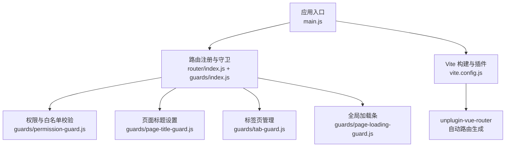
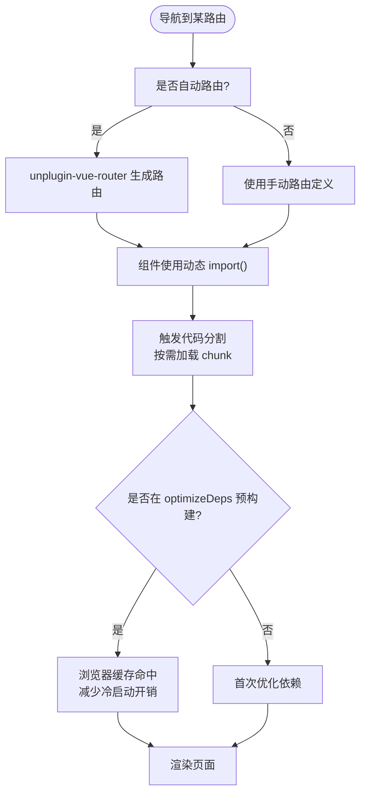
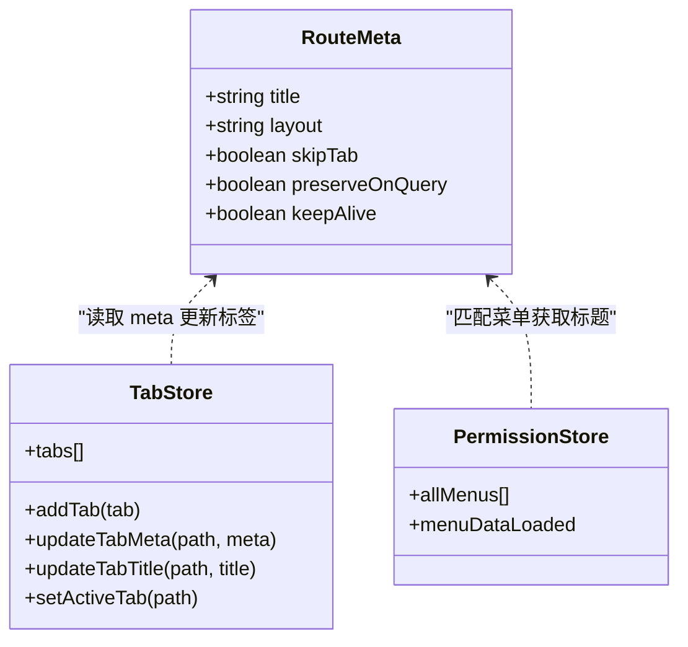
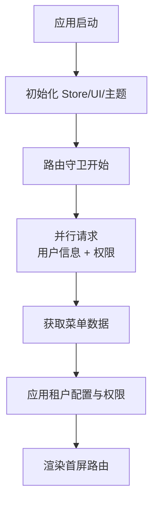
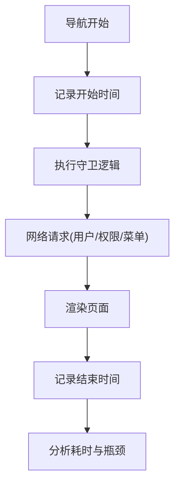
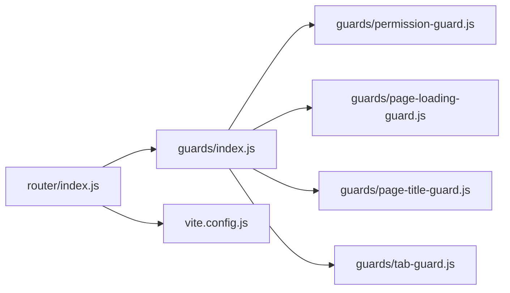

# 懒加载与性能优化

<cite>
**本文引用的文件**
- [vite.config.js](file://forge-admin-ui/vite.config.js)
- [main.js](file://forge-admin-ui/src/main.js)
- [router/index.js](file://forge-admin-ui/src/router/index.js)
- [guards/index.js](file://forge-admin-ui/src/router/guards/index.js)
- [guards/permission-guard.js](file://forge-admin-ui/src/router/guards/permission-guard.js)
- [guards/page-loading-guard.js](file://forge-admin-ui/src/router/guards/page-loading-guard.js)
- [guards/page-title-guard.js](file://forge-admin-ui/src/router/guards/page-title-guard.js)
- [guards/tab-guard.js](file://forge-admin-ui/src/router/guards/tab-guard.js)
</cite>

## 目录
1. [简介](#简介)
2. [项目结构](#项目结构)
3. [核心组件](#核心组件)
4. [架构总览](#架构总览)
5. [详细组件分析](#详细组件分析)
6. [依赖关系分析](#依赖关系分析)
7. [性能考量](#性能考量)
8. [故障排查指南](#故障排查指南)
9. [结论](#结论)
10. [附录](#附录)

## 简介
本技术文档围绕 Forge Admin 前端的路由懒加载与性能优化展开，聚焦 Vue Router 的按需加载机制、路由级代码分割策略、缓存与导航历史优化、首屏加载优化方案、性能监控方法以及 Vite 构建配置中的路由相关优化项。文档基于仓库中实际实现进行解析，并提供可视化图示与可操作的调优建议，帮助读者在复杂业务场景下获得更优的首屏体验与运行时性能。

## 项目结构
Forge Admin 的前端工程采用模块化组织：
- 路由定义位于 src/router 目录，包含自动路由与手动路由合并、守卫编排与页面元信息处理。
- 构建与插件配置集中在 vite.config.js，使用 unplugin-vue-router 自动生成路由并支持按文件目录拆分。
- 应用入口 main.js 负责初始化 Store、UI 全局 API、主题、路由与挂载。



图表来源
- [main.js:20-50](file://forge-admin-ui/src/main.js#L20-L50)
- [router/index.js:263-286](file://forge-admin-ui/src/router/index.js#L263-L286)
- [guards/index.js:6-11](file://forge-admin-ui/src/router/guards/index.js#L6-L11)
- [vite.config.js:21-53](file://forge-admin-ui/vite.config.js#L21-L53)

章节来源
- [main.js:20-50](file://forge-admin-ui/src/main.js#L20-L50)
- [router/index.js:263-286](file://forge-admin-ui/src/router/index.js#L263-L286)
- [vite.config.js:21-53](file://forge-admin-ui/vite.config.js#L21-L53)

## 核心组件
- 路由定义与合并：手动路由与自动路由合并，兜底 404 重定向；支持 Hash 或 History 模式切换。
- 路由守卫体系：加载状态、权限校验、页面标题、标签页管理四大守卫协同工作。
- 构建与分包：通过 Vite 插件与 optimizeDeps 预构建关键依赖，关闭不必要源码映射，选择 oxc 压缩降低内存占用。

章节来源
- [router/index.js:24-286](file://forge-admin-ui/src/router/index.js#L24-L286)
- [guards/index.js:1-11](file://forge-admin-ui/src/router/guards/index.js#L1-L11)
- [vite.config.js:66-109](file://forge-admin-ui/vite.config.js#L66-L109)
- [vite.config.js:160-173](file://forge-admin-ui/vite.config.js#L160-L173)

## 架构总览
下图展示了从应用启动到路由导航的完整流程，包括懒加载、守卫执行、资源预取与页面渲染的关键节点。

```mermaid
sequenceDiagram
participant App as "应用入口<br/>main.js"
participant Router as "路由实例<br/>router/index.js"
participant Guard as "守卫集合<br/>guards/*"
participant Perm as "权限守卫<br/>permission-guard.js"
participant Title as "标题守卫<br/>page-title-guard.js"
participant Tab as "标签守卫<br/>tab-guard.js"
participant Load as "加载守卫<br/>page-loading-guard.js"
participant Build as "构建与分包<br/>vite.config.js"
App->>Router : 创建并使用路由
App->>Guard : 安装守卫
Note over Build : 自动路由生成与按需加载
Router->>Load : beforeEach(开始加载)
Router->>Perm : beforeEach(权限校验/拉取用户与菜单)
Perm-->>Router : 放行或重定向
Router->>Title : afterEach(设置页面标题)
Router->>Tab : afterEach(更新标签页元信息)
Router->>Load : afterEach(结束加载)
Note over Router,Build : 动态 import() 触发代码分割与按需加载
```

图表来源
- [main.js:20-50](file://forge-admin-ui/src/main.js#L20-L50)
- [router/index.js:274-286](file://forge-admin-ui/src/router/index.js#L274-L286)
- [guards/index.js:6-11](file://forge-admin-ui/src/router/guards/index.js#L6-L11)
- [guards/permission-guard.js:87-273](file://forge-admin-ui/src/router/guards/permission-guard.js#L87-L273)
- [guards/page-title-guard.js:51-73](file://forge-admin-ui/src/router/guards/page-title-guard.js#L51-L73)
- [guards/tab-guard.js:71-153](file://forge-admin-ui/src/router/guards/tab-guard.js#L71-L153)
- [guards/page-loading-guard.js:4-53](file://forge-admin-ui/src/router/guards/page-loading-guard.js#L4-L53)
- [vite.config.js:21-53](file://forge-admin-ui/vite.config.js#L21-L53)

## 详细组件分析

### 路由懒加载与代码分割
- 动态 import() 的使用：手动路由中大量使用箭头函数返回 import()，确保仅在访问对应路由时加载组件，减少首包体积。
- 自动路由生成：通过 unplugin-vue-router 扫描 views 目录生成路由，结合 exclude 排除不需要生成路由的目录，进一步控制打包范围。
- 分包与预构建：optimizeDeps.include 显式预构建大依赖（如编辑器、图表、加密库），避免首次进入时的二次优化与浏览器缓存失效问题。



图表来源
- [router/index.js:24-256](file://forge-admin-ui/src/router/index.js#L24-L256)
- [vite.config.js:21-53](file://forge-admin-ui/vite.config.js#L21-L53)
- [vite.config.js:66-109](file://forge-admin-ui/vite.config.js#L66-L109)

章节来源
- [router/index.js:24-256](file://forge-admin-ui/src/router/index.js#L24-L256)
- [vite.config.js:21-53](file://forge-admin-ui/vite.config.js#L21-L53)
- [vite.config.js:66-109](file://forge-admin-ui/vite.config.js#L66-L109)

### 路由级别缓存机制
- 组件实例缓存：通过路由 meta.keepAlive 控制组件是否被 KeepAlive 缓存，减少重复创建与销毁开销。
- 路由元信息缓存：meta.title、layout、skipTab、preserveOnQuery 等元信息用于标题、布局与标签页行为控制，避免重复计算。
- 导航历史优化：afterEach 中统一设置 document.title，避免频繁 DOM 操作；标签页以 fullPath 为 key，避免不同参数页面共享同一标签导致状态污染。



图表来源
- [router/index.js:24-256](file://forge-admin-ui/src/router/index.js#L24-L256)
- [guards/tab-guard.js:71-153](file://forge-admin-ui/src/router/guards/tab-guard.js#L71-L153)
- [guards/page-title-guard.js:51-73](file://forge-admin-ui/src/router/guards/page-title-guard.js#L51-L73)

章节来源
- [guards/tab-guard.js:71-153](file://forge-admin-ui/src/router/guards/tab-guard.js#L71-L153)
- [guards/page-title-guard.js:51-73](file://forge-admin-ui/src/router/guards/page-title-guard.js#L51-L73)
- [router/index.js:24-256](file://forge-admin-ui/src/router/index.js#L24-L256)

### 首屏加载优化方案
- 关键路由预加载：登录、首页、常用功能路由优先加载，减少首屏等待时间。
- 资源预取：optimizeDeps 预构建大依赖，提升首次访问命中率。
- 并行加载策略：在权限守卫中并行请求用户信息与权限数据，缩短整体阻塞时间。



图表来源
- [guards/permission-guard.js:150-191](file://forge-admin-ui/src/router/guards/permission-guard.js#L150-L191)
- [guards/permission-guard.js:213-256](file://forge-admin-ui/src/router/guards/permission-guard.js#L213-L256)
- [vite.config.js:66-109](file://forge-admin-ui/vite.config.js#L66-L109)

章节来源
- [guards/permission-guard.js:150-191](file://forge-admin-ui/src/router/guards/permission-guard.js#L150-L191)
- [guards/permission-guard.js:213-256](file://forge-admin-ui/src/router/guards/permission-guard.js#L213-L256)
- [vite.config.js:66-109](file://forge-admin-ui/vite.config.js#L66-L109)

### 路由性能监控方法
- 加载时间统计：利用 page-loading-guard 的 before/after 钩子记录导航耗时，结合 $loadingBar 反馈用户体验。
- 内存使用分析：构建阶段关闭 sourcemap、reportCompressedSize，使用 oxc 压缩器降低内存占用，便于长时间运行稳定性。
- 网络请求优化：在权限守卫中完成密钥交换后再发起加密接口请求，避免无效重试；WebSocket 客户端在成功获取用户信息后初始化，减少无用连接。



图表来源
- [guards/page-loading-guard.js:4-53](file://forge-admin-ui/src/router/guards/page-loading-guard.js#L4-L53)
- [guards/permission-guard.js:87-273](file://forge-admin-ui/src/router/guards/permission-guard.js#L87-L273)
- [vite.config.js:160-173](file://forge-admin-ui/vite.config.js#L160-L173)

章节来源
- [guards/page-loading-guard.js:4-53](file://forge-admin-ui/src/router/guards/page-loading-guard.js#L4-L53)
- [guards/permission-guard.js:87-273](file://forge-admin-ui/src/router/guards/permission-guard.js#L87-L273)
- [vite.config.js:160-173](file://forge-admin-ui/vite.config.js#L160-L173)

### Vite 构建配置中的路由相关优化
- 自动路由生成：routesFolder 指定视图目录，exclude 排除无关目录，减少路由表体积。
- 依赖预构建：optimizeDeps.include 将大依赖提前构建，避免首次进入时的二次优化与缓存失效。
- 构建产物优化：关闭 sourcemap 与压缩体积上报，使用 oxc 压缩器与 esbuild CSS 压缩，降低构建内存与产物体积。

章节来源
- [vite.config.js:21-53](file://forge-admin-ui/vite.config.js#L21-L53)
- [vite.config.js:66-109](file://forge-admin-ui/vite.config.js#L66-L109)
- [vite.config.js:160-173](file://forge-admin-ui/vite.config.js#L160-L173)

## 依赖关系分析
路由与守卫之间的依赖关系清晰且职责分离：
- router/index.js 提供路由实例与守卫安装入口。
- guards/index.js 集中编排各守卫，保证执行顺序。
- permission-guard.js 负责鉴权、用户与菜单数据拉取、重定向与错误恢复。
- page-loading-guard.js 负责全局加载状态与进度条。
- page-title-guard.js 负责页面标题设置。
- tab-guard.js 负责标签页增删改与标题同步。



图表来源
- [router/index.js:274-286](file://forge-admin-ui/src/router/index.js#L274-L286)
- [guards/index.js:6-11](file://forge-admin-ui/src/router/guards/index.js#L6-L11)
- [vite.config.js:21-53](file://forge-admin-ui/vite.config.js#L21-L53)

章节来源
- [router/index.js:274-286](file://forge-admin-ui/src/router/index.js#L274-L286)
- [guards/index.js:6-11](file://forge-admin-ui/src/router/guards/index.js#L6-L11)
- [vite.config.js:21-53](file://forge-admin-ui/vite.config.js#L21-L53)

## 性能考量
- 首屏体积控制：通过动态 import() 与自动路由生成，仅打包必要组件；排除无关目录减少路由表与 chunk 数量。
- 依赖预热：optimizeDeps.include 对大依赖进行预构建，避免首次访问时的编译与缓存失效。
- 构建内存优化：关闭 sourcemap 与 reportCompressedSize，使用 oxc 压缩器降低构建内存占用。
- 运行时性能：KeepAlive 缓存高频组件；标签页以 fullPath 为键避免状态污染；并行请求用户与权限减少阻塞。

[本节为通用性能讨论，不直接分析具体文件]

## 故障排查指南
- 路由守卫卡死或循环：检查权限守卫中 token 校验与重定向逻辑，确认白名单与强制密码修改路径是否正确放行。
- 页面标题异常：确认 page-title-guard 与 tab-guard 的标题优先级与菜单匹配逻辑，避免动态业务页面标题覆盖失败。
- 标签页状态错乱：核对 tab-guard 中 dirty 检测与跳过路径，确保离开未保存页面时正确提示。
- 构建内存过高：检查 vite.config.js 中 sourcemap、reportCompressedSize 与 minify 配置，必要时调整依赖预构建列表。

章节来源
- [guards/permission-guard.js:87-273](file://forge-admin-ui/src/router/guards/permission-guard.js#L87-L273)
- [guards/page-title-guard.js:51-73](file://forge-admin-ui/src/router/guards/page-title-guard.js#L51-L73)
- [guards/tab-guard.js:71-153](file://forge-admin-ui/src/router/guards/tab-guard.js#L71-L153)
- [vite.config.js:160-173](file://forge-admin-ui/vite.config.js#L160-L173)

## 结论
Forge Admin 通过 Vue Router 的动态 import() 与 unplugin-vue-router 自动路由生成实现了高效的路由级代码分割；配合完善的守卫体系与 Vite 构建优化，显著降低了首屏体积与运行时开销。KeepAlive 与标签页管理提升了交互流畅度，并行请求与依赖预构建进一步优化了首屏体验。建议在新增路由时遵循懒加载原则，合理设置 meta 元信息，并结合性能监控持续优化。

[本节为总结性内容，不直接分析具体文件]

## 附录
- 最佳实践
  - 所有非首屏路由一律使用动态 import() 懒加载。
  - 为高频访问页面设置 keepAlive，减少重复创建成本。
  - 在权限守卫中并行拉取用户与权限数据，缩短阻塞时间。
  - 将大依赖加入 optimizeDeps.include，避免首次访问时的二次优化。
  - 构建时关闭不必要的源码映射与体积上报，使用 oxc 压缩器降低内存占用。
- 常见问题定位
  - 若出现“无匹配路由”警告，检查自动路由 exclude 配置与手动路由定义是否冲突。
  - 若页面标题不更新，检查 page-title-guard 与 tab-guard 的标题优先级与菜单匹配逻辑。
  - 若标签页无法关闭或重复打开，检查 meta.closable、forceClosable 与 isBusinessRuntimePath 判断。

[本节为补充说明，不直接分析具体文件]