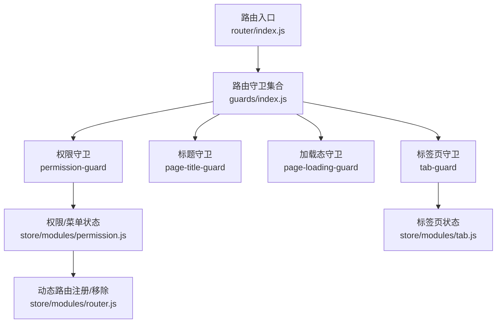
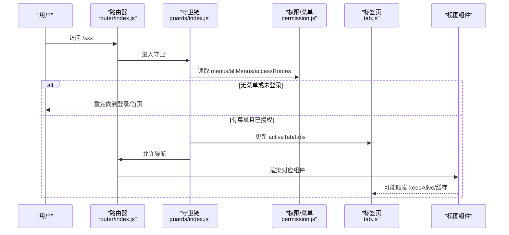
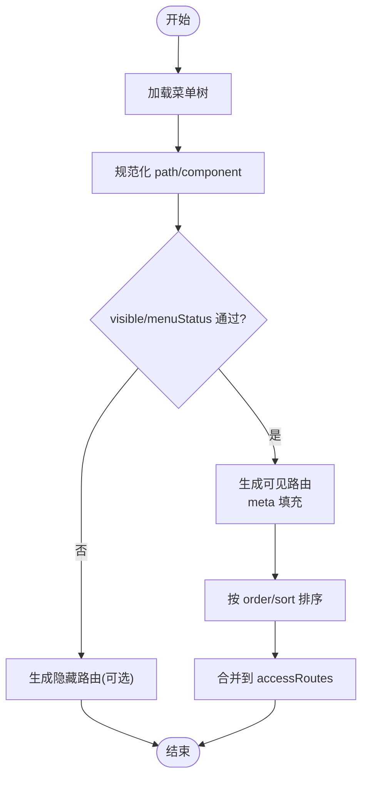
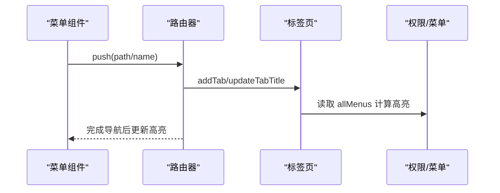
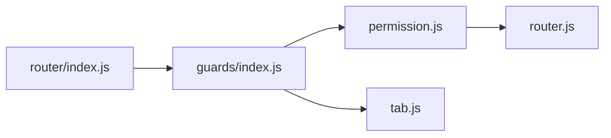

# 菜单路由映射

<cite>
**本文引用的文件**
- [forge-admin-ui/src/router/index.js](file://forge-admin-ui/src/router/index.js)
- [forge-admin-ui/src/store/modules/permission.js](file://forge-admin-ui/src/store/modules/permission.js)
- [forge-admin-ui/src/store/modules/router.js](file://forge-admin-ui/src/store/modules/router.js)
- [forge-admin-ui/src/store/modules/tab.js](file://forge-admin-ui/src/store/modules/tab.js)
- [forge-admin-ui/src/router/guards/index.js](file://forge-admin-ui/src/router/guards/index.js)
</cite>

## 目录
1. [简介](#简介)
2. [项目结构](#项目结构)
3. [核心组件](#核心组件)
4. [架构总览](#架构总览)
5. [详细组件分析](#详细组件分析)
6. [依赖关系分析](#依赖关系分析)
7. [性能考虑](#性能考虑)
8. [故障排查指南](#故障排查指南)
9. [结论](#结论)
10. [附录](#附录)

## 简介
本技术文档聚焦于 Forge Admin 前端的“菜单-路由映射”体系，系统性解析：
- 菜单数据结构与路由配置的映射关系（层级、路径生成、组件关联）
- 动态菜单生成算法（权限过滤、排序规则、显示控制）
- 菜单与路由的双向绑定（路由变化高亮、点击跳转）
- 多级菜单处理（子菜单展开、面包屑、标签页管理）
- 菜单缓存策略与性能优化
- 配置数据格式规范与扩展机制
- 自定义菜单逻辑的开发指南与常见问题解决方案

## 项目结构
前端基于 Vue Router + Pinia 实现。核心涉及：
- 路由定义与守卫：router/index.js、router/guards/*
- 状态管理：store/modules/permission.js（菜单与权限）、store/modules/tab.js（标签页）、store/modules/router.js（动态路由增删）
- 布局与展示：侧边菜单、顶部菜单、面包屑、标签页等（由上述 store 驱动）

图表来源
- [forge-admin-ui/src/router/index.js:1-287](file://forge-admin-ui/src/router/index.js#L1-L287)
- [forge-admin-ui/src/router/guards/index.js:1-12](file://forge-admin-ui/src/router/guards/index.js#L1-L12)
- [forge-admin-ui/src/store/modules/permission.js:1-368](file://forge-admin-ui/src/store/modules/permission.js#L1-L368)
- [forge-admin-ui/src/store/modules/tab.js:1-409](file://forge-admin-ui/src/store/modules/tab.js#L1-L409)
- [forge-admin-ui/src/store/modules/router.js:1-19](file://forge-admin-ui/src/store/modules/router.js#L1-L19)

章节来源
- [forge-admin-ui/src/router/index.js:1-287](file://forge-admin-ui/src/router/index.js#L1-L287)
- [forge-admin-ui/src/router/guards/index.js:1-12](file://forge-admin-ui/src/router/guards/index.js#L1-L12)

## 核心组件
- 路由定义与合并：手动路由 + 自动路由 + 兜底 404；支持 Hash 或 History 模式
- 权限与菜单状态：维护 menus/allMenus/accessRoutes，负责从后端菜单数据生成可见路由与隐藏路由
- 标签页状态：维护 tabs、activeTab、cacheViews，提供打开/关闭/重排/刷新等操作
- 动态路由工具：提供 resetRouter 以在切换用户/租户时清理旧路由

章节来源
- [forge-admin-ui/src/router/index.js:24-287](file://forge-admin-ui/src/router/index.js#L24-L287)
- [forge-admin-ui/src/store/modules/permission.js:14-368](file://forge-admin-ui/src/store/modules/permission.js#L14-L368)
- [forge-admin-ui/src/store/modules/tab.js:26-409](file://forge-admin-ui/src/store/modules/tab.js#L26-L409)
- [forge-admin-ui/src/store/modules/router.js:3-18](file://forge-admin-ui/src/store/modules/router.js#L3-L18)

## 架构总览
下图展示了“菜单数据 → 路由生成 → 守卫校验 → 视图渲染 → 标签页/面包屑联动”的完整链路。

图表来源
- [forge-admin-ui/src/router/index.js:274-287](file://forge-admin-ui/src/router/index.js#L274-L287)
- [forge-admin-ui/src/router/guards/index.js:6-11](file://forge-admin-ui/src/router/guards/index.js#L6-L11)
- [forge-admin-ui/src/store/modules/permission.js:93-146](file://forge-admin-ui/src/store/modules/permission.js#L93-L146)
- [forge-admin-ui/src/store/modules/tab.js:56-78](file://forge-admin-ui/src/store/modules/tab.js#L56-L78)

## 详细组件分析

### 菜单数据结构与路由映射
- 菜单来源与转换
  - 通过 setMenuData 接收后端菜单树，processMenuData 将资源树转换为前端菜单格式，统一 component 路径为 /src/views/*.vue，规范化 path 以 / 开头
  - 过滤规则：仅保留目录(1)/菜单(2)，剔除按钮(3)/接口(4)；按 visible/menuStatus 控制是否显示；按 sort/order 排序
- 路由生成
  - generateAccessRoutesFromMenus：遍历菜单项，对 type=menu 且具备 path/component 的节点生成 accessRoutes，meta 包含 title/icon/keepAlive/alwaysShow/redirect/perms/isExternal 等
  - generateHiddenMenuRoutes：针对隐藏菜单（resourceType=2 且 visible=0 或 menuStatus=0）单独生成路由，确保这些页面可被直接访问并拥有 meta.title
- 外链与 iframe
  - 当 isExternal=1 时，component 指向 iframe 页面，originPath 记录原始地址，path 保持业务路径

图表来源
- [forge-admin-ui/src/store/modules/permission.js:148-256](file://forge-admin-ui/src/store/modules/permission.js#L148-L256)
- [forge-admin-ui/src/store/modules/permission.js:93-146](file://forge-admin-ui/src/store/modules/permission.js#L93-L146)
- [forge-admin-ui/src/store/modules/permission.js:258-303](file://forge-admin-ui/src/store/modules/permission.js#L258-L303)

章节来源
- [forge-admin-ui/src/store/modules/permission.js:148-303](file://forge-admin-ui/src/store/modules/permission.js#L148-L303)

### 动态菜单生成算法（权限过滤、排序、显示控制）
- 权限过滤
  - 仅处理 resourceType 为目录/菜单的节点
  - 根据 visible/menuStatus 决定是否显示
  - 外链场景通过 isExternal 标记，使用 iframe 承载
- 排序规则
  - 顶层与子级均按 order/sort 升序排列
- 显示控制
  - alwaysShow 控制父级是否始终显示（用于目录）
  - keepAlive 控制是否启用 KeepAlive 缓存
  - redirect 支持子项重定向

章节来源
- [forge-admin-ui/src/store/modules/permission.js:184-256](file://forge-admin-ui/src/store/modules/permission.js#L184-L256)

### 菜单与路由的双向绑定
- 路由变化 → 菜单高亮
  - 通过路由守卫与标签页状态联动，activeTab 与当前 route.path/key 同步，侧边菜单据此高亮
- 菜单点击 → 路由跳转
  - 点击菜单项调用 router.push，若为外链则走 iframe 路由；若为内部页面则进入正常导航流程
- 标签页联动
  - 导航时 addTab/updateTabTitle，关闭/重排/刷新操作影响 activeTab 与缓存视图列表

图表来源
- [forge-admin-ui/src/store/modules/tab.js:56-78](file://forge-admin-ui/src/store/modules/tab.js#L56-L78)
- [forge-admin-ui/src/store/modules/permission.js:154-181](file://forge-admin-ui/src/store/modules/permission.js#L154-L181)

章节来源
- [forge-admin-ui/src/store/modules/tab.js:56-78](file://forge-admin-ui/src/store/modules/tab.js#L56-L78)
- [forge-admin-ui/src/store/modules/permission.js:154-181](file://forge-admin-ui/src/store/modules/permission.js#L154-L181)

### 多级菜单处理（展开、面包屑、标签页）
- 子菜单展开
  - 目录型菜单（type=module）可包含 children，alwaysShow 控制是否常驻显示
- 面包屑导航
  - 基于 allMenus 扁平化映射，结合当前路由路径推导面包屑层级
- 标签页管理
  - 支持固定/取消固定、重排、批量关闭、恢复最近关闭、脏标记与导航拦截、KeepAlive 缓存视图列表

章节来源
- [forge-admin-ui/src/store/modules/permission.js:184-256](file://forge-admin-ui/src/store/modules/permission.js#L184-L256)
- [forge-admin-ui/src/store/modules/tab.js:14-20](file://forge-admin-ui/src/store/modules/tab.js#L14-L20)
- [forge-admin-ui/src/store/modules/tab.js:88-199](file://forge-admin-ui/src/store/modules/tab.js#L88-L199)
- [forge-admin-ui/src/store/modules/tab.js:200-339](file://forge-admin-ui/src/store/modules/tab.js#L200-L339)

### 菜单缓存策略与性能优化
- 路由缓存
  - keepAlive 字段控制组件实例复用，减少重复渲染
- 标签页缓存
  - cacheViews 列表与 tab 一一对应，删除/重排时同步更新
- 会话持久化
  - tabs/closedTabs 使用 sessionStorage 持久化，刷新不丢失
- 动态路由清理
  - resetRouter 在切换用户/租户时移除旧路由，避免内存泄漏与冲突

章节来源
- [forge-admin-ui/src/store/modules/tab.js:26-35](file://forge-admin-ui/src/store/modules/tab.js#L26-L35)
- [forge-admin-ui/src/store/modules/tab.js:56-69](file://forge-admin-ui/src/store/modules/tab.js#L56-L69)
- [forge-admin-ui/src/store/modules/tab.js:403-408](file://forge-admin-ui/src/store/modules/tab.js#L403-L408)
- [forge-admin-ui/src/store/modules/router.js:7-11](file://forge-admin-ui/src/store/modules/router.js#L7-L11)

### 配置数据格式规范与扩展机制
- 后端菜单树字段（UserResourceTreeVO 适配）
  - id, parentId, resourceName, path, component, icon, sort, visible, menuStatus, keepAlive, alwaysShow, redirect, isExternal, perms, clientCode, ssoEnabled, ssoTargetClient, openTarget, children
- 前端菜单项字段
  - id, key, label/name, path, component, icon, type(module/menu), order, parentId, meta(title/icon/keepAlive/alwaysShow/redirect/isExternal/perms/ssoEnabled/ssoTargetClient/openTarget)
- 扩展点
  - meta 中新增字段可被路由/菜单/标签页消费
  - processMenuData 中可继续扩展字段映射
  - generateAccessRoutesFromMenus 中可注入新的 meta 行为

章节来源
- [forge-admin-ui/src/store/modules/permission.js:184-256](file://forge-admin-ui/src/store/modules/permission.js#L184-L256)
- [forge-admin-ui/src/store/modules/permission.js:93-146](file://forge-admin-ui/src/store/modules/permission.js#L93-L146)

### 自定义菜单逻辑开发指南
- 新增菜单
  - 在后端菜单管理中新增资源，设置 path/component/type/visible 等字段
  - 如需外链，设置 isExternal=1，并确保目标地址可访问
- 调整排序与显示
  - 修改 sort/order 控制顺序；visible/menuStatus 控制显隐
- 路由级控制
  - 在 manualRoutes 中补充特殊路由（如 SSO、iframe、应用门户等），并在 meta 中配置 skipTab/preserveOnQuery/layout 等
- 权限与白名单
  - 通过权限守卫与菜单权限字段 perms 控制访问；登录/SSO 等页面加入白名单

章节来源
- [forge-admin-ui/src/router/index.js:24-256](file://forge-admin-ui/src/router/index.js#L24-L256)
- [forge-admin-ui/src/store/modules/permission.js:184-256](file://forge-admin-ui/src/store/modules/permission.js#L184-L256)

## 依赖关系分析
- 路由层
  - router/index.js 负责创建路由实例、合并手动/自动/兜底路由，并挂载守卫
- 守卫层
  - guards/index.js 聚合页面加载、权限、标题、标签页四类守卫
- 状态层
  - permission.js：菜单与路由的核心状态机，负责数据转换、路由生成、隐藏路由注入
  - tab.js：标签页生命周期与缓存视图管理
  - router.js：动态路由的增删工具方法

图表来源
- [forge-admin-ui/src/router/index.js:274-287](file://forge-admin-ui/src/router/index.js#L274-L287)
- [forge-admin-ui/src/router/guards/index.js:6-11](file://forge-admin-ui/src/router/guards/index.js#L6-L11)
- [forge-admin-ui/src/store/modules/permission.js:93-146](file://forge-admin-ui/src/store/modules/permission.js#L93-L146)
- [forge-admin-ui/src/store/modules/tab.js:56-78](file://forge-admin-ui/src/store/modules/tab.js#L56-L78)
- [forge-admin-ui/src/store/modules/router.js:7-11](file://forge-admin-ui/src/store/modules/router.js#L7-L11)

章节来源
- [forge-admin-ui/src/router/index.js:274-287](file://forge-admin-ui/src/router/index.js#L274-L287)
- [forge-admin-ui/src/router/guards/index.js:6-11](file://forge-admin-ui/src/router/guards/index.js#L6-L11)
- [forge-admin-ui/src/store/modules/permission.js:93-146](file://forge-admin-ui/src/store/modules/permission.js#L93-L146)
- [forge-admin-ui/src/store/modules/tab.js:56-78](file://forge-admin-ui/src/store/modules/tab.js#L56-L78)
- [forge-admin-ui/src/store/modules/router.js:7-11](file://forge-admin-ui/src/store/modules/router.js#L7-L11)

## 性能考虑
- 路由懒加载：所有页面组件采用异步导入，降低首屏体积
- 菜单生成一次化：setMenuData 一次性处理并生成 accessRoutes，避免重复计算
- KeepAlive 与缓存视图：合理使用 keepAlive 与 cacheViews，减少重复渲染
- 动态路由清理：切换用户/租户时调用 resetRouter 释放旧路由，防止内存泄漏
- 外链隔离：isExternal 使用 iframe 承载，避免主应用污染

[本节为通用性能建议，无需特定文件引用]

## 故障排查指南
- 菜单不显示
  - 检查 visible/menuStatus 是否为 0；确认 resourceType 为目录/菜单；核对 path 是否以 / 开头
- 路由无法访问
  - 确认 generateAccessRoutesFromMenus 已生成对应路由；检查 component 路径是否正确拼接为 /src/views/*.vue
- 外链无法打开
  - 确认 isExternal=1；检查 originPath 与 iframe 路由是否正常
- 标签页异常
  - 检查 addTab/updateTabTitle 是否被正确调用；确认 sessionStorage 是否可用；查看 cacheViews 是否与 tabs 同步
- 动态路由残留
  - 切换用户/租户后未清理导致路由冲突，需调用 resetRouter 移除旧路由

章节来源
- [forge-admin-ui/src/store/modules/permission.js:184-256](file://forge-admin-ui/src/store/modules/permission.js#L184-L256)
- [forge-admin-ui/src/store/modules/permission.js:93-146](file://forge-admin-ui/src/store/modules/permission.js#L93-L146)
- [forge-admin-ui/src/store/modules/tab.js:56-78](file://forge-admin-ui/src/store/modules/tab.js#L56-L78)
- [forge-admin-ui/src/store/modules/router.js:7-11](file://forge-admin-ui/src/store/modules/router.js#L7-L11)

## 结论
Forge Admin 的菜单-路由映射体系以“后端菜单树 → 前端菜单格式 → 可见/隐藏路由 → 守卫校验 → 视图渲染 → 标签页联动”为主线，实现了灵活的权限控制、多级菜单、外链支持与高性能缓存。通过标准化的数据格式与可扩展的 meta 字段，系统具备良好的可定制性与可维护性。

[本节为总结性内容，无需特定文件引用]

## 附录
- 关键流程参考
  - 菜单数据处理与路由生成：[permission.js:148-256](file://forge-admin-ui/src/store/modules/permission.js#L148-L256)、[permission.js:93-146](file://forge-admin-ui/src/store/modules/permission.js#L93-L146)
  - 隐藏路由注入：[permission.js:258-303](file://forge-admin-ui/src/store/modules/permission.js#L258-L303)
  - 路由初始化与守卫挂载：[router/index.js:274-287](file://forge-admin-ui/src/router/index.js#L274-L287)、[guards/index.js:6-11](file://forge-admin-ui/src/router/guards/index.js#L6-L11)
  - 标签页管理与缓存：[tab.js:56-78](file://forge-admin-ui/src/store/modules/tab.js#L56-L78)、[tab.js:200-339](file://forge-admin-ui/src/store/modules/tab.js#L200-L339)
  - 动态路由清理：[router.js:7-11](file://forge-admin-ui/src/store/modules/router.js#L7-L11)

[本节为索引性内容，无需特定文件引用]