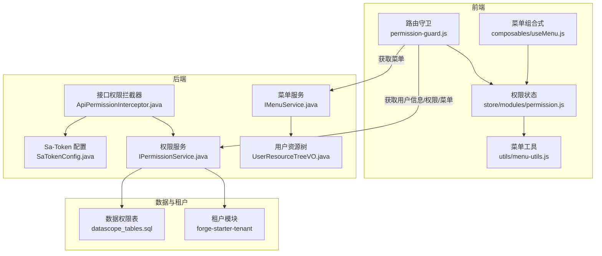
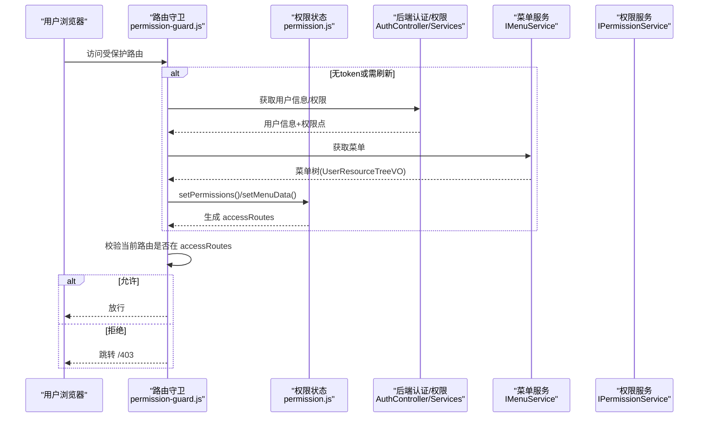
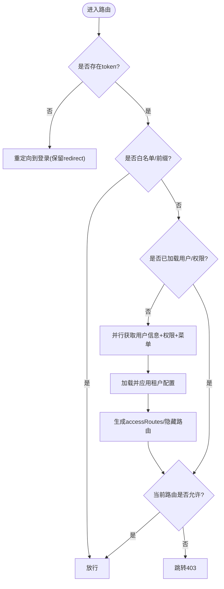
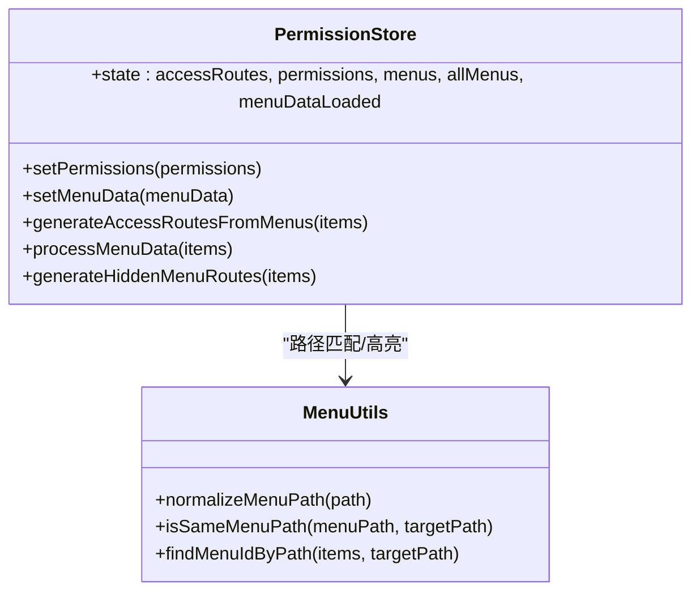
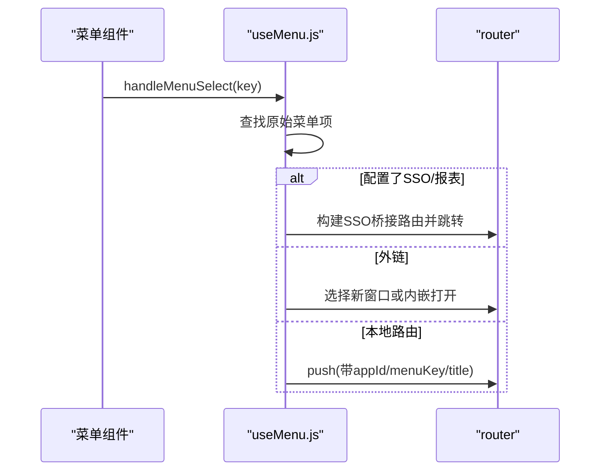
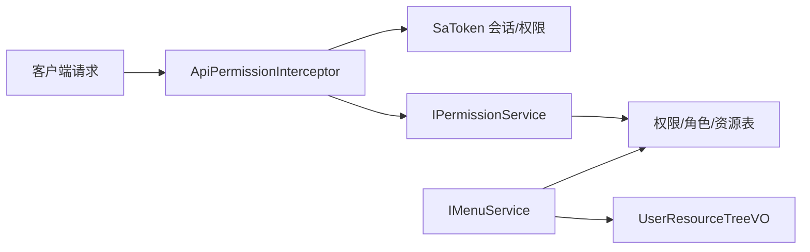
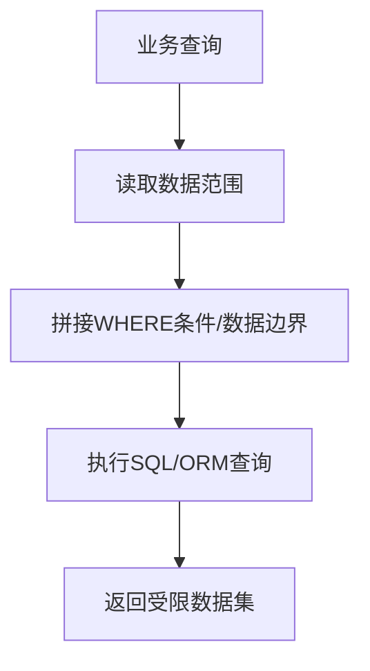
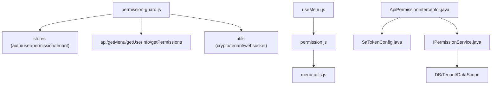

# 权限守卫

<cite>
**本文引用的文件**
- [permission-guard.js](file://forge-admin-ui/src/router/guards/permission-guard.js)
- [permission.js](file://forge-admin-ui/src/store/modules/permission.js)
- [menu-utils.js](file://forge-admin-ui/src/utils/menu-utils.js)
- [useMenu.js](file://forge-admin-ui/src/composables/useMenu.js)
- [application-permission-utils.js](file://forge-admin-ui/src/views/app-center/application-permission-utils.js)
- [SaTokenConfig.java](file://forge-server/forge-framework/forge-starter-parent/forge-starter-auth/src/main/java/com/mdframe/forge/starter/auth/config/SaTokenConfig.java)
- [StpInterfaceImpl.java](file://forge-server/forge-framework/forge-starter-parent/forge-starter-auth/src/main/java/com/mdframe/forge/starter/auth/config/StpInterfaceImpl.java)
- [ApiPermissionInterceptor.java](file://forge-server/forge-framework/forge-starter-parent/forge-starter-auth/src/main/java/com/mdframe/forge/starter/auth/interceptor/ApiPermissionInterceptor.java)
- [AuthController.java](file://forge-server/forge-framework/forge-starter-parent/forge-starter-auth/src/main/java/com/mdframe/forge/starter/auth/controller/AuthController.java)
- [IMenuService.java](file://forge-server/forge-framework/forge-starter-parent/forge-starter-auth/src/main/java/com/mdframe/forge/starter/auth/service/IMenuService.java)
- [IPermissionService.java](file://forge-server/forge-framework/forge-starter-parent/forge-starter-auth/src/main/java/com/mdframe/forge/starter/auth/service/IPermissionService.java)
- [UserResourceTreeVO.java](file://forge-server/forge-framework/forge-starter-parent/forge-starter-auth/src/main/java/com/mdframe/forge/starter/auth/domain/UserResourceTreeVO.java)
- [datascope_tables.sql](file://forge-server/forge-framework/forge-starter-parent/forge-starter-datascope/sql/datascope_tables.sql)
- [tenant](file://forge-server/forge-framework/forge-starter-parent/forge-starter-tenant)
</cite>

## 目录
1. [简介](#简介)
2. [项目结构](#项目结构)
3. [核心组件](#核心组件)
4. [架构总览](#架构总览)
5. [详细组件分析](#详细组件分析)
6. [依赖关系分析](#依赖关系分析)
7. [性能考虑](#性能考虑)
8. [故障排查指南](#故障排查指南)
9. [结论](#结论)
10. [附录](#附录)

## 简介
本技术文档围绕 Forge Admin 的权限守卫体系，系统性解析前端路由守卫、菜单动态生成与权限过滤、后端 RBAC 鉴权拦截、数据权限隔离与租户隔离机制，并给出缓存策略、自定义规则扩展与调试方法。目标是帮助开发者快速理解“谁在何时以何种方式控制访问”，以及如何在现有框架上安全地扩展权限能力。

## 项目结构
权限相关的前端逻辑集中在路由守卫、权限状态管理、菜单工具与布局组合式函数；后端通过 Sa-Token 配置、接口权限拦截器、菜单与权限服务提供 RBAC 与数据范围能力；数据权限表结构与租户模块支撑多租户与数据边界控制。

图表来源
- [permission-guard.js:87-273](file://forge-admin-ui/src/router/guards/permission-guard.js#L87-L273)
- [permission.js:14-368](file://forge-admin-ui/src/store/modules/permission.js#L14-L368)
- [menu-utils.js:1-287](file://forge-admin-ui/src/utils/menu-utils.js#L1-L287)
- [useMenu.js:309-577](file://forge-admin-ui/src/composables/useMenu.js#L309-L577)
- [SaTokenConfig.java](file://forge-server/forge-framework/forge-starter-parent/forge-starter-auth/src/main/java/com/mdframe/forge/starter/auth/config/SaTokenConfig.java)
- [ApiPermissionInterceptor.java](file://forge-server/forge-framework/forge-starter-parent/forge-starter-auth/src/main/java/com/mdframe/forge/starter/auth/interceptor/ApiPermissionInterceptor.java)
- [IMenuService.java](file://forge-server/forge-framework/forge-starter-parent/forge-starter-auth/src/main/java/com/mdframe/forge/starter/auth/service/IMenuService.java)
- [IPermissionService.java](file://forge-server/forge-framework/forge-starter-parent/forge-starter-auth/src/main/java/com/mdframe/forge/starter/auth/service/IPermissionService.java)
- [UserResourceTreeVO.java](file://forge-server/forge-framework/forge-starter-parent/forge-starter-auth/src/main/java/com/mdframe/forge/starter/auth/domain/UserResourceTreeVO.java)
- [datascope_tables.sql](file://forge-server/forge-framework/forge-starter-parent/forge-starter-datascope/sql/datascope_tables.sql)
- [tenant](file://forge-server/forge-framework/forge-starter-parent/forge-starter-tenant)

章节来源
- [permission-guard.js:87-273](file://forge-admin-ui/src/router/guards/permission-guard.js#L87-L273)
- [permission.js:14-368](file://forge-admin-ui/src/store/modules/permission.js#L14-L368)
- [menu-utils.js:1-287](file://forge-admin-ui/src/utils/menu-utils.js#L1-L287)
- [useMenu.js:309-577](file://forge-admin-ui/src/composables/useMenu.js#L309-L577)

## 核心组件
- 前端路由守卫：负责无 token 跳转登录、白名单放行、首次加载用户信息与权限、拉取菜单并生成可访问路由、强制改密流程、未授权跳转 403。
- 权限状态管理：维护权限点、可见菜单、隐藏菜单路由、accessRoutes（用于路由级校验）、菜单数据加载完成标志。
- 菜单工具与组合式：处理菜单路径标准化、匹配评分、活跃菜单计算、外链/SSO/报表目标导航、业务应用运行时参数注入。
- 后端认证与鉴权：基于 Sa-Token 的会话与权限模型，接口级权限拦截，菜单与权限服务提供 RBAC 与数据范围能力。
- 数据权限与租户：数据权限表定义数据范围，租户模块提供上下文切换与跨租户访问控制。

章节来源
- [permission-guard.js:87-273](file://forge-admin-ui/src/router/guards/permission-guard.js#L87-L273)
- [permission.js:14-368](file://forge-admin-ui/src/store/modules/permission.js#L14-L368)
- [menu-utils.js:1-287](file://forge-admin-ui/src/utils/menu-utils.js#L1-L287)
- [useMenu.js:309-577](file://forge-admin-ui/src/composables/useMenu.js#L309-L577)
- [ApiPermissionInterceptor.java](file://forge-server/forge-framework/forge-starter-parent/forge-starter-auth/src/main/java/com/mdframe/forge/starter/auth/interceptor/ApiPermissionInterceptor.java)
- [SaTokenConfig.java](file://forge-server/forge-framework/forge-starter-parent/forge-starter-auth/src/main/java/com/mdframe/forge/starter/auth/config/SaTokenConfig.java)
- [datascope_tables.sql](file://forge-server/forge-framework/forge-starter-parent/forge-starter-datascope/sql/datascope_tables.sql)

## 架构总览
权限体系贯穿前后端：前端通过路由守卫在页面进入时进行鉴权与菜单初始化；后端通过 Sa-Token 与拦截器对接口进行权限校验；菜单与权限由后端服务聚合用户角色与资源后返回；数据权限与租户上下文在查询层生效，确保数据边界。

图表来源
- [permission-guard.js:87-273](file://forge-admin-ui/src/router/guards/permission-guard.js#L87-L273)
- [permission.js:24-146](file://forge-admin-ui/src/store/modules/permission.js#L24-L146)
- [IMenuService.java](file://forge-server/forge-framework/forge-starter-parent/forge-starter-auth/src/main/java/com/mdframe/forge/starter/auth/service/IMenuService.java)
- [IPermissionService.java](file://forge-server/forge-framework/forge-starter-parent/forge-starter-auth/src/main/java/com/mdframe/forge/starter/auth/service/IPermissionService.java)

## 详细组件分析

### 前端路由守卫（权限验证入口）
- 白名单与特殊前缀：支持静态白名单与特定前缀（如 workspace）直接放行。
- Token 校验与密钥交换：进入登录页时尝试建立加密通道并校验 token，失败则清理并重定向到登录。
- 首次加载：并行获取用户信息与权限点，持久化用户信息、员工信息与数据权限；根据用户 tenantId 加载租户配置并应用主题等。
- 菜单加载与路由生成：调用菜单接口获取 UserResourceTreeVO，转换为前端菜单结构，生成 accessRoutes 与隐藏菜单路由，标记 menuDataLoaded。
- 强制改密：若用户需要修改密码，优先跳转到指定页面。
- 未授权处理：不在可访问路由中则跳转 403，携带来源信息以便恢复。

图表来源
- [permission-guard.js:87-273](file://forge-admin-ui/src/router/guards/permission-guard.js#L87-L273)
- [permission.js:24-146](file://forge-admin-ui/src/store/modules/permission.js#L24-L146)

章节来源
- [permission-guard.js:87-273](file://forge-admin-ui/src/router/guards/permission-guard.js#L87-L273)
- [permission.js:24-146](file://forge-admin-ui/src/store/modules/permission.js#L24-L146)

### 菜单动态生成与权限过滤
- 数据结构适配：将后端 UserResourceTreeVO 转换为前端菜单结构，统一 component 路径、meta 字段与排序。
- 可见菜单与隐藏菜单：仅 visible=1 且 menuStatus=1 的菜单参与侧边栏展示；隐藏菜单仍生成路由以支持 meta.title 与内嵌场景。
- 路由生成：为每个有效菜单项生成 route，包含 name/path/component/meta，并汇总到 accessRoutes 供守卫校验。
- 首页默认：若无配置的 homePath，则使用第一个叶子节点路径。

图表来源
- [permission.js:24-368](file://forge-admin-ui/src/store/modules/permission.js#L24-L368)
- [menu-utils.js:1-287](file://forge-admin-ui/src/utils/menu-utils.js#L1-L287)

章节来源
- [permission.js:24-368](file://forge-admin-ui/src/store/modules/permission.js#L24-L368)
- [menu-utils.js:1-287](file://forge-admin-ui/src/utils/menu-utils.js#L1-L287)

### 菜单导航与活跃项计算
- 活跃菜单：优先使用显式 menuKey/menuResourceId，其次精确匹配，最后前缀匹配，兼容隐藏二级页 parentKey。
- 导航策略：支持外链、SSO 桥接、报表系统嵌入、iframe 模式与本地路由跳转；自动注入 appId、menuKey、title 等上下文。
- 业务应用运行时：对 /ai/crud-page/ 与 /app-center/app/{id} 等特殊路径进行参数增强。

图表来源
- [useMenu.js:309-577](file://forge-admin-ui/src/composables/useMenu.js#L309-L577)

章节来源
- [useMenu.js:309-577](file://forge-admin-ui/src/composables/useMenu.js#L309-L577)

### 后端 RBAC 权限模型
- 会话与权限：基于 Sa-Token 实现登录态与权限点校验，支持 WebSocket 认证与流式令牌提供者。
- 接口权限拦截：通过 ApiPermissionInterceptor 对控制器方法进行权限点检查，结合 StpInterfaceImpl 提供权限判定逻辑。
- 菜单与权限服务：IMenuService 提供用户菜单树（UserResourceTreeVO），IPermissionService 提供权限点集合，供前端初始化与按钮级权限控制。

图表来源
- [ApiPermissionInterceptor.java](file://forge-server/forge-framework/forge-starter-parent/forge-starter-auth/src/main/java/com/mdframe/forge/starter/auth/interceptor/ApiPermissionInterceptor.java)
- [SaTokenConfig.java](file://forge-server/forge-framework/forge-starter-parent/forge-starter-auth/src/main/java/com/mdframe/forge/starter/auth/config/SaTokenConfig.java)
- [StpInterfaceImpl.java](file://forge-server/forge-framework/forge-starter-parent/forge-starter-auth/src/main/java/com/mdframe/forge/starter/auth/config/StpInterfaceImpl.java)
- [IMenuService.java](file://forge-server/forge-framework/forge-starter-parent/forge-starter-auth/src/main/java/com/mdframe/forge/starter/auth/service/IMenuService.java)
- [IPermissionService.java](file://forge-server/forge-framework/forge-starter-parent/forge-starter-auth/src/main/java/com/mdframe/forge/starter/auth/service/IPermissionService.java)
- [UserResourceTreeVO.java](file://forge-server/forge-framework/forge-starter-parent/forge-starter-auth/src/main/java/com/mdframe/forge/starter/auth/domain/UserResourceTreeVO.java)

章节来源
- [ApiPermissionInterceptor.java](file://forge-server/forge-framework/forge-starter-parent/forge-starter-auth/src/main/java/com/mdframe/forge/starter/auth/interceptor/ApiPermissionInterceptor.java)
- [SaTokenConfig.java](file://forge-server/forge-framework/forge-starter-parent/forge-starter-auth/src/main/java/com/mdframe/forge/starter/auth/config/SaTokenConfig.java)
- [StpInterfaceImpl.java](file://forge-server/forge-framework/forge-starter-parent/forge-starter-auth/src/main/java/com/mdframe/forge/starter/auth/config/StpInterfaceImpl.java)
- [IMenuService.java](file://forge-server/forge-framework/forge-starter-parent/forge-starter-auth/src/main/java/com/mdframe/forge/starter/auth/service/IMenuService.java)
- [IPermissionService.java](file://forge-server/forge-framework/forge-starter-parent/forge-starter-auth/src/main/java/com/mdframe/forge/starter/auth/service/IPermissionService.java)
- [UserResourceTreeVO.java](file://forge-server/forge-framework/forge-starter-parent/forge-starter-auth/src/main/java/com/mdframe/forge/starter/auth/domain/UserResourceTreeVO.java)

### 数据权限隔离机制
- 数据范围：通过数据权限表定义不同维度（如按部门、按本人、按全部等）的数据访问范围，并在查询时自动拼接条件。
- 作用域：在服务层或 ORM 拦截器中读取当前用户的数据范围，应用到 SQL 或查询构造器，确保跨记录的数据边界。
- 前端配合：前端会持久化 dataPermission 数组，用于按钮/操作级别的显示控制与提示。

图表来源
- [datascope_tables.sql](file://forge-server/forge-framework/forge-starter-parent/forge-starter-datascope/sql/datascope_tables.sql)

章节来源
- [datascope_tables.sql](file://forge-server/forge-framework/forge-starter-parent/forge-starter-datascope/sql/datascope_tables.sql)
- [application-permission-utils.js:16-59](file://forge-admin-ui/src/views/app-center/application-permission-utils.js#L16-L59)

### 租户隔离机制
- 上下文切换：登录后根据用户 tenantId 加载租户配置并应用主题、功能开关等；路由守卫在首次加载时完成此步骤。
- 数据边界：所有数据访问均带上租户标识，避免跨租户数据泄露。
- 跨租户访问控制：通过租户模块的上下文与拦截器保证同一请求内始终处于正确租户上下文。

章节来源
- [permission-guard.js:150-189](file://forge-admin-ui/src/router/guards/permission-guard.js#L150-L189)
- [tenant](file://forge-server/forge-framework/forge-starter-parent/forge-starter-tenant)

### 权限缓存策略与性能优化
- 前端缓存：
  - 用户信息、员工信息、数据权限写入本地存储，减少重复请求。
  - 菜单数据一次性拉取并转换为菜单树，生成 accessRoutes，避免重复计算。
  - 使用 menuDataLoaded 标志避免重复初始化。
- 后端缓存建议：
  - 菜单与权限结果可按用户/租户维度缓存（如 Redis），降低数据库压力。
  - 权限点预加载：登录成功后预取常用权限点，提升按钮级渲染性能。
- 网络优化：
  - 并行请求用户信息与权限点，缩短首屏时间。
  - 仅在必要时重新拉取菜单（如权限变更）。

章节来源
- [permission-guard.js:150-256](file://forge-admin-ui/src/router/guards/permission-guard.js#L150-L256)
- [permission.js:24-146](file://forge-admin-ui/src/store/modules/permission.js#L24-L146)

### 自定义权限规则开发指南
- 前端按钮级权限：
  - 基于权限点集合进行 v-if/v-show 控制，或使用封装指令。
  - 使用 application-permission-utils 中的归一化工具处理角色与资源映射。
- 后端接口权限：
  - 在控制器方法上使用权限注解（由拦截器驱动），或通过 StpInterfaceImpl 自定义权限判定逻辑。
  - 结合数据权限范围，确保接口返回数据符合当前用户的数据边界。
- 菜单扩展：
  - 在后端菜单管理中新增资源类型与路径，前端会自动识别并生成路由与菜单项。
  - 对于外链/SSO/报表目标，可通过 meta 字段配置 openTarget、ssoEnabled、ssoTargetClient 等。

章节来源
- [application-permission-utils.js:16-59](file://forge-admin-ui/src/views/app-center/application-permission-utils.js#L16-L59)
- [ApiPermissionInterceptor.java](file://forge-server/forge-framework/forge-starter-parent/forge-starter-auth/src/main/java/com/mdframe/forge/starter/auth/interceptor/ApiPermissionInterceptor.java)
- [StpInterfaceImpl.java](file://forge-server/forge-framework/forge-starter-parent/forge-starter-auth/src/main/java/com/mdframe/forge/starter/auth/config/StpInterfaceImpl.java)

### 权限调试工具使用方法
- 前端调试：
  - 在路由守卫中打印关键变量（token、用户信息、权限点、菜单数据、accessRoutes）以定位问题。
  - 检查 menuDataLoaded 是否为 true，确认菜单已加载完成。
  - 使用 useMenu 提供的 activeKey 与 findMenuIdByPath 验证活跃菜单匹配是否正确。
- 后端调试：
  - 在拦截器中输出当前用户、角色、权限点与请求路径，核对权限判定是否符合预期。
  - 检查数据范围是否被正确应用到查询语句。
- 常见问题：
  - 菜单不显示：检查 resourceType、visible、menuStatus 与 component 路径是否正确。
  - 路由被拒：确认 accessRoutes 是否包含目标路径，或白名单是否遗漏。
  - 数据越界：核查数据权限范围与租户上下文是否设置正确。

章节来源
- [permission-guard.js:87-273](file://forge-admin-ui/src/router/guards/permission-guard.js#L87-L273)
- [permission.js:24-368](file://forge-admin-ui/src/store/modules/permission.js#L24-L368)
- [useMenu.js:309-577](file://forge-admin-ui/src/composables/useMenu.js#L309-L577)
- [ApiPermissionInterceptor.java](file://forge-server/forge-framework/forge-starter-parent/forge-starter-auth/src/main/java/com/mdframe/forge/starter/auth/interceptor/ApiPermissionInterceptor.java)

## 依赖关系分析
- 前端：
  - permission-guard.js 依赖 store（auth/user/permission/tenant）、API 与工具（WebSocket、加密、租户配置）。
  - permission.js 依赖 utils（外部链接判断）与菜单工具进行路径处理。
  - useMenu.js 依赖 router、permission store 与 sso-target 工具。
- 后端：
  - ApiPermissionInterceptor 依赖 Sa-Token 与权限服务。
  - IMenuService/IPermissionService 依赖数据库与租户上下文。
  - UserResourceTreeVO 作为菜单树传输对象，贯穿前后端。

图表来源
- [permission-guard.js:87-273](file://forge-admin-ui/src/router/guards/permission-guard.js#L87-L273)
- [permission.js:24-368](file://forge-admin-ui/src/store/modules/permission.js#L24-L368)
- [menu-utils.js:1-287](file://forge-admin-ui/src/utils/menu-utils.js#L1-L287)
- [useMenu.js:309-577](file://forge-admin-ui/src/composables/useMenu.js#L309-L577)
- [ApiPermissionInterceptor.java](file://forge-server/forge-framework/forge-starter-parent/forge-starter-auth/src/main/java/com/mdframe/forge/starter/auth/interceptor/ApiPermissionInterceptor.java)
- [SaTokenConfig.java](file://forge-server/forge-framework/forge-starter-parent/forge-starter-auth/src/main/java/com/mdframe/forge/starter/auth/config/SaTokenConfig.java)
- [IPermissionService.java](file://forge-server/forge-framework/forge-starter-parent/forge-starter-auth/src/main/java/com/mdframe/forge/starter/auth/service/IPermissionService.java)

章节来源
- [permission-guard.js:87-273](file://forge-admin-ui/src/router/guards/permission-guard.js#L87-L273)
- [permission.js:24-368](file://forge-admin-ui/src/store/modules/permission.js#L24-L368)
- [menu-utils.js:1-287](file://forge-admin-ui/src/utils/menu-utils.js#L1-L287)
- [useMenu.js:309-577](file://forge-admin-ui/src/composables/useMenu.js#L309-L577)
- [ApiPermissionInterceptor.java](file://forge-server/forge-framework/forge-starter-parent/forge-starter-auth/src/main/java/com/mdframe/forge/starter/auth/interceptor/ApiPermissionInterceptor.java)
- [SaTokenConfig.java](file://forge-server/forge-framework/forge-starter-parent/forge-starter-auth/src/main/java/com/mdframe/forge/starter/auth/config/SaTokenConfig.java)
- [IPermissionService.java](file://forge-server/forge-framework/forge-starter-parent/forge-starter-auth/src/main/java/com/mdframe/forge/starter/auth/service/IPermissionService.java)

## 性能考虑
- 首屏优化：并行获取用户信息与权限点，减少等待时间；菜单数据一次性加载并缓存。
- 路由校验：使用 accessRoutes 进行 O(n) 匹配，建议在菜单规模较大时考虑索引或哈希加速。
- 网络重试与降级：在获取用户信息或菜单失败时，提供恢复机制（如回到登录或错误页）。
- 后端缓存：对菜单与权限结果做缓存，降低数据库压力；结合租户维度提高命中率。
- 数据权限：尽量在数据库层利用索引与条件下推，减少全表扫描。

[本节为通用性能建议，无需具体文件引用]

## 故障排查指南
- 无法进入页面：
  - 检查 token 是否有效，密钥交换是否成功。
  - 确认白名单是否包含目标路径。
  - 查看 accessRoutes 是否包含当前路由。
- 菜单不显示或高亮异常：
  - 检查 resourceType、visible、menuStatus 与 component 路径。
  - 使用 findMenuIdByPath 与 activeKey 调试匹配逻辑。
- 接口权限拒绝：
  - 在后端拦截器中输出当前用户、角色、权限点与请求路径。
  - 确认 StpInterfaceImpl 的权限判定逻辑是否正确。
- 数据越界：
  - 检查数据权限范围与租户上下文是否正确设置。
  - 在 SQL 日志中确认 WHERE 条件是否包含租户与数据范围。

章节来源
- [permission-guard.js:87-273](file://forge-admin-ui/src/router/guards/permission-guard.js#L87-L273)
- [permission.js:24-368](file://forge-admin-ui/src/store/modules/permission.js#L24-L368)
- [useMenu.js:309-577](file://forge-admin-ui/src/composables/useMenu.js#L309-L577)
- [ApiPermissionInterceptor.java](file://forge-server/forge-framework/forge-starter-parent/forge-starter-auth/src/main/java/com/mdframe/forge/starter/auth/interceptor/ApiPermissionInterceptor.java)
- [datascope_tables.sql](file://forge-server/forge-framework/forge-starter-parent/forge-starter-datascope/sql/datascope_tables.sql)

## 结论
Forge Admin 的权限守卫体系以前端路由守卫为入口，结合后端 Sa-Token 与拦截器实现端到端的 RBAC 与数据权限控制。通过菜单动态生成与权限过滤，系统能够灵活适配不同角色与租户场景。借助缓存策略与性能优化，系统在大规模菜单与高频访问下仍能保持良好体验。开发者可基于现有能力扩展自定义权限规则与调试工具，进一步提升安全性与可维护性。

[本节为总结性内容，无需具体文件引用]

## 附录
- 关键术语
  - RBAC：基于角色的访问控制，通过角色绑定资源与权限点。
  - 数据权限：限制可访问的数据范围，如按部门、本人、全部。
  - 租户隔离：在多租户环境下，确保数据与配置按租户隔离。
- 相关文件索引
  - 前端：permission-guard.js、permission.js、menu-utils.js、useMenu.js
  - 后端：SaTokenConfig.java、ApiPermissionInterceptor.java、IMenuService.java、IPermissionService.java、UserResourceTreeVO.java
  - 数据：datascope_tables.sql
  - 租户：forge-starter-tenant

[本节为索引性内容，无需具体文件引用]