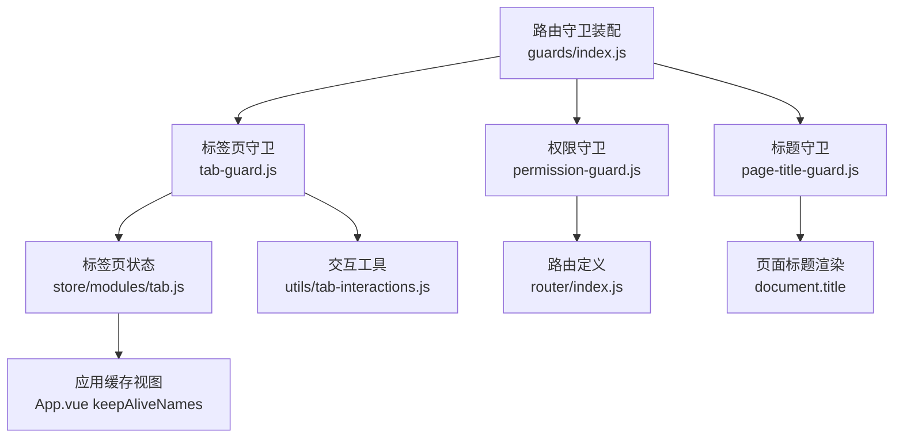
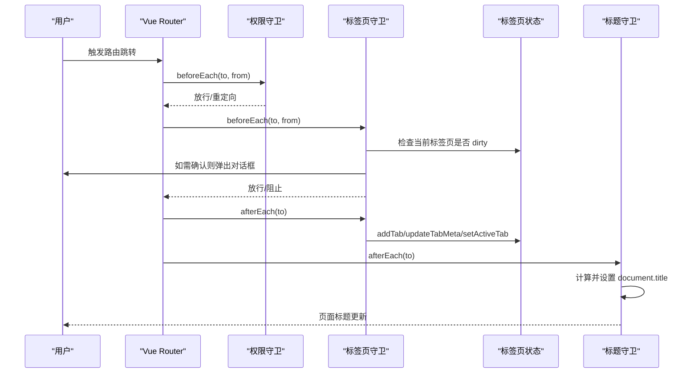
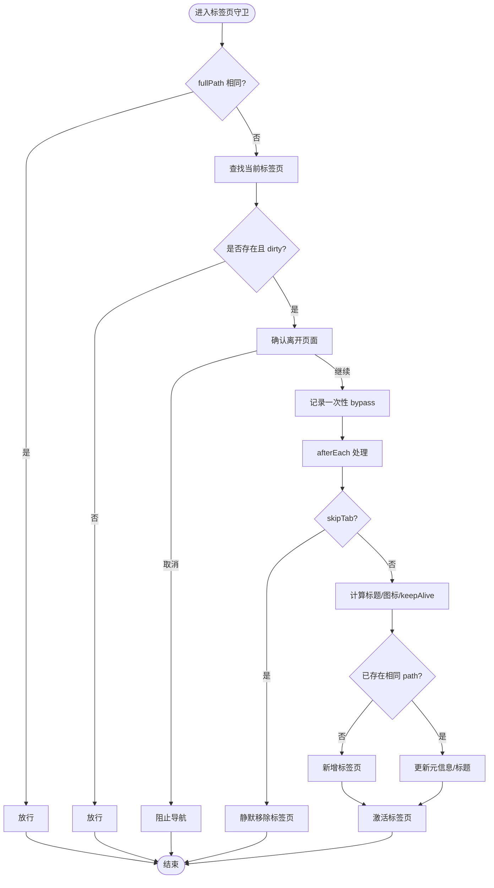
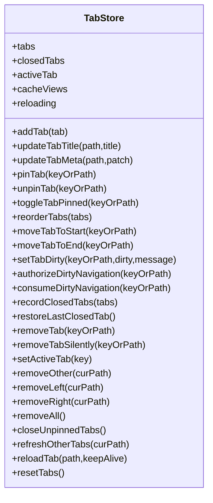
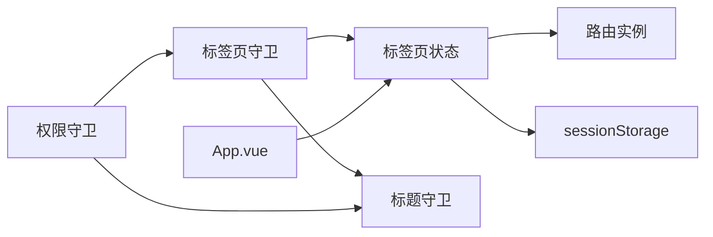

# 标签页守卫

<cite>
**本文引用的文件**
- [tab-guard.js](file://forge-admin-ui/src/router/guards/tab-guard.js)
- [index.js](file://forge-admin-ui/src/router/index.js)
- [guards/index.js](file://forge-admin-ui/src/router/guards/index.js)
- [permission-guard.js](file://forge-admin-ui/src/router/guards/permission-guard.js)
- [page-title-guard.js](file://forge-admin-ui/src/router/guards/page-title-guard.js)
- [tab.js](file://forge-admin-ui/src/store/modules/tab.js)
- [tab-interactions.js](file://forge-admin-ui/src/utils/tab-interactions.js)
- [tab.js（工具）](file://forge-admin-ui/src/utils/tab.js)
- [App.vue](file://forge-admin-ui/src/App.vue)
</cite>

## 目录
1. [简介](#简介)
2. [项目结构](#项目结构)
3. [核心组件](#核心组件)
4. [架构总览](#架构总览)
5. [详细组件分析](#详细组件分析)
6. [依赖关系分析](#依赖关系分析)
7. [性能考量](#性能考量)
8. [故障排查指南](#故障排查指南)
9. [结论](#结论)
10. [附录](#附录)

## 简介
本技术文档聚焦于 Forge Admin 的“标签页守卫”体系，系统性解析标签页状态管理、生命周期、路由映射与同步、持久化策略、性能优化、扩展点与调试技巧，并覆盖冲突解决、重复打开控制与排序等高级能力。目标是帮助开发者理解从路由到标签页的全链路实现，并在实际业务中正确扩展与维护。

## 项目结构
标签页相关代码主要分布在以下位置：
- 路由守卫：router/guards 下的 tab-guard、permission-guard、page-title-guard 以及统一装配入口
- 路由定义：router/index.js 中的手动路由与自动路由合并
- 状态管理：store/modules/tab.js 提供标签页增删改查、排序、缓存视图、持久化等能力
- 工具函数：utils/tab-interactions.js 提供未保存变更确认、URL 解析；utils/tab.js 提供关闭/刷新/批量操作等便捷 API
- 应用层集成：App.vue 通过 keep-alive 名称列表与标签页缓存联动

图表来源
- [guards/index.js:6-11](file://forge-admin-ui/src/router/guards/index.js#L6-L11)
- [tab-guard.js:71-152](file://forge-admin-ui/src/router/guards/tab-guard.js#L71-L152)
- [permission-guard.js:87-273](file://forge-admin-ui/src/router/guards/permission-guard.js#L87-L273)
- [page-title-guard.js:51-73](file://forge-admin-ui/src/router/guards/page-title-guard.js#L51-L73)
- [tab.js:26-409](file://forge-admin-ui/src/store/modules/tab.js#L26-L409)
- [tab-interactions.js:1-54](file://forge-admin-ui/src/utils/tab-interactions.js#L1-L54)
- [index.js:263-286](file://forge-admin-ui/src/router/index.js#L263-L286)
- [App.vue:124-128](file://forge-admin-ui/src/App.vue#L124-L128)

章节来源
- [guards/index.js:6-11](file://forge-admin-ui/src/router/guards/index.js#L6-L11)
- [index.js:263-286](file://forge-admin-ui/src/router/index.js#L263-L286)

## 核心组件
- 标签页守卫（tab-guard）：在路由进入前拦截脏页导航，在路由进入后创建/更新/激活标签页，处理标题、图标、可关闭性、keepAlive 等元信息
- 标签页状态（useTabStore）：维护 tabs、closedTabs、activeTab、cacheViews、reloading 等状态，提供添加、删除、排序、钉选、恢复、刷新等操作，并持久化到 sessionStorage
- 权限守卫（permission-guard）：负责鉴权、菜单加载、租户配置应用，为标签页守卫提供 allMenus 等上下文
- 标题守卫（page-title-guard）：根据路由 meta、菜单、动态查询参数设置 document.title
- 路由装配（router/index.js）：合并手动路由与自动路由，注入 skipTab/preserveOnQuery 等元信息，供标签页系统识别特殊页面
- 工具函数（tab-interactions.js、utils/tab.js）：提供未保存变更确认、URL 解析、关闭/刷新/批量操作等

章节来源
- [tab-guard.js:71-152](file://forge-admin-ui/src/router/guards/tab-guard.js#L71-L152)
- [tab.js:26-409](file://forge-admin-ui/src/store/modules/tab.js#L26-L409)
- [permission-guard.js:87-273](file://forge-admin-ui/src/router/guards/permission-guard.js#L87-L273)
- [page-title-guard.js:51-73](file://forge-admin-ui/src/router/guards/page-title-guard.js#L51-L73)
- [index.js:263-286](file://forge-admin-ui/src/router/index.js#L263-L286)
- [tab-interactions.js:1-54](file://forge-admin-ui/src/utils/tab-interactions.js#L1-L54)
- [tab.js（工具）:35-229](file://forge-admin-ui/src/utils/tab.js#L35-L229)

## 架构总览
标签页守卫位于路由守卫链的后段，确保在权限校验通过后，再对标签页进行创建、更新与激活。其核心职责包括：
- 进入前：若当前标签页存在未保存变更，弹出确认框，允许或阻止离开
- 进入后：根据路由元信息与菜单数据计算标题、图标、是否可关闭、是否 keepAlive；去重创建或更新元信息；激活当前标签页
- 特殊页面：通过 skipTab 跳过标签页创建（如登录回调、MCP 授权、预览等）

图表来源
- [permission-guard.js:87-273](file://forge-admin-ui/src/router/guards/permission-guard.js#L87-L273)
- [tab-guard.js:71-152](file://forge-admin-ui/src/router/guards/tab-guard.js#L71-L152)
- [page-title-guard.js:51-73](file://forge-admin-ui/src/router/guards/page-title-guard.js#L51-L73)

## 详细组件分析

### 标签页守卫（tab-guard）
- 进入前拦截
  - 若 to.fullPath === from.fullPath，直接放行
  - 查找当前路由对应的标签页，若存在且 dirty=true，调用 confirmDirtyTabs 提示用户
  - 若用户允许，记录一次性的 bypass 路径，避免二次拦截
- 进入后处理
  - 排除白名单路径（如 /404、/403、/login、/mcp-authorize）
  - 若路由 meta.skipTab=true，静默移除对应标签页（用于 iframe、预览等场景）
  - 标题优先级：to.meta.title > 动态业务页面 query.title > 菜单匹配 title > 组件默认 title
  - 图标与 keepAlive 来自路由 meta
  - 去重逻辑：以 fullPath 作为 key，避免同页面不同参数共用同一标签
  - 可关闭性：meta.closable 与 forceClosable 决定；业务运行时路径强制可关闭
  - 最后激活当前标签页

图表来源
- [tab-guard.js:71-152](file://forge-admin-ui/src/router/guards/tab-guard.js#L71-L152)
- [tab-interactions.js:1-26](file://forge-admin-ui/src/utils/tab-interactions.js#L1-L26)

章节来源
- [tab-guard.js:71-152](file://forge-admin-ui/src/router/guards/tab-guard.js#L71-L152)
- [tab-interactions.js:1-26](file://forge-admin-ui/src/utils/tab-interactions.js#L1-L26)

### 标签页状态管理（useTabStore）
- 数据结构
  - tabs：标签页数组，支持 pinned、dirty、title、icon、keepAlive、path、key 等字段
  - closedTabs：最近关闭的标签页历史，限制最大条数
  - activeTab：当前激活标签的 key
  - cacheViews：用于 keep-alive 的视图缓存名列表
  - reloading：标记是否正在刷新
- 关键动作
  - addTab：去重添加，并同步写入 sessionStorage；同时加入 cacheViews
  - updateTabTitle/updateTabMeta：按 path/key 定位并更新
  - pin/unpin/toggle：钉选与反钉选，影响排序与显示
  - reorder/moveToStart/moveToEnd：拖拽排序与移动
  - setTabDirty/authorizeDirtyNavigation/consumeDirtyNavigation：脏页导航流程
  - removeTab/removeTabSilently/removeOther/removeLeft/removeRight/removeAll/closeUnpinnedTabs：多种关闭策略
  - refreshOtherTabs/reloadTab：刷新其他标签或当前标签，必要时触发重新挂载
  - resetTabs：清空所有状态
- 持久化
  - 使用 Pinia persist 插件将 tabs 持久化到 sessionStorage，键名包含租户标识
  - closedTabs 也通过 sessionStorage 存储，便于恢复最近关闭的标签

图表来源
- [tab.js:26-409](file://forge-admin-ui/src/store/modules/tab.js#L26-L409)

章节来源
- [tab.js:26-409](file://forge-admin-ui/src/store/modules/tab.js#L26-L409)

### 路由与标签页映射
- 路由元信息
  - skipTab：跳过创建标签页（如登录回调、MCP 授权、预览、应用门户等）
  - closable/forceClosable：控制标签页是否可关闭
  - keepAlive：决定是否加入 keep-alive 缓存
  - preserveOnQuery：某些运行态页面保留查询参数
- 标题来源
  - 优先 to.meta.title
  - 业务运行时路径支持 query.title
  - 回退到菜单匹配（allMenus）
  - 最终回退到组件默认 title
- URL 同步
  - 标签页 key 使用 fullPath（含查询参数），保证不同参数的页面拥有独立标签
  - 点击标签页时通过 resolveTabUrl 生成完整链接，保持浏览器地址栏一致

章节来源
- [index.js:25-256](file://forge-admin-ui/src/router/index.js#L25-L256)
- [tab-guard.js:87-152](file://forge-admin-ui/src/router/guards/tab-guard.js#L87-L152)
- [tab-interactions.js:28-31](file://forge-admin-ui/src/utils/tab-interactions.js#L28-L31)

### 生命周期管理
- 页面进入
  - 权限守卫先执行，完成鉴权与菜单加载
  - 标签页守卫在进入前检查脏页，进入后创建/更新标签页并激活
  - 标题守卫设置 document.title
- 页面切换
  - 通过 setActiveTab 切换当前激活标签
  - 若目标标签页存在且标题变化，会更新标题
  - 若路由元信息变化，会更新 closable/forceClosable 等元信息
- 页面关闭
  - removeTab 会记录关闭历史、清理缓存视图、必要时跳转到相邻标签
  - removeTabSilently 用于内部静默移除（如 skipTab 场景）
  - 关闭非钉选标签时，不会误关钉选标签

章节来源
- [tab-guard.js:71-152](file://forge-admin-ui/src/router/guards/tab-guard.js#L71-L152)
- [tab.js:178-239](file://forge-admin-ui/src/store/modules/tab.js#L178-L239)
- [page-title-guard.js:51-73](file://forge-admin-ui/src/router/guards/page-title-guard.js#L51-L73)

### 持久化策略
- 本地存储
  - tabs 与 closedTabs 均持久化到 sessionStorage，键名包含租户标识，避免多租户污染
  - 使用 Pinia persist 插件仅持久化 tabs，closedTabs 由 actions 自行写 storage
- 状态恢复
  - 应用启动时从 sessionStorage 恢复 tabs，并重置 dirty 标志
  - 支持 restoreLastClosedTab 恢复最近关闭的标签并跳转
- 会话管理
  - 通过 resetTabs 可在登出或会话结束时清空标签页状态

章节来源
- [tab.js:6-8](file://forge-admin-ui/src/store/modules/tab.js#L6-L8)
- [tab.js:26-35](file://forge-admin-ui/src/store/modules/tab.js#L26-L35)
- [tab.js:178-199](file://forge-admin-ui/src/store/modules/tab.js#L178-L199)
- [tab.js:392-409](file://forge-admin-ui/src/store/modules/tab.js#L392-L409)

### 性能优化
- 虚拟滚动
  - 当前仓库未实现标签页列表的虚拟滚动；建议在 UI 层按需引入虚拟滚动方案以应对大量标签页场景
- 懒加载
  - 路由采用异步组件加载，减少首屏体积
  - 标签页 keepAlive 配合 App.vue 的 keepAliveNames，避免重复初始化
- 内存回收
  - 关闭标签页时清理缓存视图（cacheViews），释放 keep-alive 占用的内存
  - reloadTab 通过 nextTick 与 requestAnimationFrame 确保卸载后再挂载，避免内存泄漏

章节来源
- [index.js:263-286](file://forge-admin-ui/src/router/index.js#L263-L286)
- [App.vue:124-128](file://forge-admin-ui/src/App.vue#L124-L128)
- [tab.js:46-69](file://forge-admin-ui/src/store/modules/tab.js#L46-L69)
- [tab.js:367-391](file://forge-admin-ui/src/store/modules/tab.js#L367-L391)

### 自定义配置与扩展
- 路由级扩展
  - 在路由 meta 中设置 skipTab/closable/forceClosable/keepAlive/title/icon 等，控制标签页行为
  - 对于业务运行时页面，可通过 query.title 动态设置标签页标题
- 状态级扩展
  - 通过 useTabStore 的 actions 扩展排序、钉选、批量关闭、刷新等逻辑
  - 通过 recordClosedTabs/restoreLastClosedTab 实现“撤销关闭”功能
- 交互级扩展
  - 使用 confirmDirtyTabs 统一未保存变更提示
  - 使用 utils/tab.js 的 closePage/closePages/closeAndOpen/reloadPage 等便捷方法

章节来源
- [index.js:25-256](file://forge-admin-ui/src/router/index.js#L25-L256)
- [tab-guard.js:87-152](file://forge-admin-ui/src/router/guards/tab-guard.js#L87-L152)
- [tab.js:88-155](file://forge-admin-ui/src/store/modules/tab.js#L88-L155)
- [tab-interactions.js:1-31](file://forge-admin-ui/src/utils/tab-interactions.js#L1-L31)
- [tab.js（工具）:35-229](file://forge-admin-ui/src/utils/tab.js#L35-L229)

### 调试技巧
- 观察路由守卫顺序：在 guards/index.js 中调整 createPermissionGuard/createTabGuard 的顺序，验证拦截时机
- 打印标签页状态：在开发环境 console.log(useTabStore().tabs)，验证去重、排序、钉选是否正确
- 模拟脏页导航：调用 setTabDirty 设置 dirty，再尝试路由跳转，验证 confirmDirtyTabs 行为
- 检查标题来源：在 page-title-guard 中逐步排查 meta.title/query.title/allMenus/组件 title 的优先级
- 验证 keep-alive：在 App.vue 中查看 keepAliveNames 是否与 cacheViews 一致

章节来源
- [guards/index.js:6-11](file://forge-admin-ui/src/router/guards/index.js#L6-L11)
- [tab.js:26-409](file://forge-admin-ui/src/store/modules/tab.js#L26-L409)
- [page-title-guard.js:51-73](file://forge-admin-ui/src/router/guards/page-title-guard.js#L51-L73)
- [App.vue:124-128](file://forge-admin-ui/src/App.vue#L124-L128)

### 高级功能实现细节
- 冲突解决
  - 以 fullPath 作为标签页 key，避免同页面不同参数共享同一标签
  - 当路由元信息变化时，仅更新元信息而不重复创建标签
- 重复打开控制
  - addTab 内判断 key 是否已存在，避免重复添加
  - removeTabSilently 用于内部静默移除，不触发导航
- 排序机制
  - sortPinnedTabs 将钉选标签置顶
  - moveTabToStart/moveTabToEnd 支持将标签移动到指定位置
  - reorderTabs 支持拖拽排序，但会校验 key 集合一致性

章节来源
- [tab-guard.js:97-150](file://forge-admin-ui/src/router/guards/tab-guard.js#L97-L150)
- [tab.js:14-16](file://forge-admin-ui/src/store/modules/tab.js#L14-L16)
- [tab.js:56-69](file://forge-admin-ui/src/store/modules/tab.js#L56-L69)
- [tab.js:123-155](file://forge-admin-ui/src/store/modules/tab.js#L123-L155)

## 依赖关系分析
- 标签页守卫依赖权限守卫提供的 allMenus 与路由元信息
- 标签页状态依赖 sessionStorage 进行持久化，依赖 useRouterStore 获取 router 实例进行导航
- 标题守卫依赖租户配置与菜单数据设置 document.title
- 应用层通过 keepAliveNames 与标签页缓存联动，提升性能

图表来源
- [tab-guard.js:71-152](file://forge-admin-ui/src/router/guards/tab-guard.js#L71-L152)
- [tab.js:26-409](file://forge-admin-ui/src/store/modules/tab.js#L26-L409)
- [page-title-guard.js:51-73](file://forge-admin-ui/src/router/guards/page-title-guard.js#L51-L73)
- [permission-guard.js:87-273](file://forge-admin-ui/src/router/guards/permission-guard.js#L87-L273)
- [App.vue:124-128](file://forge-admin-ui/src/App.vue#L124-L128)

章节来源
- [guards/index.js:6-11](file://forge-admin-ui/src/router/guards/index.js#L6-L11)
- [tab.js:26-409](file://forge-admin-ui/src/store/modules/tab.js#L26-L409)

## 性能考量
- 路由懒加载：通过异步组件减少初始包体
- keep-alive 缓存：基于 cacheViews 精准控制缓存范围，避免全局缓存带来的内存压力
- 刷新策略：reloadTab 使用 nextTick 与 requestAnimationFrame 确保卸载与挂载有序，避免闪烁与内存泄漏
- 大标签页场景：建议结合虚拟滚动与分页加载，降低 DOM 节点数量

[本节为通用性能指导，不直接分析具体文件]

## 故障排查指南
- 标签页未创建
  - 检查路由 meta.skipTab 是否被错误设置
  - 检查 EXCLUDE_TAB 白名单是否包含目标路径
- 标题不正确
  - 检查 to.meta.title、query.title、allMenus 匹配结果、组件默认 title 的优先级
- 脏页导航未拦截
  - 检查当前标签页 dirty 标志是否正确设置
  - 检查 authorizeDirtyNavigation 的 bypass 路径是否被消费
- 关闭后无法恢复
  - 检查 closedTabs 是否记录成功，调用 restoreLastClosedTab 是否有效
- keep-alive 失效
  - 检查 App.vue 的 keepAliveNames 是否与 cacheViews 一致
  - 检查 removeTabCache 是否在关闭时正确执行

章节来源
- [tab-guard.js:71-152](file://forge-admin-ui/src/router/guards/tab-guard.js#L71-L152)
- [page-title-guard.js:51-73](file://forge-admin-ui/src/router/guards/page-title-guard.js#L51-L73)
- [tab.js:46-69](file://forge-admin-ui/src/store/modules/tab.js#L46-L69)
- [tab.js:178-199](file://forge-admin-ui/src/store/modules/tab.js#L178-L199)
- [App.vue:124-128](file://forge-admin-ui/src/App.vue#L124-L128)

## 结论
Forge Admin 的标签页守卫体系以路由守卫为核心，结合状态管理与工具函数，实现了完整的标签页生命周期管理、路由映射与同步、持久化与性能优化。通过灵活的元信息与扩展点，开发者可以便捷地定制标签页行为，满足复杂业务场景需求。建议在大规模标签页场景中引入虚拟滚动与更精细的缓存策略，进一步提升用户体验。

[本节为总结性内容，不直接分析具体文件]

## 附录
- 常用 API 参考
  - 关闭标签页：closePage/closePages/closeAndOpen
  - 刷新标签页：reloadPage
  - 批量操作：closeOtherPages/closeLeftPages/closeRightPages/closeAllPages
  - 状态操作：addTab/updateTabTitle/updateTabMeta/pin/unpin/reorder/moveToStart/moveToEnd/removeTab/removeOther/removeLeft/removeRight/removeAll/resetTabs

章节来源
- [tab.js（工具）:35-229](file://forge-admin-ui/src/utils/tab.js#L35-L229)
- [tab.js:56-409](file://forge-admin-ui/src/store/modules/tab.js#L56-L409)