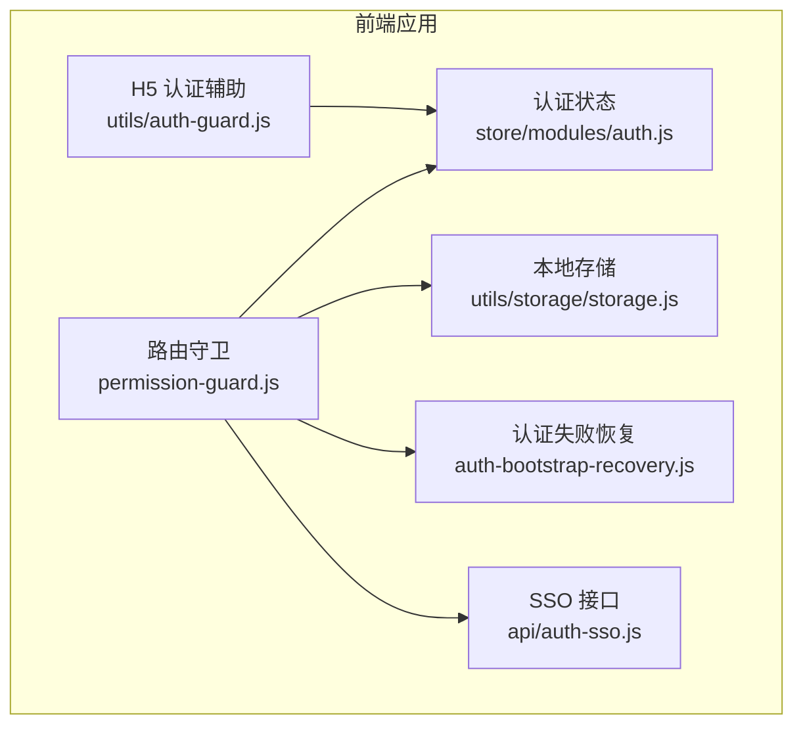
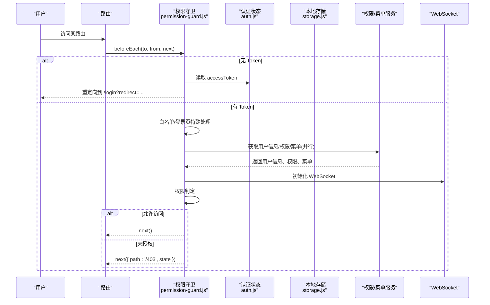
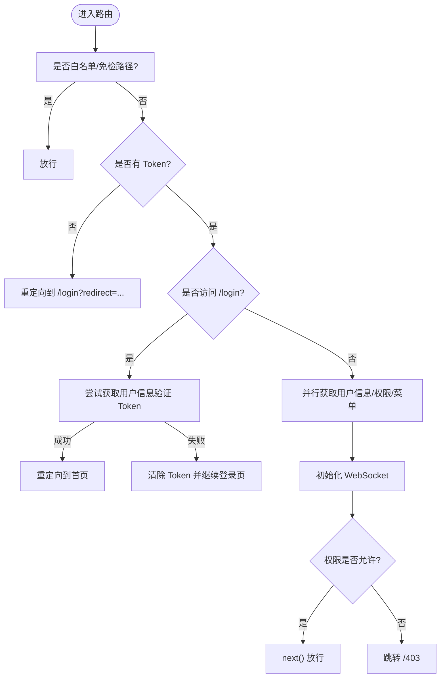
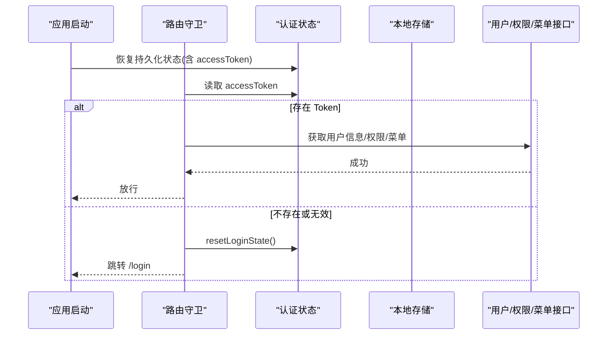
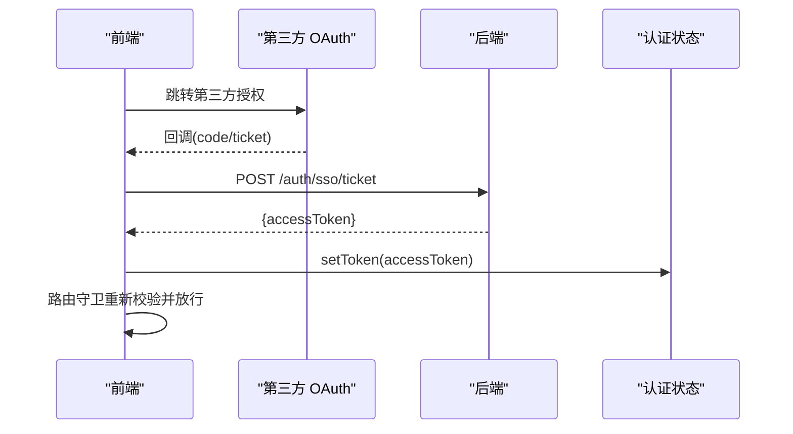
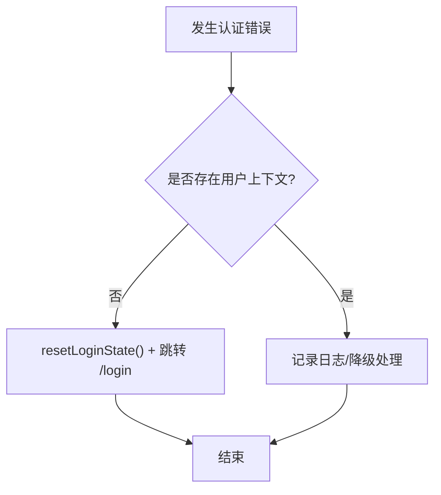
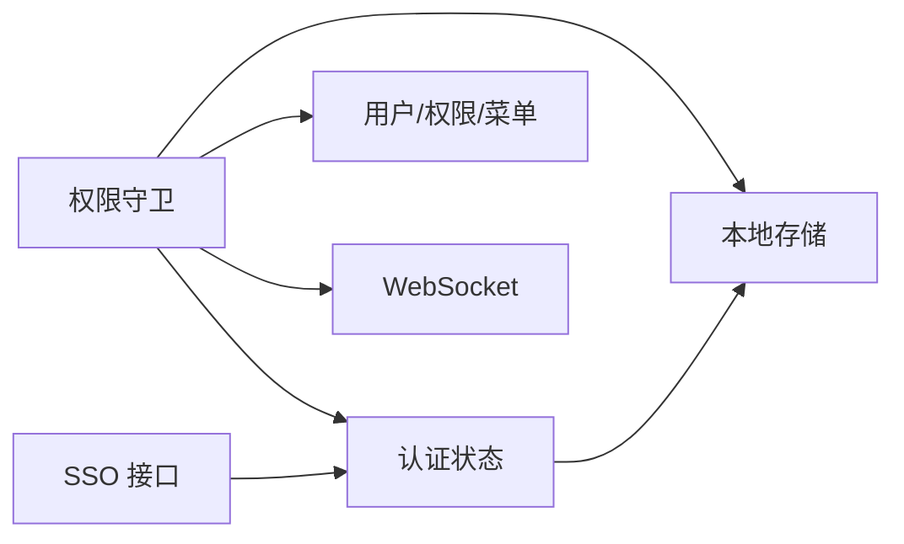

# 认证守卫

<cite>
**本文引用的文件**
- [permission-guard.js](file://forge-admin-ui/src/router/guards/permission-guard.js)
- [auth-bootstrap-recovery.js](file://forge-admin-ui/src/router/guards/auth-bootstrap-recovery.js)
- [auth.js](file://forge-admin-ui/src/store/modules/auth.js)
- [storage.js](file://forge-admin-ui/src/utils/storage/storage.js)
- [auth-sso.js](file://forge-admin-ui/src/api/auth-sso.js)
- [auth-guard.js](file://forge-h5-ui/src/utils/auth-guard.js)
</cite>

## 目录
1. [简介](#简介)
2. [项目结构](#项目结构)
3. [核心组件](#核心组件)
4. [架构总览](#架构总览)
5. [详细组件分析](#详细组件分析)
6. [依赖关系分析](#依赖关系分析)
7. [性能考量](#性能考量)
8. [故障排查指南](#故障排查指南)
9. [结论](#结论)
10. [附录](#附录)

## 简介
本技术文档聚焦于 Forge Admin 前端的“认证守卫”实现，围绕以下目标展开：
- 解析认证检查流程：用户登录状态验证、Token 有效性检查与会话管理。
- 说明认证启动恢复机制：本地存储的 Token 恢复、会话状态同步与自动登录逻辑。
- 阐述 SSO 集成处理：第三方登录回调、OAuth 流程与身份状态管理。
- 解释错误处理机制：Token 过期处理、登录失效重定向与错误状态恢复。
- 提供配置选项与自定义扩展方法。
- 给出调试技巧与常见问题解决方案。

## 项目结构
认证相关代码主要分布在路由守卫、状态管理与工具模块中：
- 路由守卫：权限与认证校验入口，负责拦截路由、校验 Token、拉取用户信息与菜单、控制跳转。
- 状态管理：集中维护 Token、用户信息、登出状态等，并提供重置与持久化能力。
- 存储工具：封装带过期时间的本地存储读写，用于 Token 与敏感数据的持久化。
- SSO API：提供创建 SSO Ticket 的能力，便于对接第三方登录。
- H5 端认证辅助：提供 ensureLogin 等便捷方法，统一移动端认证流程。

图表来源
- [permission-guard.js:87-275](file://forge-admin-ui/src/router/guards/permission-guard.js#L87-L275)
- [auth-bootstrap-recovery.js:1-12](file://forge-admin-ui/src/router/guards/auth-bootstrap-recovery.js#L1-L12)
- [auth.js:7-111](file://forge-admin-ui/src/store/modules/auth.js#L7-L111)
- [storage.js:3-58](file://forge-admin-ui/src/utils/storage/storage.js#L3-L58)
- [auth-sso.js:1-6](file://forge-admin-ui/src/api/auth-sso.js#L1-L6)
- [auth-guard.js:1-31](file://forge-h5-ui/src/utils/auth-guard.js#L1-L31)

章节来源
- [permission-guard.js:87-275](file://forge-admin-ui/src/router/guards/permission-guard.js#L87-L275)
- [auth.js:7-111](file://forge-admin-ui/src/store/modules/auth.js#L7-L111)
- [storage.js:3-58](file://forge-admin-ui/src/utils/storage/storage.js#L3-L58)
- [auth-sso.js:1-6](file://forge-admin-ui/src/api/auth-sso.js#L1-L6)
- [auth-guard.js:1-31](file://forge-h5-ui/src/utils/auth-guard.js#L1-L31)

## 核心组件
- 路由守卫（permission-guard）
  - 职责：在每次路由切换时进行认证与权限校验；无 Token 时引导登录；有 Token 时验证并拉取用户信息、权限与菜单；必要时强制改密或拒绝访问。
  - 关键点：白名单放行、登录页 Token 校验、密钥交换前置、用户信息/权限/菜单并行获取、WebSocket 初始化时机、未授权跳转。
- 认证状态（auth store）
  - 职责：维护 accessToken、userInfo、staffInfo、isLoggingOut；提供设置/重置 Token、退出登录、角色切换等方法；支持按租户隔离的持久化键。
- 本地存储（storage）
  - 职责：封装带过期时间的 key-value 存取；支持 prefixKey 命名空间；自动清理过期数据。
- SSO 接口（auth-sso）
  - 职责：提供 createSsoTicket 调用后端 SSO 票据接口，用于第三方登录流程。
- H5 认证辅助（auth-guard）
  - 职责：提供 ensureLogin 统一鉴权入口，确保登录态并按需加载用户信息，失败则重定向登录。

章节来源
- [permission-guard.js:87-275](file://forge-admin-ui/src/router/guards/permission-guard.js#L87-L275)
- [auth.js:7-111](file://forge-admin-ui/src/store/modules/auth.js#L7-L111)
- [storage.js:3-58](file://forge-admin-ui/src/utils/storage/storage.js#L3-L58)
- [auth-sso.js:1-6](file://forge-admin-ui/src/api/auth-sso.js#L1-L6)
- [auth-guard.js:1-31](file://forge-h5-ui/src/utils/auth-guard.js#L1-L31)

## 架构总览
下图展示了认证守卫在页面导航时的整体交互：从路由进入开始，依次进行白名单判断、Token 校验、用户信息与权限/菜单加载、权限判定与最终放行或跳转。

图表来源
- [permission-guard.js:87-275](file://forge-admin-ui/src/router/guards/permission-guard.js#L87-L275)
- [auth.js:7-111](file://forge-admin-ui/src/store/modules/auth.js#L7-L111)
- [storage.js:3-58](file://forge-admin-ui/src/utils/storage/storage.js#L3-L58)

## 详细组件分析

### 认证检查流程（路由守卫）
- 白名单与免检路径
  - 对根路径、首页、个人中心、MCP 授权、403 等路径直接放行。
  - 对 workspace 前缀路径放行。
- 无 Token 处理
  - 若当前无 accessToken，且目标不在白名单，则重定向至登录页并携带 redirect 参数。
- 登录页 Token 校验
  - 访问 /login 时尝试通过获取用户信息来验证 Token；有效则跳转到首页，无效则清除 Token 并继续渲染登录页。
- 用户信息与权限/菜单加载
  - 首次进入或缓存缺失时，并行请求用户信息与权限，写入本地存储，随后加载菜单数据。
  - 成功后初始化 WebSocket 客户端。
- 强制改密
  - 当用户标记为需要强制改密时，非改密页面将被重定向至改密页。
- 权限判定
  - 根据已加载的 accessRoutes 与目标路径匹配，决定是否放行或跳转 403。
- 异常兜底
  - 捕获异常后标记守卫完成并跳转 404，避免路由卡死。

图表来源
- [permission-guard.js:87-275](file://forge-admin-ui/src/router/guards/permission-guard.js#L87-L275)

章节来源
- [permission-guard.js:87-275](file://forge-admin-ui/src/router/guards/permission-guard.js#L87-L275)

### 认证启动恢复（本地 Token 恢复与自动登录）
- 本地存储恢复
  - 使用带过期时间的本地存储保存 Token 与用户信息；页面刷新时由 Pinia 持久化策略与本地存储共同恢复状态。
- 自动登录逻辑
  - 路由守卫检测到 Token 存在时，会尝试拉取用户信息以验证有效性；有效则继续业务流，无效则清理并重定向。
- 失败恢复
  - 当初始阶段（如获取用户信息/菜单）失败且尚未建立用户上下文时，调用恢复函数重置登录态并跳转登录页，避免停留在空白页。

图表来源
- [auth.js:7-111](file://forge-admin-ui/src/store/modules/auth.js#L7-L111)
- [storage.js:3-58](file://forge-admin-ui/src/utils/storage/storage.js#L3-L58)
- [permission-guard.js:87-275](file://forge-admin-ui/src/router/guards/permission-guard.js#L87-L275)
- [auth-bootstrap-recovery.js:1-12](file://forge-admin-ui/src/router/guards/auth-bootstrap-recovery.js#L1-L12)

章节来源
- [auth.js:7-111](file://forge-admin-ui/src/store/modules/auth.js#L7-L111)
- [storage.js:3-58](file://forge-admin-ui/src/utils/storage/storage.js#L3-L58)
- [permission-guard.js:87-275](file://forge-admin-ui/src/router/guards/permission-guard.js#L87-L275)
- [auth-bootstrap-recovery.js:1-12](file://forge-admin-ui/src/router/guards/auth-bootstrap-recovery.js#L1-L12)

### SSO 集成处理（第三方登录回调与 OAuth）
- 票据创建
  - 通过 createSsoTicket 发起后端 SSO 票据申请，后续可结合回调地址完成第三方授权。
- 状态管理
  - 认证成功后，后端应返回 Token；前端通过 setToken 写入认证状态，并在路由守卫中触发用户信息与权限/菜单的加载。
- 典型流程
  - 前端跳转至第三方授权 -> 回调携带 code/ticket -> 调用 createSsoTicket -> 获得 Token -> 更新状态 -> 路由守卫放行。

图表来源
- [auth-sso.js:1-6](file://forge-admin-ui/src/api/auth-sso.js#L1-L6)
- [auth.js:28-37](file://forge-admin-ui/src/store/modules/auth.js#L28-L37)
- [permission-guard.js:87-275](file://forge-admin-ui/src/router/guards/permission-guard.js#L87-L275)

章节来源
- [auth-sso.js:1-6](file://forge-admin-ui/src/api/auth-sso.js#L1-L6)
- [auth.js:28-37](file://forge-admin-ui/src/store/modules/auth.js#L28-L37)
- [permission-guard.js:87-275](file://forge-admin-ui/src/router/guards/permission-guard.js#L87-L275)

### 错误处理机制（Token 过期、登录失效、状态恢复）
- Token 过期/无效
  - 访问 /login 时若验证失败，将清除 Token 并允许继续渲染登录页。
  - 其他场景下若获取用户信息/权限/菜单失败且无用户上下文，调用恢复函数重置登录态并跳转登录页。
- 登录失效重定向
  - 无 Token 或 Token 无效时统一重定向至 /login，并保留原始目标路径以便登录后回跳。
- 错误状态恢复
  - 通过 recoverFromAuthBootstrapFailure 重置登录态、标记守卫完成并安全跳转，避免页面挂起。

图表来源
- [permission-guard.js:112-136](file://forge-admin-ui/src/router/guards/permission-guard.js#L112-L136)
- [permission-guard.js:190-199](file://forge-admin-ui/src/router/guards/permission-guard.js#L190-L199)
- [auth-bootstrap-recovery.js:1-12](file://forge-admin-ui/src/router/guards/auth-bootstrap-recovery.js#L1-L12)

章节来源
- [permission-guard.js:112-136](file://forge-admin-ui/src/router/guards/permission-guard.js#L112-L136)
- [permission-guard.js:190-199](file://forge-admin-ui/src/router/guards/permission-guard.js#L190-L199)
- [auth-bootstrap-recovery.js:1-12](file://forge-admin-ui/src/router/guards/auth-bootstrap-recovery.js#L1-L12)

### 配置选项与自定义扩展
- 白名单与免检路径
  - 可在守卫内调整 AUTH_ROUTE_ALLOWLIST 与 AUTH_ROUTE_PREFIX_ALLOWLIST，控制无需认证的页面范围。
- 强制改密策略
  - 通过 shouldForcePasswordChange 与 PASSWORD_CHANGE_ROUTE 控制强制改密行为与目标路径。
- 本地存储命名空间
  - 可通过 storage 的 prefixKey 对不同环境/租户进行隔离，避免 Key 冲突。
- 扩展点
  - 在路由守卫中增加自定义鉴权逻辑（如二次校验、审计埋点）。
  - 在 auth store 中扩展更多状态（如多角色切换、企业微信/钉钉身份字段）。
  - 在 SSO 流程中接入更多第三方提供商（如企业微信、飞书、Google）。

章节来源
- [permission-guard.js:10-22](file://forge-admin-ui/src/router/guards/permission-guard.js#L10-L22)
- [permission-guard.js:83-85](file://forge-admin-ui/src/router/guards/permission-guard.js#L83-L85)
- [storage.js:3-7](file://forge-admin-ui/src/utils/storage/storage.js#L3-L7)

### H5 端认证辅助
- ensureLogin
  - 统一入口：若无登录态则跳转登录；若已登录但缺少用户信息则拉取，失败则重置并跳转。
- toLogin
  - 封装重定向逻辑，便于复用。

章节来源
- [auth-guard.js:1-31](file://forge-h5-ui/src/utils/auth-guard.js#L1-L31)

## 依赖关系分析
- 耦合关系
  - 路由守卫依赖认证状态、本地存储、权限/菜单服务与 WebSocket 初始化。
  - 认证状态依赖 Pinia 持久化与本地存储，负责 Token 与用户信息的生命周期管理。
  - SSO 接口仅作为 HTTP 调用层，不直接持有状态。
- 外部依赖
  - 加密密钥交换：在请求任何加密接口前需完成 initKeyExchange，保证通信安全。
  - WebSocket：在用户信息/权限/菜单加载成功后初始化，保障实时消息通道可用。
- 潜在循环依赖
  - 当前实现中各模块职责清晰，未见明显循环依赖。

图表来源
- [permission-guard.js:87-275](file://forge-admin-ui/src/router/guards/permission-guard.js#L87-L275)
- [auth.js:7-111](file://forge-admin-ui/src/store/modules/auth.js#L7-L111)
- [storage.js:3-58](file://forge-admin-ui/src/utils/storage/storage.js#L3-L58)
- [auth-sso.js:1-6](file://forge-admin-ui/src/api/auth-sso.js#L1-L6)

章节来源
- [permission-guard.js:87-275](file://forge-admin-ui/src/router/guards/permission-guard.js#L87-L275)
- [auth.js:7-111](file://forge-admin-ui/src/store/modules/auth.js#L7-L111)
- [storage.js:3-58](file://forge-admin-ui/src/utils/storage/storage.js#L3-L58)
- [auth-sso.js:1-6](file://forge-admin-ui/src/api/auth-sso.js#L1-L6)

## 性能考量
- 并行请求
  - 用户信息与权限并行获取，减少首屏等待时间。
- 最小化网络开销
  - 仅在必要时拉取用户信息与菜单，避免重复请求。
- 本地缓存
  - 使用带过期时间的本地存储降低频繁网络请求，同时保证数据时效性。
- 资源初始化时机
  - WebSocket 在用户信息/权限/菜单加载完成后初始化，避免无效连接。

[本节为通用指导，不直接分析具体文件]

## 故障排查指南
- 无法进入系统（白屏或卡在登录）
  - 检查路由守卫是否正确放行白名单路径。
  - 确认本地存储中的 Token 是否有效且未过期。
  - 查看用户信息/权限/菜单接口是否返回正常。
- 登录后仍被重定向到登录页
  - 检查 /login 页面的 Token 验证分支是否执行成功。
  - 确认 resetLoginState 是否误清除了必要状态。
- 强制改密导致无法访问
  - 核对 shouldForcePasswordChange 条件与目标路径配置。
- SSO 回调失败
  - 检查 createSsoTicket 调用参数与后端返回。
  - 确认回调后是否正确写入 Token 并触发路由守卫重新校验。
- H5 端认证异常
  - 使用 ensureLogin 的统一错误分支定位问题：是否未登录、是否拉取用户信息失败。

章节来源
- [permission-guard.js:112-136](file://forge-admin-ui/src/router/guards/permission-guard.js#L112-L136)
- [permission-guard.js:190-199](file://forge-admin-ui/src/router/guards/permission-guard.js#L190-L199)
- [auth.js:61-106](file://forge-admin-ui/src/store/modules/auth.js#L61-L106)
- [auth-guard.js:10-30](file://forge-h5-ui/src/utils/auth-guard.js#L10-L30)

## 结论
Forge Admin 的认证守卫以路由守卫为核心，结合状态管理与本地存储，实现了完整的认证检查、启动恢复、SSO 集成与错误处理机制。通过白名单、强制改密、权限判定与异常兜底，保障了系统的安全性与用户体验。建议在扩展时遵循现有模式，保持职责清晰与低耦合，以提升可维护性与可测试性。

## 附录
- 关键流程参考
  - 路由守卫主流程：[permission-guard.js:87-275](file://forge-admin-ui/src/router/guards/permission-guard.js#L87-L275)
  - 认证失败恢复：[auth-bootstrap-recovery.js:1-12](file://forge-admin-ui/src/router/guards/auth-bootstrap-recovery.js#L1-L12)
  - 认证状态管理：[auth.js:7-111](file://forge-admin-ui/src/store/modules/auth.js#L7-L111)
  - 本地存储封装：[storage.js:3-58](file://forge-admin-ui/src/utils/storage/storage.js#L3-L58)
  - SSO 接口：[auth-sso.js:1-6](file://forge-admin-ui/src/api/auth-sso.js#L1-L6)
  - H5 认证辅助：[auth-guard.js:1-31](file://forge-h5-ui/src/utils/auth-guard.js#L1-L31)