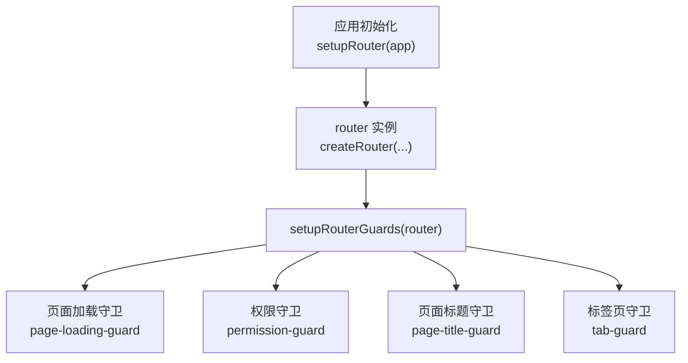
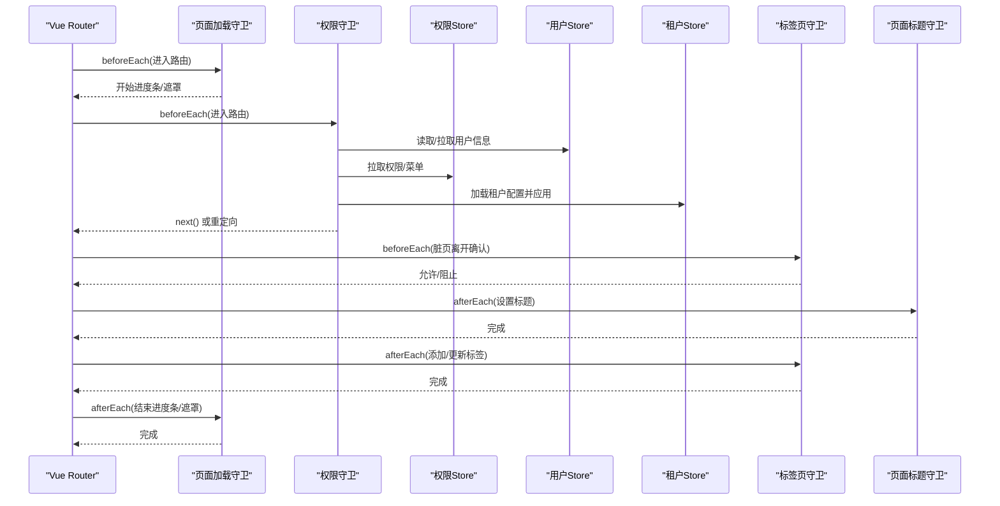
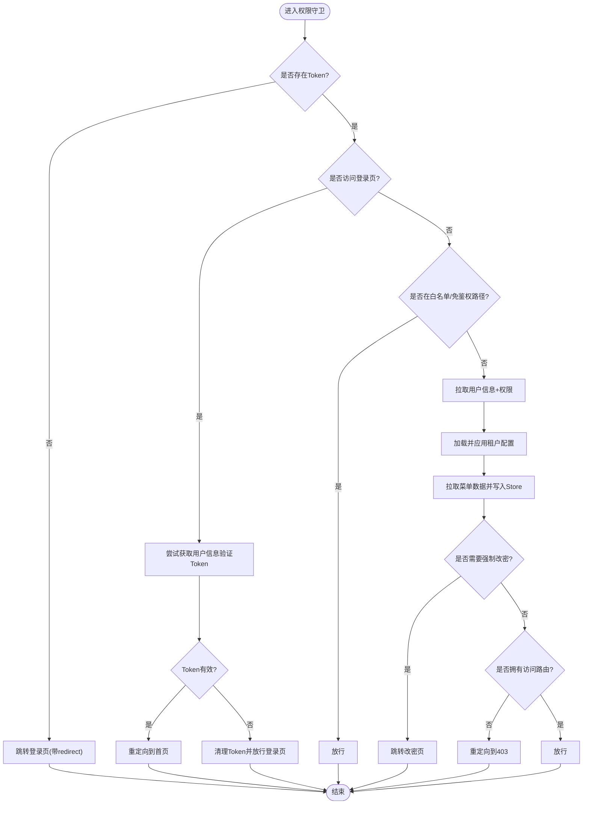
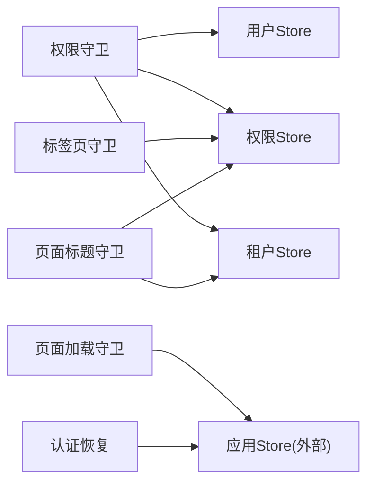

# 路由守卫

<cite>
**本文引用的文件**
- [index.js](file://forge-admin-ui/src/router/index.js)
- [guards/index.js](file://forge-admin-ui/src/router/guards/index.js)
- [permission-guard.js](file://forge-admin-ui/src/router/guards/permission-guard.js)
- [page-loading-guard.js](file://forge-admin-ui/src/router/guards/page-loading-guard.js)
- [page-title-guard.js](file://forge-admin-ui/src/router/guards/page-title-guard.js)
- [tab-guard.js](file://forge-admin-ui/src/router/guards/tab-guard.js)
- [auth-bootstrap-recovery.js](file://forge-admin-ui/src/router/guards/auth-bootstrap-recovery.js)
- [auth.js](file://forge-admin-ui/src/store/modules/auth.js)
- [permission.js](file://forge-admin-ui/src/store/modules/permission.js)
- [user.js](file://forge-admin-ui/src/store/modules/user.js)
- [tenant.js](file://forge-admin-ui/src/store/modules/tenant.js)
</cite>

## 目录
1. [简介](#简介)
2. [项目结构](#项目结构)
3. [核心组件](#核心组件)
4. [架构总览](#架构总览)
5. [详细组件分析](#详细组件分析)
6. [依赖关系分析](#依赖关系分析)
7. [性能考量](#性能考量)
8. [故障排查指南](#故障排查指南)
9. [结论](#结论)
10. [附录](#附录)

## 简介
本技术文档围绕 Forge Admin 前端的路由守卫系统，系统性解析 setupRouterGuards 的实现原理与协作机制，覆盖全局前置守卫、后置守卫与导航守卫的完整流程。重点说明认证检查（登录态、Token 有效性、会话管理）、权限验证（角色权限、菜单权限、数据权限隔离）、租户隔离（上下文切换与数据边界）、动态菜单生成（触发时机与缓存策略），以及 SSO 集成、第三方登录回调处理与错误处理机制。文末提供自定义路由守卫的开发指南与调试技巧。

## 项目结构
- 路由入口与注册：定义手动路由、自动路由合并、历史模式选择，并在应用启动时安装路由并挂载守卫。
- 守卫装配：统一在 setupRouterGuards 中按序创建页面加载、权限校验、标题设置、标签页管理的守卫。
- 状态管理：通过 Pinia Store 维护认证、用户、权限、租户等全局状态，供守卫与业务模块共享。

图表来源
- [index.js:274-286](file://forge-admin-ui/src/router/index.js#L274-L286)
- [guards/index.js:1-12](file://forge-admin-ui/src/router/guards/index.js#L1-L12)

章节来源
- [index.js:24-286](file://forge-admin-ui/src/router/index.js#L24-L286)
- [guards/index.js:1-12](file://forge-admin-ui/src/router/guards/index.js#L1-L12)

## 核心组件
- 权限守卫：负责无 Token 跳转登录、访问白名单放行、Token 有效性校验、用户信息与权限拉取、菜单数据获取与应用、强制改密拦截、未授权重定向。
- 页面加载守卫：在路由切换期间控制全局加载条与遮罩，确保异常或守卫未完成时也能恢复状态。
- 页面标题守卫：根据路由 meta、菜单树与租户配置计算最终浏览器标题。
- 标签页守卫：管理多标签页的添加、更新、激活与脏页离开确认；支持跳过标签页的特殊路由。
- 认证恢复：当认证引导失败时重置登录态并重定向到登录页。

章节来源
- [permission-guard.js:87-275](file://forge-admin-ui/src/router/guards/permission-guard.js#L87-L275)
- [page-loading-guard.js:4-54](file://forge-admin-ui/src/router/guards/page-loading-guard.js#L4-L54)
- [page-title-guard.js:51-74](file://forge-admin-ui/src/router/guards/page-title-guard.js#L51-L74)
- [tab-guard.js:71-154](file://forge-admin-ui/src/router/guards/tab-guard.js#L71-L154)
- [auth-bootstrap-recovery.js:1-12](file://forge-admin-ui/src/router/guards/auth-bootstrap-recovery.js#L1-L12)

## 架构总览
下图展示了从路由切换到页面渲染过程中各守卫与 Store 的交互顺序，包括认证、权限、菜单、租户配置与标签页管理。

图表来源
- [guards/index.js:6-11](file://forge-admin-ui/src/router/guards/index.js#L6-L11)
- [permission-guard.js:87-275](file://forge-admin-ui/src/router/guards/permission-guard.js#L87-L275)
- [page-loading-guard.js:27-52](file://forge-admin-ui/src/router/guards/page-loading-guard.js#L27-L52)
- [page-title-guard.js:51-74](file://forge-admin-ui/src/router/guards/page-title-guard.js#L51-L74)
- [tab-guard.js:71-154](file://forge-admin-ui/src/router/guards/tab-guard.js#L71-L154)

## 详细组件分析

### 权限守卫（认证、权限、菜单、租户）
- 白名单与免鉴权路径：对首页、个人中心、MCP 授权、错误页及 workspace 前缀进行放行。
- 无 Token 处理：直接跳转到登录页，携带 redirect 参数以便登录后回跳。
- 访问登录页时的 Token 校验：尝试获取用户信息以验证 Token 有效性；有效则重定向至首页，无效则清理 Token 并放行登录页。
- 首次进入：并发拉取用户信息与权限，持久化用户资料与数据权限，加载租户配置并应用主题/布局等，随后拉取菜单数据并写入权限 Store，最后初始化 WebSocket。
- 强制改密：若用户标记为需改密且目标非改密页，强制跳转至改密页。
- 菜单数据缺失重试：若已存在用户信息但菜单未加载，重新拉取用户信息、权限与菜单。
- 路由访问控制：基于 accessRoutes 匹配目标路径，未授权时重定向到 403 并附带来源信息。
- 错误兜底：捕获异常后标记守卫完成并跳转到 404，附带原始路径。

图表来源
- [permission-guard.js:87-275](file://forge-admin-ui/src/router/guards/permission-guard.js#L87-L275)

章节来源
- [permission-guard.js:10-275](file://forge-admin-ui/src/router/guards/permission-guard.js#L10-L275)
- [auth-bootstrap-recovery.js:1-12](file://forge-admin-ui/src/router/guards/auth-bootstrap-recovery.js#L1-L12)

### 页面加载守卫
- 在进入路由时开启全局加载遮罩与进度条，延迟显示避免闪烁。
- 在路由完成后关闭遮罩与进度条，并确保路由守卫完成标志位被设置，防止阻塞后续流程。
- 在路由错误时关闭遮罩、提示错误，并保证守卫完成标志位被设置。

章节来源
- [page-loading-guard.js:4-54](file://forge-admin-ui/src/router/guards/page-loading-guard.js#L4-L54)

### 页面标题守卫
- 根据租户配置的基础标题与路由 meta.title 组合成最终浏览器标题。
- 对动态业务页面（/ai/crud-page/*）优先使用标签页中的动态标题或查询参数 title，否则回退到菜单树查找。

章节来源
- [page-title-guard.js:1-74](file://forge-admin-ui/src/router/guards/page-title-guard.js#L1-L74)

### 标签页守卫
- 离开确认：若当前标签页有未保存变更，弹出确认框，支持绕过特定路径。
- 标签管理：根据路由 meta.skipTab 决定是否跳过标签；根据路径与查询参数生成唯一 key；支持隐藏业务运行时页面的通用标题替换为具体名称；支持强制关闭与可关闭属性。
- 激活与更新：新增或更新标签元信息，并设置为活动标签。

章节来源
- [tab-guard.js:1-154](file://forge-admin-ui/src/router/guards/tab-guard.js#L1-L154)

### 认证恢复
- 当认证引导失败时，重置登录态、标记路由守卫完成，并跳转到登录页，必要时携带 redirect 参数。

章节来源
- [auth-bootstrap-recovery.js:1-12](file://forge-admin-ui/src/router/guards/auth-bootstrap-recovery.js#L1-L12)

### 状态管理与数据流
- 认证 Store：维护 accessToken、用户信息、员工信息等，提供重置登录态、退出登录、切换角色等方法，并在重置时清理本地存储、WebSocket 连接与密钥交换状态。
- 用户 Store：集中管理用户信息、员工信息、数据权限，并提供常用 getter（如角色、权限、租户 ID 等）。
- 权限 Store：将后端返回的菜单/权限转换为前端菜单树与可访问路由集合，同时维护所有菜单（含隐藏）用于标题查找；支持从菜单数据推导首页路径。
- 租户 Store：加载并缓存租户配置，提供系统名称、Logo、主题、布局等 getter，并在登出时清空。

章节来源
- [auth.js:7-112](file://forge-admin-ui/src/store/modules/auth.js#L7-L112)
- [user.js:26-137](file://forge-admin-ui/src/store/modules/user.js#L26-L137)
- [permission.js:14-368](file://forge-admin-ui/src/store/modules/permission.js#L14-L368)
- [tenant.js:4-86](file://forge-admin-ui/src/store/modules/tenant.js#L4-L86)

## 依赖关系分析
- 路由入口依赖守卫装配函数，守卫之间相互独立但共享 Store。
- 权限守卫依赖用户、权限、租户 Store，并通过 API 拉取数据。
- 标签页与标题守卫依赖权限 Store 的菜单树与路由 meta。
- 认证 Store 在登出或切换角色时联动重置其他 Store 与资源。

图表来源
- [permission-guard.js:87-275](file://forge-admin-ui/src/router/guards/permission-guard.js#L87-L275)
- [tab-guard.js:71-154](file://forge-admin-ui/src/router/guards/tab-guard.js#L71-L154)
- [page-title-guard.js:51-74](file://forge-admin-ui/src/router/guards/page-title-guard.js#L51-L74)
- [page-loading-guard.js:27-52](file://forge-admin-ui/src/router/guards/page-loading-guard.js#L27-L52)
- [auth-bootstrap-recovery.js:1-12](file://forge-admin-ui/src/router/guards/auth-bootstrap-recovery.js#L1-L12)

章节来源
- [guards/index.js:1-12](file://forge-admin-ui/src/router/guards/index.js#L1-L12)
- [permission-guard.js:87-275](file://forge-admin-ui/src/router/guards/permission-guard.js#L87-L275)
- [tab-guard.js:71-154](file://forge-admin-ui/src/router/guards/tab-guard.js#L71-L154)
- [page-title-guard.js:51-74](file://forge-admin-ui/src/router/guards/page-title-guard.js#L51-L74)
- [page-loading-guard.js:27-52](file://forge-admin-ui/src/router/guards/page-loading-guard.js#L27-L52)
- [auth-bootstrap-recovery.js:1-12](file://forge-admin-ui/src/router/guards/auth-bootstrap-recovery.js#L1-L12)

## 性能考量
- 并发请求：在首次进入时并发拉取用户信息与权限，减少首屏等待时间。
- 菜单缓存：权限 Store 维护 allMenus 与 menuDataLoaded，避免重复拉取与重复计算。
- 懒加载：路由组件采用异步导入，降低初始包体积。
- 防抖加载：页面加载守卫延迟显示遮罩，避免频繁切换导致的闪烁。
- 最小化副作用：仅在必要时更新标签页与标题，减少 DOM 操作。

[本节为通用性能建议，不直接分析具体文件]

## 故障排查指南
- 无法进入受保护页面：
  - 检查是否有 accessToken，若无将被重定向到登录页。
  - 检查目标路径是否在白名单或权限路由集合中。
  - 查看控制台错误日志，确认用户信息或菜单数据拉取是否成功。
- 登录后仍停留在登录页：
  - 检查 Token 验证逻辑是否抛出异常，导致清理 Token。
  - 确认首页路径是否正确，权限 Store 是否推导出正确的 $homePath。
- 强制改密循环：
  - 确认用户是否标记为需要改密，且目标不是改密页。
- 标签页异常：
  - 检查 skipTab 路由是否误加入标签。
  - 检查动态业务页面标题是否被正确覆盖。
- 标题不正确：
  - 检查路由 meta.title 与菜单树 label/name 是否一致。
  - 检查租户基础标题是否生效。

章节来源
- [permission-guard.js:87-275](file://forge-admin-ui/src/router/guards/permission-guard.js#L87-L275)
- [tab-guard.js:71-154](file://forge-admin-ui/src/router/guards/tab-guard.js#L71-L154)
- [page-title-guard.js:51-74](file://forge-admin-ui/src/router/guards/page-title-guard.js#L51-L74)
- [auth.js:61-112](file://forge-admin-ui/src/store/modules/auth.js#L61-L112)

## 结论
Forge Admin 的路由守卫体系以权限守卫为核心，结合页面加载、标题与标签页守卫，形成完整的导航安全与体验保障。通过并发拉取、菜单缓存、租户配置应用与严格的访问控制，系统在安全性、可用性与性能之间取得平衡。SSO 与第三方登录回调通过专用路由与白名单机制融入整体流程，错误处理与恢复机制确保异常场景下的用户体验。

[本节为总结性内容，不直接分析具体文件]

## 附录

### 认证检查流程（登录态、Token 有效性、会话管理）
- 无 Token：直接跳转登录页，携带 redirect。
- 访问登录页：尝试获取用户信息验证 Token；有效则重定向首页，无效则清理 Token 并放行。
- 会话管理：登出或切换角色时重置登录态、清理本地存储、断开 WebSocket、重置密钥交换状态。

章节来源
- [permission-guard.js:87-136](file://forge-admin-ui/src/router/guards/permission-guard.js#L87-L136)
- [auth.js:61-112](file://forge-admin-ui/src/store/modules/auth.js#L61-L112)

### 权限验证逻辑（角色权限、菜单权限、数据权限隔离）
- 角色权限：从用户信息中读取角色与权限集合。
- 菜单权限：基于 accessRoutes 匹配目标路径，决定放行或拒绝。
- 数据权限隔离：用户 Store 维护 dataPermission，配合后端接口实现数据边界控制。

章节来源
- [user.js:94-106](file://forge-admin-ui/src/store/modules/user.js#L94-L106)
- [permission.js:93-146](file://forge-admin-ui/src/store/modules/permission.js#L93-L146)
- [permission-guard.js:150-185](file://forge-admin-ui/src/router/guards/permission-guard.js#L150-L185)

### 租户隔离机制（上下文切换与数据边界控制）
- 加载租户配置：根据用户 tenantId 拉取配置并应用到应用 Store。
- 数据边界：结合 dataPermission 与后端接口过滤数据范围。
- 配置持久化：租户配置存储在 sessionStorage，随会话生命周期管理。

章节来源
- [permission-guard.js:172-178](file://forge-admin-ui/src/router/guards/permission-guard.js#L172-L178)
- [tenant.js:51-86](file://forge-admin-ui/src/store/modules/tenant.js#L51-L86)

### 动态菜单生成（触发时机与缓存策略）
- 触发时机：首次进入或菜单未加载时，拉取菜单数据并写入权限 Store。
- 缓存策略：allMenus 与 menuDataLoaded 用于避免重复计算与拉取；隐藏菜单也参与标题查找。

章节来源
- [permission-guard.js:181-188](file://forge-admin-ui/src/router/guards/permission-guard.js#L181-L188)
- [permission.js:14-85](file://forge-admin-ui/src/store/modules/permission.js#L14-L85)
- [permission.js:148-256](file://forge-admin-ui/src/store/modules/permission.js#L148-L256)

### SSO 集成与第三方登录回调
- 第三方登录回调：/login/callback 作为白名单路由，允许无 Token 访问。
- SSO 桥接：报告子系统通过 SSO_BRIDGE_ROUTE 进行跳转。
- MCP 授权：/mcp-authorize 作为白名单路由，支持免鉴权访问。

章节来源
- [index.js:24-56](file://forge-admin-ui/src/router/index.js#L24-L56)
- [index.js:244-248](file://forge-admin-ui/src/router/index.js#L244-L248)
- [permission-guard.js:10-22](file://forge-admin-ui/src/router/guards/permission-guard.js#L10-L22)

### 自定义路由守卫开发指南与调试技巧
- 开发指南：
  - 在 guards/index.js 中引入并调用自定义守卫函数，确保执行顺序合理。
  - 使用 beforeEach/afterEach/onError 钩子，避免阻塞主流程。
  - 通过 Store 共享状态，保持守卫无副作用或最小副作用。
- 调试技巧：
  - 在权限守卫中打印关键变量（to/from、token、用户信息、权限集合）。
  - 使用页面加载守卫的遮罩与进度条观察耗时与异常。
  - 检查标签页与标题是否符合预期，定位菜单树与 meta.title 问题。
  - 关注控制台错误与网络请求，确认 API 响应格式与错误码。

章节来源
- [guards/index.js:1-12](file://forge-admin-ui/src/router/guards/index.js#L1-L12)
- [page-loading-guard.js:27-52](file://forge-admin-ui/src/router/guards/page-loading-guard.js#L27-L52)
- [permission-guard.js:268-275](file://forge-admin-ui/src/router/guards/permission-guard.js#L268-L275)