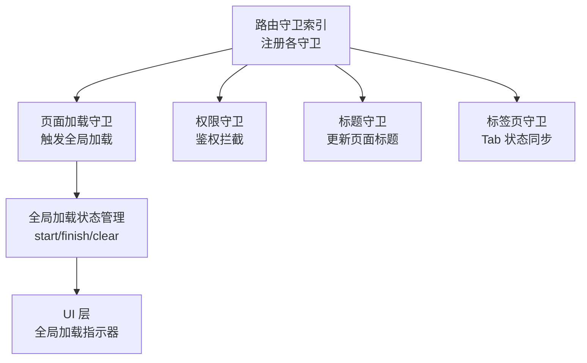
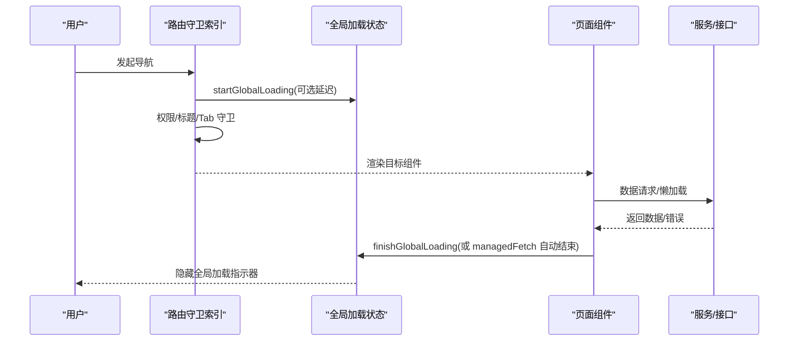
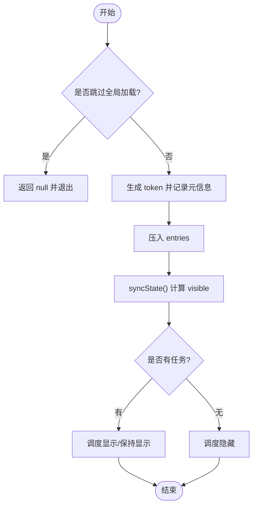
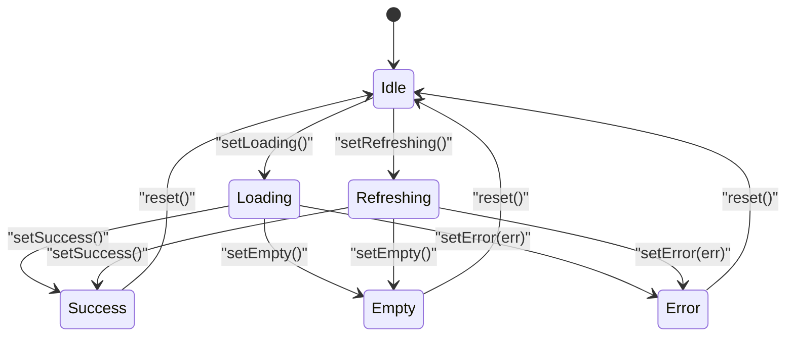
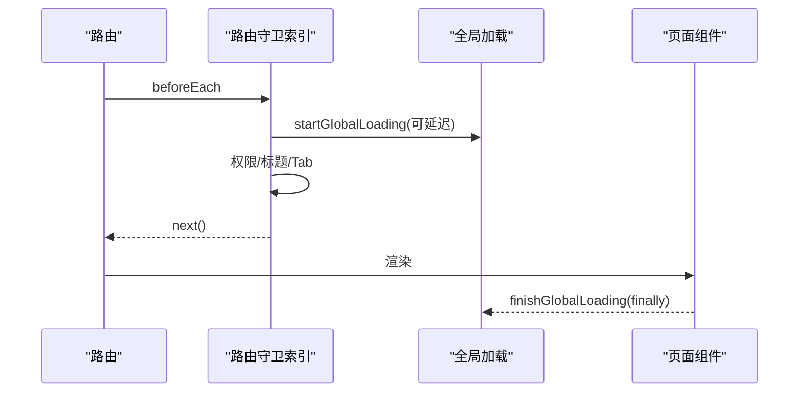
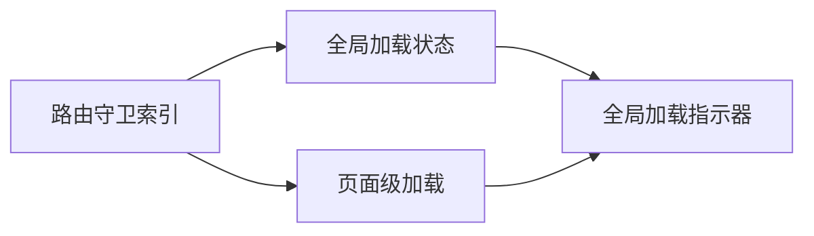

# 页面加载守卫

<cite>
**本文引用的文件**
- [路由守卫索引](file://forge-admin-ui/src/router/guards/index.js)
- [全局加载状态管理](file://forge-admin-ui/src/composables/useGlobalLoading.js)
- [页面级加载状态组合式函数](file://forge-h5-ui/src/composables/usePageLoading.js)
</cite>

## 目录
1. [简介](#简介)
2. [项目结构](#项目结构)
3. [核心组件](#核心组件)
4. [架构总览](#架构总览)
5. [详细组件分析](#详细组件分析)
6. [依赖关系分析](#依赖关系分析)
7. [性能考虑](#性能考虑)
8. [故障排查指南](#故障排查指南)
9. [结论](#结论)
10. [附录](#附录)

## 简介
本技术文档聚焦于 Forge Admin 的“页面加载守卫”能力，围绕以下目标展开：
- 解析页面加载状态管理的实现原理，包括全局加载指示器的显示与隐藏逻辑。
- 说明异步路由加载机制（懒加载、预加载、进度控制）在守卫中的协作方式。
- 阐述加载状态的生命周期管理：进入初始化、切换同步、离开清理。
- 解释加载错误处理机制：网络请求失败、组件加载异常与降级策略。
- 提供加载性能优化方案：预加载策略、缓存机制与资源优化。
- 给出自定义加载效果配置方法与调试技巧。

## 项目结构
与页面加载守卫相关的代码主要分布在以下位置：
- 路由守卫注册入口：负责集中创建并挂载各类路由守卫，包括页面加载守卫。
- 全局加载状态管理：提供统一的启动/结束/清除接口，驱动全局加载指示器。
- 页面级加载状态：为单页或模块级数据加载提供细粒度状态机与生命周期方法。

图表来源
- [路由守卫索引:1-11](file://forge-admin-ui/src/router/guards/index.js#L1-L11)
- [全局加载状态管理:202-351](file://forge-admin-ui/src/composables/useGlobalLoading.js#L202-L351)

章节来源
- [路由守卫索引:1-11](file://forge-admin-ui/src/router/guards/index.js#L1-L11)

## 核心组件
- 路由守卫索引：统一装配路由守卫，确保页面导航时按序执行加载、权限、标题、标签等逻辑。
- 全局加载状态管理：维护一个可重入的加载条目栈，支持延迟显示、最小可见时长、并发计数与消息透传；提供 withGlobalLoading、managedFetch 等便捷封装。
- 页面级加载状态：以状态机形式管理 loading/refreshing/success/empty/error/idle，并提供 run 包装异步任务，自动处理空数据与错误分支。

章节来源
- [路由守卫索引:1-11](file://forge-admin-ui/src/router/guards/index.js#L1-L11)
- [全局加载状态管理:202-351](file://forge-admin-ui/src/composables/useGlobalLoading.js#L202-L351)
- [页面级加载状态组合式函数:1-87](file://forge-h5-ui/src/composables/usePageLoading.js#L1-L87)

## 架构总览
页面导航时的加载流程由路由守卫驱动，结合全局与页面级加载状态共同完成：
- 路由进入前：路由守卫启动全局加载（可带延迟），随后进行权限校验与 Tab 同步。
- 路由渲染中：页面组件通过页面级加载状态管理数据获取，必要时复用全局加载。
- 路由离开后：清理全局与页面级加载状态，避免残留指示器或内存泄漏。

图表来源
- [路由守卫索引:1-11](file://forge-admin-ui/src/router/guards/index.js#L1-L11)
- [全局加载状态管理:202-351](file://forge-admin-ui/src/composables/useGlobalLoading.js#L202-L351)

## 详细组件分析

### 全局加载状态管理
职责与特性
- 可重入的加载条目栈：每次启动生成唯一 token，支持并发多个任务同时显示加载。
- 延迟显示与最短可见：根据配置计算延迟与最小展示时间，避免闪烁。
- 自动收尾：提供 withGlobalLoading 与 managedFetch，确保 finally 中结束加载。
- 状态暴露：active、count、message 等响应式属性便于 UI 订阅。

关键流程
- 启动：startGlobalLoading 将条目加入 entries，调用 syncState 决定显示/隐藏。
- 结束：finishGlobalLoading 移除对应 token，再次 syncState。
- 清空：clearGlobalLoading 直接清空 entries 并隐藏。
- 请求封装：withGlobalLoading 包裹任意异步任务；managedFetch 对 fetch 请求自动加/卸载。

图表来源
- [全局加载状态管理:202-351](file://forge-admin-ui/src/composables/useGlobalLoading.js#L202-L351)

章节来源
- [全局加载状态管理:202-351](file://forge-admin-ui/src/composables/useGlobalLoading.js#L202-L351)

### 页面级加载状态组合式函数
职责与特性
- 状态机：idle/loading/refreshing/success/empty/error，覆盖常见数据流场景。
- 任务包装：run(task, options) 自动设置状态、处理空数据与错误，并抛出异常。
- 刷新语义：支持 refreshing 模式，区分首次加载与下拉刷新。
- 重置能力：reset 恢复初始态，便于重新拉取数据。

典型用法
- 列表页：进入时 setLoading -> 请求 -> setEmpty/setSuccess -> 错误时 setError。
- 刷新：setRefreshing -> 请求 -> setSuccess/setEmpty/setError。

图表来源
- [页面级加载状态组合式函数:1-87](file://forge-h5-ui/src/composables/usePageLoading.js#L1-L87)

章节来源
- [页面级加载状态组合式函数:1-87](file://forge-h5-ui/src/composables/usePageLoading.js#L1-L87)

### 路由守卫与加载协同
- 守卫注册：路由守卫索引集中创建并挂载页面加载、权限、标题、标签等守卫，保证一致的导航体验。
- 加载时机：页面加载守卫在进入路由前启动全局加载，配合权限与 Tab 守卫完成前置检查。
- 卸载清理：页面离开时，应确保所有 in-flight 的全局加载被正确结束，避免残留指示器。

图表来源
- [路由守卫索引:1-11](file://forge-admin-ui/src/router/guards/index.js#L1-L11)
- [全局加载状态管理:202-351](file://forge-admin-ui/src/composables/useGlobalLoading.js#L202-L351)

章节来源
- [路由守卫索引:1-11](file://forge-admin-ui/src/router/guards/index.js#L1-L11)

## 依赖关系分析
- 低耦合：路由守卫仅负责协调，不持有业务状态；加载状态集中在 composables，便于复用与测试。
- 可组合性：页面级加载与全局加载可并存，前者关注单页数据流，后者关注全局反馈。
- 外部依赖：Pinia 用于应用状态管理（非加载核心），加载状态使用 Vue 响应式 API。

图表来源
- [路由守卫索引:1-11](file://forge-admin-ui/src/router/guards/index.js#L1-L11)
- [全局加载状态管理:202-351](file://forge-admin-ui/src/composables/useGlobalLoading.js#L202-L351)
- [页面级加载状态组合式函数:1-87](file://forge-h5-ui/src/composables/usePageLoading.js#L1-L87)

章节来源
- [路由守卫索引:1-11](file://forge-admin-ui/src/router/guards/index.js#L1-L11)
- [全局加载状态管理:202-351](file://forge-admin-ui/src/composables/useGlobalLoading.js#L202-L351)
- [页面级加载状态组合式函数:1-87](file://forge-h5-ui/src/composables/usePageLoading.js#L1-L87)

## 性能考虑
- 延迟显示：通过最小可见时长与延迟策略，避免短耗时操作导致的闪烁。
- 并发控制：基于 token 的条目栈允许多个任务并行，仅在全部结束时隐藏。
- 预加载策略：在路由级别对高频页面进行按需预加载，减少首屏等待。
- 缓存机制：对静态或低频变更的数据采用本地缓存或内存缓存，降低重复请求。
- 资源优化：拆分路由与组件，利用懒加载与代码分割，减少首包体积。
- 请求合并：对短时间内多次相同请求进行去抖/合并，减少网络压力。

[本节为通用指导，不直接分析具体文件]

## 故障排查指南
常见问题与定位思路
- 全局加载不消失：
  - 检查是否在 finally 中调用结束接口，避免遗漏 finishGlobalLoading。
  - 确认 managedFetch 是否正确注入并结束 __globalLoadingToken。
- 闪烁或过早隐藏：
  - 调整延迟与最小可见时长，避免极短任务导致闪烁。
- 并发冲突：
  - 核对 token 的唯一性与释放顺序，避免提前结束其他任务。
- 页面级状态错乱：
  - 确保 run 包裹的任务正确设置 success/empty/error，并在需要时 reset。
- 网络错误处理：
  - 在 catch 分支设置 error 状态，并给出降级 UI（如重试按钮）。

建议的调试手段
- 打印 active/count/message 观察全局加载状态变化。
- 在路由守卫前后打点，测量导航到渲染的耗时分布。
- 使用浏览器性能面板分析懒加载与资源加载瓶颈。

章节来源
- [全局加载状态管理:202-351](file://forge-admin-ui/src/composables/useGlobalLoading.js#L202-L351)
- [页面级加载状态组合式函数:1-87](file://forge-h5-ui/src/composables/usePageLoading.js#L1-L87)

## 结论
Forge Admin 的页面加载守卫通过“路由守卫 + 全局加载状态 + 页面级加载状态”的分层设计，实现了清晰、可组合且高可用的加载体验。全局加载负责一致的用户反馈，页面级加载负责细粒度的数据流控制；两者协同，既能保证用户体验，又便于扩展与调试。结合预加载、缓存与资源优化策略，可在复杂业务场景下持续改善首屏与交互性能。

[本节为总结性内容，不直接分析具体文件]

## 附录
- 自定义加载效果
  - 通过配置项调整延迟与最小可见时长，适配不同网络环境。
  - 在 UI 层监听 active/count/message，实现品牌化加载提示。
- 调试技巧
  - 在开发环境开启详细日志，记录每个 start/finish 的 token 与时间戳。
  - 针对慢接口单独埋点，评估是否需要预加载或缓存。
- 最佳实践
  - 始终使用 withGlobalLoading/managedFetch 包裹异步任务，避免忘记收尾。
  - 页面级 run 统一处理空数据与错误，保持 UI 一致性。

[本节为通用指导，不直接分析具体文件]