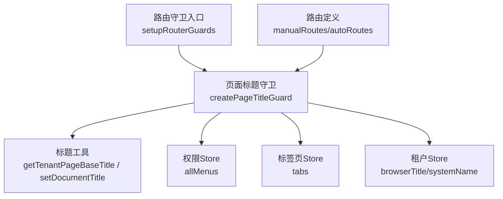
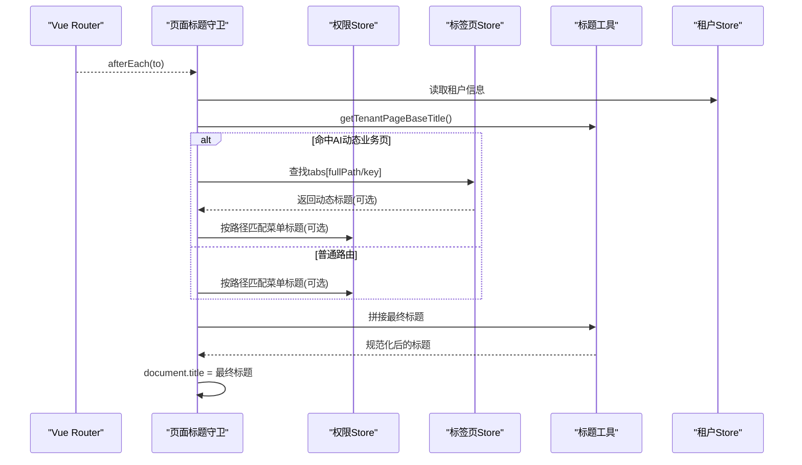
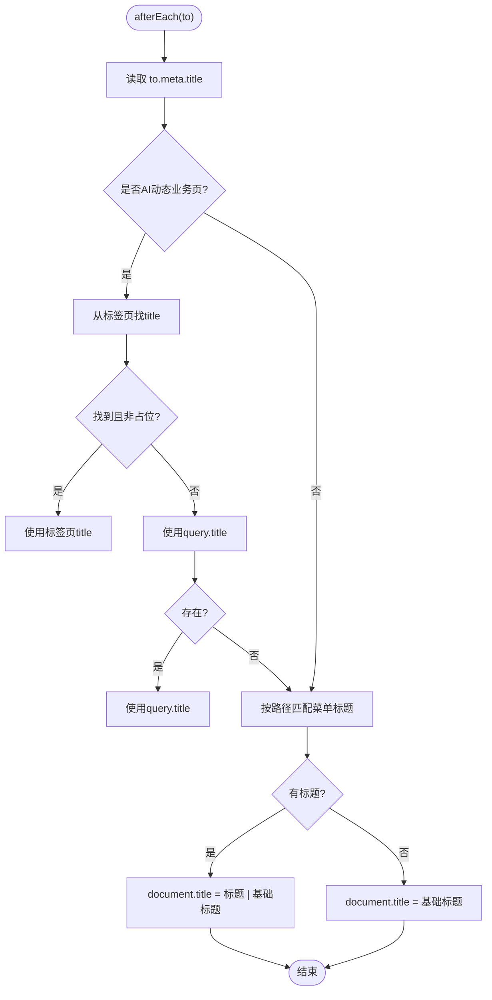
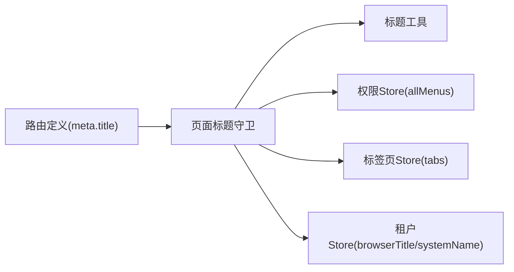

# 页面标题守卫

<cite>
**本文引用的文件**
- [page-title-guard.js](file://forge-admin-ui/src/router/guards/page-title-guard.js)
- [index.js（路由守卫聚合）](file://forge-admin-ui/src/router/guards/index.js)
- [index.js（路由定义与安装）](file://forge-admin-ui/src/router/index.js)
- [page-title.js（标题工具）](file://forge-admin-ui/src/utils/page-title.js)
- [permission.js（权限/菜单存储）](file://forge-admin-ui/src/store/modules/permission.js)
- [tab.js（标签页存储）](file://forge-admin-ui/src/store/modules/tab.js)
- [tenant.js（租户存储）](file://forge-admin-ui/src/store/modules/tenant.js)
</cite>

## 目录
1. [简介](#简介)
2. [项目结构](#项目结构)
3. [核心组件](#核心组件)
4. [架构总览](#架构总览)
5. [详细组件分析](#详细组件分析)
6. [依赖关系分析](#依赖关系分析)
7. [性能考量](#性能考量)
8. [故障排查指南](#故障排查指南)
9. [结论](#结论)
10. [附录](#附录)

## 简介
本技术文档围绕 Forge Admin 前端的“页面标题守卫”展开，系统性解析路由切换时如何动态设置浏览器标签页标题。内容涵盖：
- 路由元信息读取、标题模板渲染与多语言支持
- 路由切换时的标题同步机制与 SEO 优化要点
- 国际化标题处理策略（多语言切换、动态翻译、缓存）
- 标题格式化配置项（模板语法、变量替换、自定义规则）
- 标题守卫的性能优化（防抖、批量更新、内存管理）
- 扩展方法与调试技巧

## 项目结构
页面标题相关能力由以下模块协同完成：
- 路由守卫：在路由导航完成后统一设置 document.title
- 标题工具：提供默认标题、租户基础标题、规范化与写入方法
- 状态存储：从权限、标签页、租户等 Store 中获取菜单、动态标题与租户信息
- 路由注册：为特定路由（如 AI 动态业务页）提供 meta.title 与查询参数兼容

图表来源
- [index.js（路由守卫聚合）:1-12](file://forge-admin-ui/src/router/guards/index.js#L1-L12)
- [page-title-guard.js:1-74](file://forge-admin-ui/src/router/guards/page-title-guard.js#L1-L74)
- [page-title.js:1-23](file://forge-admin-ui/src/utils/page-title.js#L1-L23)
- [index.js（路由定义与安装）:24-287](file://forge-admin-ui/src/router/index.js#L24-L287)

章节来源
- [index.js（路由守卫聚合）:1-12](file://forge-admin-ui/src/router/guards/index.js#L1-L12)
- [index.js（路由定义与安装）:24-287](file://forge-admin-ui/src/router/index.js#L24-L287)

## 核心组件
- 页面标题守卫：监听路由后置钩子，计算最终标题并写入 document.title；对 AI 动态业务页做特殊处理，优先使用标签页或查询参数中的动态标题。
- 标题工具：提供默认标题、租户基础标题、规范化与写入方法，确保标题安全与一致性。
- 状态存储：
  - 权限 Store：提供 allMenus，用于按路径匹配菜单标题
  - 标签页 Store：提供 tabs，用于动态业务页的实时标题
  - 租户 Store：提供 browserTitle/systemName，作为基础标题来源

章节来源
- [page-title-guard.js:1-74](file://forge-admin-ui/src/router/guards/page-title-guard.js#L1-L74)
- [page-title.js:1-23](file://forge-admin-ui/src/utils/page-title.js#L1-L23)
- [permission.js](file://forge-admin-ui/src/store/modules/permission.js)
- [tab.js](file://forge-admin-ui/src/store/modules/tab.js)
- [tenant.js](file://forge-admin-ui/src/store/modules/tenant.js)

## 架构总览
标题守卫在路由导航完成后执行，遵循如下流程：
1. 读取当前路由 meta.title
2. 若命中 AI 动态业务页路径，则优先从标签页或查询参数中取动态标题
3. 否则尝试从菜单树中按路径匹配标题
4. 拼接租户基础标题形成最终 document.title
5. 若无任何标题，回退到租户基础标题

图表来源
- [page-title-guard.js:51-73](file://forge-admin-ui/src/router/guards/page-title-guard.js#L51-L73)
- [page-title.js:14-22](file://forge-admin-ui/src/utils/page-title.js#L14-L22)
- [index.js（路由定义与安装）:105-111](file://forge-admin-ui/src/router/index.js#L105-L111)

## 详细组件分析

### 页面标题守卫（createPageTitleGuard）
职责与行为：
- 监听路由后置事件，计算并设置 document.title
- 针对 AI 动态业务页（/ai/crud-page/*）：
  - 优先使用标签页中的 title（若非默认占位）
  - 其次使用 query.title
  - 再次通过 allMenus 按路径匹配标题
- 其他路由：直接使用 to.meta.title 或通过菜单匹配
- 最终标题格式：pageTitle | baseTitle；无 pageTitle 时使用 baseTitle

关键实现要点：
- 路径归一化与正则匹配，兼容带参路由（如 :id）
- 菜单匹配优先级：menuKey > path 精确匹配 > 带参路径匹配
- 标题规范化与兜底，避免空值或占位符污染

图表来源
- [page-title-guard.js:9-49](file://forge-admin-ui/src/router/guards/page-title-guard.js#L9-L49)
- [page-title-guard.js:51-73](file://forge-admin-ui/src/router/guards/page-title-guard.js#L51-L73)

章节来源
- [page-title-guard.js:1-74](file://forge-admin-ui/src/router/guards/page-title-guard.js#L1-L74)

### 标题工具（page-title.js）
职责与行为：
- normalizePageTitle：去除空白，过滤占位符（如 %...%），保证标题有效性
- getDefaultPageTitle：从环境变量读取应用标题，失败则回退默认值
- getTenantPageBaseTitle：优先使用租户的 browserTitle，其次 systemName，最后应用默认标题
- setDocumentTitle：统一写入 document.title 并规范化

使用场景：
- 守卫中统一获取基础标题
- 全局统一设置标题，避免重复逻辑

章节来源
- [page-title.js:1-23](file://forge-admin-ui/src/utils/page-title.js#L1-L23)

### 路由与元信息（router/index.js）
- 手动路由集中声明 meta.title，便于搜索引擎抓取与用户体验
- AI 动态业务页默认 meta.title 为“业务页面”，实际标题由守卫根据标签页或查询参数覆盖
- 部分页面标记 skipTab/preserveOnQuery/layout 等元信息，影响标签页与布局行为

章节来源
- [index.js（路由定义与安装）:24-287](file://forge-admin-ui/src/router/index.js#L24-L287)

### 状态存储（permission/tab/tenant）
- 权限 Store：提供 allMenus，用于按路径匹配菜单标题
- 标签页 Store：提供 tabs，用于动态业务页的实时标题
- 租户 Store：提供 browserTitle/systemName，作为基础标题来源

章节来源
- [permission.js](file://forge-admin-ui/src/store/modules/permission.js)
- [tab.js](file://forge-admin-ui/src/store/modules/tab.js)
- [tenant.js](file://forge-admin-ui/src/store/modules/tenant.js)

## 依赖关系分析
- 路由守卫依赖：
  - 标题工具：获取基础标题与规范化
  - 权限 Store：菜单树匹配
  - 标签页 Store：动态业务页标题
  - 租户 Store：基础标题来源
- 路由定义提供 meta.title 与路径模式，供守卫匹配与回退

图表来源
- [page-title-guard.js:1-74](file://forge-admin-ui/src/router/guards/page-title-guard.js#L1-L74)
- [page-title.js:1-23](file://forge-admin-ui/src/utils/page-title.js#L1-L23)
- [index.js（路由定义与安装）:24-287](file://forge-admin-ui/src/router/index.js#L24-L287)

章节来源
- [page-title-guard.js:1-74](file://forge-admin-ui/src/router/guards/page-title-guard.js#L1-L74)
- [page-title.js:1-23](file://forge-admin-ui/src/utils/page-title.js#L1-L23)
- [index.js（路由定义与安装）:24-287](file://forge-admin-ui/src/router/index.js#L24-L287)

## 性能考量
- 防抖与节流：当前守卫在 afterEach 中直接设置 document.title，未显式实现防抖/节流。对于高频路由切换场景，可考虑在守卫外层包裹防抖，减少 DOM 写入次数。
- 批量更新：当需要批量更新多个页面的标题时，可在守卫内维护一个队列，合并多次更新后一次性写入。
- 内存管理：
  - 菜单匹配使用正则表达式，建议缓存编译结果以避免重复创建 RegExp
  - 标签页与菜单数据较大时，注意 Store 的订阅与清理，避免内存泄漏
- 计算复杂度：
  - 菜单匹配为 O(n)，n 为菜单节点数；可通过建立 path→menu 的索引表优化为 O(1)
  - 路径归一化与正则匹配开销较低，但在深层嵌套菜单下仍需关注

[本节为通用性能建议，不直接分析具体代码文件]

## 故障排查指南
常见问题与定位思路：
- 标题未更新
  - 检查路由是否命中 afterEach；确认守卫已注册
  - 检查 to.meta.title 是否存在或被覆盖
  - 检查 AI 动态业务页的标签页 title 是否为占位符
- 标题为空或异常
  - 检查 normalizePageTitle 是否过滤了占位符
  - 检查租户 store 的 browserTitle/systemName 是否有效
- 动态业务页标题不生效
  - 检查 query.title 是否正确传入
  - 检查标签页 key/fullPath 是否与路由 full 一致
  - 检查菜单路径匹配是否包含参数段（如 :id）

章节来源
- [page-title-guard.js:51-73](file://forge-admin-ui/src/router/guards/page-title-guard.js#L51-L73)
- [page-title.js:3-8](file://forge-admin-ui/src/utils/page-title.js#L3-L8)
- [index.js（路由定义与安装）:105-111](file://forge-admin-ui/src/router/index.js#L105-L111)

## 结论
Forge Admin 的页面标题守卫以路由后置钩子为核心，结合菜单树、标签页与租户信息，实现了稳定、可扩展的标题动态设置机制。通过对 AI 动态业务页的特殊处理，兼顾了静态元信息与运行时动态标题的需求。建议在高频场景下引入防抖/节流与缓存优化，进一步提升性能与稳定性。

[本节为总结性内容，不直接分析具体代码文件]

## 附录

### 标题模板与变量替换
- 模板语法：当前实现采用固定拼接“pageTitle | baseTitle”，未提供复杂模板引擎
- 变量替换：
  - pageTitle：来自 to.meta.title、标签页 title、query.title 或菜单匹配
  - baseTitle：来自租户 store 的 browserTitle/systemName 或应用默认标题
- 自定义格式化：
  - 可在守卫中扩展模板函数，支持更多变量（如应用名、租户名、面包屑等）
  - 建议在标题工具中新增模板渲染方法，统一格式化逻辑

章节来源
- [page-title-guard.js:51-73](file://forge-admin-ui/src/router/guards/page-title-guard.js#L51-L73)
- [page-title.js:10-22](file://forge-admin-ui/src/utils/page-title.js#L10-L22)

### 国际化（i18n）标题处理
- 当前实现未直接集成 i18n 库，标题来源于后端或前端配置
- 多语言切换建议：
  - 将标题键值存入 Store 或本地缓存，切换语言时重新计算标题
  - 对动态业务页，可在标签页中保存语言感知的标题
- 缓存策略：
  - 对菜单标题进行语言键到文本的缓存，避免重复翻译
  - 对频繁访问的路由，缓存其最终标题，减少计算开销

[本节为概念性说明，不直接分析具体代码文件]

### SEO 优化建议
- 为重要页面设置明确的 meta.title，利于搜索引擎抓取
- 保持标题简洁、唯一，避免过长或重复
- 对动态业务页，尽量通过 query.title 或标签页 title 提供有意义的标题

[本节为概念性说明，不直接分析具体代码文件]

### 扩展方法与调试技巧
- 扩展方法：
  - 在 createPageTitleGuard 中增加新的标题来源（如用户角色、业务上下文）
  - 在标题工具中新增模板渲染与格式化规则
- 调试技巧：
  - 在 afterEach 中打印 to.meta.title、标签页 title、菜单匹配结果
  - 检查 normalizePageTitle 的输出，确认占位符被正确过滤
  - 验证租户 store 的 browserTitle/systemName 是否加载成功

章节来源
- [page-title-guard.js:51-73](file://forge-admin-ui/src/router/guards/page-title-guard.js#L51-L73)
- [page-title.js:3-8](file://forge-admin-ui/src/utils/page-title.js#L3-L8)