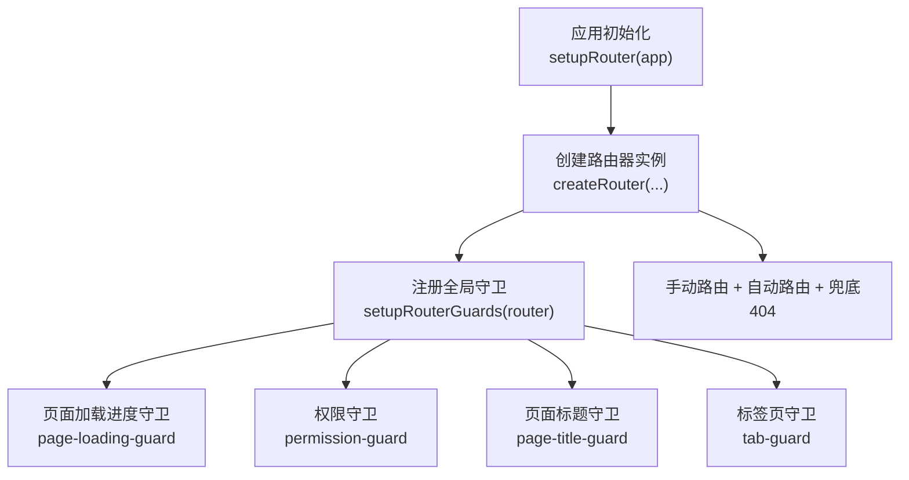
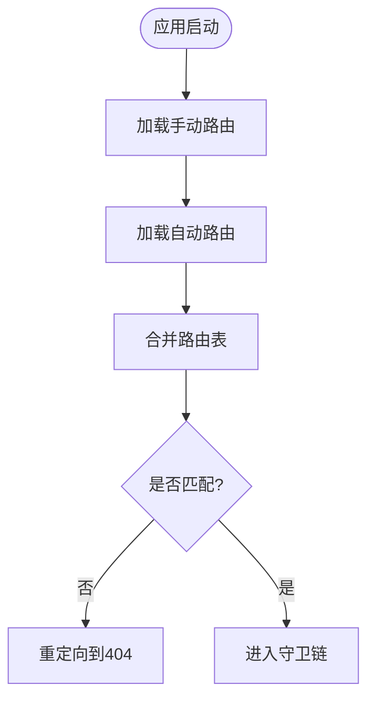
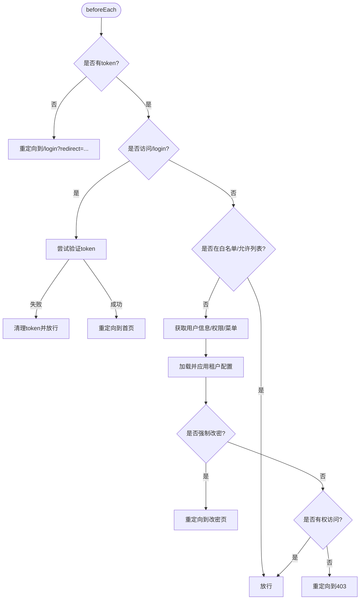
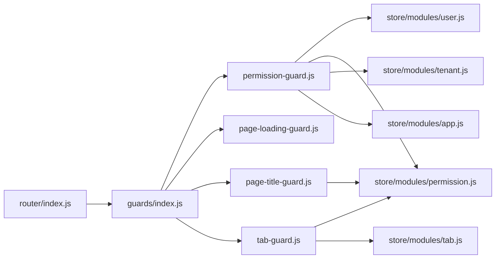

# 路由系统

<cite>
**本文引用的文件**
- [index.js](file://forge-admin-ui/src/router/index.js)
- [guards/index.js](file://forge-admin-ui/src/router/guards/index.js)
- [permission-guard.js](file://forge-admin-ui/src/router/guards/permission-guard.js)
- [page-loading-guard.js](file://forge-admin-ui/src/router/guards/page-loading-guard.js)
- [page-title-guard.js](file://forge-admin-ui/src/router/guards/page-title-guard.js)
- [tab-guard.js](file://forge-admin-ui/src/router/guards/tab-guard.js)
- [auth-bootstrap-recovery.js](file://forge-admin-ui/src/router/guards/auth-bootstrap-recovery.js)
- [whitelist.config.js](file://forge-admin-ui/src/config/whitelist.config.js)
</cite>

## 目录
1. [简介](#简介)
2. [项目结构](#项目结构)
3. [核心组件](#核心组件)
4. [架构总览](#架构总览)
5. [详细组件分析](#详细组件分析)
6. [依赖关系分析](#依赖关系分析)
7. [性能与缓存策略](#性能与缓存策略)
8. [故障排查指南](#故障排查指南)
9. [结论](#结论)
10. [附录：自定义守卫开发指南](#附录自定义守卫开发指南)

## 简介
本技术文档聚焦 Forge Admin 前端的路由系统，围绕 Vue Router 的动态路由、权限控制守卫、菜单路由映射与懒加载机制展开。重点解析路由守卫的认证检查、权限验证、租户隔离与动态菜单生成；说明路由元信息设计、嵌套路由处理与参数传递；并给出路由缓存策略、性能优化技巧与调试方法，以及自定义路由守卫的开发指南和常见问题解决方案。

## 项目结构
- 路由入口与手动路由定义位于 router/index.js，合并自动路由（基于文件系统）与兜底 404 路由，并通过 setupRouter 挂载到应用。
- 路由守卫统一在 router/guards/index.js 中注册，包括页面加载进度、权限校验、标题设置与标签页管理。
- 白名单配置在 config/whitelist.config.js，用于免鉴权访问。



**图表来源**
- [index.js:274-286](file://forge-admin-ui/src/router/index.js#L274-L286)
- [guards/index.js:6-11](file://forge-admin-ui/src/router/guards/index.js#L6-L11)

**章节来源**
- [index.js:24-286](file://forge-admin-ui/src/router/index.js#L24-L286)
- [guards/index.js:1-12](file://forge-admin-ui/src/router/guards/index.js#L1-L12)
- [whitelist.config.js](file://forge-admin-ui/src/config/whitelist.config.js)

## 核心组件
- 路由定义与合并：手动路由（登录、SSO、错误页、工作台等）、自动路由（基于文件）、兜底 404。
- 路由守卫：
  - 权限守卫：认证检查、用户信息/权限/菜单拉取、租户配置应用、强制改密、访问控制。
  - 页面加载进度守卫：路由切换时显示/隐藏全局加载条。
  - 页面标题守卫：根据路由元信息与菜单数据计算并设置 document.title。
  - 标签页守卫：脏页离开确认、Tab 增删改、标题更新与激活态管理。
- 白名单：允许无需鉴权的静态或公共路径。

**章节来源**
- [index.js:24-286](file://forge-admin-ui/src/router/index.js#L24-L286)
- [permission-guard.js:87-275](file://forge-admin-ui/src/router/guards/permission-guard.js#L87-L275)
- [page-loading-guard.js:4-54](file://forge-admin-ui/src/router/guards/page-loading-guard.js#L4-L54)
- [page-title-guard.js:51-74](file://forge-admin-ui/src/router/guards/page-title-guard.js#L51-L74)
- [tab-guard.js:71-154](file://forge-admin-ui/src/router/guards/tab-guard.js#L71-L154)
- [whitelist.config.js](file://forge-admin-ui/src/config/whitelist.config.js)

## 架构总览
下图展示了从导航触发到最终渲染的关键流程，涵盖认证、权限、菜单与租户配置的协同工作。

```mermaid
sequenceDiagram
participant U as "用户"
participant R as "Vue Router"
participant PL as "页面加载守卫"
participant PG as "权限守卫"
participant PS as "权限Store"
participant US as "用户Store"
TS as "租户Store"
API as "后端API"
U->>R : 导航到目标路由
R->>PL : beforeEach
PL-->>R : 启动全局加载条
R->>PG : beforeEach
PG->>US : 读取token/用户信息
alt 无token
PG-->>R : 重定向到登录(携带redirect)
else 有token
PG->>API : 获取用户信息/权限
API-->>PG : 返回用户与权限
PG->>TS : 加载租户配置
TS-->>PG : 返回租户配置
PG->>PS : 设置权限/菜单数据
PG-->>R : 放行或重定向(403/强制改密)
end
R->>PL : afterEach
PL-->>R : 结束加载条
R->>PT : afterEach(标题守卫)
PT-->>R : 设置document.title
R->>TB : afterEach(标签页守卫)
TB-->>R : 更新Tab状态
```

**图表来源**
- [index.js:274-286](file://forge-admin-ui/src/router/index.js#L274-L286)
- [permission-guard.js:87-275](file://forge-admin-ui/src/router/guards/permission-guard.js#L87-L275)
- [page-loading-guard.js:4-54](file://forge-admin-ui/src/router/guards/page-loading-guard.js#L4-L54)
- [page-title-guard.js:51-74](file://forge-admin-ui/src/router/guards/page-title-guard.js#L51-L74)
- [tab-guard.js:71-154](file://forge-admin-ui/src/router/guards/tab-guard.js#L71-L154)

## 详细组件分析

### 路由定义与动态路由
- 手动路由集中管理登录、SSO、错误页、工作台等关键页面，使用懒加载组件提升首屏性能。
- 自动路由通过 vue-router/auto-routes 引入，按文件结构自动生成路由表，减少手工维护成本。
- 兜底路由将未匹配路径重定向至 404，保证异常路径可控。
- 部分路由支持 beforeEnter 进行前置跳转适配（如旧版数据范围参数迁移）。



**图表来源**
- [index.js:24-286](file://forge-admin-ui/src/router/index.js#L24-L286)

**章节来源**
- [index.js:24-286](file://forge-admin-ui/src/router/index.js#L24-L286)

### 权限控制守卫（认证、权限、租户隔离、动态菜单）
- 认证检查：无 token 时重定向到登录页并携带 redirect；访问登录页时尝试验证 token，无效则清理并重定向。
- 用户信息与权限：首次进入或刷新后，并发拉取用户信息与权限，写入 Store 并持久化到本地存储。
- 租户隔离：根据用户租户 ID 加载租户配置并应用到应用状态，实现多租户差异化行为。
- 动态菜单：拉取菜单数据并注入权限 Store，供菜单渲染与路由访问控制使用。
- 访问控制：基于白名单、内置允许列表与已授权路由集合判断是否可访问目标路径；否则重定向到 403。
- 强制改密：若用户被标记为需强制改密，则重定向到指定页面。



**图表来源**
- [permission-guard.js:87-275](file://forge-admin-ui/src/router/guards/permission-guard.js#L87-L275)
- [auth-bootstrap-recovery.js:1-12](file://forge-admin-ui/src/router/guards/auth-bootstrap-recovery.js#L1-L12)

**章节来源**
- [permission-guard.js:87-275](file://forge-admin-ui/src/router/guards/permission-guard.js#L87-L275)
- [auth-bootstrap-recovery.js:1-12](file://forge-admin-ui/src/router/guards/auth-bootstrap-recovery.js#L1-L12)

### 页面加载进度守卫
- 在进入路由前启动全局加载指示器与顶部进度条。
- 在路由完成后延迟关闭加载指示器，确保 UI 反馈完整。
- 发生错误时立即结束加载并提示错误状态。

**章节来源**
- [page-loading-guard.js:4-54](file://forge-admin-ui/src/router/guards/page-loading-guard.js#L4-L54)

### 页面标题守卫
- 优先使用路由 meta.title；对于动态业务页面，结合 Tab 中的标题或查询参数覆盖默认值。
- 当未提供标题时，尝试从所有菜单中查找对应中文名称。
- 最终拼接租户基础标题，设置 document.title。

**章节来源**
- [page-title-guard.js:51-74](file://forge-admin-ui/src/router/guards/page-title-guard.js#L51-L74)

### 标签页守卫
- 离开脏页时弹出确认对话框，避免数据丢失。
- 根据路由元信息与菜单数据计算 Tab 标题，支持动态业务页面的标题更新。
- 新增/更新/激活 Tab，支持 skipTab 与 closable/forceClosable 控制。

**章节来源**
- [tab-guard.js:71-154](file://forge-admin-ui/src/router/guards/tab-guard.js#L71-L154)

### 路由元信息与嵌套路由
- 元信息 meta 用于描述页面标题、布局、是否跳过 Tab、是否保留查询参数等。
- 嵌套路由用于组织功能模块（如工作台），子路由共享父级布局与上下文。
- 参数传递通过 params 与 query 完成，支持动态段与可选参数。

**章节来源**
- [index.js:24-248](file://forge-admin-ui/src/router/index.js#L24-L248)

## 依赖关系分析
- 路由入口依赖自动路由插件与手动路由定义，并在 setupRouter 中注册守卫。
- 权限守卫依赖用户、权限、租户与应用 Store，以及 API 与工具函数（密钥交换、WebSocket、本地存储）。
- 标题与标签页守卫依赖权限 Store 的菜单数据与 Tab Store 的状态。



**图表来源**
- [index.js:274-286](file://forge-admin-ui/src/router/index.js#L274-L286)
- [guards/index.js:6-11](file://forge-admin-ui/src/router/guards/index.js#L6-L11)
- [permission-guard.js:1-8](file://forge-admin-ui/src/router/guards/permission-guard.js#L1-L8)
- [page-title-guard.js:1-2](file://forge-admin-ui/src/router/guards/page-title-guard.js#L1-L2)
- [tab-guard.js:1-2](file://forge-admin-ui/src/router/guards/tab-guard.js#L1-L2)

**章节来源**
- [index.js:274-286](file://forge-admin-ui/src/router/index.js#L274-L286)
- [guards/index.js:6-11](file://forge-admin-ui/src/router/guards/index.js#L6-L11)

## 性能与缓存策略
- 路由懒加载：所有页面组件采用按需 import，降低初始包体积与首屏时间。
- 并行请求：在权限守卫中并发获取用户信息与权限，减少等待时间。
- 本地缓存：用户信息、员工信息与数据权限写入本地存储，避免重复请求。
- 菜单缓存：菜单数据在权限 Store 中缓存，仅在必要时重新拉取。
- 加载体验：全局加载条与延迟关闭策略提升感知性能。
- 建议优化：
  - 对大组件进一步拆分与预加载关键页面。
  - 对频繁访问的菜单与路由进行预取。
  - 合理设置 keepAlive 与路由复用，减少重复渲染。

[本节为通用指导，不直接分析具体文件]

## 故障排查指南
- 无法进入页面且被重定向到 403：
  - 检查当前用户是否具备目标路由的访问权限。
  - 确认菜单数据是否正确加载并注入权限 Store。
  - 查看白名单与允许列表是否包含目标路径。
- 登录后仍跳转到登录页：
  - 检查 token 是否有效，是否存在密钥交换失败。
  - 确认 getUserInfo 与 getPermissions 调用是否成功。
- 页面标题不正确：
  - 检查路由 meta.title 与菜单项 label/name 是否配置正确。
  - 动态业务页面需确保 query.title 或 Tab 标题存在。
- 标签页异常：
  - 检查 skipTab、closable、forceClosable 配置是否符合预期。
  - 确认 Tab Store 中是否存在相同 path 的条目。
- 加载条卡住：
  - 检查路由错误回调是否执行 finish/error。
  - 确认 routeGuardCompleted 状态是否被正确设置。

**章节来源**
- [permission-guard.js:87-275](file://forge-admin-ui/src/router/guards/permission-guard.js#L87-L275)
- [page-loading-guard.js:4-54](file://forge-admin-ui/src/router/guards/page-loading-guard.js#L4-L54)
- [page-title-guard.js:51-74](file://forge-admin-ui/src/router/guards/page-title-guard.js#L51-L74)
- [tab-guard.js:71-154](file://forge-admin-ui/src/router/guards/tab-guard.js#L71-L154)

## 结论
Forge Admin 的路由系统以“手动+自动”路由为基础，配合完善的守卫链实现认证、权限、租户隔离与动态菜单的全链路控制。通过懒加载、并行请求与本地缓存等手段保障性能与用户体验。标题与标签页守卫提升了交互一致性与可发现性。整体架构清晰、扩展性强，适合在企业级后台场景中持续演进。

[本节为总结性内容，不直接分析具体文件]

## 附录：自定义守卫开发指南
- 新建守卫文件：在 router/guards 下新增 xxx-guard.js，导出 createXxxGuard(router) 函数。
- 注册守卫：在 guards/index.js 中导入并调用，确保顺序合理（通常权限守卫在前）。
- 常见场景：
  - 埋点统计：在 beforeEach/afterEach 中记录访问日志。
  - 国际化切换：根据路由参数切换语言并刷新页面。
  - 安全加固：对敏感路由增加二次确认或设备指纹校验。
- 注意事项：
  - 避免阻塞主线程，异步操作需 await 或 Promise 处理。
  - 正确处理错误分支，确保 next() 或重定向逻辑完备。
  - 与现有守卫协作，避免重复逻辑与状态冲突。

[本节为通用指导，不直接分析具体文件]