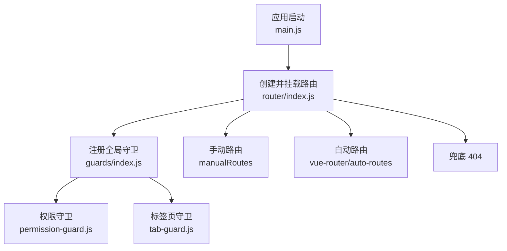
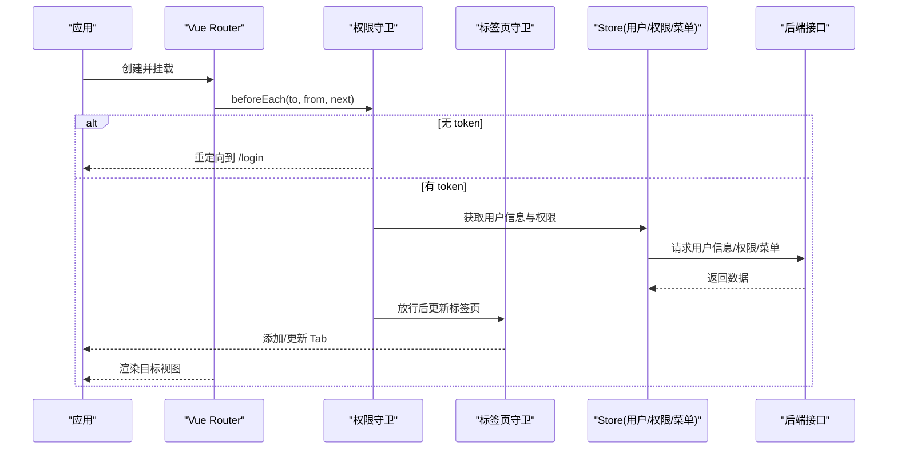
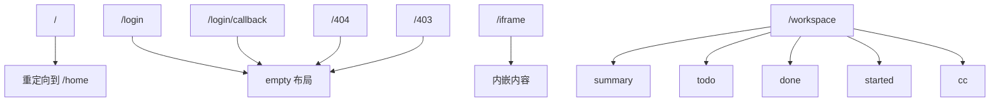
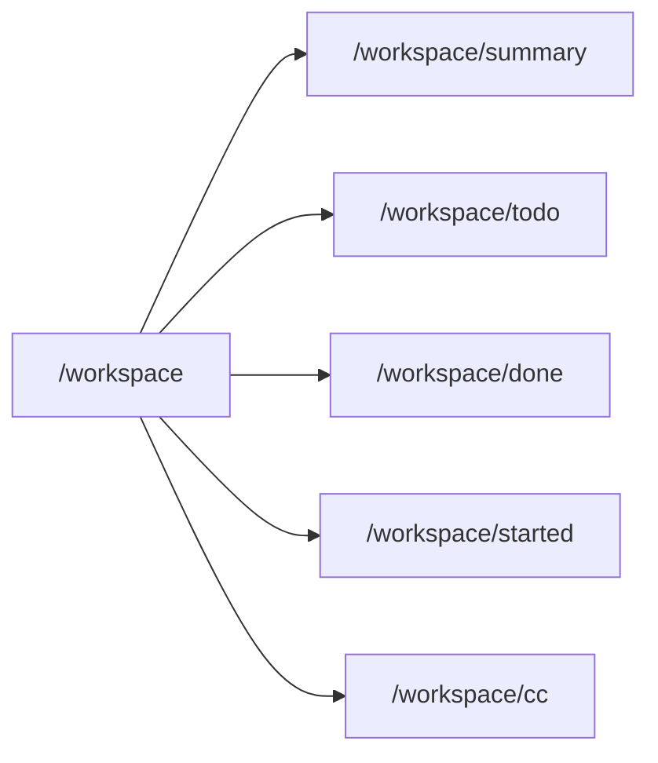
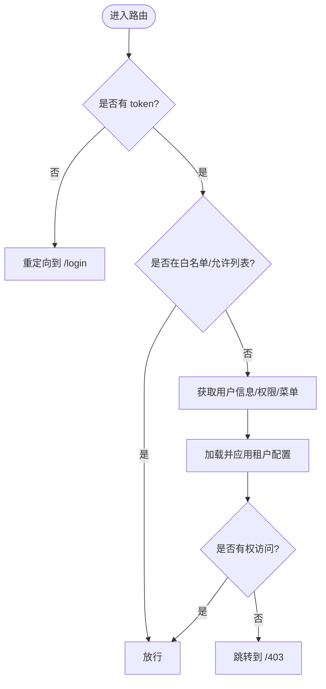
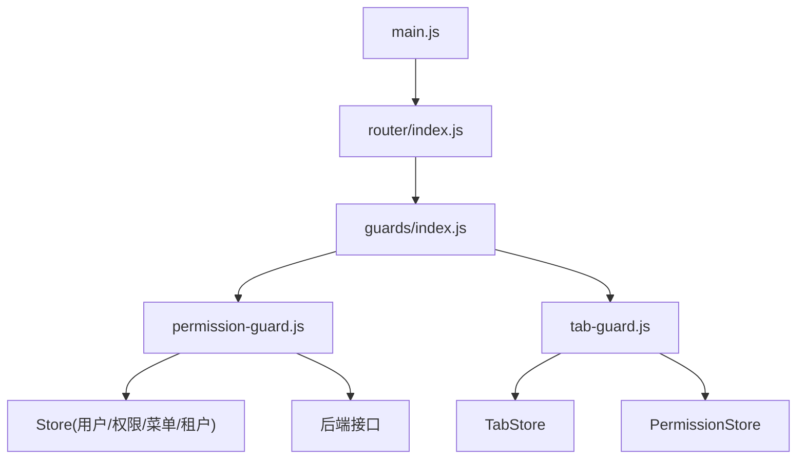

# 路由配置

<cite>
**本文引用的文件**
- [main.js](file://forge-admin-ui/src/main.js)
- [index.js](file://forge-admin-ui/src/router/index.js)
- [guards/index.js](file://forge-admin-ui/src/router/guards/index.js)
- [permission-guard.js](file://forge-admin-ui/src/router/guards/permission-guard.js)
- [tab-guard.js](file://forge-admin-ui/src/router/guards/tab-guard.js)
- [whitelist.config.js](file://forge-admin-ui/src/config/whitelist.config.js)
- [settings.js](file://forge-admin-ui/src/settings.js)
</cite>

## 目录
1. [简介](#简介)
2. [项目结构](#项目结构)
3. [核心组件](#核心组件)
4. [架构总览](#架构总览)
5. [详细组件分析](#详细组件分析)
6. [依赖关系分析](#依赖关系分析)
7. [性能考虑](#性能考虑)
8. [故障排查指南](#故障排查指南)
9. [结论](#结论)
10. [附录](#附录)

## 简介
本技术文档聚焦 Forge Admin 前端的路由配置，围绕 Vue Router 的初始化、手动路由定义与自动路由生成机制展开，系统解析 manualRoutes 数组的结构设计（登录页、SSO 回调、错误页、iframe 页面等），阐述路由元信息 meta 的设计规范（标题、布局、标签页控制等），说明嵌套路由的实现方式（如工作台模块的子路由），并总结懒加载最佳实践、重定向与参数传递策略，最后提供自定义路由配置指南与常见问题解决方案。

## 项目结构
Forge Admin 的前端路由位于 forge-admin-ui/src/router 目录下，采用“手动路由 + 自动路由 + 守卫”的组合模式：
- 入口应用通过 setupRouter 挂载路由并注册全局守卫。
- 路由定义集中在 router/index.js，包含手动路由、自动路由合并与兜底 404。
- 路由守卫按职责拆分到 guards 子目录，包括权限校验、标签页管理、页面标题与加载状态等。
- 白名单与默认设置分别位于 config/whitelist.config.js 与 settings.js。

图表来源
- [main.js:20-50](file://forge-admin-ui/src/main.js#L20-L50)
- [index.js:263-286](file://forge-admin-ui/src/router/index.js#L263-L286)
- [guards/index.js:1-12](file://forge-admin-ui/src/router/guards/index.js#L1-L12)

章节来源
- [main.js:20-50](file://forge-admin-ui/src/main.js#L20-L50)
- [index.js:263-286](file://forge-admin-ui/src/router/index.js#L263-L286)
- [guards/index.js:1-12](file://forge-admin-ui/src/router/guards/index.js#L1-L12)

## 核心组件
- 路由实例与历史模式：根据环境变量选择 Hash 或 History 模式，统一滚动行为。
- 手动路由 manualRoutes：集中声明登录、SSO 回调、错误页、iframe、个人中心、AI 动态页面、应用中心、工作区等关键路由，支持重定向、beforeEnter、meta 控制。
- 自动路由：通过 unplugin-vue-router 自动生成，基于 views 目录结构映射为路由。
- 路由守卫：权限校验、标签页管理、页面标题、加载状态。
- 白名单与默认设置：控制免登路径与布局选项。

章节来源
- [index.js:1-286](file://forge-admin-ui/src/router/index.js#L1-L286)
- [guards/index.js:1-12](file://forge-admin-ui/src/router/guards/index.js#L1-L12)
- [whitelist.config.js:1-12](file://forge-admin-ui/src/config/whitelist.config.js#L1-L12)
- [settings.js:1-115](file://forge-admin-ui/src/settings.js#L1-L115)

## 架构总览
下图展示了从应用启动到路由渲染的整体流程，以及各守卫在导航过程中的作用点。

图表来源
- [index.js:274-286](file://forge-admin-ui/src/router/index.js#L274-L286)
- [permission-guard.js:87-275](file://forge-admin-ui/src/router/guards/permission-guard.js#L87-L275)
- [tab-guard.js:71-154](file://forge-admin-ui/src/router/guards/tab-guard.js#L71-L154)

## 详细组件分析

### 手动路由 manualRoutes 结构设计
- 白名单与基础页：登录、社交登录回调、MCP 授权、404/403 错误页，均使用空布局 empty，避免框架外壳干扰。
- 首页重定向：根路径重定向至 /home，便于统一入口。
- iframe 页面：通用内嵌页面，用于承载第三方内容。
- 业务功能路由：通知公告、消息模板、个人中心、AI 动态页面、应用中心、业务流程设计器、预览与发布等。
- 嵌套路由：工作台模块作为父路由，包含汇总、待办、已办、我发起的、抄送我等子路由。
- 子系统桥接：报告子系统跳转桥接路由，用于跨系统单点登录或集成。
- 演示路由：Nexus 布局演示页面，展示特殊布局能力。

图表来源
- [index.js:24-256](file://forge-admin-ui/src/router/index.js#L24-L256)

章节来源
- [index.js:24-256](file://forge-admin-ui/src/router/index.js#L24-L256)

### 路由元信息 meta 设计规范
- title：页面标题，优先使用 meta.title；若未设置，标签页守卫会尝试从菜单或组件中推导。
- layout：布局标识，如 empty、app-portal、nexus 等，用于切换不同框架外壳。
- skipTab：是否跳过标签页创建，适用于弹窗式、全屏式或无需持久化的页面。
- keepAlive：是否启用缓存，配合 KeepAlive 提升体验。
- forceClosable/closable：控制标签页关闭行为，业务运行时页面通常强制可关闭。
- preserveOnQuery：保留查询参数语义，常用于运行态页面保持上下文。
- deprecated：标记废弃路由，便于后续清理。

章节来源
- [index.js:24-256](file://forge-admin-ui/src/router/index.js#L24-L256)
- [tab-guard.js:71-154](file://forge-admin-ui/src/router/guards/tab-guard.js#L71-L154)
- [settings.js:44-109](file://forge-admin-ui/src/settings.js#L44-L109)

### 嵌套路由实现：工作台模块
- 父路由 /workspace 作为容器，内部包含多个子路由，每个子路由对应一个具体业务视图。
- 子路由通过相对 path 定义，便于维护与扩展。
- 每个子路由独立设置 meta.title，确保标签页标题准确。

图表来源
- [index.js:205-242](file://forge-admin-ui/src/router/index.js#L205-L242)

章节来源
- [index.js:205-242](file://forge-admin-ui/src/router/index.js#L205-L242)

### 路由懒加载与自动路由
- 懒加载：所有手动路由均采用函数式 component 引入，按需加载，减少首屏体积。
- 自动路由：通过 vue-router/auto-routes 将 views 目录下的 .vue 文件自动映射为路由，降低手工维护成本。
- 开发环境打印：在 DEV 模式下输出自动路由列表，便于调试。

章节来源
- [index.js:1-3](file://forge-admin-ui/src/router/index.js#L1-L3)
- [index.js:258-261](file://forge-admin-ui/src/router/index.js#L258-L261)
- [index.js:263-286](file://forge-admin-ui/src/router/index.js#L263-L286)

### 重定向、参数传递与查询参数
- 重定向：根路径重定向到 /home；应用中心相关路由通过 redirect 函数进行参数化跳转。
- beforeEnter：用于兼容旧版数据范围参数，将 query 中的 objectId 迁移到新字段。
- 参数传递：支持 params（如 :applicationCode、:processId）与 query（如 view、title、menuKey）。
- 查询参数保留：部分运行态页面通过 preserveOnQuery 保持上下文。

章节来源
- [index.js:57-173](file://forge-admin-ui/src/router/index.js#L57-L173)
- [index.js:175-191](file://forge-admin-ui/src/router/index.js#L175-L191)

### 路由守卫详解

#### 权限守卫（permission-guard）
- 白名单与允许列表：对 /login、/home、/profile、/mcp-authorize、/403 及 /workspace 前缀进行放行。
- Token 校验：无 token 时重定向到 /login，并携带 redirect 以便登录后回跳。
- 用户信息与权限初始化：首次进入时并行拉取用户信息、权限与菜单，必要时强制修改密码。
- 租户配置：根据用户租户加载并应用主题与行为配置。
- 访问控制：基于权限 store 的 accessRoutes 判断目标路由是否可访问，否则跳转到 /403。
- 异常恢复：在失败时调用恢复逻辑，避免死锁。

图表来源
- [permission-guard.js:87-275](file://forge-admin-ui/src/router/guards/permission-guard.js#L87-L275)

章节来源
- [permission-guard.js:87-275](file://forge-admin-ui/src/router/guards/permission-guard.js#L87-L275)
- [whitelist.config.js:1-12](file://forge-admin-ui/src/config/whitelist.config.js#L1-L12)

#### 标签页守卫（tab-guard）
- 离开确认：当当前标签页存在未保存变更时，提示用户确认后再导航。
- 排除页面：登录、回调、错误页等不加入标签页。
- 标题推导：优先使用 meta.title，其次从菜单查找，最后尝试从组件读取。
- 标签页控制：根据 meta.skipTab、forceClosable、closable 控制标签页行为。
- 活动标签：每次导航后更新活动标签。

章节来源
- [tab-guard.js:1-154](file://forge-admin-ui/src/router/guards/tab-guard.js#L1-L154)

#### 页面标题与加载守卫
- 页面标题：在导航过程中同步更新浏览器标题，保证用户体验一致。
- 页面加载：在路由切换期间显示加载状态，提升感知性能。

章节来源
- [guards/index.js:1-12](file://forge-admin-ui/src/router/guards/index.js#L1-L12)

### 白名单与默认设置
- 白名单：/login、/login/callback、/404 无需登录即可访问。
- 默认布局：提供多种布局选项（normal、top-menu、full、empty、app-portal、nexus 等），并通过 normalizeLayout 规范化。

章节来源
- [whitelist.config.js:1-12](file://forge-admin-ui/src/config/whitelist.config.js#L1-L12)
- [settings.js:1-115](file://forge-admin-ui/src/settings.js#L1-L115)

## 依赖关系分析
- 应用启动依赖 main.js 完成主题、指令、存储、路由与全局 UI 的初始化顺序。
- 路由实例依赖自动路由与手动路由合并，并在挂载后注册守卫。
- 权限守卫依赖 Store（用户、权限、菜单、租户）、API 与加密密钥交换。
- 标签页守卫依赖 TabStore 与 PermissionStore，用于标题与关闭行为控制。

图表来源
- [main.js:20-50](file://forge-admin-ui/src/main.js#L20-L50)
- [index.js:274-286](file://forge-admin-ui/src/router/index.js#L274-L286)
- [guards/index.js:1-12](file://forge-admin-ui/src/router/guards/index.js#L1-L12)
- [permission-guard.js:87-275](file://forge-admin-ui/src/router/guards/permission-guard.js#L87-L275)
- [tab-guard.js:71-154](file://forge-admin-ui/src/router/guards/tab-guard.js#L71-L154)

章节来源
- [main.js:20-50](file://forge-admin-ui/src/main.js#L20-L50)
- [index.js:274-286](file://forge-admin-ui/src/router/index.js#L274-L286)
- [guards/index.js:1-12](file://forge-admin-ui/src/router/guards/index.js#L1-L12)

## 性能考虑
- 懒加载：所有手动路由使用函数式组件引入，按需加载，降低首屏包体。
- 自动路由：基于文件约定生成路由，减少重复代码与维护成本。
- 并行初始化：权限守卫中并行拉取用户信息与权限，缩短等待时间。
- 滚动行为：统一滚动到顶部，避免页面抖动。
- 标签页缓存：通过 keepAlive 减少重复渲染开销。

[本节为通用性能建议，不直接分析具体文件]

## 故障排查指南
- 无法访问页面：检查权限守卫是否放行，确认白名单与允许列表；查看权限 store 的 accessRoutes 是否包含目标路径。
- 登录后循环跳转：检查 /login 处理逻辑与 redirect 参数；确认 token 验证失败时的恢复流程。
- 标签页标题不正确：确认 meta.title 设置；检查菜单中是否存在匹配项；必要时在组件中暴露 title。
- 404 兜底触发：确认路由定义是否正确；检查自动路由是否生效；核对路径规范化逻辑。
- 租户配置未生效：确认用户租户 ID 正确；检查租户配置加载与应用流程。

章节来源
- [permission-guard.js:87-275](file://forge-admin-ui/src/router/guards/permission-guard.js#L87-L275)
- [tab-guard.js:71-154](file://forge-admin-ui/src/router/guards/tab-guard.js#L71-L154)
- [index.js:263-286](file://forge-admin-ui/src/router/index.js#L263-L286)

## 结论
Forge Admin 的路由体系以“手动路由 + 自动路由 + 守卫”为核心，兼顾灵活性与可维护性。manualRoutes 覆盖关键业务场景，meta 规范统一了标题、布局与标签页行为；权限守卫保障安全与资源隔离，标签页守卫提升多任务体验。结合懒加载与自动路由，系统在性能与开发效率之间取得良好平衡。

[本节为总结性内容，不直接分析具体文件]

## 附录

### 自定义路由配置指南
- 新增手动路由：在 manualRoutes 中添加路由对象，设置 name、path、component（懒加载）、meta（title、layout、skipTab 等）。
- 嵌套路由：在父路由下定义 children 数组，使用相对 path，并为每个子路由设置独立 meta。
- 重定向：使用 redirect 属性或函数，支持参数化跳转与查询参数传递。
- 白名单：如需免登访问，将路径加入 whitelist.config.js 的 WHITE_LIST。
- 布局：通过 meta.layout 指定布局，参考 settings.js 中的可用布局名称。

章节来源
- [index.js:24-256](file://forge-admin-ui/src/router/index.js#L24-L256)
- [whitelist.config.js:1-12](file://forge-admin-ui/src/config/whitelist.config.js#L1-L12)
- [settings.js:44-109](file://forge-admin-ui/src/settings.js#L44-L109)

### 常见问题与解决方案
- 问题：访问 /workspace 子路由时标签页标题为空
  - 解决：确保子路由 meta.title 设置完整；或在菜单中补充对应 label。
- 问题：应用中心路由跳转后丢失查询参数
  - 解决：使用 preserveOnQuery 或在 redirect 函数中显式合并 query。
- 问题：错误页 404 频繁出现
  - 解决：检查路由定义与自动路由映射；确认路径规范化逻辑未误判。
- 问题：登录后仍被重定向到登录页
  - 解决：检查 token 有效性；确认权限守卫中用户信息初始化成功。

章节来源
- [index.js:205-242](file://forge-admin-ui/src/router/index.js#L205-L242)
- [index.js:263-286](file://forge-admin-ui/src/router/index.js#L263-L286)
- [permission-guard.js:87-275](file://forge-admin-ui/src/router/guards/permission-guard.js#L87-L275)