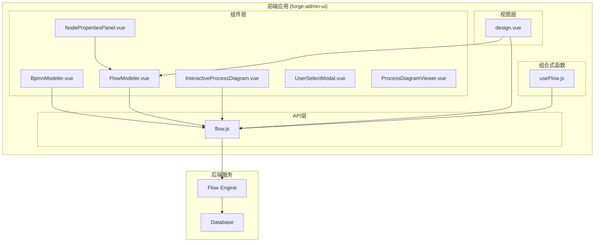
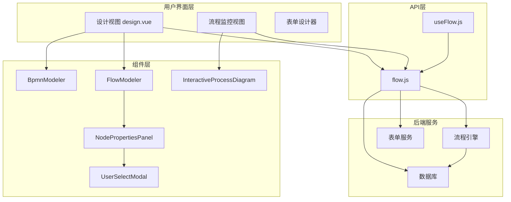
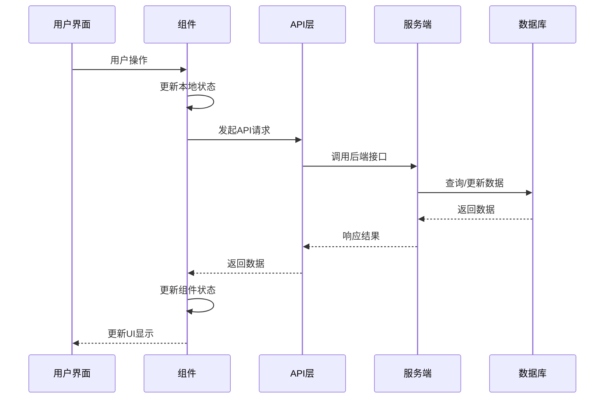
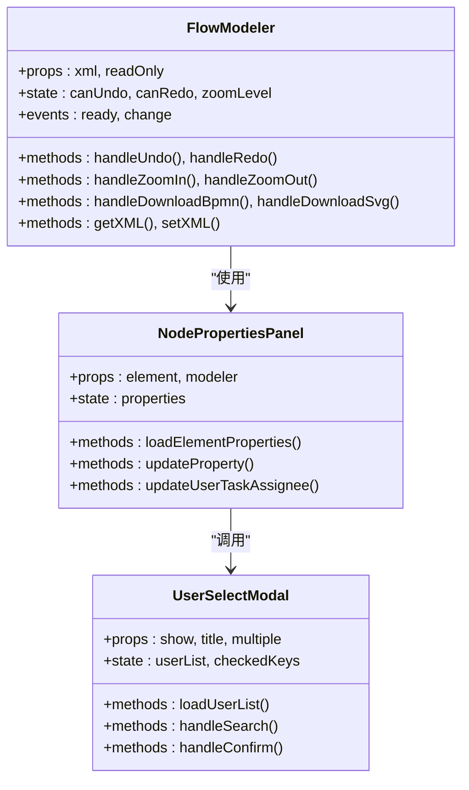
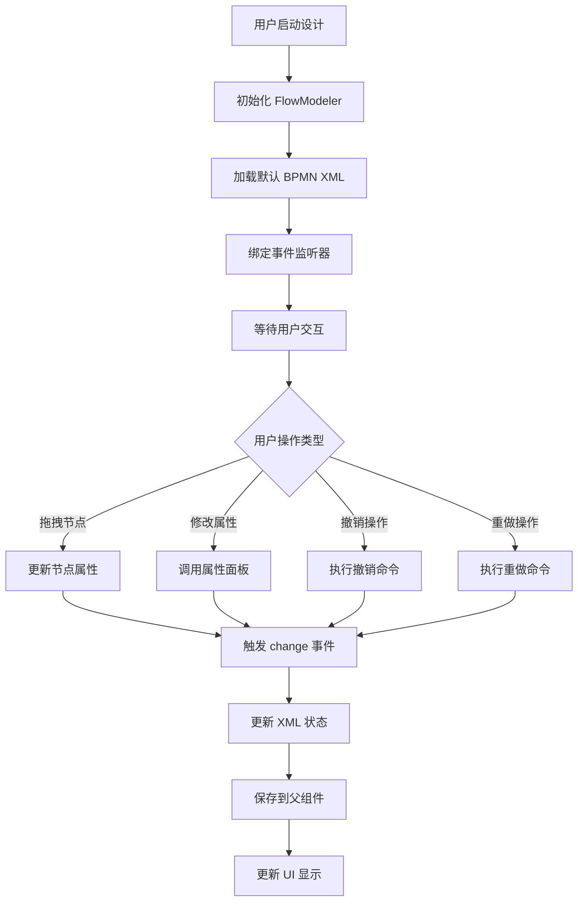
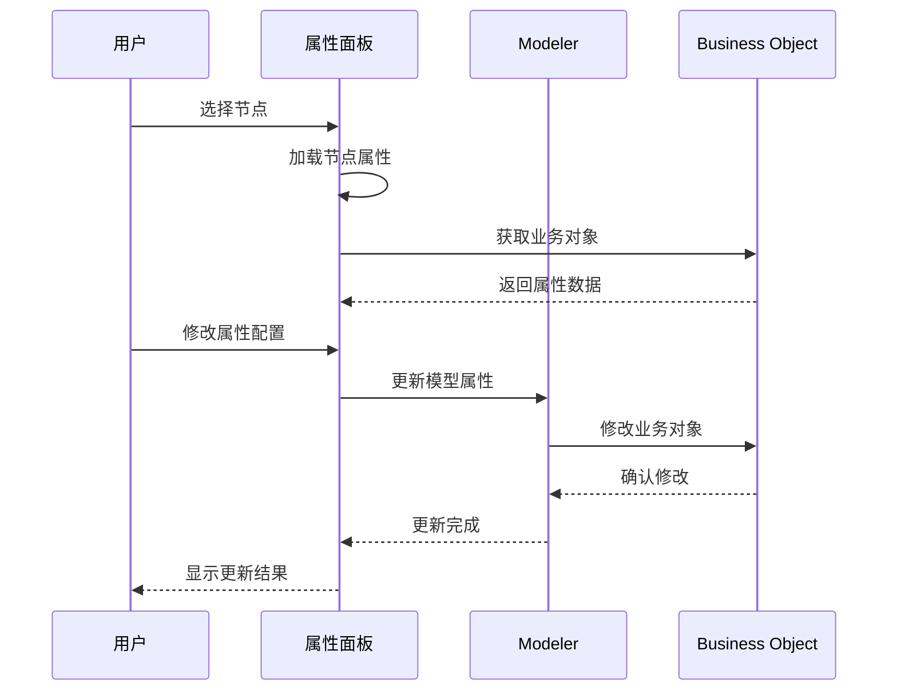
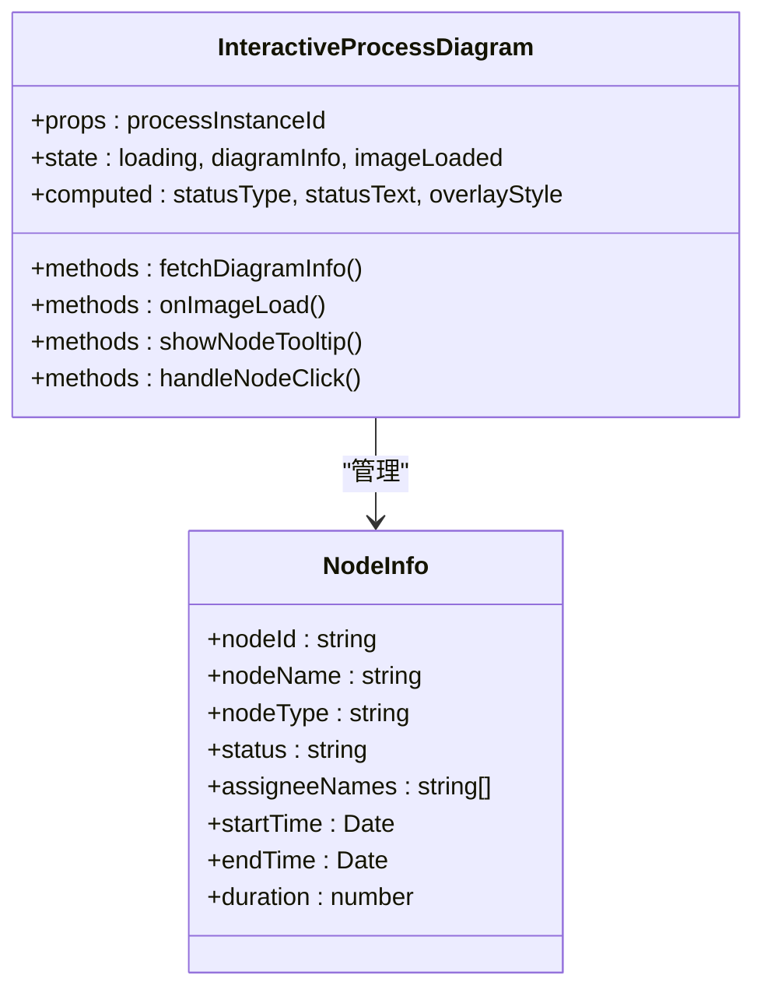
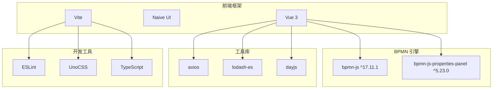
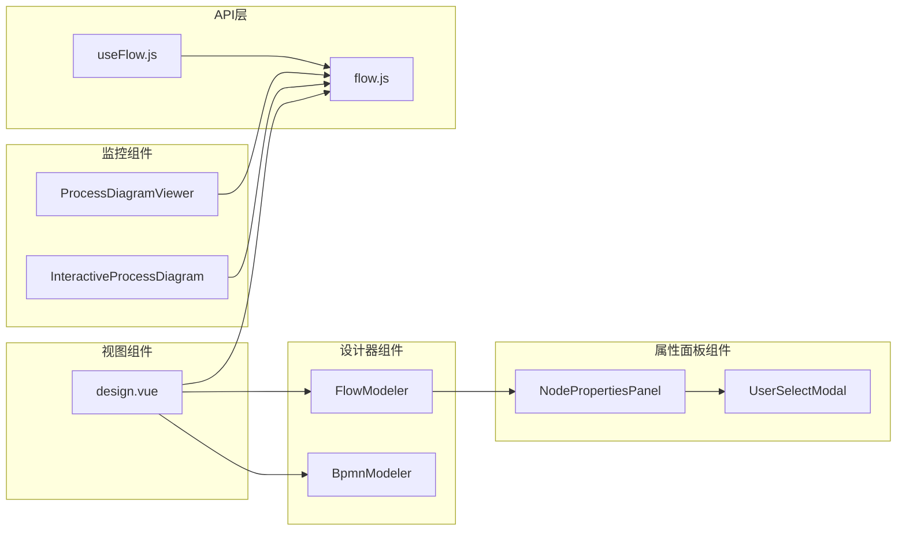

# BPMN流程设计器

<cite>
**本文档引用的文件**
- [BpmnModeler.vue](file://forge-admin-ui/src/components/bpmn/BpmnModeler.vue)
- [FlowModeler.vue](file://forge-admin-ui/src/components/bpmn/FlowModeler.vue)
- [InteractiveProcessDiagram.vue](file://forge-admin-ui/src/components/bpmn/InteractiveProcessDiagram.vue)
- [NodePropertiesPanel.vue](file://forge-admin-ui/src/components/bpmn/NodePropertiesPanel.vue)
- [UserSelectModal.vue](file://forge-admin-ui/src/components/bpmn/UserSelectModal.vue)
- [ProcessDiagramViewer.vue](file://forge-admin-ui/src/components/bpmn/ProcessDiagramViewer.vue)
- [flowable-moddle.json](file://forge-admin-ui/src/components/bpmn/flowable-moddle.json)
- [design.vue](file://forge-admin-ui/src/views/flow/design.vue)
- [flow.js](file://forge-admin-ui/src/api/flow.js)
- [useFlow.js](file://forge-admin-ui/src/composables/useFlow.js)
- [package.json](file://forge-admin-ui/package.json)
</cite>

## 目录
1. [项目概述](#项目概述)
2. [项目结构](#项目结构)
3. [核心组件](#核心组件)
4. [架构概览](#架构概览)
5. [详细组件分析](#详细组件分析)
6. [依赖关系分析](#依赖关系分析)
7. [性能考虑](#性能考虑)
8. [故障排除指南](#故障排除指南)
9. [结论](#结论)

## 项目概述

BPMN流程设计器是一个基于Vue 3和bpmn-js技术栈开发的企业级流程设计平台。该系统提供了完整的BPMN 2.0流程设计、可视化展示和流程管理功能，支持复杂的业务流程建模和执行监控。

### 主要特性

- **可视化流程设计**：提供直观的拖拽式流程设计器
- **多格式支持**：支持BPMN XML、SVG等多种格式导出
- **实时预览**：设计过程中实时预览流程效果
- **流程监控**：实时监控流程执行状态和节点状态
- **用户任务管理**：支持多种用户任务类型和审批流程
- **表单集成**：内置表单设计器与流程深度集成

## 项目结构

**图表来源**
- [BpmnModeler.vue:1-621](file://forge-admin-ui/src/components/bpmn/BpmnModeler.vue#L1-L621)
- [FlowModeler.vue:1-582](file://forge-admin-ui/src/components/bpmn/FlowModeler.vue#L1-L582)
- [design.vue:1-626](file://forge-admin-ui/src/views/flow/design.vue#L1-L626)

**章节来源**
- [BpmnModeler.vue:1-621](file://forge-admin-ui/src/components/bpmn/BpmnModeler.vue#L1-L621)
- [FlowModeler.vue:1-582](file://forge-admin-ui/src/components/bpmn/FlowModeler.vue#L1-L582)
- [design.vue:1-626](file://forge-admin-ui/src/views/flow/design.vue#L1-L626)

## 核心组件

### 流程设计器组件

系统提供了两个主要的流程设计器组件，分别针对不同的使用场景：

#### BpmnModeler 组件
- **功能**：基础流程设计器，提供核心的BPMN建模功能
- **特点**：简洁界面，专注于流程设计的核心功能
- **适用场景**：需要快速创建和编辑BPMN流程的场景

#### FlowModeler 组件  
- **功能**：增强版流程设计器，包含完整的属性面板和工具集
- **特点**：提供丰富的节点属性配置和交互功能
- **适用场景**：复杂业务流程设计和精细化配置需求

**章节来源**
- [BpmnModeler.vue:146-547](file://forge-admin-ui/src/components/bpmn/BpmnModeler.vue#L146-L547)
- [FlowModeler.vue:147-498](file://forge-admin-ui/src/components/bpmn/FlowModeler.vue#L147-L498)

### 流程监控组件

#### InteractiveProcessDiagram 组件
- **功能**：交互式流程图展示，实时显示流程执行状态
- **特点**：支持节点状态高亮、鼠标悬停查看详情、节点点击事件
- **适用场景**：流程执行监控和状态展示

#### ProcessDiagramViewer 组件
- **功能**：只读流程图查看器，专注于流程图的静态展示
- **特点**：轻量级设计，专注于流程图的清晰展示
- **适用场景**：流程文档展示和静态查看

**章节来源**
- [InteractiveProcessDiagram.vue:1-683](file://forge-admin-ui/src/components/bpmn/InteractiveProcessDiagram.vue#L1-L683)
- [ProcessDiagramViewer.vue:1-639](file://forge-admin-ui/src/components/bpmn/ProcessDiagramViewer.vue#L1-L639)

## 架构概览

**图表来源**
- [design.vue:190-194](file://forge-admin-ui/src/views/flow/design.vue#L190-L194)
- [flow.js:1-482](file://forge-admin-ui/src/api/flow.js#L1-L482)
- [useFlow.js:1-372](file://forge-admin-ui/src/composables/useFlow.js#L1-L372)

### 数据流架构

**图表来源**
- [flow.js:1-482](file://forge-admin-ui/src/api/flow.js#L1-L482)
- [design.vue:445-449](file://forge-admin-ui/src/views/flow/design.vue#L445-L449)

## 详细组件分析

### FlowModeler 组件详解

FlowModeler 是系统中最复杂的组件，提供了完整的流程设计功能。

#### 核心功能模块

**图表来源**
- [FlowModeler.vue:147-498](file://forge-admin-ui/src/components/bpmn/FlowModeler.vue#L147-L498)
- [NodePropertiesPanel.vue:498-794](file://forge-admin-ui/src/components/bpmn/NodePropertiesPanel.vue#L498-L794)
- [UserSelectModal.vue:82-267](file://forge-admin-ui/src/components/bpmn/UserSelectModal.vue#L82-L267)

#### 流程设计工作流

**图表来源**
- [FlowModeler.vue:229-289](file://forge-admin-ui/src/components/bpmn/FlowModeler.vue#L229-L289)
- [FlowModeler.vue:445-464](file://forge-admin-ui/src/components/bpmn/FlowModeler.vue#L445-L464)

**章节来源**
- [FlowModeler.vue:1-582](file://forge-admin-ui/src/components/bpmn/FlowModeler.vue#L1-L582)
- [NodePropertiesPanel.vue:1-800](file://forge-admin-ui/src/components/bpmn/NodePropertiesPanel.vue#L1-L800)
- [UserSelectModal.vue:1-289](file://forge-admin-ui/src/components/bpmn/UserSelectModal.vue#L1-L289)

### 节点属性面板组件

节点属性面板提供了针对不同节点类型的详细配置选项。

#### 支持的节点类型

| 节点类型 | 功能特性 | 配置选项 |
|---------|----------|----------|
| 开始节点 | 发起人变量、表单配置 | 发起人变量、表单Key |
| 用户任务 | 审批设置、表单配置 | 任务类型、审批人、表单类型 |
| 服务任务 | 实现方式、异步执行 | 实现类型、类名/表达式 |
| 排他网关 | 路径选择 | 条件表达式 |
| 序列流 | 流转条件 | 条件类型、表达式 |

#### 属性配置流程

**图表来源**
- [NodePropertiesPanel.vue:793-800](file://forge-admin-ui/src/components/bpmn/NodePropertiesPanel.vue#L793-L800)

**章节来源**
- [NodePropertiesPanel.vue:84-330](file://forge-admin-ui/src/components/bpmn/NodePropertiesPanel.vue#L84-L330)

### 流程监控组件

#### InteractiveProcessDiagram 组件

**图表来源**
- [InteractiveProcessDiagram.vue:147-438](file://forge-admin-ui/src/components/bpmn/InteractiveProcessDiagram.vue#L147-L438)

#### 节点状态管理

| 状态类型 | 颜色标识 | 动画效果 | 描述 |
|---------|----------|----------|------|
| completed | 绿色 | ✓ | 已完成节点 |
| running | 橙色 | 脉冲动画 | 正在处理节点 |
| pending | 灰色 | - | 待处理节点 |
| skipped | 蓝色 | - | 已跳过节点 |

**章节来源**
- [InteractiveProcessDiagram.vue:1-683](file://forge-admin-ui/src/components/bpmn/InteractiveProcessDiagram.vue#L1-L683)

## 依赖关系分析

### 技术栈依赖

**图表来源**
- [package.json:15-52](file://forge-admin-ui/package.json#L15-L52)

### 组件间依赖关系

**图表来源**
- [design.vue:239-241](file://forge-admin-ui/src/views/flow/design.vue#L239-L241)
- [flow.js:1-482](file://forge-admin-ui/src/api/flow.js#L1-L482)

**章节来源**
- [package.json:1-81](file://forge-admin-ui/package.json#L1-L81)
- [design.vue:1-626](file://forge-admin-ui/src/views/flow/design.vue#L1-L626)

## 性能考虑

### 流程设计器性能优化

1. **虚拟滚动**：对于大量节点的流程图，采用虚拟滚动技术减少DOM节点数量
2. **懒加载**：组件按需加载，减少初始包体积
3. **事件节流**：对频繁触发的事件进行节流处理
4. **内存管理**：及时销毁不再使用的组件实例和事件监听器

### 流程监控性能优化

1. **增量更新**：只更新发生变化的节点状态
2. **防抖机制**：对鼠标移动等高频事件进行防抖处理
3. **图片缓存**：流程图图片采用浏览器缓存机制
4. **状态压缩**：对流程状态数据进行压缩存储

## 故障排除指南

### 常见问题及解决方案

#### 流程设计器无法加载

**问题症状**：设计器空白或报错
**可能原因**：
- BPMN XML格式不正确
- 依赖库加载失败
- 浏览器兼容性问题

**解决步骤**：
1. 检查控制台错误信息
2. 验证BPMN XML格式
3. 确认网络连接正常
4. 清除浏览器缓存

#### 节点属性配置无效

**问题症状**：修改节点属性后不生效
**可能原因**：
- 业务对象更新失败
- 事件监听器未正确绑定
- 权限不足

**解决步骤**：
1. 检查API响应状态
2. 验证用户权限
3. 重新初始化组件
4. 查看后端日志

#### 流程监控数据不更新

**问题症状**：流程状态显示异常
**可能原因**：
- WebSocket连接断开
- 数据同步延迟
- 缓存数据过期

**解决步骤**：
1. 检查网络连接状态
2. 重新建立WebSocket连接
3. 清除本地缓存
4. 手动刷新数据

**章节来源**
- [FlowModeler.vue:310-314](file://forge-admin-ui/src/components/bpmn/FlowModeler.vue#L310-L314)
- [InteractiveProcessDiagram.vue:241-272](file://forge-admin-ui/src/components/bpmn/InteractiveProcessDiagram.vue#L241-L272)

## 结论

BPMN流程设计器是一个功能完整、架构清晰的企业级流程设计平台。系统采用现代化的技术栈，提供了丰富的流程设计和监控功能，能够满足企业复杂的业务流程管理需求。

### 系统优势

1. **技术先进**：基于Vue 3和最新的bpmn-js技术
2. **功能完整**：涵盖流程设计、监控、管理的全流程
3. **用户体验**：直观的界面设计和流畅的操作体验
4. **扩展性强**：模块化架构便于功能扩展和定制

### 发展方向

1. **移动端适配**：增强移动端的流程设计能力
2. **AI辅助设计**：引入AI技术辅助流程设计
3. **云端部署**：提供云端版本支持多租户
4. **生态集成**：与其他企业系统深度集成

该系统为企业数字化转型提供了强有力的工具支撑，能够显著提升业务流程的标准化和自动化水平。